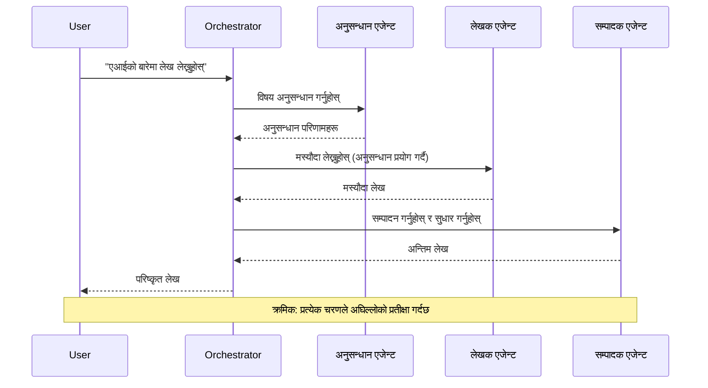
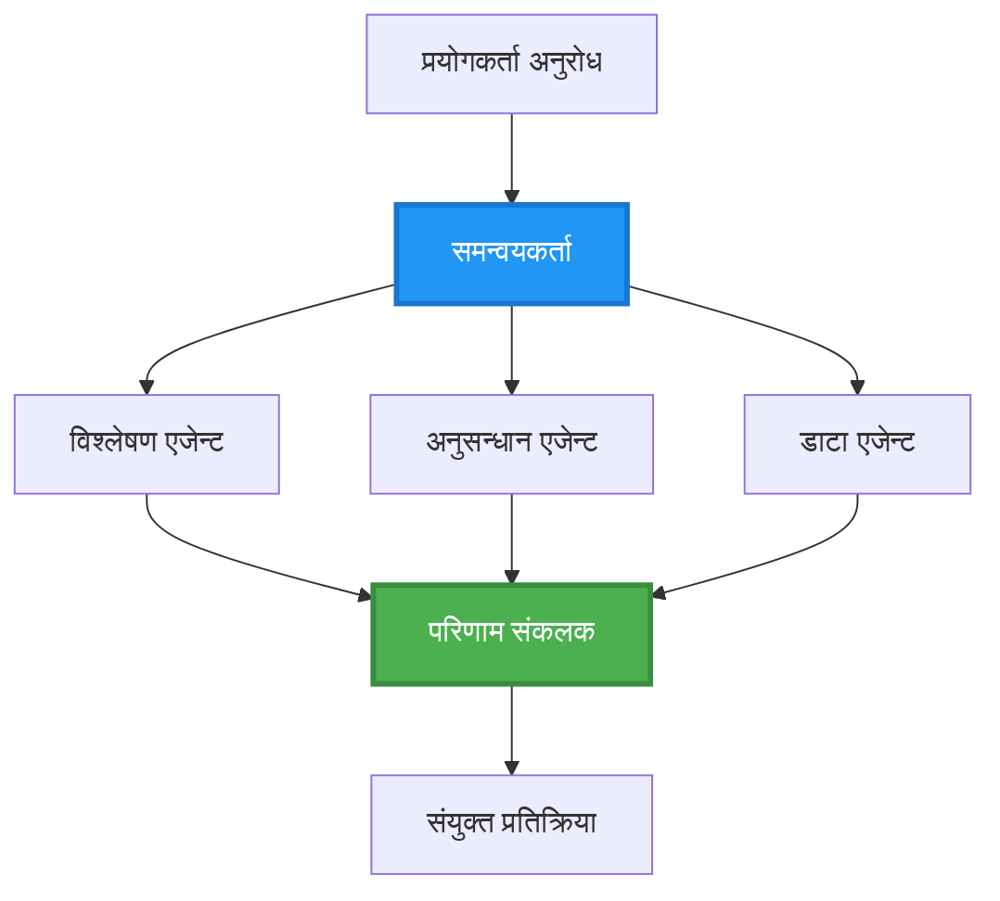
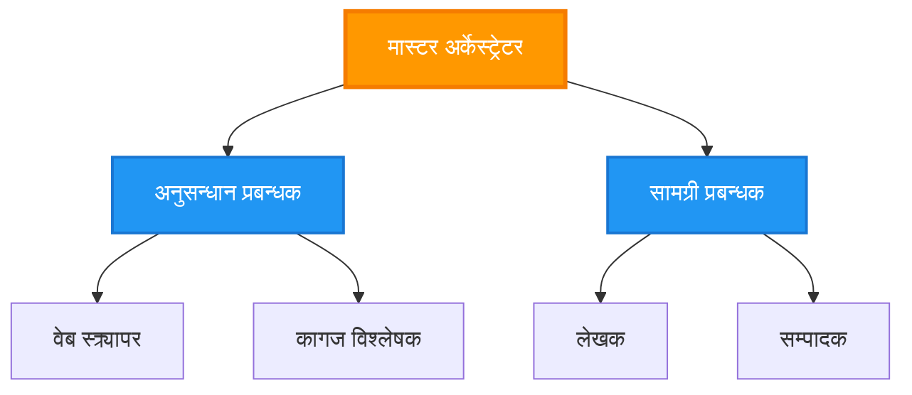
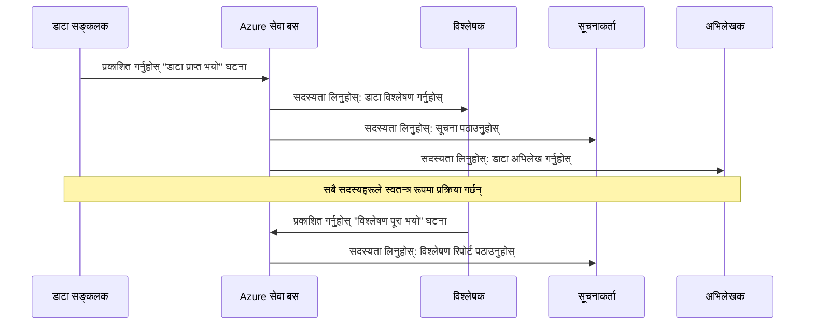
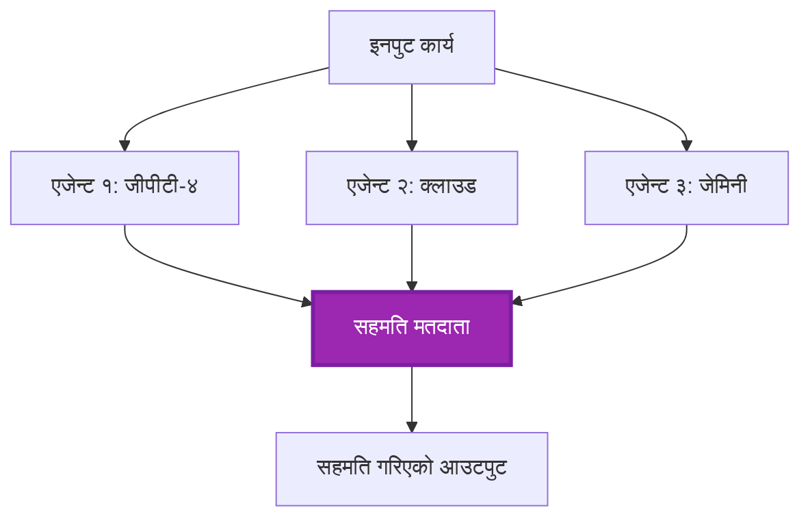
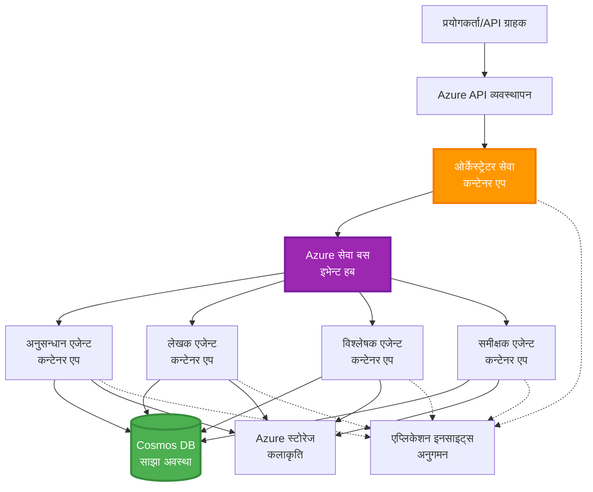

# बहु-एजेन्ट समन्वय ढाँचाहरू

⏱️ **अनुमानित समय**: ६०-७५ मिनेट | 💰 **अनुमानित लागत**: ~$१००-३००/महिना | ⭐ **जटिलता**: उन्नत

**📚 सिकाइ मार्ग:**
- ← अघिल्लो: [क्षमता योजना](capacity-planning.md) - स्रोतको आकार र स्केलिङ रणनीतिहरू
- 🎯 **तपाईं यहाँ हुनुहुन्छ**: बहु-एजेन्ट समन्वय ढाँचाहरू (समन्वय, सञ्चार, अवस्था व्यवस्थापन)
- → अर्को: [SKU चयन](sku-selection.md) - सही Azure सेवाहरू छनोट गर्ने
- 🏠 [पाठ गृह](../../README.md)

---

## तपाईंले के सिक्नुहुनेछ

यो पाठ पूरा गरेर, तपाईं:
- **बहु-एजेन्ट आर्किटेक्चर** ढाँचाहरू बुझ्नुहुनेछ र तिनीहरू कहिले प्रयोग गर्ने
- **समन्वय ढाँचाहरू** कार्यान्वयन गर्नुहोस् (केन्द्रित, विकेन्द्रित, पदानुक्रमित)
- **एजेन्ट सञ्चार** रणनीतिहरू डिजाइन गर्नुहोस् (समकालिक, असमकालिक, घटना-आधारित)
- वितरित एजेन्टहरू बीच **साझा अवस्था** व्यवस्थापन गर्नुहोस्
- AZD को साथ **बहु-एजेन्ट प्रणालीहरू** Azure मा तैनाथ गर्नुहोस्
- वास्तविक-विश्व AI परिदृश्यहरूको लागि **समन्वय ढाँचाहरू** लागू गर्नुहोस्
- वितरित एजेन्ट प्रणालीहरू अनुगमन र डिबग गर्नुहोस्

## किन बहु-एजेन्ट समन्वय महत्त्वपूर्ण छ

### विकास: एकल एजेन्टबाट बहु-एजेन्टसम्म

**एकल एजेन्ट (सरल):**
```
User → Agent → Response
```
- ✅ बुझ्न र कार्यान्वयन गर्न सजिलो
- ✅ साधारण कार्यहरूको लागि छिटो
- ❌ एकल मोडेलको क्षमताले सीमित
- ❌ जटिल कार्यहरू समानान्तर गर्न सक्दैन
- ❌ कुनै विशेषज्ञता छैन

**बहु-एजेन्ट प्रणाली (उन्नत):**
```
           ┌─────────────┐
           │ Orchestrator│
           └──────┬──────┘
        ┌─────────┼─────────┐
        │         │         │
    ┌───▼──┐  ┌──▼───┐  ┌──▼────┐
    │Agent1│  │Agent2│  │Agent3 │
    │(Plan)│  │(Code)│  │(Review)│
    └──────┘  └──────┘  └───────┘
```
- ✅ विशिष्ट कार्यहरूको लागि विशेषज्ञ एजेन्टहरू
- ✅ गति को लागि समानान्तर कार्यान्वयन
- ✅ मोड्युलर र मर्मतयोग्य
- ✅ जटिल कार्यप्रवाहहरूमा राम्रो
- ⚠️ समन्वय तर्क आवश्यक छ

**उदाहरण**: एकल एजेन्ट भनेको सबै कार्यहरू गर्ने एक व्यक्तिको जस्तै हो। बहु-एजेन्ट भनेको प्रत्येक सदस्यसँग विशेष सीप (अनुसन्धानकर्ता, कोडर, समीक्षक, लेखक) भएको टोली जस्तै हो, जसले सँगै काम गर्छ।

---

## मुख्य समन्वय ढाँचाहरू

### ढाँचा १: अनुक्रमिक समन्वय (जिम्मेवारीको श्रृंखला)

**कहिले प्रयोग गर्ने**: कार्यहरू विशेष आदेशमा पूरा गर्नुपर्छ, प्रत्येक एजेन्टले अघिल्लो उत्पादनमा निर्माण गर्दछ।


**फाइदाहरू:**
- ✅ स्पष्ट डाटा प्रवाह
- ✅ डिबग गर्न सजिलो
- ✅ पूर्वानुमान योग्य कार्यान्वयन क्रम

**सीमाहरू:**
- ❌ ढिलो (कुनै समानान्तरता छैन)
- ❌ एक असफलताले सम्पूर्ण श्रृंखला अवरुद्ध गर्दछ
- ❌ परस्पर निर्भर कार्यहरू ह्यान्डल गर्न सक्दैन

**उदाहरण प्रयोग केसहरू:**
- सामग्री सिर्जना पाइपलाइन (अनुसन्धान → लेख्नुहोस् → सम्पादन गर्नुहोस् → प्रकाशित गर्नुहोस्)
- कोड उत्पादन (योजना → कार्यान्वयन → परीक्षण → तैनाथ)
- प्रतिवेदन उत्पादन (डाटा सङ्कलन → विश्लेषण → दृश्यता → सारांश)

---

### ढाँचा २: समानान्तर समन्वय (फ्यान-आउट/फ्यान-इन)

**कहिले प्रयोग गर्ने**: स्वतन्त्र कार्यहरू एकै समयमा चल्न सक्छन्, परिणामहरू अन्तमा संयोजन गरिन्छ।


**फाइदाहरू:**
- ✅ छिटो (समानान्तर कार्यान्वयन)
- ✅ गल्ती-सहनशील (आंशिक परिणाम स्वीकार्य)
- ✅ तेर्सो रूपमा स्केल हुन्छ

**सीमाहरू:**
- ⚠️ परिणामहरू क्रमबाहिर आउन सक्छन्
- ⚠️ समग्र तर्क आवश्यक छ
- ⚠️ जटिल अवस्था व्यवस्थापन

**उदाहरण प्रयोग केसहरू:**
- बहु-स्रोत डाटा सङ्कलन (API + डेटाबेस + वेब स्क्र्यापिङ)
- प्रतिस्पर्धात्मक विश्लेषण (धेरै मोडेलहरूले समाधान उत्पन्न गर्छन्, उत्कृष्ट चयन गरिन्छ)
- अनुवाद सेवाहरू (एकै समयमा धेरै भाषाहरूमा अनुवाद गर्नुहोस्)

---

### ढाँचा ३: पदानुक्रमित समन्वय (प्रबन्धक-कर्मचारी)

**कहिले प्रयोग गर्ने**: उप-कार्यहरू सहित जटिल कार्यप्रवाहहरू, प्रतिनिधित्व आवश्यक छ।


**फाइदाहरू:**
- ✅ जटिल कार्यप्रवाहहरू ह्यान्डल गर्दछ
- ✅ मोड्युलर र मर्मतयोग्य
- ✅ स्पष्ट जिम्मेवारी सीमाहरू

**सीमाहरू:**
- ⚠️ थप जटिल आर्किटेक्चर
- ⚠️ उच्च विलम्बता (धेरै समन्वय तहहरू)
- ⚠️ परिष्कृत समन्वय आवश्यक छ

**उदाहरण प्रयोग केसहरू:**
- उद्यम दस्तावेज प्रशोधन (वर्गीकृत गर्नुहोस् → मार्ग → प्रक्रिया → अभिलेख)
- बहु-चरण डाटा पाइपलाइनहरू (सङ्कलन गर्नुहोस् → सफा गर्नुहोस् → रूपान्तरण गर्नुहोस् → विश्लेषण गर्नुहोस् → प्रतिवेदन)
- जटिल स्वचालन कार्यप्रवाहहरू (योजना → स्रोत आवंटन → कार्यान्वयन → अनुगमन)

---

### ढाँचा ४: घटना-आधारित समन्वय (प्रकाशन-सदस्यता)

**कहिले प्रयोग गर्ने**: एजेन्टहरूले घटनाहरूमा प्रतिक्रिया दिन आवश्यक छ, ढीला युग्मन चाहिन्छ।


**फाइदाहरू:**
- ✅ एजेन्टहरू बीच ढीला युग्मन
- ✅ नयाँ एजेन्टहरू थप्न सजिलो (सिर्फ सदस्यता लिनुहोस्)
- ✅ असमकालिक प्रशोधन
- ✅ लचिलो (सन्देश स्थायित्व)

**सीमाहरू:**
- ⚠️ अन्ततः स्थिरता
- ⚠️ जटिल डिबगिङ
- ⚠️ सन्देश क्रमबद्धता चुनौतीहरू

**उदाहरण प्रयोग केसहरू:**
- वास्तविक-समय अनुगमन प्रणालीहरू (सतर्कता, ड्यासबोर्ड, लगहरू)
- बहु-च्यानल सूचनाहरू (इमेल, एसएमएस, पुश, स्ल्याक)
- डाटा प्रशोधन पाइपलाइनहरू (उही डाटाका धेरै उपभोक्ताहरू)

---

### ढाँचा ५: सहमति-आधारित समन्वय (मतदान/क्वोरम)

**कहिले प्रयोग गर्ने**: अघि बढ्नु अघि धेरै एजेन्टहरूको सहमति आवश्यक छ।


**फाइदाहरू:**
- ✅ उच्च सटीकता (धेरै रायहरू)
- ✅ गल्ती-सहनशील (अल्पसंख्यक असफलताहरू स्वीकार्य)
- ✅ गुणस्तर आश्वासन निर्मित

**सीमाहरू:**
- ❌ महँगो (धेरै मोडेल कलहरू)
- ❌ ढिलो (सबै एजेन्टहरूको प्रतीक्षा गर्दै)
- ⚠️ द्वन्द्व समाधान आवश्यक

**उदाहरण प्रयोग केसहरू:**
- सामग्री संयम (धेरै मोडेलहरूले सामग्री समीक्षा गर्छन्)
- कोड समीक्षा (धेरै लिन्टर/विश्लेषकहरू)
- चिकित्सा निदान (धेरै AI मोडेलहरू, विशेषज्ञ मान्यता)

---

## आर्किटेक्चर अवलोकन

### Azure मा पूर्ण बहु-एजेन्ट प्रणाली


**मुख्य घटकहरू:**

| घटक | उद्देश्य | Azure सेवा |
|-----------|---------|---------------|
| **API गेटवे** | प्रवेश बिन्दु, दर सीमित, प्रमाणीकरण | API व्यवस्थापन |
| **समन्वयकर्ता** | एजेन्ट कार्यप्रवाहहरू समन्वय गर्दछ | कन्टेनर एप्स |
| **सन्देश पङ्क्ति** | असमकालिक सञ्चार | सेवा बस / घटना हब |
| **एजेन्टहरू** | विशेष AI कामदारहरू | कन्टेनर एप्स / कार्यहरू |
| **अवस्था भण्डार** | साझा अवस्था, कार्य ट्र्याकिङ | कोस्मोस DB |
| **कलाकृति भण्डारण** | कागजातहरू, परिणामहरू, लगहरू | ब्लब भण्डारण |
| **अनुगमन** | वितरित ट्रेसिङ, लगहरू | एप्लिकेसन इनसाइट्स |

---

## पूर्वापेक्षाहरू

### आवश्यक उपकरणहरू

```bash
# Azure Developer CLI प्रमाणित गर्नुहोस्
azd version
# ✅ अपेक्षित: azd संस्करण 1.0.0 वा उच्च

# Azure CLI प्रमाणित गर्नुहोस्
az --version
# ✅ अपेक्षित: azure-cli 2.50.0 वा उच्च

# Docker प्रमाणित गर्नुहोस् (स्थानीय परीक्षणको लागि)
docker --version
# ✅ अपेक्षित: Docker संस्करण 20.10 वा उच्च
```

### Azure आवश्यकताहरू

- सक्रिय Azure सदस्यता
- सिर्जना गर्न अनुमति:
  - कन्टेनर एप्स
  - सेवा बस नामस्थानहरू
  - कोस्मोस DB खाता
  - भण्डारण खाता
  - एप्लिकेसन इनसाइट्स

### ज्ञान पूर्वापेक्षाहरू

तपाईंले पूरा गर्नुभएको हुनुपर्छ:
- [कन्फिगरेसन व्यवस्थापन](../getting-started/configuration.md)
- [प्रमाणीकरण र सुरक्षा](../getting-started/authsecurity.md)
- [माइक्रोसर्भिस उदाहरण](../../../../examples/microservices)

---

## कार्यान्वयन मार्गदर्शिका

### परियोजना संरचना

```
multi-agent-system/
├── azure.yaml                    # AZD configuration
├── infra/
│   ├── main.bicep               # Main infrastructure
│   ├── core/
│   │   ├── servicebus.bicep     # Message queue
│   │   ├── cosmos.bicep         # State store
│   │   ├── storage.bicep        # Artifact storage
│   │   └── monitoring.bicep     # Application Insights
│   └── app/
│       ├── orchestrator.bicep   # Orchestrator service
│       └── agent.bicep          # Agent template
└── src/
    ├── orchestrator/            # Orchestration logic
    │   ├── app.py
    │   ├── workflows.py
    │   └── Dockerfile
    ├── agents/
    │   ├── research/            # Research agent
    │   ├── writer/              # Writer agent
    │   ├── analyst/             # Analyst agent
    │   └── reviewer/            # Reviewer agent
    └── shared/
        ├── state_manager.py     # Shared state logic
        └── message_handler.py   # Message handling
```

---

## पाठ १: अनुक्रमिक समन्वय ढाँचा

### कार्यान्वयन: सामग्री सिर्जना पाइपलाइन

आउनुहोस्, एक अनुक्रमिक पाइपलाइन निर्माण गरौं: अनुसन्धान → लेख्नुहोस् → सम्पादन गर्नुहोस् → प्रकाशित गर्नुहोस्

### १. AZD कन्फिगरेसन

**फाइल: `azure.yaml`**

```yaml
name: content-pipeline
metadata:
  template: multi-agent-sequential@1.0.0

services:
  orchestrator:
    project: ./src/orchestrator
    language: python
    host: containerapp
  
  research-agent:
    project: ./src/agents/research
    language: python
    host: containerapp
  
  writer-agent:
    project: ./src/agents/writer
    language: python
    host: containerapp
  
  editor-agent:
    project: ./src/agents/editor
    language: python
    host: containerapp
```

### २. पूर्वाधार: समन्वयको लागि सेवा बस

**फाइल: `infra/core/servicebus.bicep`**

```bicep
param name string
param location string
param tags object = {}

resource serviceBusNamespace 'Microsoft.ServiceBus/namespaces@2022-10-01-preview' = {
  name: name
  location: location
  tags: tags
  sku: {
    name: 'Standard'
    tier: 'Standard'
  }
  properties: {
    minimumTlsVersion: '1.2'
  }
}

// Queue for orchestrator → research agent
resource researchQueue 'Microsoft.ServiceBus/namespaces/queues@2022-10-01-preview' = {
  parent: serviceBusNamespace
  name: 'research-tasks'
  properties: {
    maxDeliveryCount: 3
    lockDuration: 'PT5M'
    deadLetteringOnMessageExpiration: true
  }
}

// Queue for research agent → writer agent
resource writerQueue 'Microsoft.ServiceBus/namespaces/queues@2022-10-01-preview' = {
  parent: serviceBusNamespace
  name: 'writer-tasks'
  properties: {
    maxDeliveryCount: 3
    lockDuration: 'PT5M'
  }
}

// Queue for writer agent → editor agent
resource editorQueue 'Microsoft.ServiceBus/namespaces/queues@2022-10-01-preview' = {
  parent: serviceBusNamespace
  name: 'editor-tasks'
  properties: {
    maxDeliveryCount: 3
    lockDuration: 'PT5M'
  }
}

output namespace string = serviceBusNamespace.name
output connectionString string = listKeys('${serviceBusNamespace.id}/AuthorizationRules/RootManageSharedAccessKey', serviceBusNamespace.apiVersion).primaryConnectionString
```

### ३. साझा अवस्था प्रबन्धक

**फाइल: `src/shared/state_manager.py`**

```python
from azure.cosmos import CosmosClient, PartitionKey
from datetime import datetime
import os

class StateManager:
    """Manages shared state across agents using Cosmos DB"""
    
    def __init__(self):
        endpoint = os.environ['COSMOS_ENDPOINT']
        key = os.environ['COSMOS_KEY']
        
        self.client = CosmosClient(endpoint, key)
        self.database = self.client.get_database_client('agent-state')
        self.container = self.database.get_container_client('tasks')
    
    def create_task(self, task_id: str, task_type: str, input_data: dict):
        """Create a new task"""
        task = {
            'id': task_id,
            'type': task_type,
            'status': 'pending',
            'input': input_data,
            'created_at': datetime.utcnow().isoformat(),
            'steps': []
        }
        self.container.create_item(task)
        return task
    
    def update_task_step(self, task_id: str, step_name: str, result: dict):
        """Update task with completed step"""
        task = self.container.read_item(task_id, partition_key=task_id)
        
        task['steps'].append({
            'name': step_name,
            'completed_at': datetime.utcnow().isoformat(),
            'result': result
        })
        
        self.container.replace_item(task_id, task)
        return task
    
    def complete_task(self, task_id: str, final_result: dict):
        """Mark task as complete"""
        task = self.container.read_item(task_id, partition_key=task_id)
        task['status'] = 'completed'
        task['result'] = final_result
        task['completed_at'] = datetime.utcnow().isoformat()
        self.container.replace_item(task_id, task)
        return task
    
    def get_task(self, task_id: str):
        """Retrieve task state"""
        return self.container.read_item(task_id, partition_key=task_id)
```

### ४. समन्वयकर्ता सेवा

**फाइल: `src/orchestrator/app.py`**

```python
from flask import Flask, request, jsonify
from azure.servicebus import ServiceBusClient, ServiceBusMessage
import json
import uuid
import os
from shared.state_manager import StateManager

app = Flask(__name__)
state_manager = StateManager()

# सेवा बस जडान
servicebus_connection_str = os.environ['SERVICEBUS_CONNECTION_STRING']
servicebus_client = ServiceBusClient.from_connection_string(servicebus_connection_str)

@app.route('/health', methods=['GET'])
def health():
    return jsonify({'status': 'healthy', 'service': 'orchestrator'})

@app.route('/create-content', methods=['POST'])
def create_content():
    """
    Sequential workflow: Research → Write → Edit → Publish
    """
    data = request.json
    topic = data.get('topic')
    
    if not topic:
        return jsonify({'error': 'Topic required'}), 400
    
    # राज्य स्टोरमा कार्य सिर्जना गर्नुहोस्
    task_id = str(uuid.uuid4())
    task = state_manager.create_task(
        task_id=task_id,
        task_type='content_creation',
        input_data={'topic': topic}
    )
    
    # अनुसन्धान एजेन्टलाई सन्देश पठाउनुहोस् (पहिलो चरण)
    sender = servicebus_client.get_queue_sender('research-tasks')
    message = ServiceBusMessage(
        body=json.dumps({
            'task_id': task_id,
            'topic': topic,
            'next_queue': 'writer-tasks'  # परिणामहरू कहाँ पठाउने
        }),
        content_type='application/json'
    )
    
    with sender:
        sender.send_messages(message)
    
    return jsonify({
        'task_id': task_id,
        'status': 'started',
        'workflow': 'sequential',
        'steps': ['research', 'write', 'edit', 'publish'],
        'message': 'Content creation pipeline initiated'
    }), 202

@app.route('/task/<task_id>', methods=['GET'])
def get_task_status(task_id):
    """Check task status"""
    try:
        task = state_manager.get_task(task_id)
        return jsonify(task)
    except Exception as e:
        return jsonify({'error': str(e)}), 404

if __name__ == '__main__':
    app.run(host='0.0.0.0', port=8080)
```

### ५. अनुसन्धान एजेन्ट

**फाइल: `src/agents/research/app.py`**

```python
from azure.servicebus import ServiceBusClient, ServiceBusMessage
from openai import AzureOpenAI
import json
import os
import time
from shared.state_manager import StateManager

# क्लाइन्टहरू आरम्भ गर्नुहोस्
state_manager = StateManager()
servicebus_client = ServiceBusClient.from_connection_string(
    os.environ['SERVICEBUS_CONNECTION_STRING']
)

openai_client = AzureOpenAI(
    api_key=os.environ['AZURE_OPENAI_API_KEY'],
    api_version="2024-02-01",
    azure_endpoint=os.environ['AZURE_OPENAI_ENDPOINT']
)

def process_research_task(message_data):
    """Process research request and pass to writer"""
    task_id = message_data['task_id']
    topic = message_data['topic']
    next_queue = message_data['next_queue']
    
    print(f"🔬 Researching: {topic}")
    
    # अनुसन्धानको लागि Azure OpenAI कल गर्नुहोस्
    response = openai_client.chat.completions.create(
        model="gpt-4",
        messages=[
            {"role": "system", "content": "You are a research assistant. Provide comprehensive research on the given topic."},
            {"role": "user", "content": f"Research this topic thoroughly: {topic}"}
        ],
        max_tokens=1500
    )
    
    research_results = response.choices[0].message.content
    
    # अवस्था अद्यावधिक गर्नुहोस्
    state_manager.update_task_step(
        task_id=task_id,
        step_name='research',
        result={'research': research_results}
    )
    
    # अर्को एजेन्ट (लेखक) मा पठाउनुहोस्
    sender = servicebus_client.get_queue_sender(next_queue)
    message = ServiceBusMessage(
        body=json.dumps({
            'task_id': task_id,
            'topic': topic,
            'research': research_results,
            'next_queue': 'editor-tasks'
        }),
        content_type='application/json'
    )
    
    with sender:
        sender.send_messages(message)
    
    print(f"✅ Research complete for task {task_id}")

def main():
    """Listen to research queue"""
    receiver = servicebus_client.get_queue_receiver('research-tasks')
    
    print("🔬 Research Agent started, listening for tasks...")
    
    with receiver:
        while True:
            messages = receiver.receive_messages(max_wait_time=5)
            for message in messages:
                try:
                    message_data = json.loads(str(message))
                    process_research_task(message_data)
                    receiver.complete_message(message)
                except Exception as e:
                    print(f"❌ Error processing message: {e}")
                    receiver.abandon_message(message)

if __name__ == '__main__':
    main()
```

### ६. लेखक एजेन्ट

**फाइल: `src/agents/writer/app.py`**

```python
from azure.servicebus import ServiceBusClient, ServiceBusMessage
from openai import AzureOpenAI
import json
import os
from shared.state_manager import StateManager

state_manager = StateManager()
servicebus_client = ServiceBusClient.from_connection_string(
    os.environ['SERVICEBUS_CONNECTION_STRING']
)

openai_client = AzureOpenAI(
    api_key=os.environ['AZURE_OPENAI_API_KEY'],
    api_version="2024-02-01",
    azure_endpoint=os.environ['AZURE_OPENAI_ENDPOINT']
)

def process_writing_task(message_data):
    """Write article based on research"""
    task_id = message_data['task_id']
    topic = message_data['topic']
    research = message_data['research']
    next_queue = message_data['next_queue']
    
    print(f"✍️ Writing article: {topic}")
    
    # Azure OpenAI लाई लेख लेख्न कल गर्नुहोस्
    response = openai_client.chat.completions.create(
        model="gpt-4",
        messages=[
            {"role": "system", "content": "You are a professional writer. Write engaging, well-structured articles."},
            {"role": "user", "content": f"Based on this research:\n\n{research}\n\nWrite a comprehensive article about: {topic}"}
        ],
        max_tokens=2000
    )
    
    article_draft = response.choices[0].message.content
    
    # अवस्था अद्यावधिक गर्नुहोस्
    state_manager.update_task_step(
        task_id=task_id,
        step_name='writing',
        result={'draft': article_draft}
    )
    
    # सम्पादकलाई पठाउनुहोस्
    sender = servicebus_client.get_queue_sender(next_queue)
    message = ServiceBusMessage(
        body=json.dumps({
            'task_id': task_id,
            'topic': topic,
            'draft': article_draft
        }),
        content_type='application/json'
    )
    
    with sender:
        sender.send_messages(message)
    
    print(f"✅ Article draft complete for task {task_id}")

def main():
    """Listen to writer queue"""
    receiver = servicebus_client.get_queue_receiver('writer-tasks')
    
    print("✍️ Writer Agent started, listening for tasks...")
    
    with receiver:
        while True:
            messages = receiver.receive_messages(max_wait_time=5)
            for message in messages:
                try:
                    message_data = json.loads(str(message))
                    process_writing_task(message_data)
                    receiver.complete_message(message)
                except Exception as e:
                    print(f"❌ Error: {e}")
                    receiver.abandon_message(message)

if __name__ == '__main__':
    main()
```

### ७. सम्पादक एजेन्ट

**फाइल: `src/agents/editor/app.py`**

```python
from azure.servicebus import ServiceBusClient
from openai import AzureOpenAI
import json
import os
from shared.state_manager import StateManager

state_manager = StateManager()
servicebus_client = ServiceBusClient.from_connection_string(
    os.environ['SERVICEBUS_CONNECTION_STRING']
)

openai_client = AzureOpenAI(
    api_key=os.environ['AZURE_OPENAI_API_KEY'],
    api_version="2024-02-01",
    azure_endpoint=os.environ['AZURE_OPENAI_ENDPOINT']
)

def process_editing_task(message_data):
    """Edit and finalize article"""
    task_id = message_data['task_id']
    topic = message_data['topic']
    draft = message_data['draft']
    
    print(f"📝 Editing article: {topic}")
    
    # Azure OpenAI लाई सम्पादन गर्न कल गर्नुहोस्
    response = openai_client.chat.completions.create(
        model="gpt-4",
        messages=[
            {"role": "system", "content": "You are an expert editor. Improve grammar, clarity, and structure."},
            {"role": "user", "content": f"Edit and improve this article:\n\n{draft}"}
        ],
        max_tokens=2000
    )
    
    final_article = response.choices[0].message.content
    
    # कार्यलाई पूरा भएको रूपमा चिन्ह लगाउनुहोस्
    state_manager.complete_task(
        task_id=task_id,
        final_result={
            'topic': topic,
            'final_article': final_article,
            'word_count': len(final_article.split())
        }
    )
    
    print(f"✅ Article finalized for task {task_id}")

def main():
    """Listen to editor queue"""
    receiver = servicebus_client.get_queue_receiver('editor-tasks')
    
    print("📝 Editor Agent started, listening for tasks...")
    
    with receiver:
        while True:
            messages = receiver.receive_messages(max_wait_time=5)
            for message in messages:
                try:
                    message_data = json.loads(str(message))
                    process_editing_task(message_data)
                    receiver.complete_message(message)
                except Exception as e:
                    print(f"❌ Error: {e}")
                    receiver.abandon_message(message)

if __name__ == '__main__':
    main()
```

### ८. तैनाथ र परीक्षण गर्नुहोस्

```bash
# आरम्भ गर्नुहोस् र तैनाथ गर्नुहोस्
azd init
azd up

# ऑर्केस्ट्रेटर URL प्राप्त गर्नुहोस्
ORCHESTRATOR_URL=$(azd env get-values | grep ORCHESTRATOR_URL | cut -d '=' -f2 | tr -d '"')

# सामग्री सिर्जना गर्नुहोस्
curl -X POST $ORCHESTRATOR_URL/create-content \
  -H "Content-Type: application/json" \
  -d '{"topic": "The Future of AI in Healthcare"}'
```

**✅ अपेक्षित परिणाम:**
```json
{
  "task_id": "a1b2c3d4-e5f6-7890-abcd-ef1234567890",
  "status": "started",
  "workflow": "sequential",
  "steps": ["research", "write", "edit", "publish"],
  "message": "Content creation pipeline initiated"
}
```

**कार्य प्रगति जाँच गर्नुहोस्:**
```bash
TASK_ID="a1b2c3d4-e5f6-7890-abcd-ef1234567890"
curl $ORCHESTRATOR_URL/task/$TASK_ID
```

**✅ अपेक्षित परिणाम (पूरा):**
```json
{
  "id": "a1b2c3d4-e5f6-7890-abcd-ef1234567890",
  "type": "content_creation",
  "status": "completed",
  "steps": [
    {
      "name": "research",
      "completed_at": "2025-11-19T10:30:00Z",
      "result": {"research": "..."}
    },
    {
      "name": "writing",
      "completed_at": "2025-11-19T10:32:00Z",
      "result": {"draft": "..."}
    }
  ],
  "result": {
    "topic": "The Future of AI in Healthcare",
    "final_article": "...",
    "word_count": 1500
  }
}
```

---

## पाठ २: समानान्तर समन्वय ढाँचा

### कार्यान्वयन: बहु-स्रोत अनुसन्धान सङ्कलक

आउनुहोस्, एक समानान्तर प्रणाली निर्माण गरौं जसले एकै समयमा धेरै स्रोतहरूबाट जानकारी सङ्कलन गर्दछ।

### समानान्तर समन्वयकर्ता

**फाइल: `src/orchestrator/parallel_workflow.py`**

```python
from flask import Flask, request, jsonify
from azure.servicebus import ServiceBusClient, ServiceBusMessage
import json
import uuid
import os
from shared.state_manager import StateManager

app = Flask(__name__)
state_manager = StateManager()

servicebus_client = ServiceBusClient.from_connection_string(
    os.environ['SERVICEBUS_CONNECTION_STRING']
)

@app.route('/research-parallel', methods=['POST'])
def research_parallel():
    """
    Parallel workflow: Multiple agents work simultaneously
    """
    data = request.json
    query = data.get('query')
    
    task_id = str(uuid.uuid4())
    task = state_manager.create_task(
        task_id=task_id,
        task_type='parallel_research',
        input_data={
            'query': query,
            'agents': ['web', 'academic', 'news', 'social']
        }
    )
    
    # फ्यान-आउट: सबै एजेन्टहरूलाई एकैपटक पठाउनुहोस्
    agents = [
        ('web-research-queue', 'web'),
        ('academic-research-queue', 'academic'),
        ('news-research-queue', 'news'),
        ('social-research-queue', 'social')
    ]
    
    for queue_name, agent_type in agents:
        sender = servicebus_client.get_queue_sender(queue_name)
        message = ServiceBusMessage(
            body=json.dumps({
                'task_id': task_id,
                'query': query,
                'agent_type': agent_type,
                'result_queue': 'aggregation-queue'
            }),
            content_type='application/json'
        )
        
        with sender:
            sender.send_messages(message)
    
    return jsonify({
        'task_id': task_id,
        'status': 'started',
        'workflow': 'parallel',
        'agents_dispatched': 4,
        'message': 'Parallel research initiated'
    }), 202

if __name__ == '__main__':
    app.run(host='0.0.0.0', port=8080)
```

### समग्र तर्क

**फाइल: `src/agents/aggregator/app.py`**

```python
from azure.servicebus import ServiceBusClient
import json
import os
from collections import defaultdict
from shared.state_manager import StateManager

state_manager = StateManager()
servicebus_client = ServiceBusClient.from_connection_string(
    os.environ['SERVICEBUS_CONNECTION_STRING']
)

# प्रत्येक कार्यको परिणाम ट्र्याक गर्नुहोस्
task_results = defaultdict(list)
expected_agents = 4  # वेब, शैक्षिक, समाचार, सामाजिक

def process_result(message_data):
    """Aggregate results from parallel agents"""
    task_id = message_data['task_id']
    agent_type = message_data['agent_type']
    result = message_data['result']
    
    # परिणाम भण्डारण गर्नुहोस्
    task_results[task_id].append({
        'agent': agent_type,
        'data': result
    })
    
    print(f"📊 Received result from {agent_type} agent ({len(task_results[task_id])}/{expected_agents})")
    
    # सबै एजेन्टहरू पूरा भए कि छैन जाँच गर्नुहोस् (फ्यान-इन)
    if len(task_results[task_id]) == expected_agents:
        print(f"✅ All agents completed for task {task_id}. Aggregating...")
        
        # परिणामहरू संयोजन गर्नुहोस्
        aggregated = {
            'query': message_data['query'],
            'sources': task_results[task_id],
            'summary': generate_summary(task_results[task_id])
        }
        
        # पूरा भएको चिन्ह लगाउनुहोस्
        state_manager.complete_task(task_id, aggregated)
        
        # सफा गर्नुहोस्
        del task_results[task_id]
        
        print(f"✅ Aggregation complete for task {task_id}")

def generate_summary(results):
    """Generate summary from all sources"""
    summaries = [r['data'].get('summary', '') for r in results]
    return '\n\n'.join(summaries)

def main():
    """Listen to aggregation queue"""
    receiver = servicebus_client.get_queue_receiver('aggregation-queue')
    
    print("📊 Aggregator started, listening for results...")
    
    with receiver:
        while True:
            messages = receiver.receive_messages(max_wait_time=5)
            for message in messages:
                try:
                    message_data = json.loads(str(message))
                    process_result(message_data)
                    receiver.complete_message(message)
                except Exception as e:
                    print(f"❌ Error: {e}")
                    receiver.abandon_message(message)

if __name__ == '__main__':
    main()
```

**समानान्तर ढाँचाको फाइदाहरू:**
- ⚡ **४x छिटो** (एजेन्टहरू एकै समयमा चल्छन्)
- 🔄 **गल्ती-सहनशील** (आंशिक परिणाम स्वीकार्य)
- 📈 **स्केलेबल** (सजिलै थप एजेन्टहरू थप्नुहोस्)

---

## व्यावहारिक अभ्यासहरू

### अभ्यास १: टाइमआउट ह्यान्डलिङ थप्नुहोस् ⭐⭐ (मध्यम)

**उद्देश्य**: टाइमआउट तर्क कार्यान्वयन गर्नुहोस् ताकि सङ्कलकले सुस्त एजेन्टहरूको लागि सधैं प्रतीक्षा नगरोस्।

**चरणहरू**:

1. **सङ्कलकमा टाइमआउट ट्र्याकिङ थप्नुहोस्:**

```python
from datetime import datetime, timedelta

task_timeouts = {}  # कार्य_आईडी -> समाप्ति_समय

def process_result(message_data):
    task_id = message_data['task_id']
    
    # पहिलो नतिजामा समय सीमा सेट गर्नुहोस्
    if task_id not in task_timeouts:
        task_timeouts[task_id] = datetime.utcnow() + timedelta(seconds=30)
    
    task_results[task_id].append({
        'agent': message_data['agent_type'],
        'data': message_data['result']
    })
    
    # पूरा भयो वा समय समाप्त भयो जाँच गर्नुहोस्
    if len(task_results[task_id]) == expected_agents or \
       datetime.utcnow() > task_timeouts[task_id]:
        
        print(f"📊 Aggregating with {len(task_results[task_id])}/{expected_agents} results")
        
        aggregated = {
            'query': message_data['query'],
            'sources': task_results[task_id],
            'completed_agents': len(task_results[task_id]),
            'timed_out': len(task_results[task_id]) < expected_agents
        }
        
        state_manager.complete_task(task_id, aggregated)
        
        # सफाइ गर्नुहोस्
        del task_results[task_id]
        del task_timeouts[task_id]
```

2. **कृत्रिम ढिलाइहरूसँग परीक्षण गर्नुहोस्:**

```python
# एक एजेन्टमा ढिलो प्रक्रिया अनुकरण गर्न ढिलाइ थप्नुहोस्
import time
time.sleep(35)  # ३०-सेकेन्डको समयसीमा नाघ्यो
```

3. **तैनाथ र प्रमाणित गर्नुहोस्:**

```bash
azd deploy aggregator

# कार्य पेश गर्नुहोस्
curl -X POST $ORCHESTRATOR_URL/research-parallel \
  -H "Content-Type: application/json" \
  -d '{"query": "AI safety research"}'

# ३० सेकेन्ड पछि परिणाम जाँच गर्नुहोस्
curl $ORCHESTRATOR_URL/task/$TASK_ID
```

**✅ सफलता मापदण्ड:**
- ✅ कार्य ३० सेकेन्ड पछि पूरा हुन्छ, भले पनि एजेन्टहरू अपूर्ण छन्
- ✅ प्रतिक्रिया आंशिक परिणामहरू संकेत गर्दछ (`"timed_out": true`)
- ✅ उपलब्ध परिणामहरू फिर्ता गरिन्छ (४ मध्ये ३ एजेन्टहरू)

**समय**: २०-२५ मिनेट

---

### अभ्यास २: पुन: प्रयास तर्क कार्यान्वयन गर्नुहोस् ⭐⭐⭐ (उन्नत)

**उद्देश्य**: असफल एजेन्ट कार्यहरू स्वचालित रूपमा पुन: प्रयास गर्नुहोस्।

**चरणहरू**:

1. **समन्वयकर्तामा पुन: प्रयास ट्र्याकिङ थप्नुहोस्:**

```python
from dataclasses import dataclass
from typing import Dict

@dataclass
class RetryConfig:
    max_retries: int = 3
    backoff_seconds: int = 5

retry_counts: Dict[str, int] = {}  # सन्देश_आईडी -> पुन: प्रयास गणना

def send_with_retry(queue_name: str, message_data: dict, retry_config: RetryConfig):
    """Send message with retry metadata"""
    message_id = message_data.get('message_id', str(uuid.uuid4()))
    message_data['message_id'] = message_id
    message_data['retry_count'] = retry_counts.get(message_id, 0)
    message_data['max_retries'] = retry_config.max_retries
    
    sender = servicebus_client.get_queue_sender(queue_name)
    message = ServiceBusMessage(
        body=json.dumps(message_data),
        content_type='application/json',
        message_id=message_id
    )
    
    with sender:
        sender.send_messages(message)
```

2. **एजेन्टहरूमा पुन: प्रयास ह्यान्डलर थप्नुहोस्:**

```python
def process_with_retry(message, receiver, process_func):
    """Process message with automatic retry on failure"""
    try:
        message_data = json.loads(str(message))
        
        # सन्देश प्रक्रिया गर्नुहोस्
        process_func(message_data)
        
        # सफल - पूरा भयो
        receiver.complete_message(message)
        
    except Exception as e:
        message_id = message.message_id
        retry_count = message_data.get('retry_count', 0)
        max_retries = message_data.get('max_retries', 3)
        
        if retry_count < max_retries:
            # पुन: प्रयास: त्याग्नुहोस् र गणना बढाएर पुन: पङ्क्तिबद्ध गर्नुहोस्
            print(f"⚠️ Retry {retry_count + 1}/{max_retries} for message {message_id}")
            
            message_data['retry_count'] = retry_count + 1
            
            # समान पङ्क्तिमा ढिलाइसहित फिर्ता पठाउनुहोस्
            time.sleep(5 * (retry_count + 1))  # घातांक ब्याकअफ
            send_with_retry(queue_name, message_data, RetryConfig())
            
            receiver.complete_message(message)  # मूल हटाउनुहोस्
        else:
            # अधिकतम पुन: प्रयास पार भयो - मृत पत्र पङ्क्तिमा सार्नुहोस्
            print(f"❌ Max retries exceeded for message {message_id}")
            receiver.dead_letter_message(
                message,
                reason="MaxRetriesExceeded",
                error_description=str(e)
            )
```

3. **डेड लेटर पङ्क्ति अनुगमन गर्नुहोस्:**

```python
def monitor_dead_letters():
    """Check dead letter queue for failed messages"""
    receiver = servicebus_client.get_queue_receiver(
        'research-queue',
        sub_queue='deadletter'
    )
    
    with receiver:
        messages = receiver.receive_messages(max_wait_time=5)
        for message in messages:
            print(f"☠️ Dead letter: {message.message_id}")
            print(f"Reason: {message.dead_letter_reason}")
            print(f"Description: {message.dead_letter_error_description}")
```

**✅ सफलता मापदण्ड:**
- ✅ असफल कार्यहरू स्वचालित रूपमा पुन: प्रयास हुन्छन् (३ पटकसम्म)
- ✅ पुन: प्रयासहरू बीच घातीय पछाडि (५ सेकेन्ड, १० सेकेन्ड, १५ सेकेन्ड)
- ✅ अधिकतम पुन: प्रयास पछि, सन्देशहरू डेड लेटर पङ्क्तिमा जान्छन्
- ✅ डेड लेटर पङ्क्ति अनुगमन र पुन: प्ले गर्न सकिन्छ

**समय**: ३०-४० मिनेट

---

### अभ्यास ३: सर्किट ब्रेकर कार्यान्वयन गर्नुहोस् ⭐⭐⭐ (उन्नत)

**उद्देश्य**: असफल एजेन्टहरूमा अनुरोधहरू रोक्न क्यास्केडिङ असफलताहरू रोक्नुहोस्।

**चरणहरू**:

1. **सर्किट ब्रेकर कक्षा सिर्जना गर्नुहोस्:**

```python
from enum import Enum
from datetime import datetime, timedelta

class CircuitState(Enum):
    CLOSED = "closed"      # सामान्य सञ्चालन
    OPEN = "open"          # असफल, अनुरोधहरू अस्वीकार गर्नुहोस्
    HALF_OPEN = "half_open"  # पुन: प्राप्त भएको छ कि छैन परीक्षण गर्दै

class CircuitBreaker:
    def __init__(self, failure_threshold=5, timeout_seconds=60):
        self.failure_threshold = failure_threshold
        self.timeout_seconds = timeout_seconds
        self.failure_count = 0
        self.last_failure_time = None
        self.state = CircuitState.CLOSED
    
    def call(self, func):
        """Execute function with circuit breaker protection"""
        if self.state == CircuitState.OPEN:
            # समय सीमा समाप्त भएको छ कि छैन जाँच गर्नुहोस्
            if datetime.utcnow() - self.last_failure_time > timedelta(seconds=self.timeout_seconds):
                self.state = CircuitState.HALF_OPEN
                print("🔄 Circuit breaker: HALF_OPEN (testing)")
            else:
                raise Exception(f"Circuit breaker OPEN for agent. Try again in {self.timeout_seconds}s")
        
        try:
            result = func()
            
            # सफल
            if self.state == CircuitState.HALF_OPEN:
                self.state = CircuitState.CLOSED
                self.failure_count = 0
                print("✅ Circuit breaker: CLOSED (recovered)")
            
            return result
            
        except Exception as e:
            self.failure_count += 1
            self.last_failure_time = datetime.utcnow()
            
            if self.failure_count >= self.failure_threshold:
                self.state = CircuitState.OPEN
                print(f"🔴 Circuit breaker: OPEN (too many failures)")
            
            raise e
```

2. **एजेन्ट कलहरूमा लागू गर्नुहोस्:**

```python
# अर्केस्ट्रेटरमा
agent_circuits = {
    'web': CircuitBreaker(failure_threshold=5, timeout_seconds=60),
    'academic': CircuitBreaker(failure_threshold=5, timeout_seconds=60),
    'news': CircuitBreaker(failure_threshold=5, timeout_seconds=60),
    'social': CircuitBreaker(failure_threshold=5, timeout_seconds=60)
}

def send_to_agent(agent_type, message_data):
    """Send with circuit breaker protection"""
    circuit = agent_circuits[agent_type]
    
    try:
        circuit.call(lambda: send_message(agent_type, message_data))
    except Exception as e:
        print(f"⚠️ Skipping {agent_type} agent: {e}")
        # अन्य एजेन्टहरूसँग जारी राख्नुहोस्
```

3. **सर्किट ब्रेकर परीक्षण गर्नुहोस्:**

```bash
# बारम्बार असफलता अनुकरण गर्नुहोस् (एक एजेन्ट रोक्नुहोस्)
az containerapp stop --name web-research-agent --resource-group rg-agents

# धेरै अनुरोधहरू पठाउनुहोस्
for i in {1..10}; do
  curl -X POST $ORCHESTRATOR_URL/research-parallel \
    -H "Content-Type: application/json" \
    -d '{"query": "test query '$i'"}'
  sleep 2
done

# लगहरू जाँच गर्नुहोस् - ५ असफलतापछि सर्किट खुला देखिनु पर्छ
azd logs orchestrator --tail 50
```

**✅ सफलता मापदण्ड:**
- ✅ ५ असफलतापछि, सर्किट खुल्छ (अनुरोध अस्वीकार गर्दछ)
- ✅ ६० सेकेन्ड पछि, सर्किट आधा-खुला जान्छ (पुन: प्राप्ति परीक्षण गर्दछ)
- ✅ अन्य एजेन्टहरू सामान्य रूपमा काम गर्न जारी राख्छन्
- ✅ एजेन्ट पुन: प्राप्त हुँदा सर्किट स्वचालित रूपमा बन्द हुन्छ

**समय**: ४०-५० मिनेट

---

## अनुगमन र डिबगिङ

### एप्लिकेसन इनसाइट्सको साथ वितरित ट्रेसिङ

**फाइल: `src/shared/tracing.py`**

```python
from opencensus.ext.azure.log_exporter import AzureLogHandler
from opencensus.ext.azure.trace_exporter import AzureExporter
from opencensus.trace import config_integration
from opencensus.trace.tracer import Tracer
from opencensus.trace.samplers import AlwaysOnSampler
import logging
import os

# ट्रेसिङ कन्फिगर गर्नुहोस्
config_integration.trace_integrations(['requests', 'logging'])

connection_string = os.environ.get('APPLICATIONINSIGHTS_CONNECTION_STRING')

# ट्रेसर सिर्जना गर्नुहोस्
tracer = Tracer(
    exporter=AzureExporter(connection_string=connection_string),
    sampler=AlwaysOnSampler()
)

# लगिङ कन्फिगर गर्नुहोस्
logger = logging.getLogger(__name__)
logger.addHandler(AzureLogHandler(connection_string=connection_string))
logger.setLevel(logging.INFO)

def trace_agent_call(agent_name, task_id, operation):
    """Trace agent operations"""
    with tracer.span(name=f'{agent_name}.{operation}') as span:
        span.add_attribute('agent', agent_name)
        span.add_attribute('task_id', task_id)
        span.add_attribute('operation', operation)
        
        try:
            result = operation()
            span.add_attribute('status', 'success')
            return result
        except Exception as e:
            span.add_attribute('status', 'error')
            span.add_attribute('error', str(e))
            raise
```

### एप्लिकेसन इनसाइट्स क्वेरीहरू

**बहु-एजेन्ट कार्यप्रवाहहरू ट्र्याक गर्नुहोस्:**

```kusto
// Trace complete workflow for a task
traces
| where customDimensions.task_id == "a1b2c3d4-..."
| project timestamp, message, customDimensions.agent, customDimensions.operation
| order by timestamp asc
```

**एजेन्ट प्रदर्शन तुलना:**

```kusto
// Compare agent execution times
dependencies
| where name contains "agent"
| summarize 
    avg_duration = avg(duration),
    p95_duration = percentile(duration, 95),
    count = count()
  by agent = tostring(customDimensions.agent)
| order by avg_duration desc
```

**असफलता विश्लेषण:**

```kusto
// Find which agents fail most
exceptions
| where customDimensions.agent != ""
| summarize 
    failure_count = count(),
    unique_errors = dcount(outerMessage)
  by agent = tostring(customDimensions.agent)
| order by failure_count desc
```

---

## लागत विश्लेषण

### बहु-एजेन्ट प्रणाली लागत (मासिक अनुमान)

| घटक | कन्फिगरेसन | लागत |
|-----------|--------------|------|
| **समन्वयकर्ता** | १ कन्टेनर एप (१ vCPU, २GB) | $३०-५० |
| **४ एजेन्टहरू** | ४ कन्टेनर एप्स (०.५ vCPU, १GB प्रत्येक) | $६०-१२० |
| **सेवा बस** | मानक स्तर, १०M सन्देशहरू | $१०-२० |
| **कोस्मोस DB** | सर्भरलेस, ५GB भण्डारण, १M RUs | $२५-५० |
| **ब्लब भण्डारण** | १०GB भण्डारण, १००K अपरेसनहरू | $५-१० |
| **एप्लिकेसन इनसाइट्स** | ५GB इन्टेक्सन | $१०-१५ |
| **Azure OpenAI** | GPT-4, १०M टोकन | $१००-३०० |
| **कुल** | | **$२४०-५६५/महिना** |

### लागत अनुकूलन रणनीतिहरू

1. **जहाँ सम्भव छ, सर्भरलेस प्रयोग गर्नुहोस्:**
   ```bicep
   // Cosmos DB serverless (no minimum cost)
   properties: {
     databaseAccountOfferType: 'Standard'
     capabilities: [{ name: 'EnableServerless' }]
   }
   ```

2. **एजेन्टहरूलाई निष्क्रिय हुँदा शून्यमा स्केल गर्नुहोस्:**
   ```bicep
   scale: {
     minReplicas: 0  // Scale to zero when no messages
     maxReplicas: 10
   }
   ```

3. **सेवा बसको लागि ब्याचिङ प्रयोग गर्नुहोस्:**
   ```python
   # सन्देशहरू ब्याचमा पठाउनुहोस् (सस्तो)
   sender.send_messages([message1, message2, message3])
   ```

4. **बारम्बार प्रयोग गरिएका परिणामहरू क्यास गर्नुहोस्:**
   ```python
   # Azure Cache को लागि Redis प्रयोग गर्नुहोस्
   if cache.exists(query_hash):
       return cache.get(query_hash)
   ```

---

## उत्कृष्ट अभ्यासहरू

### ✅ गर्नुहोस्:

1. **इडेम्पोटेन्ट अपरेसनहरू प्रयोग गर्नुहोस्**
   ```python
   # एजेन्टले एउटै सन्देश धेरै पटक सुरक्षित रूपमा प्रक्रिया गर्न सक्छ
   def process_task(task_id):
       if state_manager.task_exists(task_id):
           print(f"Task {task_id} already processed, skipping")
           return
       # कार्य प्रक्रिया गर्दै...
   ```

2. **व्यापक लगिङ कार्यान्वयन गर्नुहोस्**
   ```python
   logger.info(f"Agent: {agent_name}, Task: {task_id}, Action: {action}")
   ```

3. **सहसंबंध आईडीहरू प्रयोग गर्नुहोस्**
   ```python
   # सम्पूर्ण कार्यप्रवाहमा task_id पास गर्नुहोस्
   message_data = {
       'task_id': task_id,  # सम्बन्ध आईडी
       'timestamp': datetime.utcnow().isoformat()
   }
   ```

4.
## समस्या समाधान मार्गदर्शिका

### समस्या: सन्देशहरू पंक्तिमा अड्किएका छन्

**लक्षणहरू:**
- सन्देशहरू पंक्तिमा जम्मा हुन्छन्
- एजेन्टहरूले प्रक्रिया गर्दैनन्
- कार्यको स्थिति "pending" मा अड्किएको छ

**निदान:**
```bash
# पंक्तिको गहिराई जाँच गर्नुहोस्
az servicebus queue show \
  --namespace-name mybus \
  --name research-tasks \
  --query "countDetails"

# एजेन्टको स्वास्थ्य जाँच गर्नुहोस्
azd logs research-agent --tail 50
```

**समाधानहरू:**

1. **एजेन्ट प्रतिकृतिहरू बढाउनुहोस्:**
   ```bash
   az containerapp update \
     --name research-agent \
     --min-replicas 3 \
     --max-replicas 10
   ```

2. **डेड लेटर पंक्ति जाँच गर्नुहोस्:**
   ```bash
   az servicebus queue show \
     --namespace-name mybus \
     --name research-tasks \
     --query "countDetails.deadLetterMessageCount"
   ```

---

### समस्या: कार्य समय समाप्त/कहिल्यै पूरा हुँदैन

**लक्षणहरू:**
- कार्यको स्थिति "in_progress" मा रहन्छ
- केही एजेन्टहरू पूरा गर्छन्, अरूले गर्दैनन्
- कुनै त्रुटि सन्देश छैन

**निदान:**
```bash
# कार्यको अवस्था जाँच गर्नुहोस्
curl $ORCHESTRATOR_URL/task/$TASK_ID

# एप्लिकेशन इनसाइट्स जाँच गर्नुहोस्
# क्वेरी चलाउनुहोस्: traces | where customDimensions.task_id == "..."
```

**समाधानहरू:**

1. **एग्रिगेटरमा समय सीमा लागू गर्नुहोस् (अभ्यास 1)**

2. **एजेन्ट विफलताहरू जाँच गर्नुहोस्:**
   ```bash
   azd logs --follow | grep "ERROR\|FAIL"
   ```

3. **सबै एजेन्टहरू चलिरहेको छन् भनी पुष्टि गर्नुहोस्:**
   ```bash
   az containerapp list \
     --resource-group rg-agents \
     --query "[].{name:name, status:properties.runningStatus}"
   ```

---

## थप जान्नुहोस्

### आधिकारिक दस्तावेज
- [Azure Service Bus](https://learn.microsoft.com/azure/service-bus-messaging/service-bus-messaging-overview)
- [Cosmos DB](https://learn.microsoft.com/azure/cosmos-db/introduction)
- [Container Apps DAPR](https://learn.microsoft.com/azure/container-apps/dapr-overview)
- [Multi-Agent Design Patterns](https://learn.microsoft.com/azure/architecture/guide/ai/multi-agent-systems)

### यस पाठक्रममा अर्को चरण
- ← अघिल्लो: [क्षमता योजना](capacity-planning.md)
- → अर्को: [SKU चयन](sku-selection.md)
- 🏠 [पाठक्रम गृहपृष्ठ](../../README.md)

### सम्बन्धित उदाहरणहरू
- [माइक्रोसर्भिस उदाहरण](../../../../examples/microservices) - सेवा सञ्चार ढाँचाहरू
- [Azure OpenAI उदाहरण](../../../../examples/azure-openai-chat) - एआई एकीकरण

---

## सारांश

**तपाईंले सिक्नुभयो:**
- ✅ पाँच समन्वय ढाँचाहरू (क्रमिक, समानान्तर, पदानुक्रमित, घटना-चालित, सहमति)
- ✅ Azure मा बहु-एजेन्ट आर्किटेक्चर (Service Bus, Cosmos DB, Container Apps)
- ✅ वितरित एजेन्टहरूमा राज्य व्यवस्थापन
- ✅ समय सीमा व्यवस्थापन, पुन: प्रयास, र सर्किट ब्रेकरहरू
- ✅ वितरित प्रणालीहरूको निगरानी र डिबगिङ
- ✅ लागत अनुकूलन रणनीतिहरू

**मुख्य कुरा:**
1. **सही ढाँचा चयन गर्नुहोस्** - क्रमिक क्रमबद्ध कार्यप्रवाहका लागि, समानान्तर गति लागि, घटना-चालित लचिलोपनका लागि
2. **राज्य सावधानीपूर्वक व्यवस्थापन गर्नुहोस्** - साझा राज्यका लागि Cosmos DB वा यस्तै प्रयोग गर्नुहोस्
3. **विफलताहरू सजिलैसँग व्यवस्थापन गर्नुहोस्** - समय सीमा, पुन: प्रयास, सर्किट ब्रेकरहरू, डेड लेटर पंक्तिहरू
4. **सबै कुरा निगरानी गर्नुहोस्** - वितरित ट्रेसिङ डिबगिङका लागि आवश्यक छ
5. **लागत अनुकूलन गर्नुहोस्** - शून्यमा स्केल गर्नुहोस्, सर्वरलेस प्रयोग गर्नुहोस्, क्यासिङ लागू गर्नुहोस्

**अर्को चरणहरू:**
1. व्यावहारिक अभ्यासहरू पूरा गर्नुहोस्
2. आफ्नो प्रयोगको लागि बहु-एजेन्ट प्रणाली निर्माण गर्नुहोस्
3. [SKU चयन](sku-selection.md) अध्ययन गर्नुहोस् प्रदर्शन र लागत अनुकूलन गर्न

---

<!-- CO-OP TRANSLATOR DISCLAIMER START -->
**अस्वीकरण**:  
यो दस्तावेज AI अनुवाद सेवा [Co-op Translator](https://github.com/Azure/co-op-translator) प्रयोग गरेर अनुवाद गरिएको छ। हामी शुद्धताको लागि प्रयास गर्छौं, तर कृपया ध्यान दिनुहोस् कि स्वचालित अनुवादमा त्रुटिहरू वा अशुद्धताहरू हुन सक्छ। यसको मूल भाषा मा रहेको मूल दस्तावेजलाई आधिकारिक स्रोत मानिनुपर्छ। महत्वपूर्ण जानकारीको लागि, व्यावसायिक मानव अनुवाद सिफारिस गरिन्छ। यस अनुवादको प्रयोगबाट उत्पन्न हुने कुनै पनि गलतफहमी वा गलत व्याख्याको लागि हामी जिम्मेवार हुनेछैनौं।
<!-- CO-OP TRANSLATOR DISCLAIMER END -->