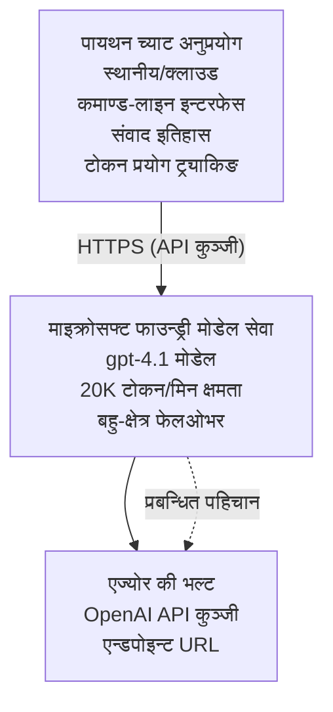

# Microsoft Foundry Models Chat Application

**Learning Path:** Intermediate ⭐⭐ | **Time:** 35-45 minutes | **Cost:** $50-200/month

Azure Developer CLI (azd) को प्रयोग गरेर डिप्लोय गरिएको पूरा Microsoft Foundry Models चैट एप्लिकेशन। यो उदाहरणले gpt-4.1 डिप्लोयमेन्ट, सुरक्षित API पहुँच, र एक सरल चैट इन्टरफेस देखाउँछ।

## 🎯 तपाईँले के सिक्नुहुनेछ

- gpt-4.1 मोडेलसँग Microsoft Foundry Models Service डिप्लोय गर्ने
- Key Vault सँग OpenAI API कुञ्जीहरू सुरक्षित राख्ने
- Python प्रयोग गरेर सरल चैट इन्टरफेस बनाउने
- टोकन प्रयोग र लागत निगरानी गर्ने
- रेट लिमिटिङ र त्रुटि ह्यान्डलिङ लागू गर्ने

## 📦 के समावेश छ

✅ **Microsoft Foundry Models Service** - gpt-4.1 मोडेल डिप्लोयमेन्ट  
✅ **Python Chat App** - सरल कमाण्ड-लाइन चैट इन्टरफेस  
✅ **Key Vault Integration** - API कुञ्जी सुरक्षित भण्डारण  
✅ **ARM Templates** - इन्फ्रास्ट्रक्चर एज़ कोड  
✅ **Cost Monitoring** - टोकन उपयोग ट्र्याकिङ  
✅ **Rate Limiting** - कोटा समाप्त नहुने सुनिश्चित गर्ने  

## वास्तुकला



## पूर्वापेक्षाहरू

### आवश्यक

- **Azure Developer CLI (azd)** - [Install guide](https://learn.microsoft.com/azure/developer/azure-developer-cli/install-azd)
- **Azure subscription** with OpenAI access - [Request access](https://aka.ms/oai/access)
- **Python 3.9+** - [Install Python](https://www.python.org/downloads/)

### पूर्वापेक्षाहरू प्रमाणित गर्नुहोस्

```bash
# azd संस्करण जाँच गर्नुहोस् (1.5.0 वा उच्च आवश्यक छ)
azd version

# Azure मा लगइन जाँच गर्नुहोस्
azd auth login

# Python संस्करण जाँच गर्नुहोस्
python --version  # वा python3 --version

# OpenAI पहुँच प्रमाणित गर्नुहोस् (Azure पोर्टलमा जाँच गर्नुहोस्)
az cognitiveservices account list-skus \
  --kind OpenAI \
  --location eastus
```

> **⚠️ Important:** Microsoft Foundry Models मा आवेदन स्वीकृत गरिनु आवश्यक हुन्छ। यदि तपाईंले आवेदन गर्नुभएको छैन भने, भ्रमण गर्नुहोस् [aka.ms/oai/access](https://aka.ms/oai/access)। स्वीकृति सामान्यतया 1-2 कार्य दिन लाग्छ।

## ⏱️ डिप्लोयमेन्ट समयरेखा

| चरण | अवधि | के हुन्छ |
|-------|----------|--------------|
| पूर्वापेक्षाहरू जाँच | 2-3 minutes | OpenAI को कोटा उपलब्धता प्रमाणित गर्नुहोस् |
| इन्फ्रास्ट्रक्चर डिप्लोय | 8-12 minutes | OpenAI, Key Vault, मोडेल डिप्लोयमेन्ट सिर्जना गर्नुहोस् |
| एप्लिकेशन कन्फिगर गर्नुहोस् | 2-3 minutes | वातावरण र निर्भरता सेटअप गर्नुहोस् |
| **कुल** | **12-18 minutes** | gpt-4.1 सँग चैट गर्न तयार |

**नोट:** पहिलो पटक OpenAI डिप्लोयमेन्टमा मोडेल प्रोभिजनिङका कारण बढी समय लाग्न सक्छ।

## छिटो सुरु

```bash
# उदाहरणमा जानुहोस्
cd examples/azure-openai-chat

# वातावरण आरम्भ गर्नुहोस्
azd env new myopenai

# सबै परिनियोजन गर्नुहोस् (पूर्वाधार + कन्फिगरेसन)
azd up
# तपाईंलाई सोधिनेछ:
# 1. Azure सदस्यता चयन गर्नुहोस्
# 2. OpenAI उपलब्ध भएको स्थान छान्नुहोस् (उदाहरण: eastus, eastus2, westus)
# 3. परिनियोजनका लागि 12-18 मिनेट पर्खनुहोस्

# Python निर्भरताहरू स्थापना गर्नुहोस्
pip install -r requirements.txt

# च्याट सुरु गर्नुहोस्!
python chat.py
```

**Expected Output:**
```
🤖 Microsoft Foundry Models Chat Application
Connected to: gpt-4.1 (eastus)
Type your message (or 'quit' to exit)

You: Hello! Tell me about Microsoft Foundry Models.
Assistant: Microsoft Foundry Models Service provides REST API access to OpenAI's powerful language models including gpt-4.1, GPT-3.5-Turbo, and Embeddings...

[Tokens used: 145 | Estimated cost: $0.0044]
```

## ✅ डिप्लोयमेन्ट प्रमाणित गर्नुहोस्

### चरण 1: Azure स्रोतहरू जाँच गर्नुहोस्

```bash
# तैनाथ गरिएका संसाधनहरू हेर्नुहोस्
azd show

# अपेक्षित आउटपुटले देखाउँछ:
# - OpenAI सेवा: (संसाधन नाम)
# - की भल्ट: (संसाधन नाम)
# - तैनाती: gpt-4.1
# - स्थान: eastus (वा तपाईंले चयन गरेको क्षेत्र)
```

### चरण 2: OpenAI API परीक्षण गर्नुहोस्

```bash
# OpenAI अन्तिम बिन्दु र कुञ्जी प्राप्त गर्नुहोस्
OPENAI_ENDPOINT=$(azd env get-value AZURE_OPENAI_ENDPOINT)
OPENAI_KEY=$(azd env get-value AZURE_OPENAI_API_KEY)

# एपीआई कल परीक्षण गर्नुहोस्
curl "$OPENAI_ENDPOINT/openai/deployments/gpt-4.1/chat/completions?api-version=2024-08-01-preview" \
  -H "Content-Type: application/json" \
  -H "api-key: $OPENAI_KEY" \
  -d '{
    "messages": [{"role": "user", "content": "Say hello!"}],
    "max_tokens": 50
  }'
```

**Expected Response:**
```json
{
  "choices": [
    {
      "message": {
        "role": "assistant",
        "content": "Hello! How can I assist you today?"
      }
    }
  ],
  "usage": {
    "prompt_tokens": 8,
    "completion_tokens": 9,
    "total_tokens": 17
  }
}
```

### चरण 3: Key Vault पहुँच प्रमाणित गर्नुहोस्

```bash
# Key Vault मा सिक्रेटहरू सूचीबद्ध गर्नुहोस्
KV_NAME=$(azd env get-value AZURE_KEY_VAULT_NAME)

az keyvault secret list \
  --vault-name $KV_NAME \
  --query "[].name" \
  --output table
```

**Expected Secrets:**
- `openai-api-key`
- `openai-endpoint`

**Success Criteria:**
- ✅ gpt-4.1 सहित OpenAI सेवा डिप्लोय भएको छ
- ✅ API कलले मान्य completion फर्काउँछ
- ✅ कुञ्जीहरू Key Vault मा स्टोर भएका छन्
- ✅ टोकन प्रयोग ट्र्याकिङ काम गर्छ

## परियोजना संरचना

```
azure-openai-chat/
├── README.md                   ✅ This guide
├── azure.yaml                  ✅ AZD configuration
├── infra/                      ✅ Infrastructure as Code
│   ├── main.bicep             ✅ Main Bicep template
│   ├── main.parameters.json   ✅ Parameters
│   └── openai.bicep           ✅ OpenAI resource definition
├── src/                        ✅ Application code
│   ├── chat.py                ✅ Chat interface
│   ├── config.py              ✅ Configuration loader
│   └── requirements.txt       ✅ Python dependencies
└── .gitignore                  ✅ Git ignore rules
```

## एप्लिकेशन सुविधाहरू

### Chat Interface (`chat.py`)

च्याट एप्लिकेशनमा समावेश छन्:

- **Conversation History** - सन्देशहरू बीच सन्दर्भ कायम राख्छ
- **Token Counting** - प्रयोग ट्र्याक र लागत अनुमान गर्दछ
- **Error Handling** - रेट लिमिट र API त्रुटिहरूको सौम्य ह्यान्डलिङ
- **Cost Estimation** - प्रत्येक सन्देशको वास्तविक-समय लागत गणना
- **Streaming Support** - वैकल्पिक स्ट्रिमिङ प्रतिक्रियाहरू

### आदेशहरू

च्याट गर्दा, तपाईं प्रयोग गर्न सक्नुहुन्छ:
- `quit` or `exit` - सत्र समाप्त गर्नुहोस्
- `clear` - वार्तालाप इतिहास मेटाउनुहोस्
- `tokens` - कुल टोकन प्रयोग देखाउनुहोस्
- `cost` - अनुमानित कुल लागत देखाउनुहोस्

### कन्फिगरेसन (`config.py`)

वातावरण चरहरूबाट कन्फिगरेसन लोड गर्छ:
```python
AZURE_OPENAI_ENDPOINT  # Key Vault बाट
AZURE_OPENAI_API_KEY   # Key Vault बाट
AZURE_OPENAI_MODEL     # पूर्वनिर्धारित: gpt-4.1
AZURE_OPENAI_MAX_TOKENS # पूर्वनिर्धारित: 800
```

## प्रयोग उदाहरणहरू

### आधारभूत च्याट

```bash
python chat.py
```

### कस्टम मोडेलसँग च्याट

```bash
export AZURE_OPENAI_MODEL=gpt-35-turbo
python chat.py
```

### स्ट्रिमिङसँग च्याट

```bash
python chat.py --stream
```

### उदाहरण वार्तालाप

```
You: Explain Microsoft Foundry Models Service in 3 sentences.
Assistant: Microsoft Foundry Models Service is Microsoft Azure's cloud platform offering 
that provides access to OpenAI's powerful language models. It enables developers 
to integrate capabilities like gpt-4.1 into their applications with enterprise-grade 
security and compliance. The service includes features for content filtering, 
abuse monitoring, and responsible AI practices.

[Tokens used: 89 | Estimated cost: $0.0027]

You: What models are available?
Assistant: Microsoft Foundry Models Service offers several model families including gpt-4.1 
(most capable), GPT-3.5-Turbo (faster and cost-effective), and Embeddings models 
for vector search. Each model has different capabilities, pricing, and token limits.

[Tokens used: 67 | Estimated cost: $0.0020]

Total session: 156 tokens | $0.0047
```

## लागत व्यवस्थापन

### टोकन मूल्य निर्धारण (gpt-4.1)

| Model | Input (per 1K tokens) | Output (per 1K tokens) |
|-------|----------------------|------------------------|
| gpt-4.1 | $0.03 | $0.06 |
| GPT-3.5-Turbo | $0.0015 | $0.002 |

### अनुमानित मासिक खर्च

प्रयोग ढाँचाहरूको आधारमा:

| प्रयोग स्तर | Messages/Day | Tokens/Day | Monthly Cost |
|-------------|--------------|------------|--------------|
| **Light** | 20 messages | 3,000 tokens | $3-5 |
| **Moderate** | 100 messages | 15,000 tokens | $15-25 |
| **Heavy** | 500 messages | 75,000 tokens | $75-125 |

**आधारभूत इन्फ्रास्ट्रक्चर लागत:** $1-2/month (Key Vault + न्यूनतम compute)

### लागत अनुकूलन सुझावहरू

```bash
# 1. सरल कार्यहरूका लागि GPT-3.5-Turbo प्रयोग गर्नुहोस् (२० गुणा सस्तो)
export AZURE_OPENAI_MODEL=gpt-35-turbo

# 2. छोटो उत्तरहरूको लागि अधिकतम टोकन घटाउनुहोस्
export AZURE_OPENAI_MAX_TOKENS=400

# 3. टोकन प्रयोग अनुगमन गर्नुहोस्
python chat.py --show-tokens

# 4. बजेट चेतावनीहरू सेटअप गर्नुहोस्
az consumption budget create \
  --budget-name "openai-budget" \
  --amount 50 \
  --time-grain Monthly
```

## निगरानी

### टोकन प्रयोग हेर्नुहोस्

```bash
# Azure पोर्टलमा:
# OpenAI स्रोत → मेट्रिक्स → "टोकन लेनदेन" छान्नुहोस्

# वा Azure CLI मार्फत:
az monitor metrics list \
  --resource $(azd env get-value AZURE_OPENAI_RESOURCE_ID) \
  --metric "TokenTransaction" \
  --start-time $(date -u -d '1 hour ago' '+%Y-%m-%dT%H:%M:%S') \
  --interval PT1M
```

### API लगहरू हेर्नुहोस्

```bash
# स्ट्रीम निदानसम्बन्धी लगहरू
az monitor diagnostic-settings create \
  --resource $(azd env get-value AZURE_OPENAI_RESOURCE_ID) \
  --name openai-logs \
  --logs '[{"category": "Audit", "enabled": true}]' \
  --workspace $(azd env get-value LOG_ANALYTICS_WORKSPACE_ID)

# क्वेरी लगहरू
az monitor log-analytics query \
  --workspace $(azd env get-value LOG_ANALYTICS_WORKSPACE_ID) \
  --analytics-query "AzureDiagnostics | where Category == 'Audit' | top 10 by TimeGenerated"
```

## समस्या निवारण

### समस्या: "Access Denied" त्रुटि

**लक्षणहरू:** API कल गर्दा 403 Forbidden

**समाधानहरू:**
```bash
# 1. OpenAI पहुँच अनुमोदित भएको पुष्टि गर्नुहोस्
az cognitiveservices account show \
  --name $(azd env get-value AZURE_OPENAI_NAME) \
  --resource-group $(azd env get-value AZURE_RESOURCE_GROUP)

# 2. API कुञ्जी सही छ कि छैन जाँच गर्नुहोस्
azd env get-value AZURE_OPENAI_API_KEY

# 3. एन्डपोइन्ट URL ढाँचा जाँच गर्नुहोस्
azd env get-value AZURE_OPENAI_ENDPOINT
# यस्तो हुनुपर्छ: https://[name].openai.azure.com/
```

### समस्या: "Rate Limit Exceeded"

**लक्षणहरू:** 429 Too Many Requests

**समाधानहरू:**
```bash
# 1. वर्तमान कोटा जाँच गर्नुहोस्
az cognitiveservices account deployment show \
  --name $(azd env get-value AZURE_OPENAI_NAME) \
  --resource-group $(azd env get-value AZURE_RESOURCE_GROUP) \
  --deployment-name gpt-4.1

# 2. कोटा वृद्धि अनुरोध गर्नुहोस् (आवश्यक परेमा)
# Azure पोर्टलमा जानुहोस् → OpenAI स्रोत → कोटा → वृद्धि अनुरोध गर्नुहोस्

# 3. पुनः प्रयास तर्क लागू गर्नुहोस् (पहिले नै chat.py मा छ)
# अनुप्रयोगले स्वचालित रूपमा घातीय ब्याकअफसहित पुनः प्रयास गर्छ
```

### समस्या: "Model Not Found"

**लक्षणहरू:** डिप्लोयमेन्टको लागि 404 त्रुटि

**समाधानहरू:**
```bash
# 1. उपलब्ध परिनियोजनहरू सूचीबद्ध गर्नुहोस्
az cognitiveservices account deployment list \
  --name $(azd env get-value AZURE_OPENAI_NAME) \
  --resource-group $(azd env get-value AZURE_RESOURCE_GROUP)

# 2. वातावरणमा मोडेल नाम जाँच गर्नुहोस्
echo $AZURE_OPENAI_MODEL

# 3. सही परिनियोजन नाममा अद्यावधिक गर्नुहोस्
export AZURE_OPENAI_MODEL=gpt-4.1  # वा gpt-35-turbo
```

### समस्या: उच्च लेटेन्सी

**लक्षणहरू:** ढिला प्रतिक्रिया समय (>5 seconds)

**समाधानहरू:**
```bash
# 1. क्षेत्रीय विलम्ब जाँच गर्नुहोस्
# प्रयोगकर्ताहरूको नजिकको क्षेत्रमा परिनियोजन गर्नुहोस्

# 2. छिटो प्रतिक्रियाका लागि max_tokens घटाउनुहोस्
export AZURE_OPENAI_MAX_TOKENS=400

# 3. राम्रो प्रयोगकर्ता अनुभवका लागि स्ट्रीमिङ प्रयोग गर्नुहोस्
python chat.py --stream
```

## सुरक्षा उत्तम अभ्यासहरू

### 1. API कुञ्जीहरू सुरक्षित राख्नुहोस्

```bash
# कुञ्जीहरू कहिल्यै स्रोत नियन्त्रणमा कमिट नगर्नुहोस्
# Key Vault प्रयोग गर्नुहोस् (पहिले नै कन्फिगर गरिएको)

# कुञ्जीहरू नियमित रूपमा परिवर्तन गर्नुहोस्
az cognitiveservices account keys regenerate \
  --name $(azd env get-value AZURE_OPENAI_NAME) \
  --resource-group $(azd env get-value AZURE_RESOURCE_GROUP) \
  --key-name key1
```

### 2. सामग्री फिल्टरिङ लागू गर्नुहोस्

```python
# Microsoft Foundry Models मा निर्मित सामग्री फिल्टरिङ समावेश छ
# Azure पोर्टलमा कन्फिगर गर्नुहोस्:
# OpenAI स्रोत → सामग्री फिल्टरहरू → कस्टम फिल्टर सिर्जना गर्नुहोस्

# श्रेणीहरू: नफ़रत, यौन, हिंसा, आत्म-हानि
# स्तरहरू: कम, मध्यम, उच्च फिल्टरिङ
```

### 3. Managed Identity प्रयोग गर्नुहोस् (प्रोडक्सन)

```bash
# उत्पादन परिनियोजनका लागि व्यवस्थापित पहिचान प्रयोग गर्नुहोस्
# API कुञ्जीहरूको सट्टा (एपलाई Azure मा होस्ट गर्न आवश्यक हुन्छ)

# infra/openai.bicep अद्यावधिक गरी यसमा समावेश गर्नुहोस्:
# identity: { type: 'SystemAssigned' }
```

## विकास

### लोकलमा चलाउनुहोस्

```bash
# निर्भरता स्थापना गर्नुहोस्
pip install -r src/requirements.txt

# पर्यावरण चरहरू सेट गर्नुहोस्
export AZURE_OPENAI_ENDPOINT="https://[name].openai.azure.com/"
export AZURE_OPENAI_API_KEY="your-api-key"
export AZURE_OPENAI_MODEL="gpt-4.1"

# अनुप्रयोग चलाउनुहोस्
python src/chat.py
```

### टेस्टहरू चलाउनुहोस्

```bash
# परीक्षण निर्भरता स्थापना गर्नुहोस्
pip install pytest pytest-cov

# परीक्षणहरू चलाउनुहोस्
pytest tests/ -v

# कोड कवरेज सहित
pytest tests/ --cov=src --cov-report=html
```

### मोडेल डिप्लोयमेन्ट अपडेट गर्नुहोस्

```bash
# विभिन्न मोडेल संस्करण तैनाथ गर्नुहोस्
az cognitiveservices account deployment create \
  --name $(azd env get-value AZURE_OPENAI_NAME) \
  --resource-group $(azd env get-value AZURE_RESOURCE_GROUP) \
  --deployment-name gpt-35-turbo \
  --model-name gpt-35-turbo \
  --model-version "0613" \
  --model-format OpenAI \
  --sku-capacity 20 \
  --sku-name "Standard"
```

## सफाइ

```bash
# सबै Azure स्रोतहरू मेटाउनुहोस्
azd down --force --purge

# यसले हटाउँछ:
# - OpenAI सेवा
# - Key Vault (९०-दिनको सफ्ट डिलिट सहित)
# - संसाधन समूह
# - सबै परिनियोजनहरू र कन्फिगरेसनहरू
```

## अर्को कदमहरू

### यो उदाहरण विस्तार गर्नुहोस्

1. **Add Web Interface** - React/Vue फ्रन्टेंड निर्माण गर्नुहोस्
   ```bash
   # azure.yaml मा फ्रन्टएन्ड सेवा थप्नुहोस्
   # Azure Static Web Apps मा परिनियोजन गर्नुहोस्
   ```

2. **Implement RAG** - Azure AI Search सँग कागजात खोज थप्नुहोस्
   ```python
   # Azure AI Search एकीकृत गर्नुहोस्
   # कागजातहरू अपलोड गरी भेक्टर इन्डेक्स सिर्जना गर्नुहोस्
   ```

3. **Add Function Calling** - उपकरण प्रयोग सक्षम गर्नुहोस्
   ```python
   # chat.py फाइलमा फङ्क्शनहरू परिभाषित गर्नुहोस्
   # gpt-4.1 लाई बाह्य APIहरू कल गर्न दिनुहोस्
   ```

4. **Multi-Model Support** - धेरै मोडेलहरू डिप्लोय गर्नुहोस्
   ```bash
   # gpt-35-turbo र embeddings मोडेलहरू थप्नुहोस्
   # मोडेल राउटिङ तर्क लागू गर्नुहोस्
   ```

### सम्बन्धित उदाहरणहरू

- **[Retail Multi-Agent](../retail-scenario.md)** - उन्नत बहु-एजेन्ट वास्तुकला
- **[Database App](../../../../examples/database-app)** - दिर्घकालीन भण्डारण थप्नुहोस्
- **[Container Apps](../../../../examples/container-app)** - कन्टेनराइज्ड सेवा को रूपमा डिप्लोय गर्नुहोस्

### सिक्ने स्रोतहरू

- 📚 [AZD For Beginners Course](../../README.md) - मुख्य कोर्स होम
- 📚 [Microsoft Foundry Models Documentation](https://learn.microsoft.com/azure/ai-services/openai/) - आधिकारिक डक्युमेन्ट
- 📚 [OpenAI API Reference](https://platform.openai.com/docs/api-reference) - API विवरण
- 📚 [Responsible AI](https://www.microsoft.com/ai/responsible-ai) - उत्तम अभ्यासहरू

## अतिरिक्त स्रोतहरू

### डक्युमेन्टेसन
- **[Microsoft Foundry Models Service](https://learn.microsoft.com/azure/ai-services/openai/)** - पूरा गाइड
- **[gpt-4.1 Models](https://learn.microsoft.com/azure/ai-services/openai/concepts/models)** - मोडेल क्षमताहरू
- **[Content Filtering](https://learn.microsoft.com/azure/ai-services/openai/concepts/content-filter)** - सुरक्षा फीचरहरू
- **[Azure Developer CLI](https://learn.microsoft.com/azure/developer/azure-developer-cli/)** - azd रेफरेन्स

### ट्युटोरियलहरू
- **[OpenAI Quickstart](https://learn.microsoft.com/azure/ai-services/openai/quickstart)** - पहिलो डिप्लोयमेन्ट
- **[Chat Completions](https://learn.microsoft.com/azure/ai-services/openai/how-to/chatgpt)** - चैट एपहरू बनाउने
- **[Function Calling](https://learn.microsoft.com/azure/ai-services/openai/how-to/function-calling)** - उन्नत सुविधाहरू

### उपकरणहरू
- **[Microsoft Foundry Models Studio](https://oai.azure.com/)** - वेब-आधारित प्लेग्राउन्ड
- **[Prompt Engineering Guide](https://platform.openai.com/docs/guides/prompt-engineering)** - राम्रो प्रॉम्प्ट लेख्ने
- **[Token Calculator](https://platform.openai.com/tokenizer)** - टोकन प्रयोग अनुमान

### समुदाय
- **[Azure AI Discord](https://discord.gg/azure)** - समुदायबाट सहयोग पाउनुहोस्
- **[GitHub Discussions](https://github.com/Azure-Samples/openai/discussions)** - प्रश्नोत्तर फोरम
- **[Azure Blog](https://azure.microsoft.com/blog/tag/azure-openai-service/)** - नवीनतम अपडेटहरू

---

**🎉 सफलतापूर्वक!** तपाईंले Microsoft Foundry Models डिप्लोय गर्नुभयो र कार्यरत चैट एप्लिकेशन बनाउनु भयो। gpt-4.1 का क्षमताहरू अन्वेषण गर्न सुरु गर्नुहोस् र विभिन्न प्रॉम्प्ट र प्रयोग केसहरूसँग प्रयोग गर्नुहोस्।

**प्रश्नहरू?** [Open an issue](https://github.com/microsoft/AZD-for-beginners/issues) वा [FAQ](../../resources/faq.md) जाँच गर्नुहोस्

**Cost Alert:** परीक्षण सकेपछि लगातार शुल्क नलागोस् भनेर `azd down` चलाउन सम्झनुहोस् (~$50-100/month सक्रिय प्रयोगका लागि)।

---

<!-- CO-OP TRANSLATOR DISCLAIMER START -->
**अस्वीकरण**:
यो दस्तावेज़ AI अनुवाद सेवा [Co-op Translator](https://github.com/Azure/co-op-translator) प्रयोग गरेर अनुवाद गरिएको हो। हामी सही हुन प्रयास गर्छौं, तर कृपया जानकार हुनुस् कि स्वचालित अनुवादमा त्रुटिहरू वा अशुद्धताहरू हुन सक्छन्। मूल दस्तावेज़ यसको मूल भाषामा आधिकारिक स्रोत मानिनुपर्छ। महत्वपूर्ण जानकारीका लागि व्यावसायिक मानव अनुवाद सिफारिस गरिन्छ। यस अनुवादको प्रयोगबाट उत्पन्न कुनै पनि गलत बुझाइ वा त्रुटिको लागि हामी जिम्मेवार छैनौं।
<!-- CO-OP TRANSLATOR DISCLAIMER END -->