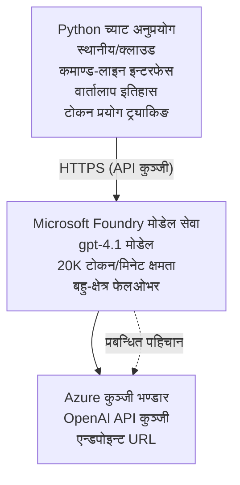

# Microsoft Foundry Models Chat Application

**Learning Path:** Intermediate ⭐⭐ | **Time:** 35-45 minutes | **Cost:** $50-200/month

Azure Developer CLI (azd) प्रयोग गरी डिप्लोय गरिएको पूर्ण Microsoft Foundry Models च्याट एप्लिकेसन। यो उदाहरणले gpt-4.1 डिप्लोयमेन्ट, सुरक्षित API पहुँच, र सरल च्याट इन्टरफेस देखाउँछ।

## 🎯 What You'll Learn

- gpt-4.1 मोडेलसँग Microsoft Foundry Models सेवा डिप्लोय गर्नुहोस्
- Key Vault मा OpenAI API कुञ्जीहरू सुरक्षित गर्नुहोस्
- Python प्रयोग गरी सरल च्याट इन्टरफेस बनाउनुहोस्
- टोकन प्रयोग र लागत अनुगमन गर्नुहोस्
- दर सीमांकन र त्रुटि ह्यान्डलिङ लागू गर्नुहोस्

## 📦 What's Included

✅ **Microsoft Foundry Models Service** - gpt-4.1 मोडेल डिप्लोयमेन्ट  
✅ **Python Chat App** - सरल कमाण्ड-लाइन च्याट इन्टरफेस  
✅ **Key Vault Integration** - API कुञ्जी भण्डारण सुरक्षित गर्ने  
✅ **ARM Templates** - सम्पूर्ण इन्फ्रास्ट्रक्चर एज कोडका रूपमा  
✅ **Cost Monitoring** - टोकन प्रयोग अनुगमन  
✅ **Rate Limiting** - कोटा समाप्ति रोक्ने  

## Architecture


## Prerequisites

### Required

- **Azure Developer CLI (azd)** - [इन्स्टल गाइड](https://learn.microsoft.com/azure/developer/azure-developer-cli/install-azd)
- **Azure subscription** with OpenAI access - [पहुँचको अनुरोध गर्नुहोस्](https://aka.ms/oai/access)
- **Python 3.9+** - [Python स्थापना गर्नुहोस्](https://www.python.org/downloads/)

### Verify Prerequisites

```bash
# azd संस्करण जाँच गर्नुहोस् (1.5.0 वा माथि आवश्यक)
azd version

# Azure लगइन जाँच गर्नुहोस्
azd auth login

# Python संस्करण जाँच गर्नुहोस्
python --version  # वा python3 --version

# OpenAI पहुँच पुष्टि गर्नुहोस् (Azure पोर्टलमा जाँच गर्नुहोस्)
az cognitiveservices account list-skus \
  --kind OpenAI \
  --location eastus
```

> **⚠️ Important:** Microsoft Foundry Models ले आवेदन स्वीकृतिको आवश्यकता पर्दछ। यदि तपाईंले आवेदन गर्नुभएन भने, [aka.ms/oai/access](https://aka.ms/oai/access) मा जानुहोस्। स्वीकृति सामान्यतया 1-2 व्यवसायिक दिन लाग्छ।

## ⏱️ Deployment Timeline

| Phase | Duration | What Happens |
|-------|----------|--------------|
| Prerequisites check | 2-3 minutes | Verify OpenAI quota availability |
| Deploy infrastructure | 8-12 minutes | Create OpenAI, Key Vault, model deployment |
| Configure application | 2-3 minutes | Set up environment and dependencies |
| **Total** | **12-18 minutes** | Ready to chat with gpt-4.1 |

**Note:** First-time OpenAI deployment may take longer due to model provisioning.

## Quick Start

```bash
# उदाहरणमा जानुहोस्
cd examples/azure-openai-chat

# वातावरण आरम्भ गर्नुहोस्
azd env new myopenai

# सबै कुरा तैनाथ गर्नुहोस् (पूर्वाधार + कन्फिगरेसन)
azd up
# तपाईंलाई सोधिनेछ:
# 1. Azure सदस्यता चयन गर्नुहोस्
# 2. OpenAI उपलब्धता भएको स्थान छान्नुहोस् (जस्तै: eastus, eastus2, westus)
# 3. तैनाथीकरणका लागि 12-18 मिनेट पर्खनुहोस्

# Python निर्भरता स्थापना गर्नुहोस्
pip install -r requirements.txt

# च्याट सुरु गर्नुहोस्!
python chat.py
```

**Expected Output:**
```
🤖 Microsoft Foundry Models Chat Application
Connected to: gpt-4.1 (eastus)
Type your message (or 'quit' to exit)

You: Hello! Tell me about Microsoft Foundry Models.
Assistant: Microsoft Foundry Models Service provides REST API access to OpenAI's powerful language models including gpt-4.1, GPT-3.5-Turbo, and Embeddings...

[Tokens used: 145 | Estimated cost: $0.0044]
```

## ✅ Verify Deployment

### Step 1: Check Azure Resources

```bash
# परिनियोजित स्रोतहरू हेर्नुहोस्
azd show

# अपेक्षित आउटपुटले देखाउँछ:
# - OpenAI सेवा: (स्रोत नाम)
# - कुञ्जी भण्डार: (स्रोत नाम)
# - परिनियोजन: gpt-4.1
# - स्थान: eastus (वा तपाईंले चयन गरेको क्षेत्र)
```

### Step 2: Test OpenAI API

```bash
# OpenAI अन्तबिन्दु र कुञ्जी प्राप्त गर्नुहोस्
OPENAI_ENDPOINT=$(azd env get-value AZURE_OPENAI_ENDPOINT)
OPENAI_KEY=$(azd env get-value AZURE_OPENAI_API_KEY)

# API कल परीक्षण गर्नुहोस्
curl "$OPENAI_ENDPOINT/openai/deployments/gpt-4.1/chat/completions?api-version=2024-08-01-preview" \
  -H "Content-Type: application/json" \
  -H "api-key: $OPENAI_KEY" \
  -d '{
    "messages": [{"role": "user", "content": "Say hello!"}],
    "max_tokens": 50
  }'
```

**Expected Response:**
```json
{
  "choices": [
    {
      "message": {
        "role": "assistant",
        "content": "Hello! How can I assist you today?"
      }
    }
  ],
  "usage": {
    "prompt_tokens": 8,
    "completion_tokens": 9,
    "total_tokens": 17
  }
}
```

### Step 3: Verify Key Vault Access

```bash
# Key Vault मा सिक्रेटहरू सूचीबद्ध गर्नुहोस्
KV_NAME=$(azd env get-value AZURE_KEY_VAULT_NAME)

az keyvault secret list \
  --vault-name $KV_NAME \
  --query "[].name" \
  --output table
```

**Expected Secrets:**
- `openai-api-key`
- `openai-endpoint`

**Success Criteria:**
- ✅ OpenAI service deployed with gpt-4.1
- ✅ API call returns valid completion
- ✅ Secrets stored in Key Vault
- ✅ Token usage tracking works

## Project Structure

```
azure-openai-chat/
├── README.md                   ✅ This guide
├── azure.yaml                  ✅ AZD configuration
├── infra/                      ✅ Infrastructure as Code
│   ├── main.bicep             ✅ Main Bicep template
│   ├── main.parameters.json   ✅ Parameters
│   └── openai.bicep           ✅ OpenAI resource definition
├── src/                        ✅ Application code
│   ├── chat.py                ✅ Chat interface
│   ├── config.py              ✅ Configuration loader
│   └── requirements.txt       ✅ Python dependencies
└── .gitignore                  ✅ Git ignore rules
```

## Application Features

### Chat Interface (`chat.py`)

च्याट एप्लिकेसनले समावेश गर्दछ:

- **Conversation History** - सन्देशहरू बीच प्रसंग कायम राख्छ
- **Token Counting** - प्रयोग ट्र्याक गरी लागत अनुमान गर्दछ
- **Error Handling** - दर सीमांकन र API त्रुटिहरूको सुगम ह्यान्डलिङ
- **Cost Estimation** - प्रत्येक सन्देशमा वास्तविक-समय लागत गणना
- **Streaming Support** - वैकल्पिक स्ट्रिमिङ उत्तर समर्थन

### Commands

च्याट गर्दा, तपाईंले प्रयोग गर्न सक्नुहुन्छ:
- `quit` or `exit` - सत्र समाप्त गर्नुहोस्
- `clear` - कुराकानी इतिहास खाली गर्नुहोस्
- `tokens` - कुल टोकन प्रयोग देखाउनुहोस्
- `cost` - अनुमानित कुल लागत देखाउनुहोस्

### Configuration (`config.py`)

Environment variables बाट कन्फिगरेसन लोड गर्छ:
```python
AZURE_OPENAI_ENDPOINT  # कुञ्जी भण्डारबाट
AZURE_OPENAI_API_KEY   # कुञ्जी भण्डारबाट
AZURE_OPENAI_MODEL     # पूर्वनिर्धारित: gpt-4.1
AZURE_OPENAI_MAX_TOKENS # पूर्वनिर्धारित: 800
```

## Usage Examples

### Basic Chat

```bash
python chat.py
```

### Chat with Custom Model

```bash
export AZURE_OPENAI_MODEL=gpt-35-turbo
python chat.py
```

### Chat with Streaming

```bash
python chat.py --stream
```

### Example Conversation

```
You: Explain Microsoft Foundry Models Service in 3 sentences.
Assistant: Microsoft Foundry Models Service is Microsoft Azure's cloud platform offering 
that provides access to OpenAI's powerful language models. It enables developers 
to integrate capabilities like gpt-4.1 into their applications with enterprise-grade 
security and compliance. The service includes features for content filtering, 
abuse monitoring, and responsible AI practices.

[Tokens used: 89 | Estimated cost: $0.0027]

You: What models are available?
Assistant: Microsoft Foundry Models Service offers several model families including gpt-4.1 
(most capable), GPT-3.5-Turbo (faster and cost-effective), and Embeddings models 
for vector search. Each model has different capabilities, pricing, and token limits.

[Tokens used: 67 | Estimated cost: $0.0020]

Total session: 156 tokens | $0.0047
```

## Cost Management

### Token Pricing (gpt-4.1)

| Model | Input (per 1K tokens) | Output (per 1K tokens) |
|-------|----------------------|------------------------|
| gpt-4.1 | $0.03 | $0.06 |
| GPT-3.5-Turbo | $0.0015 | $0.002 |

### Estimated Monthly Costs

Based on usage patterns:

| Usage Level | Messages/Day | Tokens/Day | Monthly Cost |
|-------------|--------------|------------|--------------|
| **Light** | 20 messages | 3,000 tokens | $3-5 |
| **Moderate** | 100 messages | 15,000 tokens | $15-25 |
| **Heavy** | 500 messages | 75,000 tokens | $75-125 |

**Base Infrastructure Cost:** $1-2/month (Key Vault + minimal compute)

### Cost Optimization Tips

```bash
# 1. साधारण कार्यहरूको लागि GPT-3.5-Turbo प्रयोग गर्नुहोस् (२० गुणा सस्तो)
export AZURE_OPENAI_MODEL=gpt-35-turbo

# 2. छोटो उत्तरहरूको लागि अधिकतम टोकन घटाउनुहोस्
export AZURE_OPENAI_MAX_TOKENS=400

# 3. टोकन प्रयोग अनुगमन गर्नुहोस्
python chat.py --show-tokens

# 4. बजेट चेतावनीहरू सेट गर्नुहोस्
az consumption budget create \
  --budget-name "openai-budget" \
  --amount 50 \
  --time-grain Monthly
```

## Monitoring

### View Token Usage

```bash
# Azure पोर्टलमा:
# OpenAI स्रोत → मेट्रिक्स → "टोकन लेनदेन" चयन गर्नुहोस्

# वा Azure CLI मार्फत:
az monitor metrics list \
  --resource $(azd env get-value AZURE_OPENAI_RESOURCE_ID) \
  --metric "TokenTransaction" \
  --start-time $(date -u -d '1 hour ago' '+%Y-%m-%dT%H:%M:%S') \
  --interval PT1M
```

### View API Logs

```bash
# डायग्नोस्टिक लगहरू स्ट्रिम गर्नुहोस्
az monitor diagnostic-settings create \
  --resource $(azd env get-value AZURE_OPENAI_RESOURCE_ID) \
  --name openai-logs \
  --logs '[{"category": "Audit", "enabled": true}]' \
  --workspace $(azd env get-value LOG_ANALYTICS_WORKSPACE_ID)

# क्वेरी लगहरू
az monitor log-analytics query \
  --workspace $(azd env get-value LOG_ANALYTICS_WORKSPACE_ID) \
  --analytics-query "AzureDiagnostics | where Category == 'Audit' | top 10 by TimeGenerated"
```

## Troubleshooting

### Issue: "Access Denied" Error

**Symptoms:** 403 Forbidden when calling API

**Solutions:**
```bash
# 1. OpenAI पहुँच अनुमोदित भएको पुष्टि गर्नुहोस्
az cognitiveservices account show \
  --name $(azd env get-value AZURE_OPENAI_NAME) \
  --resource-group $(azd env get-value AZURE_RESOURCE_GROUP)

# 2. API कुञ्जी सही छ कि छैन जाँच गर्नुहोस्
azd env get-value AZURE_OPENAI_API_KEY

# 3. एन्डपोइन्ट URL ढाँचा जाँच गर्नुहोस्
azd env get-value AZURE_OPENAI_ENDPOINT
# यो हुनुपर्छ: https://[name].openai.azure.com/
```

### Issue: "Rate Limit Exceeded"

**Symptoms:** 429 Too Many Requests

**Solutions:**
```bash
# 1. हालको कोटा जाँच गर्नुहोस्
az cognitiveservices account deployment show \
  --name $(azd env get-value AZURE_OPENAI_NAME) \
  --resource-group $(azd env get-value AZURE_RESOURCE_GROUP) \
  --deployment-name gpt-4.1

# 2. कोटा वृद्धि अनुरोध गर्नुहोस् (यदि आवश्यक भएमा)
# Azure Portal मा जानुहोस् → OpenAI Resource → Quotas → Request Increase

# 3. पुनः प्रयास तर्क लागू गर्नुहोस् (पहिले नै chat.py मा छ)
# अनुप्रयोगले स्वचालित रूपमा exponential backoff प्रयोग गरेर पुनः प्रयास गर्छ
```

### Issue: "Model Not Found"

**Symptoms:** 404 error for deployment

**Solutions:**
```bash
# 1. उपलब्ध डिप्लोइमेन्टहरू सूचीबद्ध गर्नुहोस्
az cognitiveservices account deployment list \
  --name $(azd env get-value AZURE_OPENAI_NAME) \
  --resource-group $(azd env get-value AZURE_RESOURCE_GROUP)

# 2. वातावरणमा मोडेल नाम जाँच गर्नुहोस्
echo $AZURE_OPENAI_MODEL

# 3. सही डिप्लोइमेन्ट नाममा अपडेट गर्नुहोस्
export AZURE_OPENAI_MODEL=gpt-4.1  # वा gpt-35-turbo
```

### Issue: High Latency

**Symptoms:** Slow response times (>5 seconds)

**Solutions:**
```bash
# 1. क्षेत्रीय विलम्बता जाँच गर्नुहोस्
# प्रयोगकर्ताहरूको नजिकको क्षेत्रमा परिनियोजन गर्नुहोस्

# 2. छिटो प्रतिक्रियाका लागि max_tokens कम गर्नुहोस्
export AZURE_OPENAI_MAX_TOKENS=400

# 3. राम्रो प्रयोगकर्ता अनुभवको लागि स्ट्रीमिङ प्रयोग गर्नुहोस्
python chat.py --stream
```

## Security Best Practices

### 1. Protect API Keys

```bash
# कुनै पनि अवस्थामा कुञ्जीहरू स्रोत नियन्त्रणमा कमिट नगर्नुहोस्
# Key Vault प्रयोग गर्नुहोस् (पहिले नै कन्फिगर गरिएको)

# कुञ्जीहरू नियमित रूपमा परिवर्तन गर्नुहोस्
az cognitiveservices account keys regenerate \
  --name $(azd env get-value AZURE_OPENAI_NAME) \
  --resource-group $(azd env get-value AZURE_RESOURCE_GROUP) \
  --key-name key1
```

### 2. Implement Content Filtering

```python
# Microsoft Foundry मोडेलहरूमा अन्तर्निर्मित सामग्री फिल्टरिङ समावेश छ
# Azure पोर्टलमा कन्फिगर गर्नुहोस्:
# OpenAI स्रोत → सामग्री फिल्टरहरू → कस्टम फिल्टर सिर्जना गर्नुहोस्

# श्रेणीहरू: घृणा, यौन, हिंसा, आत्म-हानि
# स्तरहरू: कम, मध्यम, उच्च फिल्टरिङ
```

### 3. Use Managed Identity (Production)

```bash
# उत्पादन परिनियोजनहरूका लागि व्यवस्थापित पहिचान प्रयोग गर्नुहोस्
# API कुञ्जीहरूको सट्टा (Azure मा एप होस्टिंग आवश्यक हुन्छ)

# infra/openai.bicep फाइललाई समावेश गर्न अद्यावधिक गर्नुहोस्:
# identity: { type: 'SystemAssigned' }
```

## Development

### Run Locally

```bash
# निर्भरता स्थापना गर्नुहोस्
pip install -r src/requirements.txt

# पर्यावरण चरहरू सेट गर्नुहोस्
export AZURE_OPENAI_ENDPOINT="https://[name].openai.azure.com/"
export AZURE_OPENAI_API_KEY="your-api-key"
export AZURE_OPENAI_MODEL="gpt-4.1"

# अनुप्रयोग चलाउनुहोस्
python src/chat.py
```

### Run Tests

```bash
# परीक्षण निर्भरता स्थापना गर्नुहोस्
pip install pytest pytest-cov

# परीक्षणहरू चलाउनुहोस्
pytest tests/ -v

# कभरेज सहित
pytest tests/ --cov=src --cov-report=html
```

### Update Model Deployment

```bash
# विभिन्न मोडेल संस्करण तैनाथ गर्नुहोस्
az cognitiveservices account deployment create \
  --name $(azd env get-value AZURE_OPENAI_NAME) \
  --resource-group $(azd env get-value AZURE_RESOURCE_GROUP) \
  --deployment-name gpt-35-turbo \
  --model-name gpt-35-turbo \
  --model-version "0613" \
  --model-format OpenAI \
  --sku-capacity 20 \
  --sku-name "Standard"
```

## Clean Up

```bash
# सबै Azure स्रोतहरू हटाउनुहोस्
azd down --force --purge

# यसले यी हटाउँछ:
# - OpenAI सेवा
# - Key Vault (९०-दिनको सफ्ट-डिलिट सहित)
# - स्रोत समूह
# - सबै परिनियोजन र कन्फिगरेसनहरू
```

## Next Steps

### Expand This Example

1. **Add Web Interface** - React/Vue फ्रन्टएन्ड निर्माण गर्नुहोस्
   ```bash
   # azure.yaml मा फ्रन्टएन्ड सेवा थप्नुहोस्
   # Azure Static Web Apps मा परिनियोजन गर्नुहोस्
   ```

2. **Implement RAG** - Azure AI Search सँग दस्तावेज खोज थप्नुहोस्
   ```python
   # Azure Cognitive Search सँग एकीकृत गर्नुहोस्
   # कागजातहरू अपलोड गर्नुहोस् र भेक्टर सूचकांक सिर्जना गर्नुहोस्
   ```

3. **Add Function Calling** - उपकरण प्रयोग सक्षम गर्नुहोस्
   ```python
   # chat.py मा फंक्शनहरू परिभाषित गर्नुहोस्
   # gpt-4.1 लाई बाह्य APIहरूसँग कल गर्न दिनुहोस्
   ```

4. **Multi-Model Support** - बहु मोडेल डिप्लोय गर्नुहोस्
   ```bash
   # gpt-35-turbo, embeddings मोडेलहरू थप्नुहोस्
   # मोडेल राउटिङ तर्क कार्यान्वयन गर्नुहोस्
   ```

### Related Examples

- **[Retail Multi-Agent](../retail-scenario.md)** - Advanced multi-agent architecture
- **[Database App](../../../../examples/database-app)** - Add persistent storage
- **[Container Apps](../../../../examples/container-app)** - Deploy as containerized service

### Learning Resources

- 📚 [AZD For Beginners Course](../../README.md) - मुख्य कोर्स होम
- 📚 [Microsoft Foundry Models Documentation](https://learn.microsoft.com/azure/ai-services/openai/) - आधिकारिक डक्युमेन्टेशन
- 📚 [OpenAI API Reference](https://platform.openai.com/docs/api-reference) - API विवरण
- 📚 [Responsible AI](https://www.microsoft.com/ai/responsible-ai) - उत्तम अभ्यासहरू

## Additional Resources

### Documentation
- **[Microsoft Foundry Models Service](https://learn.microsoft.com/azure/ai-services/openai/)** - सम्पूर्ण मार्गदर्शन
- **[gpt-4.1 Models](https://learn.microsoft.com/azure/ai-services/openai/concepts/models)** - मोडेल क्षमताहरू
- **[Content Filtering](https://learn.microsoft.com/azure/ai-services/openai/concepts/content-filter)** - सुरक्षा सुविधाहरू
- **[Azure Developer CLI](https://learn.microsoft.com/azure/developer/azure-developer-cli/)** - azd सन्दर्भ

### Tutorials
- **[OpenAI Quickstart](https://learn.microsoft.com/azure/ai-services/openai/quickstart)** - पहिलो डिप्लोयमेन्ट
- **[Chat Completions](https://learn.microsoft.com/azure/ai-services/openai/how-to/chatgpt)** - च्याट एप्स बनाउने
- **[Function Calling](https://learn.microsoft.com/azure/ai-services/openai/how-to/function-calling)** - उन्नत सुविधाहरू

### Tools
- **[Microsoft Foundry Models Studio](https://oai.azure.com/)** - वेब-आधारित प्लेग्राउन्ड
- **[Prompt Engineering Guide](https://platform.openai.com/docs/guides/prompt-engineering)** - राम्रो प्रॉम्प्ट लेख्ने उपाय
- **[Token Calculator](https://platform.openai.com/tokenizer)** - टोकन प्रयोग अनुमान

### Community
- **[Azure AI Discord](https://discord.gg/azure)** - समुदायबाट मद्दत पाउनुहोस्
- **[GitHub Discussions](https://github.com/Azure-Samples/openai/discussions)** - Q&A फोरम
- **[Azure Blog](https://azure.microsoft.com/blog/tag/azure-openai-service/)** - पछिल्ला अपडेटहरू

---

**🎉 Success!** तपाईंले Microsoft Foundry Models डिप्लोय गर्नुभयो र कार्यरत च्याट एप्लिकेसन निर्माण गर्नुभयो। gpt-4.1 का क्षमताहरू अन्वेषण गर्न सुरु गर्नुहोस् र विभिन्न प्रॉम्प्ट तथा प्रयोग केसहरूमा प्रयोग गरेर परीक्षण गर्नुहोस्।

**Questions?** [Open an issue](https://github.com/microsoft/AZD-for-beginners/issues) वा [FAQ](../../resources/faq.md) जाँच गर्नुहोस्

**Cost Alert:** परीक्षण समाप्त भएपछि लगातार शुल्क नलागोस् भनेर `azd down` चलाउन नबिर्सनुहोस् (~$50-100/month सक्रिय प्रयोगको लागि)।

---

<!-- CO-OP TRANSLATOR DISCLAIMER START -->
अस्वीकरण:
यो कागजात एआई अनुवाद सेवा Co-op Translator (https://github.com/Azure/co-op-translator) प्रयोग गरेर अनुवाद गरिएको हो। हामी शुद्धताको लागि प्रयास गर्छौं, तर कृपया ध्यान दिनुहोस् कि स्वचालित अनुवादमा त्रुटि वा अशुद्धता हुनसक्छ। मूल कागजातलाई त्यसको मूल भाषामा अधिकारिक स्रोत मानिनु पर्छ। महत्वपूर्ण जानकारीका लागि पेशेवर मानवीय अनुवाद सिफारिस गरिन्छ। यस अनुवादको प्रयोगबाट उत्पन्न हुने कुनै पनि गलतफहमी वा गलत व्याख्याका लागि हामी जिम्मेवार छैनौं।
<!-- CO-OP TRANSLATOR DISCLAIMER END -->