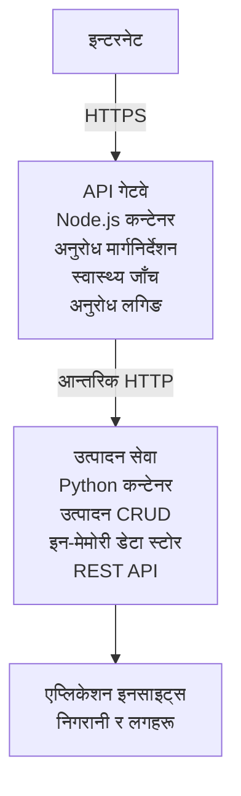

# माइक्रोसर्भिस आर्किटेक्चर - Container App उदाहरण

⏱️ **अनुमानित समय**: 25-35 मिनेट | 💰 **अनुमानित लागत**: ~$50-100/महिना | ⭐ **जटिलता**: उन्नत

एज़ड CLI प्रयोग गरेर Azure Container Apps मा तैनाथ गरिएको एक **सरलीकृत तर कार्यशील** माइक्रोसर्भिस आर्किटेक्चर। यो उदाहरणले सर्भिस-देखि-सर्भिस सञ्चार, कन्टेनर अअर्केस्ट्रेसन, र अनुगमन देखाउँदछ दुई-सर्भिस व्यवहारिक सेटअपसँग।

> **📚 सिकाइ दृष्टिकोण**: यो उदाहरण न्यूनतम 2-सर्भिस आर्किटेक्चर (API Gateway + Backend Service) बाट सुरु हुन्छ जुन तपाईंले वास्तवमै तैनाथ गरी सिक्न सक्नुहुन्छ। यस आधारमा निपुण भएपछि, पूर्ण माइक्रोसर्भिस ईकोसिस्टममा विस्तार गर्ने मार्गदर्शन दिइन्छ।

## तपाइँले के सिक्नु हुनेछ

यस उदाहरण पूरा गरेपछि, तपाईं:
- Azure Container Apps मा धेरै कन्टेनर तैनाथ गर्ने
- आन्तरिक नेटवर्किङसँग सर्भिस-देखि-सर्भिस सञ्चार कार्यान्वयन गर्ने
- वातावरणआधारित स्केलिङ र हेल्थ चेकहरू कन्फिगर गर्ने
- Application Insights मार्फत वितरण गरिएको अनुप्रयोगहरू अनुगमन गर्ने
- माइक्रोसर्भिस तैनाथीकरणका ढाँचाहरू र सर्वोत्तम अभ्यासहरू बुझ्ने
- सरलदेखि जटिल आर्किटेक्चरमा प्रगतिशील विस्तार सिक्ने

## आर्किटेक्चर

### Phase 1: हामी के बनाइरहेका छौं (यो उदाहरणमा समावेश)


**किन सरलबाट सुरु गर्ने?**
- ✅ छिटो तैनाथ र बुझ्न मिल्ने (25-35 मिनेट)
- ✅ जटिलता बिना मुख्य माइक्रोसर्भिस ढाँचाहरू सिक्ने
- ✅ काम चल्ने कोड जुन तपाईं परिमार्जन र परीक्षण गर्न सक्नुहुन्छ
- ✅ सिकाइका लागि कम लागत (~$50-100/महिना बनाम $300-1400/महिना)
- ✅ डाटाबेस र मेसेज क्व्यू थप्नु अघि आत्मविश्वास बनाउन

**उपमा**: यसलाई गाडी चलाउन सिक्न जस्तै सोच्नुहोस्। तपाईं खाली पार्किङ स्थल (2 सर्भिस) बाट सुरु गर्नुहुन्छ, आधारहरूमा दक्ष हुनुहुन्छ, अनि शहरको ट्राफिक (5+ सर्भिसहरू डाटाबेससहित) तिर प्रगति गर्नुहुन्छ।

### Phase 2: भविष्य विस्तार (रेफरेन्स आर्किटेक्चर)

एकपटक तपाईंले 2-सर्भिस आर्किटेक्चरमा निपुण भएपछि, तपाईं विस्तार गर्न सक्नुहुन्छ:

```
Full Architecture (Not Included - For Reference)
├── API Gateway (✅ Included)
├── Product Service (✅ Included)
├── Order Service (🔜 Add next)
├── User Service (🔜 Add next)
├── Notification Service (🔜 Add last)
├── Azure Service Bus (🔜 For async communication)
├── Cosmos DB (🔜 For product persistence)
├── Azure SQL (🔜 For order management)
└── Azure Storage (🔜 For file storage)
```

अन्त्यमा चरण-दर-चरण निर्देशनका लागि "Expansion Guide" खण्ड हेर्नुहोस्।

## समावेश सुविधाहरू

✅ **सर्भिस डिस्कवरी**: कन्टेनरहरूबीच स्वतः DNS-आधारित डिस्कवरी  
✅ **लोड बालान्सिङ**: रेप्लिकाहरूमा बिल्ट-इन लोड बालान्सिङ  
✅ **अटो-स्केलिङ**: HTTP अनुरोधहरूका आधारमा सेवाहरु स्वतन्त्र रूपमा स्केलिङ  
✅ **हेल्थ मोनिटरिङ**: दुबै सेवाका लागि लाइभनेस र रेडिनेस प्रोबहरू  
✅ **वितरित लगिङ**: Application Insights मार्फत केन्द्रित लगिङ  
✅ **आन्तरिक नेटवर्किङ**: सुरक्षित सर्भिस-देखि-सर्भिस सञ्चार  
✅ **कन्टेनर अअर्केस्ट्रेसन**: स्वतः तैनाथीकरण र स्केलिङ  
✅ **शुन्य-डाउनटाइम अपडेटहरू**: रेभिजन व्यवस्थापनसहित रोलिङ अपडेटहरू  

## पूर्वआवश्यकताहरू

### आवश्यक उपकरणहरू

सुरु गर्नु अघि, यी उपकरणहरू तपाइँसँग इंस्टल छ कि छैन भनि जाँच गर्नुहोस्:

1. **[Azure Developer CLI (azd)](https://learn.microsoft.com/azure/developer/azure-developer-cli/install-azd)** (संस्करण 1.0.0 वा माथिको)
   ```bash
   azd version
   # अपेक्षित आउटपुट: azd संस्करण 1.0.0 वा माथि
   ```

2. **[Azure CLI](https://learn.microsoft.com/cli/azure/install-azure-cli)** (संस्करण 2.50.0 वा माथिको)
   ```bash
   az --version
   # अपेक्षित आउटपुट: azure-cli 2.50.0 वा सोभन्दा नयाँ
   ```

3. **[Docker](https://www.docker.com/get-started)** (स्थानीय विकास/परीक्षणका लागि - वैकल्पिक)
   ```bash
   docker --version
   # अपेक्षित आउटपुट: Docker संस्करण 20.10 वा माथि
   ```

### Azure आवश्यकताहरू

- सक्रिय **Azure सदस्यता** ([create a free account](https://azure.microsoft.com/free/))
- तपाईंको सदस्यतामा स्रोतहरू सिर्जना गर्ने अनुमतिहरू
- सदस्यता वा रिसोर्स ग्रुपमा **Contributor** भूमिका

### ज्ञान पूर्वआवश्यकताहरू

यो **उन्नत-स्तर** उदाहरण हो। तपाईंले:
- [Simple Flask API example](../../../../../examples/container-app/simple-flask-api) पूरा गरेका हुनु पर्छ 
- माइक्रोसर्भिस आर्किटेक्चरको आधारभूत बुझाइ
- REST API र HTTP सँग परिचिता
- कन्टेनर अवधारणाहरूको बुझाइ

**Container Apps मा नयाँ हुनुहुन्छ?** सुरूवातका लागि [Simple Flask API example](../../../../../examples/container-app/simple-flask-api) पहिले हेर्नुहोस् ताकि आधारभूत कुरा सिक्न सकियोस्।

## द्रुत सुरु (चरण-दर-चरण)

### चरण 1: Clone र नेभिगेट गर्नुहोस्

```bash
git clone https://github.com/microsoft/AZD-for-beginners.git
cd AZD-for-beginners/examples/container-app/microservices
```

**✓ सफलता जाँच**: सुनिश्चित गर्नुहोस् कि तपाइँ `azure.yaml` देख्नु हुन्छ:
```bash
ls
# अपेक्षित: README.md, azure.yaml, infra/, src/
```

### चरण 2: Azure मा Authenticate गर्नुहोस्

```bash
azd auth login
```

यसले Azure प्रमाणिकरणका लागि तपाईंको ब्राउजर खोल्छ। आफ्नो Azure प्रमाणहरू प्रयोग गरेर साइन इन गर्नुहोस्।

**✓ सफलता जाँच**: तपाईंले हेर्नु पर्ने कुरा:
```
Logged in to Azure.
```

### चरण 3: वातावरण आरम्भ गर्नुहोस्

```bash
azd init
```

**प्रम्प्टहरू जुन देखिनेछन्**:
- **Environment name**: छोटो नाम प्रविष्ट गर्नुहोस् (उदा., `microservices-dev`)
- **Azure subscription**: आफ्नो सदस्यता चयन गर्नुहोस्
- **Azure location**: क्षेत्र छान्नुहोस् (उदा., `eastus`, `westeurope`)

**✓ सफलता जाँच**: तपाईंले हेर्नु पर्ने कुरा:
```
SUCCESS: New project initialized!
```

### चरण 4: पूर्वाधार र सेवाहरू तैनाथ गर्नुहोस्

```bash
azd up
```

**के हुन्छ** (8-12 मिनेट लाग्छ):
1. Container Apps वातावरण सिर्जना गर्छ
2. मोनिटरिङका लागि Application Insights सिर्जना गर्छ
3. API Gateway कन्टेनर (Node.js) बनाउँछ
4. Product Service कन्टेनर (Python) बनाउँछ
5. दुवै कन्टेनरहरू Azure मा तैनाथ गर्छ
6. नेटवर्किङ र हेल्थ चेक कन्फिगर गर्छ
7. मोनिटरिङ र लगिङ सेटअप गर्छ

**✓ सफलता जाँच**: तपाईंले हेर्नु पर्ने कुरा:
```
SUCCESS: Your application was deployed to Azure in X minutes Y seconds.
Endpoint: https://api-gateway-<unique-id>.azurecontainerapps.io
```

**⏱️ समय**: 8-12 मिनेट

### चरण 5: तैनाथीकरण परीक्षण गर्नुहोस्

```bash
# गेटवे एन्डपोइन्ट प्राप्त गर्नुहोस्
GATEWAY_URL=$(azd env get-values | grep API_GATEWAY_URL | cut -d '=' -f2 | tr -d '"')

# API गेटवेको स्वास्थ्य परीक्षण गर्नुहोस्
curl $GATEWAY_URL/health

# अपेक्षित आउटपुट:
# {"status":"स्वस्थ","service":"api-gateway","timestamp":"2025-11-19T10:30:00Z"}
```

**गेटवेको माध्यमबाट प्रडक्ट सर्भिस परीक्षण**:
```bash
# उत्पादनहरूको सूची
curl $GATEWAY_URL/api/products

# अपेक्षित आउटपुट:
# [
#   {"id":1,"name":"लैपटप","price":999.99,"stock":50},
#   {"id":2,"name":"माउस","price":29.99,"stock":200},
#   {"id":3,"name":"किबोर्ड","price":79.99,"stock":150}
# ]
```

**✓ सफलता जाँच**: दुवै endpoints बिना त्रुटि JSON डाटा फर्काउनुपर्छ।

---

**🎉 बधाई छ!** तपाईंले Azure मा माइक्रोसर्भिस आर्किटेक्चर तैनाथ गर्नुभयो!

## प्रोजेक्ट संरचना

सबै कार्यान्वयन फाइलहरू समावेश छन्—यो एक पूर्ण, काम गर्ने उदाहरण हो:

```
microservices/
│
├── README.md                         # This file
├── azure.yaml                        # AZD configuration
├── .gitignore                        # Git ignore patterns
│
├── infra/                           # Infrastructure as Code (Bicep)
│   ├── main.bicep                   # Main orchestration
│   ├── abbreviations.json           # Naming conventions
│   ├── core/                        # Shared infrastructure
│   │   ├── container-apps-environment.bicep  # Container environment + registry
│   │   └── monitor.bicep            # Application Insights + Log Analytics
│   └── app/                         # Service definitions
│       ├── api-gateway.bicep        # API Gateway container app
│       └── product-service.bicep    # Product Service container app
│
└── src/                             # Application source code
    ├── api-gateway/                 # Node.js API Gateway
    │   ├── app.js                   # Express server with routing
    │   ├── package.json             # Node dependencies
    │   └── Dockerfile               # Container definition
    └── product-service/             # Python Product Service
        ├── main.py                  # Flask API with product data
        ├── requirements.txt         # Python dependencies
        └── Dockerfile               # Container definition
```

**प्रत्येक कम्पोनेन्ट के गर्छ:**

**Infrastructure (infra/)**:
- `main.bicep`: सबै Azure स्रोतहरू र तिनका निर्भरताहरू समन्वय गर्छ
- `core/container-apps-environment.bicep`: Container Apps वातावरण र Azure Container Registry सिर्जना गर्छ
- `core/monitor.bicep`: वितरित लगिङका लागि Application Insights सेटअप गर्छ
- `app/*.bicep`: स्केलिङ र हेल्थ चेकसहित व्यक्तिगत कन्टेनर एप परिभाषाहरू

**API Gateway (src/api-gateway/)**:
- सार्वजनिक-समक्ष सेवा जुन ब्याकएन्ड सेवाहरूमा अनुरोध राउट गर्छ
- लगिङ, त्रुटि ह्यान्डलिङ, र अनुरोध अग्रेषण कार्यान्वयन गर्छ
- सर्भिस-देखि-सर्भिस HTTP सञ्चार देखाउँछ

**Product Service (src/product-service/)**:
- इन-मेमोरी उत्पादन सूची सहित आन्तरिक सेवा (सरलीकरणका लागि)
- REST API र हेल्थ चेकहरू
- ब्याकएन्ड माइक्रोसर्भिस ढाँचाको उदाहरण

## सेवाहरूको अवलोकन

### API Gateway (Node.js/Express)

**Port**: 8080  
**पहुँच**: सार्वजनिक (बाह्य इनग्रस)  
**उद्देश्य**: आउँदा अनुरोधहरूलाई उपयुक्त ब्याकएन्ड सेवामा राउट गर्ने  

**Endpoints**:
- `GET /` - सेवा जानकारी
- `GET /health` - हेल्थ चेक इन्डपॉइंट
- `GET /api/products` - प्रडक्ट सर्भिसमा अग्रेषण (सबै सूची)
- `GET /api/products/:id` - प्रडक्ट सर्भिसमा अग्रेषण (ID अनुसार प्राप्त)

**मुख्य सुविधाहरू**:
- axios सँग अनुरोध राउटिङ
- केन्द्रित लगिङ
- त्रुटि ह्यान्डलिङ र टाइमआउट व्यवस्थापन
- वातावरण चरमार्फत सर्भिस डिस्कवरी
- Application Insights इंटिग्रेसन

**कोड हाइलाइट** (`src/api-gateway/app.js`):
```javascript
// आन्तरिक सेवा सञ्चार
app.get('/api/products', async (req, res) => {
  const response = await axios.get(`${PRODUCT_SERVICE_URL}/products`);
  res.json(response.data);
});
```

### Product Service (Python/Flask)

**Port**: 8000  
**पहुँच**: केवल आन्तरिक (बाह्य इनग्रस छैन)  
**उद्देश्य**: इन-मेमोरी डाटासँग उत्पादन सूची व्यवस्थापन  

**Endpoints**:
- `GET /` - सेवा जानकारी
- `GET /health` - हेल्थ चेक इन्डपॉइंट
- `GET /products` - सबै उत्पादनहरू सूची
- `GET /products/<id>` - ID अनुसार उत्पादन प्राप्त

**मुख्य सुविधाहरू**:
- Flask सँग RESTful API
- इन-मेमोरी उत्पादन स्टोर (सरल, कुनै डेटाबेस आवश्यक छैन)
- प्रोबहरूसहित हेल्थ मोनिटरिङ
- संरचित लगिङ
- Application Insights इंटिग्रेसन

**डेटा मोडेल**:
```python
{
  "id": 1,
  "name": "Laptop",
  "description": "High-performance laptop",
  "price": 999.99,
  "stock": 50
}
```

**किन केवल आन्तरिक?**
प्रडक्ट सर्भिस सार्वजनिक रूपमा एक्सपोज गरिएको छैन। सबै अनुरोधहरू API Gateway मार्फत जानुपर्छ, जसले प्रदान गर्छ:
- सुरक्षा: नियन्त्रण गरिएको पहुँच बिन्दु
- लचिलोपन: ब्याकएन्ड परिवर्तन गर्दा ग्राहकहरू प्रभावित हुँदैनन्
- मोनिटरिङ: केन्द्रित अनुरोध लगिङ

## सर्भिस सञ्चार बुझ्नुहोस्

### सेवाहरू कसरी एक-अर्कालाई बोलाउँछन्

यस उदाहरणमा, API Gateway ले Product Service सँग **आन्तरिक HTTP कलहरू** प्रयोग गरी संवाद गर्छ:

```javascript
// API गेटवे (src/api-gateway/app.js)
const PRODUCT_SERVICE_URL = process.env.PRODUCT_SERVICE_URL;

// आन्तरिक HTTP अनुरोध गर्नुहोस्
const response = await axios.get(`${PRODUCT_SERVICE_URL}/products`);
```

**मुख्य विषयहरू**:

1. **DNS-आधारित डिस्कवरी**: Container Apps ले आन्तरिक सेवाहरूको लागि स्वचालित DNS उपलब्ध गराउँछ
   - Product Service FQDN: `product-service.internal.<environment>.azurecontainerapps.io`
   - सरलीकृत रूपमा: `http://product-service` (Container Apps यसलाई समाधान गर्छ)

2. **सार्वजनिक एक्सपोजर छैन**: Product Service मा Bicep मा `external: false` छ
   - केवल Container Apps वातावरण भित्र पहुँचयोग्य
   - इन्टरनेटबाट पुग्न सकिन्न

3. **वातावरण चरहरू**: सेवा URLs डिप्लोयमेन्ट समयमा इन्जेक्ट गरिन्छ
   - Bicep ले आन्तरिक FQDN गेटवेमा पास गर्छ
   - एप्लिकेशन कोडमा हार्डकोडेड URL हुँदैन

**उपमा**: यसलाई अफिसका कोठाजस्तै सोच्नुहोस्। API Gateway रिसेप्सन डेस्क हो (सार्वजनिक-समक्ष), र Product Service कार्यालय कोठा हो (केवल आन्तरिक)। आगन्तुकहरूले कुनै पनि कार्यालयमा पुग्न रिसेप्सन मार्फत जानुपर्छ।

## तैनाथीकरण विकल्पहरू

### पूर्ण तैनाथीकरण (सिफारिश गरिएको)

```bash
# पूर्वाधार र दुवै सेवाहरू परिनियोजित गर्नुहोस्
azd up
```

यसले तैनाथ गर्दछ:
1. Container Apps वातावरण
2. Application Insights
3. Container Registry
4. API Gateway कन्टेनर
5. Product Service कन्टेनर

**समय**: 8-12 मिनेट

### व्यक्तिगत सेवा मात्र तैनाथ गर्नुहोस्

```bash
# प्रारम्भिक azd up पछि मात्र एक सेवा परिनियोजित गर्नुहोस्
azd deploy api-gateway

# वा उत्पादन सेवा परिनियोजित गर्नुहोस्
azd deploy product-service
```

**प्रयोग केस**: जब तपाईंले एउटा सेवामा कोड अपडेट गर्नुभयो र केवल त्यो सेवा पुनः तैनाथ गर्न चाहनुहुन्छ।

### कन्फिगरेसन अपडेट गर्नुहोस्

```bash
# स्केलिङ प्यारामिटरहरू परिवर्तन गर्नुहोस्
azd env set GATEWAY_MAX_REPLICAS 30

# नयाँ कन्फिगरेसनसँग पुनः तैनाथ गर्नुहोस्
azd up
```

## कन्फिगरेसन

### स्केलिङ कन्फिगरेसन

दुबै सेवाहरू आफ्नो Bicep फाइलहरूमा HTTP-आधारित अटोस्केलिङसहित कन्फिगर गरिएका छन्:

**API Gateway**:
- Min replicas: 2 (उपलब्धतालाई कायम राख्न सधैं कम्तीमा 2)
- Max replicas: 20
- स्केल ट्रिगर: प्रतिक्रियाको लागि प्रति रेप्लिकामा 50 समसामयिक अनुरोधहरू

**Product Service**:
- Min replicas: 1 (आवश्यक परे स्केल टु जेरो हुन सक्छ)
- Max replicas: 10
- स्केल ट्रिगर: प्रति रेप्लिकामा 100 समसामयिक अनुरोधहरू

**स्केलिङ अनुकूलन गर्नुहोस्** (in `infra/app/*.bicep`):
```bicep
scale: {
  minReplicas: 1
  maxReplicas: 10
  rules: [
    {
      name: 'http-scale-rule'
      http: {
        metadata: {
          concurrentRequests: '100'  // Adjust this
        }
      }
    }
  ]
}
```

### स्रोत आवंटन

**API Gateway**:
- CPU: 1.0 vCPU
- मेमोरी: 2 GiB
- कारण: सबै बाह्य ट्राफिक ह्यान्डल गर्छ

**Product Service**:
- CPU: 0.5 vCPU
- मेमोरी: 1 GiB
- कारण: हल्का इन-मेमोरी अपरेसनहरू

### हेल्थ चेकहरू

दुबै सेवामा लाइभनेस र रेडिनेस प्रोबहरू समावेश छन्:

```bicep
probes: [
  {
    type: 'Liveness'
    httpGet: {
      path: '/health'
      port: 8080
    }
    initialDelaySeconds: 10
    periodSeconds: 30
  }
  {
    type: 'Readiness'
    httpGet: {
      path: '/health'
      port: 8080
    }
    initialDelaySeconds: 5
    periodSeconds: 10
  }
]
```

**यसको अर्थ के हो**:
- **लाइभनेस**: यदि हेल्थ चेकले असफल भयो भने, Container Apps ले कन्टेनरलाई पुनः सुरु गर्छ
- **रेडिनेस**: यदि रेडी छैन भने, Container Apps ले त्यस रेप्लिकामा ट्राफिक राउट नगर्ने गर्छ


## मोनिटरिङ र अव्जर्भेबलिटी

### सेवा लगहरू हेर्नुहोस्

```bash
# azd monitor प्रयोग गरेर लगहरू हेर्नुहोस्
azd monitor --logs

# वा विशिष्ट Container Apps का लागि Azure CLI प्रयोग गर्नुहोस्:
# API Gateway बाट लगहरू स्ट्रिम गर्नुहोस्
az containerapp logs show --name api-gateway --resource-group $RG_NAME --follow

# हालैका उत्पादन सेवा लगहरू हेर्नुहोस्
az containerapp logs show --name product-service --resource-group $RG_NAME --tail 100
```

**अपेक्षित आउटपुट**:
```
[api-gateway] API Gateway listening on port 8080
[api-gateway] Product Service URL: http://product-service
[api-gateway] GET /api/products 200 - 45ms
[product-service] Retrieved 5 products
```

### Application Insights क्वेरीहरू

Azure Portal मा Application Insights पहुँच गर्नुहोस्, त्यसपछि यी क्वेरीहरू चलाउनुहोस्:

**ढिला अनुरोधहरू फेला पार्नुहोस्**:
```kusto
requests
| where timestamp > ago(1h)
| where duration > 1000  // Requests taking >1 second
| summarize count() by name, cloud_RoleName
| order by count_ desc
```

**सर्भिस-देखि-सर्भिस कलहरू ट्र्याक गर्नुहोस्**:
```kusto
dependencies
| where timestamp > ago(1h)
| where type == "Http"
| project timestamp, name, target, duration, success
| order by timestamp desc
```

**सेवा अनुसार त्रुटि दर**:
```kusto
exceptions
| where timestamp > ago(24h)
| summarize errorCount = count() by cloud_RoleName, type
| order by errorCount desc
```

**समयअनुसार अनुरोध मात्रा**:
```kusto
requests
| where timestamp > ago(1h)
| summarize requestCount = count() by bin(timestamp, 5m), cloud_RoleName
| render timechart
```

### मोनिटरिङ ड्यासबोर्ड पहुँच

```bash
# Application Insights को विवरण प्राप्त गर्नुहोस्
azd env get-values | grep APPLICATIONINSIGHTS

# Azure पोर्टलमा अनुगमन खोल्नुहोस्
az monitor app-insights component show \
  --app $(azd env get-values | grep APPLICATIONINSIGHTS_CONNECTION_STRING | cut -d '=' -f2) \
  --resource-group $(azd env get-values | grep AZURE_RESOURCE_GROUP | cut -d '=' -f2) \
  --query "appId" -o tsv
```

### लाइभ मेट्रिक्स

1. Azure Portal मा Application Insights मा नेभिगेट गर्नुहोस्
2. "Live Metrics" क्लिक गर्नुहोस्
3. रियल-टाइम अनुरोधहरू, असफलताहरू, र प्रदर्शन हेर्नुहोस्
4. परीक्षणका लागि चलाउनुहोस्: `curl $(azd env get-values | grep API_GATEWAY_URL | cut -d '=' -f2 | tr -d '"')/api/products`

## व्यवहारिक अभ्यासहरू

[Note: See full exercises above in the "Practical Exercises" section for detailed step-by-step exercises including deployment verification, data modification, autoscaling tests, error handling, and adding a third service.]

## लागत विश्लेषण

### अनुमानित मासिक लागतहरू (यस 2-सर्भिस उदाहरणको लागि)

| Resource | Configuration | Estimated Cost |
|----------|--------------|----------------|
| API Gateway | 2-20 replicas, 1 vCPU, 2GB RAM | $30-150 |
| Product Service | 1-10 replicas, 0.5 vCPU, 1GB RAM | $15-75 |
| Container Registry | Basic tier | $5 |
| Application Insights | 1-2 GB/month | $5-10 |
| Log Analytics | 1 GB/month | $3 |
| **कुल** | | **$58-243/month** |

**प्रयोगअनुसार लागत ब्रेकडाउन**:
- **हल्का ट्राफिक** (परीक्षण/सिकाइ): ~$60/महिना
- **मध्यम ट्राफिक** (सानो उत्पादन): ~$120/महिना
- **उच्च ट्राफिक** (व्यस्त अवधिहरू): ~$240/महिना

### लागत अनुकूलन सुझावहरू

1. **डेभलपमेन्टका लागि स्केल टु जेरो प्रयोग गर्नुहोस्**:
   ```bicep
   scale: {
     minReplicas: 0  // Save $30-40/month when not in use
     maxReplicas: 10
   }
   ```

2. **Cosmos DB का लागि Consumption Plan प्रयोग गर्नुहोस्** (जब तपाईं यसलाई थप्नुहुन्छ):
   - मात्र प्रयोग अनुसार भुक्तानी गर्नुहोस्
   - कुनै न्यूनतम शुल्क छैन

3. **Application Insights Sampling सेट गर्नुहोस्**:
   ```javascript
   appInsights.defaultClient.config.samplingPercentage = 50; // अनुरोधहरूको 50% नमूना लिनुहोस्
   ```

4. **जरूरत नपरेमा क्लिनअप गर्नुहोस्**:
   ```bash
   azd down
   ```

### फ्री टियर विकल्पहरू

सिकाइ/परीक्षणका लागि विचार गर्नुहोस्:
- Azure निःशुल्क क्रेडिट प्रयोग गर्नुहोस् (पहिलो 30 दिन)
- रिप्लिकाहरू न्यूनतममा राख्नुहोस्
- परीक्षणपछि मेटाउनुहोस् (कुनै निरन्तर शुल्क नलागोस्)

---

## सरसफाइ

निरन्तर शुल्कबाट जोगिन, सबै स्रोतहरू मेटाउनुहोस्:

```bash
azd down --force --purge
```

**पुष्टिकरण संकेत**:
```
? Total resources to delete: 6, are you sure you want to continue? (y/N)
```

पुष्टि गर्न `y` टाइप गर्नुहोस्।

**के मेटिन्छ**:
- Container Apps वातावरण
- दुबै Container Apps (gateway र product सेवा)
- Container Registry
- Application Insights
- Log Analytics Workspace
- Resource Group

**✓ सरसफाइ जाँच गर्नुहोस्**:
```bash
az group list --query "[?starts_with(name,'rg-microservices')]" --output table
```

खाली हुनुपर्छ।

---

## विस्तार मार्गदर्शिका: 2 बाट 5+ सेवाहरूमा

एकपटक तपाईंले यो 2-सेवा वास्तुकला मास्टर गर्नुभयो भने, विस्तार गर्ने तरिका यसप्रकार छ:

### चरण 1: डेटाबेस स्थायीत्व थप्ने (अर्को चरण)

**Product सेवा का लागि Cosmos DB थप्नुहोस्**:

1. `infra/core/cosmos.bicep` सिर्जना गर्नुहोस्:
   ```bicep
   resource cosmosAccount 'Microsoft.DocumentDB/databaseAccounts@2023-04-15' = {
     name: name
     location: location
     kind: 'GlobalDocumentDB'
     properties: {
       databaseAccountOfferType: 'Standard'
       locations: [{ locationName: location, failoverPriority: 0 }]
     }
   }
   ```

2. Product सेवा लाई in-memory डाटाको सट्टा Cosmos DB प्रयोग गर्न अपडेट गर्नुहोस्

3. अनुमानित अतिरिक्त लागत: ~$25/महिना (serverless)

### चरण 2: तेस्रो सेवा थप्ने (अर्डर व्यवस्थापन)

**Order सेवा सिर्जना गर्नुहोस्**:

1. नयाँ फोल्डर: `src/order-service/` (Python/Node.js/C#)
2. नयाँ Bicep: `infra/app/order-service.bicep`
3. API Gateway लाई `/api/orders` मा राउट गर्न अपडेट गर्नुहोस्
4. अर्डर स्थायीत्वका लागि Azure SQL Database थप्नुहोस्

**वास्तुकला बन्छ**:
```
API Gateway → Product Service (Cosmos DB)
           → Order Service (Azure SQL)
```

### चरण 3: असिङ्क संचार थप्ने (Service Bus)

**इभेन्ट-आधारित वास्तुकला लागू गर्नुहोस्**:

1. Azure Service Bus थप्नुहोस्: `infra/core/servicebus.bicep`
2. Product सेवा "ProductCreated" घटनाहरू प्रकाशित गर्छ
3. Order सेवा प्रोडक्ट घटनाहरूमा सदस्यता लिन्छ
4. घटनाहरू प्रशोधन गर्न Notification सेवा थप्नुहोस्

**ढाँचा**: अनुरोध/प्रतिक्रिया (HTTP) + इभेन्ट-आधारित (Service Bus)

### चरण 4: प्रयोगकर्ता प्रमाणीकरण थप्नुहोस्

**प्रयोगकर्ता सेवा लागू गर्नुहोस्**:

1. `src/user-service/` सिर्जना गर्नुहोस् (Go/Node.js)
2. Azure AD B2C वा कस्टम JWT प्रमाणीकरण थप्नुहोस्
3. API Gateway ले टोकनहरू मान्य गर्छ
4. सेवाहरूले प्रयोगकर्ता अनुमति जाँच्छन्

### चरण 5: उत्पादनको तयारी

**यी कम्पोनेन्टहरू थप्नुहोस्**:
- Azure Front Door (वैश्विक लोड ब्यालेन्सिङ)
- Azure Key Vault (रहस्य व्यवस्थापन)
- Azure Monitor Workbooks (कस्टम ड्यासबोर्डहरू)
- CI/CD पाइपलाइन (GitHub Actions)
- Blue-Green Deployments
- सबै सेवाहरूका लागि Managed Identity

**पूर्ण उत्पादन वास्तुकला लागत**: ~$300-1,400/महिना

---

## थप जान्नुहोस्

### सम्बन्धित प्रलेखन
- [Azure Container Apps प्रलेखन](https://learn.microsoft.com/azure/container-apps/)
- [Microservices वास्तुकला मार्गदर्शिका](https://learn.microsoft.com/azure/architecture/guide/architecture-styles/microservices)
- [वितरित ट्रेसिङका लागि Application Insights](https://learn.microsoft.com/azure/azure-monitor/app/distributed-tracing)
- [Azure Developer CLI प्रलेखन](https://learn.microsoft.com/azure/developer/azure-developer-cli/)

### यस कोर्समा अर्को कदमहरू
- ← Previous: [साधारण Flask API](../../../../../examples/container-app/simple-flask-api) - बिगिनर एकल-कन्टेनर उदाहरण
- → Next: [AI एकीकरण मार्गदर्शिका](../../../../../examples/docs/ai-foundry) - AI क्षमताहरू थप्नुहोस्
- 🏠 [पाठ्यक्रम गृह](../../README.md)

### तुलना: कहिले के प्रयोग गर्ने

**एकल Container App** (साधारण Flask API उदाहरण):
- ✅ सजिला अनुप्रयोगहरू
- ✅ मोनोलिथिक वास्तुकला
- ✅ डिप्लोइ गर्न छिटो
- ❌ सीमित स्केलेबिलिटी
- **लागत**: ~$15-50/महिना

**माइक्रोसर्भिसेस** (यो उदाहरण):
- ✅ जटिल अनुप्रयोगहरू
- ✅ प्रत्येक सेवाका लागि स्वतन्त्र स्केलिङ
- ✅ टिम स्वतन्त्रता (विभिन्न सेवाहरू, विभिन्न टिमहरू)
- ❌ व्यवस्थापनका लागि थप जटिल
- **लागत**: ~$60-250/महिना

**Kubernetes (AKS)**:
- ✅ अधिकतम नियन्त्रण र लचकता
- ✅ धेरै-क्लाउड पोर्टेबिलिटी
- ✅ उन्नत नेटवर्किङ
- ❌ Kubernetes विशेषज्ञता आवश्यक
- **लागत**: कम्तीमा ~$150-500/महिना

**सिफारिस**: Container Apps बाट सुरु गर्नुहोस् (यो उदाहरण), केवल Kubernetes-विशिष्ट सुविधाहरू आवश्यक परेमा मात्र AKS मा सर्नुहोस्।

---

## अक्सर सोधिने प्रश्नहरू

**प्रश्न: 5+ सट्टा मात्र 2 सेवाहरू किन?**  
उत्तर: शैक्षिक प्रगति। जटिलता थप्नु अघि साधारण उदाहरणसँग आधारभूत कुराहरू (सेवा संवाद, निगरानी, स्केलिङ) मास्टर गर्नुहोस्। यहाँ सिकेका ढाँचाहरू 100-सेवा वास्तुकलाहरूमा पनि लागू हुन्छन्।

**प्रश्न: के म आफैले थप सेवाहरू थप्न सक्छु?**  
उत्तर: अवश्य! माथिको विस्तार मार्गदर्शिका अनुसरण गर्नुहोस्। प्रत्येक नयाँ सेवा एउटै ढाँचामा चल्छ: src फोल्डर सिर्जना गर्नुहोस्, Bicep फाइल बनाउनुहोस्, azure.yaml अपडेट गर्नुहोस्, डिप्लोइ गर्नुहोस्।

**प्रश्न: के यो उत्पादन-तैयार छ?**  
उत्तर: यो एक मजबुत आधार हो। उत्पादनका लागि थप्नुहोस्: Managed Identity, Key Vault, दिर्घकालीन डेटाबेसहरू, CI/CD पाइपलाइन, निगरानी अलर्टहरू, र ब्याकअप रणनीति।

**प्रश्न: Dapr वा अन्य service mesh किन प्रयोग नगर्ने?**  
उत्तर: सिकाइका लागि सरल राख्नुहोस्। एकपटक Container Apps नेटवर्गिङ बुझ्नुभयो भने, उन्नत परिदृश्यका लागि Dapr थप्न सकिन्छ।

**प्रश्न: म स्थानीय रूपमा कसरी डिबग गर्छु?**  
उत्तर: सेवाहरू लोकलमा Docker का साथ चलाउनुहोस्:
```bash
cd src/api-gateway
docker build -t local-gateway .
docker run -p 8080:8080 -e PRODUCT_SERVICE_URL=http://localhost:8000 local-gateway
```

**प्रश्न: के म फरक प्रोग्रामिङ भाषा प्रयोग गर्न सक्छु?**  
उत्तर: हो! यो उदाहरणले Node.js (gateway) + Python (product सेवा) देखाउँछ। तपाईंले कन्टेनरमा चल्ने कुनै पनि भाषाहरू मिस गर्न सक्नुहुन्छ।

**प्रश्न: यदि मेरोसँग Azure क्रेडिट छैन भने के?**  
उत्तर: नयाँ खाताहरूका लागि Azure निःशुल्क तह (पहिलो 30 दिन) प्रयोग गर्नुहोस् वा छोटो परीक्षण अवधिका लागि डिप्लोइ गरेर तुरुन्तै मेटाउनुहोस्।

---

> **🎓 सिकाइ मार्ग सारांश**: तपाईंले स्वचालित स्केलिङ, आन्तरिक नेटवर्किङ, केन्द्रीकृत निगरानी, र उत्पादन-तयार ढाँचासँग बहु-सेवा वास्तुकला डिप्लोय गर्न सिक्नुभयो। यो आधारले जटिल वितरित प्रणालीहरू र उद्यम माइक्रोसर्भिसेस वास्तुकलाहरूका लागि तपाईंलाई तयार बनाउँछ।

**📚 पाठ्यक्रम नेभिगेसन:**
- ← Previous: [साधारण Flask API](../../../../../examples/container-app/simple-flask-api)
- → Next: [डेटाबेस एकीकरण उदाहरण](../../../../../examples/database-app)
- 🏠 [पाठ्यक्रम गृह](../../../README.md)
- 📖 [Container Apps उत्तम अभ्यास](../../../docs/chapter-04-infrastructure/deployment-guide.md)

---

<!-- CO-OP TRANSLATOR DISCLAIMER START -->
**अस्वीकरण**:
यो कागजात AI अनुवाद सेवा [Co-op Translator](https://github.com/Azure/co-op-translator) प्रयोग गरी अनुवाद गरिएको हो। हामी सटीकता तर्फ प्रयत्न गर्छौं, तर कृपया ध्यान दिनुहोस् कि स्वचालित अनुवादमा त्रुटि वा अशुद्धता हुनसक्छ। मूल कागजातलाई यसको मूल भाषामा नै अधिकारिक स्रोत मानिनु पर्छ। महत्त्वपूर्ण जानकारीका लागि व्यावसायिक मानव अनुवाद सिफारिस गरिन्छ। यस अनुवादको प्रयोगबाट उत्पन्न कुनै पनि गलत बुझाइ वा गलत व्याख्याको लागि हामी जिम्मेवार छैनौं।
<!-- CO-OP TRANSLATOR DISCLAIMER END -->