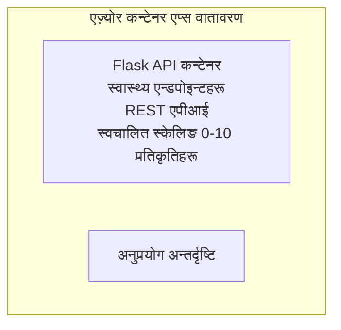

# साधारण Flask API - Container App उदाहरण

**सिकाइ मार्ग:** प्रारम्भिक ⭐ | **समय:** 25-35 मिनेट | **लागत:** $0-15/महिना

एक पूरा, काम गर्ने Python Flask REST API जुन Azure Container Apps मा Azure Developer CLI (azd) प्रयोग गरी डिप्लोय गरिएको छ। यस उदाहरणले कन्टेनर डिप्लोयमेन्ट, अटो-स्केलिङ, र मोनिटरिङका आधारभूत कुराहरू देखाउँछ।

## 🎯 तपाईंले के सिक्नुहुनेछ

- Azure मा कन्टेनर गरिएको Python एप्लिकेशन डिप्लोय गर्नु
- scale-to-zero सहित अटो-स्केलिङ कन्फिगर गर्नु
- हेल्थ प्रोब र रेडिनेस जाँचहरू कार्यान्वयन गर्नु
- एप्लिकेशन लग र मेट्रिक्स अनुगमन गर्नु
- छिटो डिप्लोयमेन्टका लागि Azure Developer CLI प्रयोग गर्नु

## 📦 के समावेश छ

✅ **Flask एप्लिकेशन** - पूर्ण REST API CRUD अपरेसनहरूसहित (`src/app.py`)  
✅ **Dockerfile** - प्रोडक्सन-तयार कन्टेनर कन्फिगरेसन  
✅ **Bicep Infrastructure** - Container Apps वातावरण र API डिप्लोयमेन्ट  
✅ **AZD Configuration** - एक-कमान्ड डिप्लोयमेन्ट सेटअप  
✅ **Health Probes** - लिवनेस् र रेडिनेस जाँचहरू कन्फिगर गरिएको  
✅ **Auto-scaling** - HTTP लोड अनुसार 0-10 रेप्लिका  

## Architecture


## आवश्यकताहरू

### आवश्यक
- **Azure Developer CLI (azd)** - [इन्स्टल गाइड](https://learn.microsoft.com/azure/developer/azure-developer-cli/install-azd)
- **Azure subscription** - [निशुल्क खाता](https://azure.microsoft.com/free/)
- **Docker Desktop** - [Docker इन्स्टल गर्नुहोस्](https://www.docker.com/products/docker-desktop/) (स्थानिय परीक्षणका लागि)

### आवश्यकताहरू जाँच गर्नुहोस्

```bash
# azd संस्करण जाँच गर्नुहोस् (आवश्यक 1.5.0 वा माथि)
azd version

# Azure लगइन पुष्टि गर्नुहोस्
azd auth login

# Docker जाँच गर्नुहोस् (वैकल्पिक, स्थानीय परीक्षणका लागि)
docker --version
```

## ⏱️ डिप्लोयमेन्ट समयरेखा

| चरण | अवधि | के हुन्छ |
|-------|----------|--------------||
| Environment setup | 30 सेकेन्ड | azd वातावरण सिर्जना गर्नुहोस् |
| Build container | 2-3 मिनेट | Docker ले Flask एप बनाउने |
| Provision infrastructure | 3-5 मिनेट | Container Apps, रजिस्ट्री, निगरानी सिर्जना गर्नुहोस् |
| Deploy application | 2-3 मिनेट | इमेज पुश गरी Container Apps मा डिप्लोय गर्नुहोस् |
| **जम्मा** | **8-12 मिनेट** | पूर्ण डिप्लोयमेन्ट तयार |

## छिटो सुरु गर्नुहोस्

```bash
# उदाहरणमा जानुहोस्
cd examples/container-app/simple-flask-api

# वातावरण प्रारम्भ गर्नुहोस् (अद्वितीय नाम छान्नुहोस्)
azd env new myflaskapi

# सबै तैनाथ गर्नुहोस् (पूर्वाधार + अनुप्रयोग)
azd up
# तपाईंलाई सोधिनेछ:
# 1. Azure सदस्यता चयन गर्नुहोस्
# 2. स्थान छान्नुहोस् (जस्तै, eastus2)
# 3. तैनाथीकरणका लागि 8-12 मिनेट कुर्नुहोस्

# तपाईंको API अन्तबिन्दु प्राप्त गर्नुहोस्
azd env get-values

# API परीक्षण गर्नुहोस्
curl $(azd env get-value API_ENDPOINT)/health
```

**अपेक्षित आउटपुट:**
```json
{
  "status": "healthy",
  "timestamp": "2025-11-19T10:30:00Z",
  "service": "simple-flask-api",
  "version": "1.0.0"
}
```

## ✅ डिप्लोयमेन्ट जाँच गर्नुहोस्

### चरण 1: डिप्लोयमेन्ट स्थिति जाँच गर्नुहोस्

```bash
# डिप्लोय गरिएको सेवाहरू हेर्नुहोस्
azd show

# अपेक्षित आउटपुट देखाउँछ:
# - सेवा: api
# - एन्डपोइन्ट: https://ca-api-[env].xxx.azurecontainerapps.io
# - स्थिति: चलिरहेको
```

### चरण 2: API एन्डपोइन्टहरू परीक्षण गर्नुहोस्

```bash
# API अन्तबिन्दु प्राप्त गर्नुहोस्
API_URL=$(azd env get-value API_ENDPOINT)

# स्वास्थ्य परीक्षण गर्नुहोस्
curl $API_URL/health

# मूल अन्तबिन्दु परीक्षण गर्नुहोस्
curl $API_URL/

# एउटा आइटम सिर्जना गर्नुहोस्
curl -X POST $API_URL/api/items \
  -H "Content-Type: application/json" \
  -d '{"name": "Test Item", "description": "My first item"}'

# सबै आइटमहरू प्राप्त गर्नुहोस्
curl $API_URL/api/items
```

**सफलता मापदण्ड:**
- ✅ Health endpoint ले HTTP 200 फर्काउँछ
- ✅ Root endpoint ले API जानकारी देखाउँछ
- ✅ POST ले आइटम सिर्जना गर्छ र HTTP 201 फर्काउँछ
- ✅ GET ले सिर्जना गरिएका आइटमहरू फर्काउँछ

### चरण 3: लगहरू हेर्नुहोस्

```bash
# azd monitor प्रयोग गरेर प्रत्यक्ष लगहरू स्ट्रिम गर्नुहोस्
azd monitor --logs

# वा Azure CLI प्रयोग गर्नुहोस्:
az containerapp logs show --name api --resource-group $RG_NAME --follow

# तपाईंले देख्नुहुनेछ:
# - Gunicorn स्टार्टअप सन्देशहरू
# - HTTP अनुरोध लगहरू
# - एप्लिकेसन जानकारी लगहरू
```

## परियोजना संरचना

```
simple-flask-api/
├── azure.yaml              # AZD configuration
├── infra/
│   ├── main.bicep         # Main infrastructure
│   ├── main.parameters.json
│   └── app/
│       ├── container-env.bicep
│       └── api.bicep
└── src/
    ├── app.py             # Flask application
    ├── requirements.txt
    └── Dockerfile
```

## API एन्डपोइन्टहरू

| Endpoint | Method | Description |
|----------|--------|-------------|
| `/health` | GET | हेल्थ जाँच |
| `/api/items` | GET | सबै आइटमहरू सूचीकरण |
| `/api/items` | POST | नयाँ आइटम सिर्जना गर्नुहोस् |
| `/api/items/{id}` | GET | विशिष्ट आइटम प्राप्त गर्नुहोस् |
| `/api/items/{id}` | PUT | आइटम अपडेट गर्नुहोस् |
| `/api/items/{id}` | DELETE | आइटम मेटाउनुहोस् |

## कन्फिगरेसन

### वातावरण भेरियबलहरू

```bash
# अनुकूलित विन्यास सेट गर्नुहोस्
azd env set PORT 8000
azd env set LOG_LEVEL info
azd env set MAX_REPLICAS 20
```

### स्केलिङ कन्फिगरेसन

API ले HTTP ट्राफिकको आधारमा स्वचालित रूपमा स्केल गर्दछ:
- **न्यूनतम रेप्लिका**: 0 (आइडल हुँदा शून्यसम्म स्केल गर्दछ)
- **अधिकतम रेप्लिका**: 10
- **प्रति रेप्लिका समवर्ती अनुरोधहरू**: 50

## विकास

### स्थानीय रूपमा चलाउनुहोस्

```bash
# आवश्यक निर्भरता स्थापना गर्नुहोस्
cd src
pip install -r requirements.txt

# एप चलाउनुहोस्
python app.py

# स्थानीय रूपमा परीक्षण गर्नुहोस्
curl http://localhost:8000/health
```

### कन्टेनर बनाउने र परीक्षण गर्ने

```bash
# Docker इमेज बनाउनुहोस्
docker build -t flask-api:local ./src

# कन्टेनर स्थानीय रूपमा चलाउनुहोस्
docker run -p 8000:8000 flask-api:local

# कन्टेनर परीक्षण गर्नुहोस्
curl http://localhost:8000/health
```

## डिप्लोयमेन्ट

### पूर्ण डिप्लोयमेन्ट

```bash
# पूर्वाधार र अनुप्रयोग तैनाथ गर्नुहोस्
azd up
```

### कोड मात्र डिप्लोयमेन्ट

```bash
# केवल अनुप्रयोग कोड मात्र परिनियोजित गर्नुहोस् (पूर्वाधार अपरिवर्तित)
azd deploy api
```

### कन्फिगरेसन अपडेट गर्नुहोस्

```bash
# पर्यावरण चरहरू अद्यावधिक गर्नुहोस्
azd env set API_KEY "new-api-key"

# नयाँ कन्फिगरेसनसँग पुनः तैनाथ गर्नुहोस्
azd deploy api
```

## निगरानी

### लगहरू हेर्नुहोस्

```bash
# azd monitor प्रयोग गरेर प्रत्यक्ष लगहरू स्ट्रिम गर्नुहोस्
azd monitor --logs

# वा Container Apps को लागि Azure CLI प्रयोग गर्नुहोस्:
az containerapp logs show --name api --resource-group $RG_NAME --follow

# अन्तिम १०० पंक्तिहरू हेर्नुहोस्
az containerapp logs show --name api --resource-group $RG_NAME --tail 100
```

### मेट्रिक्स अनुगमन गर्नुहोस्

```bash
# Azure Monitor ड्यासबोर्ड खोल्नुहोस्
azd monitor --overview

# विशिष्ट मेट्रिक्सहरू हेर्नुहोस्
az monitor metrics list \
  --resource $(azd show --output json | jq -r '.services.api.resourceId') \
  --metric "Requests,ResponseTime"
```

## परीक्षण

### हेल्थ चेक

```bash
curl $(azd show --output json | jq -r '.services.api.endpoint')/health
```

अपेक्षित प्रतिक्रिया:
```json
{
  "status": "healthy",
  "timestamp": "2025-11-19T10:30:00Z"
}
```

### आइटम सिर्जना गर्नुहोस्

```bash
curl -X POST $(azd show --output json | jq -r '.services.api.endpoint')/api/items \
  -H "Content-Type: application/json" \
  -d '{"name": "Test Item", "description": "A test item"}'
```

### सबै आइटमहरू प्राप्त गर्नुहोस्

```bash
curl $(azd show --output json | jq -r '.services.api.endpoint')/api/items
```

## लागत अनुकूलन

यस डिप्लोयमेन्टले scale-to-zero प्रयोग गर्छ, त्यसैले तपाईँले केवल API अनुरोध प्रक्रिया हुँदैछ भने मात्र तिर्नुहुन्छ:

- **आइडल लागत**: ~$0/महिना (शून्यसम्म स्केल गरिएको)
- **सक्रिय लागत**: ~$0.000024/सेकेन्ड प्रति रेप्लिका
- **अपेक्षित मासिक लागत** (हल्का प्रयोग): $5-15

### लागत अझ कम गर्नुहोस्

```bash
# डेभका लागि अधिकतम रेप्लिकाहरू घटाउनुहोस्
azd env set MAX_REPLICAS 3

# छोटो निष्क्रिय टाइमआउट प्रयोग गर्नुहोस्
azd env set SCALE_TO_ZERO_TIMEOUT 300  # ५ मिनेट
```

## समस्यासमाधान

### कन्टेनर सुरु हुँदैन

```bash
# Azure CLI प्रयोग गरेर कन्टेनरका लगहरू जाँच गर्नुहोस्
az containerapp logs show --name api --resource-group $RG_NAME --tail 100

# Docker इमेज स्थानीय रूपमा निर्माण हुन्छ कि भनी जाँच गर्नुहोस्
docker build -t test ./src
```

### API पहुँचयोग्य छैन

```bash
# ingress बाह्य छ कि छैन प्रमाणित गर्नुहोस्
az containerapp show --name api --resource-group rg-simple-flask-api \
  --query properties.configuration.ingress.external
```

### उच्च प्रतिक्रिया समय

```bash
# CPU/मेमोरी प्रयोग जाँच गर्नुहोस्
az monitor metrics list \
  --resource $(azd show --output json | jq -r '.services.api.resourceId') \
  --metric "CPUPercentage,MemoryPercentage"

# आवश्यक परे स्रोतहरू बढाउनुहोस्
az containerapp update --name api --resource-group rg-simple-flask-api \
  --cpu 1.0 --memory 2Gi
```

## क्लीन अप

```bash
# सबै स्रोतहरू मेटाउनुहोस्
azd down --force --purge
```

## अर्को चरणहरू

### यो उदाहरण विस्तार गर्नुहोस्

1. **डेटाबेस थप्नुहोस्** - Azure Cosmos DB वा SQL Database एकीकरण गर्नुहोस्
   ```bash
   # infra/main.bicep मा Cosmos DB मोड्युल थप्नुहोस्
   # डाटाबेस जडान सहित app.py अद्यावधिक गर्नुहोस्
   ```

2. **प्रमाणीकरण थप्नुहोस्** - Azure AD वा API कुञ्जीहरू कार्यान्वयन गर्नुहोस्
   ```python
   # app.py मा प्रमाणीकरण मिडलवेयर थप्नुहोस्
   from functools import wraps
   ```

3. **CI/CD सेटअप गर्नुहोस्** - GitHub Actions वर्कफ्लो
   ```yaml
   # Create .github/workflows/deploy.yml
   name: Deploy to Azure
   on: [push]
   ```

4. **Managed Identity थप्नुहोस्** - Azure सेवाहरूमा सुरक्षित पहुँच
   ```bicep
   # Update infra/app/api.bicep
   identity: { type: 'SystemAssigned' }
   ```

### सम्बन्धित उदाहरणहरू

- **[डेटाबेस एप](../../../../../examples/database-app)** - SQL Database सहित पूर्ण उदाहरण
- **[माइक्रोसर्भिसेस](../../../../../examples/container-app/microservices)** - बहु-सेवा आर्किटेक्चर
- **[Container Apps मास्टर गाइड](../README.md)** - सबै कन्टेनर ढाँचाहरू

### सिकाइ स्रोतहरू

- 📚 [AZD For Beginners Course](../../../README.md) - मुख्य कोर्स पृष्ठ
- 📚 [Container Apps Patterns](../README.md) - थप डिप्लोयमेन्ट ढाँचाहरू
- 📚 [AZD Templates Gallery](https://azure.github.io/awesome-azd/) - समुदायका टेम्पलेटहरू

## अतिरिक्त स्रोतहरू

### दस्तावेज

- **[Flask Documentation](https://flask.palletsprojects.com/)** - Flask फ्रेमवर्क मार्गदर्शिका
- **[Azure Container Apps](https://learn.microsoft.com/azure/container-apps/)** - आधिकारिक Azure दस्तावेज
- **[Azure Developer CLI](https://learn.microsoft.com/azure/developer/azure-developer-cli/)** - azd कमाण्ड संदर्भ

### ट्युटोरियलहरू
- **[Container Apps Quickstart](https://learn.microsoft.com/azure/container-apps/quickstart-portal)** - आफ्नो पहिलो एप डिप्लोय गर्नुहोस्
- **[Python on Azure](https://learn.microsoft.com/azure/developer/python/)** - Python विकास मार्गदर्शिका
- **[Bicep Language](https://learn.microsoft.com/azure/azure-resource-manager/bicep/)** - पूर्वाधारलाई कोडको रूपमा

### उपकरणहरू
- **[Azure Portal](https://portal.azure.com)** - स्रोतहरू भिजुअल रूपमा व्यवस्थापन गर्नुहोस्
- **[VS Code Azure Extension](https://marketplace.visualstudio.com/items?itemName=ms-azuretools.vscode-azurecontainerapps)** - IDE एकीकरण

---

**🎉 बधाइ छ!** तपाईंले auto-scaling र मोनिटरिङ सहित उत्पादन-तयार Flask API Azure Container Apps मा डिप्लोय गर्नुभयो।

**प्रश्नहरू?** [इश्यू खोल्नुहोस्](https://github.com/microsoft/AZD-for-beginners/issues) वा [FAQ](../../../resources/faq.md) जाँच गर्नुहोस्

---

<!-- CO-OP TRANSLATOR DISCLAIMER START -->
अस्वीकरण:
यो दस्तावेज AI अनुवाद सेवा [Co-op Translator](https://github.com/Azure/co-op-translator) प्रयोग गरेर अनुवाद गरिएको हो। हामी सटीकताको लागि प्रयासरत भए तापनि, कृपया ध्यान दिनुहोस् कि स्वचालित अनुवादमा त्रुटि वा अशुद्धता हुन सक्छ। मूल दस्तावेजलाई यसको मूल भाषामै आधिकारिक स्रोत मानिनु पर्छ। महत्त्वपूर्ण जानकारीका लागि पेशेवर मानवीय अनुवाद सिफारिस गरिन्छ। यो अनुवादको प्रयोगबाट उत्पन्न कुनै पनि गलतफहमी वा गलत व्याख्याका लागि हामी उत्तरदायी छैनौं।
<!-- CO-OP TRANSLATOR DISCLAIMER END -->