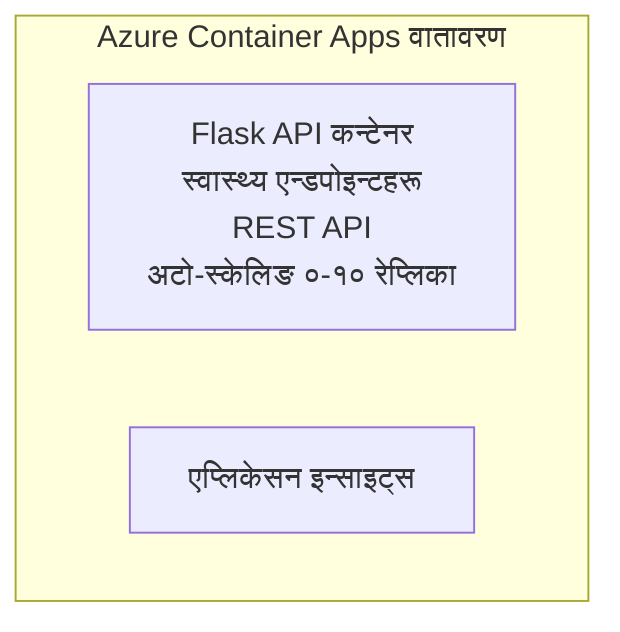

# सरल Flask API - Container App उदाहरण

**अध्ययन मार्ग:** शुरुवाती ⭐ | **समय:** 25-35 minutes | **लागत:** $0-15/month

Azure Developer CLI (azd) प्रयोग गरी Azure Container Apps मा परिनियोजन गरिएको पूर्ण, काम गर्ने Python Flask REST API। यो उदाहरणले कन्टेनर परिनियोजन, अटो-स्केलिङ, र अनुगमनका आधारभूत कुरा देखाउँछ।

## 🎯 तपाईंले के सिक्नुहुनेछ

- कन्टेनर गरिएको Python एप्लिकेशन Azure मा परिनियोजन गर्ने
- scale-to-zero सहित अटो-स्केलिङ कन्फिगर गर्ने
- हेल्थ प्रोब र रेडिनेस चेकहरू लागू गर्ने
- एप्लिकेसन लग र मेट्रिक्स अनुगमन गर्ने
- द्रुत परिनियोजनको लागि Azure Developer CLI प्रयोग गर्ने

## 📦 के समावेश छ

✅ **Flask Application** - CRUD अपरेसनहरू सहित पूर्ण REST API (`src/app.py`)  
✅ **Dockerfile** - प्रोडक्सन-तयार कन्टेनर कन्फिगरेसन  
✅ **Bicep Infrastructure** - Container Apps वातावरण र API परिनियोजन  
✅ **AZD Configuration** - एक कमाण्डमा परिनियोजन सेटअप  
✅ **Health Probes** - Liveness र readiness चेकहरू कन्फिगर गरिएको  
✅ **Auto-scaling** - HTTP लोडको आधारमा 0-10 रेप्लिकाहरू  

## Architecture



## पूर्व आवश्यकताहरू

### आवश्यक
- **Azure Developer CLI (azd)** - [स्थापना मार्गदर्शिका](https://learn.microsoft.com/azure/developer/azure-developer-cli/install-azd)
- **Azure subscription** - [निःशुल्क खाता](https://azure.microsoft.com/free/)
- **Docker Desktop** - [Docker स्थापना](https://www.docker.com/products/docker-desktop/) (स्थानीय परीक्षणका लागि)

### पूर्व आवश्यकताहरू जाँच्नुहोस्

```bash
# azd संस्करण जाँच गर्नुहोस् (1.5.0 वा माथिको आवश्यक)
azd version

# Azure लगइन सत्यापित गर्नुहोस्
azd auth login

# Docker जाँच गर्नुहोस् (वैकल्पिक, स्थानीय परीक्षणको लागि)
docker --version
```

## ⏱️ परिनियोजन समयरेखा

| चरण | अवधि | के हुन्छ |
|-------|----------|--------------||
| Environment setup | 30 seconds | Create azd environment |
| Build container | 2-3 minutes | Docker build Flask app |
| Provision infrastructure | 3-5 minutes | Create Container Apps, registry, monitoring |
| Deploy application | 2-3 minutes | Push image and deploy to Container Apps |
| **कुल** | **8-12 minutes** | पूर्ण परिनियोजन तयार |

## Quick Start

```bash
# उदाहरणमा जानुहोस्
cd examples/container-app/simple-flask-api

# वातावरण आरम्भ गर्नुहोस् (विशिष्ट नाम रोज्नुहोस्)
azd env new myflaskapi

# सबै परिनियोजन गर्नुहोस् (पूर्वाधार + अनुप्रयोग)
azd up
# तपाईंलाई सोधिनेछ:
# 1. Azure सदस्यता चयन गर्नुहोस्
# 2. स्थान चयन गर्नुहोस् (जस्तै, eastus2)
# 3. परिनियोजनको लागि 8-12 मिनेट पर्खनुहोस्

# आफ्नो API एन्डपोइन्ट प्राप्त गर्नुहोस्
azd env get-values

# API परीक्षण गर्नुहोस्
curl $(azd env get-value API_ENDPOINT)/health
```

**अपेक्षित आउटपुट:**
```json
{
  "status": "healthy",
  "timestamp": "2025-11-19T10:30:00Z",
  "service": "simple-flask-api",
  "version": "1.0.0"
}
```

## ✅ परिनियोजन जाँच्नुहोस्

### चरण 1: परिनियोजनको स्थिति जाँच्नुहोस्

```bash
# परिनियोजित सेवाहरू हेर्नुहोस्
azd show

# अपेक्षित आउटपुटले देखाउँछ:
# - सेवा: api
# - अन्त्यबिन्दु: https://ca-api-[env].xxx.azurecontainerapps.io
# - स्थिति: चलिरहेको
```

### चरण 2: API एन्डपोइन्टहरू परीक्षण गर्नुहोस्

```bash
# API एन्डपोइन्ट प्राप्त गर्नुहोस्
API_URL=$(azd env get-value API_ENDPOINT)

# स्वास्थ्य जाँच गर्नुहोस्
curl $API_URL/health

# रुट एन्डपोइन्ट परीक्षण गर्नुहोस्
curl $API_URL/

# एक आइटम सिर्जना गर्नुहोस्
curl -X POST $API_URL/api/items \
  -H "Content-Type: application/json" \
  -d '{"name": "Test Item", "description": "My first item"}'

# सबै आइटमहरू प्राप्त गर्नुहोस्
curl $API_URL/api/items
```

**सफलता मापदण्ड:**
- ✅ हेल्थ एन्डपोइन्टले HTTP 200 फर्काउँछ
- ✅ रूट एन्डपोइन्टले API जानकारी देखाउँछ
- ✅ POST ले आइटम सिर्जना गर्छ र HTTP 201 फर्काउँछ
- ✅ GET ले सिर्जना गरिएका आइटमहरू फर्काउँछ

### चरण 3: लगहरू हेर्नुहोस्

```bash
# azd monitor प्रयोग गरी प्रत्यक्ष लगहरू स्ट्रिम गर्नुहोस्
azd monitor --logs

# वा Azure CLI प्रयोग गर्नुहोस्:
az containerapp logs show --name api --resource-group $RG_NAME --follow

# तपाईंले निम्न देख्नुहुनेछ:
# - Gunicorn स्टार्टअप सन्देशहरू
# - HTTP अनुरोध लगहरू
# - अनुप्रयोग जानकारी लगहरू
```

## प्रोजेक्ट संरचना

```
simple-flask-api/
├── azure.yaml              # AZD configuration
├── infra/
│   ├── main.bicep         # Main infrastructure
│   ├── main.parameters.json
│   └── app/
│       ├── container-env.bicep
│       └── api.bicep
└── src/
    ├── app.py             # Flask application
    ├── requirements.txt
    └── Dockerfile
```

## API एन्डपोइन्टहरू

| एन्डपोइन्ट | विधि | विवरण |
|----------|--------|-------------|
| `/health` | GET | हेल्थ जाँच |
| `/api/items` | GET | सबै आइटमहरू देखाउने |
| `/api/items` | POST | नयाँ आइटम सिर्जना गर्ने |
| `/api/items/{id}` | GET | विशिष्ट आइटम प्राप्त गर्ने |
| `/api/items/{id}` | PUT | आइटम अपडेट गर्ने |
| `/api/items/{id}` | DELETE | आइटम मेटाउने |

## कन्फिगरेसन

### पर्‍यावरण भेरियेबलहरू

```bash
# अनुकूलित विन्यास सेट गर्नुहोस्
azd env set PORT 8000
azd env set LOG_LEVEL info
azd env set MAX_REPLICAS 20
```

### स्केलिङ कन्फिगरेसन

API ले HTTP ट्राफिकको आधारमा स्वचालित रूपमा स्केल हुन्छ:
- **न्यूनतम रेप्लिका**: 0 (आइडल हुँदा शून्यसम्म स्केल हुन्छ)
- **अधिकतम रेप्लिका**: 10
- **प्रति रेप्लिका समानांतर अनुरोधहरू**: 50

## विकास

### स्थानीय रूपमा चलाउने

```bash
# निर्भरता स्थापना गर्नुहोस्
cd src
pip install -r requirements.txt

# एप चलाउनुहोस्
python app.py

# स्थानीय रूपमा परीक्षण गर्नुहोस्
curl http://localhost:8000/health
```

### कन्टेनर निर्माण र परीक्षण

```bash
# Docker छवि निर्माण गर्नुहोस्
docker build -t flask-api:local ./src

# स्थानीय रूपमा कन्टेनर चलाउनुहोस्
docker run -p 8000:8000 flask-api:local

# कन्टेनर परीक्षण गर्नुहोस्
curl http://localhost:8000/health
```

## परिनियोजन

### पूर्ण परिनियोजन

```bash
# पूर्वाधार र अनुप्रयोग तैनाथ गर्नुहोस्
azd up
```

### कोड-मात्र परिनियोजन

```bash
# केवल अनुप्रयोग कोड मात्र परिनियोजन गर्नुहोस् (पूर्वाधार अपरिवर्तित)
azd deploy api
```

### कन्फिगरेसन अपडेट गर्नुहोस्

```bash
# पर्यावरण चरहरू अद्यावधिक गर्नुहोस्
azd env set API_KEY "new-api-key"

# नयाँ कन्फिगरेसन सहित पुनः परिनियोजन गर्नुहोस्
azd deploy api
```

## अनुगमन

### लगहरू हेर्नुहोस्

```bash
# azd monitor प्रयोग गरेर प्रत्यक्ष लगहरू स्ट्रिम गर्नुहोस्
azd monitor --logs

# वा Container Apps का लागि Azure CLI प्रयोग गर्नुहोस्:
az containerapp logs show --name api --resource-group $RG_NAME --follow

# पछिल्ला १०० पंक्तिहरू हेर्नुहोस्
az containerapp logs show --name api --resource-group $RG_NAME --tail 100
```

### मेट्रिक्स अनुगमन गर्नुहोस्

```bash
# Azure Monitor ड्यासबोर्ड खोल्नुहोस्
azd monitor --overview

# निर्दिष्ट मेट्रिक्स हेर्नुहोस्
az monitor metrics list \
  --resource $(azd show --output json | jq -r '.services.api.resourceId') \
  --metric "Requests,ResponseTime"
```

## परीक्षण

### हेल्थ जाँच

```bash
curl $(azd show --output json | jq -r '.services.api.endpoint')/health
```

अपेक्षित प्रतिक्रिया:
```json
{
  "status": "healthy",
  "timestamp": "2025-11-19T10:30:00Z"
}
```

### आइटम सिर्जना

```bash
curl -X POST $(azd show --output json | jq -r '.services.api.endpoint')/api/items \
  -H "Content-Type: application/json" \
  -d '{"name": "Test Item", "description": "A test item"}'
```

### सबै आइटमहरू प्राप्त गर्ने

```bash
curl $(azd show --output json | jq -r '.services.api.endpoint')/api/items
```

## लागत अनुकूलन

यो परिनियोजनले scale-to-zero प्रयोग गर्छ, त्यसैले तपाईंले मात्र API अनुरोध प्रक्रिया गर्दा मात्र तिर्नुहुन्छ:

- **Idle cost**: ~$0/month (आइडल अवस्थामा शून्यमा स्केल हुन्छ)
- **Active cost**: ~$0.000024/second per replica
- **अपेक्षित मासिक लागत** (हल्का प्रयोग): $5-15

### लागत थप घटाउने तरिका

```bash
# विकासका लागि अधिकतम रेप्लिकाहरू घटाउनुहोस्
azd env set MAX_REPLICAS 3

# छोटो निष्क्रिय टाइमआउट प्रयोग गर्नुहोस्
azd env set SCALE_TO_ZERO_TIMEOUT 300  # 5 मिनेट
```

## समस्या समाधान

### कन्टेनर सुरु हुँदैन

```bash
# Azure CLI प्रयोग गरेर कन्टेनर लगहरू जाँच गर्नुहोस्
az containerapp logs show --name api --resource-group $RG_NAME --tail 100

# Docker इमेज स्थानीय रूपमा बन्छ भन्ने पुष्टि गर्नुहोस्
docker build -t test ./src
```

### API पहुँचयोग्य छैन

```bash
# Ingress बाह्य छ कि छैन जाँच गर्नुहोस्
az containerapp show --name api --resource-group rg-simple-flask-api \
  --query properties.configuration.ingress.external
```

### उच्च प्रतिक्रिया समय

```bash
# CPU/मेमोरी प्रयोग जाँच गर्नुहोस्
az monitor metrics list \
  --resource $(azd show --output json | jq -r '.services.api.resourceId') \
  --metric "CPUPercentage,MemoryPercentage"

# आवश्यक परे स्रोतहरू बढाउनुहोस्
az containerapp update --name api --resource-group rg-simple-flask-api \
  --cpu 1.0 --memory 2Gi
```

## सफाई गर्नुहोस्

```bash
# सबै संसाधनहरू मेटाउनुहोस्
azd down --force --purge
```

## अघिला कदमहरू

### यो उदाहरण विस्तार गर्नुहोस्

1. **डेटाबेस थप्नुहोस्** - Azure Cosmos DB वा SQL Database समेकित गर्नुहोस्
   ```bash
   # infra/main.bicep मा Cosmos DB मोड्युल थप्नुहोस्
   # app.py लाई डेटाबेस जडानसहित अद्यावधिक गर्नुहोस्
   ```

2. **प्रमाणीकरण थप्नुहोस्** - Microsoft Entra ID वा API कुञ्जीहरू लागू गर्नुहोस्
   ```python
   # app.py मा प्रमाणीकरण मिडलवेयर थप्नुहोस्
   from functools import wraps
   ```

3. **CI/CD सेटअप गर्नुहोस्** - GitHub Actions workflow
   ```yaml
   # Create .github/workflows/deploy.yml
   name: Deploy to Azure
   on: [push]
   ```

4. **Managed Identity थप्नुहोस्** - Azure सेवाहरूमा सुरक्षित पहुँच
   ```bicep
   # Update infra/app/api.bicep
   identity: { type: 'SystemAssigned' }
   ```

### सम्बन्धित उदाहरणहरू

- **[डेटाबेस एप](../../../../../examples/database-app)** - SQL Database सहित पूर्ण उदाहरण
- **[माइक्रोसर्भिसहरू](../../../../../examples/container-app/microservices)** - बहु-सेवा वास्तुकला
- **[Container Apps मास्टर गाइड](../README.md)** - सबै कन्टेनर ढाँचाहरू

### सिकाइ स्रोतहरू

- 📚 [AZD For Beginners Course](../../../README.md) - मुख्य पाठ्यक्रम पृष्ठ
- 📚 [Container Apps Patterns](../README.md) - थप परिनियोजन ढाँचाहरू
- 📚 [AZD Templates Gallery](https://azure.github.io/awesome-azd/) - समुदाय टेम्प्लेटहरू

## थप स्रोतहरू

### डकुमेन्टेशन
- **[Flask Documentation](https://flask.palletsprojects.com/)** - Flask फ्रेमवर्क गाइड
- **[Azure Container Apps](https://learn.microsoft.com/azure/container-apps/)** - आधिकारिक Azure दस्तावेजहरू
- **[Azure Developer CLI](https://learn.microsoft.com/azure/developer/azure-developer-cli/)** - azd कमाण्ड संदर्भ

### ट्युटोरियलहरू
- **[Container Apps Quickstart](https://learn.microsoft.com/azure/container-apps/quickstart-portal)** - तपाईंको पहिलो एप परिनियोजन गर्नुहोस्
- **[Python on Azure](https://learn.microsoft.com/azure/developer/python/)** - Python विकास गाइड
- **[Bicep Language](https://learn.microsoft.com/azure/azure-resource-manager/bicep/)** - इन्फ्रास्ट्रक्चरलाई कोडका रूपमा

### उपकरणहरू
- **[Azure Portal](https://portal.azure.com)** - संसाधनहरू दृश्य रूपमा व्यवस्थापन गर्नुहोस्
- **[VS Code Azure Extension](https://marketplace.visualstudio.com/items?itemName=ms-azuretools.vscode-azurecontainerapps)** - IDE एकीकरण

---

**🎉 बधाई छ!** तपाईंले अटो-स्केलिङ र अनुगमन सहित Azure Container Apps मा उत्पादन-तयार Flask API परिनियोजन गर्नुभयो।

**प्रश्नहरू?** [इशु खोल्नुहोस्](https://github.com/microsoft/AZD-for-beginners/issues) वा [FAQ](../../../resources/faq.md) जाँच्नुहोस्

---

<!-- CO-OP TRANSLATOR DISCLAIMER START -->
**अस्वीकरण**:
यो दस्तावेज़ AI अनुवाद सेवा [Co-op Translator](https://github.com/Azure/co-op-translator) प्रयोग गरेर अनुवाद गरिएको हो। हामी सही हुन प्रयास गर्छौं, तर कृपया जानकार हुनुस् कि स्वचालित अनुवादमा त्रुटिहरू वा अशुद्धताहरू हुन सक्छन्। मूल दस्तावेज़ यसको मूल भाषामा आधिकारिक स्रोत मानिनुपर्छ। महत्वपूर्ण जानकारीका लागि व्यावसायिक मानव अनुवाद सिफारिस गरिन्छ। यस अनुवादको प्रयोगबाट उत्पन्न कुनै पनि गलत बुझाइ वा त्रुटिको लागि हामी जिम्मेवार छैनौं।
<!-- CO-OP TRANSLATOR DISCLAIMER END -->