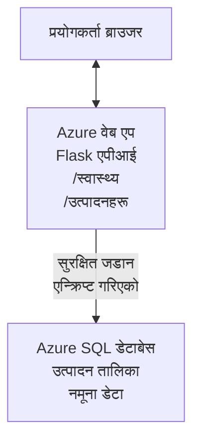

# Deploying a Microsoft SQL Database and Web App with AZD

⏱️ **Estimated Time**: 20-30 minutes | 💰 **Estimated Cost**: ~$15-25/month | ⭐ **Complexity**: Intermediate

यो **पूरा, काम गर्ने उदाहरण** ले देखाउँछ कसरी [Azure Developer CLI (azd)](https://learn.microsoft.com/azure/developer/azure-developer-cli/) प्रयोग गरेर Microsoft SQL Database सहितको Python Flask वेब एप्लिकेसन Azure मा डिप्लोय गर्ने। सबै कोड समावेश र परीक्षण गरिएको छ—कुनै बाह्य निर्भरता आवश्यक छैन।

## What You'll Learn

यस उदाहरणलाई पूरा गरेर तपाईंले:
- इन्फ्रास्ट्रक्चर-एज-कोड प्रयोग गरी बहु-टियर एप्लिकेसन (वेब एप + डाटाबेस) डिप्लोय गर्न सिक्नुहुनेछ
- सेक्युर डाटाबेस कनेक्शनहरू कडा कोडिङ नगरी कसरी कन्फिगर गर्ने
- Application Insights मार्फत एप्लिकेसन स्वास्थ्य अनुगमन गर्ने
- AZD CLI प्रयोग गरी Azure स्रोतहरू प्रभावकारी रूपमा व्यवस्थापन गर्ने
- सुरक्षा, लागत अनुकूलन, र अव्जर्भबिलिटीका लागि Azure का उत्तम अभ्यासहरू पालन गर्ने

## Scenario Overview
- **Web App**: डेटाबेस कनेक्टिभिटी सहितको Python Flask REST API
- **Database**: नमूना डाटा सहितको Azure SQL Database
- **Infrastructure**: Bicep प्रयोग गरी प्रोभिजन गरिएको (मोडुलर, पुन:प्रयोगयोग्य टेम्पलेटहरू)
- **Deployment**: `azd` कमाण्डहरूसँग पूर्ण रूपमा स्वचालित
- **Monitoring**: लग र टेलिमेट्रीका लागि Application Insights

## Prerequisites

### Required Tools

सुरु गर्नु अघि, यी उपकरणहरू इन्स्टल गरिएको सुनिश्चित गर्नुहोस्:

1. **[Azure CLI](https://learn.microsoft.com/cli/azure/install-azure-cli)** (version 2.50.0 or higher)
   ```sh
   az --version
   # अपेक्षित आउटपुट: azure-cli 2.50.0 वा माथि
   ```

2. **[Azure Developer CLI (azd)](https://learn.microsoft.com/azure/developer/azure-developer-cli/install-azd)** (version 1.0.0 or higher)
   ```sh
   azd version
   # अपेक्षित आउटपुट: azd संस्करण 1.0.0 वा माथि
   ```

3. **[Python 3.8+](https://www.python.org/downloads/)** (स्थानीय विकासका लागि)
   ```sh
   python --version
   # अपेक्षित आउटपुट: Python 3.8 वा उच्च
   ```

4. **[Docker](https://www.docker.com/get-started)** (वैकल्पिक, स्थानीय कन्टेनराइज्ड विकासका लागि)
   ```sh
   docker --version
   # अपेक्षित नतिजा: Docker संस्करण 20.10 वा सोभन्दा नयाँ
   ```

### Azure Requirements

- एक सक्रिय **Azure subscription** ([create a free account](https://azure.microsoft.com/free/))
- तपाईँको सब्स्क्रिप्शनमा स्रोतहरू सिर्जना गर्ने अनुमतिहरू
- सब्स्क्रिप्शन वा रिसोर्स ग्रुपमा **Owner** वा **Contributor** भूमिका

### Knowledge Prerequisites

यो **मध्यम-स्तर** उदाहरण हो। तपाईंले परिचित हुनु आवश्यक छ:
- आधारभूत कमाण्ड-लाइन अपरेसनहरू
- क्लाउडका आधारभूत अवधारणाहरू (resources, resource groups)
- वेब एप्लिकेसन र डाटाबेसहरूको आधारभूत बुझाइ

**AZD मा नयाँ हुनुहुन्छ?** सुरु गर्न [Getting Started guide](../../docs/chapter-01-foundation/azd-basics.md) हेर्नुहोस्।

## Architecture

यस उदाहरणले वेब एप्लिकेसन र SQL डाटाबेस सहित दुई-टियर आर्किटेक्चर डिप्लोय गर्छ:


**Resource Deployment:**
- **Resource Group**: सबै स्रोतहरूको कन्टेनर
- **App Service Plan**: Linux-आधारित होस्टिङ (लागत प्रभावकारिताका लागि B1 tier)
- **Web App**: Flask एप्लिकेसनसहित Python 3.11 runtime
- **SQL Server**: TLS 1.2 न्यूनतम रहेको म्यानेज्ड डाटाबेस सर्भर
- **SQL Database**: Basic tier (2GB, विकास/टेस्टिङका लागि उपयुक्त)
- **Application Insights**: अनुगमन र लगिङ
- **Log Analytics Workspace**: केन्द्रित लग स्टोरेज

**Analogy**: यसलाई रेस्टुरेन्ट (वेब एप) र वाक-इन फ्रिजर (डाटाबेस) को जस्तो सोच्नुहोस्। ग्राहकहरूले मेनुबाट अर्डर गर्छन् (API endpoints), र किचेन (Flask एप) फ्रिजरबाट सामग्री (डाटा) ल्याउँछ। रेस्टुरेन्ट म्यानेजर (Application Insights) सबै गतिविधिहरू ट्र्याक गर्छ।

## Folder Structure

यस उदाहरणमा सबै फाइलहरू समावेश गरिएको छ—कुनै बाह्य निर्भरता आवश्यक छैन:

```
examples/database-app/
│
├── README.md                    # This file
├── azure.yaml                   # AZD configuration file
├── .env.sample                  # Sample environment variables
├── .gitignore                   # Git ignore patterns
│
├── infra/                       # Infrastructure as Code (Bicep)
│   ├── main.bicep              # Main orchestration template
│   ├── abbreviations.json      # Azure naming conventions
│   └── resources/              # Modular resource templates
│       ├── sql-server.bicep    # SQL Server configuration
│       ├── sql-database.bicep  # Database configuration
│       ├── app-service-plan.bicep  # Hosting plan
│       ├── app-insights.bicep  # Monitoring setup
│       └── web-app.bicep       # Web application
│
└── src/
    └── web/                    # Application source code
        ├── app.py              # Flask REST API
        ├── requirements.txt    # Python dependencies
        └── Dockerfile          # Container definition
```

**What Each File Does:**
- **azure.yaml**: AZD लाई के डिप्लोय गर्ने र कहाँ भन्ने बताउँछ
- **infra/main.bicep**: सबै Azure स्रोतहरू समन्वय गर्छ
- **infra/resources/*.bicep**: व्यक्तिगत स्रोत परिभाषाहरू (पुन:प्रयोगका लागि मोडुलर)
- **src/web/app.py**: डेटाबेस लॉजिक सहितको Flask एप्लिकेसन
- **requirements.txt**: Python प्याकेज निर्भरता
- **Dockerfile**: डिप्लोयका लागि कन्टेनराइजेसन निर्देशहरू

## Quickstart (Step-by-Step)

### Step 1: Clone and Navigate

```sh
git clone https://github.com/microsoft/AZD-for-beginners.git
cd AZD-for-beginners/examples/database-app
```

**✓ Success Check**: `azure.yaml` र `infra/` फोल्डर देखिन्छ भनी पुष्टि गर्नुहोस्:
```sh
ls
# अपेक्षित: README.md, azure.yaml, infra/, src/
```

### Step 2: Authenticate with Azure

```sh
azd auth login
```

यसले Azure प्रमाणिकरणका लागि तपाईंको ब्राउजर खोल्नेछ। Azure क्रेडेन्शियलहरूसँग साइन इन गर्नुहोस्।

**✓ Success Check**: तपाईँले यो देख्नुपर्नेछ:
```
Logged in to Azure.
```

### Step 3: Initialize the Environment

```sh
azd init
```

**के हुन्छ**: AZD ले तपाईंको डिप्लोयमेन्टका लागि स्थानीय कन्फिगरेसन बनाउँछ।

**प्राँप्टहरू जुन तपाईंले देख्नुहुनेछ**:
- **Environment name**: छोटो नाम प्रविष्ट गर्नुहोस् (जस्तै `dev`, `myapp`)
- **Azure subscription**: सूचीबाट आफ्नो सब्स्क्रिप्शन छान्नुहोस्
- **Azure location**: एक क्षेत्र छान्नुहोस् (जस्तै `eastus`, `westeurope`)

**✓ Success Check**: तपाईँले यो देख्नुपर्नेछ:
```
SUCCESS: New project initialized!
```

### Step 4: Provision Azure Resources

```sh
azd provision
```

**के हुन्छ**: AZD ले सबै इन्फ्रास्ट्रक्चर डिप्लोय गर्छ (5-8 मिनेट लाग्छ):
1. Resource group सिर्जना गर्छ
2. SQL Server र Database सिर्जना गर्छ
3. App Service Plan सिर्जना गर्छ
4. Web App सिर्जना गर्छ
5. Application Insights सिर्जना गर्छ
6. नेटवर्किङ र सुरक्षा कन्फिगर गर्छ

**तपाईंलाई सोधिनेछ**:
- **SQL admin username**: एक प्रयोगकर्ता नाम प्रविष्ट गर्नुहोस् (जस्तै `sqladmin`)
- **SQL admin password**: बलियो पासवर्ड प्रविष्ट गर्नुहोस् (यो सुरक्षित राख्नुहोस्!)

**✓ Success Check**: तपाईँले यो देख्नुपर्नेछ:
```
SUCCESS: Your application was provisioned in Azure in X minutes Y seconds.
You can view the resources created under the resource group rg-<env-name> in Azure Portal:
https://portal.azure.com/#@/resource/subscriptions/.../resourceGroups/rg-<env-name>
```

**⏱️ Time**: 5-8 minutes

### Step 5: Deploy the Application

```sh
azd deploy
```

**के हुन्छ**: AZD ले तपाईंको Flask एप्लिकेसन बनाउँछ र डिप्लोय गर्छ:
1. Python एप्लिकेसन प्याकेज गर्छ
2. Docker कन्टेनर बनाउँछ
3. Azure Web App मा पुश गर्छ
4. नमूना डाटासहित डेटाबेस इनिसियलाइज गर्छ
5. एप्लिकेसन सुरु गर्छ

**✓ Success Check**: तपाईँले यो देख्नुपर्नेछ:
```
SUCCESS: Your application was deployed to Azure in X minutes Y seconds.
You can view the resources created under the resource group rg-<env-name> in Azure Portal:
https://portal.azure.com/#@/resource/subscriptions/.../resourceGroups/rg-<env-name>
```

**⏱️ Time**: 3-5 minutes

### Step 6: Browse the Application

```sh
azd browse
```

यसले `https://app-<unique-id>.azurewebsites.net` मा तपाइँको डिप्लोय गरिएको वेब एप ब्राउजरमा खोल्नेछ

**✓ Success Check**: तपाईँले JSON आउटपुट देख्नुपर्नेछ:
```json
{
  "message": "Welcome to the Database App API",
  "endpoints": {
    "/": "This help message",
    "/health": "Health check endpoint",
    "/products": "List all products",
    "/products/<id>": "Get product by ID"
  }
}
```

### Step 7: Test the API Endpoints

**Health Check** (डेटाबेस कनेक्शन जाँच गर्नुहोस्):
```sh
curl https://app-<your-id>.azurewebsites.net/health
```

**Expected Response**:
```json
{
  "status": "healthy",
  "database": "connected"
}
```

**List Products** (नमूना डाटा):
```sh
curl https://app-<your-id>.azurewebsites.net/products
```

**Expected Response**:
```json
[
  {
    "id": 1,
    "name": "Laptop",
    "description": "High-performance laptop",
    "price": 1299.99,
    "created_at": "2025-11-19T10:30:00"
  },
  ...
]
```

**Get Single Product**:
```sh
curl https://app-<your-id>.azurewebsites.net/products/1
```

**✓ Success Check**: सबै endpoints बिना त्रुटि JSON डाटा फर्काउँछन्।

---

**🎉 Congratulations!** तपाईंले सफलतापूर्वक AZD प्रयोग गरी Azure मा डाटाबेस सहित वेब एप्लिकेसन डिप्लोय गर्नुभयो।

## Configuration Deep-Dive

### Environment Variables

सिक्रेटहरू Azure App Service कन्फिगरेसन मार्फत सुरक्षित रूपमा व्यवस्थापन गरिन्छ—**स्रोत कोडमा कहिले पनि कडा-कोड नगर्नुहोस्**।

**AZD ले स्वचालित रूपमा कन्फिगर गर्छ**:
- `SQL_CONNECTION_STRING`: एन्क्रिप्ट गरिएको क्रेडेन्शियलसहितको डेटाबेस कनेक्सन
- `APPLICATIONINSIGHTS_CONNECTION_STRING`: मोनिटरिङ टेलिमेट्री अन्तबिन्दु
- `SCM_DO_BUILD_DURING_DEPLOYMENT`: स्वचालित निर्भरता इन्स्टलेशन सक्षम पार्छ

**सिक्रेटहरू कहाँ भण्डारण गरिन्छ**:
1. `azd provision` गर्दै गर्दा, तपाईं SQL क्रेडेन्शियलहरू सुरक्षित प्राँप्टमार्फत प्रदान गर्नुहुन्छ
2. AZD यीहरूलाई तपाईंको स्थानीय `.azure/<env-name>/.env` फाइलमा स्टोर गर्छ (git-ignored)
3. AZD यीलाई Azure App Service कन्फिगरेसनमा इन्जेक्ट गर्छ (रेस्टमा एन्क्रिप्ट गरिएको)
4. एप्लिकेसनले `os.getenv()` मार्फत रनटाइममा पढ्छ

### Local Development

लोकल परीक्षणका लागि, नमूनाबाट `.env` फाइल बनाउनुहोस्:

```sh
cp .env.sample .env
# .env लाई आफ्नो स्थानीय डेटाबेस कनेक्शनसहित सम्पादन गर्नुहोस्
```

**Local Development Workflow**:
```sh
# निर्भरता स्थापना गर्नुहोस्
cd src/web
pip install -r requirements.txt

# पर्यावरण चरहरू सेट गर्नुहोस्
export SQL_CONNECTION_STRING="your-local-connection-string"

# अनुप्रयोग चलाउनुहोस्
python app.py
```

**Test locally**:
```sh
curl http://localhost:8000/health
# अपेक्षित: {"status": "healthy", "database": "connected"}
```

### Infrastructure as Code

सबै Azure स्रोतहरू **Bicep टेम्पलेटहरू** (`infra/` फोल्डर) मा परिभाषित छन्:

- **Modular Design**: प्रत्येक स्रोत प्रकारको आफ्नै फाइल हुन्छ पुन:प्रयोगका लागि
- **Parameterized**: SKUs, क्षेत्रहरू, नामकरण कन्वेन्शनहरू अनुकूलित गर्न सकिन्छ
- **Best Practices**: Azure नामकरण मापदण्ड र सुरक्षा डिफल्टहरू अनुसरण हुन्छ
- **Version Controlled**: इन्फ्रास्ट्रक्चर परिवर्तनहरू Git मा ट्रयाक हुन्छन्

**Customization Example**:
डाटाबेस टियर परिवर्तन गर्न, सम्पादन गर्नुहोस् `infra/resources/sql-database.bicep`:
```bicep
sku: {
  name: 'Standard'  // Changed from 'Basic'
  tier: 'Standard'
  capacity: 10
}
```

## Security Best Practices

यो उदाहरणले Azure सुरक्षा उत्तम अभ्यासहरू पालन गरेको छ:

### 1. **No Secrets in Source Code**
- ✅ क्रेडेन्शियलहरू Azure App Service कन्फिगरेसनमा भण्डारण गरिन्छ (एन्क्रिप्ट गरिएको)
- ✅ `.env` फाइलहरू Git बाट `.gitignore` मार्फत बाहिर राखिन्छ
- ✅ प्रोभिजनिङको क्रममा सुरक्षित प्यारामिटरहरू मार्फत सिक्रेटहरू पठाइन्छ

### 2. **Encrypted Connections**
- ✅ SQL Server का लागि TLS 1.2 न्यूनतम
- ✅ Web App का लागि केवल HTTPS अनिवार्य
- ✅ डाटाबेस कनेक्शनहरू एन्क्रिप्टेड च्यानलहरू प्रयोग गर्छन्

### 3. **Network Security**
- ✅ SQL Server फायरवाल Azure services लाई मात्र अनुमति दिने गरी कन्फिगर गरिएको
- ✅ सार्वजनिक नेटवर्क पहुँच सीमित गरिएको (Private Endpoints ले थप कडा गर्न सकिन्छ)
- ✅ Web App मा FTPS अक्षम गरिएको

### 4. **Authentication & Authorization**
- ⚠️ **वर्तमान**: SQL authentication (username/password)
- ✅ **उत्पादन सिफारिस**: पासवर्डरहित प्रमाणिकरणका लागि Azure Managed Identity प्रयोग गर्ने

**Managed Identity मा अपग्रेड गर्न** (उत्पादनका लागि):
1. Web App मा managed identity सक्षम गर्नुहोस्
2. identity लाई SQL अनुमति दिनुहोस्
3. कनेक्शन स्ट्रिंग अपडेट गरी managed identity प्रयोग गर्नुहोस्
4. पासवर्ड-आधारित प्रमाणिकरण हटाउनुहोस्

### 5. **Auditing & Compliance**
- ✅ Application Insights ले सबै रिक्वेस्ट र त्रुटिहरू लग गर्छ
- ✅ SQL Database auditing सक्षम गरिएको (कम्प्लायन्सका लागि कन्फिगर गर्न मिल्छ)
- ✅ सबै स्रोतहरू शासनका लागि ट्याग गरिएको

**Production अघि सुरक्षा चेकलिस्ट**:
- [ ] Azure Defender for SQL सक्षम गर्नुहोस्
- [ ] SQL Database का लागि Private Endpoints कन्फिगर गर्नुहोस्
- [ ] Web Application Firewall (WAF) सक्षम गर्नुहोस्
- [ ] सिक्रेट रोटेसनका लागि Azure Key Vault लागू गर्नुहोस्
- [ ] Azure AD प्रमाणिकरण कन्फिगर गर्नुहोस्
- [ ] सबै स्रोतहरूको लागि डायग्नोस्टिक लगिङ सक्षम गर्नुहोस्

## Cost Optimization

**Estimated Monthly Costs** (as of November 2025):

| Resource | SKU/Tier | Estimated Cost |
|----------|----------|----------------|
| App Service Plan | B1 (Basic) | ~$13/month |
| SQL Database | Basic (2GB) | ~$5/month |
| Application Insights | Pay-as-you-go | ~$2/month (low traffic) |
| **Total** | | **~$20/month** |

**💡 Cost-Saving Tips**:

1. **Use Free Tier for Learning**:
   - App Service: F1 tier (free, limited hours)
   - SQL Database: Use Azure SQL Database serverless
   - Application Insights: 5GB/month free ingestion

2. **Stop Resources When Not in Use**:
   ```sh
   # वेब एप रोक्नुहोस् (डेटाबेसले अझै पनि शुल्क लिन्छ)
   az webapp stop --name <app-name> --resource-group <rg-name>
   
   # आवश्यक परे पुन: सुरु गर्नुहोस्
   az webapp start --name <app-name> --resource-group <rg-name>
   ```

3. **Delete Everything After Testing**:
   ```sh
   azd down
   ```
   यसले सबै स्रोतहरू हटाउँछ र चार्ज रोक्छ।

4. **Development vs. Production SKUs**:
   - **Development**: Basic tier (यस उदाहरणमा प्रयोग गरिएको)
   - **Production**: redundancy सहितको Standard/Premium tier

**Cost Monitoring**:
- लागत हेर्नुहोस् [Azure Cost Management](https://portal.azure.com/#view/Microsoft_Azure_CostManagement)
- अनपेक्षित खर्चबाट बच्न लागत अलर्ट सेट अप गर्नुहोस्
- ट्रयाकिङका लागि सबै स्रोतहरूलाई `azd-env-name` ट्याग गर्नुहोस्

**Free Tier Alternative**:
शिक्षाका लागि, तपाईंले संशोधन गर्न सक्नुहुन्छ `infra/resources/app-service-plan.bicep`:
```bicep
sku: {
  name: 'F1'  // Free tier
  tier: 'Free'
}
```
**Note**: Free tier मा सीमाहरू छन् (60 min/day CPU, no always-on).

## Monitoring & Observability

### Application Insights Integration

यो उदाहरणमा व्यापक अनुगमनका लागि **Application Insights** समावेश गरिएको छ:

**के के अनुगमन गरिन्छ**:
- ✅ HTTP अनुरोधहरू (लेटेन्सी, स्टाटस कोडहरू, endpoints)
- ✅ एप्लिकेसन त्रुटी र अपवादहरू
- ✅ Flask एपबाट कस्टम लगिङ
- ✅ डेटाबेस कनेक्शन स्वास्थ्य
- ✅ प्रदर्शन मेट्रिक्स (CPU, मेमोरी)

**Application Insights पहुँच गर्ने तरिकाहरू**:
1. [Azure Portal](https://portal.azure.com) खोल्नुहोस्
2. तपाइँको resource group (`rg-<env-name>`) मा जानुहोस्
3. Application Insights स्रोतमा क्लिक गर्नुहोस् (`appi-<unique-id>`)

**उपयोगी क्वेरीहरू** (Application Insights → Logs):

**View All Requests**:
```kusto
requests
| where timestamp > ago(1h)
| order by timestamp desc
| project timestamp, name, url, resultCode, duration
```

**Find Errors**:
```kusto
exceptions
| where timestamp > ago(24h)
| order by timestamp desc
| project timestamp, type, outerMessage, operation_Name
```

**Check Health Endpoint**:
```kusto
requests
| where name contains "health"
| summarize count() by resultCode, bin(timestamp, 1h)
```

### SQL Database Auditing

**SQL Database auditing सक्षम गरिएको छ** ताकि ट्र्याक गरियोस:
- डेटाबेस पहुँच ढाँचा
- असफल लगिन प्रयासहरू
- स्किमा परिवर्तनहरू
- डेटा पहुँच (कम्प्लायन्सका लागि)

**Audit Logs कसरी हेर्ने**:
1. Azure Portal → SQL Database → Auditing
2. Log Analytics workspace मा लगहरू हेर्नुहोस्

### Real-Time Monitoring

**Live Metrics हेर्ने**:
1. Application Insights → Live Metrics
2. रियल-टाइममा रिक्वेस्टहरू, फेल्योरहरू, र प्रदर्शन हेर्नुहोस्

**Alerts सेटअप गर्नुहोस्**:
महत्त्वपूर्ण घटनाहरूका लागि अलर्ट बनाउनुहोस्:
- HTTP 500 त्रुटी > 5 पाँच मिनेटमा
- डेटाबेस कनेक्शन फेल्योरहरू
- उच्च प्रतिक्रिया समय (>2 seconds)

**Example Alert Creation**:
```sh
az monitor metrics alert create \
  --name "High-Response-Time" \
  --resource-group <rg-name> \
  --scopes <app-insights-resource-id> \
  --condition "avg requests/duration > 2000" \
  --description "Alert when response time exceeds 2 seconds"
```

## Troubleshooting
### सामान्य समस्या र समाधान

#### 1. `azd provision` fails with "Location not available"

**लक्षण**:
```
Error: The subscription is not registered for the resource type 'components' in the location 'centralus'.
```

**समाधान**:
अर्को Azure क्षेत्र छान्नुहोस् वा स्रोत प्रदायकलाई दर्ता गर्नुहोस्:
```sh
az provider register --namespace Microsoft.Insights
```

#### 2. SQL Connection Fails During Deployment

**लक्षण**:
```
pyodbc.OperationalError: ('08001', '[08001] [Microsoft][ODBC Driver 18 for SQL Server]TCP Provider...')
```

**समाधान**:
- SQL Server फायरवालले Azure सेवाहरूलाई अनुमति दिएको छ भनी सत्यापित गर्नुहोस् (स्वतः कन्फिगर गरिन्छ)
- `azd provision` चलाउँदा SQL प्रशासक पासवर्ड सही रूपमा प्रविष्ट गरिएको छ कि छैन जाँच्नुहोस्
- SQL Server पूर्ण रूपमा provisioning भएको सुनिश्चित गर्नुहोस् (2-3 मिनेट लिन सक्छ)

**जडान जाँच्नुहोस्**:
```sh
# Azure पोर्टलबाट, SQL Database → क्वेरी सम्पादकमा जानुहोस्
# आफ्ना प्रमाण-पत्रहरू प्रयोग गरी जडान गर्न प्रयास गर्नुहोस्.
```

#### 3. Web App Shows "Application Error"

**लक्षण**:
ब्राउजरले सामान्य त्रुटि पृष्ठ देखाउँछ।

**समाधान**:
अनुप्रयोग लगहरू जाँच्नुहोस्:
```sh
# हालैका लगहरू हेर्नुहोस्
az webapp log tail --name <app-name> --resource-group <rg-name>
```

**सामान्य कारणहरू**:
- वातावरण चरहरू हराइरहेको छ (App Service → Configuration जाँच्नुहोस्)
- Python प्याकेज इन्स्टलेसन असफल भयो (डिप्लोयमेन्ट लगहरू जाँच गर्नुहोस्)
- डेटाबेस इनिशियलाइजेशन त्रुटि (SQL कनेक्टिभिटी जाँच गर्नुहोस्)

#### 4. `azd deploy` Fails with "Build Error"

**लक्षण**:
```
Error: Failed to build project
```

**समाधान**:
- `requirements.txt` मा कुनै सिन्ट्याक्स त्रुटि छैन भनी सुनिश्चित गर्नुहोस्
- `infra/resources/web-app.bicep` मा Python 3.11 निर्दिष्ट गरिएको छ कि छैन जाँच्नुहोस्
- Dockerfile मा सहि बेस इमेज छ भनी प्रमाणित गर्नुहोस्

**स्थानीय रूपमा डिबग गर्नुहोस्**:
```sh
cd src/web
docker build -t test-app .
docker run -p 8000:8000 test-app
```

#### 5. "Unauthorized" When Running AZD Commands

**लक्षण**:
```
ERROR: (Unauthorized) The client '<id>' with object id '<id>' does not have authorization
```

**समाधान**:
Azure सँग पुन: प्रमाणीकरण गर्नुहोस्:
```sh
azd auth login
az login
```

सदस्यतामा तपाइँसँग सहि अनुमति (Contributor भूमिका) छ कि छैन भनी सत्यापित गर्नुहोस्।

#### 6. High Database Costs

**लक्षण**:
अनपेक्षित Azure बिल।

**समाधान**:
- परीक्षणपछि `azd down` चलाउन बिर्सिनुभएको छ कि छैन जाँच्नुहोस्
- SQL Database Basic टियरमा छ कि छैन भनी पुष्टि गर्नुहोस् (Premium होइन)
- Azure Cost Management मा लागतहरू समीक्षा गर्नुहोस्
- लागत सूचना अलर्टहरू सेट अप गर्नुहोस्

### सहायता प्राप्त गर्नुहोस्

**सबै AZD वातावरण चरहरू हेर्नुहोस्**:
```sh
azd env get-values
```

**तैनाती स्थिति जाँच्नुहोस्**:
```sh
az webapp show --name <app-name> --resource-group <rg-name> --query state
```

**अनुप्रयोग लगहरू पहुँच/हेर्नुहोस्**:
```sh
az webapp log download --name <app-name> --resource-group <rg-name> --log-file app-logs.zip
```

**थप सहयोग चाहिन्छ?**
- [AZD समस्याहरू समाधान मार्गदर्शिका](../../docs/chapter-07-troubleshooting/common-issues.md)
- [Azure App Service समस्याहरू निवारण](https://learn.microsoft.com/azure/app-service/troubleshoot-diagnostic-logs)
- [Azure SQL समस्याहरू निवारण](https://learn.microsoft.com/azure/azure-sql/database/troubleshoot-common-errors-issues)

## व्यावहारिक अभ्यासहरू

### अभ्यास 1: आफ्नो तैनाती पुष्टि गर्नुहोस् (शुरुवाती)

**लक्ष्य**: सबै स्रोतहरू तैनात भएका छन् र अनुप्रयोग काम गरिरहेको छ भन्ने पुष्टि गर्नुहोस्।

**स्टेपहरू**:
1. आफ्नो resource group मा सबै स्रोतहरू सूचीबद्ध गर्नुहोस्:
   ```sh
   az resource list --resource-group rg-<env-name> --output table
   ```
   **अपेक्षित**: 6-7 स्रोतहरू (Web App, SQL Server, SQL Database, App Service Plan, Application Insights, Log Analytics)

2. सबै API endpoints परीक्षण गर्नुहोस्:
   ```sh
   curl https://app-<your-id>.azurewebsites.net/
   curl https://app-<your-id>.azurewebsites.net/health
   curl https://app-<your-id>.azurewebsites.net/products
   curl https://app-<your-id>.azurewebsites.net/products/1
   ```
   **अपेक्षित**: सबैले त्रुटि बिना मान्य JSON फर्काउँछन्

3. Application Insights जाँच्नुहोस्:
   - Azure Portal मा Application Insights मा जानुहोस्
   - "Live Metrics" मा जानुहोस्
   - वेब एपमा आफ्नो ब्राउजर रिफ्रेस गर्नुहोस्
   **अपेक्षित**: अनुरोधहरू वास्तविक समयमा देखिन्छन्

**सफलता मापदण्ड**: सबै 6-7 स्रोतहरू अवस्थित छन्, सबै endpoints ले डेटा फर्काउँछन्, Live Metrics सक्रियता देखाउँछ।

---

### अभ्यास 2: नयाँ API Endpoint थप्नुहोस् (मध्यम)

**लक्ष्य**: Flask अनुप्रयोगलाई नयाँ endpoint सँग विस्तार गर्नुहोस्।

**स्टार्टर कोड**: वर्तमान endpoints `src/web/app.py` मा

**स्टेपहरू**:
1. `src/web/app.py` सम्पादन गर्नुहोस् र `get_product()` फङ्क्शनको पछि नयाँ endpoint थप्नुहोस्:
   ```python
   @app.route('/products/search/<keyword>')
   def search_products(keyword):
       """Search products by name or description."""
       try:
           conn = get_db_connection()
           cursor = conn.cursor()
           cursor.execute(
               "SELECT id, name, description, price, created_at FROM products WHERE name LIKE ? OR description LIKE ?",
               (f'%{keyword}%', f'%{keyword}%')
           )
           
           products = []
           for row in cursor.fetchall():
               products.append({
                   'id': row[0],
                   'name': row[1],
                   'description': row[2],
                   'price': float(row[3]) if row[3] else None,
                   'created_at': row[4].isoformat() if row[4] else None
               })
           
           cursor.close()
           conn.close()
           
           logger.info(f"Search for '{keyword}' returned {len(products)} results")
           return jsonify(products), 200
           
       except Exception as e:
           logger.error(f"Error searching products: {str(e)}")
           return jsonify({'error': str(e)}), 500
   ```

2. अपडेट गरिएको अनुप्रयोग तैनात गर्नुहोस्:
   ```sh
   azd deploy
   ```

3. नयाँ endpoint परीक्षण गर्नुहोस्:
   ```sh
   curl https://app-<your-id>.azurewebsites.net/products/search/laptop
   ```
   **अपेक्षित**: "laptop" सँग मेल खाने उत्पादनहरू फर्किन्छन्

**सफलता मापदण्ड**: नयाँ endpoint कार्य गर्दछ, फिल्टर गरिएको परिणाम फर्किन्छ, Application Insights लगहरूमा देखिन्छ।

---

### अभ्यास 3: निगरानी र अलर्टहरू थप्नुहोस् (उन्नत)

**लक्ष्य**: अलर्टहरू सहित सक्रिय निगरानी सेट अप गर्नुहोस्।

**स्टेपहरू**:
1. HTTP 500 त्रुटिहरूको लागि अलर्ट सिर्जना गर्नुहोस्:
   ```sh
   # Application Insights स्रोत ID प्राप्त गर्नुहोस्
   AI_ID=$(az monitor app-insights component show \
     --app appi-<your-id> \
     --resource-group rg-<env-name> \
     --query id -o tsv)
   
   # अलर्ट सिर्जना गर्नुहोस्
   az monitor metrics alert create \
     --name "High-Error-Rate" \
     --resource-group rg-<env-name> \
     --scopes $AI_ID \
     --condition "count requests/failed > 5" \
     --window-size 5m \
     --evaluation-frequency 1m \
     --description "Alert when >5 failed requests in 5 minutes"
   ```

2. त्रुटि सिर्जना गरेर अलर्ट ट्रिगर गर्नुहोस्:
   ```sh
   # अस्तित्वमा नभएको उत्पादनको अनुरोध
   for i in {1..10}; do curl https://app-<your-id>.azurewebsites.net/products/999; done
   ```

3. अलर्ट फ़ायर भयो कि भएन जाँच्नुहोस्:
   - Azure Portal → Alerts → Alert Rules
   - तपाइँको इमेल जाँच्नुहोस् (यदि कन्फिगर गरिएको छ भने)

**सफलता मापदण्ड**: अलर्ट नियम सिर्जना भएको छ, त्रुटिमा ट्रिगर हुन्छ, सूचना प्राप्त हुन्छ।

---

### अभ्यास 4: डेटाबेस स्किमामा परिवर्तनहरू (उन्नत)

**लक्ष्य**: नयाँ तालिका थप्नुहोस् र अनुप्रयोगलाई यसको प्रयोग गर्न परिमार्जन गर्नुहोस्।

**स्टेपहरू**:
1. Azure Portal Query Editor मार्फत SQL Database मा जडान गर्नुहोस्

2. नयाँ `categories` तालिका सिर्जना गर्नुहोस्:
   ```sql
   CREATE TABLE categories (
       id INT PRIMARY KEY IDENTITY(1,1),
       name NVARCHAR(50) NOT NULL,
       description NVARCHAR(200)
   );
   
   INSERT INTO categories (name, description) VALUES
   ('Electronics', 'Electronic devices and accessories'),
   ('Office Supplies', 'Office equipment and supplies');
   
   -- Add category to products table
   ALTER TABLE products ADD category_id INT;
   UPDATE products SET category_id = 1; -- Set all to Electronics
   ```

3. `src/web/app.py` अपडेट गर्नुहोस् ताकि प्रतिक्रियाहरूमा category जानकारी समावेश होस्

4. तैनात गर्नुहोस् र परीक्षण गर्नुहोस्

**सफलता मापदण्ड**: नयाँ तालिका अवस्थित छ, उत्पादनहरूले category जानकारी देखाउँछन्, अनुप्रयोग अझै काम गर्दछ।

---

### अभ्यास 5: क्यासिङ लागू गर्नुहोस् (विशेषज्ञ)

**लक्ष्य**: प्रदर्शन सुधार गर्न Azure Redis Cache थप्नुहोस्।

**स्टेपहरू**:
1. `infra/main.bicep` मा Redis Cache थप्नुहोस्
2. `src/web/app.py` अपडेट गरेर उत्पादन क्वेरीहरू क्यास गर्नुहोस्
3. Application Insights सँग प्रदर्शन सुधार मापन गर्नुहोस्
4. क्यासिङ अघि/पछि प्रतिक्रिया समय तुलना गर्नुहोस्

**सफलता मापदण्ड**: Redis तैनात भएको छ, क्यासिङ काम गर्छ, प्रतिक्रिया समय >50% ले सुधार हुन्छ।

**सुझाव**: सुरु गर्नुहोस् [Azure Cache for Redis डकुमेन्टेशन](https://learn.microsoft.com/azure/azure-cache-for-redis/) बाट।

---

## सफाइ

लगातार शुल्कहरूबाट बच्न, समाप्त गर्दा सबै स्रोतहरू मेट्नुहोस्:

```sh
azd down
```

**पुष्टिकरण संकेत**:
```
? Total resources to delete: 7, are you sure you want to continue? (y/N)
```

पुष्टि गर्न `y` टाइप गर्नुहोस्।

**✓ सफलता जाँच**: 
- सबै स्रोतहरू Azure Portal बाट मेटिएका छन्
- कुनै निरन्तर शुल्क छैन
- स्थानीय `.azure/<env-name>` फोल्डर मेट्न सकिन्छ

**वैकल्पिक** (पूर्वाधार राख्न, डेटा मेट्न):
```sh
# संसाधन समूह मात्र मेटाउनुहोस् (AZD कन्फिग राख्नुहोस्)
az group delete --name rg-<env-name> --yes
```
## थप जान्नुहोस्

### सम्बन्धित डकुमेन्टेशन
- [Azure Developer CLI डकुमेन्टेशन](https://learn.microsoft.com/azure/developer/azure-developer-cli/)
- [Azure SQL Database डकुमेन्टेशन](https://learn.microsoft.com/azure/azure-sql/database/)
- [Azure App Service डकुमेन्टेशन](https://learn.microsoft.com/azure/app-service/)
- [Application Insights डकुमेन्टेशन](https://learn.microsoft.com/azure/azure-monitor/app/app-insights-overview)
- [Bicep भाषा सन्दर्भ](https://learn.microsoft.com/azure/azure-resource-manager/bicep/)

### यस कोर्सका अर्को कदमहरू
- **[Container Apps Example](../../../../examples/container-app)**: Azure Container Apps प्रयोग गरी माइक्रोसर्भिसहरू तैनात गर्नुहोस्
- **[AI Integration Guide](../../../../docs/ai-foundry)**: आफ्नो अनुप्रयोगमा AI क्षमता थप्नुहोस्
- **[Deployment Best Practices](../../docs/chapter-04-infrastructure/deployment-guide.md)**: उत्पादन तैनाती ढाँचाहरू

### उन्नत विषयहरू
- **Managed Identity**: पासवर्ड हटाउनुहोस् र Azure AD प्रमाणीकरण प्रयोग गर्नुहोस्
- **Private Endpoints**: भर्चुअल नेटवर्क भित्र डेटाबेस कनेक्शनहरू सुरक्षित गर्नुहोस्
- **CI/CD Integration**: GitHub Actions वा Azure DevOps सँग तैनातीहरू स्वचालित गर्नुहोस्
- **Multi-Environment**: dev, staging, र production वातावरण सेटअप गर्नुहोस्
- **Database Migrations**: स्किमाभर्सनिङका लागि Alembic वा Entity Framework प्रयोग गर्नुहोस्

### अन्य दृष्टिकोणहरूसँग तुलना

**AZD vs. ARM Templates**:
- ✅ AZD: उच्च-स्तरीय सरलीकरण, सरल आदेशहरू
- ⚠️ ARM: थप विस्तृत, सूक्ष्म नियन्त्रण

**AZD vs. Terraform**:
- ✅ AZD: Azure-नैटिभ, Azure सेवाहरूसँग एकीकृत
- ⚠️ Terraform: मल्टि-क्लाउड समर्थन, ठूलो इकोसिस्टम

**AZD vs. Azure Portal**:
- ✅ AZD: पुनरावृत्तीयोग्य, भर्सन-नियन्त्रित, स्वचालित गर्नयोग्य
- ⚠️ Portal: म्यानुअल क्लिकहरू, पुन:उत्पादन गर्न गाह्रो

**AZD लाई यसरी सोच्नुहोस्**: Azure का लागि Docker Compose—जटिल तैनातीहरूको लागि सरलीकृत कन्फिगरेसन।

---

## बारम्बार सोधिने प्रश्नहरू

**Q: के म फरक प्रोग्रामिङ भाषा प्रयोग गर्न सक्छु?**  
A: हो! `src/web/` लाई Node.js, C#, Go, वा कुनै पनि भाषाले प्रतिस्थापन गर्नुहोस्। `azure.yaml` र Bicep अनुसार अपडेट गर्नुहोस्।

**Q: म थप डेटाबेसहरू कसरी थप्छु?**  
A: अर्को SQL Database मोड्युल `infra/main.bicep` मा थप्नुहोस् वा Azure Database सेवाहरूबाट PostgreSQL/MySQL प्रयोग गर्नुहोस्।

**Q: के म यसलाई उत्पादनका लागि प्रयोग गर्न सक्छु?**  
A: यो सुरुवाती बिन्दु हो। उत्पादनको लागि, managed identity, private endpoints, redundancy, backup रणनीति, WAF, र विस्तारित निगरानी थप्नुहोस्।

**Q: यदि म कोड तैनातीको सट्टा कन्टेनरहरू प्रयोग गर्न चाहन्छु भने के?**  
A: सम्पूर्ण रूपमा Docker कन्टेनर प्रयोग गर्ने [Container Apps Example](../../../../examples/container-app) हेर्नुहोस्।

**Q: म मेरो स्थानीय मेसिनबाट डेटाबेसमा कसरी जडान गर्ने?**  
A: SQL Server फायरवालमा आफ्नो IP थप्नुहोस्:
```sh
az sql server firewall-rule create \
  --resource-group rg-<env-name> \
  --server sql-<unique-id> \
  --name AllowMyIP \
  --start-ip-address <your-ip> \
  --end-ip-address <your-ip>
```

**Q: के म नयाँ सिर्जना गर्नेको सट्टा अवस्थित डेटाबेस प्रयोग गर्न सक्छु?**  
A: हो, `infra/main.bicep` लाई परिमार्जन गरी अवस्थित SQL Server लाई रेफरेन्स गर्नुहोस् र कनेक्शन स्ट्रिङ प्यारामिटरहरू अपडेट गर्नुहोस्।

---

> **नोट:** यो उदाहरणले AZD प्रयोग गरी डेटाबेस सहित वेब एप तैनाती गर्ने उत्तम अभ्यासहरू प्रदर्शन गर्दछ। यसमा काम गर्ने कोड, व्यापक डकुमेन्टेशन, र सिकाइलाई सुदृढ पार्ने व्यावहारिक अभ्यासहरू समावेश छन्। उत्पादन तैनातीका लागि, आफ्नो संगठनको लागि सुरक्षा, स्केइङ, अनुपालन, र लागत आवश्यकताहरू समीक्षा गर्नुहोस्।

**📚 पाठ्यक्रम नेभिगेसन:**
- ← अघिल्लो: [Container Apps Example](../../../../examples/container-app)
- → अर्को: [AI Integration Guide](../../../../docs/ai-foundry)
- 🏠 [पाठ्यक्रम गृह](../../README.md)

---

<!-- CO-OP TRANSLATOR DISCLAIMER START -->
अस्वीकरण:
यो दस्तावेज AI अनुवाद सेवा [Co-op Translator](https://github.com/Azure/co-op-translator) प्रयोग गरेर अनुवाद गरिएको हो। हामी सटीकताको लागि प्रयास गर्छौं, तर कृपया जानकार हुनुहोस् कि स्वचालित अनुवादमा त्रुटि वा अशुद्धता हुन सक्छ। मूल भाषामा रहेको मूल दस्तावेजलाई आधिकारिक स्रोत मानिनु पर्छ। महत्त्वपूर्ण जानकारीका लागि पेशेवर मानव अनुवाद सिफारिस गरिन्छ। हामी यस अनुवादको प्रयोगबाट उत्पन्न हुने कुनै पनि गलत बुझाइ वा गलत व्याख्याका लागि जिम्मेवार छैनौं।
<!-- CO-OP TRANSLATOR DISCLAIMER END -->