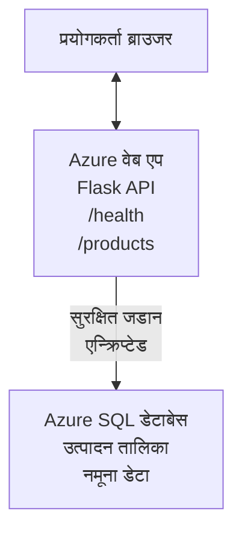

# AZD सँग माइक्रोसफ्ट SQL डेटाबेस र वेब एप तैनाथ गर्दै

⏱️ **अनुमानित समय**: २०-३० मिनेट | 💰 **अनुमानित लागत**: ~$१५-२५/महिना | ⭐ **जटिलता**: मध्यवर्ती

यो **पूर्ण, काम गर्ने उदाहरण** ले कसरी [एज्योर डेवलपर CLI (azd)](https://learn.microsoft.com/azure/developer/azure-developer-cli/) प्रयोग गरेर माइक्रोसफ्ट SQL डेटाबेससहितको पायथन फ्लास्क वेब एप्लिकेसन Azure मा तैनाथ गर्ने देखाउँछ। सबै कोड समावेश छ र परीक्षण गरिएको छ—कुनै बाहिरी निर्भरता आवश्यक छैन।

## तपाईंले के सिक्नुहुनेछ

यो उदाहरण पूरा गरेर, तपाईंले:
- बहु-तह एप्लिकेसन (वेब एप + डेटाबेस) इन्फ्रास्ट्रक्चर-एज-कोड प्रयोग गरी तैनाथ गर्ने
- कडा गरिएको गोप्य कुरा नहुँदा सुरक्षित डेटाबेस जडानहरू कन्फिगर गर्ने
- अनुप्रयोग स्वास्थ्य Application Insights बाट अनुगमन गर्ने
- AZD CLI सँग Azure स्रोतहरू कुशलतापूर्वक व्यवस्थापन गर्ने
- सुरक्षा, लागत अनुकूलन, र अवलोकनका लागि Azure का उत्तम अभ्यासहरू पालना गर्ने

## परिदृश्य अवलोकन
- **वेब एप**: पायथन फ्लास्क REST API डेटाबेस जडानसहित
- **डेटाबेस**: नमूना डेटासहित Azure SQL डेटाबेस
- **इन्फ्रास्ट्रक्चर**: Bicep (मोड्युलर, पुन: प्रयोग योग्य टेम्प्लेटहरू) प्रयोग गरी प्रवन्धित
- **तैनाथीकरण**: पूर्ण रूपमा `azd` आदेशहरूसँग स्वचालित
- **अनुगमन**: लगहरू र टेलिमेट्रीका लागि Application Insights

## पूर्वापेक्षाहरू

### आवश्यक उपकरणहरू

सुरु गर्नु अघि, यी उपकरणहरू इन्स्टल गरिएको छ सुनिश्चित गर्नुहोस्:

1. **[Azure CLI](https://learn.microsoft.com/cli/azure/install-azure-cli)** (संस्करण २.५०.० वा माथि)
   ```sh
   az --version
   # अपेक्षित आउटपुट: azure-cli 2.50.0 वा माथि
   ```

2. **[Azure Developer CLI (azd)](https://learn.microsoft.com/azure/developer/azure-developer-cli/install-azd)** (संस्करण १.०.० वा माथि)
   ```sh
   azd version
   # अपेक्षित आउटपुट: azd संस्करण 1.0.0 वा माथि
   ```

3. **[Python 3.8+](https://www.python.org/downloads/)** (स्थानीय विकासका लागि)
   ```sh
   python --version
   # अपेक्षित आउटपुट: Python 3.8 वा माथि
   ```

4. **[Docker](https://www.docker.com/get-started)** (वैकल्पिक, स्थानीय कन्टेनरयुक्त विकासका लागि)
   ```sh
   docker --version
   # अपेक्षित परिणाम: Docker संस्करण 20.10 वा माथि
   ```

### Azure आवश्यकताहरू

- सक्रिय **Azure सदस्यता** ([निःशुल्क खाता सिर्जना गर्नुहोस्](https://azure.microsoft.com/free/))
- आफ्नो सदस्यतामा स्रोतहरू सिर्जना गर्ने अनुमति
- सदस्यता वा स्रोत समूहमा **Owner** वा **Contributor** भूमिका

### ज्ञान पूर्वापेक्षाहरू

यो **मध्यवर्ती स्तर** को उदाहरण हो। तपाईंलाई परिचित हुनु पर्छ:
- आधारभूत कमाण्ड लाइन अपरेसनहरू
- आधारभूत क्लाउड अवधारणाहरू (स्रोतहरू, स्रोत समूहहरू)
- वेब एप्लिकेसन र डेटाबेसको आधारभूत ज्ञान

**AZD नयाँ हुनुहुन्छ?** पहिलो पटक [Getting Started मार्गदर्शन](../../docs/chapter-01-foundation/azd-basics.md) बाट सुरु गर्नुहोस्।

## वास्तुकला

यो उदाहरणले दुई तहको वास्तुकला तैनाथ गर्छ जसमा वेब एप्लिकेसन र SQL डेटाबेस समावेश छ:


**स्रोत तैनाथीकरण:**
- **स्रोत समूह**: सबै स्रोतहरूको कन्टेनर
- **एप सेवा योजना**: Linux आधारित होस्टिंग (B1 तह लागत-कुशल)
- **वेब एप**: पायथन ३.११ रनटाइम फ्लास्क एप्लिकेसनसहित
- **SQL सर्भर**: TLS १.२ कम्तिमा व्यवस्थापन गरिएको डेटाबेस सर्भर
- **SQL डेटाबेस**: बेसिक तह (२GB, विकास/परीक्षणका लागि उपयुक्त)
- **Application Insights**: अनुगमन र लगिङ
- **Log Analytics Workspace**: केन्द्रकृत लग भण्डारण

**उदाहरण**: यसलाई एउटा रेस्टुरेन्ट (वेब एप) जसमा एउटा वाक-इन फ्रिजर (डेटाबेस) छ भनेर सोच्नुहोस्। ग्राहकहरूले मेनुबाट अर्डर गर्छन् (API अन्त बिन्दुहरू), र भान्सा (फ्लास्क एप) फ्रिजरबाट सामग्री (डेटा) ल्याउँछ। रेस्टुरेन्त प्रबन्धक (Application Insights) सबै गतिविधि ट्र्याक गर्दछ।

## फोल्डर संरचना

सबै फाइलहरू यस उदाहरणमा समावेश छन्—कुनै बाहिरी निर्भरता आवश्यक छैन:

```
examples/database-app/
│
├── README.md                    # This file
├── azure.yaml                   # AZD configuration file
├── .env.sample                  # Sample environment variables
├── .gitignore                   # Git ignore patterns
│
├── infra/                       # Infrastructure as Code (Bicep)
│   ├── main.bicep              # Main orchestration template
│   ├── abbreviations.json      # Azure naming conventions
│   └── resources/              # Modular resource templates
│       ├── sql-server.bicep    # SQL Server configuration
│       ├── sql-database.bicep  # Database configuration
│       ├── app-service-plan.bicep  # Hosting plan
│       ├── app-insights.bicep  # Monitoring setup
│       └── web-app.bicep       # Web application
│
└── src/
    └── web/                    # Application source code
        ├── app.py              # Flask REST API
        ├── requirements.txt    # Python dependencies
        └── Dockerfile          # Container definition
```

**प्रत्येक फाइलले के गर्छ:**
- **azure.yaml**: AZD लाई के तैनाथ गर्ने र कहाँ भनेर बताउँछ
- **infra/main.bicep**: सबै Azure स्रोतहरू संयोजन गर्छ
- **infra/resources/*.bicep**: व्यक्तिगत स्रोत परिभाषाहरू (पुन: प्रयोगका लागि मोड्युलर)
- **src/web/app.py**: डेटाबेस लॉजिकसहित फ्लास्क एप्लिकेसन
- **requirements.txt**: पायथन प्याकेज निर्भरताहरू
- **Dockerfile**: तैनाथीकरणका लागि कन्टेनराइजेसन निर्देशनहरू

## छिटो सुरु (चरण-द्वारा-चरण)

### चरण १: क्लोन र नेभिगेट गर्नुहोस्

```sh
git clone https://github.com/microsoft/AZD-for-beginners.git
cd AZD-for-beginners/examples/database-app
```

**✓ सफलताको जाँच**: `azure.yaml` र `infra/` फोल्डर देख्नुहोस्:
```sh
ls
# अपेक्षित: README.md, azure.yaml, infra/, src/
```

### चरण २: Azure सँग प्रमाणित गर्नुहोस्

```sh
azd auth login
```

यसले Azure प्रमाणिकरणको लागि तपाईंको ब्राउजर खोल्छ। Azure प्रमाणपत्रसहित साइन इन गर्नुहोस्।

**✓ सफलताको जाँच**: तपाईंले देख्नु पर्ने:
```
Logged in to Azure.
```

### चरण ३: वातावरण सुरु गर्नुहोस्

```sh
azd init
```

**के हुन्छ**: AZD ले तैनाथीकरणको लागि स्थानीय कन्फिगरेसन बनाउँछ।

**तपाईंले देख्ने प्रांप्टहरू**:
- **वातावरण नाम**: सानो नाम लेख्नुहोस् (जस्तै, `dev`, `myapp`)
- **Azure सदस्यता**: सूचीबाट सदस्यता छान्नुहोस्
- **Azure स्थान**: क्षेत्र छान्नुहोस् (जस्तै, `eastus`, `westeurope`)

**✓ सफलताको जाँच**: तपाईंले देख्नुपर्छ:
```
SUCCESS: New project initialized!
```

### चरण ४: Azure स्रोतहरू बनाउनुहोस्

```sh
azd provision
```

**के हुन्छ**: AZD ले सबै इन्फ्रास्ट्रक्चर तैनाथ गर्छ (५-८ मिनेट लाग्छ):
१. स्रोत समूह सिर्जना गर्छ
२. SQL सर्भर र डेटाबेस सिर्जना गर्छ
३. एप सेवा योजना सिर्जना गर्छ
४. वेब एप सिर्जना गर्छ
५. Application Insights सिर्जना गर्छ
६. नेटवर्किङ र सुरक्षा कन्फिगर गर्छ

**तपाईंलाई सोधिनेछ**:
- **SQL प्रशासक प्रयोगकर्ता नाम**: प्रयोगकर्ता नाम लेख्नुहोस् (जस्तै, `sqladmin`)
- **SQL प्रशासक पासवर्ड**: बलियो पासवर्ड लेख्नुहोस् (यसलाई बचत गर्नुहोस्!)

**✓ सफलताको जाँच**: तपाईंले देख्नुपर्छ:
```
SUCCESS: Your application was provisioned in Azure in X minutes Y seconds.
You can view the resources created under the resource group rg-<env-name> in Azure Portal:
https://portal.azure.com/#@/resource/subscriptions/.../resourceGroups/rg-<env-name>
```

**⏱️ समय**: ५-८ मिनेट

### चरण ५: एप्लिकेसन तैनाथ गर्नुहोस्

```sh
azd deploy
```

**के हुन्छ**: AZD ले तपाईंको फ्लास्क एप्लिकेसन बनाउँछ र तैनाथ गर्छ:
१. पायथन एप्लिकेसन प्याकेज गर्छ
२. डोकर कन्टेनर बनाउँछ
३. Azure वेब एप्लिकेसनमा पुश गर्छ
४. नमूना डाटासहित डेटाबेस सुरु गर्छ
५. एप्लिकेसन सुरु गर्छ

**✓ सफलताको जाँच**: तपाईंले देख्नुपर्छ:
```
SUCCESS: Your application was deployed to Azure in X minutes Y seconds.
You can view the resources created under the resource group rg-<env-name> in Azure Portal:
https://portal.azure.com/#@/resource/subscriptions/.../resourceGroups/rg-<env-name>
```

**⏱️ समय**: ३-५ मिनेट

### चरण ६: एप्लिकेसन ब्राउज गर्नुहोस्

```sh
azd browse
```

यसले तपाईंको तैनाथ वेब एप ब्राउजरमा खोल्छ `https://app-<unique-id>.azurewebsites.net` मा

**✓ सफलताको जाँच**: तपाईंले JSON आउटपुट देख्नुहुनेछ:
```json
{
  "message": "Welcome to the Database App API",
  "endpoints": {
    "/": "This help message",
    "/health": "Health check endpoint",
    "/products": "List all products",
    "/products/<id>": "Get product by ID"
  }
}
```

### चरण ७: API अन्त बिन्दुहरू परीक्षण गर्नुहोस्

**स्वास्थ्य जाँच** (डेटाबेस जडान सत्यापित गर्नुहोस्):
```sh
curl https://app-<your-id>.azurewebsites.net/health
```

**अपेक्षित प्रतिक्रिया**:
```json
{
  "status": "healthy",
  "database": "connected"
}
```

**उत्पाद सूचीकरण** (नमूना डेटा):
```sh
curl https://app-<your-id>.azurewebsites.net/products
```

**अपेक्षित प्रतिक्रिया**:
```json
[
  {
    "id": 1,
    "name": "Laptop",
    "description": "High-performance laptop",
    "price": 1299.99,
    "created_at": "2025-11-19T10:30:00"
  },
  ...
]
```

**एकल उत्पाद प्राप्त गर्नुहोस्**:
```sh
curl https://app-<your-id>.azurewebsites.net/products/1
```

**✓ सफलताको जाँच**: सबै अन्त बिन्दुले त्रुटिविना JSON डाटा फर्काउँछन्।

---

**🎉 बधाई छ!** तपाईंले सफलतापूर्वक AZD प्रयोग गरेर Azure मा डेटाबेस सहित वेब एप्लिकेसन तैनाथ गर्नुभयो।

## कन्फिगरेसन गहिराइ

### वातावरण चरहरू

गोप्य कुरा Azure App Service कन्फिगरेसनबाट सुरक्षित तरिकाले व्यवस्थापन गरिन्छ — **स्रोत कोडमा कहिल्यै कडा गरिएका छैनन्**।

**AZD द्वारा स्वतः कन्फिगर गरिएको**:
- `SQL_CONNECTION_STRING`: इन्क्रिप्ट गरिएको प्रमाणीकरणसहित डेटाबेस जडान स्ट्रिङ
- `APPLICATIONINSIGHTS_CONNECTION_STRING`: अनुगमन टेलिमेट्री अन्त बिन्दु
- `SCM_DO_BUILD_DURING_DEPLOYMENT`: स्वत: निर्भरता स्थापना सक्षम पार्ने

**गोप्य कुरा कहाँ भण्डार हुन्छन्**:
१. `azd provision` मा तपाईं SQL प्रमाणीकरण सुरक्षित प्रांप्ट मार्फत प्रदान गर्नुहुन्छ
२. AZD ले यी स्थानीय `.azure/<env-name>/.env` फाइलमा भण्डार गर्दछ (git-ignored)
३. AZD ले यी Azure App Service कन्फिगरेसनमा इन्जेक्ट गर्छ (विश्राममा इन्क्रिप्ट गरिएको)
४. एप्लिकेसनले `os.getenv()` प्रयोग गरी रनटाइममा पढ्छ

### स्थानीय विकास

स्थानीय परीक्षणको लागि नमूनाबाट `.env` फाइल बनाउनुहोस्:

```sh
cp .env.sample .env
# तपाईंको स्थानीय डाटाबेस कनेक्शन चाहिँ .env सम्पादन गर्नुहोस्
```

**स्थानीय विकास कार्यप्रवाह**:
```sh
# निर्भरता स्थापना गर्नुहोस्
cd src/web
pip install -r requirements.txt

# वातावरण चरहरू सेट गर्नुहोस्
export SQL_CONNECTION_STRING="your-local-connection-string"

# अनुप्रयोग चलाउनुहोस्
python app.py
```

**स्थानीय परीक्षण गर्नुहोस्**:
```sh
curl http://localhost:8000/health
# अपेक्षित: {"status": "healthy", "database": "connected"}
```

### इन्फ्रास्ट्रक्चर एज कोड

सबै Azure स्रोतहरू **Bicep टेम्प्लेटहरू** (`infra/` फोल्डर) मा परिभाषित छन्:

- **मोड्युलर डिजाइन**: प्रत्येक स्रोत प्रकारको आफ्नै फाइल छ पुन: प्रयोगका लागि
- **प्यारामेट्राइज्ड**: SKU, क्षेत्रहरू, नामकरण प्रथाहरू अनुकूलन गर्न सकिन्छ
- **उत्तम अभ्यासहरू**: Azure नामकरण मानक र सुरक्षा पूर्वनिर्धारहरू पालना
- **संस्करण नियन्त्रण**: इन्फ्रास्ट्रक्चर परिवर्तनहरू Git मा ट्र्याक गरिन्छ

**कस्टमाइजेसन उदाहरण**:
डेटाबेस तह परिवर्तन गर्न `infra/resources/sql-database.bicep` सम्पादित गर्नुहोस्:
```bicep
sku: {
  name: 'Standard'  // Changed from 'Basic'
  tier: 'Standard'
  capacity: 10
}
```

## सुरक्षा उत्तम अभ्यासहरू

यो उदाहरणले Azure सुरक्षा उत्तम अभ्यासहरू पालना गर्छ:

### १. **स्रोत कोडमा कुनै गोप्य कुरा छैन**
- ✅ प्रमाणीकरण Azure App Service कन्फिगरेसनमा भण्डार गरिन्छ (इन्क्रिप्ट गरिएको)
- ✅ `.env` फाइलहरू `.gitignore` मार्फत Git बाट बाहिर राखिएको छ
- ✅ सुरक्षित प्यारामिटर मार्फत गोप्य कुरा प्रोभिजनिंगमा पास गरिन्छ

### २. **एन्क्रिप्टेड जडानहरू**
- ✅ SQL सर्भरका लागि कम्तीमा TLS १.२
- ✅ Web App मा केवल HTTPS लागू
- ✅ डेटाबेस जडानहरू एन्क्रिप्टेड च्यानल प्रयोग गर्छन्

### ३. **नेटवर्क सुरक्षा**
- ✅ Azure सेवा मात्र SQL सर्भर फायरवालमार्फत अनुमति दिइन्छ
- ✅ सार्वजनिक नेटवर्क पहुँच सीमित (प्राइवेट अन्त बिन्दुसँग थप बन्द गर्न सकिन्छ)
- ✅ वेब एपमा FTPS अक्षम गरिएको

### ४. **प्रमाणीकरण र अधिकार**
- ⚠️ **हालको**: SQL प्रमाणीकरण (प्रयोगकर्ता नाम/पासवर्ड)
- ✅ **उत्पादन सिफारिस**: पासवर्डरहित प्रमाणीकरणका लागि Azure Managed Identity प्रयोग गर्नुहोस्

**मान्डेड आइडेन्टीमा अपग्रेड गर्न** (उत्पादनका लागि):
१. वेब एपमा managed identity सक्षम पार्नुहोस्
२. आइडेन्टीलाई SQL अनुमति दिनुहोस्
३. जडान स्ट्रिङ अपडेट गरी managed identity प्रयोग गर्ने बनाउनुहोस्
४. पासवर्ड-आधारित प्रमाणीकरण हटाउनुहोस्

### ५. ** auditing र अनुपालन**
- ✅ Application Insights ले सबै अनुरोध र त्रुटिहरू लग गर्दछ
- ✅ SQL डेटाबेस auditing सक्षम (अनुपालनका लागि कन्फिगर गर्न सकिन्छ)
- ✅ सबै स्रोतहरू शासनका लागि ट्याग गरिएका छन्

**उत्पादन अघि सुरक्षा जाँच सूची**:
- [ ] SQL का लागि Azure Defender सक्षम गर्नुहोस्
- [ ] SQL डेटाबेसको लागि प्राइवेट अन्त बिन्दुहरू कन्फिगर गर्नुहोस्
- [ ] वेब एप्लिकेसन फायरवाल (WAF) सक्षम गर्नुहोस्
- [ ] गोप्य कुरा रोटेशनका लागि Azure Key Vault प्रयोग गर्नुहोस्
- [ ] Azure AD प्रमाणीकरण कन्फिगर गर्नुहोस्
- [ ] सबै स्रोतहरूको लागि डायग्नोस्टिक लगिङ सक्षम गर्नुहोस्

## लागत अनुकूलन

**अनुमानित मासिक लागतहरू** (नोभेम्बर २०२५ सम्म):

| स्रोत | SKU/तह | अनुमानित लागत |
|----------|----------|----------------|
| एप सेवा योजना | B1 (बेसिक) | ~$१३/महिना |
| SQL डेटाबेस | बेसिक (२GB) | ~$५/महिना |
| Application Insights | Pay-as-you-go | ~$२/महिना (कम ट्राफिक) |
| **जम्मा** | | **~$२०/महिना** |

**💡 लागत बचत सल्लाहहरू**:

१. **सिक्न फ्री तह प्रयोग गर्नुहोस्**:
   - एप सेवा: F1 तह (निःशुल्क, सीमित घण्टा)
   - SQL डेटाबेस: Azure SQL डेटाबेस सर्भरलेस प्रयोग गर्नुहोस्
   - Application Insights: ५GB/महिना निःशुल्क इनजेसन

२. **प्रयोग नभएको बेला स्रोतहरू रोक्नुहोस्**:
   ```sh
   # वेब एप बन्द गर्नुहोस् (डाटाबेस अझै चार्ज हुन्छ)
   az webapp stop --name <app-name> --resource-group <rg-name>
   
   # आवश्यक पर्दा पुनः सुरु गर्नुहोस्
   az webapp start --name <app-name> --resource-group <rg-name>
   ```

३. **परीक्षण पछि सबै मेटाउनुहोस्**:
   ```sh
   azd down
   ```
   यसले सबै स्रोतहरू हटाएर शुल्क रोक्छ।

४. **विकास र उत्पादन SKUहरू फरक हुनु पर्छ**:
   - **विकास**: बेसिक तह (यस उदाहरणमा प्रयोग गरिएको)
   - **उत्पादन**: स्ट्यान्डर्ड/प्रिमियम तह रेडन्डेन्सी सहित

**लागत अनुगमन**:
- [Azure Cost Management](https://portal.azure.com/#view/Microsoft_Azure_CostManagement) मा लागत हेर्नुहोस्
- लागतका सूचना सेटअप गरेर अप्रत्याशितबाट बच्नुहोस्
- सबै स्रोतहरूलाई `azd-env-name` ट्याग गर्नुहोस् ट्र्याकिङका लागि

**निःशुल्क तह विकल्प**:
सिकाइका लागि, तपाईं `infra/resources/app-service-plan.bicep` परिवर्तन गर्न सक्नुहुन्छ:
```bicep
sku: {
  name: 'F1'  // Free tier
  tier: 'Free'
}
```
**नोट**: निःशुल्क तहमा सीमितताहरू छन् (६० मिनेट/दिन CPU, सधैं-ऑन छैन)।

## अनुगमन र अवलोकन

### Application Insights एकीकरण

यो उदाहरणले व्यापक अनुगमनका लागि **Application Insights** समावेश गर्दछ:

**के मनिटर हुन्छ**:
- ✅ HTTP अनुरोधहरू (ढिलाइ, स्थिति कोड, अन्त बिन्दुहरू)
- ✅ अनुप्रयोग त्रुटि र अपवादहरू
- ✅ फ्लास्क एपबाट कस्टम लगिङ
- ✅ डेटाबेस जडान स्वास्थ्य
- ✅ प्रदर्शन मेट्रिक्स (CPU, स्मृति)

**Application Insights पहुँच**:
१. [Azure Portal](https://portal.azure.com) खोल्नुहोस्
२. आफ्नो स्रोत समूह (`rg-<env-name>`) मा जानुहोस्
३. Application Insights स्रोतमा क्लिक गर्नुहोस् (`appi-<unique-id>`)

**उपयोगी प्रश्नहरू** (Application Insights → Logs):

**सबै अनुरोधहरू हेर्नुहोस्**:
```kusto
requests
| where timestamp > ago(1h)
| order by timestamp desc
| project timestamp, name, url, resultCode, duration
```

**त्रुटिहरू खोज्नुहोस्**:
```kusto
exceptions
| where timestamp > ago(24h)
| order by timestamp desc
| project timestamp, type, outerMessage, operation_Name
```

**स्वास्थ्य अन्त बिन्दु जाँच गर्नुहोस्**:
```kusto
requests
| where name contains "health"
| summarize count() by resultCode, bin(timestamp, 1h)
```

### SQL डेटाबेस अडिटिङ

**SQL डेटाबेस अडिटिङ सक्षम छ** जसले ट्र्याक गर्छ:
- डेटाबेस पहुँच ढाँचा
- असफल लगिन प्रयासहरू
- स्कीमा परिवर्तनहरू
- डाटा पहुँच (अनुपालनका लागि)

**अडिट लगहरू पहुँच**:
१. Azure Portal → SQL डेटाबेस → Auditing
२. Log Analytics Workspace मा लगहरू हेर्नुहोस्

### रियल-टाइम अनुगमन

**प्रत्यक्ष मेट्रिक्स हेर्नुहोस्**:
१. Application Insights → Live Metrics
२. वास्तविक समयमा अनुरोध, असफलता, र प्रदर्शन हेर्नुहोस्

**सूचना सेटअप गर्नुहोस्**:
गम्भीर घटनाका लागि सूचना बनाउनुहोस्:
- HTTP ५०० त्रुटिहरू > ५ प्रति ५ मिनेट
- डेटाबेस जडान असफलता
- उच्च प्रतिक्रिया समय (>२ सेकेन्ड)

**सूचना सिर्जना उदाहरण**:
```sh
az monitor metrics alert create \
  --name "High-Response-Time" \
  --resource-group <rg-name> \
  --scopes <app-insights-resource-id> \
  --condition "avg requests/duration > 2000" \
  --description "Alert when response time exceeds 2 seconds"
```

## समस्या समाधान
### सामान्य समस्याहरू र समाधानहरू

#### १. `azd provision` "Location not available" त्रुटिसँग असफल हुन्छ

**लक्षण**:  
```
Error: The subscription is not registered for the resource type 'components' in the location 'centralus'.
```
  
**समाधान**:  
अर्को Azure क्षेत्र रोज्नुहोस् वा स्रोत प्रदायक दर्ता गर्नुहोस्:  
```sh
az provider register --namespace Microsoft.Insights
```
  
#### २. SQL कनेक्शन वितरणको क्रममा असफल हुन्छ

**लक्षण**:  
```
pyodbc.OperationalError: ('08001', '[08001] [Microsoft][ODBC Driver 18 for SQL Server]TCP Provider...')
```
  
**समाधान**:  
- SQL Server फायरवालले Azure सेवाहरूलाई अनुमति दिन्छ भनी पुष्टि गर्नुहोस् (स्वचालित रूपमा कन्फिगर भएको हुन्छ)  
- `azd provision` क्रममा SQL एडमिन पासवर्ड सही रूपमा प्रविष्ट गरिएको छ कि छैन जाँच गर्नुहोस्  
- SQL Server पूर्ण रूपमा प्रावधान गरिएको छ कि छैन सुनिश्चित गर्नुहोस् (२-३ मिनेट लाग्न सक्छ)  

**कनेक्शन जाँच्ने**:  
```sh
# Azure Portal बाट, SQL Database → Query editor मा जानुहोस्
# आफ्ना प्रमाणपत्रहरूसँग जडान गर्न प्रयास गर्नुहोस्
```
  
#### ३. वेब एपले "Application Error" देखाउँछ

**लक्षण**:  
ब्राउजरले सामान्य त्रुटि पृष्ठ देखाउँछ।

**समाधान**:  
एप्लिकेसन लग जाँच गर्नुहोस्:  
```sh
# भर्खरका लगहरू हेर्नुहोस्
az webapp log tail --name <app-name> --resource-group <rg-name>
```
  
**सामान्य कारणहरू**:  
- वातावरणीय भेरिएबल हराएको (App Service → Configuration जाँच्नुहोस्)  
- Python प्याकेज स्थापना असफल (डिप्लोयमेण्ट लग जाँच्नुहोस्)  
- डाटाबेस प्रारम्भिकरण त्रुटि (SQL कनेक्टिभिटी जाँच्नुहोस्)  

#### ४. `azd deploy` "Build Error" सँग असफल हुन्छ

**लक्षण**:  
```
Error: Failed to build project
```
  
**समाधान**:  
- `requirements.txt` मा कुनै सिन्ट्याक्स त्रुटि छैन भनी सुनिश्चित गर्नुहोस्  
- `infra/resources/web-app.bicep` मा Python 3.11 निर्दिष्ट गरिएको छ भनी जाँच्नुहोस्  
- Dockerfile मा सही आधार छवि छ भनी पुष्टि गर्नुहोस्  

**स्थानीय रूपमा डिबग गर्ने**:  
```sh
cd src/web
docker build -t test-app .
docker run -p 8000:8000 test-app
```
  
#### ५. AZD आदेशहरू चलाउँदा "Unauthorized" त्रुटि

**लक्षण**:  
```
ERROR: (Unauthorized) The client '<id>' with object id '<id>' does not have authorization
```
  
**समाधान**:  
Azure सँग पुन: प्रमाणीकरण गर्नुहोस्:  
```sh
# AZD कार्यप्रवाहहरूको लागि आवश्यक
azd auth login

# यदि तपाईं Azure CLI आदेशहरू सिधै पनि प्रयोग गर्दै हुनुहुन्छ भने वैकल्पिक
az login
```
  
तपाईंको सदस्यतामा सहायक भूमिका (Contributor role) छ भनी प्रमाणित गर्नुहोस्।  

#### ६. उच्च डाटाबेस खर्चहरू

**लक्षण**:  
अपेक्षित भन्दा बढी Azure बिल।

**समाधान**:  
- परीक्षण पछि `azd down` चलाउन बिर्सनुभएको छ कि छैन जाँच गर्नुहोस्  
- SQL डाटाबेसले Basic tier प्रयोग गरिरहेको छ कि छैन (Premium होइन)  
- Azure Cost Management मा लागत समीक्षा गर्नुहोस्  
- लागत सूचनाहरू सेटअप गर्नुहोस्  

### मद्दत पाउने तरिका

**सबै AZD वातावरण भेरिएबल हेर्नुहोस्**:  
```sh
azd env get-values
```
  
**डिप्लोयमेण्ट स्थिति जाँच्नुहोस्**:  
```sh
az webapp show --name <app-name> --resource-group <rg-name> --query state
```
  
**एप्लिकेसन लगहरू पहुँच गर्नुहोस्**:  
```sh
az webapp log download --name <app-name> --resource-group <rg-name> --log-file app-logs.zip
```
  
**थप मद्दत चाहिन्छ?**  
- [AZD Troubleshooting Guide](../../docs/chapter-07-troubleshooting/common-issues.md)  
- [Azure App Service Troubleshooting](https://learn.microsoft.com/azure/app-service/troubleshoot-diagnostic-logs)  
- [Azure SQL Troubleshooting](https://learn.microsoft.com/azure/azure-sql/database/troubleshoot-common-errors-issues)  

## व्यवहारिक अभ्यासहरू

### अभ्यास १: आफ्नो डिप्लोयमेण्ट जाँच्नुहोस् (शुरुवाती स्तर)

**उद्देश्य**: सबै स्रोतहरू डिप्लोय गरिएको छ र एप्लिकेसन काम गरिरहेको छ भनी पुष्टि गर्नुहोस्।

**कदमहरू**:  
१. आफ्नो स्रोत समूहमा सबै स्रोतहरूको सूची लिनुहोस्:  
   ```sh
   az resource list --resource-group rg-<env-name> --output table
   ```
  
   **अपेक्षित**: ६-७ स्रोतहरू (वेब एप, SQL Server, SQL Database, App Service Plan, Application Insights, Log Analytics)  

२. सबै API अन्त बिन्दुहरू परीक्षण गर्नुहोस्:  
   ```sh
   curl https://app-<your-id>.azurewebsites.net/
   curl https://app-<your-id>.azurewebsites.net/health
   curl https://app-<your-id>.azurewebsites.net/products
   curl https://app-<your-id>.azurewebsites.net/products/1
   ```
  
   **अपेक्षित**: सबैले त्रुटि बिना मान्य JSON फर्काउछन्  

३. Application Insights जाँच गर्नुहोस्:  
   - Azure पोर्टलमा Application Insights मा जानुहोस्  
   - "Live Metrics" मा जानुहोस्  
   - वेब एपमा ब्राउजर पुन: ताजा गर्नुहोस्  
   **अपेक्षित**: वास्तविक समयमा अनुरोधहरू देखिन्छन्  

**सफलता मापदण्ड**: सबै ६-७ स्रोतहरू अवस्थित छन्, सबै अन्त बिन्दुले डाटा फर्काउँछन्, Live Metrics गतिविधि देखाउँछ।  

---

### अभ्यास २: नयाँ API अन्त बिन्दु थप्नुहोस् (मध्यम)

**उद्देश्य**: Flask एप्लिकेसनमा नयाँ अन्त बिन्दु थप्ने।

**स्टार्टर कोड**: हालका अन्त बिन्दुहरू `src/web/app.py` मा

**कदमहरू**:  
१. `src/web/app.py` सम्पादन गरी `get_product()` फंक्शन पछि नयाँ अन्त बिन्दु थप्नुहोस्:  
   ```python
   @app.route('/products/search/<keyword>')
   def search_products(keyword):
       """Search products by name or description."""
       try:
           conn = get_db_connection()
           cursor = conn.cursor()
           cursor.execute(
               "SELECT id, name, description, price, created_at FROM products WHERE name LIKE ? OR description LIKE ?",
               (f'%{keyword}%', f'%{keyword}%')
           )
           
           products = []
           for row in cursor.fetchall():
               products.append({
                   'id': row[0],
                   'name': row[1],
                   'description': row[2],
                   'price': float(row[3]) if row[3] else None,
                   'created_at': row[4].isoformat() if row[4] else None
               })
           
           cursor.close()
           conn.close()
           
           logger.info(f"Search for '{keyword}' returned {len(products)} results")
           return jsonify(products), 200
           
       except Exception as e:
           logger.error(f"Error searching products: {str(e)}")
           return jsonify({'error': str(e)}), 500
   ```
  
२. अद्यावधिक एप्लिकेसन डिप्लोय गर्नुहोस्:  
   ```sh
   azd deploy
   ```
  
३. नयाँ अन्त बिन्दु परीक्षण गर्नुहोस्:  
   ```sh
   curl https://app-<your-id>.azurewebsites.net/products/search/laptop
   ```
  
   **अपेक्षित**: "laptop" सोधपुछ मिल्ने उत्पादनहरू फर्काउँछ  

**सफलता मापदण्ड**: नयाँ अन्त बिन्दु काम गर्दछ, फिल्टर गरिएका परिणामहरू फर्काउँछ, Application Insights लगमा देखिन्छ।  

---

### अभ्यास ३: निगरानी र सूचनाहरू थप्नुहोस् (उन्नत)

**उद्देश्य**: सूचनासहित सक्रिय निगरानी सेटअप गर्न।

**कदमहरू**:  
१. HTTP 500 त्रुटिहरूको लागि चेतावनी सिर्जना गर्नुहोस्:  
   ```sh
   # आवेदन अंतर्दृष्टि स्रोत ID प्राप्त गर्नुहोस्
   AI_ID=$(az monitor app-insights component show \
     --app appi-<your-id> \
     --resource-group rg-<env-name> \
     --query id -o tsv)
   
   # सतर्कता सिर्जना गर्नुहोस्
   az monitor metrics alert create \
     --name "High-Error-Rate" \
     --resource-group rg-<env-name> \
     --scopes $AI_ID \
     --condition "count requests/failed > 5" \
     --window-size 5m \
     --evaluation-frequency 1m \
     --description "Alert when >5 failed requests in 5 minutes"
   ```
  
२. त्रुटि गरेर चेतावनी ट्रिगर गर्नुहोस्:  
   ```sh
   # अस्तित्वमा नभएको उत्पादनको अनुरोध गर्नुहोस्
   for i in {1..10}; do curl https://app-<your-id>.azurewebsites.net/products/999; done
   ```
  
३. चेतावनी सक्रिय भयो कि भएन जाँच गर्नुहोस्:  
   - Azure पोर्टल → Alerts → Alert Rules  
   - तपाईंको इमेल जाँच्नुहोस् (यदि कन्फिगर गरिएको छ भने)  

**सफलता मापदण्ड**: चेतावनी नियम सिर्जना गरिएको छ, त्रुटिमा ट्रिगर हुन्छ, सूचना प्राप्त हुन्छ।  

---

### अभ्यास ४: डाटाबेस स्किमामा परिवर्तनहरू (उन्नत)

**उद्देश्य**: नयाँ तालिका थप्ने र एप्लिकेसनमा प्रयोग गर्ने।

**कदमहरू**:  
१. Azure पोर्टल Query Editor मार्फत SQL Database मा जडान गर्नुहोस्  

२. नयाँ `categories` तालिका सिर्जना गर्नुहोस्:  
   ```sql
   CREATE TABLE categories (
       id INT PRIMARY KEY IDENTITY(1,1),
       name NVARCHAR(50) NOT NULL,
       description NVARCHAR(200)
   );
   
   INSERT INTO categories (name, description) VALUES
   ('Electronics', 'Electronic devices and accessories'),
   ('Office Supplies', 'Office equipment and supplies');
   
   -- Add category to products table
   ALTER TABLE products ADD category_id INT;
   UPDATE products SET category_id = 1; -- Set all to Electronics
   ```
  
३. `src/web/app.py` अद्यावधिक गरी प्रतिक्रिया मा श्रेणी जानकारी थप्नुहोस्  

४. डिप्लोय गरी परीक्षण गर्नुहोस्  

**सफलता मापदण्ड**: नयाँ तालिका छ, उत्पादनहरूमा श्रेणी जानकारी देखिन्छ, एप्लिकेसन अझै काम गर्छ।  

---

### अभ्यास ५: केशिङ कार्यान्वयन गर्नुहोस् (विशेषज्ञ)

**उद्देश्य**: प्रदर्शन सुधार गर्न Azure Redis Cache थप्नुहोस्।

**कदमहरू**:  
१. `infra/main.bicep` मा Redis Cache थप्नुहोस्  
२. `src/web/app.py` अद्यावधिक गरी उत्पादन सोधपुछ केशिङ गर्नुहोस्  
३. Application Insights प्रयोग गरी प्रदर्शन सुधार मापन गर्नुहोस्  
४. केशिङ अघि/पछि प्रतिक्रिया समय तुलना गर्नुहोस्  

**सफलता मापदण्ड**: Redis डिप्लोय गरिएको छ, केशिङ काम गर्छ, प्रतिक्रिया समय ५०% भन्दा धेरै सुधार हुन्छ।  

**सुझाव**: [Azure Cache for Redis documentation](https://learn.microsoft.com/azure/azure-cache-for-redis/) बाट सुरु गर्नुहोस्।  

---

## सफाइ

लगातार खर्च रोक्न, काम सकिएपछि सबै स्रोतहरू मेटाउनुहोस्:  

```sh
azd down
```
  
**पुष्टि प्रोन्ट**:  
```
? Total resources to delete: 7, are you sure you want to continue? (y/N)
```
  
`y` टाइप गरी पुष्टि गर्नुहोस्।  

**✓ सफलता जाँच**:  
- Azure पोर्टलबाट सबै स्रोतहरू मेटिएका छन्  
- कुनै लगातार शुल्क छैन  
- स्थानीय `.azure/<env-name>` फोल्डर मेट्न सकिन्छ  

**वैकल्पिक** (स्रोत संरचना राखेर डेटा मेट्ने):  
```sh
# रिसोर्स समूह मात्र मेटाउनुहोस् (AZD कन्फिग कायम राख्नुहोस्)
az group delete --name rg-<env-name> --yes
```
## थप जान्नुहोस्

### सम्बन्धित कागजातहरू  
- [Azure Developer CLI Documentation](https://learn.microsoft.com/azure/developer/azure-developer-cli/)  
- [Azure SQL Database Documentation](https://learn.microsoft.com/azure/azure-sql/database/)  
- [Azure App Service Documentation](https://learn.microsoft.com/azure/app-service/)  
- [Application Insights Documentation](https://learn.microsoft.com/azure/azure-monitor/app/app-insights-overview)  
- [Bicep Language Reference](https://learn.microsoft.com/azure/azure-resource-manager/bicep/)  

### यस कोर्सका अर्को कदमहरू  
- **[Container Apps Example](../../../../examples/container-app)**: Azure Container Apps सँग माइक्रोसर्भिस डिप्लोय गर्नुहोस्  
- **[AI Integration Guide](../../../../docs/ai-foundry)**: आफ्नो एपमा AI क्षमताहरू थप्नुहोस्  
- **[Deployment Best Practices](../../docs/chapter-04-infrastructure/deployment-guide.md)**: उत्पादन डिप्लोयमेण्टका ढाँचाहरू  

### उन्नत विषयहरू  
- **Managed Identity**: पासवर्ड हटाएर Azure AD प्रमाणीकरण प्रयोग गर्ने  
- **Private Endpoints**: भर्चुअल नेटवर्क भित्र सुरक्षित डाटाबेस कनेक्शन  
- **CI/CD Integration**: GitHub Actions वा Azure DevOps मार्फत स्वचालित डिप्लोयमेण्ट  
- **Multi-Environment**: विकास, परीक्षण र उत्पादन वातावरण सेटअप गर्ने  
- **Database Migrations**: Alembic वा Entity Framework प्रयोग गरी स्कीमा संस्करण व्यवस्थापन  

### अन्य विधिहरूसँग तुलना

**AZD vs. ARM Templates**:  
- ✅ AZD: उच्च-स्तरीय सार, सरल आदेशहरू  
- ⚠️ ARM: बढी विस्तृत, सूक्ष्म नियन्त्रण  

**AZD vs. Terraform**:  
- ✅ AZD: Azure-स्वदेशी, Azure सेवासँग एकीकृत  
- ⚠️ Terraform: बहु-मेघ समर्थन, ठूलो इकोसिस्टम  

**AZD vs. Azure Portal**:  
- ✅ AZD: दोहोर्याउन सकिने, संस्करण नियन्त्रण गरिएको, स्वचालित  
- ⚠️ पोर्टल: म्यानुअल क्लिक, पुनःप्रदर्शनमा कठिनाई  

**AZD लाई सोच्नुहोस्**: Azure का लागि Docker Compose—जटिल डिप्लोयमेन्टका लागि सरल कन्फिगरेसन।  

---

## बारम्बार सोधिने प्रश्नहरू

**प्र: के म फरक प्रोग्रामिङ भाषा प्रयोग गर्न सक्छु?**  
उत्तर: हो! `src/web/` लाई Node.js, C#, Go वा कुनै पनि भाषाले प्रतिस्थापन गर्न सकिन्छ। `azure.yaml` र Bicep अनुसार अद्यावधिक गर्नुहोस्।  

**प्र: कसरी थप डाटाबेसहरू थप्ने?**  
उत्तर: `infra/main.bicep` मा अर्को SQL Database मोड्युल थप्नुहोस् वा Azure Database सेवाहरूबाट PostgreSQL/MySQL प्रयोग गर्नुहोस्।  

**प्र: के म यसलाई उत्पादनका लागि प्रयोग गर्न सक्छु?**  
उत्तर: यो आरम्भ हो। उत्पादनका लागि: managed identity, private endpoints, redundancy, backup नीतिहरू, WAF र सुधारिएको निगरानी थप्नुहोस्।  

**प्र: म कोड डिप्लोयमेंटको सट्टा कन्टेनरहरू प्रयोग गर्न चाहन्छु भने?**  
उत्तर: [Container Apps Example](../../../../examples/container-app) हेर्नुहोस् जुन Docker कन्टेनरहरूलाई पूर्ण रूपमा प्रयोग गर्छ।  

**प्र: कसरी मेरो स्थानीय उपकरणबाट डाटाबेसमा जडान गर्ने?**  
उत्तर: SQL Server फायरवालमा आफ्नो IP थप्नुहोस्:  
```sh
az sql server firewall-rule create \
  --resource-group rg-<env-name> \
  --server sql-<unique-id> \
  --name AllowMyIP \
  --start-ip-address <your-ip> \
  --end-ip-address <your-ip>
```
  
**प्र: नयाँ डाटाबेस सिर्जना नगरी मौजुदा डाटाबेस प्रयोग गर्न सक्छु?**  
उत्तर: हो, `infra/main.bicep` लाई परिवर्तन गरी मौजुदा SQL Server सन्दर्भित गर्नुहोस् र कनेक्शन स्ट्रिङ पैरामीटरहरू अद्यावधिक गर्नुहोस्।  

---

> **नोट:** यो उदाहरणले AZD प्रयोग गरेर वेब एप र डाटाबेस डिप्लोय गर्दा उत्तम अभ्यास देखाउँछ। यसमा कार्यरत कोड, पूर्ण कागजातहरू र सिकाइलाई बलियो बनाउन व्यवहारिक अभ्यासहरू समावेश छन्। उत्पादन डिप्लोयमेन्टमा सुरक्षा, स्केलिङ, अनुपालन र लागत आवश्यकताहरू समीक्षा गर्नुहोस् जुन तपाईंको संस्थाका लागि विशिष्ट छन्।  

**📚 कोर्स नेभिगेसन:**  
- ← अघिल्लो: [Container Apps Example](../../../../examples/container-app)  
- → अर्को: [AI Integration Guide](../../../../docs/ai-foundry)  
- 🏠 [कोर्स मुख्य पृष्ठ](../../README.md)

---

<!-- CO-OP TRANSLATOR DISCLAIMER START -->
**अपवाद घोषणा**:
यो दस्तावेज AI अनुवाद सेवा [Co-op Translator](https://github.com/Azure/co-op-translator) प्रयोग गरी अनुवाद गरिएको हो। हामी सटीकता को लागि प्रयास गर्छौं, तर कृपया ध्यान दिनुहोस् कि स्वचालित अनुवादमा त्रुटि वा अशुद्धि हुन सक्छ। यसको मूल दस्तावेज यसको मूल भाषामा प्रामाणिक स्रोत मानिनु पर्छ। महत्वपूर्ण जानकारीको लागि, व्यावसायिक मानव अनुवाद सिफारिस गरिन्छ। यस अनुवादको प्रयोगबाट उत्पन्न कुनै पनि बुझाइ भिन्नता वा गलत व्याख्याको लागि हामी जिम्मेवार छैनौं।
<!-- CO-OP TRANSLATOR DISCLAIMER END -->