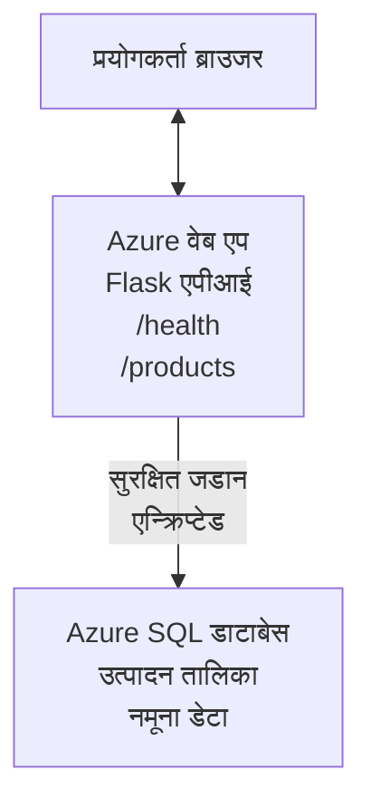

# AZD प्रयोग गरी Microsoft SQL डेटाबेस र वेब एप तैनाथ गर्ने

⏱️ **अनुमानित समय**: 20-30 मिनेट | 💰 **अनुमानित लागत**: ~$15-25/month | ⭐ **जटिलता**: मध्यम

यो **पूरा, काम गर्ने उदाहरण** देखाउँछ कसरी [Azure Developer CLI (azd)](https://learn.microsoft.com/azure/developer/azure-developer-cli/) प्रयोग गरी Python Flask वेब एप्लिकेशन Microsoft SQL Database सँग Azure मा तैनाथ गर्ने। सबै कोड समावेश र परीक्षण गरिएको छ—कुनै बाह्य निर्भरता आवश्यक छैन।

## के सिक्नु हुनेछ

यस उदाहरण पूरा गरेर, तपाईंले:
- infrastructure-as-code प्रयोग गरी बहु-स्तर अनुप्रयोग (वेब एप + डेटाबेस) तैनाथ गर्ने
- स्रोत कोडमा गोप्य जानकारीहरू हार्डकोड नगरी सुरक्षित डेटाबेस कनेक्शन कन्फिगर गर्ने
- Application Insights मार्फत अनुप्रयोगको स्वास्थ्य अनुगमन गर्ने
- AZD CLI प्रयोग गरी Azure स्रोतहरू कुशलतापूर्वक व्यवस्थापन गर्ने
- सुरक्षा, लागत अनुकूलन, र अवलोकनका लागि Azure का उत्तम अभ्यासहरू पालना गर्ने

## परिदृश्य अवलोकन
- **वेब एप**: डेटाबेस कनेक्सन सहितको Python Flask REST API
- **डेटाबेस**: नमूना डाटासहितको Azure SQL Database
- **पूर्वाधार**: Bicep प्रयोग गरी provision गरिएको (मोड्युलर, पुन: प्रयोगयोग्य टेम्पलेटहरू)
- **तैनाथीकरण**: `azd` कमाण्डहरूसँग पूर्ण रूपमा स्वचालित
- **अनुगमन**: लग र टेलिमेट्रीका लागि Application Insights

## आवश्यकताहरू

### आवश्यक उपकरणहरू

सुरु गर्नु अघि, यी उपकरणहरू इन्स्टल भएका छन् कि छैनन् पक्का गर्नुहोस्:

1. **[Azure CLI](https://learn.microsoft.com/cli/azure/install-azure-cli)** (भर्सन 2.50.0 वा माथि)
   ```sh
   az --version
   # अपेक्षित आउटपुट: azure-cli 2.50.0 वा सोभन्दा नयाँ
   ```

2. **[Azure Developer CLI (azd)](https://learn.microsoft.com/azure/developer/azure-developer-cli/install-azd)** (भर्सन 1.0.0 वा माथि)
   ```sh
   azd version
   # अपेक्षित आउटपुट: azd संस्करण 1.0.0 वा माथि
   ```

3. **[Python 3.8+](https://www.python.org/downloads/)** (स्थानीय विकासका लागि)
   ```sh
   python --version
   # अपेक्षित नतिजा: Python 3.8 वा सोभन्दा माथि
   ```

4. **[Docker](https://www.docker.com/get-started)** (वैकल्पिक, स्थानीय कन्टेनराइज्ड विकासका लागि)
   ```sh
   docker --version
   # अपेक्षित नतिजा: Docker संस्करण 20.10 वा माथि
   ```

### Azure आवश्यकताहरू

- एक सक्रिय **Azure subscription** ([निःशुल्क खाता सिर्जना गर्नुहोस्](https://azure.microsoft.com/free/))
- तपाइँको सब्सक्रिप्शनमा स्रोतहरू सिर्जना गर्न अनुमति
- सब्सक्रिप्शन वा रिसोर्स समूहमा **Owner** वा **Contributor** भूमिका

### ज्ञानपूर्व आवश्यकताहरू

यो एक **मध्यम-स्तरको** उदाहरण हो। तपाईंले यससँग परिचित हुनु आवश्यक छ:
- आधारभूत कमाण्ड-लाइन अपरेसनहरू
- क्लाउडका आधारभूत अवधारणाहरू (resources, resource groups)
- वेब अनुप्रयोग र डेटाबेसको आधारभूत बुझाइ

**AZD नयाँ हो?** सुरु गर्न [Getting Started guide](../../docs/chapter-01-foundation/azd-basics.md) हेर्नुहोस्।

## वास्तुकला

यस उदाहरणले वेब अनुप्रयोग र SQL डेटाबेस सहित दुई-स्तरीय वास्तुकला तैनाथ गर्छ:



**स्रोत तैनाथीकरण:**
- **Resource Group**: सबै स्रोतहरूको कन्टेनर
- **App Service Plan**: Linux-आधारित होस्टिङ (लागत-कुशलताका लागि B1 टियर)
- **Web App**: Flask एप्लिकेसन सहित Python 3.11 रनटाइम
- **SQL Server**: TLS 1.2 न्यूनतम भएको व्यवस्थापित डेटाबेस सर्भर
- **SQL Database**: Basic टियर (2GB, विकास/परीक्षणका लागि उपयुक्त)
- **Application Insights**: अनुगमन र लगिङ
- **Log Analytics Workspace**: केन्द्रीयकृत लग भण्डारण

**उपमाेह:** यसलाई एउटा रेस्टुरेन्ट (वेब एप) र एउटा वाक-इन फ्रीजर (डेटाबेस) जस्तो सम्झनुहोस्। ग्राहकहरूले मेनु (API endpoints) बाट अर्डर गर्छन्, र भान्सा (Flask एप) फ्रीजरबाट सामग्रीहरू (डाटा) ल्याउँछ। रेस्टुरेन्ट प्रबन्धक (Application Insights) सबै घटनाहरू ट्र्याक गर्छ।

## फोल्डर संरचना

यस उदाहरणमा सबै फाइलहरू समावेश छन्—कुनै बाह्य निर्भरता आवश्यक छैन:

```
examples/database-app/
│
├── README.md                    # This file
├── azure.yaml                   # AZD configuration file
├── .env.sample                  # Sample environment variables
├── .gitignore                   # Git ignore patterns
│
├── infra/                       # Infrastructure as Code (Bicep)
│   ├── main.bicep              # Main orchestration template
│   ├── abbreviations.json      # Azure naming conventions
│   └── resources/              # Modular resource templates
│       ├── sql-server.bicep    # SQL Server configuration
│       ├── sql-database.bicep  # Database configuration
│       ├── app-service-plan.bicep  # Hosting plan
│       ├── app-insights.bicep  # Monitoring setup
│       └── web-app.bicep       # Web application
│
└── src/
    └── web/                    # Application source code
        ├── app.py              # Flask REST API
        ├── requirements.txt    # Python dependencies
        └── Dockerfile          # Container definition
```

**प्रत्येक फाइल के गर्छ:**
- **azure.yaml**: AZD लाई के तैनाथ गर्ने र कहाँ भन्ने बताउँछ
- **infra/main.bicep**: सबै Azure स्रोतहरू समन्वय गर्छ
- **infra/resources/*.bicep**: व्यक्तिगत स्रोत परिभाषाहरू (पुन: प्रयोगको लागि मोड्युलर)
- **src/web/app.py**: डेटाबेस लॉजिक सहितको Flask एप
- **requirements.txt**: Python प्याकेज निर्भरताहरू
- **Dockerfile**: तैनाथीकरणका लागि कन्टेनराइजेसन निर्देशहरू

## क्विकस्टार्ट (चरण-दर-चरण)

### चरण 1: क्लोन र नेभिगेट गर्नुहोस्

```sh
git clone https://github.com/microsoft/AZD-for-beginners.git
cd AZD-for-beginners/examples/database-app
```

**✓ सफल जाँच**: पक्का गर्नुहोस् कि तपाईंले `azure.yaml` र `infra/` फोल्डर देख्नुभएको छ:
```sh
ls
# अपेक्षित: README.md, azure.yaml, infra/, src/
```

### चरण 2: Azure सँग प्रमाणिकरण गर्नुहोस्

```sh
azd auth login
```

यसले Azure प्रमाणिकरणका लागि तपाईंको ब्राउजर खोल्छ। आफ्नो Azure प्रवेश विवरण प्रयोग गरी साइन इन गर्नुहोस्।

**✓ सफल जाँच**: तपाईंले निम्न देख्नुपर्छ:
```
Logged in to Azure.
```

### चरण 3: वातावरण आरम्भ गर्नुहोस्

```sh
azd init
```

**के हुन्छ**: AZD ले तपाईंको तैनाथीकरणका लागि स्थानीय कन्फिगरेसन सिर्जना गर्छ।

**तपाईंले देख्ने प्रॉम्प्टहरू**:
- **Environment name**: छोटो नाम प्रविष्ट गर्नुहोस् (जस्तै, `dev`, `myapp`)
- **Azure subscription**: सूचीबाट आफ्नो सब्सक्रिप्शन छान्नुहोस्
- **Azure location**: क्षेत्र छान्नुहोस् (जस्तै, `eastus`, `westeurope`)

**✓ सफल जाँच**: तपाईंले निम्न देख्नुपर्छ:
```
SUCCESS: New project initialized!
```

### चरण 4: Azure स्रोतहरू provision गर्नुहोस्

```sh
azd provision
```

**के हुन्छ**: AZD ले सम्पूर्ण पूर्वाधार तैनाथ गर्छ (5-8 मिनेट लाग्न सक्छ):
1. रिसोर्स समूह सिर्जना गर्दछ
2. SQL Server र Database सिर्जना गर्दछ
3. App Service Plan सिर्जना गर्दछ
4. Web App सिर्जना गर्दछ
5. Application Insights सिर्जना गर्दछ
6. नेटवर्किङ र सुरक्षा कन्फिगर गर्दछ

**तपाईंलाई सोधिनेछ**:
- **SQL admin username**: एउटा प्रयोगकर्ता नाम प्रविष्ट गर्नुहोस् (जस्तै, `sqladmin`)
- **SQL admin password**: बलियो पासवर्ड प्रविष्ट गर्नुहोस् (यसलाई सुरक्षित राख्नुहोस्!)

**✓ सफल जाँच**: तपाईंले निम्न देख्नुपर्छ:
```
SUCCESS: Your application was provisioned in Azure in X minutes Y seconds.
You can view the resources created under the resource group rg-<env-name> in Azure Portal:
https://portal.azure.com/#@/resource/subscriptions/.../resourceGroups/rg-<env-name>
```

**⏱️ समय**: 5-8 मिनेट

### चरण 5: अनुप्रयोग तैनाथ गर्नुहोस्

```sh
azd deploy
```

**के हुन्छ**: AZD ले तपाईंको Flask अनुप्रयोग बनाउँछ र तैनाथ गर्छ:
1. Python अनुप्रयोग प्याकेज गर्छ
2. Docker कन्टेनर बनाउँछ
3. Azure Web App मा पुश गर्छ
4. डेटाबेसलाई नमूना डाटासँग आरम्भ गर्छ
5. अनुप्रयोग सुरु गर्छ

**✓ सफल जाँच**: तपाईंले निम्न देख्नुपर्छ:
```
SUCCESS: Your application was deployed to Azure in X minutes Y seconds.
You can view the resources created under the resource group rg-<env-name> in Azure Portal:
https://portal.azure.com/#@/resource/subscriptions/.../resourceGroups/rg-<env-name>
```

**⏱️ समय**: 3-5 मिनेट

### चरण 6: अनुप्रयोग ब्राउज गर्नुहोस्

```sh
azd browse
```

यसले तपाईंले तैनाथ गरेको वेब एप ब्राउजरमा `https://app-<unique-id>.azurewebsites.net` मा खोल्छ

**✓ सफल जाँच**: तपाईंले JSON आउटपुट देख्नुपर्छ:
```json
{
  "message": "Welcome to the Database App API",
  "endpoints": {
    "/": "This help message",
    "/health": "Health check endpoint",
    "/products": "List all products",
    "/products/<id>": "Get product by ID"
  }
}
```

### चरण 7: API endpoints परीक्षण गर्नुहोस्

**हेल्थ चेक** (डेटाबेस जडान जाँच गर्नुहोस्):
```sh
curl https://app-<your-id>.azurewebsites.net/health
```

**अपेक्षित प्रतिक्रिया**:
```json
{
  "status": "healthy",
  "database": "connected"
}
```

**सूची उत्पादनहरू** (नमूना डाटा):
```sh
curl https://app-<your-id>.azurewebsites.net/products
```

**अपेक्षित प्रतिक्रिया**:
```json
[
  {
    "id": 1,
    "name": "Laptop",
    "description": "High-performance laptop",
    "price": 1299.99,
    "created_at": "2025-11-19T10:30:00"
  },
  ...
]
```

**एकल उत्पादन प्राप्त गर्नुहोस्**:
```sh
curl https://app-<your-id>.azurewebsites.net/products/1
```

**✓ सफल जाँच**: सबै endpoints त्रुटि बिना JSON डाटा फर्काउँछन्।

---

**🎉 बधाई!** तपाईंले AZD प्रयोग गरी Azure मा डेटाबेस सहित वेब एप सफलतापूर्वक तैनाथ गर्नुभयो।

## कन्फिगरेसन गहिराइमा

### वातावरण भेरिएबलहरू

गोप्य जानकारीहरू Azure App Service कन्फिगरेशन मार्फत सुरक्षित रूपमा व्यवस्थापन गरिन्छ—**कहिल्यै स्रोत कोडमा हार्डकोड नगरियोस्**।

**AZD द्वारा स्वचालित रूपमा कन्फिगर गरिने**:
- `SQL_CONNECTION_STRING`: इन्क्रिप्ट गरिएको प्रमाणपत्र सहितको डेटाबेस जडान
- `APPLICATIONINSIGHTS_CONNECTION_STRING`: अनुगमन टेलिमेट्री एन्डपोइन्ट
- `SCM_DO_BUILD_DURING_DEPLOYMENT`: स्वचालित निर्भरता इन्स्टलेशन सक्षम बनाउँछ

**गोप्य जानकारीहरू कहाँ स्टोर हुन्छन्**:
1. `azd provision` दौरान, तपाईं SQL प्रमाणपत्रहरू सुरक्षित प्रॉम्प्टमार्फत प्रदान गर्नुहुन्छ
2. AZD यी तपाईंको स्थानीय `.azure/<env-name>/.env` फाइलमा स्टोर गर्छ (git-ignored)
3. AZD ले तिनीहरूलाई Azure App Service कन्फिगरेशनमा इन्जेक्ट गर्छ (अविश्राम अवस्थामा इन्क्रिप्ट गरिएको)
4. एपले रनटाइममा `os.getenv()` मार्फत तिनीहरू पढ्छ

### स्थानीय विकास

स्थानीय परीक्षणका लागि, नमूनाबाट `.env` फाइल सिर्जना गर्नुहोस्:

```sh
cp .env.sample .env
# आफ्नो स्थानीय डेटाबेस कनेक्शनका साथ .env सम्पादन गर्नुहोस्
```

**स्थानीय विकास वर्कफ्लो**:
```sh
# निर्भरता स्थापना गर्नुहोस्
cd src/web
pip install -r requirements.txt

# वातावरण चरहरू सेट गर्नुहोस्
export SQL_CONNECTION_STRING="your-local-connection-string"

# अनुप्रयोग चलाउनुहोस्
python app.py
```

**स्थानीय रूपमा परीक्षण गर्नुहोस्**:
```sh
curl http://localhost:8000/health
# अपेक्षित: {"status": "स्वस्थ", "database": "जडान गरिएको"}
```

### पूर्वाधारलाई कोडको रूपमा

सबै Azure स्रोतहरू **Bicep टेम्पलेटहरू** (`infra/` फोल्डर) मा परिभाषित छन्:

- **मोड्युलर डिजाइन**: प्रत्येक स्रोत प्रकारको आफ्नै फाइल हुन्छ पुन: प्रयोगका लागि
- **पैरामिटराइज्ड**: SKUs, क्षेत्रहरू, नामकरण कन्भेन्सन अनुकूलित गर्नुहोस्
- **उत्तम अभ्यासहरू**: Azure नामकरण मानकहरू र सुरक्षा डिफल्टहरू अनुसरण गर्छ
- **संस्करण नियन्त्रण**: पूर्वाधार परिवर्तनहरू Git मा ट्र्याक हुन्छन्

**अनुकूलन उदाहरण**:
डेटाबेस टियर परिवर्तन गर्न, `infra/resources/sql-database.bicep` सम्पादन गर्नुहोस्:
```bicep
sku: {
  name: 'Standard'  // Changed from 'Basic'
  tier: 'Standard'
  capacity: 10
}
```

## सुरक्षा उत्तम अभ्यासहरू

यो उदाहरण Azure सुरक्षा उत्तम अभ्यासहरू अनुसरण गर्छ:

### 1. **स्रोत कोडमा गोप्य जानकारी नराख्नुहोस्**
- ✅ प्रमाणपत्रहरू Azure App Service कन्फिगरेशनमा स्टोर गरिन्छ (इन्क्रिप्ट गरिएको)
- ✅ `.env` फाइलहरू `.gitignore` मार्फत Git बाट बाहिर गरिन्छ
- ✅ गोप्य जानकारीहरू प्रोभिजनिङको दौरान सुरक्षित प्यारामिटरमार्फत पास गरिन्छ

### 2. **इन्क्रिप्ट गरिएको कनेक्शनहरू**
- ✅ SQL Server का लागि कम्तिमा TLS 1.2
- ✅ Web App का लागि केवल HTTPS लागू गरिएको
- ✅ डेटाबेस जडानहरू इन्क्रिप्ट गरिएको च्यानल प्रयोग गर्छन्

### 3. **नेटवर्क सुरक्षा**
- ✅ SQL Server फायरवाल Azure सेवाहरू मात्र अनुमति दिन कन्फिगर गरिएको
- ✅ सार्वजनिक नेटवर्क पहुँच सीमित गरिएको छ (अतिरिक्त रूपमा Private Endpoints सँग थप सुरक्षित बनाइन्छ)
- ✅ Web App मा FTPS अक्षम गरिएको

### 4. **प्रमाणीकरण र अनुमतिहरू**
- ⚠️ **वर्तमान**: SQL प्रमाणीकरण (प्रयोगकर्ता नाम/पासवर्ड)
- ✅ **उत्पादन सिफारिस**: पासवर्डरहित प्रमाणीकरणका लागि Azure Managed Identity प्रयोग गर्नुहोस्

**Managed Identity तर्फ अपग्रेड गर्न** (उत्पादनका लागि):
1. Web App मा managed identity सक्षम गर्नुहोस्
2. identity लाई SQL अनुमति दिनुहोस्
3. managed identity प्रयोग गर्न connection string अद्यावधिक गर्नुहोस्
4. पासवर्ड-आधारित प्रमाणीकरण हटाउनुहोस्

### 5. **अडिटिङ् र अनुपालन**
- ✅ Application Insights ले सबै अनुरोध र त्रुटिहरू लग गर्छ
- ✅ SQL Database को अडिटिङ सक्षम गरिएको छ (अनुपालनका लागि कन्फिगर गर्न सकिन्छ)
- ✅ सबै स्रोतहरू शासनका लागि ट्याग गरिएको

**उत्पादनअघि सुरक्षा चेकलिस्ट**:
- [ ] Azure Defender for SQL सक्षम गर्नुहोस्
- [ ] SQL Database का लागि Private Endpoints कन्फिगर गर्नुहोस्
- [ ] Web Application Firewall (WAF) सक्षम गर्नुहोस्
- [ ] गोप्य घुमाउनेका लागि Azure Key Vault लागू गर्नुहोस्
- [ ] Microsoft Entra ID प्रमाणीकरण कन्फिगर गर्नुहोस्
- [ ] सबै स्रोतहरूको लागि डायग्नोस्टिक लगिङ सक्षम गर्नुहोस्

## लागत अनुकूलन

**अनुमानित मासिक लागत** (नवेम्बर 2025 अनुसार):

| स्रोत | SKU/टियर | अनुमानित लागत |
|----------|----------|----------------|
| App Service Plan | B1 (Basic) | ~$13/month |
| SQL Database | Basic (2GB) | ~$5/month |
| Application Insights | Pay-as-you-go | ~$2/month (कम ट्राफिक) |
| **कुल** | | **~$20/month** |

**💡 लागत बचत सुझावहरू**:

1. **सिख्ने लागि फ्री टियर प्रयोग गर्नुहोस्**:
   - App Service: F1 tier (फ्री, सीमित घण्टा)
   - SQL Database: Azure SQL Database serverless प्रयोग गर्नुहोस्
   - Application Insights: 5GB/month निःशुल्क इनजेसन

2. **प्रयोगमा नभएको अवस्थामा स्रोतहरू रोक्नुहोस्**:
   ```sh
   # वेब एप बन्द गर्नुहोस् (डेटाबेसले अझै शुल्क लिन्छ)
   az webapp stop --name <app-name> --resource-group <rg-name>
   
   # आवश्यक परेमा पुनः सुरु गर्नुहोस्
   az webapp start --name <app-name> --resource-group <rg-name>
   ```

3. **परीक्षणपछि सबै कुरा मेटाउनुहोस्**:
   ```sh
   azd down
   ```
   यसले सबै स्रोतहरू हटाउँछ र चार्जहरू रोक्छ।

4. **विकास बनाम उत्पादन SKUs**:
   - **Development**: Basic टियर (यस उदाहरणमा प्रयोग गरिएको)
   - **Production**: Standard/Premium टियर रिडन्डेन्सी सहित

**लागत अनुगमन**:
- [Azure Cost Management](https://portal.azure.com/#view/Microsoft_Azure_CostManagement) मा लागत हेर्नुहोस्
- अनपेक्षित शुल्कबाट बच्न लागत अलर्टहरू सेटअप गर्नुहोस्
- ट्र्याकिङका लागि सबै स्रोतहरूमा `azd-env-name` ट्याग गर्नुहोस्

**फ्री टियर वैकल्पिक**:
अध्ययनको लागि, तपाईं `infra/resources/app-service-plan.bicep` परिवर्तन गर्न सक्नुहुन्छ:
```bicep
sku: {
  name: 'F1'  // Free tier
  tier: 'Free'
}
```
**Note**: फ्री टियरमा सीमितताहरू छन् (60 min/day CPU, सधैं अन उपलब्ध छैन).

## अनुगमन र अवलोकन

### Application Insights समाकलन

यो उदाहरण व्यापक अनुगमनका लागि **Application Insights** समावेश गर्छ:

**के अनुगमन गरिन्छ**:
- ✅ HTTP अनुरोधहरू (लेटेन्सी, स्थिति कोडहरू, endpoints)
- ✅ एप्लिकेशन त्रुटि तथा अपवादहरू
- ✅ Flask एपबाट कस्टम लगिङ
- ✅ डेटाबेस जडान स्वास्थ्य
- ✅ प्रदर्शन मेट्रिक्स (CPU, मेमोरी)

**Application Insights पहुँच**:
1. [Azure Portal](https://portal.azure.com) खोल्नुहोस्
2. आफ्नो रिसोर्स ग्रुप (`rg-<env-name>`) मा जानुहोस्
3. Application Insights स्रोत (`appi-<unique-id>`) मा क्लिक गर्नुहोस्

**उपयोगी क्वेरीहरू** (Application Insights → Logs):

**सबै अनुरोधहरू हेर्नुहोस्**:
```kusto
requests
| where timestamp > ago(1h)
| order by timestamp desc
| project timestamp, name, url, resultCode, duration
```

**त्रुटिहरू फेला पार्नुहोस्**:
```kusto
exceptions
| where timestamp > ago(24h)
| order by timestamp desc
| project timestamp, type, outerMessage, operation_Name
```

**हेल्थ एन्डपोइन्ट जाँच गर्नुहोस्**:
```kusto
requests
| where name contains "health"
| summarize count() by resultCode, bin(timestamp, 1h)
```

### SQL Database अडिटिङ

**SQL Database अडिटिङ सक्षम गरिएको छ** जसले ट्र्याक गर्छ:
- डेटाबेस पहुँच प्याटर्नहरू
- असफल लगइन प्रयासहरू
- स्कीमा परिवर्तनहरू
- डाटा पहुँच (अनुपालनका लागि)

**अडिट लगहरू पहुँच गर्नुहोस्**:
1. Azure Portal → SQL Database → Auditing
2. Log Analytics workspace मा लगहरू हेर्नुहोस्

### रियल-टाइम अनुगमन

**लाइभ मेट्रिक्स हेर्नुहोस्**:
1. Application Insights → Live Metrics
2. वास्तविक-समयमा अनुरोधहरू, असफलताहरू, र प्रदर्शन हेर्नुहोस्

**अलर्टहरू सेटअप गर्नुहोस्**:
गम्भीर घटनाहरूका लागि अलर्टहरू सिर्जना गर्नुहोस्:
- HTTP 500 त्रुटिहरू > 5 पाँच मिनेटमा
- डेटाबेस जडान असफलताहरू
- उच्च प्रतिक्रिया समय (>2 सेकेन्ड)

**अलर्ट सिर्जनाको उदाहरण**:
```sh
az monitor metrics alert create \
  --name "High-Response-Time" \
  --resource-group <rg-name> \
  --scopes <app-insights-resource-id> \
  --condition "avg requests/duration > 2000" \
  --description "Alert when response time exceeds 2 seconds"
```

## समस्या निवारण
### सामान्य समस्याहरू र समाधानहरू

#### 1. `azd provision` "Location not available" त्रुटिसँग असफल हुन्छ

**लक्षण**:
```
Error: The subscription is not registered for the resource type 'components' in the location 'centralus'.
```

**समाधान**:
विभिन्न Azure क्षेत्र छनौट गर्नुहोस् वा रिसोर्स प्रोभाइडर दर्ता गर्नुहोस्:
```sh
az provider register --namespace Microsoft.Insights
```

#### 2. तैनातीको समयमा SQL कनेक्सन विफल हुन्छ

**लक्षण**:
```
pyodbc.OperationalError: ('08001', '[08001] [Microsoft][ODBC Driver 18 for SQL Server]TCP Provider...')
```

**समाधान**:
- SQL Server फायरवालले Azure सेवाहरूलाई अनुमति दिएको छ कि छैन जाँच गर्नुहोस् (स्वचालित रूपमा कन्फिगर गरिन्छ)
- `azd provision` चलाउँदा SQL admin पासवर्ड सही तरिकाले प्रविष्ट गरिएको थियो कि थिएन जाँच्नुहोस्
- SQL Server पूर्ण रूपमा provision भएको छ कि छैन सुनिश्चित गर्नुहोस् (2-3 मिनेट लाग्न सक्छ)

**कनेक्सन जाँच गर्नुहोस्**:
```sh
# Azure पोर्टलबाट SQL डेटाबेस → क्वेरी सम्पादकमा जानुहोस्
# आफ्नो प्रमाणीकरण विवरणहरू प्रयोग गरेर जडान गर्न प्रयास गर्नुहोस्
```

#### 3. वेब एपले "Application Error" देखाउँछ

**लक्षण**:
ब्राउजरले सामान्य त्रुटि पृष्ठ देखाउँछ।

**समाधान**:
एप्लिकेसन लगहरू जाँच गर्नुहोस्:
```sh
# हालैका लगहरू हेर्नुहोस्
az webapp log tail --name <app-name> --resource-group <rg-name>
```

**सामान्य कारणहरू**:
- वातावरण भेरिएबलहरू हराइरहेका छन् (App Service → Configuration जाँच गर्नुहोस्)
- Python प्याकेज इन्स्टलेशन असफल भयो (deployment logs जाँच गर्नुहोस्)
- डाटाबेस इनिसियलाइजेशन त्रुटि (SQL कनेक्सन जाँच गर्नुहोस्)

#### 4. `azd deploy` "Build Error" सँग असफल हुन्छ

**लक्षण**:
```
Error: Failed to build project
```

**समाधान**:
- `requirements.txt` मा कुनै सिन्ट्याक्स त्रुटि नभएको सुनिश्चित गर्नुहोस्
- `infra/resources/web-app.bicep` मा Python 3.11 निर्दिष्ट गरिएको छ कि छैन जाँच गर्नुहोस्
- Dockerfile मा सही base image उपयोग भएको छ कि छैन प्रमाणित गर्नुहोस्

**स्थानीय रूपमा डिबग गर्नुहोस्**:
```sh
cd src/web
docker build -t test-app .
docker run -p 8000:8000 test-app
```

#### 5. AZD कमाण्डहरू चलाउँदा "Unauthorized"

**लक्षण**:
```
ERROR: (Unauthorized) The client '<id>' with object id '<id>' does not have authorization
```

**समाधान**:
Azure सँग पुनः प्रमाणीकरण गर्नुहोस्:
```sh
# AZD कार्यप्रवाहहरूका लागि आवश्यक
azd auth login

# यदि तपाईं Azure CLI आदेशहरू सिधै पनि प्रयोग गर्दै हुनुहुन्छ भने वैकल्पिक
az login
```

सुनिश्चित गर्नुहोस् कि तपाइँसँग सब्सक्रिप्शनमा सहि अनुमति (Contributor रोल) छ।

#### 6. उच्च डाटाबेस लागत

**लक्षण**:
अनपेक्षित Azure बिल।

**समाधान**:
- परीक्षणपछि `azd down` चलाउन बिर्सिनुभयो कि भएन जाँच गर्नुहोस्
- SQL Database Basic tier मा चलिरहेको छ कि छैन जाँच गर्नुहोस् (Premium होइन)
- Azure Cost Management मा लागत समीक्षा गर्नुहोस्
- लागत अलर्टहरू सेट अप गर्नुहोस्

### मद्दत कसरी प्राप्त गर्ने

**सबै AZD वातावरण भेरिएबलहरू हेर्नुहोस्**:
```sh
azd env get-values
```

**तैनाती स्थिति जाँच्नुहोस्**:
```sh
az webapp show --name <app-name> --resource-group <rg-name> --query state
```

**एप्लिकेसन लगहरू पहुँच गर्नुहोस्**:
```sh
az webapp log download --name <app-name> --resource-group <rg-name> --log-file app-logs.zip
```

**थप मद्दत चाहियो?**
- [AZD Troubleshooting Guide](../../docs/chapter-07-troubleshooting/common-issues.md)
- [Azure App Service Troubleshooting](https://learn.microsoft.com/azure/app-service/troubleshoot-diagnostic-logs)
- [Azure SQL Troubleshooting](https://learn.microsoft.com/azure/azure-sql/database/troubleshoot-common-errors-issues)

## व्यावहारिक अभ्यासहरू

### अभ्यास 1: आफ्नो तैनाती प्रमाणित गर्नुहोस् (शुरुवाती)

**लक्ष्य**: सबै रिसोर्सहरू तैनाथ भएको र एप्लिकेसन काम गरिरहेको छ भनी पुष्टि गर्नुहोस्।

**कदमहरू**:
1. आफ्नो रिसोर्स समूहमा रहेका सबै रिसोर्सहरू सूचीबद्ध गर्नुहोस्:
   ```sh
   az resource list --resource-group rg-<env-name> --output table
   ```
   **अपेक्षित**: 6-7 रिसोर्सहरू (Web App, SQL Server, SQL Database, App Service Plan, Application Insights, Log Analytics)

2. सबै API endpoints परीक्षण गर्नुहोस्:
   ```sh
   curl https://app-<your-id>.azurewebsites.net/
   curl https://app-<your-id>.azurewebsites.net/health
   curl https://app-<your-id>.azurewebsites.net/products
   curl https://app-<your-id>.azurewebsites.net/products/1
   ```
   **अपेक्षित**: सबैले त्रुटिविहीन मान्य JSON फर्काउँछन्

3. Application Insights जाँच गर्नुहोस्:
   - Azure Portal मा Application Insights मा जानुहोस्
   - "Live Metrics" मा जानुहोस्
   - वेब एपमा आफ्नो ब्राउजर रिफ्रेश गर्नुहोस्
   **अपेक्षित**: वास्तविक समयमा अनुरोधहरू देखिन्छन्

**सफलता मापदण्ड**: सबै 6-7 रिसोर्सहरू अवस्थित छन्, सबै endpoints ले डेटा फर्काउँछन्, Live Metrics मा गतिविधि देखिन्छ।

---

### अभ्यास 2: नयाँ API Endpoint थप्नुहोस् (मध्यवर्ती)

**लक्ष्य**: Flask एप्लिकेसनमा नयाँ endpoint थप्नुहोस्।

**स्टार्ट कोड**: हालका endpoints `src/web/app.py` मा छन्

**कदमहरू**:
1. `src/web/app.py` सम्पादन गर्नुहोस् र `get_product()` फङ्क्शन पछाडि नयाँ endpoint थप्नुहोस्:
   ```python
   @app.route('/products/search/<keyword>')
   def search_products(keyword):
       """Search products by name or description."""
       try:
           conn = get_db_connection()
           cursor = conn.cursor()
           cursor.execute(
               "SELECT id, name, description, price, created_at FROM products WHERE name LIKE ? OR description LIKE ?",
               (f'%{keyword}%', f'%{keyword}%')
           )
           
           products = []
           for row in cursor.fetchall():
               products.append({
                   'id': row[0],
                   'name': row[1],
                   'description': row[2],
                   'price': float(row[3]) if row[3] else None,
                   'created_at': row[4].isoformat() if row[4] else None
               })
           
           cursor.close()
           conn.close()
           
           logger.info(f"Search for '{keyword}' returned {len(products)} results")
           return jsonify(products), 200
           
       except Exception as e:
           logger.error(f"Error searching products: {str(e)}")
           return jsonify({'error': str(e)}), 500
   ```

2. अपडेट गरिएको एप्लिकेसन डिप्लोय गर्नुहोस्:
   ```sh
   azd deploy
   ```

3. नयाँ endpoint परीक्षण गर्नुहोस्:
   ```sh
   curl https://app-<your-id>.azurewebsites.net/products/search/laptop
   ```
   **अपेक्षित**: "laptop" सँग मेल खाने उत्पादनहरू फर्काउँछ

**सफलता मापदण्ड**: नयाँ endpoint काम गर्छ, फिल्टर गरिएको नतिजा फर्काउँछ, Application Insights लगहरूमा देखिन्छ।

---

### अभ्यास 3: निगरानी र अलर्टहरू थप्नुहोस् (उन्नत)

**लक्ष्य**: अलर्टहरूसँग प्रावधिक निगरानी सेट अप गर्नुहोस्।

**कदमहरू**:
1. HTTP 500 त्रुटिहरूका लागि अलर्ट सिर्जना गर्नुहोस्:
   ```sh
   # Application Insights स्रोत ID प्राप्त गर्नुहोस्
   AI_ID=$(az monitor app-insights component show \
     --app appi-<your-id> \
     --resource-group rg-<env-name> \
     --query id -o tsv)
   
   # अलर्ट सिर्जना गर्नुहोस्
   az monitor metrics alert create \
     --name "High-Error-Rate" \
     --resource-group rg-<env-name> \
     --scopes $AI_ID \
     --condition "count requests/failed > 5" \
     --window-size 5m \
     --evaluation-frequency 1m \
     --description "Alert when >5 failed requests in 5 minutes"
   ```

2. त्रुटिहरू उत्पन्न गरेर अलर्ट ट्रिगर गर्नुहोस्:
   ```sh
   # अस्तित्वमा नहुने उत्पादन अनुरोध गर्नुहोस्
   for i in {1..10}; do curl https://app-<your-id>.azurewebsites.net/products/999; done
   ```

3. अलर्ट चलेको छ कि छैन जाँच्नुहोस्:
   - Azure Portal → Alerts → Alert Rules
   - इमेल जाँच गर्नुहोस् (यदि कन्फिगर गरिएको छ भने)

**सफलता मापदण्ड**: अलर्ट नियम सिर्जना भएको छ, त्रुटिहरूमा ट्रिगर हुन्छ, सूचना प्राप्त हुन्छ।

---

### अभ्यास 4: डाटाबेस स्किमा परिवर्तनहरू (उन्नत)

**लक्ष्य**: नयाँ तालिका थप्नुहोस् र एप्लिकेसनलाई प्रयोग गर्न मिलाउने गरी परिमार्जन गर्नुहोस्।

**कदमहरू**:
1. Azure Portal Query Editor मार्फत SQL Database मा जडान गर्नुहोस्

2. नयाँ `categories` तालिका सिर्जना गर्नुहोस्:
   ```sql
   CREATE TABLE categories (
       id INT PRIMARY KEY IDENTITY(1,1),
       name NVARCHAR(50) NOT NULL,
       description NVARCHAR(200)
   );
   
   INSERT INTO categories (name, description) VALUES
   ('Electronics', 'Electronic devices and accessories'),
   ('Office Supplies', 'Office equipment and supplies');
   
   -- Add category to products table
   ALTER TABLE products ADD category_id INT;
   UPDATE products SET category_id = 1; -- Set all to Electronics
   ```

3. उत्तरहरूमा वर्ग (category) जानकारी समावेश गर्न `src/web/app.py` अपडेट गर्नुहोस्

4. डिप्लोय र परीक्षण गर्नुहोस्

**सफलता मापदण्ड**: नयाँ तालिका अवस्थित छ, उत्पादनहरूले वर्ग जानकारी देखाउँछन्, एप्लिकेसन अझै काम गर्छ।

---

### अभ्यास 5: क्याचिङ लागू गर्नुहोस् (विशेषज्ञ)

**लक्ष्य**: प्रदर्शन सुधार गर्न Azure Redis Cache थप्नुहोस्।

**कदमहरू**:
1. `infra/main.bicep` मा Redis Cache थप्नुहोस्
2. `src/web/app.py` अपडेट गर्नुहोस् ताकि product क्वेरीहरू क्याच गरियोस्
3. Application Insights सहि प्रदर्शन सुधार मापन गर्नुहोस्
4. क्याचिङ अघि/पछि प्रतिक्रिया समय तुलना गर्नुहोस्

**सफलता मापदण्ड**: Redis तैनाथ भयो, क्याचिङ काम गर्छ, प्रतिक्रिया समय >50% ले सुधार हुन्छ।

**सूचना**: प्रारम्भ गर्न [Azure Cache for Redis documentation](https://learn.microsoft.com/azure/azure-cache-for-redis/) हेर्नुहोस्।

---

## सफाइ (Cleanup)

अविराम शुल्कहरूबाट बच्न, काम पूरा भएपछि सबै रिसोर्सहरू मेटाउनुहोस्:

```sh
azd down
```

**पुष्टिकरण प्रम्पट**:
```
? Total resources to delete: 7, are you sure you want to continue? (y/N)
```

पुष्ट गर्न `y` टाइप गर्नुहोस्।

**✓ सफलता जाँच**: 
- Azure Portal बाट सबै रिसोर्सहरू मेटिएका छन्
- कुनै चलिरहेको शुल्क छैन
- स्थानीय `.azure/<env-name>` फोल्डर मेटाउन सकिन्छ

**वैकल्पिक** (इन्फ्रास्ट्रक्चर राख्ने, डेटा मेटाउने):
```sh
# स्रोत समूह मात्र मेटाउनुहोस् (AZD कन्फिग राख्नुहोस्)
az group delete --name rg-<env-name> --yes
```
## थप जान्नुहोस्

### सम्बन्धित दस्तावेजीकरण
- [Azure Developer CLI Documentation](https://learn.microsoft.com/azure/developer/azure-developer-cli/)
- [Azure SQL Database Documentation](https://learn.microsoft.com/azure/azure-sql/database/)
- [Azure App Service Documentation](https://learn.microsoft.com/azure/app-service/)
- [Application Insights Documentation](https://learn.microsoft.com/azure/azure-monitor/app/app-insights-overview)
- [Bicep Language Reference](https://learn.microsoft.com/azure/azure-resource-manager/bicep/)

### यस कोर्समा अर्को कदमहरू
- **[Container Apps Example](../../../../examples/container-app)**: Azure Container Apps सँग माइक्रोसेवाहरू तैनाथ गर्नुहोस्
- **[AI Integration Guide](../../../../docs/ai-foundry)**: आफ्नो एपमा AI क्षमताहरू थप्नुहोस्
- **[Deployment Best Practices](../../docs/chapter-04-infrastructure/deployment-guide.md)**: उत्पादन तैनातीका ढाँचा

### उन्नत विषयहरू
- **Managed Identity**: पासवर्ड हटाउनुहोस् र Microsoft Entra ID प्रमाणीकरण प्रयोग गर्नुहोस्
- **Private Endpoints**: भर्चुअल नेटवर्क भित्र डाटाबेस कनेक्सन सुरक्षित गर्नुहोस्
- **CI/CD Integration**: GitHub Actions वा Azure DevOps सँग तैनातीहरू स्वचालित गर्नुहोस्
- **Multi-Environment**: dev, staging, र production वातावरणहरू सेट अप गर्नुहोस्
- **Database Migrations**: स्किमा भर्सनिङका लागि Alembic वा Entity Framework प्रयोग गर्नुहोस्

### अन्य अप्रोचहरूसँग तुलना

**AZD vs. ARM Templates**:
- ✅ AZD: उच्च-स्तरको सार, सरल कमाण्डहरू
- ⚠️ ARM: बढी विस्तृत, सूक्ष्म नियन्त्रण

**AZD vs. Terraform**:
- ✅ AZD: Azure-नैटिभ, Azure सेवासँग एकीकृत
- ⚠️ Terraform: बहु-क्लाउड समर्थन, ठूलो इकोसिस्टम

**AZD vs. Azure Portal**:
- ✅ AZD: दोहोर्याउन मिल्ने, भर्सन-कन्ट्रोलयोग्य, स्वचालित
- ⚠️ Portal: म्यानुअल क्लिकहरू, पुनरुत्पादन गर्न गाह्रो

**AZD लाई यसरी सोच्नुहोस्**: Azure का लागि Docker Compose — जटिल तैनातीहरूको लागि सरल कन्फिगरेसन।

---

## बारम्बार सोधिने प्रश्नहरू

**Q: के म फरक प्रोग्रामिङ भाषा प्रयोग गर्न सक्छु?**  
A: हो! `src/web/` लाई Node.js, C#, Go, वा कुनै पनि भाषाले प्रतिस्थापन गर्नुहोस्। `azure.yaml` र Bicep अनुसार अपडेट गर्नुहोस्।

**Q: म थप डाटाबेसहरू कसरी थप्न सक्छु?**  
A: `infra/main.bicep` मा अर्को SQL Database मोड्युल थप्नुहोस् वा Azure Database सेवाहरूबाट PostgreSQL/MySQL प्रयोग गर्नुहोस्।

**Q: के म यसलाई उत्पादनका लागि प्रयोग गर्न सक्छु?**  
A: यो एक सुरुवात बिन्दु हो। उत्पादनका लागि: managed identity, private endpoints, redundancy, backup रणनीति, WAF, र वृद्धित निगरानी थप्नुहोस्।

**Q: यदि म कोड डिप्लोयको साटो कन्टेनरहरू प्रयोग गर्न चाहान्छु भने के गर्ने?**  
A: [Container Apps Example](../../../../examples/container-app) हेर्नुहोस् जसले Docker कन्टेनरहरू प्रयोग गर्दछ।

**Q: म मेरो स्थानीय मेशिनबाट डाटाबेसमा कसरी जडान गर्ने?**  
A: SQL Server फायरवालमा आफ्नो IP थप्नुहोस्:
```sh
az sql server firewall-rule create \
  --resource-group rg-<env-name> \
  --server sql-<unique-id> \
  --name AllowMyIP \
  --start-ip-address <your-ip> \
  --end-ip-address <your-ip>
```

**Q: के म नयाँ बनाउने साटो पहिले देखि भएको डाटाबेस प्रयोग गर्न सक्छु?**  
A: हो, `infra/main.bicep` परिवर्तन गरेर रहेको SQL Server लाई रेफरेन्स गर्नुहोस् र कनेक्शन स्ट्रिङका प्यारामिटरहरू अपडेट गर्नुहोस्।

---

> **नोट:** यो उदाहरणले AZD प्रयोग गरेर डाटाबेस सहित वेब एप तैनाथ गर्दा उत्तम अभ्यासहरू प्रदर्शन गर्छ। यसमा काम गर्ने कोड, व्यापक दस्तावेजीकरण, र सिकाइलाई बलियो बनाउन व्यावहारिक अभ्यासहरू समावेश छन्। उत्पादन तैनातीका लागि, तपाइँको संस्थाको सुरक्षा, स्केलिङ, अनुपालन, र लागत आवश्यकताहरूको समीक्षा गर्नुहोस्।

**📚 पाठ्यक्रम नेभिगेसन:**
- ← अघिल्लो: [Container Apps Example](../../../../examples/container-app)
- → अर्को: [AI Integration Guide](../../../../docs/ai-foundry)
- 🏠 [Course Home](../../README.md)

---

<!-- CO-OP TRANSLATOR DISCLAIMER START -->
**अस्वीकरण**:
यो दस्तावेज़ AI अनुवाद सेवा [Co-op Translator](https://github.com/Azure/co-op-translator) प्रयोग गरेर अनुवाद गरिएको हो। हामी सही हुन प्रयास गर्छौं, तर कृपया जानकार हुनुस् कि स्वचालित अनुवादमा त्रुटिहरू वा अशुद्धताहरू हुन सक्छन्। मूल दस्तावेज़ यसको मूल भाषामा आधिकारिक स्रोत मानिनुपर्छ। महत्वपूर्ण जानकारीका लागि व्यावसायिक मानव अनुवाद सिफारिस गरिन्छ। यस अनुवादको प्रयोगबाट उत्पन्न कुनै पनि गलत बुझाइ वा त्रुटिको लागि हामी जिम्मेवार छैनौं।
<!-- CO-OP TRANSLATOR DISCLAIMER END -->