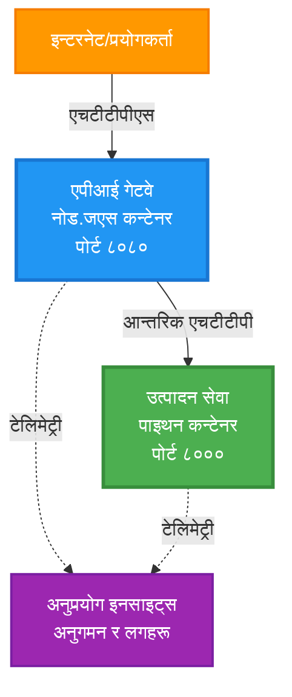
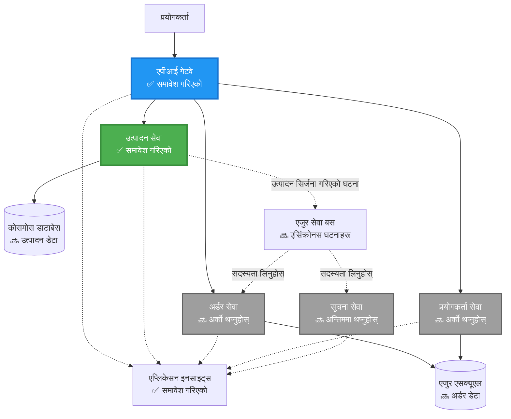
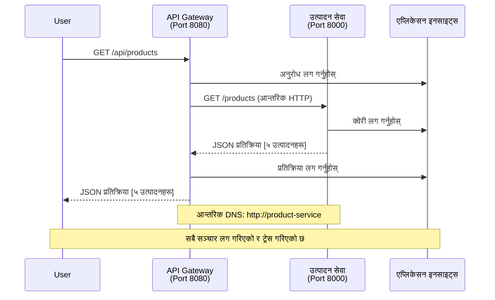

# माइक्रोसर्भिस आर्किटेक्चर - कन्टेनर एप उदाहरण

⏱️ **अनुमानित समय**: २५-३५ मिनेट | 💰 **अनुमानित लागत**: ~$५०-१००/महिना | ⭐ **जटिलता**: उन्नत

**📚 सिक्ने मार्ग:**
- ← अघिल्लो: [साधारण Flask API](../../../../examples/container-app/simple-flask-api) - एकल कन्टेनरको आधारभूत
- 🎯 **तपाईं यहाँ हुनुहुन्छ**: माइक्रोसर्भिस आर्किटेक्चर (२-सर्भिसको आधार)
- → अर्को: [AI एकीकरण](../../../../docs/ai-foundry) - तपाईंको सर्भिसहरूमा बुद्धिमत्ता थप्नुहोस्
- 🏠 [कोर्स होम](../../README.md)

---

एक **सरल तर कार्यात्मक** माइक्रोसर्भिस आर्किटेक्चर AZD CLI प्रयोग गरेर Azure Container Apps मा तैनात गरिएको। यो उदाहरणले सर्भिस-देखि-सर्भिस संचार, कन्टेनर व्यवस्थापन, र निगरानीलाई व्यावहारिक २-सर्भिस सेटअपसँग प्रदर्शन गर्दछ।

> **📚 सिक्ने दृष्टिकोण**: यो उदाहरण एक न्यूनतम २-सर्भिस आर्किटेक्चर (API Gateway + Backend Service) बाट सुरु हुन्छ जुन तपाईं वास्तवमै तैनात गर्न र सिक्न सक्नुहुन्छ। यो आधारलाई मास्टर गरेपछि, हामी पूर्ण माइक्रोसर्भिस इकोसिस्टममा विस्तारको लागि मार्गदर्शन प्रदान गर्दछौं।

## तपाईंले के सिक्नुहुनेछ

यो उदाहरण पूरा गरेर, तपाईं:
- Azure Container Apps मा धेरै कन्टेनर तैनात गर्नुहोस्
- आन्तरिक नेटवर्किङको साथ सर्भिस-देखि-सर्भिस संचार कार्यान्वयन गर्नुहोस्
- वातावरण-आधारित स्केलिङ र स्वास्थ्य जाँचहरू कन्फिगर गर्नुहोस्
- Application Insights को साथ वितरित एप्लिकेसनहरू निगरानी गर्नुहोस्
- माइक्रोसर्भिस तैनाती ढाँचाहरू र उत्तम अभ्यासहरू बुझ्नुहोस्
- सरलदेखि जटिल आर्किटेक्चरमा प्रगतिशील विस्तार सिक्नुहोस्

## आर्किटेक्चर

### चरण १: हामी के निर्माण गर्दैछौं (यो उदाहरणमा समावेश)


**घटक विवरण:**

| घटक | उद्देश्य | पहुँच | स्रोतहरू |
|-----------|---------|--------|-----------|
| **API Gateway** | बाह्य अनुरोधहरूलाई ब्याकएन्ड सर्भिसहरूमा रुट गर्दछ | सार्वजनिक (HTTPS) | १ vCPU, २GB RAM, २-२० प्रतिकृति |
| **Product Service** | इन-मेमोरी डाटाको साथ उत्पादन क्याटलग व्यवस्थापन गर्दछ | केवल आन्तरिक | ०.५ vCPU, १GB RAM, १-१० प्रतिकृति |
| **Application Insights** | केन्द्रीकृत लगिङ र वितरित ट्रेसिङ | Azure Portal | १-२ GB/महिना डाटा इनजेसन |

**किन सरलबाट सुरु गर्ने?**
- ✅ छिटो तैनात र बुझ्न सकिन्छ (२५-३५ मिनेट)
- ✅ जटिलता बिना कोर माइक्रोसर्भिस ढाँचाहरू सिक्नुहोस्
- ✅ कार्यरत कोड जुन तपाईं संशोधन र प्रयोग गर्न सक्नुहुन्छ
- ✅ सिक्नको लागि कम लागत (~$५०-१००/महिना बनाम $३००-१४००/महिना)
- ✅ डेटाबेस र सन्देश क्युहरू थप्नुअघि आत्मविश्वास निर्माण गर्नुहोस्

**उपमा**: यसलाई ड्राइभ गर्न सिक्न जस्तै सोच्नुहोस्। तपाईं खाली पार्किङ स्थलबाट सुरु गर्नुहुन्छ (२ सर्भिसहरू), आधारभूत मास्टर गर्नुहोस्, त्यसपछि सहरको ट्राफिकमा प्रगति गर्नुहोस् (५+ सर्भिसहरू डेटाबेसहरूसँग)।

### चरण २: भविष्य विस्तार (सन्दर्भ आर्किटेक्चर)

२-सर्भिस आर्किटेक्चर मास्टर गरेपछि, तपाईं विस्तार गर्न सक्नुहुन्छ:


"Expansion Guide" खण्डमा चरण-दर-चरण निर्देशनहरू हेर्नुहोस्।

## समावेश सुविधाहरू

✅ **सर्भिस डिस्कभरी**: कन्टेनरहरू बीच स्वचालित DNS-आधारित डिस्कभरी  
✅ **लोड ब्यालेन्सिङ**: प्रतिकृतिहरूमा निर्मित लोड ब्यालेन्सिङ  
✅ **अटो-स्केलिङ**: HTTP अनुरोधहरूमा आधारित प्रत्येक सर्भिस स्वतन्त्र रूपमा स्केलिङ  
✅ **स्वास्थ्य निगरानी**: दुवै सर्भिसहरूको लागि लिभनेस र रेडिनेस प्रोबहरू  
✅ **वितरित लगिङ**: Application Insights को साथ केन्द्रीकृत लगिङ  
✅ **आन्तरिक नेटवर्किङ**: सुरक्षित सर्भिस-देखि-सर्भिस संचार  
✅ **कन्टेनर व्यवस्थापन**: स्वचालित तैनाती र स्केलिङ  
✅ **शून्य-डाउनटाइम अपडेटहरू**: रिभिजन व्यवस्थापनको साथ रोलिङ अपडेटहरू  

## आवश्यकताहरू

### आवश्यक उपकरणहरू

सुरु गर्नु अघि, यी उपकरणहरू स्थापना भएको सुनिश्चित गर्नुहोस्:

1. **[Azure Developer CLI (azd)](https://learn.microsoft.com/azure/developer/azure-developer-cli/install-azd)** (संस्करण १.०.० वा उच्च)
   ```bash
   azd version
   # अपेक्षित आउटपुट: azd संस्करण 1.0.0 वा उच्च।
   ```

2. **[Azure CLI](https://learn.microsoft.com/cli/azure/install-azure-cli)** (संस्करण २.५०.० वा उच्च)
   ```bash
   az --version
   # अपेक्षित आउटपुट: azure-cli 2.50.0 वा उच्च
   ```

3. **[Docker](https://www.docker.com/get-started)** (स्थानीय विकास/परीक्षणको लागि - वैकल्पिक)
   ```bash
   docker --version
   # अपेक्षित आउटपुट: Docker संस्करण 20.10 वा उच्च
   ```

### तपाईंको सेटअप प्रमाणित गर्नुहोस्

यी आदेशहरू चलाउनुहोस् सुनिश्चित गर्न तपाईं तयार हुनुहुन्छ:

```bash
# Azure Developer CLI जाँच गर्नुहोस्
azd version
# ✅ अपेक्षित: azd संस्करण 1.0.0 वा उच्च

# Azure CLI जाँच गर्नुहोस्
az --version
# ✅ अपेक्षित: azure-cli 2.50.0 वा उच्च

# Docker जाँच गर्नुहोस् (वैकल्पिक)
docker --version
# ✅ अपेक्षित: Docker संस्करण 20.10 वा उच्च
```

**सफलताको मापदण्ड**: सबै आदेशहरू न्यूनतम वा उच्च संस्करण नम्बरहरू फर्काउँछन्।

### Azure आवश्यकताहरू

- सक्रिय **Azure सदस्यता** ([निःशुल्क खाता सिर्जना गर्नुहोस्](https://azure.microsoft.com/free/))
- तपाईंको सदस्यता भित्र स्रोतहरू सिर्जना गर्न अनुमति
- सदस्यता वा स्रोत समूहमा **Contributor** भूमिका

### ज्ञान आवश्यकताहरू

यो एक **उन्नत-स्तर** उदाहरण हो। तपाईंले:
- [साधारण Flask API उदाहरण](../../../../examples/container-app/simple-flask-api) पूरा गर्नुभएको छ
- माइक्रोसर्भिस आर्किटेक्चरको आधारभूत बुझाइ
- REST APIs र HTTP को परिचितता
- कन्टेनर अवधारणाहरूको बुझाइ

**कन्टेनर एप्समा नयाँ?** आधारभूत सिक्नको लागि पहिले [साधारण Flask API उदाहरण](../../../../examples/container-app/simple-flask-api) बाट सुरु गर्नुहोस्।

## छिटो सुरु (चरण-दर-चरण)

### चरण १: क्लोन र नेभिगेट गर्नुहोस्

```bash
git clone https://github.com/microsoft/AZD-for-beginners.git
cd AZD-for-beginners/examples/microservices
```

**✓ सफलताको जाँच**: `azure.yaml` देख्न सुनिश्चित गर्नुहोस्:
```bash
ls
# अपेक्षित: README.md, azure.yaml, infra/, src/
```

### चरण २: Azure सँग प्रमाणित गर्नुहोस्

```bash
azd auth login
```

यसले Azure प्रमाणिकरणको लागि तपाईंको ब्राउजर खोल्छ। तपाईंको Azure प्रमाणहरू प्रयोग गरेर साइन इन गर्नुहोस्।

**✓ सफलताको जाँच**: तपाईंले देख्नुपर्छ:
```
Logged in to Azure.
```

### चरण ३: वातावरण आरम्भ गर्नुहोस्

```bash
azd init
```

**तपाईंले देख्ने संकेतहरू**:
- **वातावरण नाम**: छोटो नाम प्रविष्ट गर्नुहोस् (जस्तै, `microservices-dev`)
- **Azure सदस्यता**: तपाईंको सदस्यता चयन गर्नुहोस्
- **Azure स्थान**: क्षेत्र चयन गर्नुहोस् (जस्तै, `eastus`, `westeurope`)

**✓ सफलताको जाँच**: तपाईंले देख्नुपर्छ:
```
SUCCESS: New project initialized!
```

### चरण ४: पूर्वाधार र सर्भिसहरू तैनात गर्नुहोस्

```bash
azd up
```

**के हुन्छ** (८-१२ मिनेट लाग्छ):

```mermaid
graph LR
    A[azd up] --> B[स्रोत समूह सिर्जना गर्नुहोस्]
    B --> C[कन्टेनर रजिस्ट्री तैनाथ गर्नुहोस्]
    C --> D[लग एनालिटिक्स तैनाथ गर्नुहोस्]
    D --> E[एप इन्साइट्स तैनाथ गर्नुहोस्]
    E --> F[कन्टेनर वातावरण सिर्जना गर्नुहोस्]
    F --> G[API गेटवे छवि निर्माण गर्नुहोस्]
    F --> H[उत्पादन सेवा छवि निर्माण गर्नुहोस्]
    G --> I[रजिस्ट्रीमा धकेल्नुहोस्]
    H --> I
    I --> J[API गेटवे तैनाथ गर्नुहोस्]
    I --> K[उत्पादन सेवा तैनाथ गर्नुहोस्]
    J --> L[Ingress र स्वास्थ्य जाँच कन्फिगर गर्नुहोस्]
    K --> L
    L --> M[तैनाथी पूरा भयो ✓]
    
    style A fill:#2196F3,stroke:#1976D2,stroke-width:3px,color:#fff
    style M fill:#4CAF50,stroke:#388E3C,stroke-width:3px,color:#fff
```


**✓ सफलताको जाँच**: तपाईंले देख्नुपर्छ:
```
SUCCESS: Your application was deployed to Azure in X minutes Y seconds.
Endpoint: https://api-gateway-<unique-id>.azurecontainerapps.io
```

**⏱️ समय**: ८-१२ मिनेट

### चरण ५: तैनाती परीक्षण गर्नुहोस्

```bash
# गेटवे अन्त बिन्दु प्राप्त गर्नुहोस्
GATEWAY_URL=$(azd env get-values | grep API_GATEWAY_URL | cut -d '=' -f2 | tr -d '"')

# API गेटवे स्वास्थ्य परीक्षण गर्नुहोस्
curl $GATEWAY_URL/health
```

**✅ अपेक्षित आउटपुट:**
```json
{
  "status": "healthy",
  "service": "api-gateway",
  "timestamp": "2025-11-19T10:30:00Z"
}
```

**गेटवे मार्फत उत्पादन सर्भिस परीक्षण गर्नुहोस्**:
```bash
# उत्पादनहरूको सूची
curl $GATEWAY_URL/api/products
```

**✅ अपेक्षित आउटपुट:**
```json
[
  {"id":1,"name":"Laptop","price":999.99,"stock":50},
  {"id":2,"name":"Mouse","price":29.99,"stock":200},
  {"id":3,"name":"Keyboard","price":79.99,"stock":150}
]
```

**✓ सफलताको जाँच**: दुवै अन्त बिन्दुहरूले त्रुटि बिना JSON डाटा फर्काउँछन्।

---

**🎉 बधाई छ!** तपाईंले Azure मा माइक्रोसर्भिस आर्किटेक्चर तैनात गर्नुभएको छ!

## परियोजना संरचना

सबै कार्यान्वयन फाइलहरू समावेश छन्—यो एक पूर्ण, कार्यरत उदाहरण हो:

```
microservices/
│
├── README.md                         # This file
├── azure.yaml                        # AZD configuration
├── .gitignore                        # Git ignore patterns
│
├── infra/                           # Infrastructure as Code (Bicep)
│   ├── main.bicep                   # Main orchestration
│   ├── abbreviations.json           # Naming conventions
│   ├── core/                        # Shared infrastructure
│   │   ├── container-apps-environment.bicep  # Container environment + registry
│   │   └── monitor.bicep            # Application Insights + Log Analytics
│   └── app/                         # Service definitions
│       ├── api-gateway.bicep        # API Gateway container app
│       └── product-service.bicep    # Product Service container app
│
└── src/                             # Application source code
    ├── api-gateway/                 # Node.js API Gateway
    │   ├── app.js                   # Express server with routing
    │   ├── package.json             # Node dependencies
    │   └── Dockerfile               # Container definition
    └── product-service/             # Python Product Service
        ├── main.py                  # Flask API with product data
        ├── requirements.txt         # Python dependencies
        └── Dockerfile               # Container definition
```

**प्रत्येक घटक के गर्छ:**

**पूर्वाधार (infra/)**:
- `main.bicep`: सबै Azure स्रोतहरू र तिनीहरूको निर्भरता व्यवस्थापन गर्दछ
- `core/container-apps-environment.bicep`: कन्टेनर एप्स वातावरण र Azure Container Registry सिर्जना गर्दछ
- `core/monitor.bicep`: वितरित लगिङको लागि Application Insights सेटअप गर्दछ
- `app/*.bicep`: स्केलिङ र स्वास्थ्य जाँचको साथ व्यक्तिगत कन्टेनर एप परिभाषाहरू

**API Gateway (src/api-gateway/)**:
- सार्वजनिक-सामना गर्ने सर्भिस जसले अनुरोधहरू ब्याकएन्ड सर्भिसहरूमा रुट गर्दछ
- लगिङ, त्रुटि व्यवस्थापन, र अनुरोध अग्रेषण कार्यान्वयन गर्दछ
- सर्भिस-देखि-सर्भिस HTTP संचार प्रदर्शन गर्दछ

**Product Service (src/product-service/)**:
- उत्पादन क्याटलगको साथ आन्तरिक सर्भिस (सरलताको लागि इन-मेमोरी)
- स्वास्थ्य जाँचको साथ REST API
- ब्याकएन्ड माइक्रोसर्भिस ढाँचाको उदाहरण

## सर्भिसहरूको अवलोकन

### API Gateway (Node.js/Express)

**पोर्ट**: ८०८०  
**पहुँच**: सार्वजनिक (बाह्य इनग्रेस)  
**उद्देश्य**: आउने अनुरोधहरूलाई उपयुक्त ब्याकएन्ड सर्भिसहरूमा रुट गर्दछ  

**अन्त बिन्दुहरू**:
- `GET /` - सर्भिस जानकारी
- `GET /health` - स्वास्थ्य जाँच अन्त बिन्दु
- `GET /api/products` - उत्पादन सर्भिसमा अग्रेषण (सबै सूची)
- `GET /api/products/:id` - उत्पादन सर्भिसमा अग्रेषण (ID द्वारा प्राप्त गर्नुहोस्)

**मुख्य सुविधाहरू**:
- axios को साथ अनुरोध रुटिङ
- केन्द्रीकृत लगिङ
- त्रुटि व्यवस्थापन र टाइमआउट व्यवस्थापन
- वातावरण चरहरू मार्फत सर्भिस डिस्कभरी
- Application Insights एकीकरण

**कोड हाइलाइट** (`src/api-gateway/app.js`):
```javascript
// आन्तरिक सेवा सञ्चार
app.get('/api/products', async (req, res) => {
  const response = await axios.get(`${PRODUCT_SERVICE_URL}/products`, {
    timeout: 5000
  });
  res.json(response.data);
});
```

### Product Service (Python/Flask)

**पोर्ट**: ८०००  
**पहुँच**: केवल आन्तरिक (बाह्य इनग्रेस छैन)  
**उद्देश्य**: उत्पादन क्याटलग इन-मेमोरी डाटाको साथ व्यवस्थापन गर्दछ  

**अन्त बिन्दुहरू**:
- `GET /` - सर्भिस जानकारी
- `GET /health` - स्वास्थ्य जाँच अन्त बिन्दु
- `GET /products` - सबै उत्पादनहरूको सूची
- `GET /products/<id>` - ID द्वारा उत्पादन प्राप्त गर्नुहोस्

**मुख्य सुविधाहरू**:
- Flask को साथ RESTful API
- इन-मेमोरी उत्पादन स्टोर (सरल, कुनै डेटाबेस आवश्यक छैन)
- प्रोबहरूको साथ स्वास्थ्य निगरानी
- संरचित लगिङ
- Application Insights एकीकरण

**डाटा मोडेल**:
```python
{
  "id": 1,
  "name": "Laptop",
  "description": "High-performance laptop",
  "price": 999.99,
  "stock": 50
}
```

**किन केवल आन्तरिक?**
उत्पादन सर्भिस सार्वजनिक रूपमा उजागर गरिएको छैन। सबै अनुरोधहरू API Gateway मार्फत जानुपर्छ, जसले प्रदान गर्दछ:
- सुरक्षा: नियन्त्रण गरिएको पहुँच बिन्दु
- लचिलोपन: क्लाइन्टहरूलाई असर नगरी ब्याकएन्ड परिवर्तन गर्न सकिन्छ
- निगरानी: केन्द्रीकृत अनुरोध लगिङ

## सर्भिस संचार बुझ्दै

### सर्भिसहरू एक-अर्कासँग कसरी कुरा गर्छन्


यस उदाहरणमा, API Gateway ले **आन्तरिक HTTP कलहरू** प्रयोग गरेर Product Service सँग संचार गर्दछ:

```javascript
// एपीआई गेटवे (src/api-gateway/app.js)
const PRODUCT_SERVICE_URL = process.env.PRODUCT_SERVICE_URL;

// आन्तरिक HTTP अनुरोध गर्नुहोस्
const response = await axios.get(`${PRODUCT_SERVICE_URL}/products`);
```

**मुख्य बिन्दुहरू**:

1. **DNS-आधारित डिस्कभरी**: कन्टेनर एप्सले आन्तरिक सर्भिसहरूको लागि स्वचालित रूपमा DNS प्रदान गर्दछ
   - Product Service FQDN: `product-service.internal.<environment>.azurecontainerapps.io`
   - सरल रूपमा: `http://product-service` (कन्टेनर एप्सले यसलाई समाधान गर्दछ)

2. **कुनै सार्वजनिक एक्सपोजर छैन**: Product Service मा Bicep मा `external: false` छ
   - केवल कन्टेनर एप्स वातावरण भित्र पहुँचयोग्य
   - इन्टरनेटबाट पुग्न सकिँदैन

3. **Environment Variables**: सर्भिस URL हरू तैनाती समयमा इंजेक्ट गरिन्छ
   - Bicep ले गेटवेमा आन्तरिक FQDN पास गर्दछ
   - एप्लिकेसन कोडमा कुनै हार्डकोडेड URL छैन

**उपमा**: यसलाई कार्यालय कोठाहरू जस्तै सोच्नुहोस्। API Gateway रिसेप्शन डेस्क हो (सार्वजनिक-सामना गर्ने), र Product Service कार्यालय कोठा हो (केवल आन्तरिक)। आगन्तुकहरूले कुनै पनि कार्यालयमा पुग्न रिसेप्शन मार्फत जानुपर्छ।

## तैनाती विकल्पहरू

### पूर्ण तैनाती (सिफारिस गरिएको)

```bash
# पूर्वाधार र दुबै सेवाहरू परिनियोजन गर्नुहोस्
azd up
```

यसले तैनात गर्दछ:
1. कन्टेनर एप्स वातावरण
2. Application Insights
3. कन्टेनर रजिस्ट्री
4. API Gateway कन्टेनर
5. Product Service कन्टेनर

**समय**: ८-१२ मिनेट

### व्यक्तिगत सर्भिस तैनात गर्नुहोस्

```bash
# केवल एक सेवा तैनात गर्नुहोस् (प्रारम्भिक azd up पछि)
azd deploy api-gateway

# वा उत्पादन सेवा तैनात गर्नुहोस्
azd deploy product-service
```

**प्रयोग केस**: जब तपाईंले एक सर्भिसमा कोड अपडेट गर्नुभएको छ र केवल त्यो सर्भिस पुनः तैनात गर्न चाहनुहुन्छ।

### कन्फिगरेसन अपडेट गर्नुहोस्

```bash
# स्केलिङ प्यारामिटरहरू परिवर्तन गर्नुहोस्
azd env set GATEWAY_MAX_REPLICAS 30

# नयाँ कन्फिगरेसनसँग पुनः तैनात गर्नुहोस्
azd up
```

## कन्फिगरेसन

### स्केलिङ कन्फिगरेसन

दुवै सर्भिसहरू Bicep फाइलहरूमा HTTP-आधारित अटोस्केलिङको साथ कन्फिगर गरिएको छ:

**API Gateway**:
- न्यूनतम प्रतिकृति: २ (सधैं कम्तिमा २ उपलब्धताका लागि)
- अधिकतम प्रतिकृति: २०
- स्केल ट्रिगर: प्रति प्रतिकृति ५० समवर्ती अनुरोधहरू

**Product Service**:
- न्यूनतम प्रतिकृति: १ (आवश्यक भएमा शून्यमा स्केल गर्न सकिन्छ)
- अधिकतम प्रतिकृति: १०
- स्केल ट्रिगर: प्रति प्रतिकृति १०० समवर्ती अनुरोधहरू

**स्केलिङ अनुकूलन गर्नुहोस्** (`infra/app/*.bicep` मा):
```bicep
scale: {
  minReplicas: 1
  maxReplicas: 10
  rules: [
    {
      name: 'http-scale-rule'
      http: {
        metadata: {
          concurrentRequests: '100'  // Adjust this
        }
      }
    }
  ]
}
```

### स्रोत आवंटन

**API Gateway**:
- CPU: १.० vCPU
- मेमोरी: २ GiB
- कारण: सबै बाह्य ट्राफिक ह्यान्डल गर्दछ

**Product Service**:
- CPU: ०.५ vCPU
- मेमोरी: १ GiB
- कारण: हल्का इन-मेमोरी अपरेसनहरू

### स्वास्थ्य जाँचहरू

दुवै सर्भिसहरूमा लिभनेस र रेडिनेस प्रोबहरू समावेश छन्:

```bicep
probes: [
  {
    type: 'Liveness'
    httpGet: {
      path: '/health'
      port: 8080
    }
    initialDelaySeconds: 10
    periodSeconds: 30
  }
  {
    type: 'Readiness'
    httpGet: {
      path: '/health'
      port: 8080
    }
    initialDelaySeconds: 5
    periodSeconds: 10
  }
]
```

**यसको अर्थ के हो**:
- **लिभनेस**: यदि स्वास्थ्य जाँच असफल भयो भने, कन्टेनर एप्सले कन्टेनर पुनः सुरु गर्दछ
- **रेडिनेस**: यदि तयार छैन भने, कन्टेनर एप्सले उक्त प्रतिकृतिमा ट्राफिक रुट गर्न रोक्छ

## निगरानी र अवलोकन

### सर्भिस लगहरू हेर्नुहोस्

```bash
# API गेटवेबाट लगहरू स्ट्रिम गर्नुहोस्
azd logs api-gateway --follow

# हालसालैको उत्पादन सेवा लगहरू हेर्नुहोस्
azd logs product-service --tail 100

# दुबै सेवाहरूबाट सबै लगहरू हेर्नुहोस्
azd logs --follow
```

**अपेक्षित आउटपुट**:
```
[api-gateway] API Gateway listening on port 8080
[api-gateway] Product Service URL: http://product-service
[api-gateway] GET /api/products 200 - 45ms
[product-service] Retrieved 5 products
```

### Application Insights क्वेरीहरू

Azure Portal मा Application Insights पहुँच गर्नुहोस्, त्यसपछि यी क्वेरीहरू चलाउनुहोस्:

**ढिलो अनुरोधहरू फेला पार्नुहोस्**:
```kusto
requests
| where timestamp > ago(1h)
| where duration > 1000  // Requests taking >1 second
| summarize count() by name, cloud_RoleName
| order by count_ desc
```

**सर्भिस-देखि-सर्भिस कलहरू ट्र्याक गर्नुहोस्**:
```kusto
dependencies
| where timestamp > ago(1h)
| where type == "Http"
| project timestamp, name, target, duration, success
| order by timestamp desc
```

**सर्भिसद्वारा त्रुटि दर**:
```kusto
exceptions
| where timestamp > ago(24h)
| summarize errorCount = count() by cloud_RoleName, type
| order by errorCount desc
```

**समयको साथ अनुरोध मात्रा**:
```kusto
requests
| where timestamp > ago(1h)
| summarize requestCount = count() by bin(timestamp, 5m), cloud_RoleName
| render timechart
```

### निगरानी ड्यासबोर्ड पहुँच गर्नुहोस्

```bash
# एप्लिकेशन इनसाइट्स विवरण प्राप्त गर्नुहोस्
azd env get-values | grep APPLICATIONINSIGHTS

# एजर पोर्टल अनुगमन खोल्नुहोस्
az monitor app-insights component show \
  --app $(azd env get-values | grep APPLICATIONINSIGHTS_CONNECTION_STRING | cut -d '=' -f2) \
  --resource-group $(azd env get-values | grep AZURE_RESOURCE_GROUP | cut -d '=' -f2) \
  --query "appId" -o tsv
```

### लाइभ मेट्रिक्स

1. Azure Portal मा Application Insights नेभिगेट गर्नुहोस्
2. "Live Metrics" मा क्लिक गर्नुहोस्
3. वास्तविक-समय अनुरोधहरू, असफलताहरू, र प्रदर्शन हेर्नुहोस्
4. परीक्षण गर्नुहोस्: `curl $(azd env get-values | grep API_GATEWAY_URL | cut -d '=' -f2 | tr -d '"')/api/products` चलाउनुहोस्

## व्यावहारिक अभ्यासहरू

### अभ्यास १: नयाँ उत्पादन अन्त बिन्दु थप्नुहोस् ⭐ (सजिलो)

**उद्देश्य**: नयाँ उत्पादनहरू सिर्जना गर्न POST अन्त बिन्दु थप्नुहोस्

**सुरु बिन्दु**: `src/product-service/main.py`

**चरणहरू**:

1. `main.py` मा `get_product` फंक्शन पछि यो अन्त बिन्दु थप्नुहोस्:

```python
@app.route('/products', methods=['POST'])
def create_product():
    """Create a new product"""
    data = request.get_json()
    
    # आवश्यक क्षेत्रहरू प्रमाणित गर्नुहोस्
    if not data or 'name' not in data or 'price' not in data:
        return jsonify({'error': 'Missing required fields: name, price'}), 400
    
    new_id = max(p['id'] for p in products) + 1
    new_product = {
        'id': new_id,
        'name': data['name'],
        'description': data.get('description', ''),
        'price': float(data['price']),
        'stock': int(data.get('stock', 0))
    }
    products.append(new_product)
    logger.info(f"Created product {new_id}")
    return jsonify(new_product), 201
```

2. API Gateway मा POST रुट थप
3. दुबै सेवाहरू पुनः तैनात गर्नुहोस्:

```bash
azd deploy product-service
azd deploy api-gateway
```

4. नयाँ अन्त बिन्दु परीक्षण गर्नुहोस्:

```bash
GATEWAY_URL=$(azd env get-values | grep API_GATEWAY_URL | cut -d '=' -f2 | tr -d '"')

# नयाँ उत्पादन सिर्जना गर्नुहोस्
curl -X POST $GATEWAY_URL/api/products \
  -H "Content-Type: application/json" \
  -d '{"name":"USB Cable","price":9.99,"stock":500}'
```

**✅ अपेक्षित नतिजा:**
```json
{"id":6,"name":"USB Cable","description":"","price":9.99,"stock":500}
```

5. सूचीमा देखिन्छ कि छैन जाँच गर्नुहोस्:

```bash
curl $GATEWAY_URL/api/products
# अब नयाँ USB केबल सहित ६ उत्पादनहरू देखाउनु पर्नेछ
```

**सफलताको मापदण्ड**:
- ✅ POST अनुरोधले HTTP 201 फर्काउँछ
- ✅ नयाँ उत्पादन GET /api/products सूचीमा देखिन्छ
- ✅ उत्पादनमा स्वतः वृद्धि भएको ID हुन्छ

**समय**: 10-15 मिनेट

---

### अभ्यास 2: Autoscaling नियमहरू परिवर्तन गर्नुहोस् ⭐⭐ (मध्यम)

**उद्देश्य**: Product Service लाई बढी आक्रामक रूपमा स्केल गर्न परिवर्तन गर्नुहोस्

**सुरुवात बिन्दु**: `infra/app/product-service.bicep`

**चरणहरू**:

1. `infra/app/product-service.bicep` खोल्नुहोस् र `scale` ब्लक (लाइन 95 वरिपरि) खोज्नुहोस्

2. परिवर्तन गर्नुहोस्:
```bicep
scale: {
  minReplicas: 1
  maxReplicas: 10
  rules: [
    {
      name: 'http-scale-rule'
      http: {
        metadata: {
          concurrentRequests: '100'  // OLD
        }
      }
    }
  ]
}
```

बाट:
```bicep
scale: {
  minReplicas: 2  // Always have 2 running
  maxReplicas: 20  // Allow more scaling
  rules: [
    {
      name: 'http-scale-rule'
      http: {
        metadata: {
          concurrentRequests: '20'  // Scale at lower threshold
        }
      }
    }
  ]
}
```

मा:
3. पूर्वाधार पुनः तैनात गर्नुहोस्:

```bash
azd up
```

4. नयाँ स्केलिङ कन्फिगरेसन जाँच गर्नुहोस्:

```bash
az containerapp show \
  --name $(azd env get-values | grep PRODUCT_SERVICE | head -1 | cut -d '/' -f5) \
  --resource-group $(azd env get-values | grep AZURE_RESOURCE_GROUP | cut -d '=' -f2 | tr -d '"') \
  --query "properties.template.scale" -o json
```

**✅ अपेक्षित नतिजा:**
```json
{
  "minReplicas": 2,
  "maxReplicas": 20,
  "rules": [...]
}
```

5. लोडको साथ autoscaling परीक्षण गर्नुहोस्:

```bash
# समानान्तर अनुरोधहरू उत्पन्न गर्नुहोस्
for i in {1..500}; do curl $GATEWAY_URL/api/products & done

# स्केलिङ हुँदै गरेको हेर्नुहोस्
azd logs product-service --follow
# खोज्नुहोस्: कन्टेनर एप्स स्केलिङ घटनाहरू
```

**सफलताको मापदण्ड**:
- ✅ Product Service सधैं कम्तिमा 2 प्रतिकृति चलाउँछ
- ✅ लोडको समयमा, 2 भन्दा बढी प्रतिकृति स्केल हुन्छ
- ✅ Azure Portal मा नयाँ स्केलिङ नियमहरू देखिन्छ

**समय**: 15-20 मिनेट

---

### अभ्यास 3: कस्टम निगरानी क्वेरी थप्नुहोस् ⭐⭐ (मध्यम)

**उद्देश्य**: Product API प्रदर्शन ट्र्याक गर्न कस्टम Application Insights क्वेरी सिर्जना गर्नुहोस्

**चरणहरू**:

1. Azure Portal मा Application Insights मा जानुहोस्:
   - Azure Portal मा जानुहोस्
   - आफ्नो स्रोत समूह (rg-microservices-*) खोज्नुहोस्
   - Application Insights स्रोतमा क्लिक गर्नुहोस्

2. बाँया मेनुमा "Logs" मा क्लिक गर्नुहोस्

3. यो क्वेरी सिर्जना गर्नुहोस्:

```kusto
requests
| where timestamp > ago(1h)
| where name contains "products"
| summarize 
    RequestCount = count(),
    AvgDuration = avg(duration),
    P95Duration = percentile(duration, 95),
    SuccessRate = 100.0 * countif(success == true) / count()
  by bin(timestamp, 5m)
| render timechart
```

4. क्वेरी चलाउन "Run" मा क्लिक गर्नुहोस्

5. क्वेरी बचत गर्नुहोस्:
   - "Save" मा क्लिक गर्नुहोस्
   - नाम: "Product API Performance"
   - श्रेणी: "Performance"

6. परीक्षण ट्राफिक सिर्जना गर्नुहोस्:

```bash
for i in {1..100}; do curl $GATEWAY_URL/api/products; sleep 1; done
```

7. डेटा हेर्न क्वेरी रिफ्रेस गर्नुहोस्

**✅ अपेक्षित नतिजा:**
- समयको साथ अनुरोध गणना देखाउने चार्ट
- औसत अवधि < 500ms
- सफलता दर = 100%
- 5 मिनेटको समय बिनहरू

**सफलताको मापदण्ड**:
- ✅ क्वेरीले 100+ अनुरोध देखाउँछ
- ✅ सफलता दर 100% छ
- ✅ औसत अवधि < 500ms
- ✅ चार्टले 5-मिनेट समय बिनहरू देखाउँछ

**सिकाइ परिणाम**: कस्टम क्वेरीहरूको साथ सेवा प्रदर्शन निगरानी गर्न बुझ्नुहोस्

**समय**: 10-15 मिनेट

---

### अभ्यास 4: Retry Logic कार्यान्वयन गर्नुहोस् ⭐⭐⭐ (उन्नत)

**उद्देश्य**: Product Service अस्थायी रूपमा अनुपलब्ध हुँदा API Gateway मा Retry Logic थप्नुहोस्

**सुरुवात बिन्दु**: `src/api-gateway/app.js`

**चरणहरू**:

1. Retry लाइब्रेरी स्थापना गर्नुहोस्:

```bash
cd src/api-gateway
npm install axios-retry --save
cd ../..
```

2. `src/api-gateway/app.js` अपडेट गर्नुहोस् (axios आयात पछि थप्नुहोस्):

```javascript
const axiosRetry = require('axios-retry');

// पुन: प्रयास गर्ने तर्क सेटअप गर्नुहोस्
axiosRetry(axios, {
  retries: 3,
  retryDelay: (retryCount) => {
    return retryCount * 1000; // १ सेकेन्ड, २ सेकेन्ड, ३ सेकेन्ड
  },
  retryCondition: (error) => {
    // नेटवर्क त्रुटिहरू वा ५xx प्रतिक्रिया मा पुन: प्रयास गर्नुहोस्
    return axiosRetry.isNetworkOrIdempotentRequestError(error) ||
           (error.response && error.response.status >= 500);
  }
});

console.log('Retry logic configured: 3 retries with exponential backoff');
```

3. API Gateway पुनः तैनात गर्नुहोस्:

```bash
azd deploy api-gateway
```

4. सेवा विफलता अनुकरण गरेर Retry व्यवहार परीक्षण गर्नुहोस्:

```bash
# उत्पादन सेवा 0 मा स्केल गर्नुहोस् (विफलता अनुकरण गर्नुहोस्)
az containerapp update \
  --name $(azd env get-values | grep PRODUCT_SERVICE | head -1 | cut -d '/' -f5) \
  --resource-group $(azd env get-values | grep AZURE_RESOURCE_GROUP | cut -d '=' -f2 | tr -d '"') \
  --min-replicas 0 \
  --max-replicas 0

# उत्पादनहरू पहुँच गर्न प्रयास गर्नुहोस् (३ पटक पुन: प्रयास हुनेछ)
time curl -v $GATEWAY_URL/api/products
# अवलोकन गर्नुहोस्: प्रतिक्रिया ~६ सेकेन्ड लाग्छ (१ सेकेन्ड + २ सेकेन्ड + ३ सेकेन्ड पुन: प्रयास)

# उत्पादन सेवा पुनर्स्थापना गर्नुहोस्
az containerapp update \
  --name $(azd env get-values | grep PRODUCT_SERVICE | head -1 | cut -d '/' -f5) \
  --resource-group $(azd env get-values | grep AZURE_RESOURCE_GROUP | cut -d '=' -f2 | tr -d '"') \
  --min-replicas 1 \
  --max-replicas 10
```

5. Retry लगहरू हेर्नुहोस्:

```bash
azd logs api-gateway --tail 50
# पुन: प्रयास सन्देशहरूको लागि खोज्नुहोस्
```

**✅ अपेक्षित व्यवहार:**
- अनुरोधहरू असफल हुनु अघि 3 पटक Retry गर्छ
- प्रत्येक Retry लामो समय पर्खन्छ (1s, 2s, 3s)
- सेवा पुनः सुरु भएपछि सफल अनुरोधहरू
- लगहरूले Retry प्रयासहरू देखाउँछ

**सफलताको मापदण्ड**:
- ✅ अनुरोधहरू असफल हुनु अघि 3 पटक Retry गर्छ
- ✅ प्रत्येक Retry लामो समय पर्खन्छ (exponential backoff)
- ✅ सेवा पुनः सुरु भएपछि सफल अनुरोधहरू
- ✅ लगहरूले Retry प्रयासहरू देखाउँछ

**सिकाइ परिणाम**: माइक्रोसर्भिसहरूमा लचिलोपन ढाँचाहरू बुझ्नुहोस् (circuit breakers, retries, timeouts)

**समय**: 20-25 मिनेट

---

## ज्ञान जाँच बिन्दु

यो उदाहरण पूरा गरेपछि, आफ्नो बुझाइ प्रमाणित गर्नुहोस्:

### 1. सेवा संचार ✓

आफ्नो ज्ञान परीक्षण गर्नुहोस्:
- [ ] API Gateway ले Product Service कसरी पत्ता लगाउँछ व्याख्या गर्न सक्नुहुन्छ? (DNS-आधारित सेवा खोज)
- [ ] Product Service डाउन भएमा के हुन्छ? (Gateway ले 503 त्रुटि फर्काउँछ)
- [ ] तेस्रो सेवा कसरी थप्ने? (नयाँ Bicep फाइल सिर्जना गर्नुहोस्, main.bicep मा थप्नुहोस्, src फोल्डर सिर्जना गर्नुहोस्)

**ह्यान्ड्स-अन प्रमाणिकरण**:
```bash
# सेवा असफलता अनुकरण गर्नुहोस्
az containerapp update --name <product-service-name> --min-replicas 0 --max-replicas 0
curl $GATEWAY_URL/api/products
# ✅ अपेक्षित: 503 सेवा उपलब्ध छैन

# सेवा पुनर्स्थापना गर्नुहोस्
az containerapp update --name <product-service-name> --min-replicas 1 --max-replicas 10
```

### 2. निगरानी र अवलोकनीयता ✓

आफ्नो ज्ञान परीक्षण गर्नुहोस्:
- [ ] वितरित लगहरू कहाँ देख्नुहुन्छ? (Azure Portal मा Application Insights)
- [ ] सुस्त अनुरोधहरू कसरी ट्र्याक गर्नुहुन्छ? (Kusto क्वेरी: `requests | where duration > 1000`)
- [ ] कुन सेवाले त्रुटि सिर्जना गर्‍यो पहिचान गर्न सक्नुहुन्छ? (लगहरूमा `cloud_RoleName` फिल्ड जाँच गर्नुहोस्)

**ह्यान्ड्स-अन प्रमाणिकरण**:
```bash
# सुस्त अनुरोध सिमुलेशन उत्पन्न गर्नुहोस्
curl "$GATEWAY_URL/api/products?delay=2000"

# सुस्त अनुरोधहरूको लागि एप्लिकेशन इनसाइट्स सोधपुछ गर्नुहोस्
# Azure पोर्टल → एप्लिकेशन इनसाइट्स → लग्समा जानुहोस्
# चलाउनुहोस्: requests | where duration > 1000 | project timestamp, name, duration, cloud_RoleName
```

### 3. स्केलिङ र प्रदर्शन ✓

आफ्नो ज्ञान परीक्षण गर्नुहोस्:
- [ ] Autoscaling केले ट्रिगर गर्छ? (HTTP समवर्ती अनुरोध नियमहरू: Gateway का लागि 50, Product का लागि 100)
- [ ] अहिले कति प्रतिकृति चलिरहेका छन्? (जाँच गर्नुहोस् `az containerapp revision list`)
- [ ] Product Service लाई 5 प्रतिकृति स्केल कसरी गर्ने? (Bicep मा minReplicas अपडेट गर्नुहोस्)

**ह्यान्ड्स-अन प्रमाणिकरण**:
```bash
# अटोस्केलिङ परीक्षण गर्न लोड उत्पन्न गर्नुहोस्
for i in {1..1000}; do curl $GATEWAY_URL/api/products & done

# प्रतिकृतिहरू बढ्दै गएको हेर्नुहोस्
azd logs api-gateway --follow
# ✅ अपेक्षित: लगहरूमा स्केलिङ घटनाहरू हेर्नुहोस्
```

**सफलताको मापदण्ड**: तपाईं सबै प्रश्नहरूको उत्तर दिन सक्नुहुन्छ र ह्यान्ड्स-अन कमाण्डहरूसँग प्रमाणित गर्न सक्नुहुन्छ।

---

## लागत विश्लेषण

### अनुमानित मासिक लागत (यो 2-सेवा उदाहरणको लागि)

| स्रोत | कन्फिगरेसन | अनुमानित लागत |
|----------|--------------|----------------|
| API Gateway | 2-20 प्रतिकृति, 1 vCPU, 2GB RAM | $30-150 |
| Product Service | 1-10 प्रतिकृति, 0.5 vCPU, 1GB RAM | $15-75 |
| Container Registry | Basic tier | $5 |
| Application Insights | 1-2 GB/महिना | $5-10 |
| Log Analytics | 1 GB/महिना | $3 |
| **कुल** | | **$58-243/महिना** |

### प्रयोग अनुसार लागत ब्रेकडाउन

**हल्का ट्राफिक** (परीक्षण/सिकाइ): ~$60/महिना
- API Gateway: 2 प्रतिकृति × 24/7 = $30
- Product Service: 1 प्रतिकृति × 24/7 = $15
- निगरानी + रजिस्ट्री = $13

**मध्यम ट्राफिक** (सानो उत्पादन): ~$120/महिना
- API Gateway: 5 औसत प्रतिकृति = $75
- Product Service: 3 औसत प्रतिकृति = $45
- निगरानी + रजिस्ट्री = $13

**उच्च ट्राफिक** (व्यस्त समय): ~$240/महिना
- API Gateway: 15 औसत प्रतिकृति = $225
- Product Service: 8 औसत प्रतिकृति = $120
- निगरानी + रजिस्ट्री = $13

### लागत अनुकूलन सुझावहरू

1. **विकासको लागि शून्यमा स्केल गर्नुहोस्**:
   ```bicep
   scale: {
     minReplicas: 0  // Save $30-40/month when not in use
     maxReplicas: 10
   }
   ```

2. **Cosmos DB को लागि उपभोग योजना प्रयोग गर्नुहोस्** (जब तपाईं यसलाई थप्नुहुन्छ):
   - तपाईंले प्रयोग गरेको मात्र तिर्नुहोस्
   - कुनै न्यूनतम शुल्क छैन

3. **Application Insights स्याम्पलिङ सेट गर्नुहोस्**:
   ```javascript
   appInsights.defaultClient.config.samplingPercentage = 50; // अनुरोधहरूको 50% नमूना
   ```

4. **आवश्यक नभएको बेला सफा गर्नुहोस्**:
   ```bash
   azd down --force --purge
   ```

### निःशुल्क स्तर विकल्पहरू

सिकाइ/परीक्षणको लागि विचार गर्नुहोस्:
- ✅ Azure निःशुल्क क्रेडिट प्रयोग गर्नुहोस् ($200 पहिलो 30 दिनको लागि नयाँ खाताहरूमा)
- ✅ न्यूनतम प्रतिकृति राख्नुहोस् (लगभग 50% लागत बचत गर्छ)
- ✅ परीक्षण पछि मेटाउनुहोस् (कुनै चलिरहेको शुल्क छैन)
- ✅ सिकाइ सत्रहरू बीच शून्यमा स्केल गर्नुहोस्

**उदाहरण**: यो उदाहरण 2 घण्टा/दिन × 30 दिन चलाउनुहोस् = ~$5/महिना $60/महिना सट्टा

---

## समस्या समाधान द्रुत सन्दर्भ

### समस्या: `azd up` "Subscription not found" त्रुटि देखाउँछ

**समाधान**:
```bash
# स्पष्ट सदस्यता सहित पुन: लगइन गर्नुहोस्
az account set --subscription <your-subscription-id>
azd env set AZURE_SUBSCRIPTION_ID <your-subscription-id>
azd up
```

### समस्या: API Gateway ले 503 "Product service unavailable" फर्काउँछ

**निदान गर्नुहोस्**:
```bash
# उत्पादन सेवा लगहरू जाँच गर्नुहोस्
azd logs product-service --tail 50

# उत्पादन सेवा स्वास्थ्य जाँच गर्नुहोस्
az containerapp show \
  --name $(azd env get-values | grep PRODUCT_SERVICE | head -1 | cut -d '/' -f5) \
  --resource-group $(azd env get-values | grep AZURE_RESOURCE_GROUP | cut -d '=' -f2 | tr -d '"') \
  --query "properties.runningStatus"
```

**सामान्य कारणहरू**:
1. Product service सुरु भएन (Python त्रुटिहरूको लागि लगहरू जाँच गर्नुहोस्)
2. स्वास्थ्य जाँच असफल भयो (`/health` अन्त बिन्दु काम गर्छ कि जाँच गर्नुहोस्)
3. कन्टेनर छवि निर्माण असफल भयो (रजिस्ट्रीमा छवि जाँच गर्नुहोस्)

### समस्या: Autoscaling काम गरिरहेको छैन

**निदान गर्नुहोस्**:
```bash
# वर्तमान प्रतिकृति गणना जाँच गर्नुहोस्
az containerapp revision list \
  --name $(azd env get-values | grep API_GATEWAY | head -1 | cut -d '/' -f5) \
  --resource-group $(azd env get-values | grep AZURE_RESOURCE_GROUP | cut -d '=' -f2 | tr -d '"') \
  --query "[].properties.replicas"

# परीक्षण गर्न लोड उत्पन्न गर्नुहोस्
for i in {1..1000}; do curl $GATEWAY_URL/api/products & done

# स्केलिङ घटनाहरू हेर्नुहोस्
azd logs api-gateway --follow | grep -i scale
```

**सामान्य कारणहरू**:
1. स्केल नियम ट्रिगर गर्न पर्याप्त लोड छैन (50 भन्दा बढी समवर्ती अनुरोध आवश्यक छ)
2. अधिकतम प्रतिकृति पहिले नै पुगेको छ (Bicep कन्फिगरेसन जाँच गर्नुहोस्)
3. Bicep मा स्केल नियम गलत कन्फिगर गरिएको छ (concurrentRequests मान जाँच गर्नुहोस्)

### समस्या: Application Insights लगहरू देखाइरहेको छैन

**निदान गर्नुहोस्**:
```bash
# जडान स्ट्रिङ सेट गरिएको छ कि छैन पुष्टि गर्नुहोस्
azd env get-values | grep APPLICATIONINSIGHTS

# सेवाहरू टेलिमेट्री पठाइरहेका छन् कि छैन जाँच गर्नुहोस्
az monitor app-insights component show \
  --app $(azd env get-values | grep APPLICATIONINSIGHTS_NAME | cut -d '=' -f2 | tr -d '"') \
  --resource-group $(azd env get-values | grep AZURE_RESOURCE_GROUP | cut -d '=' -f2 | tr -d '"') \
  --query "properties.InstrumentationKey"
```

**सामान्य कारणहरू**:
1. कन्टेनरमा कनेक्शन स्ट्रिङ पास गरिएको छैन (पर्यावरण चरहरू जाँच गर्नुहोस्)
2. Application Insights SDK कन्फिगर गरिएको छैन (कोडमा आयातहरू जाँच गर्नुहोस्)
3. टेलिमेट्री ब्लक गर्ने फायरवाल (दुर्लभ, नेटवर्क नियमहरू जाँच गर्नुहोस्)

### समस्या: Docker निर्माण स्थानीय रूपमा असफल भयो

**निदान गर्नुहोस्**:
```bash
# एपीआई गेटवे निर्माण परीक्षण गर्नुहोस्
cd src/api-gateway
docker build -t test-gateway .

# उत्पादन सेवा निर्माण परीक्षण गर्नुहोस्
cd ../product-service
docker build -t test-product .
```

**सामान्य कारणहरू**:
1. package.json/requirements.txt मा हराइरहेका निर्भरताहरू
2. Dockerfile वाक्यविन्यास त्रुटिहरू
3. निर्भरताहरू डाउनलोड गर्ने नेटवर्क समस्या

**अझै अड्किनुभएको छ?** [सामान्य समस्या मार्गदर्शन](../../docs/troubleshooting/common-issues.md) वा [Azure Container Apps Troubleshooting](https://learn.microsoft.com/azure/container-apps/troubleshooting) हेर्नुहोस्

---

## सफाइ

चलिरहेको शुल्कहरूबाट बच्न, सबै स्रोतहरू मेटाउनुहोस्:

```bash
azd down --force --purge
```

**पुष्टिकरण संकेत**:
```
? Total resources to delete: 6, are you sure you want to continue? (y/N)
```

`y` टाइप गरेर पुष्टि गर्नुहोस्।

**के मेटिन्छ**:
- Container Apps Environment
- दुबै Container Apps (gateway & product service)
- Container Registry
- Application Insights
- Log Analytics Workspace
- Resource Group

**✓ सफाइ प्रमाणित गर्नुहोस्**:
```bash
az group list --query "[?starts_with(name,'rg-microservices')]" --output table
```

खाली फर्काउनु पर्छ।

---

## विस्तार मार्गदर्शन: 2 बाट 5+ सेवाहरूमा

यो 2-सेवा आर्किटेक्चरमा महारत हासिल गरेपछि, विस्तार गर्ने तरिका यहाँ छ:

### चरण 1: डेटाबेस स्थायित्व थप्नुहोस् (अर्को चरण)

**Product Service को लागि Cosmos DB थप्नुहोस्**:

1. `infra/core/cosmos.bicep` सिर्जना गर्नुहोस्:
   ```bicep
   resource cosmosAccount 'Microsoft.DocumentDB/databaseAccounts@2023-04-15' = {
     name: name
     location: location
     kind: 'GlobalDocumentDB'
     properties: {
       databaseAccountOfferType: 'Standard'
       consistencyPolicy: { defaultConsistencyLevel: 'Session' }
       locations: [{ locationName: location, failoverPriority: 0 }]
     }
   }
   ```

2. Product Service लाई इन-मेमोरी डेटा सट्टा Azure Cosmos DB Python SDK प्रयोग गर्न अपडेट गर्नुहोस्

3. अनुमानित अतिरिक्त लागत: ~$25/महिना (सर्भरलेस)

### चरण 2: तेस्रो सेवा थप्नुहोस् (Order Management)

**Order Service सिर्जना गर्नुहोस्**:

1. नयाँ फोल्डर: `src/order-service/` (Python/Node.js/C#)
2. नयाँ Bicep: `infra/app/order-service.bicep`
3. API Gateway लाई `/api/orders` मार्ग दिन अपडेट गर्नुहोस्
4. Order स्थायित्वको लागि Azure SQL Database थप्नुहोस्

**आर्किटेक्चर यस्तो हुन्छ**:
```
API Gateway → Product Service (Cosmos DB)
           → Order Service (Azure SQL)
```

### चरण 3: Async संचार थप्नुहोस् (Service Bus)

**Event-Driven Architecture कार्यान्वयन गर्नुहोस्**:

1. Azure Service Bus थप्नुहोस्: `infra/core/servicebus.bicep`
2. Product Service ले "ProductCreated" घटनाहरू प्रकाशित गर्छ
3. Order Service ले उत्पादन घटनाहरू सदस्यता लिन्छ
4. Notification Service थप्नुहोस् घटनाहरू प्रक्रिया गर्न

**ढाँचा**: अनुरोध/प्रतिक्रिया (HTTP) + Event-Driven (Service Bus)

### चरण 4: प्रयोगकर्ता प्रमाणीकरण थप्नुहोस्

**User Service कार्यान्वयन गर्नुहोस्**:

1. `src/user-service/` सिर्जना गर्नुहोस् (Go/Node.js)
2. Azure AD B2C वा कस्टम JWT प्रमाणीकरण थप्नुहोस्
3. API Gateway ले टोकनहरू मार्ग दिनु अघि प्रमाणित गर्छ
4. सेवाहरूले प्रयोगकर्ता अनुमति जाँच गर्छ

### चरण 5: उत्पादन तयारी

**यी घटकहरू थप्नुहोस्**:
- ✅ Azure Front Door (वैश्विक लोड ब्यालेन्सिङ)
- ✅ Azure Key Vault (गोप्य व्यवस्थापन)
- ✅ Azure Monitor Workbooks (कस्टम ड्यासबोर्डहरू)
- ✅ CI/CD पाइपलाइन (GitHub Actions)
- ✅ Blue-Green Deployments
- ✅ सबै सेवाहरूको लागि Managed Identity

**पूर्ण उत्पादन आर्किटेक्चर लागत**: ~$300-1,400/महिना

---

## थप जान्नुहोस्

### सम्बन्धित दस्तावेजहरू
- [Azure Container Apps Documentation](https://learn.microsoft.com/azure/container-apps/)
- [Microservices Architecture Guide](https://learn.microsoft.com/azure/architecture/guide/architecture-styles/microservices)
- [Application Insights for Distributed Tracing](https://learn.microsoft.com/azure/azure-monitor/app/distributed-tracing)
- [Azure Developer CLI Documentation](https://learn.microsoft.com/azure/developer/azure-developer-cli/)

### यस पाठ्यक्रममा अर्को चरणहरू
- ← अघिल्लो: [Simple Flask API](../../../../examples/container-app/simple-flask-api) - सुरुको एकल-कन्टेनर उदाहरण
- → अर्को: [AI Integration Guide](../../../../docs/ai-foundry) - AI क्षमता थप्नुहोस्
- 🏠 [पाठ्यक्रम गृह](../../README.md)

### तुलना: कहिले के प्रयोग गर्ने

| विशेषता | एकल कन्टेनर | माइक्रोसर्भिसहरू (यो) | Kubernetes (AKS) |
|---------|-----------------|---------------------|------------------|
| **प्रयोग केस** | सरल एपहरू | जटिल एपहरू | उद्यम एपहरू |
| **स्केलेबिलिटी** | एकल सेवा | प्रति-सेवा स्केलिङ | अधिकतम लचिलोपन |
| **जटिलता** | कम | मध्यम | उच्च |
| **टीम आकार** | 1-3 विकासकर्ता | 3-10 विकासकर्ता | 10+ विकासकर्ता |
| **लागत** | ~$15-50/महिना | ~$60-250/महिना | ~$150-500/महिना |
| **तैनाती समय** | 5-10 मिनेट | 8-12 मिनेट | 15-30 मिनेट |
| **उपयुक्त छ** | MVPs, प्रोटोटाइपहरू | उत्पादन एपहरू | मल्टि-क्लाउड, उन्नत नेटवर्किङ |

**सिफारिस**: Container Apps बाट सुरु गर्नुहोस् (यो उदाहरण), AKS मा मात्र जानुहोस् यदि तपाईंलाई Kubernetes-विशेष सुविधाहरू चाहिन्छ भने।

---

## बारम्बार सोधिने प्रश्नहरू

**प्रश्न: किन ५+ सेवाहरूको सट्टा मात्र २ सेवाहरू?**  
उत्तर: शैक्षिक प्रगति। जटिलता थप्नु अघि सरल उदाहरणबाट आधारभूत कुराहरू (सेवा सञ्चार, अनुगमन, स्केलिङ) सिक्नुहोस्। यहाँ सिकेका ढाँचाहरू १००-सेवा आर्किटेक्चरहरूमा पनि लागू हुन्छन्।

**प्रश्न: के म आफैं थप सेवाहरू थप्न सक्छु?**  
उत्तर: पक्कै! माथिको विस्तार मार्गदर्शन अनुसरण गर्नुहोस्। प्रत्येक नयाँ सेवा एउटै ढाँचामा जान्छ: src फोल्डर बनाउनुहोस्, Bicep फाइल बनाउनुहोस्, azure.yaml अपडेट गर्नुहोस्, तैनाथ गर्नुहोस्।

**प्रश्न: के यो उत्पादनको लागि तयार छ?**  
उत्तर: यो एक बलियो आधार हो। उत्पादनको लागि, थप्नुहोस्: प्रबन्धित पहिचान, Key Vault, स्थायी डाटाबेसहरू, CI/CD पाइपलाइन, अनुगमन चेतावनीहरू, र ब्याकअप रणनीति।

**प्रश्न: किन Dapr वा अन्य सेवा मेष प्रयोग नगर्ने?**  
उत्तर: सिकाइको लागि सरल राख्नुहोस्। एक पटक तपाईंले Container Apps को नेटिभ नेटवर्किङ बुझ्नुभयो भने, तपाईं उन्नत परिदृश्यहरूको लागि (राज्य व्यवस्थापन, pub/sub, बाइन्डिङ) Dapr थप्न सक्नुहुन्छ।

**प्रश्न: म स्थानीय रूपमा कसरी डिबग गर्न सक्छु?**  
उत्तर: Docker को साथ सेवाहरू स्थानीय रूपमा चलाउनुहोस्:  
```bash
cd src/api-gateway
docker build -t local-gateway .
docker run -p 8080:8080 -e PRODUCT_SERVICE_URL=http://localhost:8000 local-gateway
```
  
**प्रश्न: के म फरक प्रोग्रामिङ भाषाहरू प्रयोग गर्न सक्छु?**  
उत्तर: हो! यो उदाहरणले Node.js (गेटवे) + Python (प्रोडक्ट सेवा) देखाउँछ। तपाईं कुनै पनि भाषाहरू मिसाउन सक्नुहुन्छ जुन कन्टेनरहरूमा चल्छ: C#, Go, Java, Ruby, PHP, आदि।

**प्रश्न: यदि मसँग Azure क्रेडिट छैन भने के गर्ने?**  
उत्तर: Azure को निःशुल्क स्तर प्रयोग गर्नुहोस् (नयाँ खाताहरूले पहिलो ३० दिनमा $२०० क्रेडिट पाउँछन्) वा छोटो परीक्षण अवधिका लागि तैनाथ गर्नुहोस् र तुरुन्त मेटाउनुहोस्। यो उदाहरणको लागत ~ $२/दिन पर्छ।

**प्रश्न: यो Azure Kubernetes Service (AKS) भन्दा कसरी फरक छ?**  
उत्तर: Container Apps सरल छ (Kubernetes को ज्ञान आवश्यक छैन) तर कम लचिलो। AKS ले तपाईंलाई पूर्ण Kubernetes नियन्त्रण दिन्छ तर थप विशेषज्ञता आवश्यक छ। Container Apps बाट सुरु गर्नुहोस्, आवश्यक परे AKS मा जानुहोस्।

**प्रश्न: के म यसलाई विद्यमान Azure सेवाहरूको साथ प्रयोग गर्न सक्छु?**  
उत्तर: हो! तपाईं विद्यमान डाटाबेसहरू, स्टोरेज खाता, Service Bus, आदि सँग जडान गर्न सक्नुहुन्छ। नयाँ स्रोतहरू सिर्जना गर्नुको सट्टा विद्यमान स्रोतहरू सन्दर्भ गर्न Bicep फाइलहरू अपडेट गर्नुहोस्।

---

> **🎓 सिकाइ मार्ग सारांश**: तपाईंले स्वचालित स्केलिङ, आन्तरिक नेटवर्किङ, केन्द्रीकृत अनुगमन, र उत्पादन-तयार ढाँचाहरूको साथ बहु-सेवा आर्किटेक्चर तैनाथ गर्न सिक्नुभयो। यो आधारले तपाईंलाई जटिल वितरित प्रणालीहरू र उद्यम माइक्रोसर्भिस आर्किटेक्चरहरूको लागि तयार गर्दछ।

**📚 पाठ्यक्रम नेभिगेसन:**
- ← अघिल्लो: [Simple Flask API](../../../../examples/container-app/simple-flask-api)
- → अर्को: [Database Integration Example](../../../../database-app)
- 🏠 [पाठ्यक्रम गृह](../../README.md)
- 📖 [Container Apps Best Practices](../../docs/deployment/deployment-guide.md)

---

**✨ बधाई छ!** तपाईंले माइक्रोसर्भिस उदाहरण पूरा गर्नुभयो। अब तपाईंले Azure Container Apps मा वितरित एप्लिकेसनहरू निर्माण, तैनाथ, र अनुगमन गर्न कसरी गर्ने भन्ने बुझ्नुभयो। AI क्षमताहरू थप्न तयार हुनुहुन्छ? [AI Integration Guide](../../../../docs/ai-foundry) हेर्नुहोस्!

---

<!-- CO-OP TRANSLATOR DISCLAIMER START -->
**अस्वीकरण**:  
यो दस्तावेज़ AI अनुवाद सेवा [Co-op Translator](https://github.com/Azure/co-op-translator) प्रयोग गरेर अनुवाद गरिएको हो। हामी शुद्धताको लागि प्रयास गर्छौं, तर कृपया ध्यान दिनुहोस् कि स्वचालित अनुवादमा त्रुटिहरू वा अशुद्धताहरू हुन सक्छ। यसको मूल भाषा मा रहेको दस्तावेज़लाई आधिकारिक स्रोत मानिनुपर्छ। महत्वपूर्ण जानकारीको लागि, व्यावसायिक मानव अनुवाद सिफारिस गरिन्छ। यस अनुवादको प्रयोगबाट उत्पन्न हुने कुनै पनि गलतफहमी वा गलत व्याख्याको लागि हामी जिम्मेवार हुनेछैनौं।
<!-- CO-OP TRANSLATOR DISCLAIMER END -->