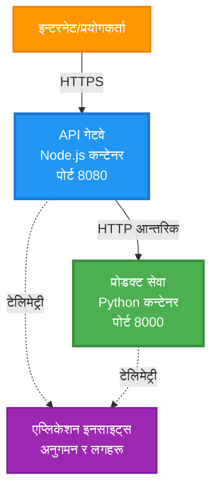
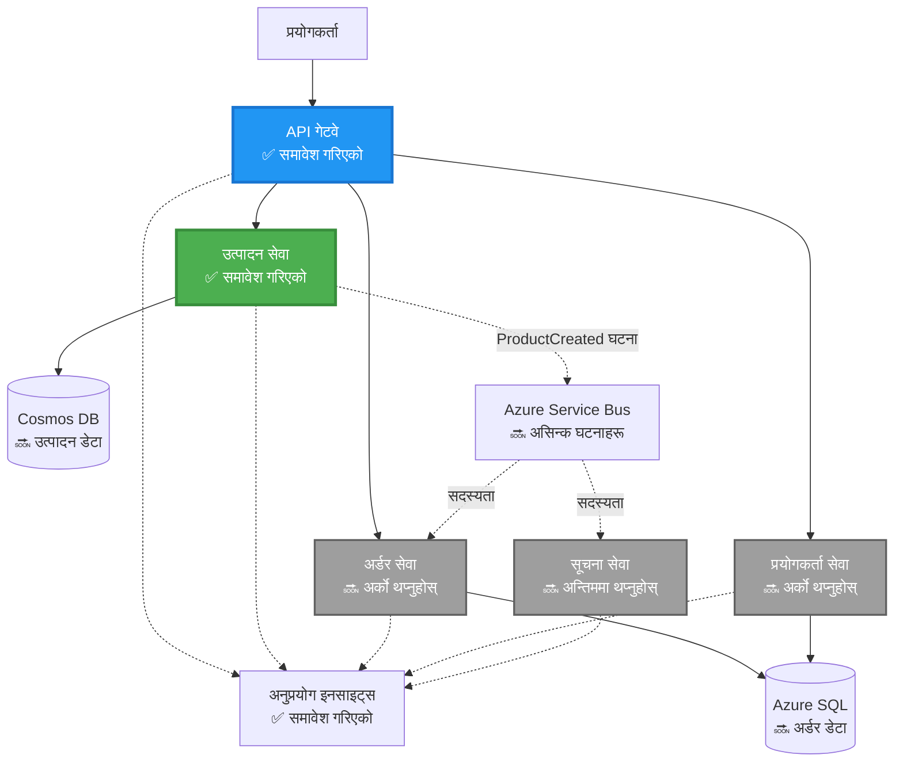
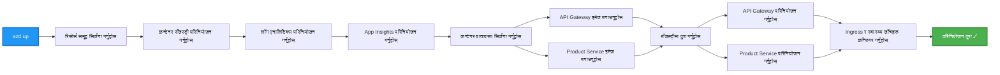
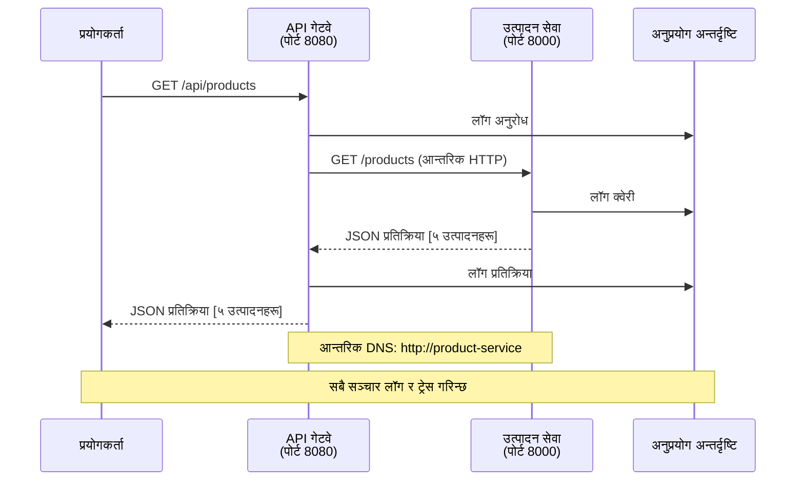

# माइक्रोप्रो सेवाहरू आर्किटेक्चर - Container App उदाहरण

⏱️ **अनुमानित समय**: 25-35 मिनेट | 💰 **अनुमानित लागत**: ~$50-100/महिना | ⭐ **जटिलता**: उन्नत

**📚 सिकाइ मार्ग:**
- ← अघिल्लो: [Simple Flask API](../../../../examples/container-app/simple-flask-api) - एकल कन्टेनर आधारभूत कुरा
- 🎯 **तपाईं यहाँ हुनुहुन्छ**: माइक्रोसर्भिस आर्किटेक्चर (2-सेवा आधार)
- → अर्को: [AI Integration](../../../../docs/ai-foundry) - तपाईंका सेवाहरूमा बुद्धिमत्ता थप्नुहोस्
- 🏠 [Course Home](../../README.md)

---

एक **सरलीकृत तर कार्यशील** माइक्रोसर्भिस आर्किटेक्चर जुन AZD CLI प्रयोग गरेर Azure Container Apps मा डिप्लोय गरिएको छ। यस उदाहरणले सेवा-देखि-सेवा संचार, कन्टेनर अॉर्केस्ट्रेसन, र अनुगमनलाई व्यावहारिक 2-सेवा सेटअपसहित देखाउँछ।

> **📚 सिकाइ दृष्टिकोण**: यो उदाहरणले न्यूनतम 2-सेवा आर्किटेक्चर (API Gateway + Backend Service) बाट सुरू गर्छ जुन तपाईंले वास्तवमा डिप्लोय गरेर सिक्न सक्नुहुन्छ। यो आधारशिला आर्जन गरेपछि, हामी पूर्ण माइक्रोसर्भिस पारिस्थितिकीमा विस्तार गर्ने मार्गदर्शन प्रदान गर्छौं।

## तपाईंले के सिक्नुहुनेछ

यस उदाहरणलाई पूरा गरेर, तपाईंले:
- Azure Container Apps मा बहु कन्टेनरहरू डिप्लोय गर्न सिक्नुहुनेछ
- आन्तरिक नेटवर्किङको साथ सेवा-देखि-सेवा संचार कार्यान्वयन गर्नुहुनेछ
- वातावरण-आधारित स्केलिङ र स्वास्थ्य जाँचहरू कन्फिगर गर्नुहुनेछ
- Application Insights मार्फत वितरण गरिएको अनुप्रयोगहरू अनुगमन गर्नुहुनेछ
- माइक्रोसर्भिस डिप्लोयमेन्ट ढाँचाहरू र उत्तम अभ्यासहरू बुझ्नुहुनेछ
- सरलबाट जटिल आर्किटेक्चरतर्फ प्रगतिशिल विस्तार कसरी गर्ने सिक्नुहुनेछ

## आर्किटेक्चर

### चरण 1: हामी के निर्माण गर्दैछौं (यस उदाहरणमा समावешित)


```mermaid
graph TB
    Internet[इन्टरनेट/प्रयोगकर्ता]
    Gateway[API गेटवे<br/>Node.js कन्टेनर<br/>पोर्ट 8080]
    Product[प्रोडक्ट सेवा<br/>Python कन्टेनर<br/>पोर्ट 8000]
    AppInsights[एप्लिकेशन इनसाइट्स<br/>अनुगमन र लगहरू]
    
    Internet -->|HTTPS| Gateway
    Gateway -->|HTTP आन्तरिक| Product
    Gateway -.->|टेलिमेट्री| AppInsights
    Product -.->|टेलिमेट्री| AppInsights
    
    style Gateway fill:#2196F3,stroke:#1976D2,stroke-width:3px,color:#fff
    style Product fill:#4CAF50,stroke:#388E3C,stroke-width:3px,color:#fff
    style Internet fill:#FF9800,stroke:#F57C00,stroke-width:2px,color:#fff
    style AppInsights fill:#9C27B0,stroke:#7B1FA2,stroke-width:2px,color:#fff
```
**कम्पोनेन्ट विवरण:**

| Component | Purpose | Access | Resources |
|-----------|---------|--------|-----------|
| **API Gateway** | Backend सेवाहरूमा बाह्य अनुरोधहरू मार्गनिर्देशन गर्छ | Public (HTTPS) | 1 vCPU, 2GB RAM, 2-20 replicas |
| **Product Service** | इन-मेमोरी डाटासहित उत्पादन क्याटलग व्यवस्थापन गर्छ | Internal only | 0.5 vCPU, 1GB RAM, 1-10 replicas |
| **Application Insights** | केन्द्रीयकृत लगिङ र वितरण गरिएको ट्रेसिङ | Azure Portal | 1-2 GB/month data ingestion |

**किन सरलबाट सुरु गर्ने?**
- ✅ छिटो डिप्लोय र बुझ्न सजिलो (25-35 मिनेट)
- ✅ जटिलता बिना प्रमुख माइक्रोसर्भिस ढाँचाहरू सिक्नुहोस्
- ✅ काम गर्ने कोड जसलाई तपाईं परिमार्जन र प्रयोग गर्न सक्नुहुनेछ
- ✅ सिकाइका लागि कम लागत (~$50-100/महिना vs $300-1400/महिना)
- ✅ डाटाबेस र मेसेज क्वियूहरू थप्नुअघि आत्मविश्वास निर्माण गर्नुहोस्

**उपमा**: यसलाई गाडी चलाउन सिक्ने जस्तो सोच्नुहोस्। तपाईं खाली पार्किङ स्थल (2 सेवाहरू) बाट सुरु गर्नुहुन्छ, आधारभूत कुरा मास्टर गर्नुहुन्छ, र त्यसपछि सहरको ट्राफिक (5+ सेवा र डाटाबेसहरूसँग) मा उन्नति गर्नुहुन्छ।

### चरण 2: भविष्यमा विस्तार (रेफरेन्स आर्किटेक्चर)

एक पटक तपाईंले 2-सेवा आर्किटेक्चरमा दक्षता हासिल गरेपछि, तपाईं विस्तार गर्न सक्नुहुन्छ:


```mermaid
graph TB
    User[प्रयोगकर्ता]
    Gateway[API गेटवे<br/>✅ समावेश गरिएको]
    Product[उत्पादन सेवा<br/>✅ समावेश गरिएको]
    Order[अर्डर सेवा<br/>🔜 अर्को थप्नुहोस्]
    UserSvc[प्रयोगकर्ता सेवा<br/>🔜 अर्को थप्नुहोस्]
    Notify[सूचना सेवा<br/>🔜 अन्तिममा थप्नुहोस्]
    
    CosmosDB[(Cosmos DB<br/>🔜 उत्पादन डेटा)]
    AzureSQL[(Azure SQL<br/>🔜 अर्डर डेटा)]
    ServiceBus[Azure Service Bus<br/>🔜 असिन्क घटनाहरू]
    AppInsights[अनुप्रयोग इनसाइट्स<br/>✅ समावेश गरिएको]
    
    User --> Gateway
    Gateway --> Product
    Gateway --> Order
    Gateway --> UserSvc
    
    Product --> CosmosDB
    Order --> AzureSQL
    UserSvc --> AzureSQL
    
    Product -.->|ProductCreated घटना| ServiceBus
    ServiceBus -.->|सदस्यता| Notify
    ServiceBus -.->|सदस्यता| Order
    
    Gateway -.-> AppInsights
    Product -.-> AppInsights
    Order -.-> AppInsights
    UserSvc -.-> AppInsights
    Notify -.-> AppInsights
    
    style Product fill:#4CAF50,stroke:#388E3C,stroke-width:3px,color:#fff
    style Gateway fill:#2196F3,stroke:#1976D2,stroke-width:3px,color:#fff
    style Order fill:#9E9E9E,stroke:#616161,stroke-width:2px,color:#fff
    style UserSvc fill:#9E9E9E,stroke:#616161,stroke-width:2px,color:#fff
    style Notify fill:#9E9E9E,stroke:#616161,stroke-width:2px,color:#fff
```
अन्त्यमा "Expansion Guide" अनुभागमा चरण-दर-चरण निर्देशनहरू हेर्नुहोस्।

## समावेश गरिएका सुविधाहरू

✅ **Service Discovery**: कन्टेनरहरूबीच स्वत: DNS-आधारित डिस्कभरी  
✅ **Load Balancing**: रेप्लिकाहरूभरि निर्मित लोड ब्यालेन्सिङ  
✅ **Auto-scaling**: HTTP अनुरोधहरूमा आधारित सेवा प्रतिको स्वतन्त्र स्केलिङ  
✅ **Health Monitoring**: दुबै सेवाको लागि लिवनेस र रिडिनेस probes  
✅ **Distributed Logging**: Application Insights सँग केन्द्रीयकृत लगिङ  
✅ **Internal Networking**: सुरक्षित सेवा-देखि-सेवा संचार  
✅ **Container Orchestration**: स्वत: डिप्लोयमेन्ट र स्केलिङ  
✅ **Zero-Downtime Updates**: रिभिजन व्यवस्थापनसहित रोलिङ अपडेटहरू  

## पूर्व-आवश्यकताहरू

### आवश्यक उपकरणहरू

सुरु गर्नु अघिल्ला, यी उपकरणहरू इन्स्टल गरिएको छ कि छैन जाँच्नुहोस्:

1. **[Azure Developer CLI (azd)](https://learn.microsoft.com/azure/developer/azure-developer-cli/install-azd)** (version 1.0.0 वा माथि)
   ```bash
   azd version
   # अपेक्षित नतिजा: azd संस्करण 1.0.0 वा उच्च
   ```

2. **[Azure CLI](https://learn.microsoft.com/cli/azure/install-azure-cli)** (version 2.50.0 वा माथि)
   ```bash
   az --version
   # अपेक्षित आउटपुट: azure-cli 2.50.0 वा सोभन्दा नयाँ
   ```

3. **[Docker](https://www.docker.com/get-started)** (स्थानीय विकास/टेस्टिङको लागि - वैकल्पिक)
   ```bash
   docker --version
   # अपेक्षित आउटपुट: Docker संस्करण 20.10 वा माथि
   ```

### तपाइँको सेटअप पुष्टि गर्नुहोस्

तयार हुनु भएको पुष्टि गर्न यी कमाण्डहरू चलाउनुहोस्:

```bash
# Azure Developer CLI जाँच गर्नुहोस्
azd version
# ✅ अपेक्षित: azd संस्करण 1.0.0 वा माथि

# Azure CLI जाँच गर्नुहोस्
az --version
# ✅ अपेक्षित: azure-cli 2.50.0 वा माथि

# Docker (वैकल्पिक) जाँच गर्नुहोस्
docker --version
# ✅ अपेक्षित: Docker संस्करण 20.10 वा माथि
```

**सफलता मापदण्ड**: सबै कमाण्डहरूले मिनिमम संस्करण वा त्यो भन्दा माथिका भर्सन नम्बर फिर्ता गर्छन्।

### Azure आवश्यकताहरू

- सक्रिय **Azure सदस्यता** ([free account सिर्जना गर्नुहोस्](https://azure.microsoft.com/free/))
- तपाईंको सदस्यतामा स्रोतहरू सिर्जना गर्ने अनुमति
- सदस्यता वा रिसोर्स समूहमा **Contributor** भूमिका

### ज्ञानपूर्वापेक्षाहरू

यो **उन्नत-स्तर** उदाहरण हो। तपाईंले हुनु पर्छ:
- [Simple Flask API example](../../../../examples/container-app/simple-flask-api) पूरा गरिसकेको
- माइक्रोसर्भिस आर्किटेक्चरको आधारभूत बुझाइ
- REST APIs र HTTP को परिचितता
- कन्टेनर अवधारणाहरूको बुझाइ

**Container Apps मा नयाँ?** आधारभूत कुरा सिक्न पहिले [Simple Flask API example](../../../../examples/container-app/simple-flask-api) बाट सुरु गर्नुहोस्।

## क्विक स्टार्ट (चरण-द्वारा-चरण)

### चरण 1: क्लोन र नेभिगेट गर्नुहोस्

```bash
git clone https://github.com/microsoft/AZD-for-beginners.git
cd AZD-for-beginners/examples/microservices
```

**✓ सफलता जाँच**: `azure.yaml` देख्नुहुन्छ कि छैन पुष्टि गर्नुहोस्:
```bash
ls
# अपेक्षित: README.md, azure.yaml, infra/, src/
```

### चरण 2: Azure सँग प्रमाणिकरण गर्नुहोस्

```bash
azd auth login
```

यसले ब्राउजर खोल्छ Azure प्रमाणिकरणको लागि। आफ्नो Azure प्रमाणपत्र प्रयोग गरेर साइन इन गर्नुहोस्।

**✓ सफलता जाँच**: तपाईंले यी देख्नुपर्छ:
```
Logged in to Azure.
```

### चरण 3: वातावरण इनिसियलाइज गर्नुहोस्

```bash
azd init
```

**प्रम्प्टहरू जसलाई तपाईंले देख्नुहुनेछ**:
- **Environment name**: छोटो नाम प्रविष्ट गर्नुहोस् (जस्तै, `microservices-dev`)
- **Azure subscription**: आफ्नो सदस्यता छान्नुहोस्
- **Azure location**: एउटा क्षेत्र छान्नुहोस् (जस्तै, `eastus`, `westeurope`)

**✓ सफलता जाँच**: तपाईंले यी देख्नुपर्छ:
```
SUCCESS: New project initialized!
```

### चरण 4: पूर्वाधार र सेवाहरू डिप्लोय गर्नुहोस्

```bash
azd up
```

**के हुन्छ** (लाग्ने समय 8-12 मिनेट):


```mermaid
graph LR
    A[azd up] --> B[रिसोर्स समूह सिर्जना गर्नुहोस्]
    B --> C[कन्टेनर रजिस्ट्री परिनियोजन गर्नुहोस्]
    C --> D[लॉग एनालिटिक्स परिनियोजन गर्नुहोस्]
    D --> E[App Insights परिनियोजन गर्नुहोस्]
    E --> F[कन्टेनर वातावरण सिर्जना गर्नुहोस्]
    F --> G[API Gateway इमेज बनाउनुहोस्]
    F --> H[Product Service इमेज बनाउनुहोस्]
    G --> I[रजिस्ट्रीमा पुश गर्नुहोस्]
    H --> I
    I --> J[API Gateway परिनियोजन गर्नुहोस्]
    I --> K[Product Service परिनियोजन गर्नुहोस्]
    J --> L[Ingress र स्वास्थ्य जाँचहरू कन्फिगर गर्नुहोस्]
    K --> L
    L --> M[परिनियोजन पूरा ✓]
    
    style A fill:#2196F3,stroke:#1976D2,stroke-width:3px,color:#fff
    style M fill:#4CAF50,stroke:#388E3C,stroke-width:3px,color:#fff
```
**✓ सफलता जाँच**: तपाईंले यी देख्नुपर्छ:
```
SUCCESS: Your application was deployed to Azure in X minutes Y seconds.
Endpoint: https://api-gateway-<unique-id>.azurecontainerapps.io
```

**⏱️ समय**: 8-12 मिनेट

### चरण 5: डिप्लोयमेन्ट परीक्षण गर्नुहोस्

```bash
# गेटवे अन्तबिन्दु प्राप्त गर्नुहोस्
GATEWAY_URL=$(azd env get-values | grep API_GATEWAY_URL | cut -d '=' -f2 | tr -d '"')

# API Gateway को स्वास्थ्य जाँच गर्नुहोस्
curl $GATEWAY_URL/health
```

**✅ अपेक्षित आउटपुट:**
```json
{
  "status": "healthy",
  "service": "api-gateway",
  "timestamp": "2025-11-19T10:30:00Z"
}
```

**गेटवे मार्फत प्रोडक्ट सेवा परीक्षण गर्नुहोस्**:
```bash
# उत्पादनहरूको सूची
curl $GATEWAY_URL/api/products
```

**✅ अपेक्षित आउटपुट:**
```json
[
  {"id":1,"name":"Laptop","price":999.99,"stock":50},
  {"id":2,"name":"Mouse","price":29.99,"stock":200},
  {"id":3,"name":"Keyboard","price":79.99,"stock":150}
]
```

**✓ सफलता जाँच**: दुबै एन्डपोइन्टले JSON डेटा त्रुटिबिनै फर्काउनु पर्छ।

---

**🎉 बधाई छ!** तपाईंले Azure मा माइक्रोप्रो सेवाहरू आर्किटेक्चर डिप्लोय गर्नुभयो!

## परियोजना संरचना

सबै कार्यान्वयन फाइलहरू समावेश छन्—यो एक पूरा, कार्यशील उदाहरण हो:

```
microservices/
│
├── README.md                         # This file
├── azure.yaml                        # AZD configuration
├── .gitignore                        # Git ignore patterns
│
├── infra/                           # Infrastructure as Code (Bicep)
│   ├── main.bicep                   # Main orchestration
│   ├── abbreviations.json           # Naming conventions
│   ├── core/                        # Shared infrastructure
│   │   ├── container-apps-environment.bicep  # Container environment + registry
│   │   └── monitor.bicep            # Application Insights + Log Analytics
│   └── app/                         # Service definitions
│       ├── api-gateway.bicep        # API Gateway container app
│       └── product-service.bicep    # Product Service container app
│
└── src/                             # Application source code
    ├── api-gateway/                 # Node.js API Gateway
    │   ├── app.js                   # Express server with routing
    │   ├── package.json             # Node dependencies
    │   └── Dockerfile               # Container definition
    └── product-service/             # Python Product Service
        ├── main.py                  # Flask API with product data
        ├── requirements.txt         # Python dependencies
        └── Dockerfile               # Container definition
```

**प्रत्येक कम्पोनेन्टले के गर्छ:**

**Infrastructure (infra/)**:
- `main.bicep`: सबै Azure स्रोतहरू र तिनीहरूको निर्भरतालाई समन्वय गर्छ
- `core/container-apps-environment.bicep`: Container Apps वातावरण र Azure Container Registry सिर्जना गर्छ
- `core/monitor.bicep`: वितरण गरिएको लगिङका लागि Application Insights सेटअप गर्छ
- `app/*.bicep`: स्केलिङ र स्वास्थ्य जाँचहरूसहित व्यक्तिगत कन्टेनर एप परिभाषाहरू

**API Gateway (src/api-gateway/)**:
- सार्वजनिक-मुखी सेवा जसले अनुरोधहरू ब्याकएन्ड सेवाहरूमा राउट गर्छ
- लगिङ, एरर ह्यान्डलिङ, र अनुरोध फर्वार्डिङ कार्यान्वयन गर्छ
- सेवा-देखि-सेवा HTTP संचार प्रदर्शन गर्दछ

**Product Service (src/product-service/)**:
- इन-मेमोरीको साथ उत्पादन क्याटलग भएका आन्तरिक सेवा
- REST API र स्वास्थ्य जाँचहरू
- ब्याकएन्ड माइक्रोसर्भिस ढाँचाको उदाहरण

## सेवाहरूको अवलोकन

### API Gateway (Node.js/Express)

**Port**: 8080  
**Access**: Public (external ingress)  
**उद्देश्य**: आउने अनुरोधहरूलाई उपयुक्त ब्याकएन्ड सेवाहरूमा राउट गर्नु

**Endpoints**:
- `GET /` - सेवा जानकारी
- `GET /health` - स्वास्थ्य जाँच एन्डपोइन्ट
- `GET /api/products` - product service तर्फ फर्वार्ड (सबै सूची)
- `GET /api/products/:id` - product service तर्फ फर्वार्ड (ID द्वारा प्राप्त)

**मुख्य सुविधाहरू**:
- axios सँग अनुरोध राउटिङ
- केन्द्रीयकृत लगिङ
- त्रुटि ह्यान्डलिङ र टाइमआउट व्यवस्थापन
- वातावरण चर मार्फत सेवा डिस्कभरी
- Application Insights एकीकरण

**कोड हाइलाइट** (`src/api-gateway/app.js`):
```javascript
// आन्तरिक सेवा संचार
app.get('/api/products', async (req, res) => {
  const response = await axios.get(`${PRODUCT_SERVICE_URL}/products`, {
    timeout: 5000
  });
  res.json(response.data);
});
```

### Product Service (Python/Flask)

**Port**: 8000  
**Access**: Internal only (no external ingress)  
**उद्देश्य**: इन-मेमोरी डाटासहित उत्पादन क्याटलग व्यवस्थापन गर्नु

**Endpoints**:
- `GET /` - सेवा जानकारी
- `GET /health` - स्वास्थ्य जाँच एन्डपोइन्ट
- `GET /products` - सबै उत्पादनहरू सूचीकरण
- `GET /products/<id>` - ID द्वारा उत्पादन प्राप्त

**मुख्य सुविधाहरू**:
- Flask सँग RESTful API
- इन-मेमोरी उत्पादन स्टोर (साधारण, डाटाबेस आवश्यक छैन)
- प्रोबहरूसँग स्वास्थ्य अनुगमन
- संरचित लगिङ
- Application Insights एकीकरण

**डेटा मोडेल**:
```python
{
  "id": 1,
  "name": "Laptop",
  "description": "High-performance laptop",
  "price": 999.99,
  "stock": 50
}
```

**किन मात्र आन्तरिक?**
प्रोडक्ट सेवा सार्वजनिक रूपमा एक्स्पोज गरिएको छैन। सबै अनुरोधहरू API Gateway मार्फत जानुपर्दछ, जसले प्रदान गर्छ:
- सुरक्षा: नियन्त्रण गरिएको पहुँच बिन्दु
- लचिलोपन: ब्याकएन्ड परिवर्तन गर्दा क्लाइन्टहरू प्रभावित हुँदैनन्
- अनुगमन: केन्द्रीयकृत अनुरोध लगिङ

## सेवा संवाद बुझ्न

### सेवाहरू एकअर्कासँग कसरी कुराकानी गर्छन्


```mermaid
sequenceDiagram
    participant User as प्रयोगकर्ता
    participant Gateway as API गेटवे<br/>(पोर्ट 8080)
    participant Product as उत्पादन सेवा<br/>(पोर्ट 8000)
    participant AI as अनुप्रयोग अन्तर्दृष्टि
    
    User->>Gateway: GET /api/products
    Gateway->>AI: लॉग अनुरोध
    Gateway->>Product: GET /products (आन्तरिक HTTP)
    Product->>AI: लॉग क्वेरी
    Product-->>Gateway: JSON प्रतिक्रिया [५ उत्पादनहरू]
    Gateway->>AI: लॉग प्रतिक्रिया
    Gateway-->>User: JSON प्रतिक्रिया [५ उत्पादनहरू]
    
    Note over Gateway,Product: आन्तरिक DNS: http://product-service
    Note over User,AI: सबै सञ्चार लॉग र ट्रेस गरिन्छ
```
यस उदाहरणमा, API Gateway ले Product Service सँग **आन्तरिक HTTP कल** प्रयोग गरेर सञ्चार गर्छ:

```javascript
// API गेटवे (src/api-gateway/app.js)
const PRODUCT_SERVICE_URL = process.env.PRODUCT_SERVICE_URL;

// आन्तरिक HTTP अनुरोध गर्नुहोस्
const response = await axios.get(`${PRODUCT_SERVICE_URL}/products`);
```

**मुख्य बुँदाहरू**:

1. **DNS-आधारित डिस्कभरी**: Container Apps ले स्वत: आन्तरिक सेवाहरूका लागि DNS उपलब्ध गराउँछ
   - Product Service FQDN: `product-service.internal.<environment>.azurecontainerapps.io`
   - सरल रूपमा: `http://product-service` (Container Apps ले यसलाई रिजोल्भ गर्छ)

2. **कुनै सार्वजनिक एक्स्पोजर छैन**: Product Service मा Bicep मा `external: false` छ
   - केवल Container Apps वातावरण भित्र पहुँचयोग्य
   - इन्टरनेटबाट पुग्न सकिंदैन

3. **पर्यावरण चरहरू**: सेवा URL हरू डिप्लोयमेन्ट समयमा इन्जेक्ट गरिन्छ
   - Bicep ले आन्तरिक FQDN लाई गेटवेसँग पास गर्छ
   - एप्लिकेसन कोडमा हार्डकोड गरिएको URL हुँदैन

**उपमा**: यसलाई अफिसका कोठाजस्तै सोच्नुहोस्। API Gateway रिसेप्सन डेस्क (सार्वजनिक-मुखी) हुन सक्छ, र Product Service अफिस कोठा (आन्तरिक मात्र) हो। आगन्तुकहरूले कुनै पनि अफिस पुग्न रिसेप्सन मार्फत जानुपर्छ।

## डिप्लोयमेन्ट विकल्पहरू

### पूर्ण डिप्लोयमेन्ट (सिफारिस गरिएको)

```bash
# पूर्वाधार र दुवै सेवाहरू तैनाथ गर्नुहोस्
azd up
```

यसले डिप्लोय गर्छ:
1. Container Apps वातावरण
2. Application Insights
3. Container Registry
4. API Gateway कन्टेनर
5. Product Service कन्टेनर

**समय**: 8-12 मिनेट

### व्यक्तिगत सेवा मात्र डिप्लोय गर्नुहोस्

```bash
# केवल एउटै सेवा डिप्लोय गर्नुहोस् (प्रारम्भिक azd up पछि)
azd deploy api-gateway

# वा प्रोडक्ट सेवा डिप्लोय गर्नुहोस्
azd deploy product-service
```

**उपयोग केस**: जब तपाईंले एक सेवा मा कोड अपडेट गर्नुभएको छ र केवल त्यो सेवा मात्र फेरि डिप्लोय गर्न चाहनुहुन्छ।

### कन्फिगरेसन अपडेट गर्नुहोस्

```bash
# स्केलिङ प्यारामिटरहरू परिवर्तन गर्नुहोस्
azd env set GATEWAY_MAX_REPLICAS 30

# नयाँ कन्फिगरेसनसँग पुनः परिनियोजन गर्नुहोस्
azd up
```

## कन्फिगरेसन

### स्केलिङ कन्फिगरेसन

दुबै सेवाहरू HTTP-आधारित ऑटोस्केलिङसहित तिनीहरूको Bicep फाइलहरूमा कन्फिगर गरिएको छ:

**API Gateway**:
- Min replicas: 2 (उपलब्धताका लागि सधैं कम्तीमा 2)
- Max replicas: 20
- Scale trigger: प्रति रेप्लिकामा 50 सँगै चलिरहेका अनुरोधहरू

**Product Service**:
- Min replicas: 1 (आवश्यक भएमा शून्यसम्म स्केल गर्न सक्छ)
- Max replicas: 10
- Scale trigger: प्रति रेप्लिकामा 100 सँगै चलिरहेका अनुरोधहरू

**स्केलिङ अनुकूलन गर्नुहोस्** (in `infra/app/*.bicep`):
```bicep
scale: {
  minReplicas: 1
  maxReplicas: 10
  rules: [
    {
      name: 'http-scale-rule'
      http: {
        metadata: {
          concurrentRequests: '100'  // Adjust this
        }
      }
    }
  ]
}
```

### स्रोत विनियोजन

**API Gateway**:
- CPU: 1.0 vCPU
- Memory: 2 GiB
- कारण: सबै बाह्य ट्राफिक ह्यान्डल गर्छ

**Product Service**:
- CPU: 0.5 vCPU
- Memory: 1 GiB
- कारण: हल्का इन-मेमोरी अपरेसन

### स्वास्थ्य जाँचहरू

दुबै सेवाहरूमा लिवनेस र रिडिनेस प्रोबहरू समावेश छन्:

```bicep
probes: [
  {
    type: 'Liveness'
    httpGet: {
      path: '/health'
      port: 8080
    }
    initialDelaySeconds: 10
    periodSeconds: 30
  }
  {
    type: 'Readiness'
    httpGet: {
      path: '/health'
      port: 8080
    }
    initialDelaySeconds: 5
    periodSeconds: 10
  }
]
```

**यसको अर्थ के हो**:
- **Liveness**: यदि स्वास्थ्य जाँच असफल भयो भने, Container Apps ले कन्टेनर पुनः सुरु गर्छ
- **Readiness**: यदि तयार छैन भने, Container Apps ले त्यो रेप्लिकामा ट्राफिक राउट गर्न बन्द गर्छ

## अनुगमन र अवलोकनशीलता

### सेवा लगहरू हेर्नुहोस्

```bash
# azd monitor प्रयोग गरेर लगहरू हेर्नुहोस्
azd monitor --logs

# वा विशेष Container Apps का लागि Azure CLI प्रयोग गर्नुहोस्:
# API Gateway बाट लगहरू स्ट्रिम गर्नुहोस्
az containerapp logs show --name api-gateway --resource-group $RG_NAME --follow

# उत्पादन सेवाका हालैका लगहरू हेर्नुहोस्
az containerapp logs show --name product-service --resource-group $RG_NAME --tail 100
```

**अपेक्षित आउटपुट**:
```
[api-gateway] API Gateway listening on port 8080
[api-gateway] Product Service URL: http://product-service
[api-gateway] GET /api/products 200 - 45ms
[product-service] Retrieved 5 products
```

### Application Insights क्वेरीहरू

Azure Portal मा Application Insights पहुँच गर्नुहोस्, त्यसपछि यी क्वेरीहरू चलाउनुहोस्:

**ढिलाइ भएका अनुरोधहरू खोज्नुहोस्**:
```kusto
requests
| where timestamp > ago(1h)
| where duration > 1000  // Requests taking >1 second
| summarize count() by name, cloud_RoleName
| order by count_ desc
```

**सेवा-देखि-सेवा कलहरू ट्र्याक गर्नुहोस्**:
```kusto
dependencies
| where timestamp > ago(1h)
| where type == "Http"
| project timestamp, name, target, duration, success
| order by timestamp desc
```

**सेवालाई आधार गरी त्रुटि दर**:
```kusto
exceptions
| where timestamp > ago(24h)
| summarize errorCount = count() by cloud_RoleName, type
| order by errorCount desc
```

**समय अनुसार अनुरोध मात्रा**:
```kusto
requests
| where timestamp > ago(1h)
| summarize requestCount = count() by bin(timestamp, 5m), cloud_RoleName
| render timechart
```

### अनुगमन ड्यासबोर्ड पहुँच

```bash
# Application Insights विवरणहरू प्राप्त गर्नुहोस्
azd env get-values | grep APPLICATIONINSIGHTS

# Azure पोर्टलको निगरानी खोल्नुहोस्
az monitor app-insights component show \
  --app $(azd env get-values | grep APPLICATIONINSIGHTS_CONNECTION_STRING | cut -d '=' -f2) \
  --resource-group $(azd env get-values | grep AZURE_RESOURCE_GROUP | cut -d '=' -f2) \
  --query "appId" -o tsv
```

### लाइभ मेट्रिक्स

1. Azure Portal मा Application Insights नेभिगेट गर्नुहोस्
2. "Live Metrics" क्लिक गर्नुहोस्
3. रियल-टाइम अनुरोधहरू, असफलताहरू, र प्रदर्शन हेर्नुहोस्
4. परीक्षणका लागि चलाउनुहोस्: `curl $(azd env get-values | grep API_GATEWAY_URL | cut -d '=' -f2 | tr -d '"')/api/products`

## व्यवहारिक अभ्यासहरू

### अभ्यास 1: नयाँ प्रोडक्ट एन्डपोइन्ट थप्नुहोस् ⭐ (सजिलो)

**लक्ष्य**: नयाँ उत्पादनहरू सिर्जना गर्न POST एन्डपोइन्ट थप्नुहोस्

**सुरुवाती बिन्दु**: `src/product-service/main.py`

**चरणहरू**:

1. यो एन्डपोइन्ट `get_product` फङ्क्सनको पछाडि `main.py` मा थप्नुहोस्:

```python
@app.route('/products', methods=['POST'])
def create_product():
    """Create a new product"""
    data = request.get_json()
    
    # आवश्यक क्षेत्रहरू मान्य गर्नुहोस्
    if not data or 'name' not in data or 'price' not in data:
        return jsonify({'error': 'Missing required fields: name, price'}), 400
    
    new_id = max(p['id'] for p in products) + 1
    new_product = {
        'id': new_id,
        'name': data['name'],
        'description': data.get('description', ''),
        'price': float(data['price']),
        'stock': int(data.get('stock', 0))
    }
    products.append(new_product)
    logger.info(f"Created product {new_id}")
    return jsonify(new_product), 201
```

2. API Gateway मा POST रूट थप्नुहोस् (`src/api-gateway/app.js`):

```javascript
// GET /api/products राउटको पछि यो थप्नुहोस्
app.post('/api/products', async (req, res) => {
  try {
    console.log(`Forwarding POST request to ${PRODUCT_SERVICE_URL}/products`);
    const response = await axios.post(`${PRODUCT_SERVICE_URL}/products`, req.body, {
      timeout: 5000
    });
    res.status(201).json(response.data);
  } catch (error) {
    console.error('Error calling product service:', error.message);
    res.status(503).json({
      error: 'Product service unavailable',
      message: error.message
    });
  }
});
```

3. दुबै सेवाहरू पुनःडिप्लोय गर्नुहोस्:

```bash
azd deploy product-service
azd deploy api-gateway
```

4. नयाँ एन्डपॉइन्ट परीक्षण गर्नुहोस्:

```bash
GATEWAY_URL=$(azd env get-values | grep API_GATEWAY_URL | cut -d '=' -f2 | tr -d '"')

# नयाँ उत्पादन सिर्जना गर्नुहोस्
curl -X POST $GATEWAY_URL/api/products \
  -H "Content-Type: application/json" \
  -d '{"name":"USB Cable","price":9.99,"stock":500}'
```

**✅ अपेक्षित आउटपुट:**
```json
{"id":6,"name":"USB Cable","description":"","price":9.99,"stock":500}
```

5. सूचीमा देखिन्छ कि छैन भनी जाँच गर्नुहोस्:

```bash
curl $GATEWAY_URL/api/products
# अब नयाँ USB केबल सहित 6 वटा उत्पादनहरू देखाउनुपर्छ
```

**सफलता मापदण्ड**:
- ✅ POST अनुरोधले HTTP 201 फर्काउँछ
- ✅ GET /api/products सूचीमा नयाँ उत्पादन देखा पर्दछ
- ✅ उत्पादनसँग अटो-इनक्रिमेन्ट ID छ

**समय**: 10-15 मिनेट

---

### Exercise 2: Modify Autoscaling Rules ⭐⭐ (Medium)

**उद्देश्य**: Product Service लाई बढी आक्रामक रूपमा स्केल गर्ने गरी परिवर्तन गर्नुहोस्

**शुरुवात बिन्दु**: `infra/app/product-service.bicep`

**कदमहरू**:

1. `infra/app/product-service.bicep` खोल्नुहोस् र `scale` ब्लक खोज्नुहोस् (लगभग लाइन 95 मा)

2. बाट परिवर्तन गर्नुहोस्:
```bicep
scale: {
  minReplicas: 1
  maxReplicas: 10
  rules: [
    {
      name: 'http-scale-rule'
      http: {
        metadata: {
          concurrentRequests: '100'  // OLD
        }
      }
    }
  ]
}
```

मा:
```bicep
scale: {
  minReplicas: 2  // Always have 2 running
  maxReplicas: 20  // Allow more scaling
  rules: [
    {
      name: 'http-scale-rule'
      http: {
        metadata: {
          concurrentRequests: '20'  // Scale at lower threshold
        }
      }
    }
  ]
}
```

3. infrastrukture पुनःडिप्लोय गर्नुहोस्:

```bash
azd up
```

4. नयाँ स्केलिङ कन्फिगरेसन जाँच गर्नुहोस्:

```bash
az containerapp show \
  --name $(azd env get-values | grep PRODUCT_SERVICE | head -1 | cut -d '/' -f5) \
  --resource-group $(azd env get-values | grep AZURE_RESOURCE_GROUP | cut -d '=' -f2 | tr -d '"') \
  --query "properties.template.scale" -o json
```

**✅ अपेक्षित आउटपुट:**
```json
{
  "minReplicas": 2,
  "maxReplicas": 20,
  "rules": [...]
}
```

5. लोडका साथ ऑटोस्केलिङ परीक्षण गर्नुहोस्:

```bash
# समवर्ती अनुरोधहरू सिर्जना गर्नुहोस्
for i in {1..500}; do curl $GATEWAY_URL/api/products & done

# Azure CLI प्रयोग गरेर स्केलिङ हेर्नुहोस्
az containerapp logs show --name product-service --resource-group $RG_NAME --follow
# खोज्नुहोस्: Container Apps स्केलिङ घटनाहरू
```

**सफलता मापदण्ड**:
- ✅ Product Service सधैं कम्तीमा 2 रेप्लिका चलाउँछ
- ✅ लोडमा 2 भन्दा बढी रेप्लिकासम्म स्केल हुन्छ
- ✅ Azure पोर्टलले नयाँ स्केलिङ नियमहरू देखाउँछ

**समय**: 15-20 मिनेट

---

### Exercise 3: Add Custom Monitoring Query ⭐⭐ (Medium)

**उद्देश्य**: Product API को प्रदर्शन ट्र्याक गर्न कस्टम Application Insights क्वेरी सिर्जना गर्नुहोस्

**कदमहरू**:

1. Azure पोर्टलमा Application Insights मा जानुहोस्:
   - Azure Portal मा जानुहोस्
   - आफ्नो resource group (rg-microservices-*) खोज्नुहोस्
   - Application Insights रिसोर्समा क्लिक गर्नुहोस्

2. बाँया मेनुमा "Logs" मा क्लिक गर्नुहोस्

3. यो क्वेरी सिर्जना गर्नुहोस्:

```kusto
requests
| where timestamp > ago(1h)
| where name contains "products"
| summarize 
    RequestCount = count(),
    AvgDuration = avg(duration),
    P95Duration = percentile(duration, 95),
    SuccessRate = 100.0 * countif(success == true) / count()
  by bin(timestamp, 5m)
| render timechart
```

4. क्वेरी चलाउन "Run" मा क्लिक गर्नुहोस्

5. क्वेरी सुरक्षित गर्नुहोस्:
   - "Save" मा क्लिक गर्नुहोस्
   - नाम: "Product API Performance"
   - वर्ग: "Performance"

6. परीक्षण ट्राफिक उत्पन्न गर्नुहोस्:

```bash
for i in {1..100}; do curl $GATEWAY_URL/api/products; sleep 1; done
```

7. डेटा हेर्न क्वेरी रिफ्रेश गर्नुहोस्

**✅ अपेक्षित आउटपुट:**
- समय अनुसार अनुरोध गणना देखाउने चार्ट
- औसत अवधि < 500ms
- सफलता दर = 100%
- 5 मिनेटका टाइम बिनहरू

**सफलता मापदण्ड**:
- ✅ क्वेरीले 100+ अनुरोधहरू देखाउँछ
- ✅ सफलता दर 100% छ
- ✅ औसत अवधि < 500ms
- ✅ चार्टले 5-分钟 टाइम बिनहरू प्रदर्शन गर्छ

**शिक्षण नतीजा**: कस्टम क्वेरीहरूसँग सेवा प्रदर्शन कसरी अनुगमन गर्ने बुझ्ने

**समय**: 10-15 मिनेट

---

### Exercise 4: Implement Retry Logic ⭐⭐⭐ (Advanced)

**उद्देश्य**: Product Service अस्थायी रूपमा अनुपलब्ध हुँदा API Gateway मा retry लॉजिक थप्नुहोस्

**शुरुवात बिन्दु**: `src/api-gateway/app.js`

**कदमहरू**:

1. retry लाइब्रेरी इन्स्टल गर्नुहोस्:

```bash
cd src/api-gateway
npm install axios-retry --save
cd ../..
```

2. `src/api-gateway/app.js` अपडेट गर्नुहोस् (axios आयातपछि थप्नुहोस्):

```javascript
const axiosRetry = require('axios-retry');

// पुनः प्रयासको तर्क कन्फिगर गर्नुहोस्
axiosRetry(axios, {
  retries: 3,
  retryDelay: (retryCount) => {
    return retryCount * 1000; // 1 सेकेन्ड, 2 सेकेन्ड, 3 सेकेन्ड
  },
  retryCondition: (error) => {
    // नेटवर्क त्रुटिहरू वा 5xx प्रतिक्रियाहरूमा पुनः प्रयास गर्नुहोस्
    return axiosRetry.isNetworkOrIdempotentRequestError(error) ||
           (error.response && error.response.status >= 500);
  }
});

console.log('Retry logic configured: 3 retries with exponential backoff');
```

3. API Gateway पुनःडिप्लोय गर्नुहोस्:

```bash
azd deploy api-gateway
```

4. सेवा असफलता सिमुलेट गरेर retry व्यवहार परीक्षण गर्नुहोस्:

```bash
# उत्पादन सेवा 0 मा स्केल गर्नुहोस् (असफलता अनुकरण गर्न)
az containerapp update \
  --name $(azd env get-values | grep PRODUCT_SERVICE | head -1 | cut -d '/' -f5) \
  --resource-group $(azd env get-values | grep AZURE_RESOURCE_GROUP | cut -d '=' -f2 | tr -d '"') \
  --min-replicas 0 \
  --max-replicas 0

# उत्पादनहरूमा पहुँच प्रयास गर्नुहोस् (3 पटक पुन: प्रयास गरिनेछ)
time curl -v $GATEWAY_URL/api/products
# हेर्नुहोस्: प्रतिक्रिया करिब 6 सेकेन्ड लाग्छ (1s + 2s + 3s पुन: प्रयासहरू)

# उत्पादन सेवा पुनर्स्थापना गर्नुहोस्
az containerapp update \
  --name $(azd env get-values | grep PRODUCT_SERVICE | head -1 | cut -d '/' -f5) \
  --resource-group $(azd env get-values | grep AZURE_RESOURCE_GROUP | cut -d '=' -f2 | tr -d '"') \
  --min-replicas 1 \
  --max-replicas 10
```

5. retry लगहरू हेर्नुहोस्:

```bash
az containerapp logs show --name api-gateway --resource-group $RG_NAME --tail 50
# पुनः प्रयास सम्बन्धी सन्देशहरू
```

**✅ अपेक्षित व्यवहार:**
- अनुरोधहरू असफल हुनुअघि 3 पटक retry हुन्छन्
- प्रत्येक retry ले बढी समय कुर्दछ (1s, 2s, 3s)
- सेवा पुन: सुरु भएपछि अनुरोधहरू सफल हुन्छन्
- लगहरूले retry प्रयासहरू देखाउँछन्

**सफलता मापदण्ड**:
- ✅ अनुरोधहरू असफल हुनुअघि 3 पटक retry हुन्छन्
- ✅ प्रत्येक retry बढी समय कुर्दछ (exponential backoff)
- ✅ सेवा पुनः सुरु भएपछि अनुरोधहरू सफल हुन्छन्
- ✅ लगहरूले retry प्रयासहरू देखाउँछन्

**शिक्षण नतीजा**: माइक्रोसर्भिसहरूमा resilience ढाँचाहरू (circuit breakers, retries, timeouts) कसरी काम गर्छ बुझ्ने

**समय**: 20-25 मिनेट

---

## ज्ञान जाँच बिन्दु

यो उदाहरण पूरा गरेपछि, आफ्नो समझ सत्यापित गर्नुहोस्:

### 1. सेवा सञ्चार ✓

आफ्नो ज्ञान परीक्षण गर्नुहोस्:
- [ ] के तपाईं व्याख्या गर्न सक्नुहुन्छ कि API Gateway ले Product Service कसरी पत्ता लगाउँछ? (DNS-आधारित सेवा पत्ता लगाउने)
- [ ] Product Service डाउन भए के हुन्छ? (Gateway ले 503 त्रुटि फर्काउँछ)
- [ ] तेस्रो सेवा कसरी थप्ने? (नयाँ Bicep फाइल बनाउने, main.bicep मा थप्ने, src फोल्डर सिर्जना गर्ने)

**ह्यान्ड्स-ऑन सत्यापन:**
```bash
# सेवा असफलता अनुकरण गर्नुहोस्
az containerapp update --name <product-service-name> --min-replicas 0 --max-replicas 0
curl $GATEWAY_URL/api/products
# ✅ अपेक्षित: 503 सेवा उपलब्ध छैन

# सेवा पुनर्स्थापना गर्नुहोस्
az containerapp update --name <product-service-name> --min-replicas 1 --max-replicas 10
```

### 2. अनुगमन र अवलोकनीयता ✓

आफ्नो ज्ञान परीक्षण गर्नुहोस्:
- [ ] वितरण गरिएको लगहरू कहाँ देख्नुहुन्छ? (Azure पोर्टलमा Application Insights)
- [ ] ढिलो अनुरोधहरू कसरी ट्र्याक गर्ने? (Kusto क्वेरी: `requests | where duration > 1000`)
- [ ] कुन सेवाले त्रुटि बढाएको हो कसरी पहिचान गर्ने? (लगमा `cloud_RoleName` फिल्ड जाँच गर्नुहोस्)

**ह्यान्ड्स-ऑन सत्यापन:**
```bash
# ढिलो अनुरोधको अनुकरण सिर्जना गर्नुहोस्
curl "$GATEWAY_URL/api/products?delay=2000"

# ढिला अनुरोधहरूको लागि Application Insights मा सोधपुछ गर्नुहोस्
# Azure Portal → Application Insights → Logs मा जानुहोस्
# चलाउनुहोस्: requests | where duration > 1000 | project timestamp, name, duration, cloud_RoleName
```

### 3. स्केलिङ र प्रदर्शन ✓

आफ्नो ज्ञान परीक्षण गर्नुहोस्:
- [ ] केले ऑटोस्केलिङ ट्रिगर गर्छ? (HTTP समवर्ती अनुरोध नियमहरू: gateway का लागि 50, product का लागि 100)
- [ ] हाल कति रेप्लिका चलिरहेका छन्? (`az containerapp revision list` ले जाँच गर्नुहोस्)
- [ ] Product Service लाई 5 रेप्लिकासम्म कसरी स्केल गर्ने? (Bicep मा minReplicas अपडेट गर्ने)

**ह्यान्ड्स-ऑन सत्यापन:**
```bash
# अटोसकेलिङ परीक्षण गर्न लोड सिर्जना गर्नुहोस्
for i in {1..1000}; do curl $GATEWAY_URL/api/products & done

# Azure CLI प्रयोग गरेर प्रतिलिपिहरू बढिरहेको हेर्नुहोस्
az containerapp logs show --name api-gateway --resource-group $RG_NAME --follow
# ✅ अपेक्षित: लॉगहरूमा स्केलिङ घटनाहरू देख्नुहोस्
```

**सफलता मापदण्ड**: तपाईं सबै प्रश्नहरूको उत्तर दिन सक्नुहुन्छ र ह्यान्ड्स-ऑन कमान्डहरूसँग सत्यापित गर्न सक्छ।

---

## लागत विश्लेषण

### मासिक अनुमानित लागत (यस 2-सेवा उदाहरणका लागि)

| Resource | Configuration | Estimated Cost |
|----------|--------------|----------------|
| API Gateway | 2-20 replicas, 1 vCPU, 2GB RAM | $30-150 |
| Product Service | 1-10 replicas, 0.5 vCPU, 1GB RAM | $15-75 |
| Container Registry | Basic tier | $5 |
| Application Insights | 1-2 GB/month | $5-10 |
| Log Analytics | 1 GB/month | $3 |
| **Total** | | **$58-243/month** |

### प्रयोग अनुसार लागत विभाजन

**हल्का ट्राफिक** (परीक्षण/अध्ययन): ~ $60/महिना
- API Gateway: 2 रेप्लिका × 24/7 = $30
- Product Service: 1 रेप्लिका × 24/7 = $15
- अनुगमन + रजिस्ट्री = $13

**मध्यम ट्राफिक** (सानो उत्पादन): ~ $120/महिना
- API Gateway: औसत 5 रेप्लिका = $75
- Product Service: औसत 3 रेप्लिका = $45
- अनुगमन + रजिस्ट्री = $13

**उच्च ट्राफिक** (व्यस्त समयहरू): ~ $240/महिना
- API Gateway: औसत 15 रेप्लिका = $225
- Product Service: औसत 8 रेप्लिका = $120
- अनुगमन + रजिस्ट्री = $13

### लागत अनुकूलन सुझावहरू

1. विकासको लागि Zero मा स्केल गर्नुहोस्:
   ```bicep
   scale: {
     minReplicas: 0  // Save $30-40/month when not in use
     maxReplicas: 10
   }
   ```

2. Cosmos DB का लागि Consumption Plan प्रयोग गर्नुहोस् (जब तपाईं यसलाई थप्नुहुन्छ):
   - प्रयोगअनुसार मात्र भुक्तानी गर्नुहोस्
   - कुनै न्यूनतम शुल्क हुँदैन

3. Application Insights स्याम्प्लिङ सेट गर्नुहोस्:
   ```javascript
   appInsights.defaultClient.config.samplingPercentage = 50; // अनुरोधहरूको 50% नमूना लिने
   ```

4. प्रयोग नभएमा क्लीनअप गर्नुहोस्:
   ```bash
   azd down --force --purge
   ```

### निःशुल्क तह विकल्पहरू

अध्ययन/परीक्षणका लागि विचार गर्नुस्:
- ✅ Azure निःशुल्क क्रेडिट प्रयोग गर्नुहोस् (नयाँ खाताहरूका लागि पहिलो 30 दिनमा $200)
- ✅ न्यूनतम रेप्लिकामा राख्नुहोस् (लागत ~50% बचत)
- ✅ परीक्षण पछि हटाउनुहोस् (कुनै निरन्तर शुल्क हुँदैन)
- ✅ सिकाइ सत्रहरू बीचमा Zero मा स्केल गर्नुहोस्

**उदाहरण**: यो उदाहरण दैनिक 2 घण्टा × 30 दिन चलाउँदा = ~ $5/महिना, $60/महिनाको सट्टा

---

## समस्या निवारण छिटो सन्दर्भ

### समस्या: `azd up` "Subscription not found" भनी फेल हुन्छ

**समाधान**:
```bash
# स्पष्ट सदस्यता सहित पुनः लगइन गर्नुहोस्
az account set --subscription <your-subscription-id>
azd env set AZURE_SUBSCRIPTION_ID <your-subscription-id>
azd up
```

### समस्या: API Gateway ले 503 "Product service unavailable" फर्काउँछ

**निदान गर्नुहोस्**:
```bash
# Azure CLI प्रयोग गरेर उत्पादन सेवा लगहरू जाँच गर्नुहोस्
az containerapp logs show --name product-service --resource-group $RG_NAME --tail 50

# उत्पादन सेवाको स्वास्थ्य जाँच गर्नुहोस्
az containerapp show \
  --name $(azd env get-values | grep PRODUCT_SERVICE | head -1 | cut -d '/' -f5) \
  --resource-group $(azd env get-values | grep AZURE_RESOURCE_GROUP | cut -d '=' -f2 | tr -d '"') \
  --query "properties.runningStatus"
```

**सामान्य कारणहरू**:
1. Product service सुरु भएन (Python त्रुटिहरूका लागि लगहरू जाँच गर्नुहोस्)
2. हेल्थ चेक असफल ( `/health` एन्डपॉइन्ट काम गर्छ कि जाँच्नुहोस्)
3. कन्टेनर इमेज बिल्ड असफल (रजिस्ट्रीमा इमेज जाँच्नुहोस्)

### समस्या: Autoscaling काम गरिरहेको छैन

**निदान गर्नुहोस्**:
```bash
# हालको रेप्लिका संख्या जाँच गर्नुहोस्
az containerapp revision list \
  --name $(azd env get-values | grep API_GATEWAY | head -1 | cut -d '/' -f5) \
  --resource-group $(azd env get-values | grep AZURE_RESOURCE_GROUP | cut -d '=' -f2 | tr -d '"') \
  --query "[].properties.replicas"

# परीक्षणका लागि लोड उत्पन्न गर्नुहोस्
for i in {1..1000}; do curl $GATEWAY_URL/api/products & done

# Azure CLI प्रयोग गरेर स्केलिङ घटनाहरू अनुगमन गर्नुहोस्
az containerapp logs show --name api-gateway --resource-group $RG_NAME --follow | grep -i scale
```

**सामान्य कारणहरू**:
1. स्केल नियम ट्रिगर गर्न लोड पर्याप्त छैन (>50 समवर्ती अनुरोध चाहिन्छ)
2. अधिकतम रेप्लिका पहिले नै पुगेको छ (Bicep कन्फिगरेसन जाँच्नुहोस्)
3. Bicep मा स्केल नियम गलत कन्फिगर गरिएको छ (concurrentRequests मान जाँच्नुहोस्)

### समस्या: Application Insights मा लगहरू देखिँदैनन्

**निदान गर्नुहोस्**:
```bash
# कनेक्शन स्ट्रिङ सेट गरिएको छ कि छैन भनी पुष्टि गर्नुहोस्
azd env get-values | grep APPLICATIONINSIGHTS

# सेवाहरूले टेलिमेट्री पठाइरहेछन् कि छैनन् जाँच गर्नुहोस्
az monitor app-insights component show \
  --app $(azd env get-values | grep APPLICATIONINSIGHTS_NAME | cut -d '=' -f2 | tr -d '"') \
  --resource-group $(azd env get-values | grep AZURE_RESOURCE_GROUP | cut -d '=' -f2 | tr -d '"') \
  --query "properties.InstrumentationKey"
```

**सामान्य कारणहरू**:
1. कन्टेनरमा कनेक्सन स्ट्रिङ पास गरिएको छैन (environment variables जाँच्नुहोस्)
2. Application Insights SDK कन्फिगर गरिएको छैन (कोडमा imports जाँच्नुहोस्)
3. टेलिमेट्री ब्लक गर्ने फायरवाल (दुर्लभ, नेटवर्क नियमहरू जाँच्नुहोस्)

### समस्या: Docker लोकलमा बिल्ड असफल

**निदान गर्नुहोस्**:
```bash
# API गेटवे बिल्ड परीक्षण
cd src/api-gateway
docker build -t test-gateway .

# प्रोडक्ट सेवा बिल्ड परीक्षण
cd ../product-service
docker build -t test-product .
```

**सामान्य कारणहरू**:
1. package.json/requirements.txt मा निर्भरता हराइरहेको
2. Dockerfile सिन्ट्याक्स त्रुटि
3. निर्भरता डाउनलोड गर्दा नेटवर्क समस्या

**अझै अड्किनुभयो?** हेर्नुहोस् [Common Issues Guide](../../docs/chapter-07-troubleshooting/common-issues.md) वा [Azure Container Apps Troubleshooting](https://learn.microsoft.com/azure/container-apps/troubleshooting)

---

## क्लीनअप

अविरल शुल्कबाट जोगिन सबै रिसोर्सहरू मेटाउनुहोस्:

```bash
azd down --force --purge
```

**पुष्टि प्राम्प्ट**:
```
? Total resources to delete: 6, are you sure you want to continue? (y/N)
```

`y` टाइप गर्नुहोस् पुष्टि गर्न।

**के मेटिन्छ**:
- Container Apps Environment
- दुवै Container Apps (gateway & product service)
- Container Registry
- Application Insights
- Log Analytics Workspace
- Resource Group

**✓ क्लीनअप सत्यापन**:
```bash
az group list --query "[?starts_with(name,'rg-microservices')]" --output table
```

खाली फिर्ता गर्नुपर्छ।

---

## विस्तार मार्गदर्शक: 2 देखि 5+ सेवामा विस्तार

一पटक तपाईंले यो 2-सेवा आर्किटेक्चरमा माहिर भएपछि, विस्तार कसरी गर्ने भन्दै:

### चरण 1: डाटाबेस परसिस्टेन्स थप्नुहोस् (अर्को चरण)

**Product Service का लागि Cosmos DB थप्नुहोस्**:

1. `infra/core/cosmos.bicep` सिर्जना गर्नुहोस्:
   ```bicep
   resource cosmosAccount 'Microsoft.DocumentDB/databaseAccounts@2023-04-15' = {
     name: name
     location: location
     kind: 'GlobalDocumentDB'
     properties: {
       databaseAccountOfferType: 'Standard'
       consistencyPolicy: { defaultConsistencyLevel: 'Session' }
       locations: [{ locationName: location, failoverPriority: 0 }]
     }
   }
   ```

2. Product service लाई इन-मेमोरी डाटाबाट Azure Cosmos DB Python SDK प्रयोग गर्न अपडेट गर्नुहोस्

3. अनुमानित अतिरिक्त लागत: ~ $25/महिना (serverless)

### चरण 2: तेस्रो सेवा थप्नुहोस् (Order Management)

**Order Service सिर्जना गर्नुहोस्**:

1. नयाँ फोल्डर: `src/order-service/` (Python/Node.js/C#)
2. नयाँ Bicep: `infra/app/order-service.bicep`
3. API Gateway लाई `/api/orders` राउट गर्न अपडेट गर्नुहोस्
4. अर्डर पर्सिस्टेन्सका लागि Azure SQL Database थप्नुहोस्

**आर्किटेक्चर हुन्छ**:
```
API Gateway → Product Service (Cosmos DB)
           → Order Service (Azure SQL)
```

### चरण 3: Async सञ्चार थप्नुहोस् (Service Bus)

**इभेन्ट-ड्राइभेन आर्किटेक्चर लागू गर्नुहोस्**:

1. Azure Service Bus थप्नुहोस्: `infra/core/servicebus.bicep`
2. Product Service ले "ProductCreated" इभेन्ट प्रकाशित गर्छ
3. Order Service ले product इभेन्टहरू सब्सक्राइब गर्छ
4. इभेन्टहरू प्रशोधन गर्न Notification Service थप्नुहोस्

**ढाँचाः** Request/Response (HTTP) + Event-Driven (Service Bus)

### चरण 4: प्रयोगकर्ता प्रमाणीकरण थप्नुहोस्

**User Service लागू गर्नुहोस्**:

1. `src/user-service/` सिर्जना गर्नुहोस् (Go/Node.js)
2. Azure AD B2C वा कस्टम JWT प्रमाणीकरण थप्नुहोस्
3. API Gateway राउटिङ अघि टोकन प्रमाणीकरण गर्छ
4. सेवाहरूले प्रयोगकर्ता अनुमति जाँच्छन्

### चरण 5: उत्पादन तयारी

**यी कम्पोनेन्टहरू थप्नुहोस्**:
- ✅ Azure Front Door (ग्लोबल लोड बैलेन्सिङ)
- ✅ Azure Key Vault (सिक्रेट व्यवस्थापन)
- ✅ Azure Monitor Workbooks (कस्टम ड्यासबोर्ड)
- ✅ CI/CD पाइपलाइन (GitHub Actions)
- ✅ ब्लु-ग्रिन डिप्लोयमेन्ट
- ✅ सबै सेवाहरूका लागि Managed Identity

**पूर्ण उत्पादन आर्किटेक्चर लागत**: ~$300-1,400/महिना

---

## थप पढ्न

### सम्बन्धित डकुमेन्टेसन
- [Azure Container Apps Documentation](https://learn.microsoft.com/azure/container-apps/)
- [Microservices Architecture Guide](https://learn.microsoft.com/azure/architecture/guide/architecture-styles/microservices)
- [Application Insights for Distributed Tracing](https://learn.microsoft.com/azure/azure-monitor/app/distributed-tracing)
- [Azure Developer CLI Documentation](https://learn.microsoft.com/azure/developer/azure-developer-cli/)

### यस कोर्सका आगामी कदमहरू
- ← Previous: [Simple Flask API](../../../../examples/container-app/simple-flask-api) - सुरुमा एकल-कन्टेनर उदाहरण
- → Next: [AI Integration Guide](../../../../docs/ai-foundry) - AI क्षमताहरू थप्ने
- 🏠 [Course Home](../../README.md)

### तुलना: कुन अवस्थामा के प्रयोग गर्ने

| Feature | Single Container | Microservices (This) | Kubernetes (AKS) |
|---------|-----------------|---------------------|------------------|
| **Use Case** | Simple apps | Complex apps | Enterprise apps |
| **Scalability** | Single service | Per-service scaling | Maximum flexibility |
| **Complexity** | Low | Medium | High |
| **Team Size** | 1-3 developers | 3-10 developers | 10+ developers |
| **Cost** | ~$15-50/month | ~$60-250/month | ~$150-500/month |
| **Deployment Time** | 5-10 minutes | 8-12 minutes | 15-30 minutes |
| **Best For** | MVPs, prototypes | Production apps | Multi-cloud, advanced networking |

**Recommendation**: Container Apps बाट सुरु गर्नुहोस् (यस उदाहरण), Kubernetes-विशेष सुविधाहरू चाहिँदा मात्र AKS मा सर्नुहोस्।

---

## बारम्बार सोधिने प्रश्नहरू

**Q: 5+ सट्टा किन मात्र 2 सेवाहरू?**  
A: शैक्षिक क्रमशः वृद्धि। जटिलता थप्नुअघि सानो उदाहरणमार्फत आधारभूत कुराहरू (सेवा सञ्चार, मनिटरिङ, स्केलिङ) मा निपुण हुनुस्। यहाँ सिकेका ढाँचाहरू 100-सेवा आर्किटेक्चरहरूमा लागू हुन्छन्।

**Q: के म आफैं थप सेवाहरू थप्न सक्छु?**  
A: अवश्य! माथिको विस्तार मार्गनिर्देशन अनुसरण गर्नुहोस्। प्रत्येक नयाँ सेवा उस्तै ढाँचालाई पछ्याउँछ: src फोल्डर सिर्जना गर्नुहोस्, Bicep फाइल सिर्जना गर्नुहोस्, azure.yaml अद्यावधिक गर्नुहोस्, तैनाथ गर्नुहोस्।

**Q: के यो उत्पादन-तयार हो?**  
A: यो बलियो आधार हो। उत्पादनका लागि थप्नुहोस्: managed identity, Key Vault, दिगो डेटाबेसहरू, CI/CD पाइपलाइन, मनिटरिङ अलर्टहरू, र ब्याकअप रणनीति।

**Q: Dapr वा अन्य सेवा मेष किन प्रयोग नगर्ने?**  
A: सिकाइका लागि सरल राख्नुहोस्। एक पटक Container Apps को नेटवर्किङ बुझेपछि, उन्नत परिदृश्य (स्टेट व्यवस्थापन, pub/sub, bindings) का लागि Dapr थप गर्न सकिन्छ।

**Q: म कसरी लोकली डबग गर्छु?**  
A: Docker प्रयोग गरेर सेवाहरू लोकली चलाउनुहोस्:  
```bash
cd src/api-gateway
docker build -t local-gateway .
docker run -p 8080:8080 -e PRODUCT_SERVICE_URL=http://localhost:8000 local-gateway
```

**Q: के म फरक प्रोग्रामिङ भाषाहरू प्रयोग गर्न सक्छु?**  
A: हो! यस उदाहरणमा Node.js (gateway) + Python (product service) देखाइएको छ। तपाईं कन्टेनरमा चल्ने कुनै पनि भाषा मिश्रण गर्न सक्नुहुन्छ: C#, Go, Java, Ruby, PHP, आदि।

**Q: यदि मसँग Azure क्रेडिट छैन भने के हुन्छ?**  
A: Azure free tier प्रयोग गर्नुहोस् (नयाँ खाताहरूका लागि पहिलो 30 दिनमा $200 क्रेडिट) वा छोटो परीक्षण अवधिका लागि तैनाथ गरेर तुरुन्तै मेटाउनुहोस्। यस उदाहरणको लागत ~ $2/दिन छ।

**Q: यो Azure Kubernetes Service (AKS) बाट कसरी भिन्न छ?**  
A: Container Apps सरल छ (Kubernetes ज्ञान आवश्यक छैन) तर कम लचिलो छ। AKS ले तपाईंलाई पूर्ण Kubernetes नियन्त्रण दिन्छ तर बढी विशेषज्ञता आवश्यक पर्छ। Container Apps बाट सुरु गर्नुहोस्, आवश्यक परेमा AKS मा सर्नुहोस्।

**Q: के म यो विद्यमान Azure सेवाहरू सँग प्रयोग गर्न सक्छु?**  
A: हो! तपाईं विद्यमान डेटाबेसहरू, storage accounts, Service Bus, आदि सँग जडान गर्न सक्नुहुन्छ। नयाँ बनाउने सट्टा अघिल्लो स्रोतहरूलाई सन्दर्भ गर्न Bicep फाइलहरू अद्यावधिक गर्नुहोस्।

---

> **🎓 Learning Path Summary**: तपाईंले स्वचालित स्केलिङ, आन्तरिक नेटवर्किङ, केन्द्रीयकृत मनिटरिङ, र उत्पादन-तयार ढाँचाहरू सहित बहु-सेवा आर्किटेक्चर तैनाथ गर्न सिक्नुभएको छ। यो आधारले जटिल वितरित प्रणालीहरू र एन्त्रप्राइस माइक्रोसर्भिस आर्किटेक्चरहरूका लागि तपाईंलाई तयार पार्छ।

**📚 पाठ्यक्रम नेभिगेसन:**
- ← अघिल्लो: [सरल Flask API](../../../../examples/container-app/simple-flask-api)
- → अर्को: [डाटाबेस एकीकरण उदाहरण](../../../../database-app)
- 🏠 [पाठ्यक्रम गृह](../../README.md)
- 📖 [Container Apps सर्वोत्तम अभ्यासहरू](../../docs/chapter-04-infrastructure/deployment-guide.md)

---

**✨ बधाई छ!** तपाईंले माइक्रोसर्भिस उदाहरण पूरा गर्नुभयो। अब तपाईंले Azure Container Apps मा वितरित अनुप्रयोगहरू कसरी बनाउने, तैनाथ गर्ने, र मनिटर गर्ने बुझ्नुभएको छ। AI क्षमताहरू थप्न तयार हुनुहुन्छ? हेर्नुहोस् [AI Integration Guide](../../../../docs/ai-foundry)!

---

<!-- CO-OP TRANSLATOR DISCLAIMER START -->
अस्वीकरण:
यो दस्तावेज AI अनुवाद सेवा Co-op Translator (https://github.com/Azure/co-op-translator) प्रयोग गरेर अनुवाद गरिएको हो। हामी शुद्धताका लागि प्रयासरत भए तापनि, कृपया ध्यान दिनुहोस् कि स्वचालित अनुवादमा त्रुटि वा अशुद्धता हुन सक्छ। मूल दस्तावेजलाई यसको मूल भाषामा नै अधिकारिक स्रोत मानिनु पर्छ। महत्त्वपूर्ण जानकारीका लागि पेशेवर मानव अनुवाद सिफारिस गरिन्छ। यस अनुवादको प्रयोगबाट हुने कुनै पनि गलतफहमी वा गलत व्याख्याका लागि हामी जिम्मेवार छैनौं।
<!-- CO-OP TRANSLATOR DISCLAIMER END -->