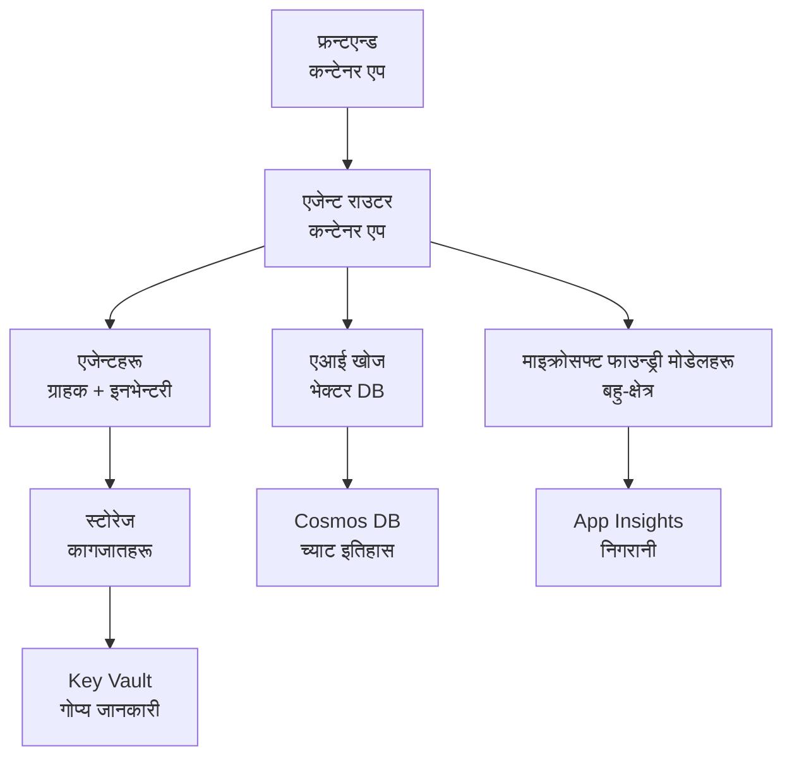

# रिटेल मल्टी-एजेन्ट समाधान - पूर्वाधार टेम्पलेट

**अध्याय ५: उत्पादन तैनाथि प्याकेज**
- **📚 कोर्स गृहपृष्ठ**: [AZD For Beginners](../../README.md)
- **📖 सम्बन्धित अध्याय**: [अध्याय ५: मल्टी-एजेन्ट AI समाधान](../../README.md#-chapter-5-multi-agent-ai-solutions-advanced)
- **📝 परिदृश्य मार्गदर्शक**: [पूर्ण आर्किटेक्चर](../retail-scenario.md)
- **🎯 छिटो तैनाथि**: [वन-क्लिक तैनाथि](../../../../examples/retail-multiagent-arm-template)

> **⚠️ केवल पूर्वाधार टेम्पलेट**  
> यो ARM टेम्पलेटले मल्टी-एजेन्ट प्रणालीका लागि **Azure स्रोतहरू** तैनाथ गर्छ।  
>  
> **के तैनाथ हुन्छ (१५-२५ मिनेट):**
> - ✅ Microsoft Foundry Models (gpt-4.1, gpt-4.1-mini, embeddings ३ क्षेत्रहरूमा)
> - ✅ AI Search सेवा (खाली, इनडेक्स सिर्जनाका लागि तयार)
> - ✅ Container Apps (प्लेसहोल्डर इमेजहरू, तपाईंको कोडका लागि तयार)
> - ✅ Storage, Cosmos DB, Key Vault, Application Insights
>  
> **के समावेश गरिएको छैन (विकास आवश्यक):**
> - ❌ एजेन्ट कार्यान्वयन कोड (Customer Agent, Inventory Agent)
> - ❌ राउटिङ तर्क र API अन्तबिन्दुहरू
> - ❌ फ्रन्टएन्ड च्याट UI
> - ❌ सर्च इन्डेक्स स्किमाहरू र डेटा पाइपलाइनहरू
> - ❌ **अनुमानित विकास प्रयास: ८०-१२० घण्टा**
>  
> **यो टेम्पलेट प्रयोग गर्नुहोस् यदि:**
> - ✅ तपाईं मल्टी-एजेन्ट परियोजनाका लागि Azure पूर्वाधार प्रावधान गर्न चाहनुहुन्छ
> - ✅ तपाईं एजेन्ट कार्यान्वयन अलग्गै विकास गर्ने योजना बनाउनुहुन्छ
> - ✅ तपाईंलाई उत्पादन-तयार पूर्वाधार बेसलाइन चाहिन्छ
>  
> **प्रयोग नगर्नुहोस् यदि:**
> - ❌ तपाईं तुरुन्तै काम गर्ने मल्टी-एजेन्ट डेमो अपेक्षा गर्नुहुन्छ
> - ❌ तपाईं पूर्ण एप्लिकेशन कोड उदाहरणहरू खोज्दै हुनुहुन्छ

## अवलोकन

यो निर्देशिकाले मल्टी-एजेन्ट ग्राहक समर्थन प्रणालीको **पूर्वाधार आधार** तैनाथ गर्नका लागि विस्तृत Azure Resource Manager (ARM) टेम्पलेट समावेश गर्छ। टेम्पलेटले सबै आवश्यक Azure सेवाहरू उचित रूपमा कन्फिगर र अन्तरकनेक्ट गरी तपाईंको एप्लिकेशन विकासका लागि तयार गर्दछ।

**तैनाथिपछि, तपाईंले पाउनुहुनेछ:** उत्पादन-तयार Azure पूर्वाधार  
**प्रणाली पूरा गर्नका लागि, तपाईंलाई चाहिनेछ:** एजेन्ट कोड, फ्रन्टएन्ड UI, र डेटा कन्फिगरेसन (हेर्नुहोस् [आर्किटेक्चर गाइड](../retail-scenario.md))

## 🎯 के तैनाथ हुन्छ

### प्रमुख पूर्वाधार (तैनाथि पछि स्थिति)

✅ **Microsoft Foundry Models सेवाहरू** (API कलहरूको लागि तयार)
  - प्राथमिक क्षेत्र: gpt-4.1 डिप्लोयमेन्ट (20K TPM क्षमता)
  - द्वितीयक क्षेत्र: gpt-4.1-mini डिप्लोयमेन्ट (10K TPM क्षमता)
  - तृतिय क्षेत्र: पाठ एम्बेडिङ्स मोडेल (30K TPM क्षमता)
  - मूल्यांकन क्षेत्र: gpt-4.1 grader मोडेल (15K TPM क्षमता)
  - **स्थिति:** पूर्ण रूपमा कार्यरत - तुरुन्तै API कलहरू गर्न सकिन्छ

✅ **Azure AI Search** (खाली - कन्फिगरेसनका लागि तयार)
  - भेक्टर सर्च क्षमता सक्षम
  - स्ट्यान्डर्ड टियर 1_partition, 1_replica सहित
  - **स्थिति:** सेवा चलिरहेको, तर इन्डेक्स सिर्जना आवश्यक
  - **आवश्यक कार्य:** तपाईंको स्किमासँग सर्च इन्डेक्स सिर्जना गर्नुहोस्

✅ **Azure Storage Account** (खाली - अपलोडका लागि तयार)
  - ब्लब कन्टेनरहरू: `documents`, `uploads`
  - सुरक्षित कन्फिगरेसन (केवल HTTPS, कुनै सार्वजनिक पहुँच छैन)
  - **स्थिति:** फाइलहरू प्राप्त गर्न तयार
  - **आवश्यक कार्य:** तपाईंको उत्पादन डेटा र दस्तावेजहरू अपलोड गर्नुहोस्

⚠️ **Container Apps वातावरण** (प्लेसहोल्डर इमेजहरू तैनाथ)
  - एजेन्ट राउटर एप (nginx डिफल्ट इमेज)
  - फ्रन्टएन्ड एप (nginx डिफल्ट इमेज)
  - स्वत: स्केलिङ कन्फिगर गरिएको (0-10 इन्स्टेन्स)
  - **स्थिति:** प्लेसहोल्डर कन्टेनरहरू चल्दै छन्
  - **आवश्यक कार्य:** तपाईंका एजेन्ट एप्लिकेसनहरू निर्माण र तैनाथ गर्नुहोस्

✅ **Azure Cosmos DB** (खाली - डेटा राख्न तयार)
  - डेटाबेस र कन्टेनर पूर्व-कन्फिगर गरिएको
  - न्यून-लेटेन्सी अपरेसनका लागि अनुकूलित
  - TTL सक्षम स्वत: क्लिनअपका लागि
  - **स्थिति:** च्याट इतिहास भण्डारण गर्न तयार

✅ **Azure Key Vault** (वैकल्पिक - गोप्यहरूका लागि तयार)
  - सफ्ट डिलिट सक्षम
  - प्रबन्धित आइडेन्टिटीजका लागि RBAC कन्फिगर गरिएको
  - **स्थिति:** API कुञ्जीहरू र कनेक्सन स्ट्रिङहरू भण्डारण गर्न तयार

✅ **Application Insights** (वैकल्पिक - निगरानी सक्रिय)
  - Log Analytics workspace सँग जडित
  - अनुकूल मेट्रिक्स र अलर्टहरू कन्फिगर गरिएको
  - **स्थिति:** तपाईंका एपहरूबाट टेलिमेट्री प्राप्त गर्न तयार

✅ **Document Intelligence** (API कलहरूको लागि तयार)
  - उत्पादन वर्कलोडका लागि S0 टियर
  - **स्थिति:** अपलोड गरिएका दस्तावेजहरू प्रक्रियाका लागि तयार

✅ **Bing Search API** (API कलहरूको लागि तयार)
  - S1 टियर वास्तविक-समय खोजका लागि
  - **स्थिति:** वेब सर्च क्वेरीहरूको लागि तयार

### तैनाथि मोडहरू

| Mode | OpenAI Capacity | Container Instances | Search Tier | Storage Redundancy | Best For |
|------|-----------------|---------------------|-------------|-------------------|----------|
| **Minimal** | 10K-20K TPM | 0-2 replicas | Basic | LRS (Local) | Dev/test, learning, proof-of-concept |
| **Standard** | 30K-60K TPM | 2-5 replicas | Standard | ZRS (Zone) | Production, moderate traffic (<10K users) |
| **Premium** | 80K-150K TPM | 5-10 replicas, zone-redundant | Premium | GRS (Geo) | Enterprise, high traffic (>10K users), 99.99% SLA |

**लागत प्रभाव:**
- **Minimal → Standard:** ~4x लागत वृद्धि ($100-370/mo → $420-1,450/mo)
- **Standard → Premium:** ~3x लागत वृद्धि ($420-1,450/mo → $1,150-3,500/mo)
- **छान्नुहोस् आधारमा:** अपेक्षित लोड, SLA आवश्यकताहरू, बजेट सीमाहरू

**क्षमता योजना:**
- **TPM (Tokens Per Minute):** सबै मोडेल डिप्लोयमेन्टहरूमा जम्मा
- **Container Instances:** स्वत: स्केलिङ दायरा (न्यूनतम-अधिकतम रेप्लिकाहरू)
- **Search Tier:** क्वेरी प्रदर्शन र इन्डेक्स साइज सीमामा प्रभाव पार्छ

## 📋 पूर्वापेक्षाहरू

### आवश्यक उपकरणहरू
1. **Azure CLI** (संस्करण 2.50.0 वा माथिको)
   ```bash
   az --version  # संस्करण जाँच गर्नुहोस्
   az login      # प्रमाणीकरण गर्नुहोस्
   ```

2. **सक्रिय Azure सदस्यता** जसमा Owner वा Contributor पहुँच छ
   ```bash
   az account show  # सदस्यता सत्यापित गर्नुहोस्
   ```

### आवश्यक Azure क्वोटाहरू

तैनाथि अघि, लक्षित क्षेत्रहरूमा पर्याप्त क्वोटाहरू जाँच गर्नुहोस्:

```bash
# तपाईंको क्षेत्रमा Microsoft Foundry मोडेलहरूको उपलब्धता जाँच गर्नुहोस्
az cognitiveservices account list-skus \
  --kind OpenAI \
  --location eastus2

# OpenAI कोटा जाँच गर्नुहोस् (उदाहरणका लागि gpt-4.1)
az cognitiveservices usage list \
  --location eastus2 \
  --query "[?name.value=='OpenAI.Standard.gpt-4.1']"

# Container Apps कोटा जाँच गर्नुहोस्
az provider show \
  --namespace Microsoft.App \
  --query "resourceTypes[?resourceType=='managedEnvironments'].locations"
```

**न्यूनतम आवश्यक क्वोटाहरू:**
- **Microsoft Foundry Models:** क्षेत्रहरूमा 3-4 मोडेल डिप्लोयमेन्टहरू
  - gpt-4.1: 20K TPM (प्रति मिनेट टोकन)
  - gpt-4.1-mini: 10K TPM
  - text-embedding-ada-002: 30K TPM
  - **नोट:** केही क्षेत्रहरूमा gpt-4.1 लाई प्रतीक्षा सूची हुन सक्छ - जाँच गर्नुहोस् [model availability](https://learn.microsoft.com/azure/ai-services/openai/concepts/models)
- **Container Apps:** Managed environment + 2-10 container इन्स्टेन्सहरू
- **AI Search:** स्ट्यान्डर्ड टियर (भेक्टर सर्चका लागि Basic अपर्याप्त)
- **Cosmos DB:** स्ट्यान्डर्ड provisioned throughput

**यदि क्वोटा अपर्याप्त छ भने:**
1. Azure Portal → Quotas → Request increase मा जानुहोस्
2. वा Azure CLI प्रयोग गर्नुहोस्:
   ```bash
   az support tickets create \
     --ticket-name "OpenAI-Quota-Increase" \
     --severity "minimal" \
     --description "Request quota increase for Microsoft Foundry Models gpt-4.1 in eastus2"
   ```
3. उपलब्धतासहित वैकल्पिक क्षेत्रहरू विचार गर्नुहोस्

## 🚀 छिटो तैनाथि

### विकल्प 1: Azure CLI प्रयोग गर्दै

```bash
# टेम्पलेट फाइलहरू क्लोन वा डाउनलोड गर्नुहोस्
git clone <repository-url>
cd examples/retail-multiagent-arm-template

# डिप्लोयमेन्ट स्क्रिप्टलाई निष्पादनयोग्य बनाउनुहोस्
chmod +x deploy.sh

# पूर्वनिर्धारित सेटिङहरूसँग डिप्लोय गर्नुहोस्
./deploy.sh -g myResourceGroup

# उत्पादन वातावरणमा प्रिमियम सुविधाहरू सहित डिप्लोय गर्नुहोस्
./deploy.sh -g myProdRG -e prod -m premium -l eastus2
```

### विकल्प 2: Azure Portal प्रयोग गर्दै

[](https://portal.azure.com/#create/Microsoft.Template/uri/https%3A%2F%2Fraw.githubusercontent.com%2Fmicrosoft%2Fazd-for-beginners%2Fmain%2Fexamples%2Fretail-multiagent-arm-template%2Fazuredeploy.json)

### विकल्प 3: सिधै Azure CLI प्रयोग गर्दै

```bash
# स्रोत समूह सिर्जना गर्नुहोस्
az group create --name myResourceGroup --location eastus2

# टेम्पलेट तैनाथ गर्नुहोस्
az deployment group create \
  --resource-group myResourceGroup \
  --template-file azuredeploy.json \
  --parameters azuredeploy.parameters.json
```

## ⏱️ तैनाथि समयरेखा

### के अपेक्षा गर्ने

| Phase | Duration | What Happens |
|-------|----------|--------------||
| **Template Validation** | 30-60 seconds | Azure validates ARM template syntax and parameters |
| **Resource Group Setup** | 10-20 seconds | Creates resource group (if needed) |
| **OpenAI Provisioning** | 5-8 minutes | Creates 3-4 OpenAI accounts and deploys models |
| **Container Apps** | 3-5 minutes | Creates environment and deploys placeholder containers |
| **Search & Storage** | 2-4 minutes | Provisions AI Search service and storage accounts |
| **Cosmos DB** | 2-3 minutes | Creates database and configures containers |
| **Monitoring Setup** | 2-3 minutes | Sets up Application Insights and Log Analytics |
| **RBAC Configuration** | 1-2 minutes | Configures managed identities and permissions |
| **Total Deployment** | **15-25 minutes** | Complete infrastructure ready |

**तैनाथि पछि:**
- ✅ **पूर्वाधार तयार:** सबै Azure सेवाहरू प्रावधान र चलिरहेका छन्
- ⏱️ **एप्लिकेशन विकास:** 80-120 घण्टा (तपाईंको जिम्मेवारी)
- ⏱️ **इन्डेक्स कन्फिगरेसन:** 15-30 मिनेट (तपाईंको स्किमा आवश्यक)
- ⏱️ **डाटा अपलोड:** डेटासेट साइज अनुसार फरक
- ⏱️ **परीक्षण र मान्यता:** 2-4 घण्टा

---

## ✅ तैनाथि सफलताको पुष्टि गर्नुहोस्

### चरण 1: स्रोत प्राविधान जाँच गर्नुहोस् (2 मिनेट)

```bash
# सबै स्रोतहरू सफलतापूर्वक तैनात भएका छन् भनेर जाँच गर्नुहोस्
az resource list \
  --resource-group myResourceGroup \
  --query "[?provisioningState!='Succeeded'].{Name:name, Status:provisioningState, Type:type}" \
  --output table
```

**अपेक्षित:** खाली तालिका (सबै स्रोतहरू "Succeeded" स्थिति देखाउँछन्)

### चरण 2: Microsoft Foundry Models डिप्लोयमेन्टहरू जाँच गर्नुहोस् (3 मिनेट)

```bash
# सबै OpenAI खाताहरू सूचीबद्ध गर्नुहोस्
az cognitiveservices account list \
  --resource-group myResourceGroup \
  --query "[?kind=='OpenAI'].{Name:name, Location:location, Status:properties.provisioningState}" \
  --output table

# प्राथमिक क्षेत्रका लागि मोडेल तैनाती जाँच गर्नुहोस्
OPENAI_NAME=$(az cognitiveservices account list \
  --resource-group myResourceGroup \
  --query "[?kind=='OpenAI'] | [0].name" -o tsv)

az cognitiveservices account deployment list \
  --name $OPENAI_NAME \
  --resource-group myResourceGroup \
  --output table
```

**अपेक्षित:** 
- 3-4 OpenAI खाता (प्राथमिक, द्वितीयक, तृतिय, मूल्यांकन क्षेत्रहरू)
- प्रत्येक खातामा 1-2 मोडेल डिप्लोयमेन्ट (gpt-4.1, gpt-4.1-mini, text-embedding-ada-002)

### चरण 3: पूर्वाधार अन्तबिन्दुहरू परीक्षण गर्नुहोस् (5 मिनेट)

```bash
# कन्टेनर अनुप्रयोगका URLहरू प्राप्त गर्नुहोस्
az containerapp list \
  --resource-group myResourceGroup \
  --query "[].{Name:name, URL:properties.configuration.ingress.fqdn, Status:properties.runningStatus}" \
  --output table

# राउटर एन्डपॉइन्ट परीक्षण गर्नुहोस् (प्लेसहोल्डर छवि जवाफ दिनेछ)
ROUTER_URL=$(az containerapp show \
  --name retail-router \
  --resource-group myResourceGroup \
  --query "properties.configuration.ingress.fqdn" -o tsv)

echo "Testing: https://$ROUTER_URL"
curl -I https://$ROUTER_URL || echo "Container running (placeholder image - expected)"
```

**अपेक्षित:** 
- Container Apps "Running" स्थिति देखाउँछन्
- प्लेसहोल्डर nginx ले HTTP 200 वा 404 प्रतिक्रिया दिन्छ (अहिलेसम्म एप्लिकेशन कोड छैन)

### चरण 4: Microsoft Foundry Models API पहुँच जाँच गर्नुहोस् (3 मिनेट)

```bash
# OpenAI endpoint र कुञ्जी प्राप्त गर्नुहोस्
OPENAI_ENDPOINT=$(az cognitiveservices account show \
  --name $OPENAI_NAME \
  --resource-group myResourceGroup \
  --query "properties.endpoint" -o tsv)

OPENAI_KEY=$(az cognitiveservices account keys list \
  --name $OPENAI_NAME \
  --resource-group myResourceGroup \
  --query "key1" -o tsv)

# gpt-4.1 परिनियोजन परीक्षण गर्नुहोस्
curl "${OPENAI_ENDPOINT}openai/deployments/gpt-4.1/chat/completions?api-version=2024-08-01-preview" \
  -H "Content-Type: application/json" \
  -H "api-key: $OPENAI_KEY" \
  -d '{
    "messages": [{"role": "user", "content": "Say hello"}],
    "max_tokens": 10
  }'
```

**अपेक्षित:** JSON प्रतिक्रिया सहित च्याट पूरा (OpenAI कार्यरत रहेको पुष्टि गर्दछ)

### के काम गरिरहेको छ बनाम के छैन

**✅ तैनाथि पछि काम गरिरहेको:**
- Microsoft Foundry Models मोडेलहरू डिप्लोय गरेको र API कलहरू स्वीकार गर्दै
- AI Search सेवा चलिरहेको (खाली, अझै इन्डेक्स छैन)
- Container Apps चलिरहेका (प्लेसहोल्डर nginx इमेजहरू)
- Storage अकाउन्टहरू पहुँचयोग्य र अपलोडका लागि तयार
- Cosmos DB डेटा अपरेसनका लागि तयार
- Application Insights पूर्वाधार टेलिमेट्री सङ्कलन गरिरहेको
- Key Vault गोप्य भण्डारणका लागि तयार

**❌ अहिलेसम्म काम नभएको (विकास आवश्यक):**
- एजेन्ट अन्तबिन्दुहरू (कोई एप्लिकेशन कोड तैनाथ भएको छैन)
- च्याट कार्यक्षमता (फ्रन्टएन्ड + ब्याकएन्ड कार्यान्वयन आवश्यक)
- सर्च क्वेरीहरू (कुनै सर्च इन्डेक्स सिर्जना भएको छैन)
- दस्तावेज प्रसोधन पाइपलाइन (कुनै डेटा अपलोड गरिएको छैन)
- कस्टम टेलिमेट्री (एप्लिकेशन इन्स्ट्रुमेन्टेसन आवश्यक)

**अर्को कदमहरू:** तपाईंको एप विकास र तैनाथि गर्नको लागि हेर्नुहोस् [पोस्ट-तैनाथि कन्फिगरेसन](../../../../examples/retail-multiagent-arm-template)

---

## ⚙️ कन्फिगरेसन विकल्पहरू

### टेम्पलेट प्यारामिटरहरू

| Parameter | Type | Default | Description |
|-----------|------|---------|-------------|
| `projectName` | string | "retail" | सबै स्रोत नामहरूको प्रिफिक्स |
| `location` | string | Resource group location | प्राथमिक तैनाथि क्षेत्र |
| `secondaryLocation` | string | "westus2" | बहु-क्षेत्र तैनाथिको लागि द्वितीयक क्षेत्र |
| `tertiaryLocation` | string | "francecentral" | एम्बेडिङ मोडेलको लागि क्षेत्र |
| `environmentName` | string | "dev" | वातावरण संकेत (dev/staging/prod) |
| `deploymentMode` | string | "standard" | तैनाथि कन्फिगरेसन (minimal/standard/premium) |
| `enableMultiRegion` | bool | true | बहु-क्षेत्र तैनाथि सक्षम गर्ने |
| `enableMonitoring` | bool | true | Application Insights र लगिङ सक्षम गर्ने |
| `enableSecurity` | bool | true | Key Vault र उन्नत सुरक्षा सक्षम गर्ने |

### प्यारामिटरहरू अनुकूलन

`azuredeploy.parameters.json` सम्पादन गर्नुहोस्:

```json
{
  "$schema": "https://schema.management.azure.com/schemas/2019-04-01/deploymentParameters.json#",
  "contentVersion": "1.0.0.0",
  "parameters": {
    "projectName": {
      "value": "mycompany"
    },
    "environmentName": {
      "value": "prod"
    },
    "deploymentMode": {
      "value": "premium"
    },
    "location": {
      "value": "eastus2"
    }
  }
}
```

## 🏗️ आर्किटेक्चर अवलोकन


## 📖 तैनाथि स्क्रिप्ट प्रयोग

`deploy.sh` स्क्रिप्टले अन्तरक्रियात्मक तैनाथि अनुभव प्रदान गर्छ:

```bash
# सहायता देखाउनुहोस्
./deploy.sh --help

# बुनियादी परिनियोजन
./deploy.sh -g myResourceGroup

# अनुकूलन सेटिङहरू सहित उन्नत परिनियोजन
./deploy.sh \
  -g myProductionRG \
  -p companyname \
  -e prod \
  -m premium \
  -l eastus2

# बहु-क्षेत्र बिना विकास परिनियोजन
./deploy.sh \
  -g myDevRG \
  -e dev \
  -m minimal \
  --no-multi-region \
  --no-security
```

### स्क्रिप्ट सुविधाहरू

- ✅ **पूर्वापेक्षाहरूको मान्यता** (Azure CLI, लगइन स्थिति, टेम्पलेट फाइलहरू)
- ✅ **स्रोत समूह व्यवस्थापन** (अवश्यक अवस्थामा सिर्जना गर्छ)
- ✅ **तैनाथि अघि टेम्पलेट मान्यता**
- ✅ **प्रगति अनुगमन** रङ्गीन आउटपुटसहित
- ✅ **तैनाथि आउटपुटहरू प्रदर्शन**
- ✅ **पोस्ट-तैनाथि मार्गदर्शन**

## 📊 तैनाथि निगरानी

### तैनाथि स्थिति जाँच गर्नुहोस्

```bash
# डिप्लोयमेन्टहरू सूचीबद्ध गर्नुहोस्
az deployment group list --resource-group myResourceGroup --output table

# डिप्लोयमेन्ट विवरण प्राप्त गर्नुहोस्
az deployment group show \
  --resource-group myResourceGroup \
  --name retail-deployment-YYYYMMDD-HHMMSS

# डिप्लोयमेन्ट प्रगति अनुगमन गर्नुहोस्
az deployment group create \
  --resource-group myResourceGroup \
  --template-file azuredeploy.json \
  --parameters azuredeploy.parameters.json \
  --verbose
```

### तैनाथि आउटपुटहरू

सफल तैनाथिपछि, निम्न आउटपुटहरू उपलब्ध हुनेछ:

- **Frontend URL**: वेब इन्टरफेसको सार्वजनिक अन्तबिन्दु
- **Router URL**: एजेन्ट राउटरको API अन्तबिन्दु
- **OpenAI Endpoints**: प्राथमिक र द्वितीयक OpenAI सेवा अन्तबिन्दुहरू
- **Search Service**: Azure AI Search सेवा अन्तबिन्दु
- **Storage Account**: दस्तावेजहरूका लागि Storage अकाउन्टको नाम
- **Key Vault**: Key Vault को नाम (यदि सक्षम गरिएको छ भने)
- **Application Insights**: निगरानी सेवाको नाम (यदि सक्षम गरिएको छ भने)

## 🔧 पोस्ट-तैनाथि: अर्को कदमहरू
> **📝 महत्वपूर्ण:** पूर्वाधार तैनात गरिएको छ, तर तपाईंले अनुप्रयोग कोड विकास र तैनात गर्नुपर्छ।

### चरण 1: एजेन्ट अनुप्रयोगहरू विकास गर्नुहोस् (तपाईंको जिम्मेवारी)

The ARM template creates **empty Container Apps** with placeholder nginx images. You must:

**आवश्यक विकास:**
1. **एजेन्ट कार्यान्वयन** (30-40 hours)
   - ग्राहक सेवा एजेन्ट gpt-4.1 एकीकरणसहित
   - इनभेन्टरी एजेन्ट gpt-4.1-mini एकीकरणसहित
   - एजेन्ट राउटिङ तर्क

2. **फ्रन्टएन्ड विकास** (20-30 hours)
   - च्याट इन्टरफेस UI (React/Vue/Angular)
   - फाइल अपलोड कार्यक्षमता
   - प्रतिक्रिया रेंडरिंग र ढाँचा मिलाउने

3. **ब्याकएन्ड सेवाहरू** (12-16 hours)
   - FastAPI or Express router
   - प्रमाणीकरण मिडलवेयर
   - टेलिमेट्री एकीकरण

See: [आर्किटेक्चर गाइड](../retail-scenario.md) for detailed implementation patterns and code examples

### चरण 2: AI सर्च इन्डेक्स कन्फिगर गर्नुहोस् (15-30 मिनेट)

Create a search index matching your data model:

```bash
# खोज सेवा विवरण प्राप्त गर्नुहोस्
SEARCH_NAME=$(az search service list \
  --resource-group myResourceGroup \
  --query "[0].name" -o tsv)

SEARCH_KEY=$(az search admin-key show \
  --service-name $SEARCH_NAME \
  --resource-group myResourceGroup \
  --query "primaryKey" -o tsv)

# तपाईंको स्कीमासँग इन्डेक्स सिर्जना गर्नुहोस् (उदाहरण)
curl -X POST "https://${SEARCH_NAME}.search.windows.net/indexes?api-version=2023-11-01" \
  -H "Content-Type: application/json" \
  -H "api-key: ${SEARCH_KEY}" \
  -d '{
    "name": "products",
    "fields": [
      {"name": "id", "type": "Edm.String", "key": true},
      {"name": "title", "type": "Edm.String", "searchable": true},
      {"name": "content", "type": "Edm.String", "searchable": true},
      {"name": "category", "type": "Edm.String", "filterable": true},
      {"name": "content_vector", "type": "Collection(Edm.Single)", 
       "searchable": true, "dimensions": 1536, "vectorSearchProfile": "default"}
    ],
    "vectorSearch": {
      "algorithms": [{"name": "default", "kind": "hnsw"}],
      "profiles": [{"name": "default", "algorithm": "default"}]
    }
  }'
```

**स्रोतहरू:**
- [AI Search Index Schema Design](https://learn.microsoft.com/azure/search/search-what-is-an-index)
- [Vector Search Configuration](https://learn.microsoft.com/azure/search/vector-search-how-to-create-index)

### चरण 3: आफ्नो डाटा अपलोड गर्नुहोस् (समय फरक पर्न सक्छ)

Once you have product data and documents:

```bash
# स्टोरेज खाता विवरण प्राप्त गर्नुहोस्
STORAGE_NAME=$(az storage account list \
  --resource-group myResourceGroup \
  --query "[0].name" -o tsv)

STORAGE_KEY=$(az storage account keys list \
  --account-name $STORAGE_NAME \
  --resource-group myResourceGroup \
  --query "[0].value" -o tsv)

# आफ्ना कागजातहरू अपलोड गर्नुहोस्
az storage blob upload-batch \
  --destination documents \
  --source /path/to/your/product/docs \
  --account-name $STORAGE_NAME \
  --account-key $STORAGE_KEY

# उदाहरण: एकल फाइल अपलोड गर्नुहोस्
az storage blob upload \
  --container-name documents \
  --name "product-manual.pdf" \
  --file /path/to/product-manual.pdf \
  --account-name $STORAGE_NAME \
  --account-key $STORAGE_KEY
```

### चरण 4: आफ्नो अनुप्रयोगहरू बनाउने र तैनात गर्ने (8-12 घण्टा)

Once you've developed your agent code:

```bash
# 1. Azure Container Registry सिर्जना गर्नुहोस् (आवश्यक भएमा)
az acr create \
  --name myregistry \
  --resource-group myResourceGroup \
  --sku Basic

# 2. एजेन्ट राउटर इमेज बनाउनुहोस् र पुश गर्नुहोस्
docker build -t myregistry.azurecr.io/agent-router:v1 /path/to/your/router/code
az acr login --name myregistry
docker push myregistry.azurecr.io/agent-router:v1

# 3. फ्रन्टएन्ड इमेज बनाउनुहोस् र पुश गर्नुहोस्
docker build -t myregistry.azurecr.io/frontend:v1 /path/to/your/frontend/code
docker push myregistry.azurecr.io/frontend:v1

# 4. आफ्ना इमेजहरू प्रयोग गरेर Container Apps अद्यावधिक गर्नुहोस्
az containerapp update \
  --name retail-router \
  --resource-group myResourceGroup \
  --image myregistry.azurecr.io/agent-router:v1

az containerapp update \
  --name retail-frontend \
  --resource-group myResourceGroup \
  --image myregistry.azurecr.io/frontend:v1

# 5. पर्यावरण भेरिएबलहरू कन्फिगर गर्नुहोस्
az containerapp update \
  --name retail-router \
  --resource-group myResourceGroup \
  --set-env-vars \
    OPENAI_ENDPOINT=secretref:openai-endpoint \
    OPENAI_KEY=secretref:openai-key \
    SEARCH_ENDPOINT=secretref:search-endpoint \
    SEARCH_KEY=secretref:search-key
```

### चरण 5: आफ्नो अनुप्रयोग परीक्षण गर्नुहोस् (2-4 घण्टा)

```bash
# आफ्नो अनुप्रयोगको URL प्राप्त गर्नुहोस्
ROUTER_URL=$(az containerapp show \
  --name retail-router \
  --resource-group myResourceGroup \
  --query "properties.configuration.ingress.fqdn" -o tsv)

# एजेन्ट एन्डपोइन्ट परीक्षण गर्नुहोस् (एकपटक तपाईंको कोड तैनात भएपछि)
curl -X POST "https://${ROUTER_URL}/chat" \
  -H "Content-Type: application/json" \
  -d '{
    "message": "Hello, I need help with my order",
    "agent": "customer"
  }'

# अनुप्रयोगका लगहरू जाँच गर्नुहोस्
az containerapp logs show \
  --name retail-router \
  --resource-group myResourceGroup \
  --follow
```

### कार्यान्वयन स्रोतहरू

**आर्किटेक्चर र डिजाइन:**
- 📖 [पूर्ण आर्किटेक्चर गाइड](../retail-scenario.md) - विस्तृत कार्यान्वयन ढाँचाहरू
- 📖 [Multi-Agent Design Patterns](https://learn.microsoft.com/azure/architecture/ai-ml/guide/multi-agent-systems)

**कोड उदाहरणहरू:**
- 🔗 [Microsoft Foundry मोडेल्स च्याट नमूना](https://github.com/Azure-Samples/azure-search-openai-demo) - RAG ढाँचा
- 🔗 [Semantic Kernel](https://github.com/microsoft/semantic-kernel) - एजेन्ट फ्रेमवर्क (C#)
- 🔗 [LangChain Azure](https://github.com/langchain-ai/langchain) - एजेन्ट अर्गेस्ट्रेसन (Python)
- 🔗 [AutoGen](https://github.com/microsoft/autogen) - मल्टि-एजेन्ट कुराकानीहरू

**अनुमानित कुल प्रयास:**
- पूर्वाधार तैनाती: 15-25 मिनेट (✅ पूर्ण)
- अनुप्रयोग विकास: 80-120 घण्टा (🔨 तपाईंको काम)
- परीक्षण र अनुकूलन: 15-25 घण्टा (🔨 तपाईंको काम)

## 🛠️ समस्या निवारण

### सामान्य समस्याहरू

#### 1. Microsoft Foundry मोडेल्स कोटा नाघियो

```bash
# वर्तमान कोटा प्रयोग जाँच्नुहोस्
az cognitiveservices usage list --location eastus2

# कोटा वृद्धि अनुरोध गर्नुहोस्
az support tickets create \
  --ticket-name "OpenAI-Quota-Increase" \
  --severity "minimal" \
  --description "Request quota increase for Microsoft Foundry Models in region X"
```

#### 2. Container Apps तैनाती असफल भयो

```bash
# कन्टेनर अनुप्रयोगका लगहरू जाँच गर्नुहोस्
az containerapp logs show \
  --name retail-router \
  --resource-group myResourceGroup \
  --follow

# कन्टेनर अनुप्रयोग पुनः सुरु गर्नुहोस्
az containerapp revision restart \
  --name retail-router \
  --resource-group myResourceGroup
```

#### 3. सर्च सेवा प्रारम्भिकरण

```bash
# खोज सेवा स्थिति पुष्टि गर्नुहोस्
az search service show \
  --name <search-service-name> \
  --resource-group myResourceGroup

# खोज सेवाको जडान जाँच गर्नुहोस्
curl -X GET "https://<search-service-name>.search.windows.net/indexes?api-version=2023-11-01" \
  -H "api-key: <search-admin-key>"
```

### तैनाती मान्यकरण

```bash
# पुष्टि गर्नुहोस् कि सबै स्रोतहरू सिर्जना भएका छन्
az resource list \
  --resource-group myResourceGroup \
  --output table

# स्रोतको स्वास्थ्य जाँच गर्नुहोस्
az resource list \
  --resource-group myResourceGroup \
  --query "[?provisioningState!='Succeeded'].{Name:name, Status:provisioningState, Type:type}" \
  --output table
```

## 🔐 सुरक्षा विचारहरू

### कुञ्जी व्यवस्थापन
- सबै गोप्य जानकारी Azure Key Vault मा संग्रहीत छन् (जब सक्षम गरिएको छ)
- Container apps प्रमाणीकरणका लागि व्यवस्थापन गरिएको आइडेन्टिटी प्रयोग गर्छन्
- स्टोरेज अकाउन्टहरूमा सुरक्षित डिफल्टहरू छन् (HTTPS मात्र, सार्वजनिक ब्लब पहुँच छैन)

### नेटवर्क सुरक्षा
- Container apps सम्भव भएसम्म आन्तरिक नेटवर्किङ प्रयोग गर्छन्
- सर्च सेवा निजी एन्डपोइन्ट विकल्पसहित कन्फिगर गरिएको छ
- Cosmos DB न्यूनतम आवश्यक अनुमतिसहित कन्फिगर गरिएको छ

### RBAC कन्फिगरेसन
```bash
# प्रबन्धित पहिचानका लागि आवश्यक भूमिकाहरू तोक्नुहोस्
az role assignment create \
  --assignee <container-app-managed-identity> \
  --role "Cognitive Services OpenAI User" \
  --scope <openai-resource-id>
```

## 💰 लागत अनुकूलन

### लागत अनुमान (मासिक, USD)

| मोड | OpenAI | Container Apps | सर्च | भण्डारण | कुल अनुमान |
|------|--------|----------------|--------|---------|------------|
| न्यूनतम | $50-200 | $20-50 | $25-100 | $5-20 | $100-370 |
| मानक | $200-800 | $100-300 | $100-300 | $20-50 | $420-1450 |
| प्रीमियम | $500-2000 | $300-800 | $300-600 | $50-100 | $1150-3500 |

### लागत अनुगमन

```bash
# बजेट अलर्टहरू सेट अप गर्नुहोस्
az consumption budget create \
  --account-name <subscription-id> \
  --budget-name "retail-budget" \
  --amount 500 \
  --time-grain Monthly \
  --start-date 2024-01-01 \
  --end-date 2024-12-31
```

## 🔄 अपडेटहरू र मर्मत

### टेम्प्लेट अपडेटहरू
- ARM टेम्प्लेट फाइलहरूलाई भर्सन कन्ट्रोल गर्नुहोस्
- परिवर्तनहरू पहिले विकास वातावरणमा परीक्षण गर्नुहोस्
- अपडेटहरूको लागि incremental deployment मोड प्रयोग गर्नुहोस्

### स्रोत अपडेटहरू
```bash
# नयाँ प्यारामिटरहरूसँग अद्यावधिक गर्नुहोस्
az deployment group create \
  --resource-group myResourceGroup \
  --template-file azuredeploy.json \
  --parameters azuredeploy.parameters.json \
  --mode Incremental
```

### ब्याकअप र रिकभरी
- Cosmos DB स्वत: ब्याकअप सक्षम गरिएको छ
- Key Vault सॉफ्ट डिलिट सक्षम गरिएको छ
- Container app को संशोधनहरू rollback का लागि कायम राखिन्छ

## 📞 समर्थन

- **टेम्प्लेट समस्याहरू**: [GitHub Issues](https://github.com/microsoft/azd-for-beginners/issues)
- **Azure समर्थन**: [Azure Support Portal](https://portal.azure.com/#blade/Microsoft_Azure_Support/HelpAndSupportBlade)
- **समुदाय**: [Azure AI Discord](https://discord.gg/microsoft-azure)

---

**⚡ तपाईंको मल्टि-एजेन्ट समाधान तैनात गर्न तयार हुनुहुन्छ?**

सुरु गर्नुहोस्: `./deploy.sh -g myResourceGroup`

---

<!-- CO-OP TRANSLATOR DISCLAIMER START -->
अस्वीकरण:
यो कागजात AI अनुवाद सेवा [Co-op Translator](https://github.com/Azure/co-op-translator) प्रयोग गरी अनुवाद गरिएको हो। हामी सटीकता तर्फ प्रयास गर्छौं, तर कृपया ध्यान दिनुहोस् कि स्वचालित अनुवादमा त्रुटि वा अशुद्धता हुन सक्छ। मूल भाषामा रहेको दस्तावेजलाई नै आधिकारिक स्रोत मानिनुपर्छ। महत्वपूर्ण जानकारीका लागि व्यावसायिक मानव अनुवाद सिफारिस गरिन्छ। यस अनुवादको प्रयोगबाट उत्पन्न कुनै पनि गलतफहमी वा गलत व्याख्याका लागि हामी उत्तरदायी छैनौँ।
<!-- CO-OP TRANSLATOR DISCLAIMER END -->