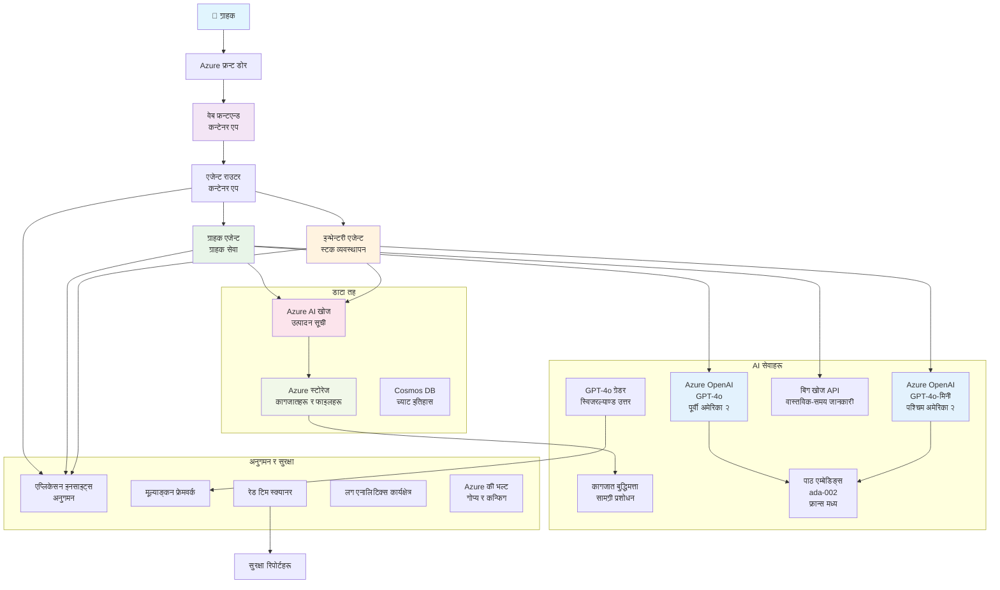

<!--
CO_OP_TRANSLATOR_METADATA:
{
  "original_hash": "77db71c83f2e7fbc9f50320bd1cc7116",
  "translation_date": "2025-11-20T13:46:56+00:00",
  "source_file": "examples/retail-scenario.md",
  "language_code": "ne"
}
-->
# बहु-एजेन्ट ग्राहक समर्थन समाधान - खुद्रा विक्रेता परिदृश्य

**अध्याय ५: बहु-एजेन्ट एआई समाधानहरू**
- **📚 कोर्स होम**: [AZD For Beginners](../README.md)
- **📖 वर्तमान अध्याय**: [अध्याय ५: बहु-एजेन्ट एआई समाधानहरू](../README.md#-chapter-5-multi-agent-ai-solutions-advanced)
- **⬅️ पूर्वआवश्यकता**: [अध्याय २: एआई-प्रथम विकास](../docs/ai-foundry/azure-ai-foundry-integration.md)
- **➡️ अर्को अध्याय**: [अध्याय ६: पूर्व-परिनियोजन मान्यता](../docs/pre-deployment/capacity-planning.md)
- **🚀 एआरएम टेम्प्लेटहरू**: [परिनियोजन प्याकेज](retail-multiagent-arm-template/README.md)

> **⚠️ आर्किटेक्चर गाइड - कार्यान्वयनको लागि तयार छैन**  
> यो दस्तावेजले बहु-एजेन्ट प्रणाली निर्माणको लागि **सम्पूर्ण आर्किटेक्चर खाका** प्रदान गर्दछ।  
> **के उपलब्ध छ:** पूर्वाधार परिनियोजनको लागि एआरएम टेम्प्लेट (Azure OpenAI, AI Search, Container Apps, आदि)  
> **के निर्माण गर्नुपर्छ:** एजेन्ट कोड, रुटिङ तर्क, फ्रन्टएन्ड UI, डेटा पाइपलाइनहरू (अनुमानित ८०-१२० घण्टा)  
>  
> **यसलाई प्रयोग गर्नुहोस्:**
> - ✅ आफ्नै बहु-एजेन्ट परियोजनाको लागि आर्किटेक्चर सन्दर्भको रूपमा
> - ✅ बहु-एजेन्ट डिजाइन ढाँचाहरू सिक्नको लागि
> - ✅ Azure स्रोतहरू परिनियोजन गर्न पूर्वाधार टेम्प्लेटको रूपमा
> - ❌ तयार-टु-रन एप्लिकेसनको रूपमा होइन (महत्वपूर्ण विकास आवश्यक)

## अवलोकन

**सिकाइ उद्देश्य:** खुद्रा विक्रेताका लागि उत्पादन-तयार बहु-एजेन्ट ग्राहक समर्थन च्याटबोट निर्माणको लागि आर्किटेक्चर, डिजाइन निर्णयहरू, र कार्यान्वयन दृष्टिकोण बुझ्नुहोस्, जसमा इन्वेन्टरी व्यवस्थापन, दस्तावेज प्रशोधन, र बौद्धिक ग्राहक अन्तरक्रियाहरू समावेश छन्।

**सम्पन्न गर्न समय:** पढ्ने + बुझ्ने (२-३ घण्टा) | पूर्ण कार्यान्वयन निर्माण (८०-१२० घण्टा)

**तपाईंले के सिक्नुहुनेछ:**
- बहु-एजेन्ट आर्किटेक्चर ढाँचाहरू र डिजाइन सिद्धान्तहरू
- बहु-क्षेत्र Azure OpenAI परिनियोजन रणनीतिहरू
- RAG (Retrieval-Augmented Generation) सँग AI Search एकीकरण
- एजेन्ट मूल्याङ्कन र सुरक्षा परीक्षण फ्रेमवर्कहरू
- उत्पादन परिनियोजन विचारहरू र लागत अनुकूलन

## आर्किटेक्चर लक्ष्यहरू

**शैक्षिक ध्यान:** यो आर्किटेक्चरले बहु-एजेन्ट प्रणालीहरूको लागि उद्यम ढाँचाहरू प्रदर्शन गर्दछ।

### प्रणाली आवश्यकताहरू (तपाईंको कार्यान्वयनको लागि)

उत्पादन ग्राहक समर्थन समाधानको लागि आवश्यक छ:
- **विभिन्न ग्राहक आवश्यकताहरूका लागि धेरै विशेषज्ञ एजेन्टहरू** (ग्राहक सेवा + इन्वेन्टरी व्यवस्थापन)
- **उचित क्षमता योजना सहित बहु-मोडेल परिनियोजन** (GPT-4o, GPT-4o-mini, विभिन्न क्षेत्रहरूमा embeddings)
- **AI Search र फाइल अपलोडहरूसँग गतिशील डेटा एकीकरण** (भेक्टर खोज + दस्तावेज प्रशोधन)
- **सम्पूर्ण निगरानी** र मूल्याङ्कन क्षमताहरू (Application Insights + अनुकूलन मेट्रिक्स)
- **उत्पादन-स्तर सुरक्षा** रेड टिमिङ मान्यतासहित (कमजोरी स्क्यानिङ + एजेन्ट मूल्याङ्कन)

### यो गाइडले के प्रदान गर्दछ

✅ **आर्किटेक्चर ढाँचाहरू** - स्केलेबल बहु-एजेन्ट प्रणालीहरूको लागि प्रमाणित डिजाइन  
✅ **पूर्वाधार टेम्प्लेटहरू** - Azure सेवाहरू परिनियोजन गर्ने एआरएम टेम्प्लेटहरू  
✅ **कोड उदाहरणहरू** - प्रमुख कम्पोनेन्टहरूको लागि सन्दर्भ कार्यान्वयनहरू  
✅ **कन्फिगरेसन मार्गदर्शन** - चरण-दर-चरण सेटअप निर्देशनहरू  
✅ **सर्वोत्तम अभ्यासहरू** - सुरक्षा, निगरानी, लागत अनुकूलन रणनीतिहरू  

❌ **समावेश छैन** - पूर्ण कार्यरत एप्लिकेसन (विकास प्रयास आवश्यक)

## 🗺️ कार्यान्वयन रोडम्याप

### चरण १: आर्किटेक्चर अध्ययन गर्नुहोस् (२-३ घण्टा) - यहाँबाट सुरु गर्नुहोस्

**लक्ष्य:** प्रणाली डिजाइन र कम्पोनेन्ट अन्तरक्रियाहरू बुझ्नुहोस्

- [ ] यो सम्पूर्ण दस्तावेज पढ्नुहोस्
- [ ] आर्किटेक्चर आरेख र कम्पोनेन्ट सम्बन्धहरू समीक्षा गर्नुहोस्
- [ ] बहु-एजेन्ट ढाँचाहरू र डिजाइन निर्णयहरू बुझ्नुहोस्
- [ ] एजेन्ट उपकरणहरू र रुटिङका लागि कोड उदाहरणहरू अध्ययन गर्नुहोस्
- [ ] लागत अनुमान र क्षमता योजना मार्गदर्शन समीक्षा गर्नुहोस्

**परिणाम:** तपाईंले निर्माण गर्नुपर्ने कुरा स्पष्ट रूपमा बुझ्नुहोस्

### चरण २: पूर्वाधार परिनियोजन गर्नुहोस् (३०-४५ मिनेट)

**लक्ष्य:** एआरएम टेम्प्लेट प्रयोग गरेर Azure स्रोतहरू प्रावधान गर्नुहोस्

```bash
cd retail-multiagent-arm-template
./deploy.sh -g myResourceGroup -m standard
```

**के परिनियोजन हुन्छ:**
- ✅ Azure OpenAI (३ क्षेत्रहरू: GPT-4o, GPT-4o-mini, embeddings)
- ✅ AI Search सेवा (खाली, अनुक्रमणिका कन्फिगरेसन आवश्यक)
- ✅ Container Apps वातावरण (प्लेसहोल्डर छविहरू)
- ✅ स्टोरेज खाता, Cosmos DB, Key Vault
- ✅ Application Insights निगरानी

**के हराइरहेको छ:**
- ❌ एजेन्ट कार्यान्वयन कोड
- ❌ रुटिङ तर्क
- ❌ फ्रन्टएन्ड UI
- ❌ खोज अनुक्रमणिका स्किमा
- ❌ डेटा पाइपलाइनहरू

### चरण ३: एप्लिकेसन निर्माण गर्नुहोस् (८०-१२० घण्टा)

**लक्ष्य:** यो आर्किटेक्चरको आधारमा बहु-एजेन्ट प्रणाली कार्यान्वयन गर्नुहोस्

1. **एजेन्ट कार्यान्वयन** (३०-४० घण्टा)
   - आधारभूत एजेन्ट वर्ग र इन्टरफेसहरू
   - GPT-4o सहित ग्राहक सेवा एजेन्ट
   - GPT-4o-mini सहित इन्वेन्टरी एजेन्ट
   - उपकरण एकीकरणहरू (AI Search, Bing, फाइल प्रशोधन)

2. **रुटिङ सेवा** (१२-१६ घण्टा)
   - अनुरोध वर्गीकरण तर्क
   - एजेन्ट चयन र समन्वय
   - FastAPI/Express ब्याकएन्ड

3. **फ्रन्टएन्ड विकास** (२०-३० घण्टा)
   - च्याट इन्टरफेस UI
   - फाइल अपलोड कार्यक्षमता
   - प्रतिक्रिया प्रस्तुतिकरण

4. **डेटा पाइपलाइन** (८-१२ घण्टा)
   - AI Search अनुक्रमणिका सिर्जना
   - Document Intelligence सँग दस्तावेज प्रशोधन
   - Embedding उत्पादन र अनुक्रमणिका

5. **निगरानी र मूल्याङ्कन** (१०-१५ घण्टा)
   - अनुकूलन टेलिमेट्री कार्यान्वयन
   - एजेन्ट मूल्याङ्कन फ्रेमवर्क
   - रेड टिम सुरक्षा स्क्यानर

### चरण ४: परिनियोजन र परीक्षण गर्नुहोस् (८-१२ घण्टा)

- सबै सेवाहरूको लागि Docker छविहरू निर्माण गर्नुहोस्
- Azure Container Registry मा धकेल्नुहोस्
- वास्तविक छविहरूसँग Container Apps अद्यावधिक गर्नुहोस्
- वातावरण भेरिएबल र गोप्य कन्फिगर गर्नुहोस्
- मूल्याङ्कन परीक्षण सुइट चलाउनुहोस्
- सुरक्षा स्क्यानिङ गर्नुहोस्

**कुल अनुमानित प्रयास:** अनुभवी विकासकर्ताहरूका लागि ८०-१२० घण्टा

## समाधान आर्किटेक्चर

### आर्किटेक्चर आरेख


### कम्पोनेन्ट अवलोकन

| कम्पोनेन्ट | उद्देश्य | प्रविधि | क्षेत्र |
|-----------|---------|------------|---------|
| **वेब फ्रन्टएन्ड** | ग्राहक अन्तरक्रियाहरूको लागि प्रयोगकर्ता इन्टरफेस | Container Apps | प्राथमिक क्षेत्र |
| **एजेन्ट राउटर** | अनुरोधहरू उपयुक्त एजेन्टमा रुट गर्दछ | Container Apps | प्राथमिक क्षेत्र |
| **ग्राहक एजेन्ट** | ग्राहक सेवा प्रश्नहरूको ह्यान्डल गर्दछ | Container Apps + GPT-4o | प्राथमिक क्षेत्र |
| **इन्वेन्टरी एजेन्ट** | स्टक र पूर्ति व्यवस्थापन गर्दछ | Container Apps + GPT-4o-mini | प्राथमिक क्षेत्र |
| **Azure OpenAI** | एजेन्टहरूको लागि LLM अनुमान | Cognitive Services | बहु-क्षेत्र |
| **AI Search** | भेक्टर खोज र RAG | AI Search सेवा | प्राथमिक क्षेत्र |
| **स्टोरेज खाता** | फाइल अपलोड र दस्तावेजहरू | Blob Storage | प्राथमिक क्षेत्र |
| **Application Insights** | निगरानी र टेलिमेट्री | Monitor | प्राथमिक क्षेत्र |
| **ग्रेडर मोडेल** | एजेन्ट मूल्याङ्कन प्रणाली | Azure OpenAI | द्वितीयक क्षेत्र |

## 📁 परियोजना संरचना

> **📍 स्थिति स्थिति:**  
> ✅ = रिपोजिटरीमा अवस्थित  
> 📝 = सन्दर्भ कार्यान्वयन (यस दस्तावेजमा कोड उदाहरण)  
> 🔨 = तपाईंले यो सिर्जना गर्नुपर्छ

```
retail-multiagent-solution/              🔨 Your project directory
├── .azure/                              🔨 Azure environment configs
│   ├── config.json                      🔨 Global config
│   └── env/
│       ├── .env.development             🔨 Dev environment
│       ├── .env.staging                 🔨 Staging environment
│       └── .env.production              🔨 Production environment
│
├── azure.yaml                          🔨 AZD main configuration
├── azure.parameters.json               🔨 Deployment parameters
├── README.md                           🔨 Solution documentation
│
├── infra/                              🔨 Infrastructure as Code (you create)
│   ├── main.bicep                      🔨 Main Bicep template (optional, ARM exists)
│   ├── main.parameters.json            🔨 Parameters file
│   ├── modules/                        📝 Bicep modules (reference examples below)
│   │   ├── ai-services.bicep           📝 Azure OpenAI deployments
│   │   ├── search.bicep                📝 AI Search configuration
│   │   ├── storage.bicep               📝 Storage accounts
│   │   ├── container-apps.bicep        📝 Container Apps environment
│   │   ├── monitoring.bicep            📝 Application Insights
│   │   ├── security.bicep              📝 Key Vault and RBAC
│   │   └── networking.bicep            📝 Virtual networks and DNS
│   ├── arm-template/                   ✅ ARM template version (EXISTS)
│   │   ├── azuredeploy.json            ✅ ARM main template (retail-multiagent-arm-template/)
│   │   └── azuredeploy.parameters.json ✅ ARM parameters
│   └── scripts/                        ✅/🔨 Deployment scripts
│       ├── deploy.sh                   ✅ Main deployment script (EXISTS)
│       ├── setup-data.sh               🔨 Data setup script (you create)
│       └── configure-rbac.sh           🔨 RBAC configuration (you create)
│
├── src/                                🔨 Application source code (YOU BUILD THIS)
│   ├── agents/                         📝 Agent implementations (examples below)
│   │   ├── base/                       🔨 Base agent classes
│   │   │   ├── agent.py                🔨 Abstract agent class
│   │   │   └── tools.py                🔨 Tool interfaces
│   │   ├── customer/                   🔨 Customer service agent
│   │   │   ├── agent.py                📝 Customer agent implementation (see below)
│   │   │   ├── prompts.py              🔨 System prompts
│   │   │   └── tools/                  🔨 Agent-specific tools
│   │   │       ├── search_tool.py      📝 AI Search integration (example below)
│   │   │       ├── bing_tool.py        📝 Bing Search integration (example below)
│   │   │       └── file_tool.py        🔨 File processing tool
│   │   └── inventory/                  🔨 Inventory management agent
│   │       ├── agent.py                🔨 Inventory agent implementation
│   │       ├── prompts.py              🔨 System prompts
│   │       └── tools/                  🔨 Agent-specific tools
│   │           ├── inventory_search.py 🔨 Inventory search tool
│   │           └── database_tool.py    🔨 Database query tool
│   │
│   ├── router/                         🔨 Agent routing service (you build)
│   │   ├── main.py                     🔨 FastAPI router application
│   │   ├── routing_logic.py            🔨 Request routing logic
│   │   └── middleware.py               🔨 Authentication & logging
│   │
│   ├── frontend/                       🔨 Web user interface (you build)
│   │   ├── Dockerfile                  🔨 Container configuration
│   │   ├── package.json                🔨 Node.js dependencies
│   │   ├── src/                        🔨 React/Vue source code
│   │   │   ├── components/             🔨 UI components
│   │   │   ├── pages/                  🔨 Application pages
│   │   │   ├── services/               🔨 API services
│   │   │   └── styles/                 🔨 CSS and themes
│   │   └── public/                     🔨 Static assets
│   │
│   ├── shared/                         🔨 Shared utilities (you build)
│   │   ├── config.py                   🔨 Configuration management
│   │   ├── telemetry.py                📝 Telemetry utilities (example below)
│   │   ├── security.py                 🔨 Security utilities
│   │   └── models.py                   🔨 Data models
│   │
│   └── evaluation/                     🔨 Evaluation and testing (you build)
│       ├── evaluator.py                📝 Agent evaluator (example below)
│       ├── red_team_scanner.py         📝 Security scanner (example below)
│       ├── test_cases.json             📝 Evaluation test cases (example below)
│       └── reports/                    🔨 Generated reports
│
├── data/                               🔨 Data and configuration (you create)
│   ├── search-schema.json              📝 AI Search index schema (example below)
│   ├── initial-docs/                   🔨 Initial document corpus
│   │   ├── product-manuals/            🔨 Product documentation (your data)
│   │   ├── policies/                   🔨 Company policies (your data)
│   │   └── faqs/                       🔨 Frequently asked questions (your data)
│   ├── fine-tuning/                    🔨 Fine-tuning datasets (optional)
│   │   ├── training.jsonl              🔨 Training data
│   │   └── validation.jsonl            🔨 Validation data
│   └── evaluation/                     🔨 Evaluation datasets
│       ├── test-conversations.json     📝 Test conversation data (example below)
│       └── ground-truth.json           🔨 Expected responses
│
├── scripts/                            # Utility scripts
│   ├── setup/                          # Setup scripts
│   │   ├── bootstrap.sh                # Initial environment setup
│   │   ├── install-dependencies.sh     # Install required tools
│   │   └── configure-env.sh            # Environment configuration
│   ├── data-management/                # Data management scripts
│   │   ├── upload-documents.py         # Document upload utility
│   │   ├── create-search-index.py      # Search index creation
│   │   └── sync-data.py                # Data synchronization
│   ├── deployment/                     # Deployment automation
│   │   ├── deploy-agents.sh            # Agent deployment
│   │   ├── update-frontend.sh          # Frontend updates
│   │   └── rollback.sh                 # Rollback procedures
│   └── monitoring/                     # Monitoring scripts
│       ├── health-check.py             # Health monitoring
│       ├── performance-test.py         # Performance testing
│       └── security-scan.py            # Security scanning
│
├── tests/                              # Test suites
│   ├── unit/                           # Unit tests
│   │   ├── test_agents.py              # Agent unit tests
│   │   ├── test_router.py              # Router unit tests
│   │   └── test_tools.py               # Tool unit tests
│   ├── integration/                    # Integration tests
│   │   ├── test_end_to_end.py          # E2E test scenarios
│   │   └── test_api.py                 # API integration tests
│   └── load/                           # Load testing
│       ├── load_test_config.yaml       # Load test configuration
│       └── scenarios/                  # Load test scenarios
│
├── docs/                               # Documentation
│   ├── architecture.md                 # Architecture documentation
│   ├── deployment-guide.md             # Deployment instructions
│   ├── agent-configuration.md          # Agent setup guide
│   ├── troubleshooting.md              # Troubleshooting guide
│   └── api/                            # API documentation
│       ├── agent-api.md                # Agent API reference
│       └── router-api.md               # Router API reference
│
├── hooks/                              # AZD lifecycle hooks
│   ├── preprovision.sh                 # Pre-provisioning tasks
│   ├── postprovision.sh                # Post-provisioning setup
│   ├── prepackage.sh                   # Pre-packaging tasks
│   └── postdeploy.sh                   # Post-deployment validation
│
└── .github/                            # GitHub workflows
    └── workflows/
        ├── ci-cd.yml                   # CI/CD pipeline
        ├── security-scan.yml           # Security scanning
        └── performance-test.yml        # Performance testing
```

---

## 🚀 छिटो सुरु: तपाईं अहिले के गर्न सक्नुहुन्छ

### विकल्प १: केवल पूर्वाधार परिनियोजन गर्नुहोस् (३० मिनेट)

**तपाईंले के पाउनुहुन्छ:** सबै Azure सेवाहरू विकासको लागि तयार

```bash
# रिपोजिटरी क्लोन गर्नुहोस्
git clone https://github.com/microsoft/AZD-for-beginners.git
cd AZD-for-beginners/examples/retail-multiagent-arm-template

# पूर्वाधार परिनियोजन गर्नुहोस्
./deploy.sh -g myResourceGroup -m standard

# परिनियोजन प्रमाणित गर्नुहोस्
az resource list --resource-group myResourceGroup --output table
```

**अपेक्षित परिणाम:**
- ✅ Azure OpenAI सेवाहरू परिनियोजित (३ क्षेत्रहरू)
- ✅ AI Search सेवा सिर्जना (खाली)
- ✅ Container Apps वातावरण तयार
- ✅ स्टोरेज, Cosmos DB, Key Vault कन्फिगर गरिएको
- ❌ अझै कार्यरत एजेन्टहरू छैनन् (केवल पूर्वाधार)

### विकल्प २: आर्किटेक्चर अध्ययन गर्नुहोस् (२-३ घण्टा)

**तपाईंले के पाउनुहुन्छ:** बहु-एजेन्ट ढाँचाहरूको गहिरो समझ

1. यो सम्पूर्ण दस्तावेज पढ्नुहोस्
2. प्रत्येक कम्पोनेन्टका लागि कोड उदाहरणहरू समीक्षा गर्नुहोस्
3. डिजाइन निर्णयहरू र व्यापार-सम्झौताहरू बुझ्नुहोस्
4. लागत अनुकूलन रणनीतिहरू अध्ययन गर्नुहोस्
5. आफ्नो कार्यान्वयन दृष्टिकोण योजना गर्नुहोस्

**अपेक्षित परिणाम:**
- ✅ प्रणाली आर्किटेक्चरको स्पष्ट मानसिक मोडेल
- ✅ आवश्यक कम्पोनेन्टहरूको समझ
- ✅ यथार्थपरक प्रयास अनुमान
- ✅ कार्यान्वयन योजना

### विकल्प ३: पूर्ण प्रणाली निर्माण गर्नुहोस् (८०-१२० घण्टा)

**तपाईंले के पाउनुहुन्छ:** उत्पादन-तयार बहु-एजेन्ट समाधान

1. **चरण १:** पूर्वाधार परिनियोजन गर्नुहोस् (माथि सम्पन्न)
2. **चरण २:** तलका कोड उदाहरणहरू प्रयोग गरेर एजेन्टहरू कार्यान्वयन गर्नुहोस् (३०-४० घण्टा)
3. **चरण ३:** रुटिङ सेवा निर्माण गर्नुहोस् (१२-१६ घण्टा)
4. **चरण ४:** फ्रन्टएन्ड UI सिर्जना गर्नुहोस् (२०-३० घण्टा)
5. **चरण ५:** डेटा पाइपलाइनहरू कन्फिगर गर्नुहोस् (८-१२ घण्टा)
6. **चरण ६:** निगरानी र मूल्याङ्कन थप्नुहोस् (१०-१५ घण्टा)

**अपेक्षित परिणाम:**
- ✅ पूर्ण कार्यात्मक बहु-एजेन्ट प्रणाली
- ✅ उत्पादन-स्तर निगरानी
- ✅ सुरक्षा मान्यता
- ✅ लागत-समायोजित परिनियोजन

---

## 📚 आर्किटेक्चर सन्दर्भ र कार्यान्वयन गाइड

तलका खण्डहरूले तपाईंको कार्यान्वयनलाई मार्गदर्शन गर्न विस्तृत आर्किटेक्चर ढाँचाहरू, कन्फिगरेसन उदाहरणहरू, र सन्दर्भ कोड प्रदान गर्दछ।
## ✅ तयार-प्रयोगको लागि ARM टेम्प्लेट

> **✨ यो वास्तवमै छ र काम गर्दछ!**  
> माथिका अवधारणात्मक कोड उदाहरणहरू भन्दा फरक, यो ARM टेम्प्लेट एक **वास्तविक, काम गर्ने पूर्वाधार परिनियोजन** हो जुन यस रिपोजिटरीमा समावेश छ।

### यो टेम्प्लेटले वास्तवमा के गर्छ

[`retail-multiagent-arm-template/`](../../../examples/retail-multiagent-arm-template) मा रहेको ARM टेम्प्लेटले बहु-एजेन्ट प्रणालीको लागि आवश्यक **सबै Azure पूर्वाधार** प्रदान गर्दछ। यो **एकमात्र तयार-चलाउन सकिने कम्पोनेन्ट** हो - अन्य सबै विकास आवश्यक छ।

### ARM टेम्प्लेटमा के समावेश छ

[`retail-multiagent-arm-template/`](../../../examples/retail-multiagent-arm-template) मा रहेको ARM टेम्प्लेटमा समावेश छ:

#### **पूर्ण पूर्वाधार**
- ✅ **बहु-क्षेत्र Azure OpenAI** परिनियोजनहरू (GPT-4o, GPT-4o-mini, embeddings, grader)
- ✅ **Azure AI Search** भेक्टर खोज क्षमताहरू सहित
- ✅ **Azure Storage** दस्तावेज र अपलोड कन्टेनरहरू सहित
- ✅ **कन्टेनर एप्स वातावरण** स्वचालित स्केलिङ सहित
- ✅ **एजेन्ट राउटर र फ्रन्टएन्ड** कन्टेनर एप्स
- ✅ **Cosmos DB** च्याट इतिहासको स्थायित्वको लागि
- ✅ **Application Insights** व्यापक निगरानीको लागि
- ✅ **Key Vault** सुरक्षित गोप्य व्यवस्थापनको लागि
- ✅ **Document Intelligence** फाइल प्रशोधनको लागि
- ✅ **Bing Search API** वास्तविक-समय जानकारीको लागि

#### **परिनियोजन मोडहरू**
| मोड | प्रयोग केस | स्रोतहरू | अनुमानित लागत/महिना |
|------|----------|-----------|---------------------|
| **न्यूनतम** | विकास, परीक्षण | आधारभूत SKUs, एकल क्षेत्र | $100-370 |
| **मानक** | उत्पादन, मध्यम स्केल | मानक SKUs, बहु-क्षेत्र | $420-1,450 |
| **प्रिमियम** | उद्यम, उच्च स्केल | प्रिमियम SKUs, HA सेटअप | $1,150-3,500 |

### 🎯 छिटो परिनियोजन विकल्पहरू

#### विकल्प 1: एक-क्लिक Azure परिनियोजन

[](https://portal.azure.com/#create/Microsoft.Template/uri/https%3A%2F%2Fraw.githubusercontent.com%2Fmicrosoft%2Fazd-for-beginners%2Fmain%2Fexamples%2Fretail-multiagent-arm-template%2Fazuredeploy.json)

#### विकल्प 2: Azure CLI परिनियोजन

```bash
# रिपोजिटरी क्लोन गर्नुहोस्
git clone https://github.com/microsoft/azd-for-beginners.git
cd azd-for-beginners/examples/retail-multiagent-arm-template

# डिप्लोयमेन्ट स्क्रिप्टलाई कार्यान्वयन योग्य बनाउनुहोस्
chmod +x deploy.sh

# डिफल्ट सेटिङ्स (स्ट्यान्डर्ड मोड) संग डिप्लोय गर्नुहोस्
./deploy.sh -g myResourceGroup

# प्रोडक्सनको लागि प्रिमियम सुविधाहरू सहित डिप्लोय गर्नुहोस्
./deploy.sh -g myProdRG -e prod -m premium -l eastus2

# विकासको लागि न्यूनतम संस्करण डिप्लोय गर्नुहोस्
./deploy.sh -g myDevRG -e dev -m minimal --no-multi-region
```

#### विकल्प 3: प्रत्यक्ष ARM टेम्प्लेट परिनियोजन

```bash
# स्रोत समूह सिर्जना गर्नुहोस्
az group create --name myResourceGroup --location eastus2

# टेम्पलेट सिधै तैनात गर्नुहोस्
az deployment group create \
  --resource-group myResourceGroup \
  --template-file azuredeploy.json \
  --parameters azuredeploy.parameters.json \
  --parameters projectName=retail environmentName=prod
```

### टेम्प्लेट आउटपुटहरू

सफल परिनियोजन पछि, तपाईंले प्राप्त गर्नुहुनेछ:

```json
{
  "frontendUrl": "https://retail-frontend-abc123.azurecontainerapps.io",
  "routerUrl": "https://retail-router-abc123.azurecontainerapps.io",
  "openAiEndpointPrimary": "https://retail-openai-primary-abc123.openai.azure.com/",
  "searchServiceEndpoint": "https://retail-search-abc123.search.windows.net",
  "storageAccountName": "retailstorage123abc",
  "keyVaultName": "retail-kv-abc123",
  "applicationInsightsName": "retail-ai-abc123"
}
```

### 🔧 परिनियोजन पछि कन्फिगरेसन

ARM टेम्प्लेटले पूर्वाधार परिनियोजनको हेरचाह गर्दछ। परिनियोजन पछि:

1. **खोज सूचकांक कन्फिगर गर्नुहोस्**:
   ```bash
   # प्रदान गरिएको खोज स्कीमा प्रयोग गर्नुहोस्
   curl -X POST "${SEARCH_ENDPOINT}/indexes?api-version=2023-11-01" \
     -H "Content-Type: application/json" \
     -H "api-key: ${SEARCH_KEY}" \
     -d @../data/search-schema.json
   ```

2. **प्रारम्भिक दस्तावेजहरू अपलोड गर्नुहोस्**:
   ```bash
   # उत्पादन म्यानुअलहरू र ज्ञान आधार अपलोड गर्नुहोस्
   az storage blob upload-batch \
     --destination documents \
     --source ../data/initial-docs \
     --account-name ${STORAGE_ACCOUNT}
   ```

3. **एजेन्ट कोड परिनियोजन गर्नुहोस्**:
   ```bash
   # वास्तविक एजेन्ट अनुप्रयोगहरू निर्माण र परिनियोजन गर्नुहोस्
   docker build -t myregistry.azurecr.io/agent-router:latest ./src/router
   az containerapp update \
     --name retail-router \
     --resource-group myResourceGroup \
     --image myregistry.azurecr.io/agent-router:latest
   ```

### 🎛️ अनुकूलन विकल्पहरू

`azuredeploy.parameters.json` सम्पादन गरेर आफ्नो परिनियोजन अनुकूलित गर्नुहोस्:

```json
{
  "projectName": {"value": "mycompany"},
  "environmentName": {"value": "prod"},
  "deploymentMode": {"value": "premium"},
  "location": {"value": "eastus2"},
  "enableMultiRegion": {"value": true},
  "enableMonitoring": {"value": true},
  "enableSecurity": {"value": true}
}
```

### 📊 परिनियोजन सुविधाहरू

- ✅ **पूर्वापेक्षा मान्यता** (Azure CLI, कोटा, अनुमतिहरू)
- ✅ **बहु-क्षेत्र उच्च उपलब्धता** स्वचालित फेलओभर सहित
- ✅ **व्यापक निगरानी** Application Insights र Log Analytics सहित
- ✅ **सुरक्षा उत्तम अभ्यासहरू** Key Vault र RBAC सहित
- ✅ **लागत अनुकूलन** कन्फिगरेबल परिनियोजन मोडहरू सहित
- ✅ **स्वचालित स्केलिङ** माग ढाँचाहरूमा आधारित
- ✅ **शून्य-डाउनटाइम अपडेटहरू** कन्टेनर एप्स संशोधनहरू सहित

### 🔍 निगरानी र व्यवस्थापन

परिनियोजन पछि, आफ्नो समाधानलाई निम्न माध्यमबाट निगरानी गर्नुहोस्:

- **Application Insights**: प्रदर्शन मेट्रिक्स, निर्भरता ट्र्याकिङ, र कस्टम टेलिमेट्री
- **Log Analytics**: सबै कम्पोनेन्टहरूबाट केन्द्रित लगिङ
- **Azure Monitor**: स्रोत स्वास्थ्य र उपलब्धता निगरानी
- **लागत व्यवस्थापन**: वास्तविक-समय लागत ट्र्याकिङ र बजेट अलर्टहरू

---

## 📚 पूर्ण कार्यान्वयन मार्गदर्शिका

यो परिदृश्य दस्तावेजले ARM टेम्प्लेटसँग मिलेर उत्पादन-तयार बहु-एजेन्ट ग्राहक समर्थन समाधान परिनियोजनको लागि आवश्यक सबै कुरा प्रदान गर्दछ। कार्यान्वयनले समेट्छ:

✅ **आर्किटेक्चर डिजाइन** - कम्पोनेन्ट सम्बन्धहरूको व्यापक प्रणाली डिजाइन  
✅ **पूर्वाधार परिनियोजन** - एक-क्लिक परिनियोजनको लागि पूर्ण ARM टेम्प्लेट  
✅ **एजेन्ट कन्फिगरेसन** - ग्राहक र सूची एजेन्टहरूको विस्तृत सेटअप  
✅ **बहु-मोडेल परिनियोजन** - क्षेत्रहरूमा रणनीतिक मोडेल स्थान  
✅ **खोज एकीकरण** - भेक्टर क्षमताहरू र डाटा सूचकांकिङको साथ AI खोज  
✅ **सुरक्षा कार्यान्वयन** - रेड टिमिङ, भल्नरेबिलिटी स्क्यानिङ, र सुरक्षित अभ्यासहरू  
✅ **निगरानी र मूल्याङ्कन** - व्यापक टेलिमेट्री र एजेन्ट मूल्याङ्कन फ्रेमवर्क  
✅ **उत्पादन तयारी** - HA र आपतकालीन पुनर्प्राप्तिसहित उद्यम-ग्रेड परिनियोजन  
✅ **लागत अनुकूलन** - बुद्धिमान राउटिङ र प्रयोग-आधारित स्केलिङ  
✅ **समस्या समाधान मार्गदर्शिका** - सामान्य समस्याहरू र समाधान रणनीतिहरू

---

## 📊 सारांश: तपाईंले के सिक्नुभयो

### समेटिएका आर्किटेक्चर ढाँचाहरू

✅ **बहु-एजेन्ट प्रणाली डिजाइन** - समर्पित मोडेलहरू सहित विशेष एजेन्टहरू (ग्राहक + सूची)  
✅ **बहु-क्षेत्र परिनियोजन** - लागत अनुकूलन र विश्वसनीयताको लागि रणनीतिक मोडेल स्थान  
✅ **RAG आर्किटेक्चर** - भेक्टर embeddings सहित AI खोज एकीकरण  
✅ **एजेन्ट मूल्याङ्कन** - गुणस्तर मूल्याङ्कनको लागि समर्पित ग्रेडर मोडेल  
✅ **सुरक्षा फ्रेमवर्क** - रेड टिमिङ र भल्नरेबिलिटी स्क्यानिङ ढाँचाहरू  
✅ **लागत अनुकूलन** - मोडेल राउटिङ र क्षमता योजना रणनीतिहरू  
✅ **उत्पादन निगरानी** - कस्टम टेलिमेट्री सहित Application Insights  

### यो दस्तावेजले के प्रदान गर्दछ

| कम्पोनेन्ट | स्थिति | कहाँ भेट्ने |
|-----------|--------|------------------|
| **पूर्वाधार टेम्प्लेट** | ✅ तयार परिनियोजनको लागि | [`retail-multiagent-arm-template/`](../../../examples/retail-multiagent-arm-template) |
| **आर्किटेक्चर डायग्रामहरू** | ✅ पूर्ण | माथिको Mermaid डायग्राम |
| **कोड उदाहरणहरू** | ✅ सन्दर्भ कार्यान्वयनहरू | यस दस्तावेजभरि |
| **कन्फिगरेसन ढाँचाहरू** | ✅ विस्तृत मार्गदर्शन | माथिका खण्डहरू 1-10 |
| **एजेन्ट कार्यान्वयनहरू** | 🔨 तपाईंले निर्माण गर्नुहोस् | ~40 घण्टा विकास |
| **फ्रन्टएन्ड UI** | 🔨 तपाईंले निर्माण गर्नुहोस् | ~25 घण्टा विकास |
| **डाटा पाइपलाइनहरू** | 🔨 तपाईंले निर्माण गर्नुहोस् | ~10 घण्टा विकास |

### वास्तविकता जाँच: वास्तवमा के छ

**रिपोजिटरीमा (अहिले तयार):**
- ✅ ARM टेम्प्लेट 15+ Azure सेवाहरू परिनियोजन गर्दै (azuredeploy.json)
- ✅ परिनियोजन स्क्रिप्ट मान्यता सहित (deploy.sh)
- ✅ प्यारामिटर कन्फिगरेसन (azuredeploy.parameters.json)

**दस्तावेजमा उल्लेख गरिएको (तपाईंले निर्माण गर्नुहोस्):**
- 🔨 एजेन्ट कार्यान्वयन कोड (~30-40 घण्टा)
- 🔨 राउटिङ सेवा (~12-16 घण्टा)
- 🔨 फ्रन्टएन्ड एप्लिकेसन (~20-30 घण्टा)
- 🔨 डाटा सेटअप स्क्रिप्टहरू (~8-12 घण्टा)
- 🔨 निगरानी फ्रेमवर्क (~10-15 घण्टा)

### तपाईंको अर्को कदमहरू

#### यदि तपाईं पूर्वाधार परिनियोजन गर्न चाहनुहुन्छ (30 मिनेट)
```bash
cd retail-multiagent-arm-template
./deploy.sh -g myResourceGroup
```

#### यदि तपाईं पूर्ण प्रणाली निर्माण गर्न चाहनुहुन्छ (80-120 घण्टा)
1. ✅ यो आर्किटेक्चर दस्तावेज पढ्नुहोस् र बुझ्नुहोस् (2-3 घण्टा)
2. ✅ ARM टेम्प्लेट प्रयोग गरेर पूर्वाधार परिनियोजन गर्नुहोस् (30 मिनेट)
3. 🔨 सन्दर्भ कोड ढाँचाहरू प्रयोग गरेर एजेन्टहरू कार्यान्वयन गर्नुहोस् (~40 घण्टा)
4. 🔨 FastAPI/Express प्रयोग गरेर राउटिङ सेवा निर्माण गर्नुहोस् (~15 घण्टा)
5. 🔨 React/Vue प्रयोग गरेर फ्रन्टएन्ड UI निर्माण गर्नुहोस् (~25 घण्टा)
6. 🔨 डाटा पाइपलाइन र खोज सूचकांक कन्फिगर गर्नुहोस् (~10 घण्टा)
7. 🔨 निगरानी र मूल्याङ्कन थप्नुहोस् (~15 घण्टा)
8. ✅ परीक्षण, सुरक्षा, र अनुकूलन गर्नुहोस् (~10 घण्टा)

#### यदि तपाईं बहु-एजेन्ट ढाँचाहरू सिक्न चाहनुहुन्छ (अध्ययन गर्नुहोस्)
- 📖 आर्किटेक्चर डायग्राम र कम्पोनेन्ट सम्बन्धहरूको समीक्षा गर्नुहोस्
- 📖 SearchTool, BingTool, AgentEvaluator को कोड उदाहरणहरू अध्ययन गर्नुहोस्
- 📖 बहु-क्षेत्र परिनियोजन रणनीति बुझ्नुहोस्
- 📖 मूल्याङ्कन र सुरक्षा फ्रेमवर्कहरू सिक्नुहोस्
- 📖 आफ्नै परियोजनाहरूमा ढाँचाहरू लागू गर्नुहोस्

### मुख्य निष्कर्षहरू

1. **पूर्वाधार बनाम एप्लिकेसन** - ARM टेम्प्लेटले पूर्वाधार प्रदान गर्दछ; एजेन्टहरू विकास आवश्यक छ
2. **बहु-क्षेत्र रणनीति** - रणनीतिक मोडेल स्थानले लागत घटाउँछ र विश्वसनीयता सुधार गर्दछ
3. **मूल्याङ्कन फ्रेमवर्क** - समर्पित ग्रेडर मोडेलले निरन्तर गुणस्तर मूल्याङ्कन सक्षम गर्दछ
4. **सुरक्षा पहिलो** - रेड टिमिङ र भल्नरेबिलिटी स्क्यानिङ उत्पादनको लागि आवश्यक छ
5. **लागत अनुकूलन** - GPT-4o र GPT-4o-mini बीच बुद्धिमान राउटिङले 60-80% बचत गर्दछ

### अनुमानित लागतहरू

| परिनियोजन मोड | पूर्वाधार/महिना | विकास (एकपटक) | पहिलो महिना कुल |
|-----------------|---------------------|------------------------|-------------------|
| **न्यूनतम** | $100-370 | $15K-25K (80-120 घण्टा) | $15.1K-25.4K |
| **मानक** | $420-1,450 | $15K-25K (उस्तै प्रयास) | $15.4K-26.5K |
| **प्रिमियम** | $1,150-3,500 | $15K-25K (उस्तै प्रयास) | $16.2K-28.5K |

**नोट:** नयाँ कार्यान्वयनहरूको लागि पूर्वाधार कुल लागतको <5% हो। विकास प्रयास प्रमुख लगानी हो।

### सम्बन्धित स्रोतहरू

- 📚 [ARM टेम्प्लेट परिनियोजन मार्गदर्शिका](retail-multiagent-arm-template/README.md) - पूर्वाधार सेटअप
- 📚 [Azure OpenAI उत्तम अभ्यासहरू](https://learn.microsoft.com/azure/ai-services/openai/) - मोडेल परिनियोजन
- 📚 [AI खोज दस्तावेज](https://learn.microsoft.com/azure/search/) - भेक्टर खोज कन्फिगरेसन
- 📚 [कन्टेनर एप्स ढाँचाहरू](https://learn.microsoft.com/azure/container-apps/) - माइक्रोसर्भिस परिनियोजन
- 📚 [Application Insights](https://learn.microsoft.com/azure/azure-monitor/app/app-insights-overview) - निगरानी सेटअप

### प्रश्नहरू वा समस्याहरू?

- 🐛 [समस्या रिपोर्ट गर्नुहोस्](https://github.com/microsoft/AZD-for-beginners/issues) - टेम्प्लेट बगहरू वा दस्तावेज त्रुटिहरू
- 💬 [GitHub छलफलहरू](https://github.com/microsoft/AZD-for-beginners/discussions) - आर्किटेक्चर प्रश्नहरू
- 📖 [FAQ](../../resources/faq.md) - सामान्य प्रश्नहरूको उत्तर
- 🔧 [समस्या समाधान मार्गदर्शिका](../../docs/troubleshooting/common-issues.md) - परिनियोजन समस्याहरू

---

**यो व्यापक परिदृश्यले Azure Developer CLI प्रयोग गरेर बहु-एजेन्ट AI प्रणालीहरूको लागि उद्यम-ग्रेड आर्किटेक्चर ब्लूप्रिन्ट प्रदान गर्दछ, पूर्वाधार टेम्प्लेटहरू, कार्यान्वयन मार्गदर्शन, र उत्पादनका लागि उत्तम अभ्यासहरू सहित।**

---

<!-- CO-OP TRANSLATOR DISCLAIMER START -->
**अस्वीकरण**:  
यो दस्तावेज AI अनुवाद सेवा [Co-op Translator](https://github.com/Azure/co-op-translator) प्रयोग गरेर अनुवाद गरिएको छ। हामी शुद्धताको लागि प्रयास गर्छौं, तर कृपया ध्यान दिनुहोस् कि स्वचालित अनुवादहरूमा त्रुटिहरू वा अशुद्धताहरू हुन सक्छ। यसको मूल भाषा मा रहेको दस्तावेजलाई आधिकारिक स्रोत मानिनुपर्छ। महत्वपूर्ण जानकारीको लागि, व्यावसायिक मानव अनुवाद सिफारिस गरिन्छ। यस अनुवादको प्रयोगबाट उत्पन्न हुने कुनै पनि गलतफहमी वा गलत व्याख्याको लागि हामी जिम्मेवार हुनेछैनौं।
<!-- CO-OP TRANSLATOR DISCLAIMER END -->