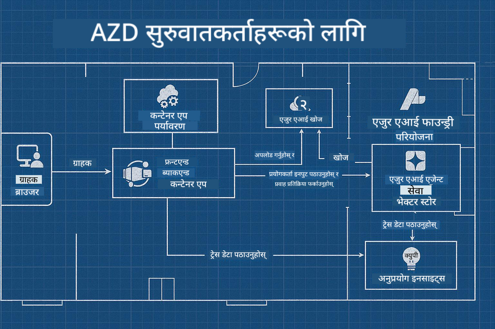

<!--
CO_OP_TRANSLATOR_METADATA:
{
  "original_hash": "245d24997bbcf2bae93bb2a503845d37",
  "translation_date": "2025-09-23T11:49:55+00:00",
  "source_file": "workshop/README.md",
  "language_code": "ne"
}
-->
# AZD for AI Developers Workshop

## AZD टेम्प्लेटहरू

तपाईंको विशेष परिदृश्यको लागि एक उद्यम-स्तरीय AI एप्लिकेसन समाधान निर्माण गर्नु भनेको आफ्नै घर निर्माण गर्ने जस्तै हो। तपाईं यसलाई आफैं डिजाइन गर्न सक्नुहुन्छ, ईंट-दर-ईंट निर्माण गर्न सक्नुहुन्छ, र यो सबै शासन र विकास दिशानिर्देशहरू पूरा गर्न सुनिश्चित गर्ने जिम्मेवारी लिन सक्नुहुन्छ।

**वा ....**

तपाईं एक वास्तुकारसँग काम गर्न सक्नुहुन्छ जसले तपाईंलाई एउटा _ब्लूप्रिन्ट_ दिन सक्छ सुरुवाती घरको लागि, र त्यसपछि तपाईंको आवश्यकताहरूमा _अनुकूलन_ गर्न सहयोग गर्न सक्छ। यसले तपाईंलाई **तपाईंको घर** विशेष बनाउने कुरामा ध्यान केन्द्रित गर्न अनुमति दिन्छ, र आधारभूत तार, प्लम्बिङ र अन्य निर्भरताहरू विशेषज्ञहरूले तपाईंको लागि हेरचाह गर्न अनुमति दिन्छ।

**[AI App Templates](https://ai.azure.com/templates)** को पछाडि यही दृष्टिकोण हो - विभिन्न प्रकारका AI एप्लिकेसन "घरहरू" निर्माण गर्नका लागि ब्लूप्रिन्टहरूको श्रृंखला, तपाईंको मुख्य आवश्यकताहरू र निर्भरताहरूमा आधारित।

## टेम्प्लेट अनुकूलन

टेम्प्लेटहरू [Azure AI Foundry](https://ai.azure.com) सँग काम गर्न डिजाइन गरिएको छ। यस प्लेटफर्मलाई तपाईंको "निर्माण ठेकेदार" को रूपमा सोच्नुहोस्, जसले तपाईंलाई काम सम्पन्न गर्न आवश्यक सबै स्रोतहरू, उपकरणहरू र विशेषज्ञता प्रदान गर्दछ!

तपाईंलाई केवल [तपाईंको सुरुवाती टेम्प्लेटहरू](https://learn.microsoft.com/en-us/azure/ai-foundry/how-to/develop/ai-template-get-started) चयन गर्न आवश्यक छ। उदाहरणका लागि, हामी _Get Started with AI Agents_ टेम्प्लेटमा ध्यान केन्द्रित गर्नेछौं, जसले तपाईंलाई "Agentic AI Home" निर्माण गर्न मद्दत गर्दछ, जसमा AI Search, Red Teaming, Evaluations, Tracing, Monitoring र अन्य सुविधाहरू समावेश छन्!



तपाईंलाई केवल वास्तुकारसँग समय बुक गर्न आवश्यक छ, जसले तपाईंलाई अनुकूलन प्रक्रियामा मार्गदर्शन गर्नेछ। [GitHub Copilot for Azure](https://learn.microsoft.com/en-us/azure/developer/github-copilot-azure/get-started) तपाईंको मार्गदर्शक हुन सक्छ। यससँग "च्याट गर्नुहोस्" र:

- तपाईंको टेम्प्लेटमा Azure सुविधाहरूको बारेमा जान्नुहोस्
- Azure स्रोतहरू तैनात गर्नुहोस्
- तपाईंको तैनातीको बारेमा जानकारी प्राप्त गर्नुहोस्
- समस्या निदान र समाधान गर्नुहोस्!

यस कार्यशालामा, हामी _अवस्थित टेम्प्लेटलाई_ डिकन्स्ट्रक्ट गर्नेछौं (यसले के प्रदान गर्दछ भनेर जान्न), त्यसपछि _अनुकूलन_ गर्नेछौं (हाम्रो आवश्यकताहरू पूरा गर्न) - एक चरणमा।

AI टेम्प्लेटहरूले **काम गर्न सक्षम बनाउँछ** - कार्यशाला पूरा गरेर तपाईंले यसलाई **आफ्नो बनाउने** सिक्नुहुनेछ।

----

**कार्यशाला नेभिगेसन**
- **📚 कोर्स होम**: [AZD For Beginners](../README.md)
- **📖 सम्बन्धित अध्यायहरू**: [Chapter 1](../README.md#-chapter-1-foundation--quick-start), [Chapter 2](../README.md#-chapter-2-ai-first-development-recommended-for-ai-developers), र [Chapter 5](../README.md#-chapter-5-multi-agent-ai-solutions-advanced) समेट्छ।
- **🛠️ प्रयोगात्मक प्रयोगशाला**: [AI Workshop Lab](../docs/ai-foundry/ai-workshop-lab.md)
- **🚀 अर्को चरणहरू**: [Workshop Lab Modules](../../../workshop)

Azure Developer CLI (AZD) सिक्नको लागि AI एप्लिकेसन तैनातीमा केन्द्रित कार्यशालामा स्वागत छ। यो कार्यशाला AZD को आधारभूतदेखि उत्पादन-तयार AI समाधानहरू तैनात गर्नसम्मको यात्रा प्रदान गर्न डिजाइन गरिएको छ।

## कार्यशाला अवलोकन

**अवधि:** २-३ घण्टा  
**स्तर:** प्रारम्भिकदेखि मध्यम  
**पूर्वापेक्षाहरू:** Azure, कमाण्ड लाइन उपकरणहरू, र AI अवधारणाको आधारभूत ज्ञान

### तपाईंले के सिक्नुहुनेछ

- **AZD आधारभूतहरू**: AZD सँग Infrastructure as Code को समझ
- 🤖 **AI सेवा एकीकरण**: Azure OpenAI, AI Search, र अन्य AI सेवाहरू तैनात गर्नु
- **कन्टेनर तैनाती**: AI एप्लिकेसनहरूको लागि Azure Container Apps प्रयोग गर्नु
- **सुरक्षा उत्तम अभ्यासहरू**: Managed Identity र सुरक्षित कन्फिगरेसनहरू लागू गर्नु
- **मोनिटरिङ र अवलोकनीयता**: AI कार्यभारहरूको लागि Application Insights सेटअप गर्नु
- **उत्पादन ढाँचाहरू**: उद्यम-तयार तैनाती रणनीतिहरू

## कार्यशाला संरचना

### मोड्युल १: AZD आधारभूतहरू (३० मिनेट)
- AZD स्थापना र कन्फिगरेसन
- AZD परियोजना संरचनाको समझ
- तपाईंको पहिलो AZD तैनाती
- **प्रयोगशाला**: एउटा साधारण वेब एप्लिकेसन तैनात गर्नुहोस्

### मोड्युल २: Azure OpenAI एकीकरण (४५ मिनेट)
- Azure OpenAI स्रोतहरू सेटअप गर्नु
- मोडेल तैनाती रणनीतिहरू
- API पहुँच र प्रमाणीकरण कन्फिगरेसन
- **प्रयोगशाला**: GPT-4 सँग च्याट एप्लिकेसन तैनात गर्नुहोस्

### मोड्युल ३: RAG एप्लिकेसनहरू (४५ मिनेट)
- Azure AI Search एकीकरण
- Azure Document Intelligence सँग दस्तावेज प्रशोधन
- भेक्टर एम्बेडिङ र सेम्यान्टिक सर्च
- **प्रयोगशाला**: दस्तावेज Q&A प्रणाली निर्माण गर्नुहोस्

### मोड्युल ४: उत्पादन तैनाती (३० मिनेट)
- कन्टेनर एप्स कन्फिगरेसन
- स्केलिङ र प्रदर्शन अनुकूलन
- मोनिटरिङ र लगिङ
- **प्रयोगशाला**: अवलोकनीयतासहित उत्पादनमा तैनात गर्नुहोस्

### मोड्युल ५: उन्नत ढाँचाहरू (१५ मिनेट)
- बहु-पर्यावरण तैनातीहरू
- CI/CD एकीकरण
- लागत अनुकूलन रणनीतिहरू
- **समाप्ति**: उत्पादन तयारी चेकलिस्ट

## पूर्वापेक्षाहरू

### आवश्यक उपकरणहरू

कृपया कार्यशालाको अघि यी उपकरणहरू स्थापना गर्नुहोस्:

```bash
# Azure Developer CLI
curl -fsSL https://aka.ms/install-azd.sh | bash

# Azure CLI
curl -sL https://aka.ms/InstallAzureCLIDeb | sudo bash

# Git
sudo apt-get install git

# Docker
curl -fsSL https://get.docker.com -o get-docker.sh
sudo sh get-docker.sh

# Python 3.10+
sudo apt-get install python3.10 python3.10-venv python3-pip
```

### Azure खाता सेटअप

1. **Azure सदस्यता**: [निःशुल्क साइन अप गर्नुहोस्](https://azure.microsoft.com/free/)
2. **Azure OpenAI पहुँच**: [पहुँच अनुरोध गर्नुहोस्](https://aka.ms/oai/access)
3. **आवश्यक अनुमतिहरू**:
   - सदस्यता वा स्रोत समूहमा Contributor भूमिका
   - User Access Administrator (RBAC असाइनमेन्टहरूको लागि)

### पूर्वापेक्षाहरू प्रमाणित गर्नुहोस्

तपाईंको सेटअप प्रमाणित गर्न यो स्क्रिप्ट चलाउनुहोस्:

```bash
#!/bin/bash
echo "Verifying workshop prerequisites..."

# Check AZD installation
if command -v azd &> /dev/null; then
    echo "✅ Azure Developer CLI: $(azd --version)"
else
    echo "❌ Azure Developer CLI not found"
fi

# Check Azure CLI
if command -v az &> /dev/null; then
    echo "✅ Azure CLI: $(az --version | head -n1)"
else
    echo "❌ Azure CLI not found"
fi

# Check Docker
if command -v docker &> /dev/null; then
    echo "✅ Docker: $(docker --version)"
else
    echo "❌ Docker not found"
fi

# Check Python
if command -v python3 &> /dev/null; then
    echo "✅ Python: $(python3 --version)"
else
    echo "❌ Python 3 not found"
fi

# Check Azure login
if az account show &> /dev/null; then
    echo "✅ Azure: Logged in as $(az account show --query user.name -o tsv)"
else
    echo "❌ Azure: Not logged in (run 'az login')"
fi

echo "Setup verification complete!"
```

## कार्यशाला सामग्रीहरू

### प्रयोगशाला अभ्यासहरू

प्रत्येक मोड्युलमा सुरुवाती कोड र चरण-दर-चरण निर्देशनहरू सहित प्रयोगात्मक प्रयोगशालाहरू समावेश छन्:

- **[lab-1-azd-basics/](../../../workshop/lab-1-azd-basics)** - तपाईंको पहिलो AZD तैनाती
- **[lab-2-openai-chat/](../../../workshop/lab-2-openai-chat)** - Azure OpenAI सँग च्याट एप्लिकेसन
- **[lab-3-rag-search/](../../../workshop/lab-3-rag-search)** - AI Search सँग RAG एप्लिकेसन
- **[lab-4-production/](../../../workshop/lab-4-production)** - उत्पादन तैनाती ढाँचाहरू
- **[lab-5-advanced/](../../../workshop/lab-5-advanced)** - उन्नत तैनाती परिदृश्यहरू

### सन्दर्भ सामग्रीहरू

- **[AI Foundry Integration Guide](../docs/ai-foundry/azure-ai-foundry-integration.md)** - व्यापक एकीकरण ढाँचाहरू
- **[AI Model Deployment Guide](../docs/ai-foundry/ai-model-deployment.md)** - मोडेल तैनाती उत्तम अभ्यासहरू
- **[Production AI Practices](../docs/ai-foundry/production-ai-practices.md)** - उद्यम तैनाती ढाँचाहरू
- **[AI Troubleshooting Guide](../docs/troubleshooting/ai-troubleshooting.md)** - सामान्य समस्याहरू र समाधानहरू

### नमूना टेम्प्लेटहरू

सामान्य AI परिदृश्यहरूको लागि छिटो सुरुवात टेम्प्लेटहरू:

```
workshop/templates/
├── minimal-chat/          # Basic OpenAI chat app
├── rag-application/       # RAG with AI Search
├── multi-model/          # Multiple AI services
└── production-ready/     # Enterprise template
```

## सुरु गर्दै

### विकल्प १: GitHub Codespaces (सिफारिस गरिएको)

कार्यशाला सुरु गर्ने सबैभन्दा छिटो तरिका:

[](https://github.com/codespaces/new?hide_repo_select=true&ref=main&repo=YOUR_REPO_ID)

### विकल्प २: स्थानीय विकास

1. **कार्यशाला रिपोजिटरी क्लोन गर्नुहोस्:**
```bash
git clone https://github.com/YOUR_ORG/AZD-for-beginners.git
cd AZD-for-beginners/workshop
```

2. **Azure मा लगइन गर्नुहोस्:**
```bash
az login
azd auth login
```

3. **प्रयोगशाला १ बाट सुरु गर्नुहोस्:**
```bash
cd lab-1-azd-basics
cat README.md  # Follow the instructions
```

### विकल्प ३: प्रशिक्षक-नेतृत्व कार्यशाला

यदि तपाईं प्रशिक्षक-नेतृत्व सत्रमा भाग लिँदै हुनुहुन्छ भने:

- 🎥 **कार्यशाला रेकर्डिङ**: [मागमा उपलब्ध](https://aka.ms/azd-ai-workshop)
- 💬 **Discord समुदाय**: [प्रत्यक्ष समर्थनको लागि सामेल हुनुहोस्](https://aka.ms/foundry/discord)
- **कार्यशाला प्रतिक्रिया**: [तपाईंको अनुभव साझा गर्नुहोस्](https://aka.ms/azd-workshop-feedback)

## कार्यशाला समयरेखा

### आत्म-गति सिकाइ (३ घण्टा)

```
⏰ 00:00 - 00:30  Module 1: AZD Foundations
⏰ 00:30 - 01:15  Module 2: Azure OpenAI Integration
⏰ 01:15 - 02:00  Module 3: RAG Applications
⏰ 02:00 - 02:30  Module 4: Production Deployment
⏰ 02:30 - 02:45  Module 5: Advanced Patterns
⏰ 02:45 - 03:00  Q&A and Next Steps
```

### प्रशिक्षक-नेतृत्व सत्र (२.५ घण्टा)

```
⏰ 00:00 - 00:15  Welcome & Prerequisites Check
⏰ 00:15 - 00:40  Module 1: Live Demo + Lab
⏰ 00:40 - 01:20  Module 2: OpenAI Integration
⏰ 01:20 - 01:30  Break
⏰ 01:30 - 02:10  Module 3: RAG Applications
⏰ 02:10 - 02:30  Module 4: Production Patterns
⏰ 02:30 - 02:45  Module 5: Advanced Topics
⏰ 02:45 - 03:00  Q&A and Resources
```

## सफलता मापदण्ड

कार्यशाला समाप्त गर्दा, तपाईं सक्षम हुनुहुनेछ:

✅ **AI एप्लिकेसनहरू तैनात गर्नुहोस्** AZD टेम्प्लेटहरू प्रयोग गरेर  
✅ **Azure OpenAI कन्फिगर गर्नुहोस्** उचित सुरक्षासहित  
✅ **RAG एप्लिकेसनहरू निर्माण गर्नुहोस्** Azure AI Search एकीकरणको साथ  
✅ **उत्पादन ढाँचाहरू लागू गर्नुहोस्** उद्यम AI कार्यभारहरूको लागि  
✅ **AI एप्लिकेसन तैनातीहरू मोनिटर र समस्या समाधान गर्नुहोस्**  
✅ **AI कार्यभारहरूको लागि लागत अनुकूलन रणनीतिहरू लागू गर्नुहोस्**  

## समुदाय र समर्थन

### कार्यशालाको समयमा

- 🙋 **प्रश्नहरू**: कार्यशाला च्याट प्रयोग गर्नुहोस् वा हात उठाउनुहोस्
- 🐛 **समस्याहरू**: [समस्या समाधान मार्गदर्शक](../docs/troubleshooting/ai-troubleshooting.md) जाँच गर्नुहोस्
- **टिप्स**: अन्य सहभागीहरूसँग खोजहरू साझा गर्नुहोस्

### कार्यशालापछि

- 💬 **Discord**: [Azure AI Foundry समुदाय](https://aka.ms/foundry/discord)
- **GitHub Issues**: [टेम्प्लेट समस्याहरू रिपोर्ट गर्नुहोस्](https://github.com/YOUR_ORG/AZD-for-beginners/issues)
- 📧 **प्रतिक्रिया**: [कार्यशाला मूल्यांकन फारम](https://aka.ms/azd-workshop-feedback)

## अर्को चरणहरू

### सिकाइ जारी राख्नुहोस्

1. **उन्नत परिदृश्यहरू**: [बहु-क्षेत्र तैनातीहरू](../docs/ai-foundry/production-ai-practices.md#multi-region-deployment) अन्वेषण गर्नुहोस्
2. **CI/CD एकीकरण**: [GitHub Actions वर्कफ्लोहरू](../docs/deployment/github-actions.md) सेटअप गर्नुहोस्
3. **अनुकूलित टेम्प्लेटहरू**: [आफ्नै AZD टेम्प्लेटहरू](../docs/getting-started/custom-templates.md) सिर्जना गर्नुहोस्

### तपाईंको परियोजनाहरूमा लागू गर्नुहोस्

1. **मूल्यांकन**: हाम्रो [तयारी चेकलिस्ट](./production-readiness-checklist.md) प्रयोग गर्नुहोस्
2. **टेम्प्लेटहरू**: हाम्रो [AI-विशिष्ट टेम्प्लेटहरू](../../../workshop/templates) बाट सुरु गर्नुहोस्
3. **समर्थन**: [Azure AI Foundry Discord](https://aka.ms/foundry/discord) मा सामेल हुनुहोस्

### तपाईंको सफलता साझा गर्नुहोस्

- ⭐ **रिपोजिटरी स्टार गर्नुहोस्** यदि यो कार्यशालाले तपाईंलाई मद्दत गर्यो भने
- 🐦 **सामाजिक सञ्जालमा साझा गर्नुहोस्** #AzureDeveloperCLI #AzureAI प्रयोग गरेर
- 📝 **ब्लग पोस्ट लेख्नुहोस्** तपाईंको AI तैनाती यात्राको बारेमा

---

## कार्यशाला प्रतिक्रिया

तपाईंको प्रतिक्रिया कार्यशाला अनुभव सुधार गर्न मद्दत गर्दछ:

| पक्ष | रेटिङ (१-५) | टिप्पणीहरू |
|------|-------------|-----------|
| सामग्रीको गुणस्तर | ⭐⭐⭐⭐⭐ | |
| प्रयोगात्मक प्रयोगशालाहरू | ⭐⭐⭐⭐⭐ | |
| दस्तावेजीकरण | ⭐⭐⭐⭐⭐ | |
| कठिनाई स्तर | ⭐⭐⭐⭐⭐ | |
| समग्र अनुभव | ⭐⭐⭐⭐⭐ | |

**प्रतिक्रिया दिनुहोस्**: [कार्यशाला मूल्यांकन फारम](https://aka.ms/azd-workshop-feedback)

---

**अघिल्लो:** [AI Troubleshooting Guide](../docs/troubleshooting/ai-troubleshooting.md) | **अर्को:** [Lab 1: AZD Basics](../../../workshop/lab-1-azd-basics) बाट सुरु गर्नुहोस्

**AZD सँग AI एप्लिकेसनहरू निर्माण गर्न तयार हुनुहुन्छ?**

[Lab 1: AZD Foundations →](./lab-1-azd-basics/README.md) बाट सुरु गर्नुहोस्

---

