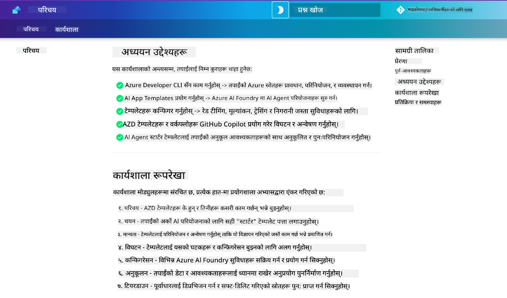

<!--
CO_OP_TRANSLATOR_METADATA:
{
  "original_hash": "9cc966416ab431c38b2ab863884b196c",
  "translation_date": "2025-09-24T13:39:05+00:00",
  "source_file": "workshop/README.md",
  "language_code": "ne"
}
-->
# AZD for AI Developers Workshop

Azure Developer CLI (AZD) को प्रयोग गरेर AI एप्लिकेशन तैनाती सिक्नको लागि यो व्यावहारिक कार्यशालामा स्वागत छ। यो कार्यशालाले AZD टेम्प्लेटहरूको प्रयोगात्मक समझ तीन चरणमा प्रदान गर्दछ:

1. **खोज** - तपाईंको लागि उपयुक्त टेम्प्लेट पत्ता लगाउनुहोस्।
1. **तैनाती** - तैनाती गर्नुहोस् र यसको कार्यक्षमता प्रमाणित गर्नुहोस्।
1. **अनुकूलन** - परिमार्जन गर्नुहोस् र यसलाई आफ्नो बनाउनुहोस्!

यस कार्यशालाको क्रममा, तपाईंलाई कोर डेभलपर उपकरणहरू र कार्यप्रवाहहरूको परिचय पनि दिइनेछ, जसले तपाईंको अन्त-देखि-अन्त विकास यात्रा सरल बनाउन मद्दत गर्नेछ।

<br/>

## ब्राउजर-आधारित मार्गदर्शन

कार्यशालाका पाठहरू Markdown मा छन्। तपाईं तिनीहरूलाई GitHub मा सिधै नेभिगेट गर्न सक्नुहुन्छ - वा तलको स्क्रिनशटमा देखाइएको जस्तै ब्राउजर-आधारित पूर्वावलोकन सुरु गर्न सक्नुहुन्छ।



यो विकल्प प्रयोग गर्न - रिपोजिटरीलाई आफ्नो प्रोफाइलमा फोर्क गर्नुहोस्, र GitHub Codespaces सुरु गर्नुहोस्। एक पटक VS Code टर्मिनल सक्रिय भएपछि, यो कमाण्ड टाइप गर्नुहोस्:

```bash title="" linenums="0"
mkdocs serve > /dev/null 2>&1 &
```

केही सेकेन्डमा, तपाईंले एउटा पप-अप संवाद देख्नुहुनेछ। `Open in browser` विकल्प चयन गर्नुहोस्। वेब-आधारित मार्गदर्शन अब नयाँ ब्राउजर ट्याबमा खुल्नेछ। यस पूर्वावलोकनका केही फाइदाहरू:

1. **निर्मित खोज** - चाँडै कीवर्ड वा पाठहरू खोज्नुहोस्।
1. **कपी आइकन** - कोडब्लकहरूमा होभर गर्दा यो विकल्प देख्नुहोस्।
1. **थिम टगल** - डार्क र लाइट थिमहरू बीच स्विच गर्नुहोस्।
1. **मदत प्राप्त गर्नुहोस्** - फुटरमा Discord आइकन क्लिक गरेर सामेल हुनुहोस्!

<br/>

## कार्यशालाको अवलोकन

**अवधि:** ३-४ घण्टा  
**स्तर:** प्रारम्भिकदेखि मध्यम  
**पूर्वशर्तहरू:** Azure, AI अवधारणाहरू, VS Code र कमाण्ड-लाइन उपकरणहरूको परिचय।

यो व्यावहारिक कार्यशाला हो जहाँ तपाईं अभ्यास गरेर सिक्नुहुन्छ। अभ्यासहरू पूरा गरेपछि, सुरक्षा र उत्पादकता उत्कृष्ट अभ्यासहरूमा आफ्नो सिकाइ यात्रा जारी राख्न AZD For Beginners पाठ्यक्रम समीक्षा गर्न सिफारिस गरिन्छ।

| समय| मोड्युल  | उद्देश्य |
|:---|:---|:---|
| १५ मिनेट | [परिचय](docs/instructions/0-Introduction.md) | लक्ष्यहरू बुझ्नुहोस् |
| ३० मिनेट | [AI टेम्प्लेट चयन गर्नुहोस्](docs/instructions/1-Select-AI-Template.md) | विकल्प अन्वेषण गर्नुहोस् र सुरु गर्नुहोस् | 
| ३० मिनेट | [AI टेम्प्लेट प्रमाणित गर्नुहोस्](docs/instructions/2-Validate-AI-Template.md) | Azure मा डिफल्ट समाधान तैनाती गर्नुहोस् |
| ३० मिनेट | [AI टेम्प्लेट विघटन गर्नुहोस्](docs/instructions/3-Deconstruct-AI-Template.md) | संरचना र कन्फिगरेसन अन्वेषण गर्नुहोस् |
| ३० मिनेट | [AI टेम्प्लेट कन्फिगर गर्नुहोस्](docs/instructions/4-Configure-AI-Template.md) | उपलब्ध सुविधाहरू सक्रिय गर्नुहोस् र प्रयास गर्नुहोस् |
| ३० मिनेट | [AI टेम्प्लेट अनुकूलन गर्नुहोस्](docs/instructions/5-Customize-AI-Template.md) | टेम्प्लेटलाई आफ्नो आवश्यकतामा अनुकूल बनाउनुहोस् |
| ३० मिनेट | [इन्फ्रास्ट्रक्चर हटाउनुहोस्](docs/instructions/6-Teardown-Infrastructure.md) | सफा गर्नुहोस् र स्रोतहरू रिलीज गर्नुहोस् |
| १५ मिनेट | [समाप्ति र अर्को चरणहरू](docs/instructions/7-Wrap-up.md) | सिकाइ स्रोतहरू, कार्यशाला चुनौती |

<br/>

## तपाईंले के सिक्नुहुनेछ

AZD टेम्प्लेटलाई Azure AI Foundry मा अन्त-देखि-अन्त विकासको लागि विभिन्न क्षमताहरू र उपकरणहरू अन्वेषण गर्नको लागि सिकाइ स्यान्डबक्सको रूपमा सोच्नुहोस्। कार्यशाला समाप्त भएपछि, तपाईंले यस सन्दर्भमा विभिन्न उपकरणहरू र अवधारणाहरूको सहज समझ प्राप्त गर्नुहुनेछ।

| अवधारणा  | उद्देश्य |
|:---|:---|
| **Azure Developer CLI** | उपकरण कमाण्डहरू र कार्यप्रवाहहरू बुझ्नुहोस् |
| **AZD टेम्प्लेटहरू**| परियोजना संरचना र कन्फिगरेसन बुझ्नुहोस् |
| **Azure AI Agent**| Azure AI Foundry परियोजना प्रावधान र तैनाती गर्नुहोस् |
| **Azure AI Search**| एजेन्टहरूसँग सन्दर्भ इन्जिनियरिङ सक्षम गर्नुहोस् |
| **अवलोकनीयता**| ट्रेसिङ, अनुगमन र मूल्याङ्कन अन्वेषण गर्नुहोस् |
| **रेड टिमिङ**| प्रतिकूल परीक्षण र समाधानहरू अन्वेषण गर्नुहोस् |

<br/>

## कार्यशालाको संरचना

कार्यशालाले तपाईंलाई टेम्प्लेट खोजदेखि तैनाती, विघटन, र अनुकूलनसम्मको यात्रा गराउँछ - आधिकारिक [Getting Started with AI Agents](https://github.com/Azure-Samples/get-started-with-ai-agents) स्टार्टर टेम्प्लेटलाई आधार बनाएर।

### [मोड्युल १: AI टेम्प्लेट चयन गर्नुहोस्](docs/instructions/1-Select-AI-Template.md) (३० मिनेट)

- AI टेम्प्लेटहरू के हुन्?
- AI टेम्प्लेटहरू कहाँ पाउन सकिन्छ?
- AI एजेन्टहरू निर्माण गर्न कसरी सुरु गर्न सकिन्छ?
- **प्रयोगशाला**: GitHub Codespaces को साथ क्विकस्टार्ट

### [मोड्युल २: AI टेम्प्लेट प्रमाणित गर्नुहोस्](docs/instructions/2-Validate-AI-Template.md) (३० मिनेट)

- AI टेम्प्लेट आर्किटेक्चर के हो?
- AZD विकास कार्यप्रवाह के हो?
- AZD विकासमा कसरी मदत प्राप्त गर्न सकिन्छ?
- **प्रयोगशाला**: AI एजेन्ट टेम्प्लेट तैनाती र प्रमाणित गर्नुहोस्

### [मोड्युल ३: AI टेम्प्लेट विघटन गर्नुहोस्](docs/instructions/3-Deconstruct-AI-Template.md) (३० मिनेट)

- आफ्नो वातावरण `.azure/` मा अन्वेषण गर्नुहोस् 
- आफ्नो स्रोत सेटअप `infra/` मा अन्वेषण गर्नुहोस् 
- आफ्नो AZD कन्फिगरेसन `azure.yaml` मा अन्वेषण गर्नुहोस्
- **प्रयोगशाला**: वातावरण चरहरू परिमार्जन गर्नुहोस् र पुनः तैनाती गर्नुहोस्

### [मोड्युल ४: AI टेम्प्लेट कन्फिगर गर्नुहोस्](docs/instructions/4-Configure-AI-Template.md) (३० मिनेट)
- अन्वेषण गर्नुहोस्: Retrieval Augmented Generation
- अन्वेषण गर्नुहोस्: एजेन्ट मूल्याङ्कन र रेड टिमिङ
- अन्वेषण गर्नुहोस्: ट्रेसिङ र अनुगमन
- **प्रयोगशाला**: AI एजेन्ट + अवलोकनीयता अन्वेषण गर्नुहोस् 

### [मोड्युल ५: AI टेम्प्लेट अनुकूलन गर्नुहोस्](docs/instructions/5-Customize-AI-Template.md) (३० मिनेट)
- परिभाषित गर्नुहोस्: परिदृश्य आवश्यकताहरूको साथ PRD
- कन्फिगर गर्नुहोस्: AZD को लागि वातावरण चरहरू
- कार्यान्वयन गर्नुहोस्: थप कार्यहरूको लागि लाइफसाइकल हुकहरू
- **प्रयोगशाला**: मेरो परिदृश्यको लागि टेम्प्लेट अनुकूलन गर्नुहोस्

### [मोड्युल ६: इन्फ्रास्ट्रक्चर हटाउनुहोस्](docs/instructions/6-Teardown-Infrastructure.md) (३० मिनेट)
- पुनरावलोकन गर्नुहोस्: AZD टेम्प्लेटहरू के हुन्?
- पुनरावलोकन गर्नुहोस्: Azure Developer CLI किन प्रयोग गर्ने?
- अर्को चरणहरू: फरक टेम्प्लेट प्रयास गर्नुहोस्!
- **प्रयोगशाला**: इन्फ्रास्ट्रक्चर हटाउनुहोस् र सफा गर्नुहोस्

<br/>

## कार्यशाला चुनौती

आफ्नो क्षमता बढाउन चाहनुहुन्छ? यहाँ केही परियोजना सुझावहरू छन् - वा आफ्नो विचारहरू हामीसँग साझा गर्नुहोस्!!

| परियोजना | विवरण |
|:---|:---|
|१. **जटिल AI टेम्प्लेट विघटन गर्नुहोस्** | हामीले उल्लेख गरेको कार्यप्रवाह र उपकरणहरू प्रयोग गरेर फरक AI समाधान टेम्प्लेट तैनाती, प्रमाणित, र अनुकूलन गर्न सक्नुहुन्छ। _तपाईंले के सिक्नुभयो?_|
|२. **आफ्नो परिदृश्यसँग अनुकूलन गर्नुहोस्**  | फरक परिदृश्यको लागि PRD (Product Requirements Document) लेख्ने प्रयास गर्नुहोस्। त्यसपछि GitHub Copilot लाई आफ्नो टेम्प्लेट रिपोमा Agent मोडेलमा प्रयोग गर्नुहोस् - र यसलाई अनुकूलन कार्यप्रवाह उत्पन्न गर्न सोध्नुहोस्। _तपाईंले के सिक्नुभयो? यी सुझावहरू सुधार गर्न कसरी सकिन्छ?_|
| | |

## प्रतिक्रिया छ?

1. यस रिपोजिटरीमा एउटा इश्यू पोस्ट गर्नुहोस् - यसलाई `Workshop` ट्याग गर्नुहोस्।
1. Azure AI Foundry Discord मा सामेल हुनुहोस् - आफ्नो सहकर्मीहरूसँग जडान गर्नुहोस्!


| | | 
|:---|:---|
| **📚 कोर्स होम**| [AZD For Beginners](../README.md)|
| **📖 दस्तावेजीकरण** | [AI टेम्प्लेटहरू सुरु गर्नुहोस्](https://learn.microsoft.com/en-us/azure/ai-foundry/how-to/develop/ai-template-get-started)|
| **🛠️AI टेम्प्लेटहरू** | [Azure AI Foundry Templates](https://ai.azure.com/templates) |
|**🚀 अर्को चरणहरू** | [चुनौती लिनुहोस्](../../../workshop) |
| | |

<br/>

---

**अघिल्लो:** [AI Troubleshooting Guide](../docs/troubleshooting/ai-troubleshooting.md) | **अर्को:** [Lab 1: AZD Basics](../../../workshop/lab-1-azd-basics) बाट सुरु गर्नुहोस्

**AZD को साथ AI एप्लिकेशन निर्माण गर्न तयार हुनुहुन्छ?**

[Lab 1: AZD Foundations →](./lab-1-azd-basics/README.md) बाट सुरु गर्नुहोस्

---

