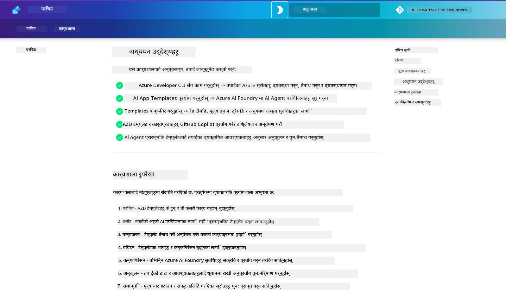

<div align="center">
  <div style="background: linear-gradient(135deg, #0078d4, #106ebe); border-radius: 10px; padding: 20px; margin: 20px 0; box-shadow: 0 4px 15px rgba(0, 120, 212, 0.3); border: 2px solid #005a9e;">
    <h2 style="color: white; margin: 0; font-size: 24px; text-shadow: 1px 1px 2px rgba(0,0,0,0.3);">
      🎯 AI विकासकर्ताहरूका लागि AZD कार्यशाला
    </h2>
    <p style="color: white; margin: 10px 0 0 0; font-size: 16px; text-shadow: 1px 1px 2px rgba(0,0,0,0.3);">
      <strong>Azure Developer CLI प्रयोग गरी AI अनुप्रयोगहरू निर्माण गर्ने व्यावहारिक कार्यशाला।</strong><br>
      AZD टेम्पलेटहरू र AI परिनियोजन कार्यप्रवाहमा पारंगत हुन 7 मोड्युलहरू पूरा गर्नुहोस्।
    </p>
    <div style="margin-top: 15px;">
      <span style="background: rgba(255,255,255,0.2); padding: 5px 10px; border-radius: 15px; color: white; font-size: 14px;">
        📅 पछिल्लो अद्यावधिक: February 2026
      </span>
    </div>
  </div>
</div>

# AI विकासकर्ताहरूका लागि AZD कार्यशाला

Azure Developer CLI (AZD) सिक्ने व्यावहारिक कार्यशालामा स्वागत छ जसले AI अनुप्रयोग परिनियोजनमा केन्द्रित छ। यस कार्यशालाले तपाईंलाई AZD टेम्पलेटहरूको व्यावहारिक समझ 3 चरणमा प्राप्त गर्न मद्दत गर्छ:

1. **खोज** - आफ्नो लागि उपयुक्त टेम्पलेट पत्ता लगाउनुहोस्।
1. **परिनियोजन** - परिनियोजन गर्नुहोस् र काम गर्छ कि गर्दैन भनि प्रमाणित गर्नुहोस्
1. **अनुकूलन** - संशोधन गर्नुहोस् र यो तपाईंको बनाउनुहोस्!

यस कार्यशालाको क्रममा, तपाईंलाई मुख्य विकास उपकरणहरू र कार्यप्रवाहहरू पनि परिचित गराइनेछ, जसले तपाईंको अन्तदेखि-अन्त विकास यात्रा सहज बनाउँछ।

<br/>

## ब्राउजर-आधारित मार्गदर्शक

कार्यशाला पाठहरू Markdown मा छन्। तपाईं तिनीहरूलाई प्रत्यक्ष रूपमा GitHub मा नेभिगेट गर्न सक्नुहुन्छ - वा तलको स्क्रीनशटमा देखाइएको जस्तो ब्राउजर-आधारित पूर्वावलोकन पनि सुरु गर्न सक्नुहुन्छ।



यो विकल्प प्रयोग गर्न - रिपोजिटरीलाई आफ्नो प्रोफाइलमा fork गर्नुहोस्, र GitHub Codespaces सुरु गर्नुहोस्। एकपटक VS Code टर्मिनल सक्रिय भएपछि, यो कमाण्ड टाइप गर्नुहोस्:

```bash title="" linenums="0"
mkdocs serve > /dev/null 2>&1 &
```

केही सेकेन्डमा, तपाईंले एउटा पप-अप संवाद देख्नुहुनेछ। `ब्राउजरमा खोल्नुहोस्` विकल्प छान्नुहोस्। वेब-आधारित मार्गदर्शक अब नयाँ ब्राउजर ट्याबमा खुल्नेछ। यस पूर्वावलोकनका केही फाइदाहरू:

1. **बिल्ट-इन सर्च** - कुञ्जीशब्द वा पाठहरू छिटो फेला पार्नुहोस्।
1. **कपी आइकन** - कोडब्लकहरू माथि होभर गर्दा यो विकल्प देखिन्छ
1. **थिम टगल** - डार्क र लाइट थिमहरू बीच स्विच गर्नुहोस्
1. **मदत पाउनुहोस्** - फुटरमा रहेको Discord आइकनमा क्लिक गरेर सामेल हुनुहोस्!

<br/>

## कार्यशाला अवलोकन

**अवधि:** 3-4 घण्टा  
**स्तर:** प्रारम्भिक देखि मध्यवर्ती  
**पूर्वआवश्यकताहरू:** Azure, AI अवधारणाहरू, VS Code र कमाण्ड-लाइन उपकरणहरूसँग परिचित हुनु।

यो एक व्यावहारिक कार्यशाला हो जहाँ तपाईं अभ्यास गरेर सिक्नुहुन्छ। एकपटक अभ्यासहरू पूरा भएपछि, हामी सिफारिस गर्छौँ कि तपाईं सिकाइ यात्रा जारी राख्न AZD For Beginners पाठ्यक्रम समीक्षा गर्नुहोस् जसले सुरक्षा र उत्पादकताका उत्तम अभ्यासहरूमा मार्गदर्शन गर्छ।

| समय| मोड्युल  | उद्देश्य |
|:---|:---|:---|
| 15 mins | [परिचय](docs/instructions/0-Introduction.md) | प्रसंग सेट गर्नुहोस्, लक्ष्यहरू बुझ्नुहोस् |
| 30 mins | [AI टेम्पलेट छान्नुहोस्](docs/instructions/1-Select-AI-Template.md) | विकल्पहरू अन्वेषण गर्नुहोस् र सुरुका लागि छान्नुहोस् | 
| 30 mins | [AI टेम्पलेट प्रमाणित गर्नुहोस्](docs/instructions/2-Validate-AI-Template.md) | पूर्वनिर्धारित समाधान Azure मा परिनियोजन गर्नुहोस् |
| 30 mins | [AI टेम्पलेट विखण्डन गर्नुहोस्](docs/instructions/3-Deconstruct-AI-Template.md) | संरचना र कन्फिगरेसन अन्वेषण गर्नुहोस् |
| 30 mins | [AI टेम्पलेट कन्फिगर गर्नुहोस्](docs/instructions/4-Configure-AI-Template.md) | उपलब्ध सुविधाहरू सक्षम गर्नुहोस् र प्रयास गर्नुहोस् |
| 30 mins | [AI टेम्पलेट अनुकूलन गर्नुहोस्](docs/instructions/5-Customize-AI-Template.md) | टेम्पलेटलाई तपाईंको आवश्यकताहरू अनुसार अनुकूलित गर्नुहोस् |
| 30 mins | [पूर्वाधार हटाउनुहोस्](docs/instructions/6-Teardown-Infrastructure.md) | संसाधनहरू सफा र मुक्त गर्नुहोस् |
| 15 mins | [समापन र आगामी चरणहरू](docs/instructions/7-Wrap-up.md) | सिकाइ स्रोतहरू, कार्यशाला चुनौती |

<br/>

## तपाईंले के सिक्नुहुनेछ

AZD टेम्पलेटलाई एक सिकाइ स्यान्डबक्सको रूपमा सोच्नुहोस् जसले Microsoft Foundry मा अन्तदेखि-अन्त विकासका विभिन्न क्षमताहरू र उपकरणहरू अन्वेषण गर्न मद्दत गर्छ। यस कार्यशालाको अन्त्यसम्म, तपाईंले यस सन्दर्भमा विविध उपकरणहरू र अवधारणाहरूको सहज अनुभव प्राप्त गर्नुपर्छ।

| अवधारणा  | उद्देश्य |
|:---|:---|
| **Azure Developer CLI** | उपकरण आदेशहरू र कार्यप्रवाहहरू बुझ्नुहोस्|
| **AZD Templates**| प्रोजेक्ट संरचना र कन्फिग बुझ्नुहोस्|
| **Azure AI Agent**| Microsoft Foundry प्रोजेक्ट प्रोभिजन र परिनियोजन गर्नुहोस्  |
| **Azure AI Search**| एजेन्टहरूसँग सन्दर्भ इन्जिनियरिङ सक्षम गर्नुहोस् |
| **Observability**| ट्रेसिङ, निगरानी र मूल्याङ्कन अन्वेषण गर्नुहोस् |
| **Red Teaming**| विपरीत परीक्षण र न्यूनीकरण अन्वेषण गर्नुहोस् |

<br/>

## कार्यशाला संरचना

कार्यशाला यसरी संरचित गरिएको छ कि तपाईंलाई टेम्पलेट खोजबाट लिएर परिनियोजन, विखण्डन, र अनुकूलनसम्म यात्रा गराइयो - आधिकारिक [Getting Started with AI Agents](https://github.com/Azure-Samples/get-started-with-ai-agents) स्टार्टर टेम्पलेटलाई आधार बनाएर।

### [मोड्युल 1: AI टेम्पलेट छान्नुहोस्](docs/instructions/1-Select-AI-Template.md) (30 mins)

- AI टेम्पलेट के हुन्?
- AI टेम्पलेटहरू कहाँ पाउन सकिन्छ?
- म AI एजेन्टहरू बनाउने कसरी सुरु गर्न सक्छु?
- **प्रयोगशाला**: GitHub Codespaces सँग छिटो सुरुवात

### [मोड्युल 2: AI टेम्पलेट प्रमाणित गर्नुहोस्](docs/instructions/2-Validate-AI-Template.md) (30 mins)

- AI टेम्पलेट आर्किटेक्चर के हो?
- AZD विकास कार्यप्रवाह के हो?
- AZD विकासमा सहयोग कसरी पाउन सकिन्छ?
- **प्रयोगशाला**: AI एजेन्ट्स टेम्पलेट परिनियोजन र मान्यकरण

### [मोड्युल 3: AI टेम्पलेट विखण्डन गर्नुहोस्](docs/instructions/3-Deconstruct-AI-Template.md) (30 mins)

- तपाईंको वातावरण अन्वेषण गर्नुहोस् `.azure/` 
- तपाईंको स्रोत सेटअप अन्वेषण गर्नुहोस् `infra/` 
- तपाईंको AZD कन्फिगरेसन अन्वेषण गर्नुहोस् `azure.yaml`s
- **प्रयोगशाला**: वातावरण भेरिएबलहरू संशोधन गर्नुहोस् & पुनः परिनियोजन

### [मोड्युल 4: AI टेम्पलेट कन्फिगर गर्नुहोस्](docs/instructions/4-Configure-AI-Template.md) (30 mins)
- अन्वेषण: Retrieval Augmented Generation
- अन्वेषण: Agent Evaluation & Red Teaming
- अन्वेषण: ट्रेसिङ & निगरानी
- **प्रयोगशाला**: AI एजेन्ट + अवलोकन अन्वेषण

### [मोड्युल 5: AI टेम्पलेट अनुकूलन गर्नुहोस्](docs/instructions/5-Customize-AI-Template.md) (30 mins)
- परिभाषित गर्नुहोस्: परिदृश्य आवश्यकताहरू सहित PRD
- कन्फिगर गर्नुहोस्: AZD का लागि वातावरण भेरिएबलहरू
- कार्यान्वयन गर्नुहोस्: थप कार्यहरूको लागि लाइफसाइकल हुकहरू
- **प्रयोगशाला**: मेरो परिदृश्यका लागि टेम्पलेट अनुकूलन गर्नुहोस्

### [मोड्युल 6: पूर्वाधार हटाउनुहोस्](docs/instructions/6-Teardown-Infrastructure.md) (30 mins)
- पुनरावलोकन: AZD टेम्पलेटहरू के हुन्?
- पुनरावलोकन: किन Azure Developer CLI प्रयोग गर्ने?
- अगाडिको कदम: फरक टेम्पलेट प्रयास गर्नुहोस्!
- **प्रयोगशाला**: पूर्वाधार हटाउने र सफा गर्ने

<br/>

## कार्यशाला चुनौती

आफ्नो क्षमतालाई थप चुनौती दिन चाहनुहुन्छ? यहाँ केहि परियोजना सुझावहरू छन् - वा तपाईंका विचारहरू हामीसँग साझा गर्नुहोस्!!

| परियोजना | विवरण |
|:---|:---|
|1. **एक जटिल AI टेम्पलेट विखण्डन गर्नुहोस्** | हामीले व्याख्या गरेका कार्यप्रवाह र उपकरणहरू प्रयोग गरेर हेर्नुहोस् कि तपाईं फरक AI समाधान टेम्पलेट परिनियोजन, प्रमाणिकरण, र अनुकूलन गर्न सक्नुहुन्छ कि सक्दैन। _तपाईंले के सिक्नुभयो?_|
|2. **आफ्नो परिदृश्यसँग अनुकूलन गर्नुहोस्**  | फरक परिदृश्यका लागि PRD (Product Requirements Document) लेख्ने प्रयास गर्नुहोस्। त्यसपछि आफ्नो टेम्पलेट रेपोमा Agent Model मा GitHub Copilot प्रयोग गर्नुहोस् - र यसलाई तपाईंका लागि अनुकूलन कार्यप्रवाह जनरेट गर्न भन्नुहोस्। _तपाईंले के सिक्नुभयो? यी सुझावहरू कसरी सुधार गर्न सक्नुहुन्छ?_|
| | |

## प्रतिक्रिया छ?

1. यस रेपोमा एउटा issue पोस्ट गर्नुहोस् - सुविधा को लागि `Workshop` ट्याग गर्नुहोस्।
1. Microsoft Foundry Discord मा सामेल हुनुहोस् - आफ्नो सहकर्मीहरूसँग जडान हुनुहोस्!


| | | 
|:---|:---|
| **📚 पाठ्यक्रम गृह**| [AZD आरम्भिकका लागि](../README.md)|
| **📖 कागजातहरू** | [AI टेम्पलेटहरूसँग सुरु गर्ने](https://learn.microsoft.com/en-us/azure/ai-foundry/how-to/develop/ai-template-get-started)|
| **🛠️AI टेम्पलेटहरू** | [Microsoft Foundry Templates](https://ai.azure.com/templates) |
|**🚀 आगामी चरणहरू** | [कार्यशाला सुरु गर्नुहोस्](../../../workshop) |
| | |

<br/>

---

**नेभिगेसन:** [मुख्य पाठ्यक्रम](../README.md) | [परिचय](docs/instructions/0-Introduction.md) | [मोड्युल 1: टेम्पलेट छान्नुहोस्](docs/instructions/1-Select-AI-Template.md)

**AZD सँग AI अनुप्रयोगहरू निर्माण गर्न तयार?**

[कार्यशाला सुरु गर्नुहोस्: परिचय →](docs/instructions/0-Introduction.md)

---

<!-- CO-OP TRANSLATOR DISCLAIMER START -->
अस्वीकरण:
यो दस्तावेज एआई अनुवाद सेवा [Co-op Translator](https://github.com/Azure/co-op-translator) प्रयोग गरी अनुवाद गरिएको हो। हामी शुद्धतामा प्रयास गर्छौं, तर कृपया ध्यान दिनुहोस् कि स्वचालित अनुवादमा त्रुटि वा अशुद्धता हुन सक्छ। मूल दस्तावेजलाई यसको मूल भाषामा नै आधिकारिक स्रोत मान्नुहोस्। महत्वपूर्ण सूचनाका लागि व्यावसायिक मानव अनुवाद सिफारिस गरिन्छ। यस अनुवादको प्रयोगबाट उत्पन्न कुनै पनि गलतफहमी वा व्याख्यात्मक त्रुटिको लागि हामी जिम्मेवार छैनौं।
<!-- CO-OP TRANSLATOR DISCLAIMER END -->