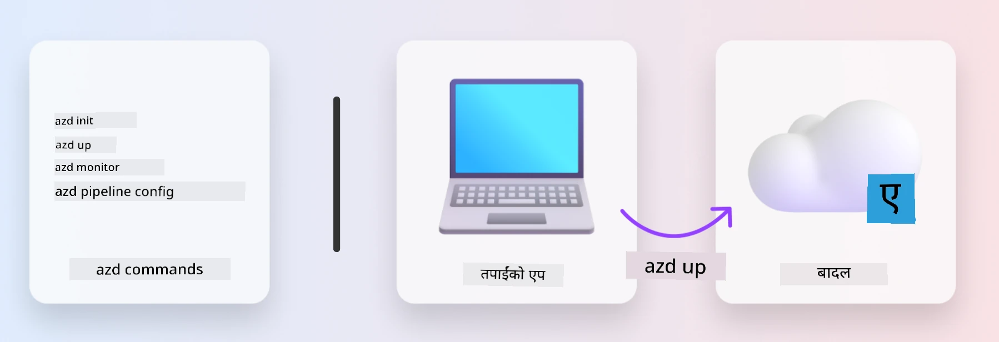
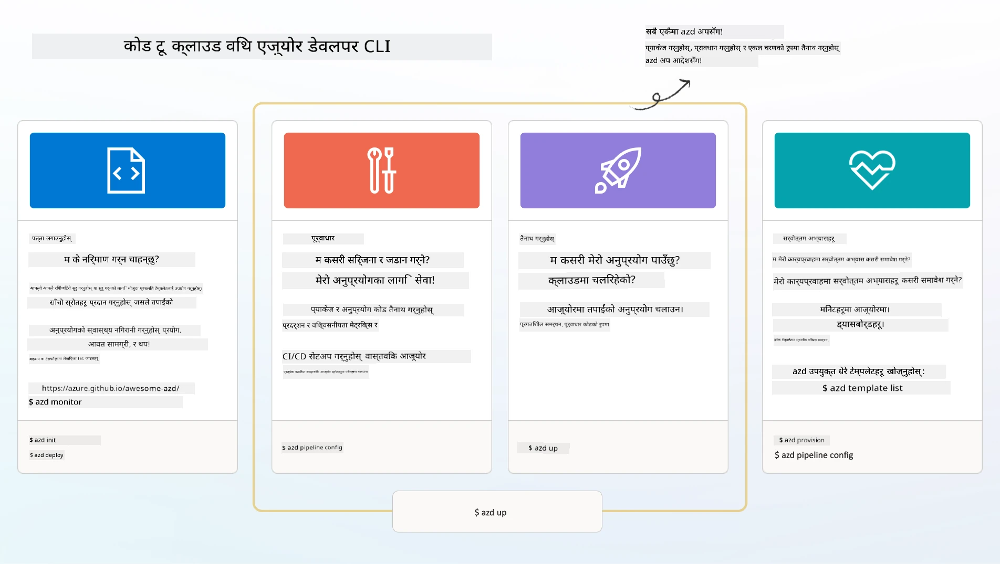

# 1. Select a Template

!!! tip "यस मोड्युलको अन्त्यसम्म तपाईं निम्न कार्यहरू गर्न सक्षम हुनुहुनेछ"

    - [ ] AZD टेम्पलेटहरू के हुन् वर्णन गर्नुहोस्
    - [ ] AI का लागि AZD टेम्पलेटहरू पत्ता लगाउनुहोस् र प्रयोग गर्नुहोस्
    - [ ] AI Agents टेम्पलेटबाट सुरु गर्नुहोस्
    - [ ] **Lab 1:** GitHub Codespacesसहित AZD क्विकस्टार्ट

---

## 1. A Builder Analogy

Building a modern enterprise-ready AI application _शुरुबाटै_ can be daunting. It's a little bit like building your new home on your own, brick by brick. Yes, it can be done! But it is not the most effective way to get the desired end result! 

Instead, we often start with an existing _डिजाइन ब्लूप्रिन्ट_, and work with an architect to customize it to our personal requirements. And that's exactly the approach to take when building intelligent applications. First, find a good design architecture that fits your problem space. Then work with a solution architect to customize and develop the solution for your specific scenario.

But where can we find these design blueprints? And how do we find an architect that is willing to teach us how to customize and deploy these blueprints on our own? In this workshop, we answer those questions by introducing you to three technologies:

1. [Azure Developer CLI](https://aka.ms/azd) - एक खुला स्रोत उपकरण जसले स्थानीय विकास (build) बाट क्लाउड डिप्लोयमेन्ट (ship) सम्मको विकासकर्ताको मार्गलाई तीव्र बनाउँछ।
1. [Microsoft Foundry Templates](https://ai.azure.com/templates) - नमूना कोड, पूर्वाधार र कन्फिगरेसन फाइलहरू समावेश गर्ने मानकीकृत खुला स्रोत रिपोजिटरीहरू जसले AI समाधान आर्किटेक्चर डिप्लोय गर्न मद्दत गर्छ।
1. [GitHub Copilot Agent Mode](https://code.visualstudio.com/docs/copilot/chat/chat-agent-mode) - Azure ज्ञानले आधारित एक कोडिङ् एजेन्ट, जसले प्राकृतिक भाषाको प्रयोग गरेर हामीलाई कोडबेस नेभिगेट गर्न र परिवर्तनहरू गर्न मार्गनिर्देशन गर्न सक्छ।

With these tools in hand, we can now _discover_ the right template, _deploy_ it to validate it works, and _customize_ it to suit our specific scenarios. Let's dive in and learn how these work.


---

## 2. Azure Developer CLI

The [Azure Developer CLI](https://learn.microsoft.com/en-us/azure/developer/azure-developer-cli/) (or `azd`) is an open-source commandline tool that can speed up your code-to-cloud journey with a set of developer-friendly commands that work consistently across your IDE (development) and CI/CD (devops) environments.

With `azd`, your deployment journey can be as simple as:

- `azd init` - कुनै पनि विद्यमान AZD टेम्पलेटबाट नयाँ AI परियोजना सुरु गर्छ।
- `azd up` - पूर्वाधार प्राविजन गर्छ र एकै चरणमा तपाईंको आवेदन डिप्लोय गर्छ।
- `azd monitor` - तपाईंले डिप्लोय गरेको अनुप्रयोगको लागि रियल-टाइम मोनिटरिङ र डायग्नोस्टिक्स प्राप्त गर्नुहोस्।
- `azd pipeline config` - Azure मा डिप्लोयमेन्टलाई स्वचालित बनाउन CI/CD पाइपलाइनहरू सेटअप गर्नुहोस्।

**🎯 | अभ्यास**: <br/> Explore the `azd` commandline tool in your GitHub Codespaces environment now. Start by typing this command to see what the tool can do:

```bash title="" linenums="0"
azd help
```



---

## 3. The AZD Template

For `azd` to achieve this, it needs to know the infrastructure to provision, the configuration settings to enforce, and the application to deploy. This is where [AZD templates](https://learn.microsoft.com/en-us/azure/developer/azure-developer-cli/azd-templates?tabs=csharp) come in. 

AZD templates are open-source repositories that combine sample code with infrastructure and configuraton files required for deploying the solution architecture.
By using an _Infrastructure-as-Code_ (IaC) approach, they allow template resource definitions and configuration settings to be version-controller (just like the app source code) - creating reusable and consistent workflows across users of that project.

When creating or reusing an AZD template for _your_ scenario, consider these questions:

1. What are you building? → के त्यो परिदृश्यका लागि स्टार्टर कोड भएको कुनै टेम्पलेट छ?
1. How is your solution architected? → के आवश्यक स्रोतहरू भएको कुनै टेम्पलेट छ?
1. How is your solution deployed? → `azd deploy` सँग प्रि/पोस्ट-प्रोसेसिङ हुकहरू कस्तो हुन्छन् भनी विचार गर्नुहोस्!
1. How can you optimize it further? → इन-बिल्ट मोनिटरिङ र स्वचालन पाइपलाइन्सबारे सोच्नुहोस्!

**🎯 | अभ्यास**: <br/> 
Visit the [Awesome AZD](https://azure.github.io/awesome-azd/) gallery and use the filters to explore the 250+ templates currently available. See if you can find one that aligns to _your_ scenario requirements.



---

## 4. AI App Templates

For AI-powered applications, Microsoft provides specialized templates featuring **Microsoft Foundry** and **Foundry Agents**. These templates accelerate your path to building intelligent, production-ready applications.

### Microsoft Foundry & Foundry Agents Templates

Select a template below to deploy. Each template is available on [Awesome AZD](https://azure.github.io/awesome-azd/) and can be initialized with a single command.

| टेम्पलेट | विवरण | डिप्लोय आदेश |
|----------|-------------|----------------|
| **[AI Chat with RAG](https://azure.github.io/awesome-azd/?tags=ai&tags=rag)** | Microsoft Foundry प्रयोग गरेर Retrieval Augmented Generation सहितको च्याट एप्लिकेसन | `azd init -t azure-samples/azure-search-openai-demo` |
| **[Foundry Agent Service Starter](https://azure.github.io/awesome-azd/?tags=ai&tags=agents)** | Foundry Agents प्रयोग गरी автономस कार्य सम्पन्नका लागि AI एजेन्टहरू बनाउनुहोस् | `azd init -t azure-samples/foundry-agent-service-starter` |
| **[Multi-Agent Orchestration](https://azure.github.io/awesome-azd/?tags=ai&tags=agents)** | जटिल वर्कफ्लोहरूका लागि बहु Foundry Agents समन्वय गर्नुहोस् | `azd init -t azure-samples/multi-agent-orchestration` |
| **[AI Document Intelligence](https://azure.github.io/awesome-azd/?tags=ai&tags=document)** | Microsoft Foundry मोडेलहरू प्रयोग गरी कागजातहरू निकाल्नुहोस् र विश्लेषण गर्नुहोस् | `azd init -t azure-samples/ai-document-processing` |
| **[Conversational AI Bot](https://azure.github.io/awesome-azd/?tags=ai&tags=bot)** | Microsoft Foundry एकीकरणसहित बुद्धिमान च्याटबटहरू बनाउनुहोस् | `azd init -t azure-samples/ai-chat-protocol` |
| **[AI Image Generation](https://azure.github.io/awesome-azd/?tags=ai&tags=dalle)** | Microsoft Foundry मार्फत DALL-E प्रयोग गरी तस्बिरहरू उत्पन्न गर्नुहोस् | `azd init -t azure-samples/ai-image-generation` |
| **[Semantic Kernel Agent](https://azure.github.io/awesome-azd/?tags=ai&tags=semantic-kernel)** | Foundry Agents सहित Semantic Kernel प्रयोग गर्ने AI एजेन्टहरू | `azd init -t azure-samples/semantic-kernel-agent` |
| **[AutoGen Multi-Agent](https://azure.github.io/awesome-azd/?tags=ai&tags=autogen)** | AutoGen फ्रेमवर्क प्रयोग गर्ने बहु-एजेन्ट सिस्टमहरू | `azd init -t azure-samples/autogen-multi-agent` |

### द्रुत सुरुवात

1. **टेम्पलेट ब्राउज गर्नुहोस्**: Visit [https://azure.github.io/awesome-azd/] र फिल्टरहरू प्रयोग गरेर `AI`, `Agents`, वा `Microsoft Foundry` अनुसार सिम्ट्र गर्नुहोस्
2. **आफ्नो टेम्पलेट चयन गर्नुहोस्**: आफ्नो उपयोग केससँग मेल खाने एउटा छान्नुहोस्
3. **इनिसियलाइज गर्नुहोस्**: छनोट गरेको टेम्पलेटका लागि `azd init` कमाण्ड चलाउनुहोस्
4. **डिप्लोय गर्नुहोस्**: प्राविजन र डिप्लोय गर्न `azd up` चलाउनुहोस्

**🎯 | अभ्यास**: <br/>
Select one of the templates above based on your scenario:

- **Building a chatbot?** → Start with **AI Chat with RAG** or **Conversational AI Bot**
- **Need autonomous agents?** → Try **Foundry Agent Service Starter** or **Multi-Agent Orchestration**
- **Processing documents?** → Use **AI Document Intelligence**
- **Want AI coding assistance?** → Explore **Semantic Kernel Agent** or **AutoGen Multi-Agent**

```bash title="Example: Deploy the AI Chat with RAG template" linenums="0"
azd init -t azure-samples/azure-search-openai-demo
azd up
```

!!! info "थप टेम्पलेटहरू अन्वेषण गर्नुहोस्"
    The [Awesome AZD Gallery](https://azure.github.io/awesome-azd/) contains 250+ templates. Use the filters to find templates matching your specific requirements for language, framework, and Azure services.

---

<!-- CO-OP TRANSLATOR DISCLAIMER START -->
अस्वीकरण:
यस दस्तावेजलाई AI अनुवाद सेवा [Co-op Translator](https://github.com/Azure/co-op-translator) प्रयोग गरी अनुवाद गरिएको हो। हामी शुद्धताको लागि प्रयत्नशील भए पनि, कृपया जानकारि राख्नुहोस् कि स्वचालित अनुवादहरूमा त्रुटि वा अशुद्धि हुनसक्छ। मूल दस्तावेजलाई त्यसको मूल भाषामा नै अधिकारिक स्रोत मानिनु पर्छ। महत्वपूर्ण जानकारीको लागि व्यावसायिक मानव अनुवाद सिफारिस गरिन्छ। यस अनुवादको प्रयोगबाट उत्पन्न कुनै पनि गलतफहमी वा गलत व्याख्याहरूका लागि हामी जिम्मेवार छैनौँ।
<!-- CO-OP TRANSLATOR DISCLAIMER END -->