<!--
CO_OP_TRANSLATOR_METADATA:
{
  "original_hash": "7816c6ec50c694c331e7c6092371be4d",
  "translation_date": "2025-09-24T13:48:48+00:00",
  "source_file": "workshop/docs/instructions/2-Validate-AI-Template.md",
  "language_code": "ne"
}
-->
# 2. टेम्प्लेट प्रमाणित गर्नुहोस्

!!! tip "यस मोड्युलको अन्त्यमा तपाईं सक्षम हुनुहुनेछ"

    - [ ] एआई समाधान आर्किटेक्चर विश्लेषण गर्नुहोस्
    - [ ] AZD डिप्लोयमेन्ट वर्कफ्लो बुझ्नुहोस्
    - [ ] AZD प्रयोगमा मद्दतको लागि GitHub Copilot प्रयोग गर्नुहोस्
    - [ ] **प्रयोगशाला २:** एआई एजेन्ट्स टेम्प्लेट डिप्लोय गर्नुहोस् र प्रमाणित गर्नुहोस्

---

## १. परिचय

[Azure Developer CLI](https://learn.microsoft.com/en-us/azure/developer/azure-developer-cli/) वा `azd` एक ओपन-सोर्स कमाण्डलाइन उपकरण हो जसले Azure मा एप्लिकेसन निर्माण र डिप्लोय गर्दा डेभलपर वर्कफ्लोलाई सरल बनाउँछ। 

[AZD टेम्प्लेटहरू](https://learn.microsoft.com/azure/developer/azure-developer-cli/azd-templates) मानकीकृत रिपोजिटरीहरू हुन् जसमा नमूना एप्लिकेसन कोड, _इन्फ्रास्ट्रक्चरको रूपमा कोड_ सम्पत्ति, र `azd` कन्फिगरेसन फाइलहरू समावेश छन् जसले समाधान आर्किटेक्चरलाई एकीकृत बनाउँछ। इन्फ्रास्ट्रक्चर प्रोभिजनिंग `azd provision` कमाण्ड जत्तिकै सरल हुन्छ - जबकि `azd up` प्रयोग गर्दा तपाईंले इन्फ्रास्ट्रक्चर **र** एप्लिकेसनलाई एकैपटक डिप्लोय गर्न सक्नुहुन्छ!

यसको परिणामस्वरूप, तपाईंको एप्लिकेसन विकास प्रक्रिया सुरु गर्न _AZD स्टार्टर टेम्प्लेट_ खोज्नु जत्तिकै सरल हुन्छ जुन तपाईंको एप्लिकेसन र इन्फ्रास्ट्रक्चर आवश्यकताहरूको नजिक आउँछ - त्यसपछि रिपोजिटरीलाई तपाईंको परिदृश्य आवश्यकताहरूमा अनुकूलन गर्नुहोस्।

सुरु गर्नु अघि, सुनिश्चित गर्नुहोस् कि तपाईंले Azure Developer CLI स्थापना गर्नुभएको छ।

1. VS Code टर्मिनल खोल्नुहोस् र यो कमाण्ड टाइप गर्नुहोस्:

      ```bash title="" linenums="0"
      azd version
      ```

1. तपाईंले यस्तो देख्नुहुनेछ!

      ```bash title="" linenums="0"
      azd version 1.19.0 (commit b3d68cea969b2bfbaa7b7fa289424428edb93e97)
      ```

**अब तपाईं azd प्रयोग गरेर टेम्प्लेट चयन र डिप्लोय गर्न तयार हुनुहुन्छ**

---

## २. टेम्प्लेट चयन

Azure AI Foundry प्लेटफर्मले [सिफारिस गरिएका AZD टेम्प्लेटहरूको सेट](https://learn.microsoft.com/en-us/azure/ai-foundry/how-to/develop/ai-template-get-started) प्रदान गर्दछ जसले _मल्टि-एजेन्ट वर्कफ्लो स्वचालन_ र _मल्टि-मोडल सामग्री प्रशोधन_ जस्ता लोकप्रिय समाधान परिदृश्यहरू समेट्छ। तपाईंले Azure AI Foundry पोर्टलमा गएर यी टेम्प्लेटहरू पत्ता लगाउन सक्नुहुन्छ।

1. [https://ai.azure.com/templates](https://ai.azure.com/templates) मा जानुहोस्
1. Azure AI Foundry पोर्टलमा लगइन गर्नुहोस् जब सोधिन्छ - तपाईंले यस्तो देख्नुहुनेछ।

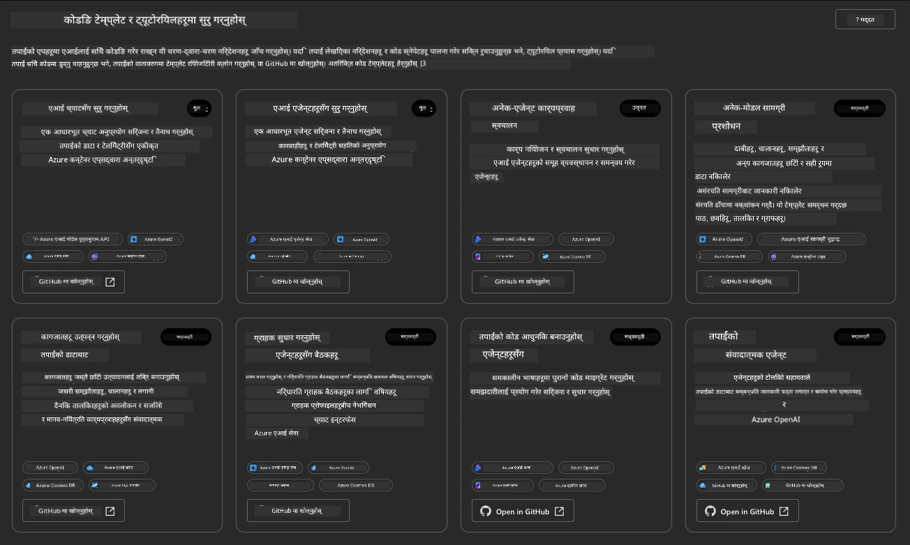

**बेसिक** विकल्पहरू तपाईंका स्टार्टर टेम्प्लेटहरू हुन्:

1. [ ] [Get Started with AI Chat](https://github.com/Azure-Samples/get-started-with-ai-chat) जसले Azure Container Apps मा _तपाईंको डेटा_ सहितको आधारभूत च्याट एप्लिकेसन डिप्लोय गर्दछ। यसलाई आधारभूत एआई च्याटबोट परिदृश्य अन्वेषण गर्न प्रयोग गर्नुहोस्।
1. [X] [Get Started with AI Agents](https://github.com/Azure-Samples/get-started-with-ai-agents) जसले Azure AI Agent Service सहितको मानक एआई एजेन्ट पनि डिप्लोय गर्दछ। यसलाई उपकरण र मोडेलहरू समावेश गर्ने एजेन्टिक एआई समाधानहरूमा परिचित हुन प्रयोग गर्नुहोस्।

दोस्रो लिंकलाई नयाँ ब्राउजर ट्याबमा खोल्नुहोस् (वा सम्बन्धित कार्डको लागि `Open in GitHub` क्लिक गर्नुहोस्)। तपाईंले यस AZD टेम्प्लेटको लागि रिपोजिटरी देख्नुहुनेछ। README अन्वेषण गर्न एक मिनेट लिनुहोस्। एप्लिकेसन आर्किटेक्चर यस्तो देखिन्छ:

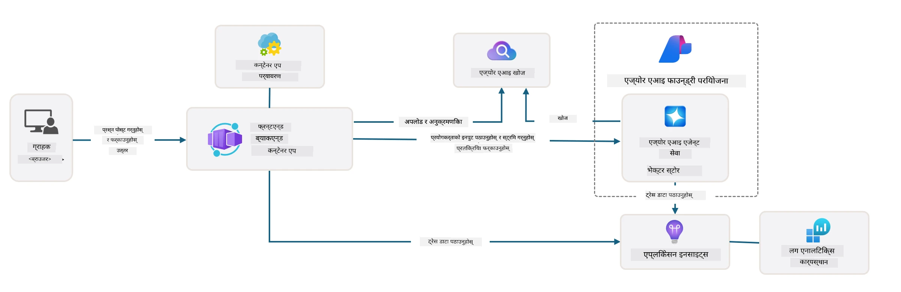

---

## ३. टेम्प्लेट सक्रियता

आउनुहोस्, यो टेम्प्लेट डिप्लोय गर्ने प्रयास गरौं र यो मान्य छ कि छैन सुनिश्चित गरौं। हामी [Getting Started](https://github.com/Azure-Samples/get-started-with-ai-agents?tab=readme-ov-file#getting-started) सेक्सनमा दिइएका दिशानिर्देशहरू पालना गर्नेछौं।

1. [यो लिंक](https://github.com/codespaces/new/Azure-Samples/get-started-with-ai-agents) क्लिक गर्नुहोस् - `Create codespace` को डिफल्ट कार्य पुष्टि गर्नुहोस्
1. यसले नयाँ ब्राउजर ट्याब खोल्छ - GitHub Codespaces सत्र लोड हुने प्रतीक्षा गर्नुहोस्
1. Codespaces मा VS Code टर्मिनल खोल्नुहोस् - निम्न कमाण्ड टाइप गर्नुहोस्:

   ```bash title="" linenums="0"
   azd up
   ```

यसले ट्रिगर गर्ने वर्कफ्लो चरणहरू पूरा गर्नुहोस्:

1. तपाईंलाई Azure मा लगइन गर्न सोधिनेछ - प्रमाणित गर्न निर्देशनहरू पालना गर्नुहोस्
1. तपाईंको लागि एक अद्वितीय वातावरण नाम प्रविष्ट गर्नुहोस् - जस्तै, मैले `nitya-mshack-azd` प्रयोग गरें
1. यसले `.azure/` फोल्डर सिर्जना गर्नेछ - तपाईंले वातावरण नामको साथ उपफोल्डर देख्नुहुनेछ
1. तपाईंलाई सदस्यता नाम चयन गर्न सोधिनेछ - डिफल्ट चयन गर्नुहोस्
1. तपाईंलाई स्थानको लागि सोधिनेछ - `East US 2` प्रयोग गर्नुहोस्

अब, तपाईं प्रोभिजनिंग पूरा हुने प्रतीक्षा गर्नुहोस्। **यसले १०-१५ मिनेट लाग्छ**

1. जब सकिन्छ, तपाईंको कन्सोलले यस्तो SUCCESS सन्देश देखाउनेछ:
      ```bash title="" linenums="0"
      SUCCESS: Your up workflow to provision and deploy to Azure completed in 10 minutes 17 seconds.
      ```
1. तपाईंको Azure पोर्टलमा अब उक्त वातावरण नामको साथ प्रोभिजन गरिएको रिसोर्स समूह हुनेछ:

      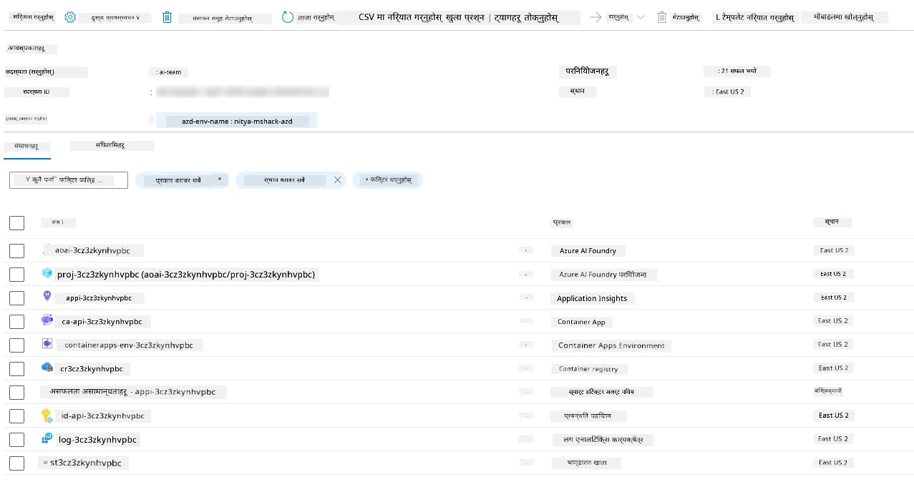

1. **अब तपाईं डिप्लोय गरिएको इन्फ्रास्ट्रक्चर र एप्लिकेसन प्रमाणित गर्न तयार हुनुहुन्छ।**

---

## ४. टेम्प्लेट प्रमाणित गर्नुहोस्

1. Azure पोर्टल [Resource Groups](https://portal.azure.com/#browse/resourcegroups) पृष्ठमा जानुहोस् - लगइन गर्नुहोस् जब सोधिन्छ
1. तपाईंको वातावरण नामको लागि RG क्लिक गर्नुहोस् - तपाईं माथिको पृष्ठ देख्नुहुन्छ

      - Azure Container Apps रिसोर्समा क्लिक गर्नुहोस्
      - _Essentials_ सेक्सन (माथि दायाँ) मा एप्लिकेसन URL मा क्लिक गर्नुहोस्

1. तपाईंले यस्तो होस्ट गरिएको एप्लिकेसन फ्रन्ट-एन्ड UI देख्नुहुनेछ:

   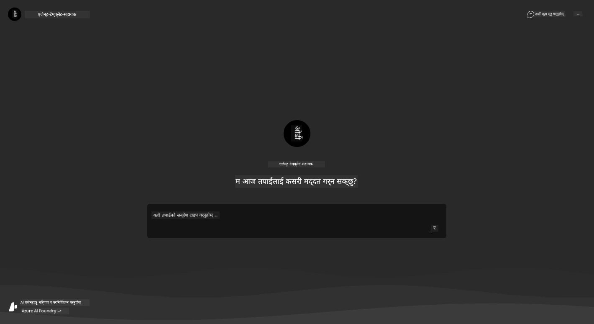

1. केही [नमूना प्रश्नहरू](https://github.com/Azure-Samples/get-started-with-ai-agents/blob/main/docs/sample_questions.md) सोध्ने प्रयास गर्नुहोस्

      1. सोध्नुहोस्: ```What is the capital of France?``` 
      1. सोध्नुहोस्: ```What's the best tent under $200 for two people, and what features does it include?```

1. तपाईंले तल देखाइएको जस्तै उत्तरहरू प्राप्त गर्नुहुनेछ। _तर यो कसरी काम गर्छ?_ 

      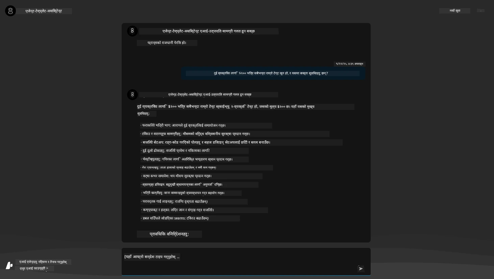

---

## ५. एजेन्ट प्रमाणित गर्नुहोस्

Azure Container App ले एक एन्डप्वइन्ट डिप्लोय गर्दछ जसले यस टेम्प्लेटको लागि Azure AI Foundry प्रोजेक्टमा प्रोभिजन गरिएको एआई एजेन्टसँग जडान गर्दछ। आउनुहोस्, यसको अर्थ के हो हेर्न प्रयास गरौं।

1. तपाईंको रिसोर्स समूहको लागि Azure पोर्टल _Overview_ पृष्ठमा फर्कनुहोस्

1. उक्त सूचीमा `Azure AI Foundry` रिसोर्समा क्लिक गर्नुहोस्

1. तपाईंले यस्तो देख्नुहुनेछ। `Go to Azure AI Foundry Portal` बटनमा क्लिक गर्नुहोस्। 
   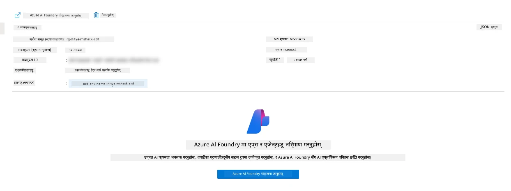

1. तपाईंले आफ्नो एआई एप्लिकेसनको लागि Foundry प्रोजेक्ट पृष्ठ देख्नुहुनेछ
   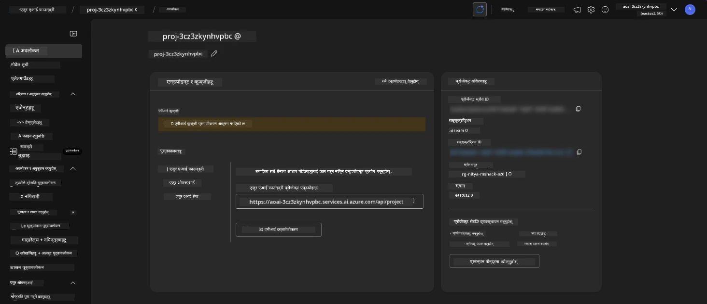

1. `Agents` मा क्लिक गर्नुहोस् - तपाईंले आफ्नो प्रोजेक्टमा प्रोभिजन गरिएको डिफल्ट एजेन्ट देख्नुहुनेछ
   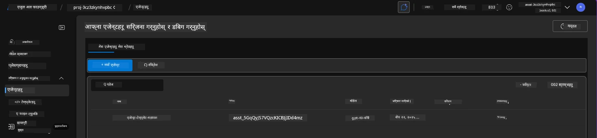

1. यसलाई चयन गर्नुहोस् - र तपाईंले एजेन्ट विवरण देख्नुहुनेछ। निम्न कुराहरू नोट गर्नुहोस्:

      - एजेन्टले डिफल्ट रूपमा फाइल खोज प्रयोग गर्दछ (सधैं)
      - एजेन्टको `Knowledge` ले देखाउँछ कि यसमा ३२ फाइलहरू अपलोड गरिएको छ (फाइल खोजको लागि)
      

1. बायाँ मेनुमा `Data+indexes` विकल्प खोज्नुहोस् र विवरणको लागि क्लिक गर्नुहोस्। 

      - तपाईंले ज्ञानको लागि अपलोड गरिएका ३२ डेटा फाइलहरू देख्नुहुनेछ।
      - यी `src/files` अन्तर्गत १२ ग्राहक फाइलहरू र २० उत्पादन फाइलहरूसँग मेल खानेछन्। 
      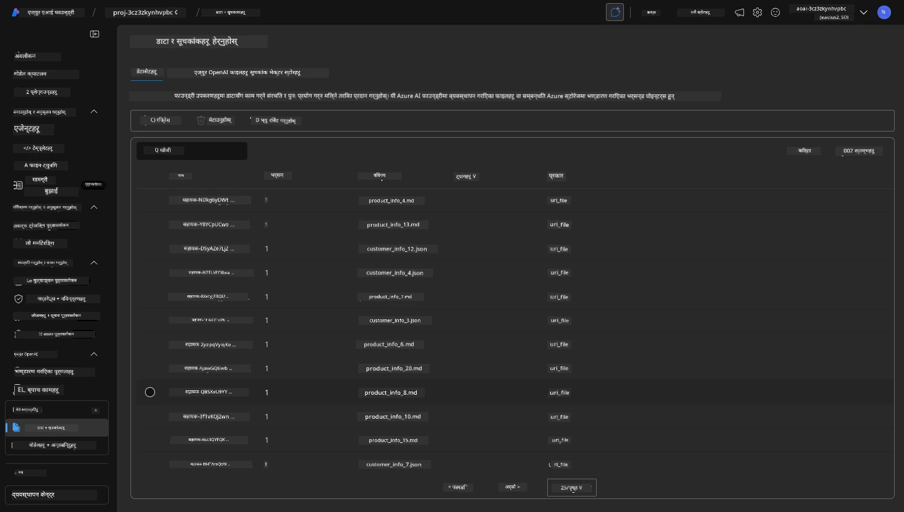

**तपाईंले एजेन्टको सञ्चालन प्रमाणित गर्नुभयो!** 

1. एजेन्टको उत्तरहरू ती फाइलहरूमा रहेको ज्ञानमा आधारित छन्। 
1. अब तपाईं उक्त डेटा सम्बन्धित प्रश्नहरू सोध्न सक्नुहुन्छ, र आधारित उत्तरहरू प्राप्त गर्न सक्नुहुन्छ।
1. उदाहरण: `customer_info_10.json` ले "Amanda Perez" द्वारा गरिएका ३ खरिदहरू वर्णन गर्दछ।

Container App एन्डप्वइन्ट भएको ब्राउजर ट्याबमा फर्कनुहोस् र सोध्नुहोस्: `What products does Amanda Perez own?`. तपाईंले यस्तो देख्नुहुनेछ:

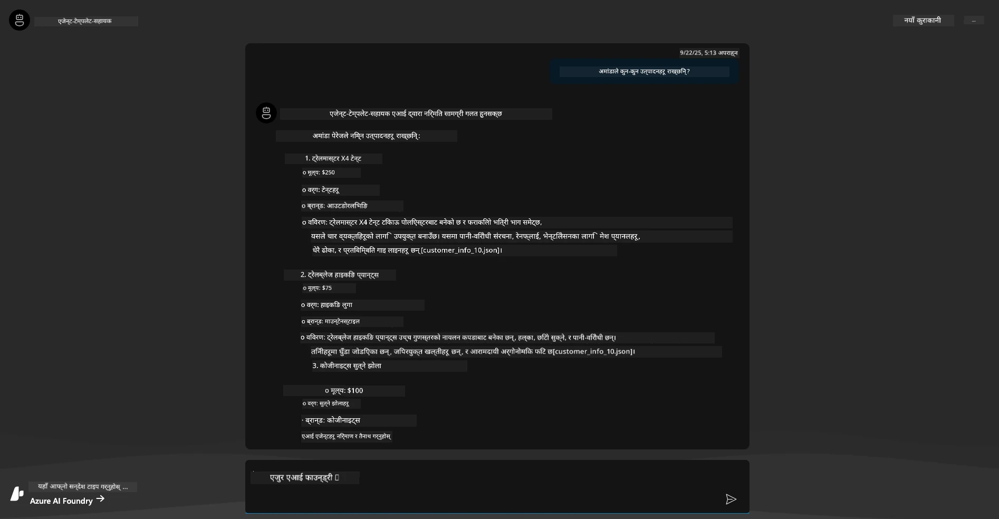

---

## ६. एजेन्ट प्लेग्राउन्ड

Azure AI Foundry को क्षमताहरूको लागि थोरै अधिक अन्तर्ज्ञान निर्माण गरौं, एजेन्टलाई एजेन्ट्स प्लेग्राउन्डमा घुमाएर। 

1. Azure AI Foundry मा `Agents` पृष्ठमा फर्कनुहोस् - डिफल्ट एजेन्ट चयन गर्नुहोस्
1. `Try in Playground` विकल्पमा क्लिक गर्नुहोस् - तपाईंले यस्तो प्लेग्राउन्ड UI प्राप्त गर्नुहुनेछ
1. उही प्रश्न सोध्नुहोस्: `What products does Amanda Perez own?`

    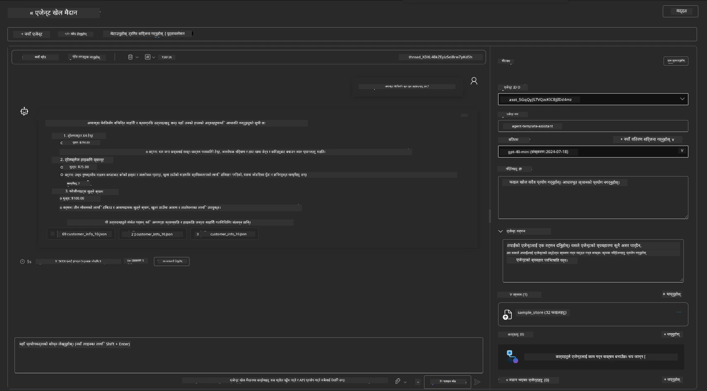

तपाईंले उस्तै (वा समान) उत्तर प्राप्त गर्नुहुनेछ - तर तपाईंले थप जानकारी पनि प्राप्त गर्नुहुनेछ जसले तपाईंलाई तपाईंको एजेन्टिक एप्लिकेसनको गुणस्तर, लागत, र प्रदर्शन बुझ्न मद्दत गर्दछ। उदाहरणका लागि:

1. नोट गर्नुहोस् कि उत्तरले "ग्राउन्ड" उत्तरको लागि प्रयोग गरिएका डेटा फाइलहरू उद्धृत गर्दछ
1. यी फाइल लेबलहरूमा होभर गर्नुहोस् - के डेटा तपाईंको सोधिएको प्रश्न र देखाइएको उत्तरसँग मेल खान्छ?

तपाईंले उत्तरको तल _स्ट्याट्स_ पङ्क्ति पनि देख्नुहुनेछ। 

1. कुनै मेट्रिकमा होभर गर्नुहोस् - जस्तै, Safety। तपाईंले यस्तो देख्नुहुनेछ
1. के मूल्याङ्कन गरिएको रेटिङ तपाईंको उत्तरको सुरक्षा स्तरको लागि अन्तर्ज्ञानसँग मेल खान्छ?

      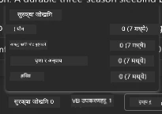

---x

## ७. बिल्ट-इन अवलोकनीयता

अवलोकनीयता भनेको तपाईंको एप्लिकेसनलाई डाटा उत्पन्न गर्न उपकरण बनाउनु हो जसले यसको सञ्चालनलाई बुझ्न, डिबग गर्न, र अनुकूलन गर्न प्रयोग गर्न सकिन्छ। यसको लागि एक भावना प्राप्त गर्न:

1. `View Run Info` बटनमा क्लिक गर्नुहोस् - तपाईंले यस्तो दृश्य देख्नुहुनेछ। यो [एजेन्ट ट्रेसिङ](https://learn.microsoft.com/en-us/azure/ai-foundry/how-to/develop/trace-agents-sdk#view-trace-results-in-the-azure-ai-foundry-agents-playground) को उदाहरण हो। _तपाईंले यो दृश्य `Thread Logs` शीर्ष-स्तर मेनुमा क्लिक गरेर पनि प्राप्त गर्न सक्नुहुन्छ।_

   - एजेन्टले संलग्न गरेको रन चरणहरू र उपकरणहरूको लागि भावना प्राप्त गर्नुहोस्
   - उत्तरको लागि कुल टोकन गणना (vs. आउटपुट टोकन प्रयोग) बुझ्नुहोस्
   - विलम्बता बुझ्नुहोस् र कार्यान्वयनमा समय कहाँ खर्च भइरहेको छ

      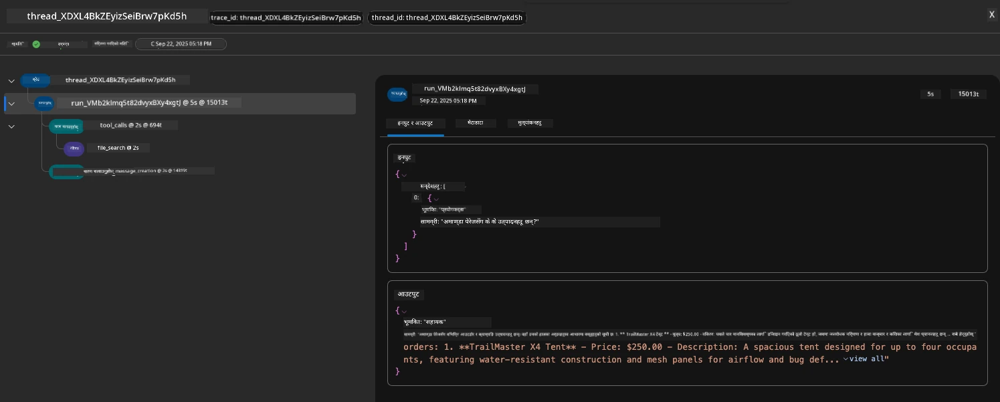

1. `Metadata` ट्याबमा क्लिक गर्नुहोस् रनको लागि थप विशेषताहरू हेर्न, जसले पछि समस्या डिबग गर्न उपयोगी सन्दर्भ प्रदान गर्न सक्छ।   

      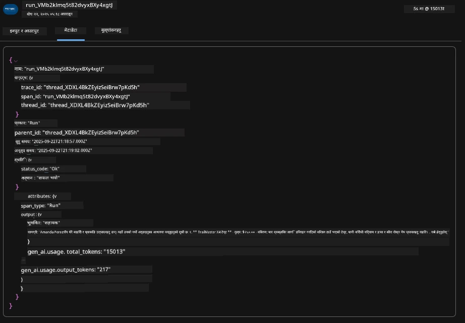

1. `Evaluations` ट्याबमा क्लिक गर्नुहोस् एजेन्ट उत्तरमा गरिएको स्व-मूल्याङ्कनहरू हेर्न। यीमा सुरक्षा मूल्याङ्कनहरू (जस्तै, Self-harm) र एजेन्ट-विशिष्ट मूल्याङ्कनहरू (जस्तै, Intent resolution, Task adherence) समावेश छन्।

      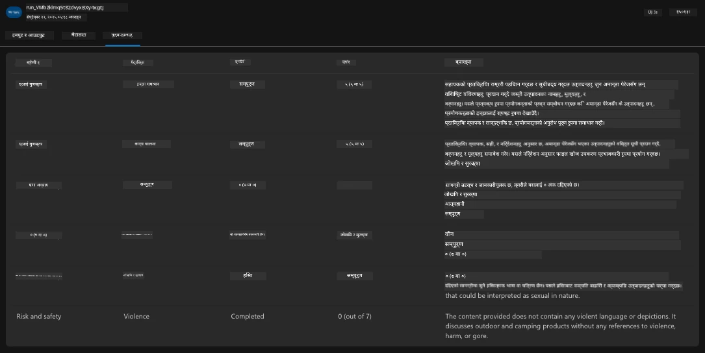

1. अन्तमा, साइडबार मेनुमा `Monitoring` ट्याबमा क्लिक गर्नुहोस्।

      - प्रदर्शित पृष्ठमा `Resource usage` ट्याब चयन गर्नुहोस् - र मेट्रिक्स हेर्नुहोस्।
      - लागत (टोकन) र लोड (अनुरोधहरू) को सन्दर्भमा एप्लिकेसन प्रयोग ट्र्याक गर्नुहोस्।
      - पहिलो बाइट (इनपुट प्रशोधन) र अन्तिम बाइट (आउटपुट) को विलम्बता ट्र्याक गर्नुहोस्।

      

---

## ८. वातावरण चरहरू

अहिलेसम्म, हामीले ब्राउजरमा डिप्लोयमेन्टको माध्यमबाट हिँड्यौं - र प्रमाणित गर्यौं कि हाम्रो इन्फ्रास्ट्रक्चर प्रोभिजन गरिएको छ र एप्लिकेसन सञ्चालनमा छ। तर एप्लिकेसनसँग _कोड-फर्स्ट_ काम गर्न, हामीले स्थानीय विकास वातावरणलाई ती रिसोर्सहरूसँग काम गर्न आवश्यक चरहरू कन्फिगर गर्न आवश्यक छ। `azd` प्रयोग गर्दा यो सजिलो बनाउँछ।

1. Azure Developer CLI [वातावरण चरहरू प्रयोग गर्दछ](https://learn.microsoft.com/en-us/azure/developer/azure-developer-cli/manage-environment-variables?tabs=bash) एप्लिकेसन डिप्लोयमेन्टहरूको लागि कन्फिगरेसन सेटिङहरू भण्डारण र व्यवस्थापन गर्न।

1. वातावरण चरहरू `.azure/<env-name>/.env` मा भण्डारण गरिन्छ - यसले तिनीहरूलाई डिप्लोयमेन्टको समयमा प्रयोग गरिएको `env-name` वातावरणमा स्कोप गर्दछ र एउटै रिपोजिटरीमा विभिन्न डिप्लोयमेन्ट लक्ष्यहरू बीच वातावरणहरू अलग गर्न मद्दत गर्दछ।

1. वातावरण चरहरू `azd` कमाण्डले कुनै विशिष्ट कमाण्ड (जस्तै, `azd up`) कार्यान्वयन गर्दा स्वतः लोड गरिन्छ। नोट गर्नुहोस् कि `azd` ले _OS-स्तर_ वातावरण चरहरू (जस्तै, शेलमा सेट गरिएको) स्वतः पढ्दैन - यसको सट्टा `azd set env` र `azd get env` प्रयोग गर्नुहोस् स्क्रिप्टहरू भित्र जानकारी स्थानान्तरण गर्न।

आउनुहोस्, केही कमाण्डहरू प्रयास गरौं:

1. यस वातावरणमा `azd` का लागि सेट गरिएका सबै वातावरण चरहरू प्राप्त गर्नुहोस्:

      ```bash title="" linenums="0"
      azd env get-values
      ```
      
      तपाईंले यस्तो देख्नुहुनेछ:

      ```bash title="" linenums="0"
      AZURE_AI_AGENT_DEPLOYMENT_NAME="gpt-4o-mini"
      AZURE_AI_AGENT_NAME="agent-template-assistant"
      AZURE_AI_EMBED_DEPLOYMENT_NAME="text-embedding-3-small"
      AZURE_AI_EMBED_DIMENSIONS=100
      ...
      ```

1. विशिष्ट मान प्राप्त गर्नुहोस् - जस्तै, मलाई थाहा छ कि हामीले `AZURE_AI_AGENT_MODEL_NAME` मान सेट गर्यौं कि छैन

      ```bash title="" linenums="0"
      azd env get-value AZURE_AI_AGENT_MODEL_NAME 
      ```
      
      तपाईंले यस्तो देख्नुहुनेछ - यो डिफल्ट रूपमा सेट गरिएको थिएन!

      ```bash title="" linenums="0"
      ERROR: key 'AZURE_AI_AGENT_MODEL_NAME' not found in the environment values
      ```

1. `azd` का लागि नयाँ वातावरण चर सेट गर्नुहोस्। यहाँ, हामी एजेन्ट मोडेल नाम अपडेट गर्छौं। _नोट: गरिएका कुनै पनि परिवर्तनहरू तुरुन्तै `.azure/<env-name>/.env` फाइलमा प्रतिबिम्बित हुनेछन्।_

      ```bash title="" linenums="0"
      azd env set AZURE_AI_AGENT_MODEL_NAME gpt-4.1
      azd env set AZURE_AI_AGENT_MODEL_VERSION 2025-04-14
      azd env set AZURE_AI_AGENT_DEPLOYMENT_CAPACITY 150
      ```

      अब, हामीले मान सेट गरिएको पाउनुपर्छ:

      ```bash title="" linenums="0"
      azd env get-value AZURE_AI_AGENT_MODEL_NAME 
      ```

1. नोट गर्नुहोस् कि केही रिसोर्सहरू स्थायी हुन्छन् (जस्तै, मोडेल डिप्लोयमेन्टहरू) र पुनःडिप्लोयमेन्टलाई बल गर्न केवल `azd up` भन्दा बढी आवश्यक हुनेछ। आउनुहोस्, मूल डिप्लोयमेन्टलाई हटाउने प्रयास गरौं र परिवर्तन गरिएका वातावरण चरहरूसँग पुनःडिप्लोय गरौं।

1. **रिफ्रेस** यदि तपाईंले पहिले कुनै azd टेम्प्लेट प्रयोग गरेर इन्फ्रास्ट्रक्चर डिप्लोय गर्नुभएको थियो - तपाईंले यो कमाण्ड प्रयोग गरेर आफ्नो स्थानीय वातावरण चरहरूको अवस्था Azure डिप्लोयमेन्टको वर्तमान अवस्थाको आधारमा _रिफ्रेस_ गर्न सक्नुहुन्छ:
      ```bash title="" linenums="0"
      azd env refresh
      ```

      यो दुई वा बढी स्थानीय विकास वातावरणहरू (जस्तै, धेरै विकासकर्ताहरू भएको टोली) बीच वातावरण चरहरू _सिंक_ गर्ने शक्तिशाली तरिका हो - परिनियोजित पूर्वाधारलाई वातावरण चरहरूको अवस्थाको लागि आधार सत्यको रूपमा सेवा गर्न अनुमति दिँदै। टोलीका सदस्यहरूले चरहरू _रिफ्रेस_ गरेर पुन: सिङ्कमा फर्कन सक्छन्।

---

## 9. बधाई छ 🏆

तपाईंले एउटा अन्त-देखि-अन्त वर्कफ्लो पूरा गर्नुभयो जहाँ तपाईंले:

- [X] तपाईं प्रयोग गर्न चाहनुभएको AZD टेम्प्लेट चयन गर्नुभयो
- [X] GitHub Codespaces प्रयोग गरेर टेम्प्लेट सुरु गर्नुभयो
- [X] टेम्प्लेट परिनियोजन गर्नुभयो र यसको काम पुष्टि गर्नुभयो

---

