# 2. टेम्प्लेट मान्यता गर्नुहोस्

> मार्च 2026 मा `azd 1.23.12` मा मान्य गरिएको।

!!! tip "यस मोड्युलको अन्त्यसम्म तपाईं सक्नुहुनेछ"

    - [ ] एआई समाधान वास्तुकला विश्लेषण गर्नुहोस्
    - [ ] AZD डिप्लोयमेन्ट वर्कफ्लो बुझ्नुहोस्
    - [ ] AZD प्रयोगमा मद्दतका लागि GitHub Copilot प्रयोग गर्नुहोस्
    - [ ] **ल्याब २:** एआई एजेन्ट टेम्प्लेट तैनाथ गर्नुहोस् र मान्यता गर्नुहोस्

---


## 1. परिचय

[Azure Developer CLI](https://learn.microsoft.com/en-us/azure/developer/azure-developer-cli/) वा `azd` एउटा खुला स्रोत कमाण्डलाइन उपकरण हो जसले Azure मा अनुप्रयोगहरू निर्माण र डिप्लोय गर्दा विकासकर्ताको कार्यप्रवाहलाई सरल बनाउँछ। 

[AZD टेम्प्लेटहरू](https://learn.microsoft.com/azure/developer/azure-developer-cli/azd-templates) नियमित भण्डारहरू हुन् जसमा नमूना अनुप्रयोग कोड, _infrastructure-as-code_ सम्पत्ति, र `azd` कन्फिगरेसन फाइलहरू समावेश छन् जसले एकसाथ समाधान वास्तुकलालाई सुसंगत बनाउँछ। पूर्वाधार प्रविधान गर्नु `azd provision` आदेश जत्तिकै सरल छ - र `azd up` प्रयोग गर्दा तपाईंले पूर्वाधार मात्र नभई आफ्नो अनुप्रयोग पनि एकै पटक तैनाथ गर्न सक्नुहुन्छ!

त्यसैले, आफ्नो अनुप्रयोग विकास प्रक्रिया सुरु गर्नको लागि सही _AZD Starter टेम्प्लेट_ भेट्टाउनुहोस् जसले तपाईंको अनुप्रयोग र पूर्वाधार आवश्यकताहरूसँग सबभन्दा नजिक हुन्छ - त्यसपछि रिपोजिटोरीलाई आफ्नो परिदृश्य आवश्यकताहरू अनुसार अनुकूलन गर्नुहोस्।

शुरू गर्नु अघि, तपाईंले Azure Developer CLI स्थापना गरेको सुनिश्चित गरौं।

1. VS Code टर्मिनल खोल्नुहोस् र यो कमाण्ड टाइप गर्नुहोस्:

      ```bash title="" linenums="0"
      azd version
      ```

1. तपाईंले यस्तै केही देख्नु पर्नेछ!

      ```bash title="" linenums="0"
      azd version 1.23.12 (commit <current-build>)
      ```

**अब तपाईं azd सँग टेम्प्लेट छान्न र डिप्लोय गर्न तयार हुनुहुन्छ**

---

## 2. टेम्प्लेट छान्ने

Microsoft Foundry प्लेटफर्मसँग [सिफारिस गरिएको AZD टेम्प्लेटहरूको सेट](https://learn.microsoft.com/en-us/azure/ai-foundry/how-to/develop/ai-template-get-started) छ जुन लोकप्रिय समाधान परिदृश्यहरू जस्तै _बहु-एजेन्ट कार्यप्रवाह स्वतःसञ्चालन_ र _बहु-मोडल सामग्री प्रशोधन_ समेट्छ। तपाईं यी टेम्प्लेटहरू Microsoft Foundry पोर्टलमा गएर पनि फेला पार्न सक्नुहुन्छ।

1. [https://ai.azure.com/templates](https://ai.azure.com/templates) मा जानुहोस्
1. लागइन गर्न अनुरोध गर्दा Microsoft Foundry पोर्टलमा लगइन गर्नुहोस् - तपाईं यसरी केही देख्नु हुनेछ।

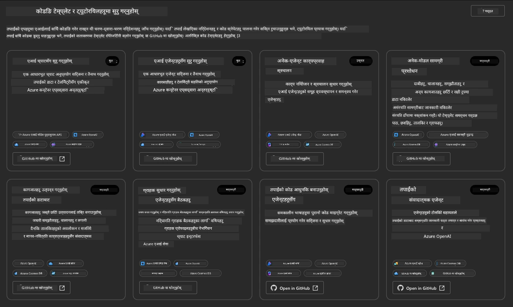


**Basic** विकल्पहरू तपाईंका शुरुवाती टेम्प्लेट हुन्:

1. [ ] [AI Chat सँग सुरु गर्नुहोस्](https://github.com/Azure-Samples/get-started-with-ai-chat) जसले आधारभूत च्याट अनुप्रयोग तपाईंको डेटा सहित Azure Container Apps मा तैनाथ गर्दछ। यसको प्रयोग गरेर आधारभूत AI च्याटबोट परिदृश्य अन्वेषण गर्नुहोस्।
1. [X] [AI Agents सँग सुरु गर्नुहोस्](https://github.com/Azure-Samples/get-started-with-ai-agents) जसले Foundry Agents सहित एक मानक AI एजेन्ट तैनाथ गर्दछ। उपकरण र मोडेलहरू समावेश गर्ने एजेन्टिक AI समाधानहरू बुझ्न यसलाई प्रयोग गर्नुहोस्।

दोस्रो लिंक नयाँ ब्राउजर ट्याबमा खोल्नुहोस् (वा सम्बन्धित कार्डमा `Open in GitHub` क्लिक गर्नुहोस्)। तपाईंले यस AZD टेम्प्लेटको रिपोजिटोरी देख्नु हुनेछ। README अध्ययन गर्न एक मिनट लगाउनुहोस्। अनुप्रयोग वास्तुकला यसरी देखिन्छ:

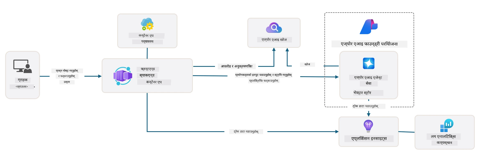

---

## 3. टेम्प्लेट सक्रिय गर्नुहोस्

यो टेम्प्लेट तैनाथ गरेर यो मान्य छ कि छैन जाँच गरौं। हामी [Getting Started](https://github.com/Azure-Samples/get-started-with-ai-agents?tab=readme-ov-file#getting-started) खण्डका दिशानिर्देशहरू पछ्याउनेछौं।

1. टेम्प्लेट रिपोजिटोरीको लागि कार्य वातावरण छान्नुहोस्:

      - **GitHub Codespaces**: [यो लिंकमा](https://github.com/codespaces/new/Azure-Samples/get-started-with-ai-agents) क्लिक गर्नुहोस् र `Create codespace` पुष्टि गर्नुहोस्
      - **स्थानीय क्लोन वा dev container**: `Azure-Samples/get-started-with-ai-agents` क्लोन गर्नुहोस् र VS Code मा खोल्नुहोस्

1. VS Code टर्मिनल तयार नहुँदा पर्खनुहोस्, त्यसपछि तलको कमाण्ड टाइप गर्नुहोस्:

   ```bash title="" linenums="0"
   azd up
   ```

यो प्रक्रिया शुरु गरेपछि निम्न चरणहरू पूरा गर्नुहोस्:

1. Azure मा लगइन गर्न आग्रह गरिनेछ - प्रमाणीकरण निर्देशनहरू पालना गर्नुहोस्
1. तपाईंको लागि अद्वितीय वातावरण नाम प्रविष्ट गर्नुहोस् - जस्तै, मैले `nitya-mshack-azd` प्रयोग गरें
1. योले `.azure/` फोल्डर बनाउनेछ - तपाईंले वातावरण नामको उपफोल्डर देख्नुहुनेछ
1. सदस्यता नाम छान्न अनुरोध गरिनेछ - डिफल्ट चयन गर्नुहोस्
1. स्थानका लागि सोधिनेछ - `East US 2` प्रयोग गर्नुहोस्

अब, प्रविधान पूरा हुन पर्खनुहोस्। **यसले १०-१५ मिनेट लाग्छ।**

1. समाप्त भएपछि, तपाईँको कन्सोलमा SUCCESS संदेश देखिनेछ जस्तै:
      ```bash title="" linenums="0"
      SUCCESS: Your up workflow to provision and deploy to Azure completed in 10 minutes 17 seconds.
      ```
1. तपाईंको Azure Portal मा सोही वातावरण नामको साथ सञ्झाल समूह प्रविधान गरिएको हुनेछ:

      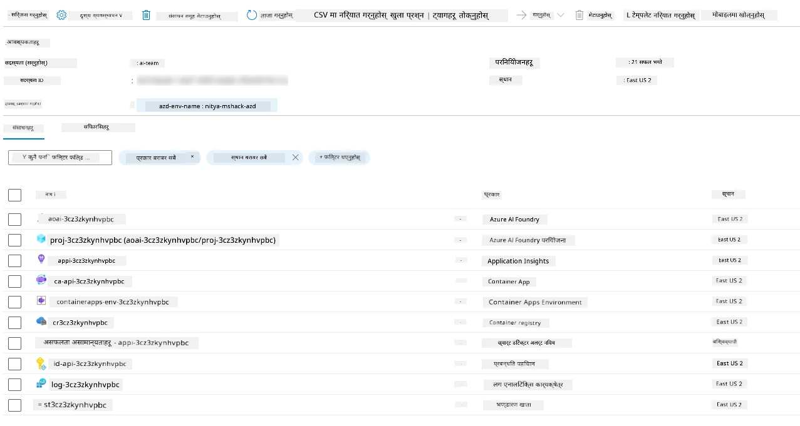

1. **अब तपाईं तैनाथ गरिएको पूर्वाधार र अनुप्रयोग प्रमाणित गर्न तयार हुनुहुन्छ।**

---

## 4. टेम्प्लेट मान्यता

1. Azure Portal [Resource Groups](https://portal.azure.com/#browse/resourcegroups) पृष्ठमा जानुहोस् - लागइन गर्न अनुरोध गर्दा लगइन गर्नुहोस्
1. तपाईंको वातावरण नामको RG मा क्लिक गर्नुहोस् - माथिको पृष्ठ देख्नुहुनेछ

      - Azure Container Apps स्रोतमा क्लिक गर्नुहोस्
      - _Essentials_ सेक्सन (माथिल्लो दाहिने) मा Application Url मा क्लिक गर्नुहोस्

1. तपाईंले यस्तै होस्ट गरिएको अनुप्रयोगको फ्रन्ट-एन्ड UI देख्नु हुनेछ:

   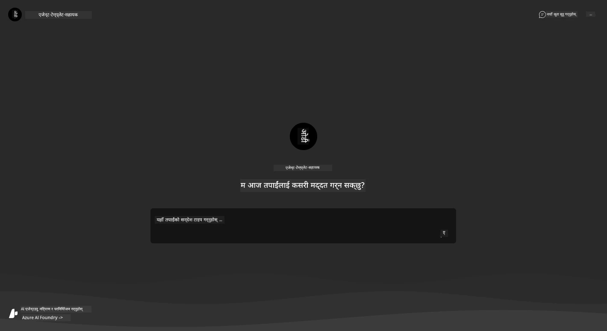

1. केही [नमूना प्रश्नहरू](https://github.com/Azure-Samples/get-started-with-ai-agents/blob/main/docs/sample_questions.md) सोध्न प्रयास गर्नुहोस्:

      1. सोध्नुहोस्: ```फ्रान्सको राजधानी के हो?``` 
      1. सोध्नुहोस्: ```दुई जनाका लागि $२०० भन्दा कम मूल्यको सबैभन्दा राम्रो तम्बू के हो, र यसमा के फीचरहरू छन्?```

1. तपाईंले तल देखाइएका जस्तै जवाफहरू पाउनुहुनेछ। _तर यो कसरी काम गर्छ?_

      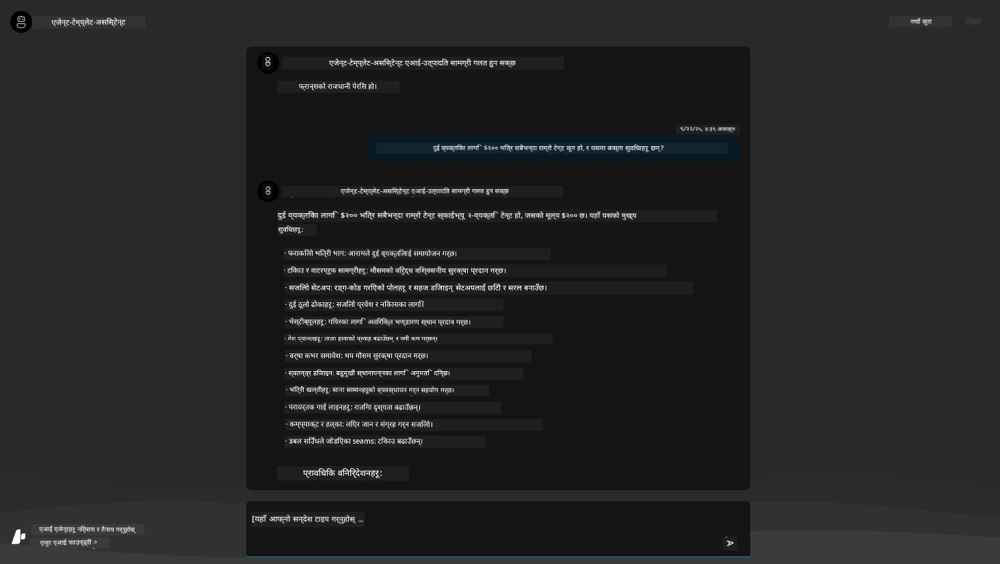

---

## 5. एजेन्ट मान्यता

Azure Container App ले एउटा एन्डप्वाइन्ट तैनाथ गर्दछ जुन Microsoft Foundry परियोजनामा प्रविधान गरिएको AI एजेन्टसँग जडान हुन्छ। यसको मतलब के हो भनेर हेर्नुहोस्।

1. Azure Portal मा फिर्ता जानुहोस् र तपाईंको स्रोत समूहको _Overview_ पृष्ठमा जानुहोस्

1. त्यस सूचीमा रहेको `Microsoft Foundry` स्रोतमा क्लिक गर्नुहोस्

1. तपाईंले यो देख्नु पर्नेछ। `Go to Microsoft Foundry Portal` बटन क्लिक गर्नुहोस्। 
   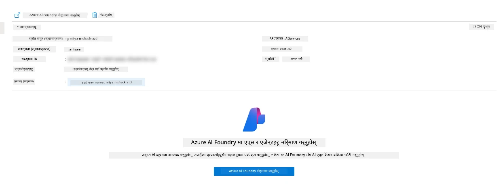

1. तपाईंको AI अनुप्रयोगका लागि Foundry परियोजना पृष्ठ देख्नुहोस्
   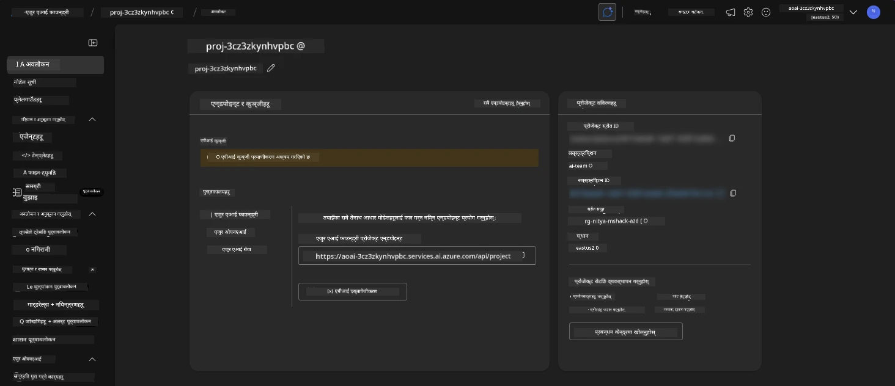

1. `Agents` मा क्लिक गर्नुहोस् - तपाईंले आफ्नो परियोजनामा डिफल्ट एजेन्ट देख्नुहुनेछ
   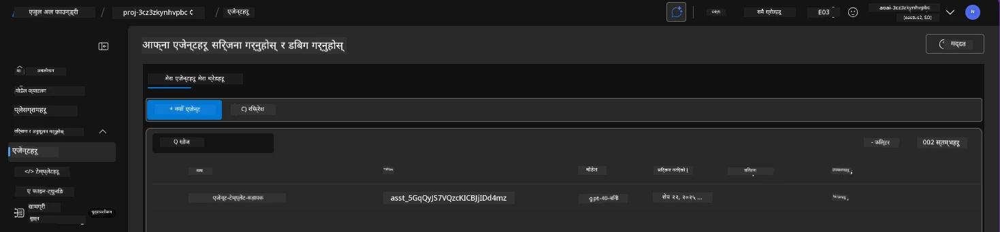

1. यसलाई छान्नुहोस् - र एजेन्ट विवरणहरू हेर्नुहोस्। निम्न कुरा ध्यान दिनुहोस्:

      - एजेन्टले डिफल्ट रूपमा File Search प्रयोग गर्छ (सधैँ)
      - एजेन्ट `Knowledge` ले जनाउँछ कि यसले ३२ फाइलहरू अपलोड गरेको छ (फाइल खोजका लागि)
      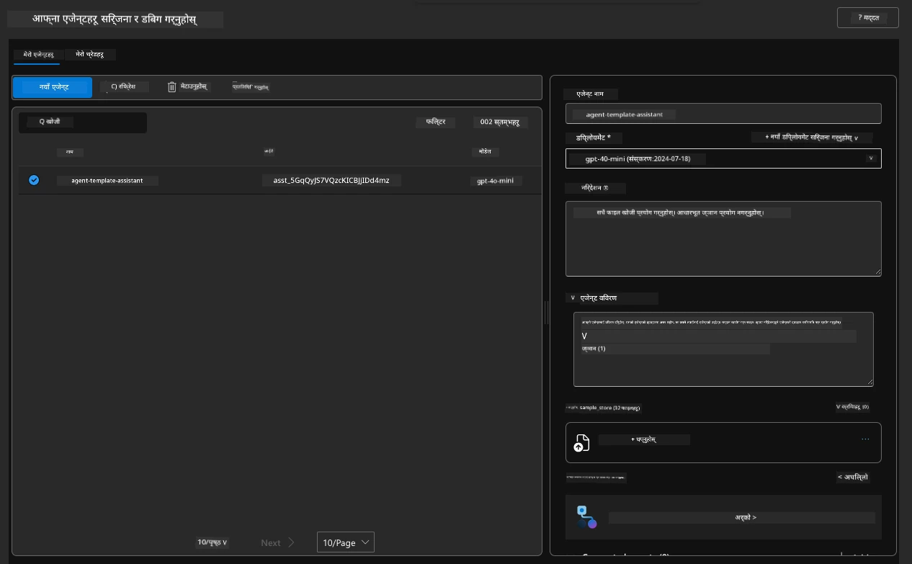

1. बायाँ मेनुमा `Data+indexes` विकल्प खोज्नुहोस् र विवरणका लागि क्लिक गर्नुहोस्।

      - तपाईंले ज्ञानका लागि अपलोड गरिएको ३२ डेटा फाइलहरू देख्न सक्नुहुनेछ।
      - यी `src/files` अन्तर्गत १२ ग्राहक फाइलहरू र २० उत्पादन फाइलहरू अनुरूप हुनेछन्
      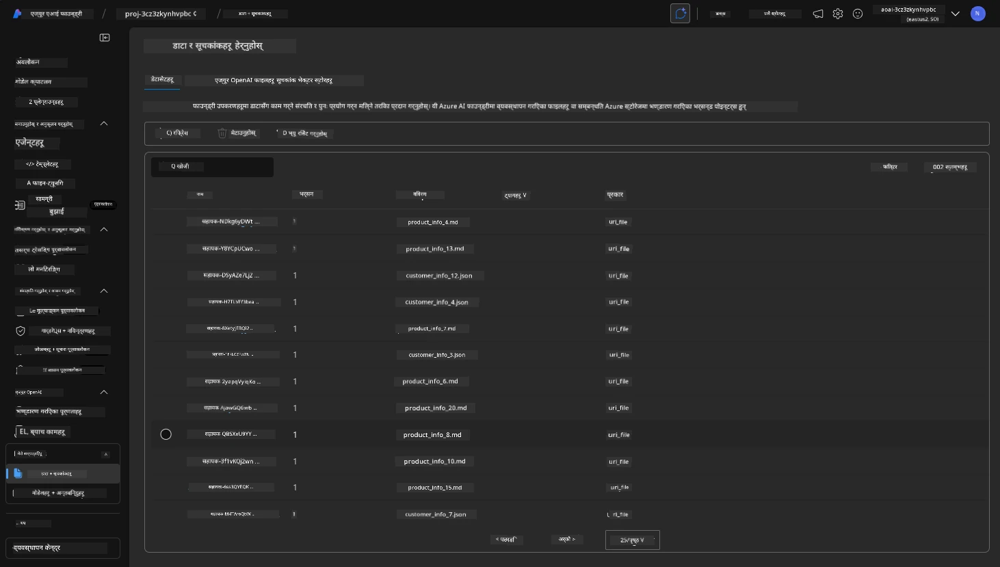

**तपाईंले एजेन्ट सञ्चालन प्रमाणित गर्नुभयो!**

1. एजेन्टका प्रतिक्रिया ती फाइलहरूमा भएको ज्ञानमा आधारित छन्।
1. तपाईं अब त्यो डाटासँग सम्बन्धित प्रश्नहरू सोध्न सक्नुहुन्छ र आधारभूत प्रतिक्रिया पाउन सक्नुहुन्छ।
1. उदाहरण: `customer_info_10.json` ले "Amanda Perez" द्वारा गरिएको ३ खरिदहरू वर्णन गर्दछ।

ब्राउजर ट्याब फिर्ता जानुहोस् जहाँ Container App को एन्डप्वाइन्ट छ र सोध्नुहोस्: `Amanda Perez का कुन-कुन उत्पादनहरू छन्?` तपाईंले यस जस्तो केही देख्नुहुनेछ:

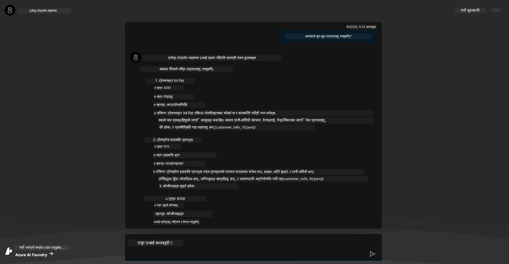

---

## 6. एजेन्ट प्लेग्राउन्ड

Microsoft Foundry को क्षमताको अझ केही बुझाइ बनाउन, एजेन्टलाई Agents Playground मा एकपटक चलाएर हेर्नुहोस्।

1. Microsoft Foundry को `Agents` पृष्ठमा फिर्ता जानुहोस् - डिफल्ट एजेन्ट छान्नुहोस्
1. `Try in Playground` विकल्पमा क्लिक गर्नुहोस् - तपाईंलाई यस्तो प्लेटग्राउन्ड UI प्राप्त हुनेछ
1. उस्तै प्रश्न सोध्नुहोस्: `Amanda Perez का कुन-कुन उत्पादनहरू छन्?`

    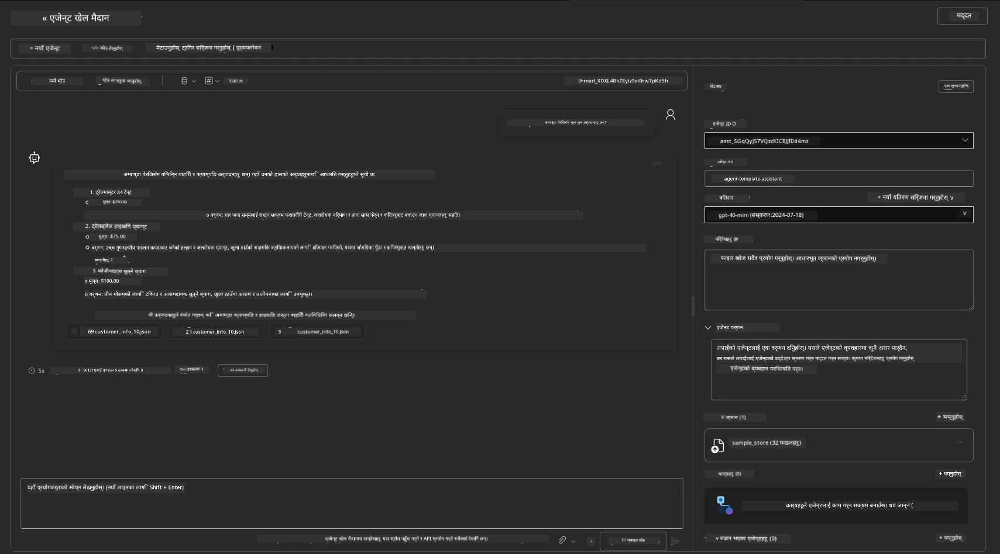

तपाईंलाई त्यस्तै (वा समान) प्रतिक्रिया प्राप्त हुनेछ - तर तपाईंले थप जानकारी पनि पाउनुहुनेछ जसले तपाईंलाई आफ्नो एजेन्टिक अनुप्रयोगको गुणस्तर, लागत, र प्रदर्शन बुझ्न मद्दत गर्दछ। उदाहरणका लागि:

1. प्रतिक्रिया फाइलहरू जसले जवाफलाई "ground" गरेको छ त्यस्ता फाइलहरू जनाइएको हुन्छ
1. यी फाइल लेबलहरू माथि माउस राख्नुहोस् - के डाटा तपाईंको प्रश्न र देखाइएको प्रतिक्रियासँग मेल खान्छ?

तपाईंले प्रतिक्रिया मुनि एउटा _stats_ पङ्क्ति पनि देख्नुहुनेछ।

1. कुनै पनि मापनमा माउस राख्नुहोस् - जस्तै, Safety। तपाईंले यस्तो देख्नुहुनेछ
1. मूल्याङ्कन गरिएको रेटिङ तपाईंको जवाफ सुरक्षाको समझसँग मेल खान्छ?

      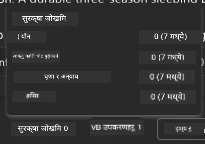

---

## 7. निर्मित अवलोकनयोग्यता

अवलोकनयोग्यता भनेको तपाईंको अनुप्रयोगमा उपकरणहरू राखेर डाटा उत्पादन गर्नु हो जुन अपरेशन बुझ्न, डिबग गर्न, र अनुकूलन गर्न प्रयोग हुन्छ। यसको एउटा झलक पाउनको लागि:

1. `View Run Info` बटनमा क्लिक गर्नुहोस् - तपाईंले यस दृश्य देख्नुहुनेछ। यो [Agent tracing](https://learn.microsoft.com/en-us/azure/ai-foundry/how-to/develop/trace-agents-sdk#view-trace-results-in-the-azure-ai-foundry-agents-playground) को एक प्रयोग हो। _यो दृश्य माथिल्लो स्तरको मेनुमा Thread Logs क्लिक गरेर पनि प्राप्त गर्न सकिन्छ_।

   - एजेन्टले प्रयोग गरेका रन चरण र उपकरणहरू बुझ्नुहोस्
   - प्रतिक्रिया को लागि टोकनको कुल संख्या (vs. आउटपुट टोकनको प्रयोग) बुझ्नुहोस्
   - विलम्बता बुझ्नुहोस् र कार्यान्वयनमा समय कहाँ खर्च भइरहेको छ जान्नुहोस्

      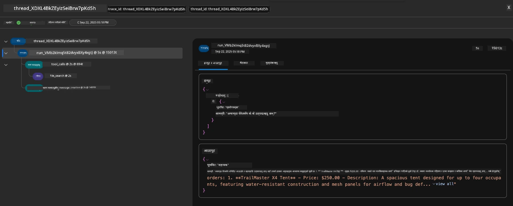

1. `Metadata` ट्याबमा क्लिक गरी रनका थप गुणहरू हेर्नुहोस् जुन पछि समस्याहरू डिबग गर्न उपयोगी सन्दर्भ प्रदान गर्न सक्छ।

      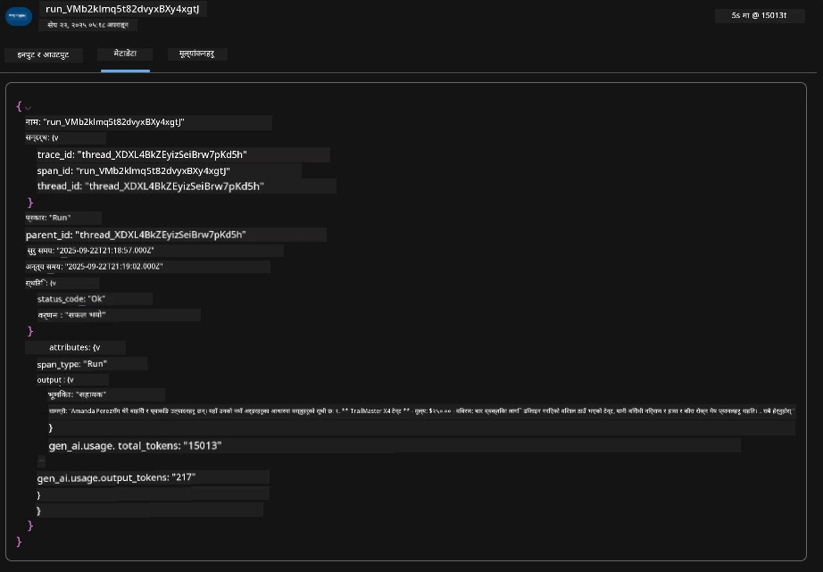


1. `Evaluations` ट्याबमा क्लिक गरी एजेन्ट प्रतिक्रिया मा गरिएका स्वचालित मूल्याङ्कनहरू हेर्नुहोस्। यीमा सुरक्षा मूल्याङ्कनहरू (जस्तै, आत्म-हानि) र एजेन्ट-विशिष्ट मूल्याङ्कनहरू (जस्तै, उद्देश्य समाधान, कार्य पालन) समावेश छन्।

      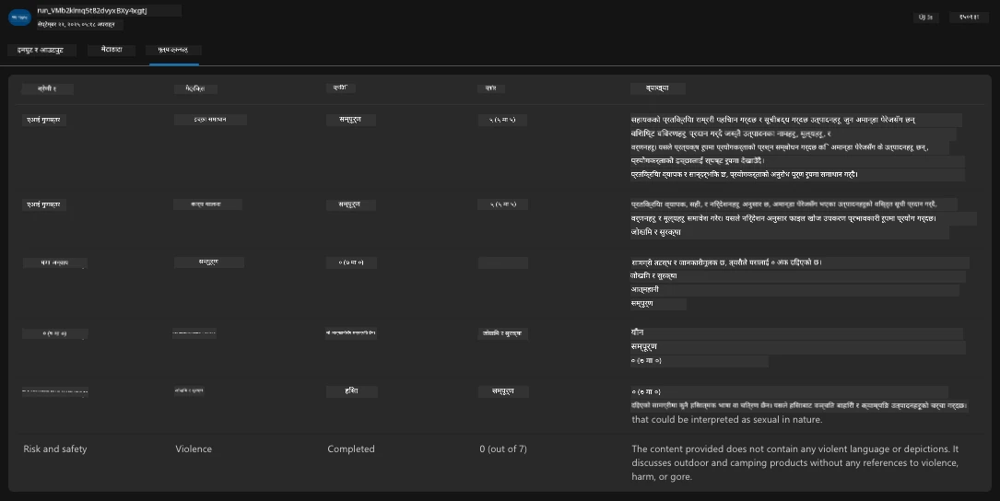

1. अन्त्यमा, साइडबार मेनुमा रहेको `Monitoring` ट्याब क्लिक गर्नुहोस्।

      - देखाइएको पृष्ठमा `Resource usage` ट्याब छान्नुहोस् - र मेट्रिक्स हेर्नुहोस्।
      - लागत (टोकन) र लोड (अनुरोधहरू) को हिसाबले अनुप्रयोग उपयोग ट्र्याक गर्नुहोस्।
      - पहिलो बाइट (इनपुट प्रशोधन) र अन्तिम बाइट (आउटपुट) सम्मको विलम्बता ट्र्याक गर्नुहोस्।

      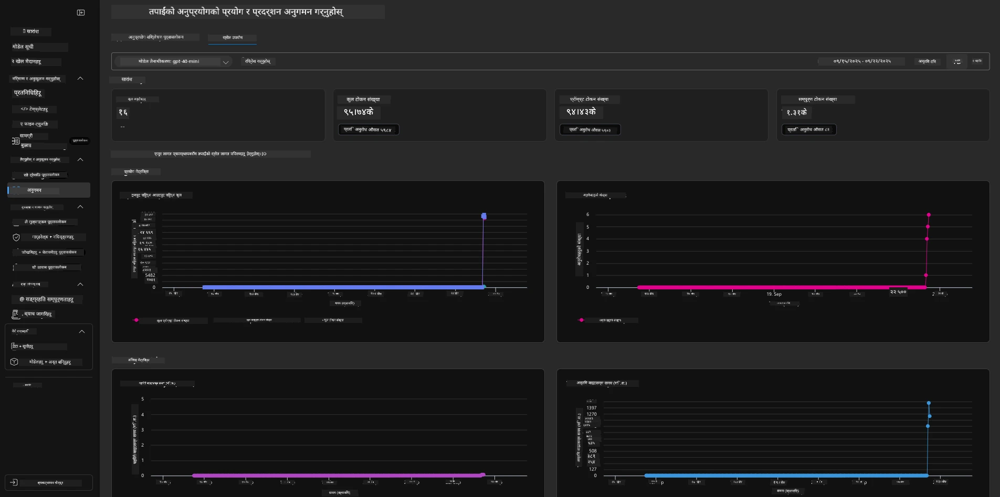

---

## 8. वातावरण चरहरू

अहिलेसम्म, हामीले ब्राउजरमा डिप्लोयमेन्टको प्रक्रिया हेरेका छौं र प्रमाणित गर्यौं कि हाम्रो पूर्वाधार प्रविधान गरिएको छ र अनुप्रयोग सञ्चालनमा छ। तर अनुप्रयोगलाई _कोड-प्रथम_ तरीकाले काम गर्नको लागि, हामीले सम्बन्धित स्रोतहरूसँग काम गर्न आवश्यक वातावरण चरहरूसँग हाम्रो स्थानीय विकास वातावरण कन्फिगर गर्नुपर्ने हुन्छ। `azd` प्रयोग गरेर यो सजिलो हुन्छ।

1. Azure Developer CLI [पर्यावरण चरहरू](https://learn.microsoft.com/en-us/azure/developer/azure-developer-cli/manage-environment-variables?tabs=bash) प्रयोग गर्छ अनुप्रयोग डिप्लोयमेन्टका लागि कन्फिगरेसन सेटिङहरू भण्डारण र व्यवस्थापन गर्न।

1. वातावरण चरहरू `.azure/<env-name>/.env` मा भण्डारण हुन्छन् - यसले उनीहरूलाई डिप्लोयमेन्टको क्रममा प्रयोग गरिएको `env-name` वातावरणमा सीमित बनाउँछ र एउटै रिपोजिटोरीमा विभिन्न डिप्लोयमेन्ट लक्ष्यहरू बीच वातावरणहरू अलग राख्न मद्दत गर्छ।

1. `azd` आदेशले विशिष्ट आदेश (जस्तै, `azd up`) चलाउँदा वातावरण चरहरू स्वतः लोड हुन्छन्। ध्यान दिनुहोस् कि `azd` ले _OS-स्तरका_ वातावरण चरहरू (जस्तै, shell मा सेट गरिएका) स्वतः पढ्दैन - यसको सट्टा स्क्रिप्टहरूमा जानकारी सर्न `azd set env` र `azd get env` प्रयोग गर्नुहोस्।

केही आदेशहरू प्रयास गरौं:

1. यस वातावरणमा `azd` का लागि सेट गरिएका सबै वातावरण चरहरू प्राप्त गर्नुहोस्:

      ```bash title="" linenums="0"
      azd env get-values
      ```
      
      तपाईं यस्तै केही देख्नुहुनेछ:

      ```bash title="" linenums="0"
      AZURE_AI_AGENT_DEPLOYMENT_NAME="gpt-4.1-mini"
      AZURE_AI_AGENT_NAME="agent-template-assistant"
      AZURE_AI_EMBED_DEPLOYMENT_NAME="text-embedding-3-small"
      AZURE_AI_EMBED_DIMENSIONS=100
      ...
      ```

1. एउटा विशेष मान प्राप्त गर्नुहोस् - जस्तै, मैले चाहन्छु थाहा पाउन कि `AZURE_AI_AGENT_MODEL_NAME` मान सेट गरिएको छ कि छैन

      ```bash title="" linenums="0"
      azd env get-value AZURE_AI_AGENT_MODEL_NAME 
      ```
      
      तपाईं यस्तै देख्नुहुनेछ - यो डिफल्टले सेट गरिएको थिएन!

      ```bash title="" linenums="0"
      ERROR: key 'AZURE_AI_AGENT_MODEL_NAME' not found in the environment values
      ```

1. `azd` को लागि नयाँ वातावरण चर सेट गर्नुहोस्। यहाँ, हामी एजेन्ट मोडेल नाम अपडेट गर्दैछौं। _ध्यान दिनुहोस्: गरिएका कुनै पनि परिवर्तनहरू तुरुन्तै `.azure/<env-name>/.env` फाइलमा प्रतिबिम्बित हुन्छन्।

      ```bash title="" linenums="0"
      azd env set AZURE_AI_AGENT_MODEL_NAME gpt-4.1
      azd env set AZURE_AI_AGENT_MODEL_VERSION 2025-04-14
      azd env set AZURE_AI_AGENT_DEPLOYMENT_CAPACITY 150
      ```

      अब, हामीले मान सेट गरिएको पाउनु पर्नेछ:

      ```bash title="" linenums="0"
      azd env get-value AZURE_AI_AGENT_MODEL_NAME 
      ```

1. ध्यान दिनुहोस् कि केही स्रोतहरू स्थायी हुन्छन् (जस्तै, मोडेल डिप्लोयमेन्टहरू) र पुन: डिप्लोय गर्न `azd up` मात्र पर्याप्त नहुन सक्छ। अब, हामी मूल डिप्लोयमेन्ट विघटन गरी परिवर्तन गरिएका वातावरण चरहरूसँग फेरि डिप्लोय गरौं।

1. **ताजा गर्नुहोस्** यदि तपाईंले पहिले कुनै azd टेम्प्लेट प्रयोग गरेर पूर्वाधार तैनाथ गर्नुभएको थियो भने - तपाईं आफ्नो स्थानीय वातावरण चरहरूको अवस्था Azure डिप्लोयमेन्टको वर्तमान अवस्थाबाट यस आदेश प्रयोग गरेर _ताजा_ गर्न सक्नुहुन्छ:

      ```bash title="" linenums="0"
      azd env refresh
      ```

यो दुई वा बढी स्थानीय विकास वातावरणहरू (जस्तै, धेरै विकासकर्ताहरू भएको टिम) बीच वातावरण चरहरूलाई _sync_ गर्नको लागि सशक्त तरिका हो - जसले परिनियोजित पूर्वाधारलाई वातावरण चर अवस्था को लागि आधारभूत सत्यको रूपमा सेवा गर्दछ। टिमका सदस्यहरूले केवल चरहरूलाई _refresh_ गरेर फेरि sync मा आउन सक्छन्।

---

## ९. बधाई छ 🏆

तपाईंले एउटा सम्पूर्ण कार्यप्रवाह पूरा गर्नुभयो जहाँ तपाईंले:

- [X] तपाईंले प्रयोग गर्न चाहनुभएको AZD टेम्प्लेट चयन गर्नुभयो
- [X] टेम्प्लेटलाई समर्थन गरिने विकास वातावरणमा खोल्नुभयो
- [X] टेम्प्लेट परिनियोजित गर्नुभयो र यसले काम गर्दछ भनी प्रमाणित गर्नुभयो

---

<!-- CO-OP TRANSLATOR DISCLAIMER START -->
**अस्वीकरण**:  
यो दस्तावेज [Co-op Translator](https://github.com/Azure/co-op-translator) नामक एआई अनुवाद सेवा प्रयोग गरी अनुवाद गरिएको हो। हामी शुद्धताका लागि प्रयासरत छौँ, तर कृपया जानकार हुनुहोस् कि स्वचालित अनुवादमा त्रुटि वा अशुद्धता हुन सक्ने सम्भावना रहन्छ। मूल भाषा मा रहेको दस्तावेजलाई अधिकारप्राप्त स्रोतको रूपमा मानिनु पर्छ। महत्वपूर्ण जानकारीको लागि व्यावसायिक मानवीय अनुवाद सिफारिस गरिन्छ। यस अनुवादको प्रयोगबाट उत्पन्न हुने कुनै पनि गलतफहमी वा गलत व्याख्याको लागि हामी जिम्मेवार छैनौं।
<!-- CO-OP TRANSLATOR DISCLAIMER END -->