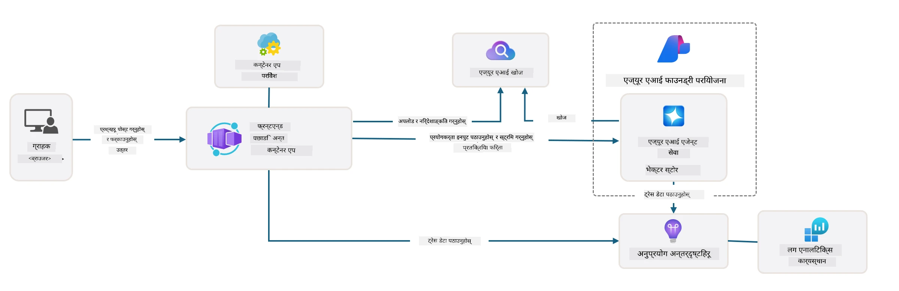

# ३. टेम्प्लेटलाई डिकन्स्ट्रक्ट गर्नुहोस्

!!! tip "यस मोड्युलको अन्त्यसम्ममा तपाईं सक्षम हुनुहुनेछ"

    - [ ] वस्तु
    - [ ] वस्तु
    - [ ] वस्तु
    - [ ] **प्रयोगशाला ३:** 

---

AZD टेम्प्लेटहरू र Azure Developer CLI (`azd`) को साथमा, हामीले AI विकास यात्रा छिटो सुरु गर्न सक्दछौं। यसले नमूना कोड, पूर्वाधार, र कन्फिगरेसन फाइलहरू प्रदान गर्दछ - तयार-प्रोजेक्टको रूपमा।

**तर अब, हामीले परियोजना संरचना र कोडबेस बुझ्न आवश्यक छ - र AZD टेम्प्लेटलाई अनुकूलन गर्न सक्षम हुनुपर्छ - कुनै पनि पूर्व अनुभव वा AZD को समझ बिना!**

---

## १. GitHub Copilot सक्रिय गर्नुहोस्

### १.१ GitHub Copilot Chat स्थापना गर्नुहोस्

[GitHub Copilot with Agent Mode](https://code.visualstudio.com/docs/copilot/chat/chat-agent-mode) अन्वेषण गर्ने समय आएको छ। अब, हामी प्राकृतिक भाषामा हाम्रो कार्यलाई उच्च स्तरमा वर्णन गर्न सक्छौं, र कार्यान्वयनमा सहयोग प्राप्त गर्न सक्छौं। यस प्रयोगशालाको लागि, हामी [Copilot Free plan](https://github.com/github-copilot/signup) प्रयोग गर्नेछौं जसमा मासिक सीमितता छ।

यो एक्सटेन्सन मार्केटप्लेसबाट स्थापना गर्न सकिन्छ, तर यो पहिले नै तपाईंको Codespaces वातावरणमा उपलब्ध हुनुपर्छ। _Copilot आइकन ड्रपडाउनबाट `Open Chat` क्लिक गर्नुहोस् - र `What can you do?` जस्तो प्रम्प्ट टाइप गर्नुहोस्_ - तपाईंलाई लगइन गर्न अनुरोध गर्न सकिन्छ। **GitHub Copilot Chat तयार छ।**

### १.२ MCP सर्भरहरू स्थापना गर्नुहोस्

एजेन्ट मोड प्रभावकारी हुनको लागि, यसलाई ज्ञान प्राप्त गर्न वा कार्यहरू लिन सही उपकरणहरूको पहुँच आवश्यक छ। यहीँ MCP सर्भरहरूले मद्दत गर्न सक्छ। हामी निम्न सर्भरहरू कन्फिगर गर्नेछौं:

1. [Azure MCP Server](../../../../../workshop/docs/instructions)
1. [Microsoft Docs MCP Server](../../../../../workshop/docs/instructions)

यी सक्रिय गर्न:

1. `.vscode/mcp.json` नामक फाइल बनाउनुहोस् यदि यो अवस्थित छैन भने
1. तलको सामग्रीलाई उक्त फाइलमा प्रतिलिपि गर्नुहोस् - र सर्भरहरू सुरु गर्नुहोस्!
   ```json title=".vscode/mcp.json"
   {
      "servers": {
         "Azure MCP Server": {
            "command": "npx",
            "args": [
            "-y",
            "@azure/mcp@latest",
            "server",
            "start"
            ]
         },
         "microsoft.docs.mcp": {
            "type": "http",
            "url": "https://learn.microsoft.com/api/mcp"
         }
      }
   }
   ```

??? warning "`npx` स्थापना नभएको त्रुटि आउन सक्छ (ठीक गर्न विस्तारमा क्लिक गर्नुहोस्)"

      यसलाई ठीक गर्न, `.devcontainer/devcontainer.json` फाइल खोल्नुहोस् र फिचर सेक्सनमा यो लाइन थप्नुहोस्। त्यसपछि कन्टेनर पुनर्निर्माण गर्नुहोस्। अब `npx` स्थापना भएको हुनुपर्छ।

      ```title="" linenums="0"
         "features": {
            "ghcr.io/devcontainers/features/node:1": {},
            ...
         },
      ```

---

### १.३ GitHub Copilot Chat परीक्षण गर्नुहोस्

**पहिले `az login` प्रयोग गरेर Azure सँग प्रमाणिकरण गर्नुहोस्।**

अब तपाईं आफ्नो Azure सदस्यता स्थिति सोध्न सक्नुहुन्छ, र तैनात स्रोतहरू वा कन्फिगरेसनको बारेमा प्रश्न सोध्न सक्नुहुन्छ। यी प्रम्प्टहरू प्रयास गर्नुहोस्:

1. `List my Azure resource groups`
1. `#foundry list my current deployments`

तपाईं Azure डकुमेन्टेशनको बारेमा प्रश्न सोध्न सक्नुहुन्छ र Microsoft Docs MCP सर्भरमा आधारित उत्तर प्राप्त गर्न सक्नुहुन्छ। यी प्रम्प्टहरू प्रयास गर्नुहोस्:

1. `#microsoft_docs_search What is Azure Developer CLI?`
1. `#microsoft_docs_search Show me a Python tutorial to chat with deployed model`

वा तपाईं कार्य पूरा गर्न कोड स्निपेटहरू सोध्न सक्नुहुन्छ। यो प्रम्प्ट प्रयास गर्नुहोस्।

1. `Give me a Python code example that uses AAD for an interactive chat client`

`Ask` मोडमा, यसले तपाईंलाई कोड प्रदान गर्नेछ जुन तपाईं प्रतिलिपि-पेस्ट गर्न सक्नुहुन्छ। `Agent` मोडमा, यसले तपाईंलाई कार्य पूरा गर्न आवश्यक स्रोतहरू सिर्जना गर्न सक्छ - सेटअप स्क्रिप्टहरू र डकुमेन्टेशन सहित।

**अब तपाईं टेम्प्लेट रिपोजिटरी अन्वेषण गर्न तयार हुनुहुन्छ।**

---

## २. आर्किटेक्चर डिकन्स्ट्रक्ट गर्नुहोस्

??? prompt "ASK: docs/images/architecture.png मा अनुप्रयोग आर्किटेक्चरलाई १ अनुच्छेदमा व्याख्या गर्नुहोस्"

      यो अनुप्रयोग Azure मा निर्मित AI-संचालित च्याट अनुप्रयोग हो जसले आधुनिक एजेन्ट-आधारित आर्किटेक्चर प्रदर्शन गर्दछ। समाधानको केन्द्रमा Azure Container App छ जसले मुख्य अनुप्रयोग कोड होस्ट गर्दछ, जसले प्रयोगकर्ता इनपुटलाई प्रक्रिया गर्दछ र AI एजेन्ट मार्फत बुद्धिमानी प्रतिक्रिया उत्पन्न गर्दछ। 
      
      आर्किटेक्चरले Azure AI Foundry Project लाई AI क्षमताहरूको आधारको रूपमा प्रयोग गर्दछ, Azure AI Services सँग जडान गर्दछ जसले भाषा मोडेलहरू (जस्तै GPT-4o-mini) र एजेन्ट कार्यक्षमता प्रदान गर्दछ। प्रयोगकर्ता अन्तरक्रियाहरू React-आधारित फ्रन्टएन्डबाट FastAPI ब्याकएन्डमा प्रवाह हुन्छन् जसले AI एजेन्ट सेवासँग सन्दर्भात्मक प्रतिक्रिया उत्पन्न गर्न संवाद गर्दछ। 
      
      प्रणालीले फाइल खोज वा Azure AI Search सेवा मार्फत ज्ञान पुनःप्राप्ति क्षमताहरू समावेश गर्दछ, जसले एजेन्टलाई अपलोड गरिएका डकुमेन्टहरूबाट जानकारी पहुँच गर्न र उद्धृत गर्न अनुमति दिन्छ। सञ्चालन उत्कृष्टताको लागि, आर्किटेक्चरले ट्रेसिङ, लगिङ, र प्रदर्शन अनुकूलनको लागि Application Insights र Log Analytics Workspace मार्फत व्यापक निगरानी समावेश गर्दछ। 
      
      Azure Storage ले अनुप्रयोग डेटा र फाइल अपलोडहरूको लागि ब्लब स्टोरेज प्रदान गर्दछ, जबकि Managed Identity ले क्रेडेन्सियलहरू भण्डारण नगरी Azure स्रोतहरू बीच सुरक्षित पहुँच सुनिश्चित गर्दछ। सम्पूर्ण समाधान मागको आधारमा स्वचालित रूपमा स्केल गर्न डिजाइन गरिएको छ, जबकि Azure को प्रबन्धित सेवाहरूको इकोसिस्टम मार्फत निर्मित सुरक्षा, निगरानी, र CI/CD क्षमताहरू प्रदान गर्दछ।



---

## ३. रिपोजिटरी संरचना

!!! prompt "ASK: टेम्प्लेट फोल्डर संरचनालाई व्याख्या गर्नुहोस्। दृश्यात्मक पदानुक्रमात्मक आरेखबाट सुरु गर्नुहोस्।"

??? info "ANSWER: दृश्यात्मक पदानुक्रमात्मक आरेख"

      ```bash title="" 
      get-started-with-ai-agents/
      ├── 📋 कन्फिगरेसन र सेटअप
      │   ├── azure.yaml                    # Azure Developer CLI कन्फिगरेसन
      │   ├── docker-compose.yaml           # स्थानीय विकास कन्टेनरहरू
      │   ├── pyproject.toml                # Python परियोजना कन्फिगरेसन
      │   ├── requirements-dev.txt          # विकास निर्भरता
      │   └── .devcontainer/                # VS Code dev कन्टेनर सेटअप
      │
      ├── 🏗️ पूर्वाधार (infra/)
      │   ├── main.bicep                    # मुख्य पूर्वाधार टेम्प्लेट
      │   ├── api.bicep                     # API-विशिष्ट स्रोतहरू
      │   ├── main.parameters.json          # पूर्वाधार प्यारामिटरहरू
      │   └── core/                         # मोड्युलर पूर्वाधार घटकहरू
      │       ├── ai/                       # AI सेवा कन्फिगरेसनहरू
      │       ├── host/                     # होस्टिङ पूर्वाधार
      │       ├── monitor/                  # निगरानी र लगिङ
      │       ├── search/                   # Azure AI Search सेटअप
      │       ├── security/                 # सुरक्षा र पहिचान
      │       └── storage/                  # स्टोरेज खाता कन्फिगरेसनहरू
      │
      ├── 💻 अनुप्रयोग स्रोत (src/)
      │   ├── api/                          # ब्याकएन्ड API
      │   │   ├── main.py                   # FastAPI अनुप्रयोग प्रवेश
      │   │   ├── routes.py                 # API मार्ग परिभाषा
      │   │   ├── search_index_manager.py   # खोज कार्यक्षमता
      │   │   ├── data/                     # API डेटा ह्यान्डलिङ
      │   │   ├── static/                   # स्थिर वेब सम्पत्ति
      │   │   └── templates/                # HTML टेम्प्लेटहरू
      │   ├── frontend/                     # React/TypeScript फ्रन्टएन्ड
      │   │   ├── package.json              # Node.js निर्भरता
      │   │   ├── vite.config.ts            # Vite निर्माण कन्फिगरेसन
      │   │   └── src/                      # फ्रन्टएन्ड स्रोत कोड
      │   ├── data/                         # नमूना डेटा फाइलहरू
      │   │   └── embeddings.csv            # पूर्व-गणना गरिएको embeddings
      │   ├── files/                        # ज्ञान आधार फाइलहरू
      │   │   ├── customer_info_*.json      # ग्राहक डेटा नमूना
      │   │   └── product_info_*.md         # उत्पादन डकुमेन्टेशन
      │   ├── Dockerfile                    # कन्टेनर कन्फिगरेसन
      │   └── requirements.txt              # Python निर्भरता
      │
      ├── 🔧 स्वचालन र स्क्रिप्टहरू (scripts/)
      │   ├── postdeploy.sh/.ps1           # पोस्ट-डिप्लोयमेन्ट सेटअप
      │   ├── setup_credential.sh/.ps1     # क्रेडेन्सियल कन्फिगरेसन
      │   ├── validate_env_vars.sh/.ps1    # वातावरण मान्यकरण
      │   └── resolve_model_quota.sh/.ps1  # मोडेल कोटा व्यवस्थापन
      │
      ├── 🧪 परीक्षण र मूल्याङ्कन
      │   ├── tests/                        # युनिट र एकीकरण परीक्षणहरू
      │   │   └── test_search_index_manager.py
      │   ├── evals/                        # एजेन्ट मूल्याङ्कन फ्रेमवर्क
      │   │   ├── evaluate.py               # मूल्याङ्कन रनर
      │   │   ├── eval-queries.json         # परीक्षण क्वेरीहरू
      │   │   └── eval-action-data-path.json
      │   ├── sandbox/                      # विकास खेलमैदान
      │   │   ├── 1-quickstart.py           # सुरु गर्ने उदाहरणहरू
      │   │   └── aad-interactive-chat.py   # प्रमाणिकरण उदाहरणहरू
      │   └── airedteaming/                 # AI सुरक्षा मूल्याङ्कन
      │       └── ai_redteaming.py          # रेड टिम परीक्षण
      │
      ├── 📚 डकुमेन्टेशन (docs/)
      │   ├── deployment.md                 # डिप्लोयमेन्ट गाइड
      │   ├── local_development.md          # स्थानीय सेटअप निर्देशनहरू
      │   ├── troubleshooting.md            # सामान्य समस्याहरू र समाधानहरू
      │   ├── azure_account_setup.md        # Azure पूर्वापेक्षाहरू
      │   └── images/                       # डकुमेन्टेशन सम्पत्ति
      │
      └── 📄 परियोजना मेटाडाटा
         ├── README.md                     # परियोजना अवलोकन
         ├── CODE_OF_CONDUCT.md           # समुदाय दिशानिर्देशहरू
         ├── CONTRIBUTING.md              # योगदान गाइड
         ├── LICENSE                      # लाइसेन्स सर्तहरू
         └── next-steps.md                # पोस्ट-डिप्लोयमेन्ट मार्गदर्शन
      ```

### ३.१ कोर अनुप्रयोग आर्किटेक्चर

यो टेम्प्लेटले **पूर्ण-स्ट्याक वेब अनुप्रयोग** ढाँचालाई पछ्याउँछ:

- **ब्याकएन्ड**: Python FastAPI Azure AI एकीकरणको साथ
- **फ्रन्टएन्ड**: TypeScript/React Vite निर्माण प्रणालीको साथ
- **पूर्वाधार**: Azure Bicep टेम्प्लेटहरू क्लाउड स्रोतहरूको लागि
- **कन्टेनराइजेसन**: स्थिर डिप्लोयमेन्टको लागि Docker

### ३.२ पूर्वाधार कोडको रूपमा (bicep)

पूर्वाधार तहले **Azure Bicep** टेम्प्लेटहरूलाई मोड्युलर रूपमा व्यवस्थित गर्दछ:

   - **`main.bicep`**: सबै Azure स्रोतहरूलाई समन्वय गर्दछ
   - **`core/` मोड्युलहरू**: विभिन्न सेवाहरूका लागि पुन: प्रयोगयोग्य घटकहरू
      - AI सेवाहरू (Azure OpenAI, AI Search)
      - कन्टेनर होस्टिङ (Azure Container Apps)
      - निगरानी (Application Insights, Log Analytics)
      - सुरक्षा (Key Vault, Managed Identity)

### ३.३ अनुप्रयोग स्रोत (`src/`)

**ब्याकएन्ड API (`src/api/`)**:

- FastAPI-आधारित REST API
- Azure AI एजेन्ट सेवा एकीकरण
- ज्ञान पुनःप्राप्तिको लागि खोज सूचकांक व्यवस्थापन
- फाइल अपलोड र प्रक्रिया क्षमताहरू

**फ्रन्टएन्ड (`src/frontend/`)**:

- आधुनिक React/TypeScript SPA
- छिटो विकास र अनुकूलित निर्माणको लागि Vite
- एजेन्ट अन्तरक्रियाको लागि च्याट इन्टरफेस

**ज्ञान आधार (`src/files/`)**:

- ग्राहक र उत्पादन डेटा नमूना
- फाइल-आधारित ज्ञान पुनःप्राप्ति प्रदर्शन गर्दछ
- JSON र Markdown ढाँचाका उदाहरणहरू

### ३.४ DevOps र स्वचालन

**स्क्रिप्टहरू (`scripts/`)**:

- क्रस-प्ल्याटफर्म PowerShell र Bash स्क्रिप्टहरू
- वातावरण मान्यकरण र सेटअप
- पोस्ट-डिप्लोयमेन्ट कन्फिगरेसन
- मोडेल कोटा व्यवस्थापन

**Azure Developer CLI एकीकरण**:

- `azure.yaml` कन्फिगरेसन `azd` वर्कफ्लोहरूको लागि
- स्वचालित प्रावधान र डिप्लोयमेन्ट
- वातावरण चर व्यवस्थापन

### ३.५ परीक्षण र गुणस्तर आश्वासन

**मूल्याङ्कन फ्रेमवर्क (`evals/`)**:

- एजेन्ट प्रदर्शन मूल्याङ्कन
- क्वेरी-प्रतिक्रिया गुणस्तर परीक्षण
- स्वचालित मूल्याङ्कन पाइपलाइन

**AI सुरक्षा (`airedteaming/`)**:

- AI सुरक्षा परीक्षणको लागि रेड टिम परीक्षण
- सुरक्षा कमजोरी स्क्यानिङ
- जिम्मेवार AI अभ्यासहरू

---

## ४. बधाई 🏆

तपाईंले GitHub Copilot Chat MCP सर्भरहरूसँग प्रयोग गर्न सफल हुनुभयो, रिपोजिटरी अन्वेषण गर्न।

- [X] Azure को लागि GitHub Copilot सक्रिय गरियो
- [X] अनुप्रयोग आर्किटेक्चर बुझियो
- [X] AZD टेम्प्लेट संरचना अन्वेषण गरियो

यसले तपाईंलाई यस टेम्प्लेटको _पूर्वाधार कोडको रूपमा_ सम्पत्तिहरूको समझ दिन्छ। अब, हामी AZD को कन्फिगरेसन फाइल हेर्नेछौं।

---

