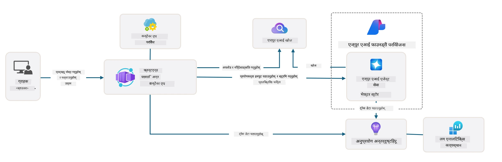

# 3. टेम्पलेट विघटन

!!! tip "यस मोड्युलको अन्त्यसम्म तपाईं सक्षम हुनुहुनेछ"

    - [ ] GitHub Copilot लाई Azure सहायता का लागि MCP सर्भरहरूसँग सक्रिय गर्नुहोस्
    - [ ] AZD टेम्पलेट फोल्डर संरचना र कम्पोनेन्टहरू बुझ्नुहोस्
    - [ ] Infrastructure-as-code (Bicep) संगठन ढाँचाहरू अन्वेषण गर्नुहोस्
    - [ ] **Lab 3:** GitHub Copilot प्रयोग गरी रिपोजिटरी आर्किटेक्चर अन्वेषण र बुझ्नुहोस् 

---


AZD टेम्पलेटहरू र Azure Developer CLI (`azd`) सँग हामी छिटो हाम्रो AI विकास यात्रा आरम्भ गर्न सक्छौं, यीले नमूना कोड, पूर्वनिर्धारित इन्फ्रास्ट्रक्चर र कन्फिगरेसन फाइलहरू प्रदान गर्छन् - तयार-परिनियोजनको _स्टार्टर_ प्रोजेक्टको रूपमा ।

**तर अब, हामीले प्रोजेक्ट संरचना र कोडबेस बुझ्नुपर्छ - र कुनै पनि पूर्व अनुभव वा AZD बुझे बिना AZD टेम्पलेट अनुकूलन गर्न सक्षम हुनुपर्छ!**

---

## 1. GitHub Copilot सक्रिय गर्नुहोस्

### 1.1 GitHub Copilot Chat इन्स्टल गर्नुहोस्

अब [GitHub Copilot with Agent Mode](https://code.visualstudio.com/docs/copilot/chat/chat-agent-mode) अन्वेषण गर्ने समय हो। अब, हामी प्राकृतिक भाषा प्रयोग गरेर हाम्रो कार्य उच्च स्तरमा वर्णन गर्न सक्छौं, र कार्यान्वयनमा सहयोग पाउन सक्छौं। यस प्रयोगशालाको लागि, हामी [Copilot Free plan](https://github.com/github-copilot/signup) प्रयोग गर्नेछौं जसमा पूर्णता र च्याट अन्तरक्रियाहरूको मासिक सीमा हुन्छ।

एक्सटेन्सन मार्केटप्लेसबाट इन्स्टल गर्न सकिन्छ, तर तपाईंको Codespaces वातावरणमा पहिले नै उपलब्ध हुनु पर्छ। _Copilot आइकन ड्रप-डाउनबाट `Open Chat` क्लिक गर्नुहोस् - र `What can you do?` जस्तो प्रविधि टाइप गर्नुहोस्_ - तपाईंलाई लग इन गर्न भनिन सक्छ। **GitHub Copilot Chat तयार छ**।

### 1.2. MCP सर्भरहरू इन्स्टल गर्नुहोस्

एजेन्ट मोड प्रभावकारी हुनका लागि, यसले सही उपकरणहरूमा पहुँच आवश्यक पर्छ जसले ज्ञान प्राप्त गर्न वा कार्यहरू लिन मद्दत गर्छ। यहाँ MCP सर्भरहरूले सहयोग गर्न सक्छ। हामी तलका सर्भरहरू कन्फिगर गर्नेछौं:

1. [Azure MCP Server](../../../../../workshop/docs/instructions)
1. [Microsoft Docs MCP Server](../../../../../workshop/docs/instructions)

यी सक्रिय गर्न:

1. `.vscode/mcp.json` नामको फाइल बनाउनुहोस् यदि यो अवस्थित छैन भने
1. तलको सामग्री त्यो फाइलमा कपी गर्नुहोस् - र सर्भरहरू सुरु गर्नुहोस्!
   ```json title=".vscode/mcp.json"
   {
      "servers": {
         "Azure MCP Server": {
            "command": "npx",
            "args": [
            "-y",
            "@azure/mcp@latest",
            "server",
            "start"
            ]
         },
         "microsoft.docs.mcp": {
            "type": "http",
            "url": "https://learn.microsoft.com/api/mcp"
         }
      }
   }
   ```

??? warning "तपाईंलाई `npx` इन्स्टल गरिएको छैन भन्ने त्रुटि आउन सक्छ (समाधानका लागि विस्तार गर्न क्लिक गर्नुहोस्)"

      यसलाई समाधान गर्न, `.devcontainer/devcontainer.json` फाइल खोल्नुहोस् र features सेक्सनमा यो लाइन थप्नुहोस्। त्यसपछि कन्टेनर पुनर्निर्माण गर्नुहोस्। अब तपाईं सँग `npx` इन्स्टल भएको हुनेछ।

      ```title="" linenums="0"
         "features": {
            "ghcr.io/devcontainers/features/node:1": {},
            ...
         },
      ```


---

### 1.3. GitHub Copilot Chat परीक्षण गर्नुहोस्

**पहिले `az login` प्रयोग गरी VS Code कमाण्ड लाइनबाट Azure सँग प्रमाणित गर्नुहोस्।**

अब तपाईं आफ्नो Azure सदस्यता स्थिति सोध्न सक्षम हुनु पर्नेछ, र परिनियोजित स्रोतहरू वा कन्फिगरेसनबारे प्रश्नहरू सोध्न सक्नुहुनेछ। यी प्रम्प्टहरू प्रयास गर्नुहोस्:

1. `List my Azure resource groups`
1. `#foundry list my current deployments`

तपाईं Azure डकुमेन्टेसन सम्बन्धी प्रश्नहरू सोधेर Microsoft Docs MCP सर्भरमा आधारित जवाफहरू पनि प्राप्त गर्न सक्नुहुन्छ। यी प्रम्प्टहरू प्रयास गर्नुहोस्:

1. `#microsoft_docs_search What is Azure Developer CLI?`
1. `#microsoft_docs_search Show me a Python tutorial to chat with deployed model`

वा तपाईंले कुनै कार्य पूरा गर्न कोड स्निपेटहरू माग्न सक्नुहुन्छ। यो प्रम्प्ट प्रयास गर्नुहोस्।

1. `Give me a Python code example that uses AAD for an interactive chat client`

`Ask` मोडमा, यसले कपी-पेस्ट गरी प्रयोग गर्न सकिने कोड प्रदान गर्नेछ। `Agent` मोडमा, यसले एक कदम अगाडि बढेर सम्बन्धित स्रोतहरू पनि सिर्जना गर्न सक्छ - सेटअप स्क्रिप्टहरू र दस्तावेजीकरण सहित - जसले तपाईलाई सो कार्य कार्यान्वयन गर्न मद्दत गर्दछ।

**अब तपाईं टेम्पलेट रिपोजिटरी अन्वेषण गर्न सुसज्जित हुनुहुन्छ**

---

## 2. वास्तुकला विघटन

??? prompt "प्रश्न: docs/images/architecture.png मा रहेको अनुप्रयोगको वास्तुकला 1 अनुच्छेदमा व्याख्या गर्नुहोस्"

      यो अनुप्रयोग Azure मा निर्माण गरिएको AI-शक्तिशाली च्याट अनुप्रयोग हो जुन आधुनिक एजेन्ट-आधारित वास्तुकलाको प्रदर्शन गर्दछ। समाधानको केन्द्रमा Azure Container App छ जसले मुख्य अनुप्रयोग कोड होस्ट गर्दछ, जुन प्रयोगकर्ताको इनपुट प्रोसेस गरी AI एजेन्ट मार्फत बुद्धिमान प्रतिक्रियाहरू सिर्जना गर्दछ। 
      
      आर्किटेक्चरले AI क्षमताहरूको लागि Microsoft Foundry Project लाई आधारको रूपमा प्रयोग गर्दछ, जुन Azure AI Services सँग जडान गरेर आधारभूत भाषा मोडेलहरू (जस्तै GPT-4o-mini) र एजेन्ट कार्यक्षमता प्रदान गर्छ। प्रयोगकर्ता अन्तर्क्रियाहरू React-आधारित फ्रन्टएन्डबाट FastAPI ब्याकएन्डमा प्रवाह हुन्छ जसले सन्दर्भपूर्ण प्रतिक्रियाहरू सिर्जना गर्न AI एजेन्ट सेवासँग संवाद गर्छ। 
      
      प्रणालीले फाइल खोज वा Azure AI Search सेवा मार्फत ज्ञान पुनर्प्राप्ति क्षमताहरू समावेश गर्दछ, जसले एजेन्टलाई अपलोड गरिएका दस्तावेजहरूबाट जानकारी पहुँच र उद्धृत गर्न सक्षम बनाउँछ। सञ्चालन उत्कृष्टताका लागि, आर्किटेक्चरमा Application Insights र Log Analytics Workspace मार्फत व्यापक मोनिटरिङ समावेश गरिएको छ ट्रेसिङ, लगिङ, र प्रदर्शन अनुकूलनका लागि। 
      
      Azure Storage ले एप्लिकेशन डेटा र फाइल अपलोडका लागि ब्लब स्टोरेज प्रदान गर्दछ, जबकि Managed Identity ले Azure स्रोतहरू बीच प्रमाणपत्र नबसेर सुरक्षित पहुँच सुनिश्चित गर्छ। सम्पूर्ण समाधान स्केलेबल र मर्मतयोग्य हुने गरी डिजाइन गरिएको छ, कन्टेनराइज्ड एपले मागअनुसार स्वचालित रूपमा स्केल गर्छ र Azure का व्यवस्थापित सेवाहरू मार्फत सुरक्षा, मोनिटरिङ, र CI/CD क्षमताहरू प्रदान गर्छ।



---

## 3. रिपोजिटरी संरचना

!!! prompt "प्रश्न: टेम्पलेट फोल्डर संरचनालाई व्याख्या गर्नुहोस्। दृश्यात्मक अनुक्रमिक आरेखबाट सुरु गर्नुहोस्।"

??? info "उत्तर: दृश्यात्मक अनुक्रमिक आरेख"

      ```bash title="" 
      get-started-with-ai-agents/
      ├── 📋 Configuration & Setup
      │   ├── azure.yaml                    # Azure Developer CLI configuration
      │   ├── docker-compose.yaml           # Local development containers
      │   ├── pyproject.toml                # Python project configuration
      │   ├── requirements-dev.txt          # Development dependencies
      │   └── .devcontainer/                # VS Code dev container setup
      │
      ├── 🏗️ Infrastructure (infra/)
      │   ├── main.bicep                    # Main infrastructure template
      │   ├── api.bicep                     # API-specific resources
      │   ├── main.parameters.json          # Infrastructure parameters
      │   └── core/                         # Modular infrastructure components
      │       ├── ai/                       # AI service configurations
      │       ├── host/                     # Hosting infrastructure
      │       ├── monitor/                  # Monitoring and logging
      │       ├── search/                   # Azure AI Search setup
      │       ├── security/                 # Security and identity
      │       └── storage/                  # Storage account configs
      │
      ├── 💻 Application Source (src/)
      │   ├── api/                          # Backend API
      │   │   ├── main.py                   # FastAPI application entry
      │   │   ├── routes.py                 # API route definitions
      │   │   ├── search_index_manager.py   # Search functionality
      │   │   ├── data/                     # API data handling
      │   │   ├── static/                   # Static web assets
      │   │   └── templates/                # HTML templates
      │   ├── frontend/                     # React/TypeScript frontend
      │   │   ├── package.json              # Node.js dependencies
      │   │   ├── vite.config.ts            # Vite build configuration
      │   │   └── src/                      # Frontend source code
      │   ├── data/                         # Sample data files
      │   │   └── embeddings.csv            # Pre-computed embeddings
      │   ├── files/                        # Knowledge base files
      │   │   ├── customer_info_*.json      # Customer data samples
      │   │   └── product_info_*.md         # Product documentation
      │   ├── Dockerfile                    # Container configuration
      │   └── requirements.txt              # Python dependencies
      │
      ├── 🔧 Automation & Scripts (scripts/)
      │   ├── postdeploy.sh/.ps1           # Post-deployment setup
      │   ├── setup_credential.sh/.ps1     # Credential configuration
      │   ├── validate_env_vars.sh/.ps1    # Environment validation
      │   └── resolve_model_quota.sh/.ps1  # Model quota management
      │
      ├── 🧪 Testing & Evaluation
      │   ├── tests/                        # Unit and integration tests
      │   │   └── test_search_index_manager.py
      │   ├── evals/                        # Agent evaluation framework
      │   │   ├── evaluate.py               # Evaluation runner
      │   │   ├── eval-queries.json         # Test queries
      │   │   └── eval-action-data-path.json
      │   ├── sandbox/                      # Development playground
      │   │   ├── 1-quickstart.py           # Getting started examples
      │   │   └── aad-interactive-chat.py   # Authentication examples
      │   └── airedteaming/                 # AI safety evaluation
      │       └── ai_redteaming.py          # Red team testing
      │
      ├── 📚 Documentation (docs/)
      │   ├── deployment.md                 # Deployment guide
      │   ├── local_development.md          # Local setup instructions
      │   ├── troubleshooting.md            # Common issues & fixes
      │   ├── azure_account_setup.md        # Azure prerequisites
      │   └── images/                       # Documentation assets
      │
      └── 📄 Project Metadata
         ├── README.md                     # Project overview
         ├── CODE_OF_CONDUCT.md           # Community guidelines
         ├── CONTRIBUTING.md              # Contribution guide
         ├── LICENSE                      # License terms
         └── next-steps.md                # Post-deployment guidance
      ```

### 3.1. कोर एप आर्किटेक्चर

यस टेम्पलेटले **फुल-स्ट्याक वेब एप्लिकेशन** ढाँचा अनुसरण गर्दछ जसमा:

- **ब्याकएन्ड**: Python FastAPI र Azure AI एकीकरण
- **फ्रन्टएन्ड**: TypeScript/React र Vite बिल्ड प्रणाली
- **इन्फ्रास्ट्रक्चर**: क्लाउड स्रोतहरूको लागि Azure Bicep टेम्पलेटहरू
- **कन्टेनराइजेसन**: सुसंगत परिनियोजनका लागि Docker

### 3.2 इन्फ्रा एज़ कोड (bicep)

इन्फ्रास्ट्रक्चर लेयरले मोडुलर रूपमा व्यवस्थित गरिएको **Azure Bicep** टेम्पलेटहरू प्रयोग गर्दछ:

   - **`main.bicep`**: सबै Azure स्रोतहरू समन्वय गर्छ
   - **`core/` modules**: विभिन्न सेवाहरूका लागि पुन: प्रयोगयोग्य कम्पोनेन्टहरू
      - AI सेवाहरू (Azure OpenAI, AI Search)
      - कन्टेनर होस्टिङ (Azure Container Apps)
      - मोनिटरिङ (Application Insights, Log Analytics)
      - सुरक्षा (Key Vault, Managed Identity)

### 3.3 एप्लिकेशन स्रोत (`src/`)

**ब्याकएन्ड API (`src/api/`)**:

- FastAPI-आधारित REST API
- Foundry Agents एकीकरण
- ज्ञान पुनर्प्राप्तिका लागि सर्च इन्डेक्स व्यवस्थापन
- फाइल अपलोड र प्रोसेसिङ क्षमताहरू

**फ्रन्टएन्ड (`src/frontend/`)**:

- आधुनिक React/TypeScript SPA
- छिटो विकास र अनुकूलित बिल्डका लागि Vite
- एजेन्ट अन्तर्क्रियाका लागि च्याट इन्टरफेस

**ज्ञान आधार (`src/files/`)**:

- नमूना ग्राहक र उत्पादन डेटा
- फाइल-आधारित ज्ञान पुनर्प्राप्ति प्रदर्शन
- JSON र Markdown ढाँचाका उदाहरणहरू


### 3.4 DevOps & Automation

**स्क्रिप्टहरू (`scripts/`)**:

- क्रस-प्लेटफर्म PowerShell र Bash स्क्रिप्टहरू
- वातावरण प्रमाणीकरण र सेटअप
- पोस्ट-डिप्लोयमेन्ट कन्फिगरेसन
- मोडल कोटा व्यवस्थापन

**Azure Developer CLI एकीकरण**:

- `azure.yaml` `azd` वर्कफ्लोहरूको लागि कन्फिगरेसन
- स्वचालित प्राविजनिङ र परिनियोजन
- वातावरण भेरिएबल व्यवस्थापन

### 3.5 परीक्षण र गुणस्तर आश्वासन

**इभलुएसन फ्रेमवर्क (`evals/`)**:

- एजेन्ट प्रदर्शन मूल्याङ्कन
- क्वेरी-प्रतिक्रिया गुणस्तर परीक्षण
- स्वचालित मूल्यांकन पाइपलाइन

**AI सुरक्षा (`airedteaming/`)**:

- AI सुरक्षा लागि रेड टीम परीक्षण
- सुरक्षा कमजोरी स्क्यानिङ
- जिम्मेवार AI अभ्यासहरू

---

## 4. बधाई छ 🏆

तपाईंले GitHub Copilot Chat लाई MCP सर्भरहरूसँग प्रयोग गरी सफलतापूर्वक रिपोजिटरी अन्वेषण गर्नुभयो।

- [X] GitHub Copilot लाई Azure का लागि सक्रिय गर्नुभयो
- [X] अनुप्रयोग वास्तुकला बुझ्नुभयो
- [X] AZD टेम्पलेट संरचना अन्वेषण गर्नुभयो

यसले तपाईंलाई यस टेम्पलेटका लागि _infrastructure as code_ सम्पत्तिहरूको धारणा दिन्छ। अब, हामी AZD का लागि कन्फिगरेसन फाइल हेरौं।

---

<!-- CO-OP TRANSLATOR DISCLAIMER START -->
अस्वीकरण:
यो दस्तावेज AI अनुवाद सेवा [Co-op Translator](https://github.com/Azure/co-op-translator) प्रयोग गरी अनुवाद गरिएको हो। हामी शुद्धताको लागि प्रयास गर्छौं, तर कृपया ध्यान दिनुहोस् कि स्वचालित अनुवादमा त्रुटि वा अशुद्धता हुन सक्छ। मूल दस्तावेज यसको मूल भाषामा नै अधिकारिक स्रोत मानिनु पर्नेछ। महत्वपूर्ण जानकारीका लागि व्यावसायिक मानव अनुवाद सिफारिस गरिन्छ। यस अनुवादको प्रयोगबाट उत्पन्न हुने कुनै पनि भ्रम वा गलत व्याख्याको लागि हामी जिम्मेवार हुने छैनौं।
<!-- CO-OP TRANSLATOR DISCLAIMER END -->