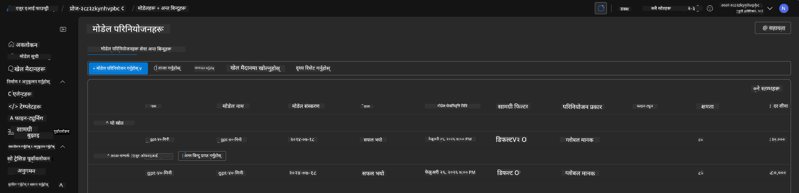
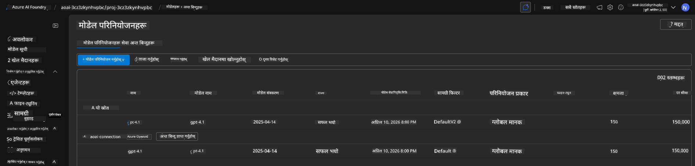

<!--
CO_OP_TRANSLATOR_METADATA:
{
  "original_hash": "6539a34c770f3ceff282370d72ee74dc",
  "translation_date": "2025-09-24T13:43:24+00:00",
  "source_file": "workshop/docs/instructions/6-Teardown-Infrastructure.md",
  "language_code": "ne"
}
-->
# ६. पूर्वाधार हटाउने

!!! tip "यस मोड्युलको अन्त्यसम्ममा तपाईं सक्षम हुनुहुनेछ"

    - [ ] वस्तु
    - [ ] वस्तु
    - [ ] वस्तु

---

## बोनस अभ्यासहरू

परियोजना हटाउनु अघि, केही समय लिएर स्वतन्त्र अन्वेषण गर्नुहोस्।

!!! danger "नित्य-टु-डु: प्रयास गर्नका लागि केही सुझावहरू दिनुहोस्"

---

## पूर्वाधार हटाउनुहोस्

1. पूर्वाधार हटाउनु यति सजिलो छ:
      
      ```bash title="" linenums="0"
      azd down --purge
      ```
1. `--purge` फ्ल्यागले सुनिश्चित गर्दछ कि यसले नरम-डिलिट गरिएका Cognitive Service स्रोतहरू पनि हटाउँछ, जसले गर्दा यी स्रोतहरूले राखेको कोटा मुक्त हुन्छ। पूरा भएपछि तपाईंले यस्तो देख्नुहुनेछ:
      
      ```bash title="" linenums="0"
      ? Total resources to delete: 11, are you sure you want to continue? Yes
      Deleting your resources can take some time.
      (✓) Done: Deleted resource group rg-nitya-mshack-azd
      (✓) Done: Purging Cognitive Account: aoai-3cz3zkynhvpbc

      SUCCESS: Your application was removed from Azure in 11 minutes 4 seconds.
      ```

1. (वैकल्पिक) यदि तपाईं अहिले `azd up` पुन: चलाउनुहुन्छ भने, तपाईंले देख्नुहुनेछ कि gpt-4.1 मोडेल तैनात हुन्छ किनभने वातावरण चर स्थानीय `.azure` फोल्डरमा परिवर्तन (र सुरक्षित) गरिएको थियो। 

      यहाँ मोडेल तैनातीहरू **पहिले**:

      

      र यहाँ यो **पछि**:
      

---

