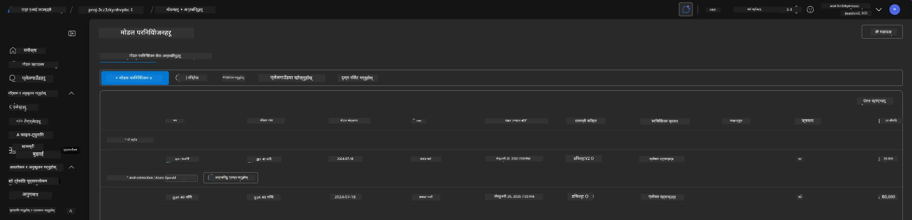
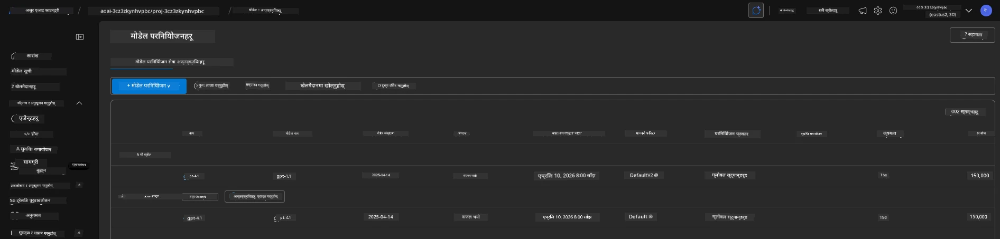

# 6. Teardown Infrastructure

!!! tip "यस मोड्युलको अन्त्यसम्म तपाईं सक्षम हुनुहुनेछ"

    - [ ] स्रोत क्लिनअप र लागत व्यवस्थापनको महत्त्व बुझ्नुहोस्
    - [ ] सुरक्षित रूपमा पूर्वाधार हटाउन `azd down` प्रयोग गर्नुहोस्
    - [ ] आवश्यक परे सफ्ट-डिलिट गरिएका Cognitive Service सेवा पुन:प्राप्त गर्नुहोस्
    - [ ] **Lab 6:** Azure स्रोतहरू सफा गर्नुहोस् र हटाइएको छ कि छैन जाँच गर्नुहोस्

---

## Bonus Exercises

Before we tear down the project, take a few minutes to do some open-ended exploration.

!!! info "यी अन्वेषण प्रेरणाहरू प्रयास गर्नुहोस्"

    **GitHub Copilot सँग प्रयोगात्मक परीक्षण गर्नुहोस्:**
    
    1. Ask: `What other AZD templates could I try for multi-agent scenarios?`
    2. Ask: `How can I customize the agent instructions for a healthcare use case?`
    3. Ask: `What environment variables control cost optimization?`
    
    **Azure Portal अन्वेषण गर्नुहोस्:**
    
    1. तपाइँको परिनियोजनका लागि Application Insights मेट्रिक्स समीक्षा गर्नुहोस्
    2. प्राविजन गरिएका स्रोतहरूको लागत विश्लेषण जाँच गर्नुहोस्
    3. Microsoft Foundry पोर्टल एजेन्ट प्लेग्राउण्ड फेरि एकपटक अन्वेषण गर्नुहोस्

---

## Deprovision Infra

1. पूर्वाधार हटाउन यति सरल छ:
      
      ```bash title="" linenums="0"
      azd down --purge
      ```
1. The `--purge` flag ensures that it also purges soft-deleted Cognitive Service resources, thereby releasing quota held by these resources. Once complete you will see something like this:
      
      ```bash title="" linenums="0"
      ? Total resources to delete: 11, are you sure you want to continue? Yes
      Deleting your resources can take some time.
      (✓) Done: Deleted resource group rg-nitya-mshack-azd
      (✓) Done: Purging Cognitive Account: aoai-3cz3zkynhvpbc

      SUCCESS: Your application was removed from Azure in 11 minutes 4 seconds.
      ```

1. (Optional) If you now run `azd up` again, you will notice the gpt-4.1 model gets deployed since the environment variable was changed (and saved) in the local `.azure` folder. 

      Here is the model deployments **before**:

      

      And here it is **after**:
      

---

<!-- CO-OP TRANSLATOR DISCLAIMER START -->
अस्वीकरण:
यो दस्तावेज AI अनुवाद सेवा Co-op Translator (https://github.com/Azure/co-op-translator) प्रयोग गरी अनुवाद गरिएको हो। हामी शुद्धताका लागि प्रयास गर्छौं, तर कृपया ध्यान दिनुहोस् कि स्वचालित अनुवादमा त्रुटि वा असंगतता हुन सक्छ। मूल दस्तावेजलाई यसको मूल भाषामा अधिकार सम्पन्न स्रोत मानिनु पर्छ। महत्वपूर्ण जानकारीको लागि व्यावसायिक मानव अनुवाद सिफारिश गरिन्छ। यस अनुवादको प्रयोगबाट उत्पन्न हुने कुनै पनि गलतफहमी वा गलत व्याख्याका लागि हामी जिम्मेवार छैनौं।
<!-- CO-OP TRANSLATOR DISCLAIMER END -->