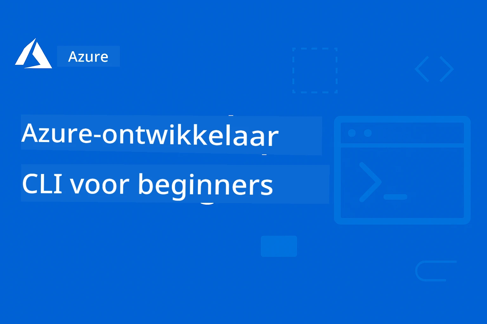

<!--
CO_OP_TRANSLATOR_METADATA:
{
  "original_hash": "068c87cc2641a81ca353ad7064ff326a",
  "translation_date": "2026-01-01T17:07:04+00:00",
  "source_file": "README.md",
  "language_code": "nl"
}
-->
# AZD Voor Beginners: Een Gestructureerde Leerreis

 

[](https://GitHub.com/microsoft/azd-for-beginners/watchers/)
[](https://GitHub.com/microsoft/azd-for-beginners/network/)
[](https://GitHub.com/microsoft/azd-for-beginners/stargazers/)

[](https://discord.gg/microsoft-azure)
[](https://discord.gg/nTYy5BXMWG)

## Aan de slag met deze cursus

Volg deze stappen om je AZD-leerreis te beginnen:

1. **Fork de repository**: Klik [](https://GitHub.com/microsoft/azd-for-beginners/fork)
2. **Kloon de repository**: `git clone https://github.com/microsoft/azd-for-beginners.git`
3. **Sluit je aan bij de community**: [Azure Discord Communities](https://discord.com/invite/ByRwuEEgH4) voor deskundige ondersteuning
4. **Kies je leerpad**: Selecteer een hoofdstuk hieronder dat past bij je ervaringsniveau

### Meertalige ondersteuning

#### Geautomatiseerde vertalingen (altijd up-to-date)

<!-- CO-OP TRANSLATOR LANGUAGES TABLE START -->
[Arabisch](../ar/README.md) | [Bengaals](../bn/README.md) | [Bulgaars](../bg/README.md) | [Birmaans (Myanmar)](../my/README.md) | [Chinees (Vereenvoudigd)](../zh/README.md) | [Chinees (Traditioneel, Hong Kong)](../hk/README.md) | [Chinees (Traditioneel, Macau)](../mo/README.md) | [Chinees (Traditioneel, Taiwan)](../tw/README.md) | [Kroatisch](../hr/README.md) | [Tsjechisch](../cs/README.md) | [Deens](../da/README.md) | [Nederlands](./README.md) | [Ests](../et/README.md) | [Fins](../fi/README.md) | [Frans](../fr/README.md) | [Duits](../de/README.md) | [Grieks](../el/README.md) | [Hebreeuws](../he/README.md) | [Hindi](../hi/README.md) | [Hongaars](../hu/README.md) | [Indonesisch](../id/README.md) | [Italiaans](../it/README.md) | [Japans](../ja/README.md) | [Kannada](../kn/README.md) | [Koreaans](../ko/README.md) | [Litouws](../lt/README.md) | [Maleis](../ms/README.md) | [Malayalam](../ml/README.md) | [Marathi](../mr/README.md) | [Nepalees](../ne/README.md) | [Nigeriaanse Pidgin](../pcm/README.md) | [Noors](../no/README.md) | [Perzisch (Farsi)](../fa/README.md) | [Pools](../pl/README.md) | [Portugees (Brazilië)](../br/README.md) | [Portugees (Portugal)](../pt/README.md) | [Punjabi (Gurmukhi)](../pa/README.md) | [Roemeens](../ro/README.md) | [Russisch](../ru/README.md) | [Servisch (Cyrillisch)](../sr/README.md) | [Slowaaks](../sk/README.md) | [Sloveens](../sl/README.md) | [Spaans](../es/README.md) | [Swahili](../sw/README.md) | [Zweeds](../sv/README.md) | [Tagalog (Filipijns)](../tl/README.md) | [Tamil](../ta/README.md) | [Telugu](../te/README.md) | [Thai](../th/README.md) | [Turks](../tr/README.md) | [Oekraïens](../uk/README.md) | [Urdu](../ur/README.md) | [Vietnamees](../vi/README.md)
<!-- CO-OP TRANSLATOR LANGUAGES TABLE END -->

## Cursusoverzicht

Beheers Azure Developer CLI (azd) via gestructureerde hoofdstukken ontworpen voor stapsgewijs leren. **Speciale focus op het implementeren van AI-toepassingen met Microsoft Foundry-integratie.**

### Waarom deze cursus essentieel is voor moderne ontwikkelaars

Gebaseerd op inzichten uit de Microsoft Foundry Discord-community, **wil 45% van de ontwikkelaars AZD gebruiken voor AI-workloads** maar stuiten op uitdagingen met:
- Complexe multi-service AI-architecturen
- Best practices voor AI-implementatie in productie  
- Integratie en configuratie van Azure AI-services
- Kostenoptimalisatie voor AI-workloads
- Probleemoplossing van AI-specifieke implementatieproblemen

### Leerdoelen

Door deze gestructureerde cursus te voltooien, zul je:
- **Beheers de basis van AZD**: Kernconcepten, installatie en configuratie
- **Implementeer AI-toepassingen**: Gebruik AZD met Microsoft Foundry-services
- **Implementeer Infrastructure as Code**: Beheer Azure-resources met Bicep-sjablonen
- **Los implementatieproblemen op**: Los veelvoorkomende issues op en debug problemen
- **Optimaliseer voor productie**: Beveiliging, schaling, monitoring en kostenbeheer
- **Bouw multi-agentoplossingen**: Implementeer complexe AI-architecturen

## 📚 Leerhoofdstukken

*Kies je leerpad op basis van ervaringsniveau en doelen*

### 🚀 Hoofdstuk 1: Basis & Snelstart
**Vereisten**: Azure-abonnement, basiskennis van de opdrachtregel  
**Duur**: 30-45 minuten  
**Complexiteit**: ⭐

#### Wat je zult leren
- Inzicht in de basisprincipes van Azure Developer CLI
- AZD installeren op je platform
- Je eerste succesvolle implementatie

#### Leermaterialen
- **🎯 Start hier**: [Wat is Azure Developer CLI?](../..)
- **📖 Theorie**: [AZD Basics](docs/getting-started/azd-basics.md) - Kernconcepten en terminologie
- **⚙️ Installatie**: [Installation & Setup](docs/getting-started/installation.md) - Platform-specifieke handleidingen
- **🛠️ Hands-on**: [Je eerste project](docs/getting-started/first-project.md) - Stapsgewijze tutorial
- **📋 Snelreferentie**: [Command Cheat Sheet](resources/cheat-sheet.md)

#### Praktische oefeningen
```bash
# Snelle installatiecontrole
azd version

# Implementeer uw eerste applicatie
azd init --template todo-nodejs-mongo
azd up
```

**💡 Resultaat van het hoofdstuk**: Implementeer succesvol een eenvoudige webapplicatie naar Azure met AZD

**✅ Succesvalidatie:**
```bash
# Na het voltooien van Hoofdstuk 1 zou je in staat moeten zijn om:
azd version              # Toont geïnstalleerde versie
azd init --template todo-nodejs-mongo  # Initialiseert project
azd up                  # Implementeert naar Azure
azd show                # Toont URL van de draaiende app
# De applicatie opent in de browser en werkt
azd down --force --purge  # Ruimt bronnen op
```

**📊 Tijdsinvestering:** 30-45 minuten  
**📈 Vaardigheidsniveau daarna:** Kan basisapplicaties zelfstandig implementeren

**✅ Succesvalidatie:**
```bash
# Na het voltooien van hoofdstuk 1 zou je in staat moeten zijn om:
azd version              # Toont de geïnstalleerde versie
azd init --template todo-nodejs-mongo  # Initialiseert het project
azd up                  # Implementeert naar Azure
azd show                # Toont de URL van de draaiende app
# De applicatie opent in de browser en werkt
azd down --force --purge  # Ruimt resources op
```

**📊 Tijdsinvestering:** 30-45 minuten  
**📈 Vaardigheidsniveau daarna:** Kan basisapplicaties zelfstandig implementeren

---

### 🤖 Hoofdstuk 2: AI-First ontwikkeling (Aanbevolen voor AI-ontwikkelaars)
**Vereisten**: Hoofdstuk 1 voltooid  
**Duur**: 1-2 uur  
**Complexiteit**: ⭐⭐

#### Wat je zult leren
- Microsoft Foundry-integratie met AZD
- AI-aangedreven toepassingen implementeren
- Inzicht in AI-serviceconfiguraties

#### Leermaterialen
- **🎯 Start hier**: [Microsoft Foundry Integration](docs/microsoft-foundry/microsoft-foundry-integration.md)
- **📖 Patronen**: [AI Model Deployment](docs/microsoft-foundry/ai-model-deployment.md) - Implementeer en beheer AI-modellen
- **🛠️ Workshop**: [AI Workshop Lab](docs/microsoft-foundry/ai-workshop-lab.md) - Maak je AI-oplossingen AZD-klaar
- **🎥 Interactieve gids**: [Workshop Materials](workshop/README.md) - Browsergebaseerd leren met MkDocs * DevContainer-omgeving
- **📋 Sjablonen**: [Microsoft Foundry Templates](../..)
- **📝 Voorbeelden**: [AZD Deployment Examples](examples/README.md)

#### Praktische oefeningen
```bash
# Implementeer je eerste AI-applicatie
azd init --template azure-search-openai-demo
azd up

# Probeer extra AI-sjablonen
azd init --template openai-chat-app-quickstart
azd init --template agent-openai-python-prompty
```

**💡 Resultaat van het hoofdstuk**: Implementeer en configureer een AI-aangedreven chatapplicatie met RAG-mogelijkheden

**✅ Succesvalidatie:**
```bash
# Na hoofdstuk 2 zou je het volgende moeten kunnen:
azd init --template azure-search-openai-demo
azd up
# Test de AI-chatinterface
# Stel vragen en krijg door AI aangedreven antwoorden met bronnen
# Controleer of de zoekintegratie werkt
azd monitor  # Controleer of Application Insights telemetrie weergeeft
azd down --force --purge
```

**📊 Tijdsinvestering:** 1-2 uur  
**📈 Vaardigheidsniveau daarna:** Kan productieklare AI-toepassingen implementeren en configureren  
**💰 Kostenbewustzijn:** Begrijp $80-150/maand ontwikkelkosten, $300-3500/maand productiekosten

#### 💰 Kostenoverwegingen voor AI-implementaties

**Ontwikkelomgeving (geschat $80-150/maand):**
- Azure OpenAI (Pay-as-you-go): $0-50/maand (gebaseerd op tokengebruik)
- AI Search (Basic-laag): $75/maand
- Container Apps (Consumption): $0-20/maand
- Opslag (Standaard): $1-5/maand

**Productieomgeving (geschat $300-3.500+/maand):**
- Azure OpenAI (PTU voor consistente prestaties): $3.000+/maand OF Pay-as-you-go bij hoog volume
- AI Search (Standard-laag): $250/maand
- Container Apps (Dedicated): $50-100/maand
- Application Insights: $5-50/maand
- Opslag (Premium): $10-50/maand

**💡 Tips voor kostenoptimalisatie:**
- Gebruik de **gratis laag** van Azure OpenAI voor leren (50.000 tokens/maand inbegrepen)
- Voer `azd down` uit om resources vrij te geven wanneer je niet actief ontwikkelt
- Begin met verbruikgebaseerde facturering, upgrade naar PTU alleen voor productie
- Gebruik `azd provision --preview` om kosten vóór implementatie te schatten
- Schakel autoscaling in: betaal alleen voor daadwerkelijk gebruik

**Kostenmonitoring:**
```bash
# Controleer de geschatte maandelijkse kosten
azd provision --preview

# Houd werkelijke kosten bij in het Azure-portaal
az consumption budget list --resource-group <your-rg>
```

---

### ⚙️ Hoofdstuk 3: Configuratie & authenticatie
**Vereisten**: Hoofdstuk 1 voltooid  
**Duur**: 45-60 minuten  
**Complexiteit**: ⭐⭐

#### Wat je zult leren
- Omgevingsconfiguratie en -beheer
- Authenticatie- en beveiligingsbest practices
- Naamgeving en organisatie van resources

#### Leermaterialen
- **📖 Configuratie**: [Configuration Guide](docs/getting-started/configuration.md) - Omgevingsinstelling
- **🔐 Beveiliging**: [Authentication patterns and managed identity](docs/getting-started/authsecurity.md) - Authenticatiepatronen
- **📝 Voorbeelden**: [Database App Example](examples/database-app/README.md) - AZD-databasevoorbeelden

#### Praktische oefeningen
- Configureer meerdere omgevingen (dev, staging, prod)
- Stel managed identity-authenticatie in
- Implementeer omgeving-specifieke configuraties

**💡 Resultaat van het hoofdstuk**: Beheer meerdere omgevingen met juiste authenticatie en beveiliging

---

### 🏗️ Hoofdstuk 4: Infrastructure as Code & implementatie
**Vereisten**: Hoofdstukken 1-3 voltooid  
**Duur**: 1-1,5 uur  
**Complexiteit**: ⭐⭐⭐

#### Wat je zult leren
- Geavanceerde implementatiepatronen
- Infrastructure as Code met Bicep
- Strategieën voor resource-provisioning

#### Leermaterialen
- **📖 Implementatie**: [Deployment Guide](docs/deployment/deployment-guide.md) - Volledige workflows
- **🏗️ Provisioning**: [Provisioning Resources](docs/deployment/provisioning.md) - Azure-resourcebeheer
- **📝 Voorbeelden**: [Container App Example](../../examples/container-app) - Gecontaineriseerde implementaties

#### Praktische oefeningen
- Maak aangepaste Bicep-sjablonen
- Implementeer multi-service applicaties
- Implementeer blue-green deployment-strategieën

**💡 Resultaat van het hoofdstuk**: Implementeer complexe multi-service applicaties met behulp van aangepaste infrastructuursjablonen

---

### 🎯 Hoofdstuk 5: Multi-agent AI-oplossingen (Geavanceerd)
**Vereisten**: Hoofdstukken 1-2 voltooid  
**Duur**: 2-3 uur  
**Complexiteit**: ⭐⭐⭐⭐

#### Wat je zult leren
- Multi-agent architectuurpatronen
- Orkestratie en coördinatie van agents
- Productieklare AI-implementaties

#### Leermaterialen
- **🤖 Uitgelicht project**: [Retail Multi-Agent Solution](examples/retail-scenario.md) - Volledige implementatie
- **🛠️ ARM Templates**: [ARM Template Package](../../examples/retail-multiagent-arm-template) - Implementatie met één klik
- **📖 Architectuur**: [Multi-agent coordination patterns](/docs/pre-deployment/coordination-patterns.md) - Patronen

#### Praktische Oefeningen
```bash
# Implementeer de volledige multi-agentoplossing voor de detailhandel
cd examples/retail-multiagent-arm-template
./deploy.sh

# Verken agentconfiguraties
az deployment group show --resource-group <rg-name> --name <deployment-name>
```

**💡 Leerresultaat van het hoofdstuk**: Implementeer en beheer een productieklare multi-agent AI-oplossing met Customer- en Inventory-agents

---

### 🔍 Hoofdstuk 6: Pre-Deployment Validatie & Planning
**Vereisten**: Hoofdstuk 4 voltooid  
**Duur**: 1 uur  
**Complexiteit**: ⭐⭐

#### Wat je zult leren
- Capaciteitsplanning en resource-validatie
- Strategieën voor SKU-selectie
- Pre-flight checks en automatisering

#### Leermaterialen
- **📊 Planning**: [Capacity Planning](docs/pre-deployment/capacity-planning.md) - Resource-validatie
- **💰 Selectie**: [SKU Selection](docs/pre-deployment/sku-selection.md) - Kosteneffectieve keuzes
- **✅ Validatie**: [Pre-flight Checks](docs/pre-deployment/preflight-checks.md) - Geautomatiseerde scripts

#### Praktische Oefeningen
- Voer scripts voor capaciteitsvalidatie uit
- Optimaliseer SKU-selecties voor kosten
- Implementeer geautomatiseerde controles vóór implementatie

**💡 Leerresultaat van het hoofdstuk**: Valideer en optimaliseer implementaties vóór uitvoering

---

### 🚨 Hoofdstuk 7: Troubleshooting & Debugging
**Vereisten**: Elk implementatiehoofdstuk voltooid  
**Duur**: 1-1,5 uur  
**Complexiteit**: ⭐⭐

#### Wat je zult leren
- Systematische debugmethoden
- Veelvoorkomende problemen en oplossingen
- AI-specifieke probleemoplossing

#### Leermaterialen
- **🔧 Veelvoorkomende problemen**: [Common Issues](docs/troubleshooting/common-issues.md) - FAQ en oplossingen
- **🕵️ Debugging**: [Debugging Guide](docs/troubleshooting/debugging.md) - Stap-voor-stapstrategieën
- **🤖 AI-problemen**: [AI-Specific Troubleshooting](docs/troubleshooting/ai-troubleshooting.md) - Problemen met AI-services

#### Praktische Oefeningen
- Diagnoseer implementatiefouten
- Los authenticatieproblemen op
- Debug AI-serviceconnectiviteit

**💡 Leerresultaat van het hoofdstuk**: Zelfstandig veelvoorkomende implementatieproblemen diagnosticeren en oplossen

---

### 🏢 Hoofdstuk 8: Productie- & Enterprisepatronen
**Vereisten**: Hoofdstukken 1-4 voltooid  
**Duur**: 2-3 uur  
**Complexiteit**: ⭐⭐⭐⭐

#### Wat je zult leren
- Strategieën voor productieimplementatie
- Enterprise beveiligingspatronen
- Monitoring en kostenoptimalisatie

#### Leermaterialen
- **🏭 Productie**: [Production AI Best Practices](docs/microsoft-foundry/production-ai-practices.md) - Enterprisepatronen
- **📝 Voorbeelden**: [Microservices Example](../../examples/microservices) - Complexe architecturen
- **📊 Monitoring**: [Application Insights integration](docs/pre-deployment/application-insights.md) - Monitoring

#### Praktische Oefeningen
- Implementeer enterprise beveiligingspatronen
- Stel uitgebreide monitoring in
- Implementeer naar productie met geschikte governance

**💡 Leerresultaat van het hoofdstuk**: Deploy enterprise-klare applicaties met volledige production-capaciteiten

---

## 🎓 Workshopoverzicht: Praktische leerervaring

> **⚠️ WORKSHOP STATUS: In actieve ontwikkeling**  
> De workshopmaterialen worden momenteel ontwikkeld en verfijnd. Kernmodules zijn functioneel, maar sommige geavanceerde secties zijn onvolledig. We werken actief aan het voltooien van alle inhoud. [Volg voortgang →](workshop/README.md)

### Interactieve workshopmaterialen
**Omvattend, praktisch leren met browsergebaseerde tools en begeleide oefeningen**

Onze workshopmaterialen bieden een gestructureerde, interactieve leerervaring die het hoofdstukgebaseerde curriculum hierboven aanvult. De workshop is ontworpen voor zowel zelfgestuurd leren als door een instructeur geleid onderwijs.

#### 🛠️ Workshopkenmerken
- **Browsergebaseerde interface**: Volledige MkDocs-gestuurde workshop met zoekfunctie, kopieer- en thema-opties
- **Integratie met GitHub Codespaces**: Een-klik setup voor de ontwikkelomgeving
- **Gestructureerd leerpad**: 7-stappen begeleide oefeningen (in totaal 3,5 uur)
- **Ontdekking → Implementatie → Aanpassing**: Progressieve methodologie
- **Interactieve DevContainer-omgeving**: Voor-geconfigureerde tools en afhankelijkheden

#### 📚 Structuur van de workshop
De workshop volgt een **Ontdekking → Implementatie → Aanpassing** methodologie:

1. **Ontdekkingsfase** (45 minuten)
   - Verken Microsoft Foundry-sjablonen en -services
   - Begrijp multi-agent architectuurpatronen
   - Bekijk implementatievereisten en vereisten

2. **Implementatiefase** (2 uur)
   - Hands-on implementatie van AI-applicaties met AZD
   - Configureer Azure AI-services en endpoints
   - Implementeer beveiligings- en authenticatiepatronen

3. **Aanpassingsfase** (45 minuten)
   - Pas applicaties aan voor specifieke use-cases
   - Optimaliseer voor productieimplementatie
   - Implementeer monitoring en kostenbeheer

#### 🚀 Aan de slag met de workshop
```bash
# Optie 1: GitHub Codespaces (aanbevolen)
# Klik op "Code" → "Create codespace on main" in de repository

# Optie 2: Lokale ontwikkeling
git clone https://github.com/microsoft/azd-for-beginners.git
cd azd-for-beginners/workshop
# Volg de installatie-instructies in workshop/README.md
```

#### 🎯 Leerresultaten van de workshop
Door de workshop te voltooien zullen deelnemers:
- **Productie-AI-applicaties implementeren**: Gebruik AZD met Microsoft Foundry-services
- **Multi-agent architecturen beheersen**: Implementeer gecoördineerde AI-agentoplossingen
- **Beveiligingsbest practices toepassen**: Configureer authenticatie en toegangsbeheer
- **Optimaliseren voor schaal**: Ontwerp kosteneffectieve, prestatiegerichte implementaties
- **Implementaties troubleshooten**: Los veelvoorkomende problemen zelfstandig op

#### 📖 Workshopbronnen
- **🎥 Interactieve gids**: [Workshop Materials](workshop/README.md) - Browser-gebaseerde leeromgeving
- **📋 Stap-voor-stapinstructies**: [Guided Exercises](../../workshop/docs/instructions) - Gedetailleerde walkthroughs
- **🛠️ AI Workshop Lab**: [AI Workshop Lab](docs/microsoft-foundry/ai-workshop-lab.md) - AI-gerichte oefeningen
- **💡 Snelstart**: [Workshop Setup Guide](workshop/README.md#quick-start) - Omgevingsconfiguratie

**Perfect voor**: Bedrijfstrainingen, universitaire cursussen, zelfstudie en developer bootcamps.

---

## 📖 Wat is Azure Developer CLI?

Azure Developer CLI (azd) is een ontwikkelaarsgerichte commandoregelinterface die het proces van het bouwen en implementeren van applicaties naar Azure versnelt. Het biedt:

- **Sjabloongebaseerde implementaties** - Gebruik vooraf gebouwde sjablonen voor veelvoorkomende applicatiepatronen
- **Infrastructure as Code** - Beheer Azure-resources met Bicep of Terraform  
- **Geïntegreerde workflows** - Voorzie, implementeer en monitor applicaties naadloos
- **Ontwikkelaarsvriendelijk** - Geoptimaliseerd voor ontwikkelaarsproductiviteit en -ervaring

### **AZD + Microsoft Foundry: Perfect voor AI-implementaties**

**Waarom AZD voor AI-oplossingen?** AZD pakt de belangrijkste uitdagingen aan waar AI-ontwikkelaars mee te maken hebben:

- **AI-klaar sjablonen** - Vooraf geconfigureerde sjablonen voor Azure OpenAI, Cognitive Services en ML-workloads
- **Veilige AI-implementaties** - Ingebouwde beveiligingspatronen voor AI-services, API-sleutels en modelendpoints  
- **Productie AI-patronen** - Best practices voor schaalbare, kosteneffectieve AI-applicatie-implementaties
- **End-to-End AI-workflows** - Van modelontwikkeling tot productie-implementatie met juiste monitoring
- **Kostenoptimalisatie** - Slimme resourceallocatie en schaalstrategieën voor AI-workloads
- **Microsoft Foundry-integratie** - Naadloze koppeling met Microsoft Foundry modelcatalogus en endpoints

---

## 🎯 Sjablonen & Voorbeeldenbibliotheek

### Uitgelicht: Microsoft Foundry-sjablonen
**Begin hier als je AI-applicaties implementeert!**

> **Opmerking:** Deze sjablonen tonen verschillende AI-patronen. Sommige zijn externe Azure Samples, andere zijn lokale implementaties.

| Sjabloon | Hoofdstuk | Complexiteit | Services | Type |
|----------|---------|------------|----------|------|
| [**Get started with AI chat**](https://github.com/Azure-Samples/get-started-with-ai-chat) | Hoofdstuk 2 | ⭐⭐ | AzureOpenAI + Azure AI Model Inference API + Azure AI Search + Azure Container Apps + Application Insights | Extern |
| [**Get started with AI agents**](https://github.com/Azure-Samples/get-started-with-ai-agents) | Hoofdstuk 2 | ⭐⭐ | Azure AI Agent Service + AzureOpenAI + Azure AI Search + Azure Container Apps + Application Insights| Extern |
| [**Azure Search + OpenAI Demo**](https://github.com/Azure-Samples/azure-search-openai-demo) | Hoofdstuk 2 | ⭐⭐ | AzureOpenAI + Azure AI Search + App Service + Storage | Extern |
| [**OpenAI Chat App Quickstart**](https://github.com/Azure-Samples/openai-chat-app-quickstart) | Hoofdstuk 2 | ⭐ | AzureOpenAI + Container Apps + Application Insights | Extern |
| [**Agent OpenAI Python Prompty**](https://github.com/Azure-Samples/agent-openai-python-prompty) | Hoofdstuk 5 | ⭐⭐⭐ | AzureOpenAI + Azure Functions + Prompty | Extern |
| [**Contoso Chat RAG**](https://github.com/Azure-Samples/contoso-chat) | Hoofdstuk 8 | ⭐⭐⭐⭐ | AzureOpenAI + AI Search + Cosmos DB + Container Apps | Extern |
| [**Retail Multi-Agent Solution**](examples/retail-scenario.md) | Hoofdstuk 5 | ⭐⭐⭐⭐ | AzureOpenAI + AI Search + Storage + Container Apps + Cosmos DB | **Lokaal** |

### Uitgelicht: Volledige leerscenario's
**Productieklare applicatie-sjablonen gekoppeld aan leerhoofdstukken**

| Sjabloon | Leerhoofdstuk | Complexiteit | Belangrijkste leerpunten |
|----------|------------------|------------|--------------|
| [**openai-chat-app-quickstart**](https://github.com/Azure-Samples/openai-chat-app-quickstart) | Hoofdstuk 2 | ⭐ | Basispatronen voor AI-implementatie |
| [**azure-search-openai-demo**](https://github.com/Azure-Samples/azure-search-openai-demo) | Hoofdstuk 2 | ⭐⭐ | RAG-implementatie met Azure AI Search |
| [**ai-document-processing**](https://github.com/Azure-Samples/ai-document-processing) | Hoofdstuk 4 | ⭐⭐ | Integratie van Document Intelligence |
| [**agent-openai-python-prompty**](https://github.com/Azure-Samples/agent-openai-python-prompty) | Hoofdstuk 5 | ⭐⭐⭐ | Agent-framework en aanroepen van functies |
| [**contoso-chat**](https://github.com/Azure-Samples/contoso-chat) | Hoofdstuk 8 | ⭐⭐⭐ | Enterprise AI-orkestratie |
| [**retail-multi-agent-solution**](examples/retail-scenario.md) | Hoofdstuk 5 | ⭐⭐⭐⭐ | Multi-agent architectuur met Customer- en Inventory-agents |

### Leren via voorbeelden

> **📌 Lokale versus externe voorbeelden:**  
> **Lokale Voorbeelden** (in deze repo) = Klaar voor direct gebruik  
> **Externe Voorbeelden** (Azure Samples) = Clone de gekoppelde repositories

#### Lokale voorbeelden (Klaar voor gebruik)
- [**Retail Multi-Agent Solution**](examples/retail-scenario.md) - Volledige productieklare implementatie met ARM-templates
  - Multi-agent architectuur (Customer + Inventory agents)
  - Uitgebreide monitoring en evaluatie
  - Implementatie met één klik via ARM-template

#### Lokale voorbeelden - Containerapplicaties (Hoofdstukken 2-5)
**Uitgebreide voorbeelden voor containerimplementaties in deze repository:**
- [**Container App Examples**](examples/container-app/README.md) - Volledige gids voor containerized implementaties
  - [Simple Flask API](../../examples/container-app/simple-flask-api) - Basis REST API met scale-to-zero
  - [Microservices Architecture](../../examples/container-app/microservices) - Productieklare multi-service implementatie
  - Quick Start, Productie en Geavanceerde implementatiepatronen
  - Monitoring, beveiliging en kostenoptimalisatie richtlijnen

#### Externe voorbeelden - Eenvoudige applicaties (Hoofdstukken 1-2)
**Clone deze Azure Samples repositories om aan de slag te gaan:**
- [Simple Web App - Node.js + MongoDB](https://github.com/Azure-Samples/todo-nodejs-mongo) - Basisimplementatiepatronen
- [Static Website - React SPA](https://github.com/Azure-Samples/todo-csharp-sql-swa-func) - Static content-implementatie
- [Container App - Python Flask](https://github.com/Azure-Samples/container-apps-store-api-microservice) - REST API-implementatie

#### Externe voorbeelden - Database-integratie (Hoofdstuk 3-4)  
- [Database App - C# + SQL](https://github.com/Azure-Samples/todo-csharp-sql) - Patronen voor databaseconnectiviteit
- [Functions + Cosmos DB](https://github.com/Azure-Samples/todo-python-mongo-swa-func) - Serverless data-workflow

#### Externe voorbeelden - Geavanceerde patronen (Hoofdstukken 4-8)
- [Java Microservices](https://github.com/Azure-Samples/java-microservices-aca-lab) - Multi-service architecturen
- [Container Apps Jobs](https://github.com/Azure-Samples/container-apps-jobs) - Background processing  
- [Enterprise ML Pipeline](https://github.com/Azure-Samples/mlops-v2) - Productieklare ML-patronen

### Externe sjabloonverzamelingen
- [**Official AZD Template Gallery**](https://azure.github.io/awesome-azd/) - Geselecteerde verzameling van officiële en community-sjablonen
- [**Azure Developer CLI Templates**](https://learn.microsoft.com/en-us/azure/developer/azure-developer-cli/azd-templates) - Microsoft Learn sjabloondocumentatie
- [**Examples Directory**](examples/README.md) - Lokale leervoorbeelden met gedetailleerde uitleg

---

## 📚 Leermaterialen & Referenties

### Snelle referenties
- [**Commando-spiekbrief**](resources/cheat-sheet.md) - Essentiële azd-commando's, geordend per hoofdstuk
- [**Woordenlijst**](resources/glossary.md) - Azure- en azd-terminologie  
- [**FAQ**](resources/faq.md) - Veelgestelde vragen, geordend per leerhoofdstuk
- [**Studiegids**](resources/study-guide.md) - Uitgebreide oefenopdrachten

### Praktijkworkshops
- [**AI-workshoplab**](docs/microsoft-foundry/ai-workshop-lab.md) - Maak uw AI-oplossingen AZD-deploybaar (2-3 uur)
- [**Interactieve workshopgids**](workshop/README.md) - Browsergebaseerde workshop met MkDocs en DevContainer-omgeving
- [**Gestructureerd leerpad**](../../workshop/docs/instructions) -7-stappen begeleide oefeningen (Ontdekking → Deployment → Aanpassing)
- [**AZD voor beginners-workshop**](workshop/README.md) - Volledige hands-on workshopmaterialen met GitHub Codespaces-integratie

### Externe leermiddelen
- [Azure Developer CLI-documentatie](https://learn.microsoft.com/en-us/azure/developer/azure-developer-cli/)
- [Azure Architectuurcentrum](https://learn.microsoft.com/en-us/azure/architecture/)
- [Azure Prijscalculator](https://azure.microsoft.com/pricing/calculator/)
- [Azure-status](https://status.azure.com/)

---

## 🔧 Snelle probleemoplossingsgids

**Veelvoorkomende problemen waar beginners tegenaan lopen en directe oplossingen:**

### ❌ "azd: command not found"

```bash
# Installeer eerst AZD
# Windows (PowerShell):
winget install microsoft.azd

# macOS:
brew tap azure/azd && brew install azd

# Linux:
curl -fsSL https://aka.ms/install-azd.sh | bash

# Controleer installatie
azd version
```

### ❌ "No subscription found" or "Subscription not set"

```bash
# Beschikbare abonnementen weergeven
az account list --output table

# Standaardabonnement instellen
az account set --subscription "<subscription-id-or-name>"

# Instellen voor AZD-omgeving
azd env set AZURE_SUBSCRIPTION_ID "<subscription-id>"

# Verifiëren
az account show
```

### ❌ "InsufficientQuota" or "Quota exceeded"

```bash
# Probeer een andere Azure-regio
azd env set AZURE_LOCATION "westus2"
azd up

# Of gebruik kleinere SKU's in ontwikkeling
# Bewerk infra/main.parameters.json:
{
  "sku": "B1"  // Instead of "P1V2"
}
```

### ❌ "azd up" fails halfway through

```bash
# Optie 1: Schoonmaken en opnieuw proberen
azd down --force --purge
azd up

# Optie 2: Alleen de infrastructuur repareren
azd provision

# Optie 3: Controleer gedetailleerde logs
azd show
azd logs
```

### ❌ "Authentication failed" or "Token expired"

```bash
# Opnieuw authenticeren
az logout
az login

azd auth logout
azd auth login

# Authenticatie verifiëren
az account show
```

### ❌ "Resource already exists" or naming conflicts

```bash
# AZD genereert unieke namen, maar als er een conflict is:
azd down --force --purge

# Probeer het dan opnieuw met een schone omgeving
azd env new dev-v2
azd up
```

### ❌ Template deployment taking too long

**Normale wachttijden:**
- Eenvoudige webapp: 5-10 minuten
- App met database: 10-15 minuten
- AI-toepassingen: 15-25 minuten (OpenAI-provisioning is traag)

```bash
# Controleer de voortgang
azd show

# Als je langer dan 30 minuten vastzit, controleer de Azure Portal:
azd monitor
# Zoek naar mislukte implementaties
```

### ❌ "Permission denied" or "Forbidden"

```bash
# Controleer uw Azure-rol
az role assignment list --assignee $(az account show --query user.name -o tsv)

# U hebt minimaal de rol "Contributor" nodig
# Vraag uw Azure-beheerder om toe te kennen:
# - Contributor (voor resources)
# - User Access Administrator (voor roltoewijzingen)
```

### ❌ Can't find deployed application URL

```bash
# Toon alle service-eindpunten
azd show

# Of open de Azure-portal
azd monitor

# Controleer een specifieke service
azd env get-values
# Zoek naar *_URL-variabelen
```

### 📚 Full Troubleshooting Resources

- **Gids voor veelvoorkomende problemen:** [Gedetailleerde oplossingen](docs/troubleshooting/common-issues.md)
- **AI-specifieke problemen:** [AI-probleemoplossing](docs/troubleshooting/ai-troubleshooting.md)
- **Debuggids:** [Stapsgewijze debugging](docs/troubleshooting/debugging.md)
- **Hulp krijgen:** [Azure Discord](https://discord.gg/microsoft-azure) #azure-developer-cli

---

## 🔧 Snelle probleemoplossingsgids

**Veelvoorkomende problemen waar beginners tegenaan lopen en directe oplossingen:**

<details>
<summary><strong>❌ "azd: command not found"</strong></summary>

```bash
# Installeer eerst AZD
# Windows (PowerShell):
winget install microsoft.azd

# macOS:
brew tap azure/azd && brew install azd

# Linux:
curl -fsSL https://aka.ms/install-azd.sh | bash

# Controleer de installatie
azd version
```
</details>

<details>
<summary><strong>❌ "No subscription found" or "Subscription not set"</strong></summary>

```bash
# Beschikbare abonnementen weergeven
az account list --output table

# Standaardabonnement instellen
az account set --subscription "<subscription-id-or-name>"

# Instellen voor AZD-omgeving
azd env set AZURE_SUBSCRIPTION_ID "<subscription-id>"

# Controleren
az account show
```
</details>

<details>
<summary><strong>❌ "InsufficientQuota" or "Quota exceeded"</strong></summary>

```bash
# Probeer een andere Azure-regio
azd env set AZURE_LOCATION "westus2"
azd up

# Of gebruik kleinere SKU's in ontwikkeling
# Bewerk infra/main.parameters.json:
{
  "sku": "B1"  // Instead of "P1V2"
}
```
</details>

<details>
<summary><strong>❌ "azd up" fails halfway through</strong></summary>

```bash
# Optie 1: Opschonen en opnieuw proberen
azd down --force --purge
azd up

# Optie 2: Alleen infrastructuur repareren
azd provision

# Optie 3: Controleer gedetailleerde logs
azd show
azd logs
```
</details>

<details>
<summary><strong>❌ "Authentication failed" or "Token expired"</strong></summary>

```bash
# Opnieuw authenticeren
az logout
az login

azd auth logout
azd auth login

# Authenticatie verifiëren
az account show
```
</details>

<details>
<summary><strong>❌ "Resource already exists" or naming conflicts</strong></summary>

```bash
# AZD genereert unieke namen, maar bij een conflict:
azd down --force --purge

# Probeer dan opnieuw met een schone omgeving
azd env new dev-v2
azd up
```
</details>

<details>
<summary><strong>❌ Template deployment taking too long</strong></summary>

**Normale wachttijden:**
- Eenvoudige webapp: 5-10 minuten
- App met database: 10-15 minuten
- AI-toepassingen: 15-25 minuten (OpenAI-provisioning is traag)

```bash
# Controleer de voortgang
azd show

# Als je langer dan 30 minuten vastzit, controleer dan de Azure-portal:
azd monitor
# Zoek naar mislukte implementaties
```
</details>

<details>
<summary><strong>❌ "Permission denied" or "Forbidden"</strong></summary>

```bash
# Controleer je Azure-rol
az role assignment list --assignee $(az account show --query user.name -o tsv)

# Je hebt minstens de rol "Contributor" nodig
# Vraag je Azure-beheerder om toe te kennen:
# - Contributor (voor bronnen)
# - User Access Administrator (voor roltoewijzingen)
```
</details>

<details>
<summary><strong>❌ Can't find deployed application URL</strong></summary>

```bash
# Toon alle service-eindpunten
azd show

# Of open de Azure-portal
azd monitor

# Controleer een specifieke service
azd env get-values
# Zoek naar *_URL-variabelen
```
</details>

### 📚 Volledige probleemoplossingsbronnen

- **Gids voor veelvoorkomende problemen:** [Gedetailleerde oplossingen](docs/troubleshooting/common-issues.md)
- **AI-specifieke problemen:** [AI-probleemoplossing](docs/troubleshooting/ai-troubleshooting.md)
- **Debuggids:** [Stapsgewijze debugging](docs/troubleshooting/debugging.md)
- **Hulp krijgen:** [Azure Discord](https://discord.gg/microsoft-azure) #azure-developer-cli

---

## 🎓 Cursusvoltooiing & Certificering

### Voortgang bijhouden
Volg je voortgang per hoofdstuk:

- [ ] **Hoofdstuk 1**: Basis & Snelstart ✅
- [ ] **Hoofdstuk 2**: AI-first ontwikkeling ✅  
- [ ] **Hoofdstuk 3**: Configuratie & Authenticatie ✅
- [ ] **Hoofdstuk 4**: Infrastructuur als Code & Implementatie ✅
- [ ] **Hoofdstuk 5**: Multi-agent AI-oplossingen ✅
- [ ] **Hoofdstuk 6**: Voorafgaande validatie & planning ✅
- [ ] **Hoofdstuk 7**: Probleemoplossing & Debuggen ✅
- [ ] **Hoofdstuk 8**: Productie- & enterprisepatronen ✅

### Verificatie van kennis
Na het voltooien van elk hoofdstuk, verifieer je kennis door:
1. **Praktische oefening**: Voltooi de hands-on implementatie van het hoofdstuk
2. **Kennischeck**: Bekijk de FAQ-sectie voor je hoofdstuk
3. **Communitydiscussie**: Deel je ervaring in Azure Discord
4. **Volgend hoofdstuk**: Ga naar het volgende complexiteitsniveau

### Voordelen bij voltooiing van de cursus
Na het voltooien van alle hoofdstukken zul je het volgende hebben:
- **Productie-ervaring**: Reële ervaring met het deployen van AI-toepassingen naar Azure
- **Professionele vaardigheden**: enterpriseklare deployment-mogelijkheden  
- **Communityerkenning**: Actief lid van de Azure-ontwikkelaarscommunity
- **Carrièreontwikkeling**: Gewilde AZD- en AI-deploymentexpertise

---

## 🤝 Community & Ondersteuning

### Hulp & ondersteuning
- **Technische problemen**: [Rapporteer bugs en vraag functies aan](https://github.com/microsoft/azd-for-beginners/issues)
- **Leervragen**: [Microsoft Azure Discord-community](https://discord.gg/microsoft-azure) en [](https://discord.gg/nTYy5BXMWG)
- **AI-specifieke hulp**: Sluit je aan bij de [](https://discord.gg/nTYy5BXMWG)
- **Documentatie**: [Officiële Azure Developer CLI-documentatie](https://learn.microsoft.com/en-us/azure/developer/azure-developer-cli/)

### Community-inzichten van Microsoft Foundry Discord

**Recente enquêteresultaten uit het #Azure-kanaal:**
- **45%** van ontwikkelaars wil AZD gebruiken voor AI-workloads
- **Belangrijkste uitdagingen**: Multi-service-deployments, credentialbeheer, productiegereedheid  
- **Meest gevraagd**: AI-specifieke templates, probleemoplossingsgidsen, beste praktijken

**Word lid van onze community om:**
- Deel je AZD + AI-ervaringen en krijg hulp
- Toegang tot vroege previews van nieuwe AI-templates
- Draag bij aan beste praktijken voor AI-deployments
- Beïnvloed de ontwikkeling van toekomstige AI + AZD-functies

### Bijdragen aan de cursus
We verwelkomen bijdragen! Lees onze [CONTRIBUTING.md](CONTRIBUTING.md) voor details over:
- **Inhoudsverbeteringen**: Verbeter bestaande hoofdstukken en voorbeelden
- **Nieuwe voorbeelden**: Voeg scenario's uit de praktijk en templates toe  
- **Vertaling**: Help bij het onderhouden van meertalige ondersteuning
- **Bugrapporten**: Verbeter nauwkeurigheid en duidelijkheid
- **Communitynormen**: Volg onze inclusieve communityrichtlijnen

---

## 📄 Cursusinformatie

### Licentie
Dit project is gelicentieerd onder de MIT-licentie - zie het [LICENSE](../../LICENSE) bestand voor details.

### Gerelateerde Microsoft-leermaterialen

Ons team produceert nog andere uitgebreide leercursussen:

<!-- CO-OP TRANSLATOR OTHER COURSES START -->
### LangChain
[](https://aka.ms/langchain4j-for-beginners)
[](https://aka.ms/langchainjs-for-beginners?WT.mc_id=m365-94501-dwahlin)

---

### Azure / Edge / MCP / Agents
[](https://github.com/microsoft/AZD-for-beginners?WT.mc_id=academic-105485-koreyst)
[](https://github.com/microsoft/edgeai-for-beginners?WT.mc_id=academic-105485-koreyst)
[](https://github.com/microsoft/mcp-for-beginners?WT.mc_id=academic-105485-koreyst)
[](https://github.com/microsoft/ai-agents-for-beginners?WT.mc_id=academic-105485-koreyst)

---
 
### Generatieve AI-serie
[](https://github.com/microsoft/generative-ai-for-beginners?WT.mc_id=academic-105485-koreyst)
[-9333EA?style=for-the-badge&labelColor=E5E7EB&color=9333EA)](https://github.com/microsoft/Generative-AI-for-beginners-dotnet?WT.mc_id=academic-105485-koreyst)
[-C084FC?style=for-the-badge&labelColor=E5E7EB&color=C084FC)](https://github.com/microsoft/generative-ai-for-beginners-java?WT.mc_id=academic-105485-koreyst)
[-E879F9?style=for-the-badge&labelColor=E5E7EB&color=E879F9)](https://github.com/microsoft/generative-ai-with-javascript?WT.mc_id=academic-105485-koreyst)

---
 
### Kernonderwijs
[](https://aka.ms/ml-beginners?WT.mc_id=academic-105485-koreyst)
[](https://aka.ms/datascience-beginners?WT.mc_id=academic-105485-koreyst)
[](https://aka.ms/ai-beginners?WT.mc_id=academic-105485-koreyst)
[](https://github.com/microsoft/Security-101?WT.mc_id=academic-96948-sayoung)
[](https://aka.ms/webdev-beginners?WT.mc_id=academic-105485-koreyst)
[](https://aka.ms/iot-beginners?WT.mc_id=academic-105485-koreyst)
[](https://github.com/microsoft/xr-development-for-beginners?WT.mc_id=academic-105485-koreyst)

---
 
### Copilot-serie
[](https://aka.ms/GitHubCopilotAI?WT.mc_id=academic-105485-koreyst)
[](https://github.com/microsoft/mastering-github-copilot-for-dotnet-csharp-developers?WT.mc_id=academic-105485-koreyst)
[](https://github.com/microsoft/CopilotAdventures?WT.mc_id=academic-105485-koreyst)
<!-- CO-OP TRANSLATOR OTHER COURSES END -->

---

## 🗺️ Cursusnavigatie

**🚀 Klaar om te beginnen met leren?**

**Beginners**: Begin met [Hoofdstuk 1: Basis & Snelstart](../..)  
**AI-ontwikkelaars**: Ga naar [Hoofdstuk 2: AI-first ontwikkeling](../..)  
**Ervaren ontwikkelaars**: Begin met [Hoofdstuk 3: Configuratie & Authenticatie](../..)

**Volgende stappen**: [Begin Hoofdstuk 1 - AZD Basics](docs/getting-started/azd-basics.md) →

---

<!-- CO-OP TRANSLATOR DISCLAIMER START -->
Disclaimer:
Dit document is vertaald met behulp van de AI-vertalingsdienst [Co-op Translator](https://github.com/Azure/co-op-translator). Hoewel we streven naar nauwkeurigheid, dient u er rekening mee te houden dat geautomatiseerde vertalingen fouten of onnauwkeurigheden kunnen bevatten. Het oorspronkelijke document in de originele taal moet als de gezaghebbende bron worden beschouwd. Voor kritieke informatie wordt een professionele menselijke vertaling aanbevolen. Wij zijn niet aansprakelijk voor misverstanden of verkeerde interpretaties die voortvloeien uit het gebruik van deze vertaling.
<!-- CO-OP TRANSLATOR DISCLAIMER END -->