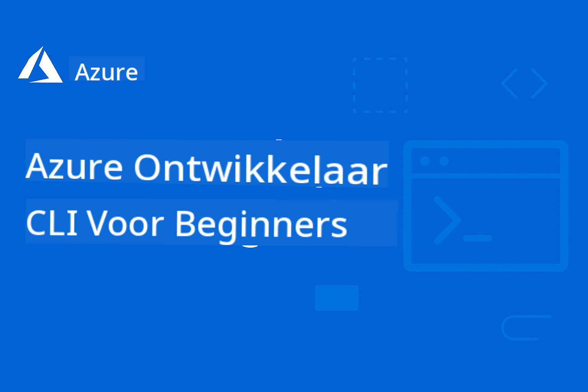

<!--
CO_OP_TRANSLATOR_METADATA:
{
  "original_hash": "62affa32f7697d88ec2a2d5745364db1",
  "translation_date": "2025-12-15T23:35:13+00:00",
  "source_file": "README.md",
  "language_code": "nl"
}
-->
# AZD Voor Beginners: Een Gestructureerde Leerreis

 

[](https://GitHub.com/microsoft/azd-for-beginners/watchers/)
[](https://GitHub.com/microsoft/azd-for-beginners/network/)
[](https://GitHub.com/microsoft/azd-for-beginners/stargazers/)

[](https://discord.gg/microsoft-azure)
[](https://discord.gg/nTYy5BXMWG)

## Aan de Slag met Deze Cursus

Volg deze stappen om je AZD-leerreis te beginnen:

1. **Fork de Repository**: Klik [](https://GitHub.com/microsoft/azd-for-beginners/fork)
2. **Clone de Repository**: `git clone https://github.com/microsoft/azd-for-beginners.git`
3. **Word Lid van de Community**: [Azure Discord Communities](https://discord.com/invite/ByRwuEEgH4) voor deskundige ondersteuning
4. **Kies je Leerpad**: Selecteer een hoofdstuk hieronder dat past bij je ervaringsniveau

### Meertalige Ondersteuning

#### Geautomatiseerde Vertalingen (Altijd Up-to-Date)

<!-- CO-OP TRANSLATOR LANGUAGES TABLE START -->
[Arabisch](../ar/README.md) | [Bengaals](../bn/README.md) | [Bulgaars](../bg/README.md) | [Birmaans (Myanmar)](../my/README.md) | [Chinees (Vereenvoudigd)](../zh/README.md) | [Chinees (Traditioneel, Hong Kong)](../hk/README.md) | [Chinees (Traditioneel, Macau)](../mo/README.md) | [Chinees (Traditioneel, Taiwan)](../tw/README.md) | [Kroatisch](../hr/README.md) | [Tsjechisch](../cs/README.md) | [Deens](../da/README.md) | [Nederlands](./README.md) | [Ests](../et/README.md) | [Fins](../fi/README.md) | [Frans](../fr/README.md) | [Duits](../de/README.md) | [Grieks](../el/README.md) | [Hebreeuws](../he/README.md) | [Hindi](../hi/README.md) | [Hongaars](../hu/README.md) | [Indonesisch](../id/README.md) | [Italiaans](../it/README.md) | [Japans](../ja/README.md) | [Kannada](../kn/README.md) | [Koreaans](../ko/README.md) | [Litouws](../lt/README.md) | [Maleis](../ms/README.md) | [Malayalam](../ml/README.md) | [Marathi](../mr/README.md) | [Nepalees](../ne/README.md) | [Nigeriaans Pidgin](../pcm/README.md) | [Noors](../no/README.md) | [Perzisch (Farsi)](../fa/README.md) | [Pools](../pl/README.md) | [Portugees (Brazilië)](../br/README.md) | [Portugees (Portugal)](../pt/README.md) | [Punjabi (Gurmukhi)](../pa/README.md) | [Roemeens](../ro/README.md) | [Russisch](../ru/README.md) | [Servisch (Cyrillisch)](../sr/README.md) | [Slowaaks](../sk/README.md) | [Sloveens](../sl/README.md) | [Spaans](../es/README.md) | [Swahili](../sw/README.md) | [Zweeds](../sv/README.md) | [Tagalog (Filipijns)](../tl/README.md) | [Tamil](../ta/README.md) | [Telugu](../te/README.md) | [Thais](../th/README.md) | [Turks](../tr/README.md) | [Oekraïens](../uk/README.md) | [Urdu](../ur/README.md) | [Vietnamees](../vi/README.md)
<!-- CO-OP TRANSLATOR LANGUAGES TABLE END -->

## Cursusoverzicht

Beheers Azure Developer CLI (azd) via gestructureerde hoofdstukken ontworpen voor progressief leren. **Speciale focus op AI-toepassingsimplementatie met Microsoft Foundry-integratie.**

### Waarom Deze Cursus Essentieel is voor Moderne Ontwikkelaars

Gebaseerd op inzichten uit de Microsoft Foundry Discord-community, wil **45% van de ontwikkelaars AZD gebruiken voor AI-workloads** maar ondervinden uitdagingen met:
- Complexe multi-service AI-architecturen
- Best practices voor AI-implementatie in productie  
- Integratie en configuratie van Azure AI-diensten
- Kostenoptimalisatie voor AI-workloads
- Problemen oplossen bij AI-specifieke implementaties

### Leerdoelen

Door deze gestructureerde cursus te voltooien, zul je:
- **AZD Basisprincipes Beheersen**: Kernconcepten, installatie en configuratie
- **AI-toepassingen Implementeren**: Gebruik AZD met Microsoft Foundry-diensten
- **Infrastructure as Code Implementeren**: Beheer Azure-resources met Bicep-templates
- **Implementaties Troubleshooten**: Veelvoorkomende problemen oplossen en debuggen
- **Optimaliseren voor Productie**: Beveiliging, schaling, monitoring en kostenbeheer
- **Multi-Agent Oplossingen Bouwen**: Complexe AI-architecturen implementeren

## 📚 Leerhoofdstukken

*Kies je leerpad op basis van ervaringsniveau en doelen*

### 🚀 Hoofdstuk 1: Basis & Snelle Start
**Vereisten**: Azure-abonnement, basiskennis van de opdrachtregel  
**Duur**: 30-45 minuten  
**Complexiteit**: ⭐

#### Wat Je Zal Leren
- Begrip van Azure Developer CLI basisprincipes
- AZD installeren op je platform
- Je eerste succesvolle implementatie

#### Leerbronnen
- **🎯 Begin Hier**: [Wat is Azure Developer CLI?](../..)
- **📖 Theorie**: [AZD Basics](docs/getting-started/azd-basics.md) - Kernconcepten en terminologie
- **⚙️ Setup**: [Installatie & Setup](docs/getting-started/installation.md) - Platforms specifieke handleidingen
- **🛠️ Praktijk**: [Je Eerste Project](docs/getting-started/first-project.md) - Stapsgewijze tutorial
- **📋 Snelle Referentie**: [Command Cheat Sheet](resources/cheat-sheet.md)

#### Praktische Oefeningen
```bash
# Snelle installatiecontrole
azd version

# Implementeer uw eerste applicatie
azd init --template todo-nodejs-mongo
azd up
```

**💡 Hoofdstuk Resultaat**: Een eenvoudige webapplicatie succesvol implementeren naar Azure met AZD

**✅ Succesvalidatie:**
```bash
# Na het voltooien van Hoofdstuk 1 zou je in staat moeten zijn om:
azd version              # Toont geïnstalleerde versie
azd init --template todo-nodejs-mongo  # Initialiseert project
azd up                  # Zet uit naar Azure
azd show                # Toont URL van draaiende app
# Applicatie opent in browser en werkt
azd down --force --purge  # Ruimt resources op
```

**📊 Tijdsinvestering:** 30-45 minuten  
**📈 Vaardigheidsniveau Daarna:** Kan basisapplicaties zelfstandig implementeren

**✅ Succesvalidatie:**
```bash
# Na het voltooien van Hoofdstuk 1 zou je in staat moeten zijn om:
azd version              # Toont geïnstalleerde versie
azd init --template todo-nodejs-mongo  # Initialiseert project
azd up                  # Zet uit naar Azure
azd show                # Toont URL van draaiende app
# Applicatie opent in browser en werkt
azd down --force --purge  # Ruimt resources op
```

**📊 Tijdsinvestering:** 30-45 minuten  
**📈 Vaardigheidsniveau Daarna:** Kan basisapplicaties zelfstandig implementeren

---

### 🤖 Hoofdstuk 2: AI-First Ontwikkeling (Aanbevolen voor AI-ontwikkelaars)
**Vereisten**: Hoofdstuk 1 voltooid  
**Duur**: 1-2 uur  
**Complexiteit**: ⭐⭐

#### Wat Je Zal Leren
- Microsoft Foundry-integratie met AZD
- AI-gestuurde toepassingen implementeren
- Begrip van AI-dienstconfiguraties

#### Leerbronnen
- **🎯 Begin Hier**: [Microsoft Foundry Integratie](docs/microsoft-foundry/microsoft-foundry-integration.md)
- **📖 Patronen**: [AI Model Deployment](docs/microsoft-foundry/ai-model-deployment.md) - AI-modellen implementeren en beheren
- **🛠️ Workshop**: [AI Workshop Lab](docs/microsoft-foundry/ai-workshop-lab.md) - Maak je AI-oplossingen AZD-klaar
- **🎥 Interactieve Gids**: [Workshop Materialen](workshop/README.md) - Browser-gebaseerd leren met MkDocs * DevContainer-omgeving
- **📋 Templates**: [Microsoft Foundry Templates](../..)
- **📝 Voorbeelden**: [AZD Implementatie Voorbeelden](examples/README.md)

#### Praktische Oefeningen
```bash
# Zet je eerste AI-toepassing in
azd init --template azure-search-openai-demo
azd up

# Probeer extra AI-sjablonen
azd init --template openai-chat-app-quickstart
azd init --template agent-openai-python-prompty
```

**💡 Hoofdstuk Resultaat**: Een AI-gestuurde chatapplicatie met RAG-mogelijkheden implementeren en configureren

**✅ Succesvalidatie:**
```bash
# Na Hoofdstuk 2 zou je in staat moeten zijn om:
azd init --template azure-search-openai-demo
azd up
# De AI-chatinterface te testen
# Vragen te stellen en AI-gestuurde antwoorden met bronnen te krijgen
# Te verifiëren dat de zoekintegratie werkt
azd monitor  # Te controleren of Application Insights telemetrie toont
azd down --force --purge
```

**📊 Tijdsinvestering:** 1-2 uur  
**📈 Vaardigheidsniveau Daarna:** Kan productieklare AI-toepassingen implementeren en configureren  
**💰 Kostenbewustzijn:** Begrijp ontwikkelkosten van $80-150/maand, productiekosten van $300-3500/maand

#### 💰 Kostenoverwegingen voor AI-Implementaties

**Ontwikkelomgeving (Geschat $80-150/maand):**
- Azure OpenAI (Pay-as-you-go): $0-50/maand (afhankelijk van tokengebruik)
- AI Search (Basic tier): $75/maand
- Container Apps (Consumption): $0-20/maand
- Opslag (Standaard): $1-5/maand

**Productieomgeving (Geschat $300-3.500+/maand):**
- Azure OpenAI (PTU voor consistente prestaties): $3.000+/maand OF Pay-as-you-go met hoog volume
- AI Search (Standard tier): $250/maand
- Container Apps (Dedicated): $50-100/maand
- Application Insights: $5-50/maand
- Opslag (Premium): $10-50/maand

**💡 Tips voor Kostenoptimalisatie:**
- Gebruik **Gratis Tier** Azure OpenAI voor leren (50.000 tokens/maand inbegrepen)
- Voer `azd down` uit om resources te dealloceren wanneer je niet actief ontwikkelt
- Begin met consumption-based billing, upgrade naar PTU alleen voor productie
- Gebruik `azd provision --preview` om kosten te schatten vóór implementatie
- Schakel auto-scaling in: betaal alleen voor daadwerkelijk gebruik

**Kostenmonitoring:**
```bash
# Controleer geschatte maandelijkse kosten
azd provision --preview

# Houd werkelijke kosten bij in Azure Portal
az consumption budget list --resource-group <your-rg>
```

---

### ⚙️ Hoofdstuk 3: Configuratie & Authenticatie
**Vereisten**: Hoofdstuk 1 voltooid  
**Duur**: 45-60 minuten  
**Complexiteit**: ⭐⭐

#### Wat Je Zal Leren
- Omgevingsconfiguratie en beheer
- Authenticatie en beveiligingsbest practices
- Naamgeving en organisatie van resources

#### Leerbronnen
- **📖 Configuratie**: [Configuratiehandleiding](docs/getting-started/configuration.md) - Omgevingsinstellingen
- **🔐 Beveiliging**: [Authenticatiepatronen en managed identity](docs/getting-started/authsecurity.md) - Authenticatiepatronen
- **📝 Voorbeelden**: [Database App Voorbeeld](examples/database-app/README.md) - AZD Database Voorbeelden

#### Praktische Oefeningen
- Configureer meerdere omgevingen (dev, staging, prod)
- Stel managed identity authenticatie in
- Implementeer omgevingsspecifieke configuraties

**💡 Hoofdstuk Resultaat**: Beheer meerdere omgevingen met juiste authenticatie en beveiliging

---

### 🏗️ Hoofdstuk 4: Infrastructure as Code & Implementatie
**Vereisten**: Hoofdstukken 1-3 voltooid  
**Duur**: 1-1,5 uur  
**Complexiteit**: ⭐⭐⭐

#### Wat Je Zal Leren
- Geavanceerde implementatiepatronen
- Infrastructure as Code met Bicep
- Strategieën voor resource provisioning

#### Leerbronnen
- **📖 Implementatie**: [Implementatiehandleiding](docs/deployment/deployment-guide.md) - Complete workflows
- **🏗️ Provisioning**: [Provisioning Resources](docs/deployment/provisioning.md) - Azure resourcebeheer
- **📝 Voorbeelden**: [Container App Voorbeeld](../../examples/container-app) - Containerized implementaties

#### Praktische Oefeningen
- Maak aangepaste Bicep-templates
- Implementeer multi-service applicaties
- Implementeer blue-green deployment strategieën

**💡 Hoofdstuk Resultaat**: Complexe multi-service applicaties implementeren met aangepaste infrastructuurtemplates

---

### 🎯 Hoofdstuk 5: Multi-Agent AI Oplossingen (Gevorderd)
**Vereisten**: Hoofdstukken 1-2 voltooid  
**Duur**: 2-3 uur  
**Complexiteit**: ⭐⭐⭐⭐

#### Wat Je Zal Leren
- Multi-agent architectuurpatronen
- Agent orchestratie en coördinatie
- Productieklare AI-implementaties

#### Leerbronnen
- **🤖 Uitgelicht Project**: [Retail Multi-Agent Oplossing](examples/retail-scenario.md) - Volledige implementatie
- **🛠️ ARM-sjablonen**: [ARM Template Package](../../examples/retail-multiagent-arm-template) - Eén-klik implementatie
- **📖 Architectuur**: [Multi-agent coördinatiepatronen](/docs/pre-deployment/coordination-patterns.md) - Patronen

#### Praktische Oefeningen
```bash
# Implementeer de complete retail multi-agent oplossing
cd examples/retail-multiagent-arm-template
./deploy.sh

# Verken agentconfiguraties
az deployment group show --resource-group <rg-name> --name <deployment-name>
```

**💡 Hoofdstukresultaat**: Implementeer en beheer een productieklare multi-agent AI-oplossing met Klant- en Voorraadagenten

---

### 🔍 Hoofdstuk 6: Validatie & Planning Voorafgaand aan Implementatie
**Vereisten**: Hoofdstuk 4 voltooid  
**Duur**: 1 uur  
**Complexiteit**: ⭐⭐

#### Wat Je Zal Leren
- Capaciteitsplanning en resourcevalidatie
- Strategieën voor SKU-selectie
- Pre-flight controles en automatisering

#### Leermaterialen
- **📊 Planning**: [Capaciteitsplanning](docs/pre-deployment/capacity-planning.md) - Resourcevalidatie
- **💰 Selectie**: [SKU-selectie](docs/pre-deployment/sku-selection.md) - Kosteneffectieve keuzes
- **✅ Validatie**: [Pre-flight controles](docs/pre-deployment/preflight-checks.md) - Geautomatiseerde scripts

#### Praktische Oefeningen
- Voer capaciteitsvalidatiescripts uit
- Optimaliseer SKU-selecties voor kosten
- Implementeer geautomatiseerde pre-implementatiecontroles

**💡 Hoofdstukresultaat**: Valideer en optimaliseer implementaties vóór uitvoering

---

### 🚨 Hoofdstuk 7: Probleemoplossing & Debugging
**Vereisten**: Elk implementatiehoofdstuk voltooid  
**Duur**: 1-1,5 uur  
**Complexiteit**: ⭐⭐

#### Wat Je Zal Leren
- Systematische debuggingmethoden
- Veelvoorkomende problemen en oplossingen
- AI-specifieke probleemoplossing

#### Leermaterialen
- **🔧 Veelvoorkomende Problemen**: [Veelvoorkomende Problemen](docs/troubleshooting/common-issues.md) - FAQ en oplossingen
- **🕵️ Debugging**: [Debugging Gids](docs/troubleshooting/debugging.md) - Stapsgewijze strategieën
- **🤖 AI Problemen**: [AI-specifieke Probleemoplossing](docs/troubleshooting/ai-troubleshooting.md) - Problemen met AI-diensten

#### Praktische Oefeningen
- Diagnoseer implementatiefouten
- Los authenticatieproblemen op
- Debug AI-dienstconnectiviteit

**💡 Hoofdstukresultaat**: Diagnoseer en los zelfstandig veelvoorkomende implementatieproblemen op

---

### 🏢 Hoofdstuk 8: Productie- & Enterprisepatronen
**Vereisten**: Hoofdstukken 1-4 voltooid  
**Duur**: 2-3 uur  
**Complexiteit**: ⭐⭐⭐⭐

#### Wat Je Zal Leren
- Productie-implementatiestrategieën
- Enterprise beveiligingspatronen
- Monitoring en kostenoptimalisatie

#### Leermaterialen
- **🏭 Productie**: [Productie AI Best Practices](docs/microsoft-foundry/production-ai-practices.md) - Enterprisepatronen
- **📝 Voorbeelden**: [Microservices Voorbeeld](../../examples/microservices) - Complexe architecturen
- **📊 Monitoring**: [Application Insights integratie](docs/pre-deployment/application-insights.md) - Monitoring

#### Praktische Oefeningen
- Implementeer enterprise beveiligingspatronen
- Stel uitgebreide monitoring in
- Implementeer naar productie met juiste governance

**💡 Hoofdstukresultaat**: Implementeer enterprise-klare applicaties met volledige productiecapaciteiten

---

## 🎓 Workshop Overzicht: Praktische Leerervaring

> **⚠️ WORKSHOPSTATUS: Actieve Ontwikkeling**  
> De workshopmaterialen worden momenteel ontwikkeld en verfijnd. Kernmodules zijn functioneel, maar sommige geavanceerde secties zijn nog niet compleet. We werken actief aan het voltooien van alle inhoud. [Volg de voortgang →](workshop/README.md)

### Interactieve Workshopmaterialen
**Uitgebreide hands-on leerervaring met browsergebaseerde tools en begeleide oefeningen**

Onze workshopmaterialen bieden een gestructureerde, interactieve leerervaring die het hoofdstukgebaseerde curriculum hierboven aanvult. De workshop is ontworpen voor zowel zelfgestuurd leren als begeleide sessies.

#### 🛠️ Workshop Kenmerken
- **Browsergebaseerde Interface**: Volledige MkDocs-gestuurde workshop met zoek-, kopieer- en themafuncties
- **GitHub Codespaces Integratie**: Eén-klik setup van ontwikkelomgeving
- **Gestructureerd Leerpad**: 7-staps begeleide oefeningen (3,5 uur totaal)
- **Ontdekking → Implementatie → Aanpassing**: Progressieve methodologie
- **Interactieve DevContainer Omgeving**: Vooraf geconfigureerde tools en afhankelijkheden

#### 📚 Workshopstructuur
De workshop volgt een **Ontdekking → Implementatie → Aanpassing** methodologie:

1. **Ontdekkingsfase** (45 min)
   - Verken Microsoft Foundry-sjablonen en -diensten
   - Begrijp multi-agent architectuurpatronen
   - Bekijk implementatievereisten en -voorwaarden

2. **Implementatiefase** (2 uur)
   - Hands-on implementatie van AI-applicaties met AZD
   - Configureer Azure AI-diensten en endpoints
   - Implementeer beveiligings- en authenticatiepatronen

3. **Aanpassingsfase** (45 min)
   - Pas applicaties aan voor specifieke gebruiksscenario's
   - Optimaliseer voor productie-implementatie
   - Implementeer monitoring en kostenbeheer

#### 🚀 Aan de Slag met de Workshop
```bash
# Optie 1: GitHub Codespaces (Aanbevolen)
# Klik op "Code" → "Maak codespace aan op main" in de repository

# Optie 2: Lokale ontwikkeling
git clone https://github.com/microsoft/azd-for-beginners.git
cd azd-for-beginners/workshop
# Volg de installatie-instructies in workshop/README.md
```

#### 🎯 Workshop Leerresultaten
Door de workshop te voltooien zullen deelnemers:
- **Productie AI-applicaties implementeren**: Gebruik AZD met Microsoft Foundry-diensten
- **Multi-agent architecturen beheersen**: Implementeer gecoördineerde AI-agentoplossingen
- **Beveiligingsbest practices toepassen**: Configureer authenticatie en toegangscontrole
- **Optimaliseren voor schaal**: Ontwerp kosteneffectieve, performante implementaties
- **Problemen oplossen bij implementaties**: Los veelvoorkomende problemen zelfstandig op

#### 📖 Workshopbronnen
- **🎥 Interactieve Gids**: [Workshopmaterialen](workshop/README.md) - Browsergebaseerde leeromgeving
- **📋 Stapsgewijze Instructies**: [Begeleide Oefeningen](../../workshop/docs/instructions) - Gedetailleerde walkthroughs
- **🛠️ AI Workshop Lab**: [AI Workshop Lab](docs/microsoft-foundry/ai-workshop-lab.md) - AI-gerichte oefeningen
- **💡 Snelle Start**: [Workshop Setup Gids](workshop/README.md#quick-start) - Omgevingsconfiguratie

**Perfect voor**: Bedrijfstrainingen, universitaire cursussen, zelfstudie en ontwikkelaarsbootcamps.

---

## 📖 Wat is Azure Developer CLI?

Azure Developer CLI (azd) is een ontwikkelaarsgerichte commandoregelinterface die het proces van het bouwen en implementeren van applicaties naar Azure versnelt. Het biedt:

- **Sjabloon-gebaseerde implementaties** - Gebruik vooraf gebouwde sjablonen voor veelvoorkomende applicatiepatronen
- **Infrastructure as Code** - Beheer Azure-resources met Bicep of Terraform  
- **Geïntegreerde workflows** - Naadloos provisioneren, implementeren en monitoren van applicaties
- **Ontwikkelaarsvriendelijk** - Geoptimaliseerd voor productiviteit en ervaring van ontwikkelaars

### **AZD + Microsoft Foundry: Perfect voor AI-implementaties**

**Waarom AZD voor AI-oplossingen?** AZD pakt de grootste uitdagingen aan waar AI-ontwikkelaars mee te maken hebben:

- **AI-klaar sjablonen** - Vooraf geconfigureerde sjablonen voor Azure OpenAI, Cognitive Services en ML workloads
- **Veilige AI-implementaties** - Ingebouwde beveiligingspatronen voor AI-diensten, API-sleutels en modelendpoints  
- **Productie AI-patronen** - Best practices voor schaalbare, kosteneffectieve AI-applicatie-implementaties
- **End-to-End AI-workflows** - Van modelontwikkeling tot productie-implementatie met juiste monitoring
- **Kostenoptimalisatie** - Slimme resourceallocatie en schaalstrategieën voor AI workloads
- **Microsoft Foundry-integratie** - Naadloze koppeling met Microsoft Foundry modelcatalogus en endpoints

---

## 🎯 Sjablonen & Voorbeeldenbibliotheek

### Uitgelicht: Microsoft Foundry Sjablonen
**Begin hier als je AI-applicaties implementeert!**

> **Opmerking:** Deze sjablonen demonstreren diverse AI-patronen. Sommige zijn externe Azure Samples, andere lokale implementaties.

| Sjabloon | Hoofdstuk | Complexiteit | Diensten | Type |
|----------|-----------|--------------|----------|------|
| [**Begin met AI-chat**](https://github.com/Azure-Samples/get-started-with-ai-chat) | Hoofdstuk 2 | ⭐⭐ | AzureOpenAI + Azure AI Model Inference API + Azure AI Search + Azure Container Apps + Application Insights | Extern |
| [**Begin met AI-agenten**](https://github.com/Azure-Samples/get-started-with-ai-agents) | Hoofdstuk 2 | ⭐⭐ | Azure AI Agent Service + AzureOpenAI + Azure AI Search + Azure Container Apps + Application Insights| Extern |
| [**Azure Search + OpenAI Demo**](https://github.com/Azure-Samples/azure-search-openai-demo) | Hoofdstuk 2 | ⭐⭐ | AzureOpenAI + Azure AI Search + App Service + Storage | Extern |
| [**OpenAI Chat App Quickstart**](https://github.com/Azure-Samples/openai-chat-app-quickstart) | Hoofdstuk 2 | ⭐ | AzureOpenAI + Container Apps + Application Insights | Extern |
| [**Agent OpenAI Python Prompty**](https://github.com/Azure-Samples/agent-openai-python-prompty) | Hoofdstuk 5 | ⭐⭐⭐ | AzureOpenAI + Azure Functions + Prompty | Extern |
| [**Contoso Chat RAG**](https://github.com/Azure-Samples/contoso-chat) | Hoofdstuk 8 | ⭐⭐⭐⭐ | AzureOpenAI + AI Search + Cosmos DB + Container Apps | Extern |
| [**Retail Multi-Agent Oplossing**](examples/retail-scenario.md) | Hoofdstuk 5 | ⭐⭐⭐⭐ | AzureOpenAI + AI Search + Storage + Container Apps + Cosmos DB | **Lokaal** |

### Uitgelicht: Complete Leerscenario's
**Productieklare applicatiesjablonen gekoppeld aan leerhoofdstukken**

| Sjabloon | Leerhoofdstuk | Complexiteit | Belangrijkste Leerpunten |
|----------|---------------|--------------|-------------------------|
| [**openai-chat-app-quickstart**](https://github.com/Azure-Samples/openai-chat-app-quickstart) | Hoofdstuk 2 | ⭐ | Basis AI-implementatiepatronen |
| [**azure-search-openai-demo**](https://github.com/Azure-Samples/azure-search-openai-demo) | Hoofdstuk 2 | ⭐⭐ | RAG-implementatie met Azure AI Search |
| [**ai-document-processing**](https://github.com/Azure-Samples/ai-document-processing) | Hoofdstuk 4 | ⭐⭐ | Document Intelligence integratie |
| [**agent-openai-python-prompty**](https://github.com/Azure-Samples/agent-openai-python-prompty) | Hoofdstuk 5 | ⭐⭐⭐ | Agentframework en functie-aanroepen |
| [**contoso-chat**](https://github.com/Azure-Samples/contoso-chat) | Hoofdstuk 8 | ⭐⭐⭐ | Enterprise AI-orchestratie |
| [**retail-multi-agent-solution**](examples/retail-scenario.md) | Hoofdstuk 5 | ⭐⭐⭐⭐ | Multi-agent architectuur met Klant- en Voorraadagenten |

### Leren door Voorbeeldtype

> **📌 Lokale vs. Externe Voorbeelden:**  
> **Lokale Voorbeelden** (in deze repo) = Direct klaar voor gebruik  
> **Externe Voorbeelden** (Azure Samples) = Klonen vanuit gekoppelde repositories

#### Lokale Voorbeelden (Klaar voor Gebruik)
- [**Retail Multi-Agent Oplossing**](examples/retail-scenario.md) - Volledige productieklare implementatie met ARM-sjablonen
  - Multi-agent architectuur (Klant + Voorraadagenten)
  - Uitgebreide monitoring en evaluatie
  - Eén-klik implementatie via ARM-sjabloon

#### Lokale Voorbeelden - Containerapplicaties (Hoofdstukken 2-5)
**Uitgebreide containerimplementatievoorbeelden in deze repository:**
- [**Container App Voorbeelden**](examples/container-app/README.md) - Complete gids voor containerimplementaties
  - [Eenvoudige Flask API](../../examples/container-app/simple-flask-api) - Basis REST API met scale-to-zero
  - [Microservices Architectuur](../../examples/container-app/microservices) - Productieklare multi-service implementatie
  - Quick Start, Productie en Geavanceerde implementatiepatronen
  - Monitoring, beveiliging en kostenoptimalisatie richtlijnen

#### Externe Voorbeelden - Eenvoudige Applicaties (Hoofdstukken 1-2)
**Kloon deze Azure Samples repositories om te beginnen:**
- [Eenvoudige Web App - Node.js + MongoDB](https://github.com/Azure-Samples/todo-nodejs-mongo) - Basis implementatiepatronen
- [Statische Website - React SPA](https://github.com/Azure-Samples/todo-csharp-sql-swa-func) - Statische content implementatie
- [Container App - Python Flask](https://github.com/Azure-Samples/container-apps-store-api-microservice) - REST API implementatie

#### Externe Voorbeelden - Database Integratie (Hoofdstukken 3-4)  
- [Database App - C# + SQL](https://github.com/Azure-Samples/todo-csharp-sql) - Databaseconnectiviteitspatronen
- [Functions + Cosmos DB](https://github.com/Azure-Samples/todo-python-mongo-swa-func) - Serverless data workflow

#### Externe Voorbeelden - Geavanceerde Patronen (Hoofdstukken 4-8)
- [Java Microservices](https://github.com/Azure-Samples/java-microservices-aca-lab) - Multi-service architecturen
- [Container Apps Jobs](https://github.com/Azure-Samples/container-apps-jobs) - Achtergrondverwerking  
- [Enterprise ML Pipeline](https://github.com/Azure-Samples/mlops-v2) - Productieklare ML-patronen

### Externe Sjabloonverzamelingen
- [**Officiële AZD Sjabloongalerij**](https://azure.github.io/awesome-azd/) - Gecureerde collectie van officiële en community-sjablonen
- [**Azure Developer CLI Sjablonen**](https://learn.microsoft.com/en-us/azure/developer/azure-developer-cli/azd-templates) - Microsoft Learn sjabloondocumentatie
- [**Voorbeeldenmap**](examples/README.md) - Lokale leervoorbeelden met gedetailleerde uitleg

---

## 📚 Leermaterialen & Referenties

### Snelle Referenties
- [**Command Cheat Sheet**](resources/cheat-sheet.md) - Essentiële azd-commando's georganiseerd per hoofdstuk
- [**Glossary**](resources/glossary.md) - Azure- en azd-terminologie  
- [**FAQ**](resources/faq.md) - Veelgestelde vragen georganiseerd per leerhoofdstuk
- [**Study Guide**](resources/study-guide.md) - Uitgebreide oefenopdrachten

### Hands-On Workshops
- [**AI Workshop Lab**](docs/microsoft-foundry/ai-workshop-lab.md) - Maak je AI-oplossingen AZD-deployable (2-3 uur)
- [**Interactive Workshop Guide**](workshop/README.md) - Browsergebaseerde workshop met MkDocs en DevContainer-omgeving
- [**Structured Learning Path**](../../workshop/docs/instructions) - 7-staps begeleide oefeningen (Ontdekking → Implementatie → Aanpassing)
- [**AZD For Beginners Workshop**](workshop/README.md) - Complete hands-on workshopmaterialen met GitHub Codespaces-integratie

### Externe Leerbronnen
- [Azure Developer CLI Documentation](https://learn.microsoft.com/en-us/azure/developer/azure-developer-cli/)
- [Azure Architecture Center](https://learn.microsoft.com/en-us/azure/architecture/)
- [Azure Pricing Calculator](https://azure.microsoft.com/pricing/calculator/)
- [Azure Status](https://status.azure.com/)

---

## 🔧 Snelle Probleemoplossingsgids

**Veelvoorkomende problemen voor beginners en directe oplossingen:**

### ❌ "azd: command not found"

```bash
# Installeer eerst AZD
# Windows (PowerShell):
winget install microsoft.azd

# macOS:
brew tap azure/azd && brew install azd

# Linux:
curl -fsSL https://aka.ms/install-azd.sh | bash

# Verifieer installatie
azd version
```

### ❌ "No subscription found" or "Subscription not set"

```bash
# Lijst beschikbare abonnementen
az account list --output table

# Stel standaardabonnement in
az account set --subscription "<subscription-id-or-name>"

# Instellen voor AZD-omgeving
azd env set AZURE_SUBSCRIPTION_ID "<subscription-id>"

# Verifiëren
az account show
```

### ❌ "InsufficientQuota" or "Quota exceeded"

```bash
# Probeer een andere Azure-regio
azd env set AZURE_LOCATION "westus2"
azd up

# Of gebruik kleinere SKU's in ontwikkeling
# Bewerk infra/main.parameters.json:
{
  "sku": "B1"  // Instead of "P1V2"
}
```

### ❌ "azd up" fails halfway through

```bash
# Optie 1: Schoonmaken en opnieuw proberen
azd down --force --purge
azd up

# Optie 2: Alleen infrastructuur repareren
azd provision

# Optie 3: Gedetailleerde logs controleren
azd show
azd logs
```

### ❌ "Authentication failed" or "Token expired"

```bash
# Opnieuw authenticeren
az logout
az login

azd auth logout
azd auth login

# Verifieer authenticatie
az account show
```

### ❌ "Resource already exists" or naming conflicts

```bash
# AZD genereert unieke namen, maar bij conflicten:
azd down --force --purge

# Probeer het dan opnieuw met een nieuwe omgeving
azd env new dev-v2
azd up
```

### ❌ Template deployment taking too long

**Normale wachttijden:**
- Eenvoudige webapp: 5-10 minuten
- App met database: 10-15 minuten
- AI-toepassingen: 15-25 minuten (OpenAI-provisioning is traag)

```bash
# Controleer voortgang
azd show

# Als het langer dan 30 minuten vastzit, controleer dan de Azure Portal:
azd monitor
# Zoek naar mislukte implementaties
```

### ❌ "Permission denied" or "Forbidden"

```bash
# Controleer uw Azure-rol
az role assignment list --assignee $(az account show --query user.name -o tsv)

# U hebt minimaal de rol "Contributor" nodig
# Vraag uw Azure-beheerder om toe te kennen:
# - Contributor (voor resources)
# - User Access Administrator (voor roltoewijzingen)
```

### ❌ Can't find deployed application URL

```bash
# Toon alle service-eindpunten
azd show

# Of open Azure Portal
azd monitor

# Controleer specifieke service
azd env get-values
# Zoek naar *_URL variabelen
```

### 📚 Volledige Probleemoplossingsbronnen

- **Veelvoorkomende Problemen Gids:** [Gedetailleerde Oplossingen](docs/troubleshooting/common-issues.md)
- **AI-Specifieke Problemen:** [AI Probleemoplossing](docs/troubleshooting/ai-troubleshooting.md)
- **Debugging Gids:** [Stapsgewijze Debugging](docs/troubleshooting/debugging.md)
- **Hulp Krijgen:** [Azure Discord](https://discord.gg/microsoft-azure) #azure-developer-cli

---

## 🔧 Snelle Probleemoplossingsgids

**Veelvoorkomende problemen voor beginners en directe oplossingen:**

<details>
<summary><strong>❌ "azd: command not found"</strong></summary>

```bash
# Installeer eerst AZD
# Windows (PowerShell):
winget install microsoft.azd

# macOS:
brew tap azure/azd && brew install azd

# Linux:
curl -fsSL https://aka.ms/install-azd.sh | bash

# Verifieer installatie
azd version
```
</details>

<details>
<summary><strong>❌ "No subscription found" or "Subscription not set"</strong></summary>

```bash
# Lijst beschikbare abonnementen
az account list --output table

# Stel standaardabonnement in
az account set --subscription "<subscription-id-or-name>"

# Instellen voor AZD-omgeving
azd env set AZURE_SUBSCRIPTION_ID "<subscription-id>"

# Verifiëren
az account show
```
</details>

<details>
<summary><strong>❌ "InsufficientQuota" or "Quota exceeded"</strong></summary>

```bash
# Probeer een andere Azure-regio
azd env set AZURE_LOCATION "westus2"
azd up

# Of gebruik kleinere SKU's in ontwikkeling
# Bewerk infra/main.parameters.json:
{
  "sku": "B1"  // Instead of "P1V2"
}
```
</details>

<details>
<summary><strong>❌ "azd up" fails halfway through</strong></summary>

```bash
# Optie 1: Schoonmaken en opnieuw proberen
azd down --force --purge
azd up

# Optie 2: Alleen infrastructuur repareren
azd provision

# Optie 3: Gedetailleerde logs controleren
azd show
azd logs
```
</details>

<details>
<summary><strong>❌ "Authentication failed" or "Token expired"</strong></summary>

```bash
# Opnieuw authenticeren
az logout
az login

azd auth logout
azd auth login

# Verifieer authenticatie
az account show
```
</details>

<details>
<summary><strong>❌ "Resource already exists" or naming conflicts</strong></summary>

```bash
# AZD genereert unieke namen, maar bij conflicten:
azd down --force --purge

# Probeer het dan opnieuw met een nieuwe omgeving
azd env new dev-v2
azd up
```
</details>

<details>
<summary><strong>❌ Template deployment taking too long</strong></summary>

**Normale wachttijden:**
- Eenvoudige webapp: 5-10 minuten
- App met database: 10-15 minuten
- AI-toepassingen: 15-25 minuten (OpenAI-provisioning is traag)

```bash
# Controleer voortgang
azd show

# Als het langer dan 30 minuten vastzit, controleer dan de Azure Portal:
azd monitor
# Zoek naar mislukte implementaties
```
</details>

<details>
<summary><strong>❌ "Permission denied" or "Forbidden"</strong></summary>

```bash
# Controleer uw Azure-rol
az role assignment list --assignee $(az account show --query user.name -o tsv)

# U hebt minimaal de rol "Contributor" nodig
# Vraag uw Azure-beheerder om toe te kennen:
# - Contributor (voor resources)
# - User Access Administrator (voor roltoewijzingen)
```
</details>

<details>
<summary><strong>❌ Can't find deployed application URL</strong></summary>

```bash
# Toon alle service-eindpunten
azd show

# Of open Azure Portal
azd monitor

# Controleer specifieke service
azd env get-values
# Zoek naar *_URL variabelen
```
</details>

### 📚 Volledige Probleemoplossingsbronnen

- **Veelvoorkomende Problemen Gids:** [Gedetailleerde Oplossingen](docs/troubleshooting/common-issues.md)
- **AI-Specifieke Problemen:** [AI Probleemoplossing](docs/troubleshooting/ai-troubleshooting.md)
- **Debugging Gids:** [Stapsgewijze Debugging](docs/troubleshooting/debugging.md)
- **Hulp Krijgen:** [Azure Discord](https://discord.gg/microsoft-azure) #azure-developer-cli

---

## 🎓 Cursus Voltooiing & Certificering

### Voortgang Bijhouden
Volg je leerproces door elk hoofdstuk:

- [ ] **Hoofdstuk 1**: Basis & Snelle Start ✅
- [ ] **Hoofdstuk 2**: AI-First Ontwikkeling ✅  
- [ ] **Hoofdstuk 3**: Configuratie & Authenticatie ✅
- [ ] **Hoofdstuk 4**: Infrastructure as Code & Implementatie ✅
- [ ] **Hoofdstuk 5**: Multi-Agent AI Oplossingen ✅
- [ ] **Hoofdstuk 6**: Pre-Deployment Validatie & Planning ✅
- [ ] **Hoofdstuk 7**: Probleemoplossing & Debugging ✅
- [ ] **Hoofdstuk 8**: Productie & Enterprise Patronen ✅

### Leer Verificatie
Na het voltooien van elk hoofdstuk, verifieer je kennis door:
1. **Praktische Oefening**: Voltooi de hands-on implementatie van het hoofdstuk
2. **Kenniscontrole**: Bekijk de FAQ-sectie voor je hoofdstuk
3. **Community Discussie**: Deel je ervaring in Azure Discord
4. **Volgend Hoofdstuk**: Ga naar het volgende complexiteitsniveau

### Voordelen van Cursus Voltooiing
Na het voltooien van alle hoofdstukken heb je:
- **Productie-ervaring**: Echte AI-toepassingen gedeployed naar Azure
- **Professionele Vaardigheden**: Enterprise-ready implementatiecapaciteiten  
- **Community Erkenning**: Actief lid van de Azure ontwikkelaarscommunity
- **Carrière Vooruitgang**: Gewilde AZD- en AI-implementatie expertise

---

## 🤝 Community & Ondersteuning

### Hulp & Ondersteuning Krijgen
- **Technische Problemen**: [Meld bugs en vraag functies aan](https://github.com/microsoft/azd-for-beginners/issues)
- **Leer Vragen**: [Microsoft Azure Discord Community](https://discord.gg/microsoft-azure) en [](https://discord.gg/nTYy5BXMWG)
- **AI-Specifieke Hulp**: Word lid van de [](https://discord.gg/nTYy5BXMWG)
- **Documentatie**: [Officiële Azure Developer CLI documentatie](https://learn.microsoft.com/en-us/azure/developer/azure-developer-cli/)

### Community Inzichten van Microsoft Foundry Discord

**Recente Peilingsresultaten van #Azure-kanaal:**
- **45%** van de ontwikkelaars wil AZD gebruiken voor AI-workloads
- **Top uitdagingen**: Multi-service implementaties, credential management, productie gereedheid  
- **Meest gevraagd**: AI-specifieke templates, probleemoplossingsgidsen, best practices

**Word lid van onze community om:**
- Je AZD + AI ervaringen te delen en hulp te krijgen
- Vroege previews van nieuwe AI-templates te krijgen
- Bij te dragen aan AI-implementatie best practices
- Invloed uit te oefenen op toekomstige AI + AZD feature-ontwikkeling

### Bijdragen aan de Cursus
We verwelkomen bijdragen! Lees onze [Contributing Guide](CONTRIBUTING.md) voor details over:
- **Inhoud Verbeteringen**: Verbeter bestaande hoofdstukken en voorbeelden
- **Nieuwe Voorbeelden**: Voeg praktijkvoorbeelden en templates toe  
- **Vertaling**: Help meertalige ondersteuning te onderhouden
- **Bugrapporten**: Verbeter nauwkeurigheid en duidelijkheid
- **Community Normen**: Volg onze inclusieve communityrichtlijnen

---

## 📄 Cursusinformatie

### Licentie
Dit project is gelicentieerd onder de MIT-licentie - zie het [LICENSE](../../LICENSE) bestand voor details.

### Gerelateerde Microsoft Leerbronnen

Ons team produceert andere uitgebreide leercursussen:

<!-- CO-OP TRANSLATOR OTHER COURSES START -->
### Azure / Edge / MCP / Agents
[](https://github.com/microsoft/AZD-for-beginners?WT.mc_id=academic-105485-koreyst)
[](https://github.com/microsoft/edgeai-for-beginners?WT.mc_id=academic-105485-koreyst)
[](https://github.com/microsoft/mcp-for-beginners?WT.mc_id=academic-105485-koreyst)
[](https://github.com/microsoft/ai-agents-for-beginners?WT.mc_id=academic-105485-koreyst)

---
 
### Generative AI Series
[](https://github.com/microsoft/generative-ai-for-beginners?WT.mc_id=academic-105485-koreyst)
[-9333EA?style=for-the-badge&labelColor=E5E7EB&color=9333EA)](https://github.com/microsoft/Generative-AI-for-beginners-dotnet?WT.mc_id=academic-105485-koreyst)
[-C084FC?style=for-the-badge&labelColor=E5E7EB&color=C084FC)](https://github.com/microsoft/generative-ai-for-beginners-java?WT.mc_id=academic-105485-koreyst)
[-E879F9?style=for-the-badge&labelColor=E5E7EB&color=E879F9)](https://github.com/microsoft/generative-ai-with-javascript?WT.mc_id=academic-105485-koreyst)

---
 
### Core Learning
[](https://aka.ms/ml-beginners?WT.mc_id=academic-105485-koreyst)
[](https://aka.ms/datascience-beginners?WT.mc_id=academic-105485-koreyst)
[](https://aka.ms/ai-beginners?WT.mc_id=academic-105485-koreyst)
[](https://github.com/microsoft/Security-101?WT.mc_id=academic-96948-sayoung)
[](https://aka.ms/webdev-beginners?WT.mc_id=academic-105485-koreyst)
[](https://aka.ms/iot-beginners?WT.mc_id=academic-105485-koreyst)
[](https://github.com/microsoft/xr-development-for-beginners?WT.mc_id=academic-105485-koreyst)

---
 
### Copilot Serie
[](https://aka.ms/GitHubCopilotAI?WT.mc_id=academic-105485-koreyst)
[](https://github.com/microsoft/mastering-github-copilot-for-dotnet-csharp-developers?WT.mc_id=academic-105485-koreyst)
[](https://github.com/microsoft/CopilotAdventures?WT.mc_id=academic-105485-koreyst)
<!-- CO-OP TRANSLATOR OTHER COURSES END -->

---

## 🗺️ Cursus Navigatie

**🚀 Klaar om te beginnen met leren?**

**Beginners**: Begin met [Hoofdstuk 1: Basis & Snelle Start](../..)  
**AI Ontwikkelaars**: Ga naar [Hoofdstuk 2: AI-Eerst Ontwikkeling](../..)  
**Ervaren Ontwikkelaars**: Begin met [Hoofdstuk 3: Configuratie & Authenticatie](../..)

**Volgende Stappen**: [Begin Hoofdstuk 1 - AZD Basisprincipes](docs/getting-started/azd-basics.md) →

---

<!-- CO-OP TRANSLATOR DISCLAIMER START -->
**Disclaimer**:  
Dit document is vertaald met behulp van de AI-vertalingsdienst [Co-op Translator](https://github.com/Azure/co-op-translator). Hoewel we streven naar nauwkeurigheid, dient u er rekening mee te houden dat geautomatiseerde vertalingen fouten of onnauwkeurigheden kunnen bevatten. Het originele document in de oorspronkelijke taal moet als de gezaghebbende bron worden beschouwd. Voor cruciale informatie wordt professionele menselijke vertaling aanbevolen. Wij zijn niet aansprakelijk voor eventuele misverstanden of verkeerde interpretaties die voortvloeien uit het gebruik van deze vertaling.
<!-- CO-OP TRANSLATOR DISCLAIMER END -->