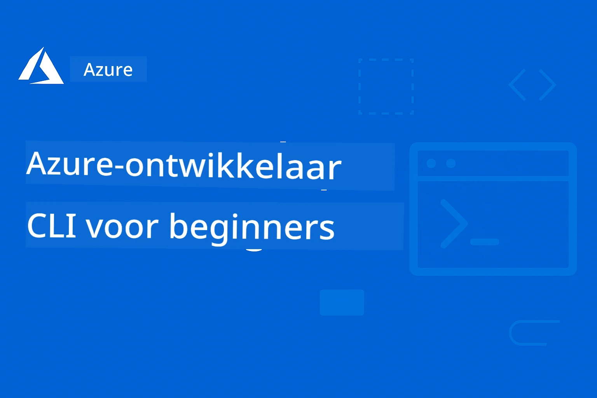

# AZD voor beginners: Een gestructureerde leerreis

 

[](https://GitHub.com/microsoft/azd-for-beginners/watchers/)
[](https://GitHub.com/microsoft/azd-for-beginners/network/)
[](https://GitHub.com/microsoft/azd-for-beginners/stargazers/)

[](https://discord.com/invite/nkVh3dp)
[](https://discord.gg/nTYy5BXMWG)

---

### Geautomatiseerde vertalingen (altijd up-to-date)

<!-- CO-OP TRANSLATOR LANGUAGES TABLE START -->
[Arabisch](../ar/README.md) | [Bengaals](../bn/README.md) | [Bulgaars](../bg/README.md) | [Birmaans (Myanmar)](../my/README.md) | [Chinees (vereenvoudigd)](../zh-CN/README.md) | [Chinees (traditioneel, Hongkong)](../zh-HK/README.md) | [Chinees (traditioneel, Macau)](../zh-MO/README.md) | [Chinees (traditioneel, Taiwan)](../zh-TW/README.md) | [Kroatisch](../hr/README.md) | [Tsjechisch](../cs/README.md) | [Deens](../da/README.md) | [Nederlands](./README.md) | [Ests](../et/README.md) | [Fins](../fi/README.md) | [Frans](../fr/README.md) | [Duits](../de/README.md) | [Grieks](../el/README.md) | [Hebreeuws](../he/README.md) | [Hindi](../hi/README.md) | [Hongaars](../hu/README.md) | [Indonesisch](../id/README.md) | [Italiaans](../it/README.md) | [Japans](../ja/README.md) | [Kannada](../kn/README.md) | [Khmer](../km/README.md) | [Koreaans](../ko/README.md) | [Litouws](../lt/README.md) | [Maleis](../ms/README.md) | [Malayalam](../ml/README.md) | [Marathi](../mr/README.md) | [Nepalees](../ne/README.md) | [Nigeriaans Pidgin](../pcm/README.md) | [Noors](../no/README.md) | [Perzisch (Farsi)](../fa/README.md) | [Pools](../pl/README.md) | [Portugees (Brazilië)](../pt-BR/README.md) | [Portugees (Portugal)](../pt-PT/README.md) | [Punjabi (Gurmukhi)](../pa/README.md) | [Roemeens](../ro/README.md) | [Russisch](../ru/README.md) | [Servisch (Cyrillisch)](../sr/README.md) | [Slowaaks](../sk/README.md) | [Sloveens](../sl/README.md) | [Spaans](../es/README.md) | [Swahili](../sw/README.md) | [Zweeds](../sv/README.md) | [Tagalog (Filipijns)](../tl/README.md) | [Tamil](../ta/README.md) | [Telugu](../te/README.md) | [Thais](../th/README.md) | [Turks](../tr/README.md) | [Oekraïens](../uk/README.md) | [Urdu](../ur/README.md) | [Vietnamees](../vi/README.md)

> **Wil je liever lokaal klonen?**
>
> Deze repository bevat 50+ vertalingen, wat de downloadgrootte significant vergroot. Om zonder vertalingen te klonen, gebruik sparse checkout:
>
> **Bash / macOS / Linux:**
> ```bash
> git clone --filter=blob:none --sparse https://github.com/microsoft/AZD-for-beginners.git
> cd AZD-for-beginners
> git sparse-checkout set --no-cone '/*' '!translations' '!translated_images'
> ```
>
> **CMD (Windows):**
> ```cmd
> git clone --filter=blob:none --sparse https://github.com/microsoft/AZD-for-beginners.git
> cd AZD-for-beginners
> git sparse-checkout set --no-cone "/*" "!translations" "!translated_images"
> ```
>
> Dit geeft je alles wat je nodig hebt om de cursus te voltooien met een veel snellere download.
<!-- CO-OP TRANSLATOR LANGUAGES TABLE END -->

## 🆕 Wat is er nieuw in azd vandaag

Azure Developer CLI is verder gegroeid dan traditionele webapps en API's. Tegenwoordig is azd het enige hulpmiddel om **elke** applicatie naar Azure te deployen — inclusief AI-gestuurde applicaties en intelligente agents.

Dit betekent het volgende voor jou:

- **AI-agents zijn nu eersteklas azd-workloads.** Je kunt AI-agentprojecten initialiseren, deployen en beheren met dezelfde `azd init` → `azd up` workflow die je al kent.
- **Microsoft Foundry-integratie** brengt modeldeployment, agent-hosting en AI-serviceconfiguratie direct in het azd-sjabloonecosysteem.
- **De kernworkflow is niet veranderd.** Of je nu een todo-app, een microservice of een multi-agent AI-oplossing deployt, de commando's zijn hetzelfde.

Als je azd eerder hebt gebruikt, is AI-ondersteuning een natuurlijke uitbreiding — geen apart hulpmiddel of een gevorderd traject. Als je nieuw begint, leer je één workflow die voor alles werkt.

---

## 🚀 Wat is Azure Developer CLI (azd)?

**Azure Developer CLI (azd)** is een ontwikkelaarsvriendelijke opdrachtregeltool die het eenvoudig maakt om applicaties naar Azure te deployen. In plaats van handmatig tientallen Azure-resources te maken en te verbinden, kun je volledige applicaties met één commando deployen.

### De magie van `azd up`

```bash
# Deze enkele opdracht doet alles:
# ✅ Maakt alle Azure-resources aan
# ✅ Configureert netwerken en beveiliging
# ✅ Bouwt je applicatiecode
# ✅ Zet uit naar Azure
# ✅ Geeft je een werkende URL
azd up
```

**Dat is alles!** Geen klikken in de Azure Portal, geen complexe ARM-templates die je eerst moet leren, geen handmatige configuratie — alleen werkende applicaties op Azure.

---

## ❓ Azure Developer CLI vs Azure CLI: Wat is het verschil?

Dit is de meest voorkomende vraag die beginners stellen. Hier is het eenvoudige antwoord:

| Feature | **Azure CLI (`az`)** | **Azure Developer CLI (`azd`)** |
|---------|---------------------|--------------------------------|
| **Doel** | Beheer individuele Azure-resources | Deploy complete applicaties |
| **Mentaliteit** | Infrastructuurgericht | Applicatiegericht |
| **Voorbeeld** | `az webapp create --name myapp...` | `azd up` |
| **Leercurve** | Moet Azure-services kennen | Alleen je app hoeven te kennen |
| **Geschikt voor** | DevOps, Infrastructuur | Ontwikkelaars, Prototyping |

### Eenvoudige analogie

- **Azure CLI** is als het hebben van alle gereedschappen om een huis te bouwen — hamers, zagen, spijkers. Je kunt alles bouwen, maar je moet bouwkunde kennen.
- **Azure Developer CLI** is als het inhuren van een aannemer — je beschrijft wat je wilt, en zij regelen de bouw.

### Wanneer gebruik je welke

| Scenario | Gebruik dit |
|----------|-------------|
| "Ik wil mijn webapp snel deployen" | `azd up` |
| "Ik moet alleen een opslagaccount aanmaken" | `az storage account create` |
| "Ik bouw een volledige AI-applicatie" | `azd init --template azure-search-openai-demo` |
| "Ik moet een specifieke Azure-resource debuggen" | `az resource show` |
| "Ik wil productieklare deployment in minuten" | `azd up --environment production` |

### Ze werken samen!

AZD gebruikt Azure CLI onder de motorkap. Je kunt beide gebruiken:
```bash
# Implementeer je app met AZD
azd up

# Verfijn daarna specifieke resources met Azure CLI
az webapp config set --name myapp --always-on true
```

---

## 🌟 Vind sjablonen in Awesome AZD

Begin niet vanaf nul! **Awesome AZD** is de communitycollectie van kant-en-klare sjablonen om te deployen:

| Resource | Beschrijving |
|----------|-------------|
| 🔗 [**Awesome AZD-galerij**](https://azure.github.io/awesome-azd/) | Blader door 200+ sjablonen met één-klik deploy |
| 🔗 [**Dien een sjabloon in**](https://github.com/Azure/awesome-azd/issues) | Draag je eigen sjabloon bij aan de community |
| 🔗 [**GitHub-repository**](https://github.com/Azure/awesome-azd) | Star en verken de bron |

### Populaire AI-sjablonen uit Awesome AZD

```bash
# RAG-chat met Microsoft Foundry-modellen + AI-zoekfunctie
azd init --template azure-search-openai-demo

# Snelle AI-chattoepassing
azd init --template openai-chat-app-quickstart

# AI-agenten met Foundry-agenten
azd init --template get-started-with-ai-agents
```

---

## 🎯 Aan de slag in 3 stappen

Zorg voordat je begint dat je machine klaar is voor het sjabloon dat je wilt deployen:

**Windows:**
```powershell
.\validate-setup.ps1
```

**macOS / Linux:**
```bash
bash ./validate-setup.sh
```

Als een van de vereiste controles faalt, los dat eerst op en ga dan verder met de snellestart.

### Stap 1: Installeer AZD (2 minuten)

**Windows:**
```powershell
winget install microsoft.azd
```

**macOS:**
```bash
brew tap azure/azd && brew install azd
```

**Linux:**
```bash
curl -fsSL https://aka.ms/install-azd.sh | bash
```

### Stap 2: Authenticateer voor AZD

```bash
# Optioneel als je van plan bent om Azure CLI-commando's direct in deze cursus te gebruiken
az login

# Vereist voor AZD-workflows
azd auth login
```

Als je niet zeker weet welke je nodig hebt, volg dan de volledige setupflow in [Installatie & Setup](docs/chapter-01-foundation/installation.md#authentication-setup).

### Stap 3: Deploy je eerste app

```bash
# Initialiseren vanuit een sjabloon
azd init --template todo-nodejs-mongo

# Implementeren naar Azure (maakt alles aan!)
azd up
```

**🎉 Dat is alles!** Je app staat nu live op Azure.

### Opruimen (niet vergeten!)

```bash
# Remove all resources when done experimenting
azd down --force --purge
```

---

## 📚 Hoe je deze cursus gebruikt

Deze cursus is ontworpen voor **geleidelijk leren** - begin waar je je prettig bij voelt en werk je weg omhoog:

| Jouw ervaring | Begin hier |
|-----------------|------------|
| **Helemaal nieuw met Azure** | [Hoofdstuk 1: Foundation](#-chapter-1-foundation--quick-start) |
| **Ken Azure, nieuw met AZD** | [Hoofdstuk 1: Foundation](#-chapter-1-foundation--quick-start) |
| **Wil AI-apps deployen** | [Hoofdstuk 2: AI-First Development](#-chapter-2-ai-first-development-recommended-for-ai-developers) |
| **Wil hands-on oefening** | [🎓 Interactive Workshop](workshop/README.md) - 3-4 uur begeleide lab |
| **Heb productiepatronen nodig** | [Hoofdstuk 8: Production & Enterprise](#-chapter-8-production--enterprise-patterns) |

### Snelle setup

1. **Maak een fork van deze repository**: [](https://GitHub.com/microsoft/azd-for-beginners/fork)
2. **Kloon het**: `git clone https://github.com/YOUR-USERNAME/azd-for-beginners.git`
3. **Krijg hulp**: [Azure Discord-community](https://discord.com/invite/ByRwuEEgH4)

> **Wil je liever lokaal klonen?**
> 
> Deze repository bevat 50+ vertalingen, wat de downloadgrootte significant vergroot. Om zonder vertalingen te klonen, gebruik sparse checkout:
> ```bash
> git clone --filter=blob:none --sparse https://github.com/microsoft/AZD-for-beginners.git
> cd AZD-for-beginners
> git sparse-checkout set --no-cone '/*' '!translations' '!translated_images'
> ```
> Dit geeft je alles wat je nodig hebt om de cursus te voltooien met een veel snellere download.


## Cursusoverzicht

Beheers Azure Developer CLI (azd) via gestructureerde hoofdstukken die ontworpen zijn voor geleidelijk leren. **Speciale focus op het deployen van AI-applicaties met Microsoft Foundry-integratie.**

### Waarom deze cursus essentieel is voor moderne ontwikkelaars

Gebaseerd op inzichten uit de Microsoft Foundry Discord-community, wil **45% van de ontwikkelaars AZD gebruiken voor AI-workloads** maar stuiten op uitdagingen met:
- Complexe multi-service AI-architecturen
- Productiedeployments voor AI en best practices  
- Integratie en configuratie van Azure AI-services
- Kostenoptimalisatie voor AI-workloads
- Problemen oplossen bij AI-specifieke deployments

### Leerdoelen

Door deze gestructureerde cursus te voltooien, zul je:
- **Beheers de AZD-basisprincipes**: Kernconcepten, installatie en configuratie
- **Deploy AI-toepassingen**: Gebruik AZD met Microsoft Foundry-services
- **Implementeer Infrastructuur als Code**: Beheer Azure-resources met Bicep-sjablonen
- **Foutopsporing van deployments**: Los veelvoorkomende issues op en debug problemen
- **Optimaliseer voor productie**: Veiligheid, schaalbaarheid, monitoring en kostenbeheer
- **Bouw multi-agent oplossingen**: Deploy complexe AI-architecturen

## Voordat je begint: accounts, toegang en aannames

Voordat je hoofdstuk 1 begint, zorg dat je het volgende geregeld hebt. De installatie-stappen later in deze gids gaan ervan uit dat deze basiszaken al zijn afgehandeld.
- **Een Azure-abonnement**: U kunt een bestaand abonnement van uw werk of uw eigen account gebruiken, of een [gratis proefperiode](https://aka.ms/azurefreetrial) aanmaken om te beginnen.
- **Machtiging om Azure-resources te maken**: Voor de meeste oefeningen moet u ten minste **Contributor**-toegang hebben op het doelabonnement of de resourcegroep. Sommige hoofdstukken gaan er ook van uit dat u resourcegroepen, managed identities en RBAC-toewijzingen kunt maken.
- [**Een GitHub-account**](https://github.com): Dit is handig voor het forken van de repository, het bijhouden van uw eigen wijzigingen en het gebruik van GitHub Codespaces voor de workshop.
- **Vereisten voor template-runtime**: Sommige templates hebben lokale tools nodig, zoals Node.js, Python, Java of Docker. Voer de setup-validator uit voordat u begint, zodat u ontbrekende tools vroegtijdig ontdekt.
- **Basiskennis van de terminal**: U hoeft geen expert te zijn, maar u moet zich op uw gemak voelen bij het uitvoeren van commando's zoals `git clone`, `azd auth login` en `azd up`.

> **Werkt u in een enterprise-abonnement?**
> Als uw Azure-omgeving door een beheerder wordt beheerd, controleer van tevoren of u resources kunt implementeren in het abonnement of de resourcegroep die u wilt gebruiken. Als dat niet mogelijk is, vraag dan om een sandbox-abonnement of Contributor-toegang voordat u begint.

> **Nieuw bij Azure?**
> Begin met uw eigen Azure-proefabonnement of pay-as-you-go-abonnement via https://aka.ms/azurefreetrial zodat u de oefeningen van begin tot eind kunt voltooien zonder te wachten op tenant-niveau goedkeuringen.

## 🗺️ Cursusoverzicht: Snelle navigatie per hoofdstuk

Elk hoofdstuk heeft een toegewijde README met leerdoelen, snelle starts en oefeningen:

| Hoofdstuk | Onderwerp | Lessen | Duur | Complexiteit |
|---------|-------|---------|----------|------------|
| **[Hoofdstuk 1: Basis](docs/chapter-01-foundation/README.md)** | Aan de slag | [AZD-basisprincipes](docs/chapter-01-foundation/azd-basics.md) &#124; [Installatie](docs/chapter-01-foundation/installation.md) &#124; [Eerste project](docs/chapter-01-foundation/first-project.md) | 30-45 min | ⭐ |
| **[Hoofdstuk 2: AI-ontwikkeling](docs/chapter-02-ai-development/README.md)** | AI-first apps | [Foundry-integratie](docs/chapter-02-ai-development/microsoft-foundry-integration.md) &#124; [AI-agenten](docs/chapter-02-ai-development/agents.md) &#124; [Model-implementatie](docs/chapter-02-ai-development/ai-model-deployment.md) &#124; [Workshop](docs/chapter-02-ai-development/ai-workshop-lab.md) | 1-2 hrs | ⭐⭐ |
| **[Hoofdstuk 3: Configuratie](docs/chapter-03-configuration/README.md)** | Auth & Security | [Configuratie](docs/chapter-03-configuration/configuration.md) &#124; [Auth & Security](docs/chapter-03-configuration/authsecurity.md) | 45-60 min | ⭐⭐ |
| **[Hoofdstuk 4: Infrastructuur](docs/chapter-04-infrastructure/README.md)** | IaC & Deployment | [Deployment Guide](docs/chapter-04-infrastructure/deployment-guide.md) &#124; [Provisioning](docs/chapter-04-infrastructure/provisioning.md) | 1-1.5 hrs | ⭐⭐⭐ |
| **[Hoofdstuk 5: Multi-Agent](docs/chapter-05-multi-agent/README.md)** | AI-agentoplossingen | [Retail Scenario](examples/retail-scenario.md) &#124; [Coördinatiepatronen](docs/chapter-06-pre-deployment/coordination-patterns.md) | 2-3 hrs | ⭐⭐⭐⭐ |
| **[Hoofdstuk 6: Pre-Deployment](docs/chapter-06-pre-deployment/README.md)** | Planning & validatie | [Preflight Checks](docs/chapter-06-pre-deployment/preflight-checks.md) &#124; [Capacity Planning](docs/chapter-06-pre-deployment/capacity-planning.md) &#124; [SKU Selection](docs/chapter-06-pre-deployment/sku-selection.md) &#124; [App Insights](docs/chapter-06-pre-deployment/application-insights.md) | 1 hr | ⭐⭐ |
| **[Hoofdstuk 7: Probleemoplossing](docs/chapter-07-troubleshooting/README.md)** | Debug & Fix | [Common Issues](docs/chapter-07-troubleshooting/common-issues.md) &#124; [Debugging](docs/chapter-07-troubleshooting/debugging.md) &#124; [AI Issues](docs/chapter-07-troubleshooting/ai-troubleshooting.md) | 1-1.5 hrs | ⭐⭐ |
| **[Hoofdstuk 8: Productie](docs/chapter-08-production/README.md)** | Enterprise-patronen | [Productiepraktijken](docs/chapter-08-production/production-ai-practices.md) | 2-3 hrs | ⭐⭐⭐⭐ |
| **[🎓 Workshop](workshop/README.md)** | Hands-On Lab | [Introductie](workshop/docs/instructions/0-Introduction.md) &#124; [Selectie](workshop/docs/instructions/1-Select-AI-Template.md) &#124; [Validatie](workshop/docs/instructions/2-Validate-AI-Template.md) &#124; [Deconstructie](workshop/docs/instructions/3-Deconstruct-AI-Template.md) &#124; [Configuratie](workshop/docs/instructions/4-Configure-AI-Template.md) &#124; [Aanpassing](workshop/docs/instructions/5-Customize-AI-Template.md) &#124; [Afbouw](workshop/docs/instructions/6-Teardown-Infrastructure.md) &#124; [Afronding](workshop/docs/instructions/7-Wrap-up.md) | 3-4 hrs | ⭐⭐ |

**Totale cursusduur:** ~10-14 uur | **Vaardigheidsontwikkeling:** Beginner → Productieklaar

---

## 📚 Leerhoofdstukken

*Kies uw leerpad op basis van ervaringsniveau en doelstellingen*

### 🚀 Hoofdstuk 1: Basis & Snelstart
**Vereisten**: Azure-abonnement, basiskennis van de opdrachtregel  
**Duur**: 30-45 minuten  
**Complexiteit**: ⭐

#### Wat u leert
- Begrip van Azure Developer CLI-principes
- AZD installeren op uw platform
- Uw eerste succesvolle deployment

#### Leerbronnen
- **🎯 Begin hier**: [Wat is Azure Developer CLI?](#what-is-azure-developer-cli)
- **📖 Theorie**: [AZD-basisprincipes](docs/chapter-01-foundation/azd-basics.md) - Kernconcepten en terminologie
- **⚙️ Setup**: [Installatie & Setup](docs/chapter-01-foundation/installation.md) - Platformspecifieke gidsen
- **🛠️ Hands-On**: [Uw eerste project](docs/chapter-01-foundation/first-project.md) - Stapsgewijze tutorial
- **📋 Snelreferentie**: [Command Cheat Sheet](resources/cheat-sheet.md)

#### Praktische oefeningen
```bash
# Snelle installatiecontrole
azd version

# Implementeer uw eerste applicatie
azd init --template todo-nodejs-mongo
azd up
```

**💡 Verwachte uitkomst hoofdstuk**: Een eenvoudige webapplicatie succesvol naar Azure implementeren met AZD

**✅ Succesvalidatie:**
```bash
# Na het voltooien van Hoofdstuk 1 zou je in staat moeten zijn om:
azd version              # Toont de geïnstalleerde versie
azd init --template todo-nodejs-mongo  # Initialiseert het project
azd up                  # Deployt naar Azure
azd show                # Toont de URL van de draaiende app
# De applicatie opent in de browser en werkt
azd down --force --purge  # Ruimt bronnen op
```

**📊 Tijdsinvestering:** 30-45 minuten  
**📈 Vaardigheidsniveau daarna:** Kan basisapplicaties zelfstandig implementeren
**📈 Vaardigheidsniveau daarna:** Kan basisapplicaties zelfstandig implementeren

---

### 🤖 Hoofdstuk 2: AI-First Development (Aanbevolen voor AI-ontwikkelaars)
**Vereisten**: Hoofdstuk 1 voltooid  
**Duur**: 1-2 uur  
**Complexiteit**: ⭐⭐

#### Wat u leert
- Microsoft Foundry-integratie met AZD
- Het implementeren van AI-gestuurde applicaties
- Begrip van AI-serviceconfiguraties

#### Leerbronnen
- **🎯 Begin hier**: [Microsoft Foundry Integratie](docs/chapter-02-ai-development/microsoft-foundry-integration.md)
- **🤖 AI-agenten**: [AI Agents Guide](docs/chapter-02-ai-development/agents.md) - Implementatie van intelligente agenten met AZD
- **📖 Patronen**: [Model-implementatie](docs/chapter-02-ai-development/ai-model-deployment.md) - Implementeren en beheren van AI-modellen
- **🛠️ Workshop**: [AI Workshop Lab](docs/chapter-02-ai-development/ai-workshop-lab.md) - Maak uw AI-oplossingen AZD-klaar
- **🎥 Interactieve gids**: [Workshop Materials](workshop/README.md) - Browsergebaseerd leren met MkDocs * DevContainer-omgeving
- **📋 Sjablonen**: [Microsoft Foundry Templates](#workshopbronnen)
- **📝 Voorbeelden**: [AZD Deployment Examples](examples/README.md)

#### Praktische oefeningen
```bash
# Implementeer je eerste AI-toepassing
azd init --template azure-search-openai-demo
azd up

# Probeer extra AI-sjablonen
azd init --template openai-chat-app-quickstart
azd init --template agent-openai-python-prompty
```

**💡 Verwachte uitkomst hoofdstuk**: Een AI-gestuurde chatapplicatie met RAG-functionaliteit implementeren en configureren

**✅ Succesvalidatie:**
```bash
# Na hoofdstuk 2 zou je in staat moeten zijn om:
azd init --template azure-search-openai-demo
azd up
# De AI-chatinterface testen
# Vragen stellen en AI-gestuurde antwoorden met bronnen krijgen
# Controleren of de zoekintegratie werkt
azd monitor  # Controleren of Application Insights telemetrie weergeeft
azd down --force --purge
```

**📊 Tijdsinvestering:** 1-2 uur  
**📈 Vaardigheidsniveau daarna:** Kan productieklare AI-applicaties implementeren en configureren  
**💰 Kostbewustzijn:** Begrijp $80-150/maand ontwikkelkosten, $300-3500/maand productiekosten

#### 💰 Kostenoverwegingen voor AI-implementaties

**Ontwikkelomgeving (Geschat $80-150/maand):**
- Microsoft Foundry Models (Pay-as-you-go): $0-50/maand (afhankelijk van tokengebruik)
- AI Search (Basic tier): $75/maand
- Container Apps (Consumption): $0-20/maand
- Opslag (Standaard): $1-5/maand

**Productieomgeving (Geschat $300-3.500+/maand):**
- Microsoft Foundry Models (PTU voor consistente prestaties): $3.000+/maand OF Pay-as-you-go bij hoog volume
- AI Search (Standard tier): $250/maand
- Container Apps (Dedicated): $50-100/maand
- Application Insights: $5-50/maand
- Opslag (Premium): $10-50/maand

**💡 Tips voor kostenoptimalisatie:**
- Gebruik **Free Tier** Microsoft Foundry Models voor het leren (Azure OpenAI 50.000 tokens/maand inbegrepen)
- Voer `azd down` uit om resources te dealloceren wanneer u niet actief ontwikkelt
- Begin met verbruikgebaseerde facturering, upgrade naar PTU alleen voor productie
- Gebruik `azd provision --preview` om kosten te schatten voordat u implementeert
- Schakel auto-scaling in: betaal alleen voor daadwerkelijk gebruik

**Kostenbewaking:**
```bash
# Controleer de geschatte maandelijkse kosten
azd provision --preview

# Controleer de werkelijke kosten in de Azure Portal
az consumption budget list --resource-group <your-rg>
```

---

### ⚙️ Hoofdstuk 3: Configuratie & Authenticatie
**Vereisten**: Hoofdstuk 1 voltooid  
**Duur**: 45-60 minuten  
**Complexiteit**: ⭐⭐

#### Wat u leert
- Omgevingsconfiguratie en -beheer
- Authenticatie en beveiligingsbest practices
- Resourcenaamgeving en organisatie

#### Leerbronnen
- **📖 Configuratie**: [Configuratiehandleiding](docs/chapter-03-configuration/configuration.md) - Omgevingsinstellingen
- **🔐 Beveiliging**: [Authenticatiepatronen en managed identity](docs/chapter-03-configuration/authsecurity.md) - Authenticatiepatronen
- **📝 Voorbeelden**: [Database-appvoorbeeld](examples/database-app/README.md) - AZD-databasevoorbeelden

#### Praktische oefeningen
- Configureer meerdere omgevingen (dev, staging, prod)
- Stel managed identity-authenticatie in
- Implementeer omgeving-specifieke configuraties

**💡 Verwachte uitkomst hoofdstuk**: Beheer meerdere omgevingen met juiste authenticatie en beveiliging

---

### 🏗️ Hoofdstuk 4: Infrastructure as Code & Deployment
**Vereisten**: Hoofdstukken 1-3 voltooid  
**Duur**: 1-1.5 uur  
**Complexiteit**: ⭐⭐⭐

#### Wat u leert
- Geavanceerde implementatiepatronen
- Infrastructure as Code met Bicep
- Strategieën voor resource-provisioning

#### Leerbronnen
- **📖 Deployment**: [Deployment Guide](docs/chapter-04-infrastructure/deployment-guide.md) - Volledige workflows
- **🏗️ Provisioning**: [Resources provisionen](docs/chapter-04-infrastructure/provisioning.md) - Azure resourcebeheer
- **📝 Voorbeelden**: [Container App Voorbeeld](../../examples/container-app) - Containerized deployments

#### Praktische oefeningen
- Maak aangepaste Bicep-templates
- Implementeer multi-service applicaties
- Implementeer blue-green deploymentstrategieën

**💡 Verwachte uitkomst hoofdstuk**: Complexe multi-service applicaties implementeren met behulp van aangepaste infrastructuursjablonen

---

### 🎯 Hoofdstuk 5: Multi-Agent AI-oplossingen (Geavanceerd)
**Vereisten**: Hoofdstukken 1-2 voltooid  
**Duur**: 2-3 uur  
**Complexiteit**: ⭐⭐⭐⭐

#### Wat u leert
- Multi-agent architectuurpatronen
- Orkestratie en coördinatie van agenten
- Productieklare AI-implementaties

#### Leerbronnen
- **🤖 Uitgelicht project**: [Retail Multi-Agent Solution](examples/retail-scenario.md) - Volledige implementatie
- **🛠️ ARM-sjablonen**: [ARM Template Package](../../examples/retail-multiagent-arm-template) - One-click deployment
- **📖 Architectuur**: [Coördinatiepatronen voor multi-agenten](docs/chapter-06-pre-deployment/coordination-patterns.md) - Patronen

#### Praktische oefeningen
```bash
# Implementeer de volledige retail multi-agentoplossing
cd examples/retail-multiagent-arm-template
./deploy.sh

# Verken agentconfiguraties
az deployment group show --resource-group <rg-name> --name <deployment-name>
```

**💡 Verwachte uitkomst hoofdstuk**: Een productieklare multi-agent AI-oplossing implementeren en beheren met Customer- en Inventory-agenten

---

### 🔍 Hoofdstuk 6: Pre-Deployment Validatie & Planning
**Vereisten**: Hoofdstuk 4 voltooid  
**Duur**: 1 uur  
**Complexiteit**: ⭐⭐
#### Wat Je Zult Leren
- Capaciteitsplanning en validatie van resources
- Strategieën voor SKU-selectie
- Preflight-controles en automatisering

#### Leermaterialen
- **📊 Planning**: [Capaciteitsplanning](docs/chapter-06-pre-deployment/capacity-planning.md) - Validatie van resources
- **💰 Selectie**: [SKU-selectie](docs/chapter-06-pre-deployment/sku-selection.md) - Kosteneffectieve keuzes
- **✅ Validatie**: [Preflight-controles](docs/chapter-06-pre-deployment/preflight-checks.md) - Geautomatiseerde scripts

#### Praktische Oefeningen
- Voer scripts voor capaciteitsvalidatie uit
- Optimaliseer SKU-selecties voor kosten
- Implementeer geautomatiseerde pre-deployment-controles

**💡 Hoofdstukresultaat**: Valideer en optimaliseer implementaties voordat ze worden uitgevoerd

---

### 🚨 Hoofdstuk 7: Probleemoplossing & Debugging
**Vereisten**: Een implementatiehoofdstuk voltooid  
**Duur**: 1-1,5 uur  
**Complexiteit**: ⭐⭐

#### Wat Je Zult Leren
- Systematische debug-aanpakken
- Veelvoorkomende problemen en oplossingen
- AI-specifieke probleemoplossing

#### Leermaterialen
- **🔧 Veelvoorkomende problemen**: [Veelvoorkomende problemen](docs/chapter-07-troubleshooting/common-issues.md) - FAQ en oplossingen
- **🕵️ Debugging**: [Debuggengids](docs/chapter-07-troubleshooting/debugging.md) - Stapsgewijze strategieën
- **🤖 AI-problemen**: [AI-specifieke probleemoplossing](docs/chapter-07-troubleshooting/ai-troubleshooting.md) - Problemen met AI-diensten

#### Praktische Oefeningen
- Diagnoseer implementatiefouten
- Los authenticatieproblemen op
- Foutopsporing van AI-dienstconnectiviteit

**💡 Hoofdstukresultaat**: Diagnoseer en los veelvoorkomende implementatieproblemen zelfstandig op

---

### 🏢 Hoofdstuk 8: Productie- & Enterprise-patronen
**Vereisten**: Hoofdstukken 1-4 voltooid  
**Duur**: 2-3 uur  
**Complexiteit**: ⭐⭐⭐⭐

#### Wat Je Zult Leren
- Strategieën voor productie-implementatie
- Beveiligingspatronen voor ondernemingen
- Monitoring en kostenoptimalisatie

#### Leermaterialen
- **🏭 Productie**: [Beste praktijken voor AI in productie](docs/chapter-08-production/production-ai-practices.md) - Patronen voor ondernemingen
- **📝 Voorbeelden**: [Microservices-voorbeeld](../../examples/microservices) - Complexe architecturen
- **📊 Monitoring**: [Integratie van Application Insights](docs/chapter-06-pre-deployment/application-insights.md) - Monitoring

#### Praktische Oefeningen
- Implementeer beveiligingspatronen voor ondernemingen
- Stel uitgebreide monitoring in
- Voer deployment uit naar productie met juiste governance

**💡 Hoofdstukresultaat**: Implementeer bedrijfsklare applicaties met volledige productiecapaciteiten

---

## 🎓 Workshopoverzicht: Praktijkgerichte Leerervaring

> **⚠️ WORKSHOPSTATUS: In ontwikkeling**  
> De workshopmaterialen worden momenteel ontwikkeld en verfijnd. Kernmodules zijn functioneel, maar sommige gevorderde secties zijn onvolledig. We werken actief aan het voltooien van alle inhoud. [Volg voortgang →](workshop/README.md)

### Interactieve workshopmaterialen
**Omvattende praktijkgerichte leerervaring met browsergebaseerde tools en begeleide oefeningen**

Onze workshopmaterialen bieden een gestructureerde, interactieve leerervaring die het hoofdstukgebaseerde curriculum hierboven aanvult. De workshop is ontworpen voor zowel zelfgestuurd leren als sessies onder begeleiding van een instructeur.

#### 🛠️ Workshopkenmerken
- **Browsergebaseerde interface**: Complete MkDocs-aangedreven workshop met zoek-, kopieer- en themafuncties
- **GitHub Codespaces-integratie**: Met één klik ontwikkelomgeving opzetten
- **Gestructureerd leerpad**: 8-module begeleide oefeningen (3-4 uur in totaal)
- **Progressieve methodologie**: Introductie → Selectie → Validatie → Deconstructie → Configuratie → Personalisatie → Afbouw → Afronding
- **Interactieve DevContainer-omgeving**: Vooraf geconfigureerde tools en afhankelijkheden

#### 📚 Workshopmodule-structuur
De workshop volgt een **8-module progressieve methodologie** die je van ontdekking naar deployment-meesterschap brengt:

| Module | Onderwerp | Wat je doet | Duur |
|--------|-------|----------------|----------|
| **0. Introductie** | Workshopoverzicht | Begrijp leerdoelen, vereisten, en workshopstructuur | 15 min |
| **1. Selectie** | Sjabloonontdekking | Verken AZD-sjablonen en selecteer het juiste AI-sjabloon voor jouw scenario | 20 min |
| **2. Validatie** | Implementeren & Verifiëren | Voer het sjabloon uit met `azd up` en valideer dat de infrastructuur werkt | 30 min |
| **3. Deconstructie** | Begrijp structuur | Gebruik GitHub Copilot om sjabloonarchitectuur, Bicep-bestanden, en codeorganisatie te verkennen | 30 min |
| **4. Configuratie** | Diepgaande azure.yaml | Beheers `azure.yaml`-configuratie, levenscyclus-hooks, en omgevingsvariabelen | 30 min |
| **5. Personalisatie** | Maak het van jou | Schakel AI Search, tracing, evaluatie in en pas aan voor jouw scenario | 45 min |
| **6. Afbouw** | Opruimen | Verwijder resources veilig met `azd down --purge` | 15 min |
| **7. Afronding** | Volgende stappen | Beoordeel behaalde resultaten, kernconcepten, en vervolg je leertraject | 15 min |

**Workshop Flow:**
```
Introduction → Selection → Validation → Deconstruction → Configuration → Customization → Teardown → Wrap-up
     ↓            ↓           ↓              ↓               ↓              ↓            ↓           ↓
  Overview    Find the     Deploy &      Explore        Master         Customize     Clean up    Review &
             right        verify        code &        azure.yaml      for your      resources   next steps
             template                   structure                     scenario
```

#### 🚀 Aan de slag met de workshop
```bash
# Optie 1: GitHub Codespaces (Aanbevolen)
# Klik op "Code" → "Maak codespace aan op main" in de repository

# Optie 2: Lokale ontwikkeling
git clone https://github.com/microsoft/azd-for-beginners.git
cd azd-for-beginners/workshop
# Volg de installatie-instructies in workshop/README.md
```

#### 🎯 Leerresultaten van de workshop
Door de workshop te voltooien, zullen deelnemers:
- **Implementeer bedrijfsklare AI-applicaties**: Gebruik AZD met Microsoft Foundry-diensten
- **Beheers multi-agent-architecturen**: Implementeer gecoördineerde AI-agentoplossingen
- **Implementeer beste beveiligingspraktijken**: Configureer authenticatie en toegangscontrole
- **Optimaliseer voor schaal**: Ontwerp kosteneffectieve, prestatiegerichte implementaties
- **Los deploymentproblemen op**: Los veelvoorkomende problemen onafhankelijk op

#### 📖 Workshopbronnen
- **🎥 Interactieve gids**: [Workshopmaterialen](workshop/README.md) - Browsergebaseerde leeromgeving
- **📋 Module-voor-module instructies**:
  - [0. Introductie](workshop/docs/instructions/0-Introduction.md) - Workshopoverzicht en doelstellingen
  - [1. Selectie](workshop/docs/instructions/1-Select-AI-Template.md) - Vind en selecteer AI-sjablonen
  - [2. Validatie](workshop/docs/instructions/2-Validate-AI-Template.md) - Implementeer en verifieer sjablonen
  - [3. Deconstructie](workshop/docs/instructions/3-Deconstruct-AI-Template.md) - Verken sjabloonarchitectuur
  - [4. Configuratie](workshop/docs/instructions/4-Configure-AI-Template.md) - Beheers `azure.yaml`
  - [5. Personalisatie](workshop/docs/instructions/5-Customize-AI-Template.md) - Pas aan voor jouw scenario
  - [6. Afbouw](workshop/docs/instructions/6-Teardown-Infrastructure.md) - Ruim resources op
  - [7. Afronding](workshop/docs/instructions/7-Wrap-up.md) - Beoordeel en volgende stappen
- **🛠️ AI Workshop Lab**: [AI Workshop Lab](docs/chapter-02-ai-development/ai-workshop-lab.md) - Op AI gerichte oefeningen
- **💡 Snelle start**: [Workshop installatiehandleiding](workshop/README.md#quick-start) - Omgevingsconfiguratie

**Perfect voor**: Bedrijfstraining, universitair onderwijs, zelfgestuurd leren en ontwikkelaars-bootcamps.

---

## 📖 Diepgaande verkenning: AZD-mogelijkheden

Naast de basis biedt AZD krachtige functies voor productie-implementaties:

- **Op sjablonen gebaseerde implementaties** - Gebruik vooraf gebouwde sjablonen voor veelvoorkomende applicatiepatronen
- **Infrastructuur als Code** - Beheer Azure-resources met Bicep of Terraform  
- **Geïntegreerde workflows** - Voorzie, implementeer en monitor applicaties naadloos
- **Ontwikkelaarsvriendelijk** - Geoptimaliseerd voor ontwikkelaarproductiviteit en -ervaring

### **AZD + Microsoft Foundry: Perfect voor AI-implementaties**

**Waarom AZD voor AI-oplossingen?** AZD pakt de grootste uitdagingen aan waar AI-ontwikkelaars mee te maken hebben:

- **AI-klare sjablonen** - Vooraf geconfigureerde sjablonen voor Microsoft Foundry-modellen, Cognitive Services en ML-workloads
- **Veilige AI-implementaties** - Ingebouwde beveiligingspatronen voor AI-diensten, API-sleutels en modelendpoints  
- **Productie-AI-patronen** - Beste praktijken voor schaalbare, kosteneffectieve AI-applicatie-implementaties
- **End-to-end AI-workflows** - Van modelontwikkeling tot productie-implementatie met juiste monitoring
- **Kostenoptimalisatie** - Slimme resource-toewijzing en schaalstrategieën voor AI-workloads
- **Microsoft Foundry-integratie** - Naadloze verbinding met de Microsoft Foundry modelcatalogus en endpoints

---

## 🎯 Sjablonen- & voorbeeldbibliotheek

### Uitgelicht: Microsoft Foundry-sjablonen
**Begin hier als je AI-applicaties implementeert!**

> **Opmerking:** Deze sjablonen demonstreren verschillende AI-patronen. Sommige zijn externe Azure Samples, andere zijn lokale implementaties.

| Sjabloon | Hoofdstuk | Complexiteit | Diensten | Type |
|----------|---------|------------|----------|------|
| [**Aan de slag met AI-chat**](https://github.com/Azure-Samples/get-started-with-ai-chat) | Hoofdstuk 2 | ⭐⭐ | AzureOpenAI + Azure AI Model Inference API + Azure AI Search + Azure Container Apps + Application Insights | Extern |
| [**Aan de slag met AI-agents**](https://github.com/Azure-Samples/get-started-with-ai-agents) | Hoofdstuk 2 | ⭐⭐ | Foundry Agents + AzureOpenAI + Azure AI Search + Azure Container Apps + Application Insights| Extern |
| [**Azure Search + OpenAI-demo**](https://github.com/Azure-Samples/azure-search-openai-demo) | Hoofdstuk 2 | ⭐⭐ | AzureOpenAI + Azure AI Search + App Service + Storage | Extern |
| [**OpenAI Chat App Quickstart**](https://github.com/Azure-Samples/openai-chat-app-quickstart) | Hoofdstuk 2 | ⭐ | AzureOpenAI + Container Apps + Application Insights | Extern |
| [**Agent OpenAI Python Prompty**](https://github.com/Azure-Samples/agent-openai-python-prompty) | Hoofdstuk 5 | ⭐⭐⭐ | AzureOpenAI + Azure Functions + Prompty | Extern |
| [**Contoso Chat RAG**](https://github.com/Azure-Samples/contoso-chat) | Hoofdstuk 8 | ⭐⭐⭐⭐ | AzureOpenAI + AI Search + Cosmos DB + Container Apps | Extern |
| [**Retail Multi-Agent-oplossing**](examples/retail-scenario.md) | Hoofdstuk 5 | ⭐⭐⭐⭐ | AzureOpenAI + AI Search + Storage + Container Apps + Cosmos DB | **Lokaal** |

### Uitgelicht: Volledige leerscenario's
**Productieklare applicatiesjablonen gekoppeld aan leerhoofdstukken**

| Template | Leerhoofdstuk | Complexiteit | Belangrijkste leerpunt |
|----------|------------------|------------|--------------|
| [**openai-chat-app-quickstart**](https://github.com/Azure-Samples/openai-chat-app-quickstart) | Hoofdstuk 2 | ⭐ | Basispatronen voor AI-implementatie |
| [**azure-search-openai-demo**](https://github.com/Azure-Samples/azure-search-openai-demo) | Hoofdstuk 2 | ⭐⭐ | RAG-implementatie met Azure AI Search |
| [**ai-document-processing**](https://github.com/Azure-Samples/ai-document-processing) | Hoofdstuk 4 | ⭐⭐ | Integratie van Document Intelligence |
| [**agent-openai-python-prompty**](https://github.com/Azure-Samples/agent-openai-python-prompty) | Hoofdstuk 5 | ⭐⭐⭐ | Agentframework en function calling |
| [**contoso-chat**](https://github.com/Azure-Samples/contoso-chat) | Hoofdstuk 8 | ⭐⭐⭐ | Enterprise AI-orchestratie |
| [**retail-multi-agent-solution**](examples/retail-scenario.md) | Hoofdstuk 5 | ⭐⭐⭐⭐ | Multi-agentarchitectuur met Customer- en Inventory-agents |

### Leren via voorbeeldtype

> **📌 Lokale vs. Externe voorbeelden:**  
> **Lokale voorbeelden** (in deze repo) = Direct klaar voor gebruik  
> **Externe voorbeelden** (Azure Samples) = Kloon vanuit gelinkte repositories

#### Lokale voorbeelden (Klaar voor gebruik)
- [**Retail Multi-Agent-oplossing**](examples/retail-scenario.md) - Volledige productieklaar implementatie met ARM-sjablonen
  - Multi-agentarchitectuur (Customer + Inventory agents)
  - Uitgebreide monitoring en evaluatie
  - Eén-klik implementatie via ARM-sjabloon

#### Lokale voorbeelden - Containerapplicaties (Hoofdstukken 2-5)
**Uitgebreide container-implementatievoorbeelden in deze repository:**
- [**Container App-voorbeelden**](examples/container-app/README.md) - Volledige handleiding voor containergebaseerde implementaties
  - [Simple Flask API](../../examples/container-app/simple-flask-api) - Basis REST-API met scale-to-zero
  - [Microservices-architectuur](../../examples/container-app/microservices) - Productieklaar multi-service deployment
  - Quick Start, Productie, en Geavanceerde deploymentpatronen
  - Richtlijnen voor monitoring, beveiliging, en kostenoptimalisatie

#### Externe voorbeelden - Simpele applicaties (Hoofdstukken 1-2)
**Kloon deze Azure Samples repositories om te beginnen:**
- [Simple Web App - Node.js + MongoDB](https://github.com/Azure-Samples/todo-nodejs-mongo) - Basis deploymentpatronen
- [Static Website - React SPA](https://github.com/Azure-Samples/todo-csharp-sql-swa-func) - Statistische content deployment
- [Container App - Python Flask](https://github.com/Azure-Samples/container-apps-store-api-microservice) - REST API-implementatie

#### Externe voorbeelden - Database-integratie (Hoofdstuk 3-4)
- [Database-app - C# + SQL](https://github.com/Azure-Samples/todo-csharp-sql) - Patronen voor databaseconnectiviteit
- [Functions + Cosmos DB](https://github.com/Azure-Samples/todo-python-mongo-swa-func) - Serverloze data-workflow

#### Externe voorbeelden - Gevorderde patronen (Hoofdstukken 4-8)
- [Java-microservices](https://github.com/Azure-Samples/java-microservices-aca-lab) - Architecturen met meerdere services
- [Container Apps Jobs](https://github.com/Azure-Samples/container-apps-jobs) - Achtergrondverwerking  
- [Enterprise ML Pipeline](https://github.com/Azure-Samples/mlops-v2) - ML-patronen klaar voor productie

### Externe sjabloonverzamelingen
- [**Officiële AZD-sjabloongalerij**](https://azure.github.io/awesome-azd/) - Geselecteerde verzameling van officiële en community-sjablonen
- [**Azure Developer CLI-sjablonen**](https://learn.microsoft.com/en-us/azure/developer/azure-developer-cli/azd-templates) - Microsoft Learn-sjabloondocumentatie
- [**Voorbeeldenmap**](examples/README.md) - Lokale leervoorbeelden met uitgebreide uitleg

---

## 📚 Leerbronnen & Referenties

### Snelle verwijzingen
- [**Command Cheat Sheet**](resources/cheat-sheet.md) - Belangrijke azd-commando's gerangschikt per hoofdstuk
- [**Glossary**](resources/glossary.md) - Azure- en azd-terminologie  
- [**FAQ**](resources/faq.md) - Veelgestelde vragen georganiseerd per hoofdstuk
- [**Study Guide**](resources/study-guide.md) - Uitgebreide praktijkoefeningen

### Praktijkworkshops
- [**AI Workshop Lab**](docs/chapter-02-ai-development/ai-workshop-lab.md) - Maak je AI-oplossingen AZD-deploybaar (2-3 uur)
- [**Interactive Workshop**](workshop/README.md) - 8-module begeleide oefeningen met MkDocs en GitHub Codespaces
  - Volgt: Introductie → Selectie → Validatie → Ontleding → Configuratie → Aanpassing → Opruiming → Afronding

### Externe leermaterialen
- Azure Developer CLI-documentatie (https://learn.microsoft.com/en-us/azure/developer/azure-developer-cli/)
- Azure Architectuurcentrum (https://learn.microsoft.com/en-us/azure/architecture/)
- Azure Prijscalculator (https://azure.microsoft.com/pricing/calculator/)
- Azure-status (https://status.azure.com/)

### AI-agentvaardigheden voor je editor
- [**Microsoft Azure Skills on skills.sh**](https://skills.sh/microsoft/github-copilot-for-azure) - 37 open agent-vaardigheden voor Azure AI, Foundry, implementatie, diagnostiek, kostenoptimalisatie en meer. Installeer ze in GitHub Copilot, Cursor, Claude Code, of elke ondersteunde agent:
  ```bash
  npx skills add microsoft/github-copilot-for-azure
  ```

---

## 🔧 Snelle probleemoplossingsgids

**Veelvoorkomende problemen voor beginners en directe oplossingen:**

<details>
<summary><strong>❌ "azd: opdracht niet gevonden"</strong></summary>

```bash
# Installeer eerst AZD
# Windows (PowerShell):
winget install microsoft.azd

# macOS:
brew tap azure/azd && brew install azd

# Linux:
curl -fsSL https://aka.ms/install-azd.sh | bash

# Controleer installatie
azd version
```
</details>

<details>
<summary><strong>❌ "Geen abonnement gevonden" of "Abonnement niet ingesteld"</strong></summary>

```bash
# Beschikbare abonnementen weergeven
az account list --output table

# Stel standaardabonnement in
az account set --subscription "<subscription-id-or-name>"

# Instellen voor AZD-omgeving
azd env set AZURE_SUBSCRIPTION_ID "<subscription-id>"

# Verifiëren
az account show
```
</details>

<details>
<summary><strong>❌ "Onvoldoende quota" of "Quota overschreden"</strong></summary>

```bash
# Probeer een andere Azure-regio
azd env set AZURE_LOCATION "westus2"
azd up

# Of gebruik kleinere SKU's tijdens ontwikkeling
# Bewerk infra/main.parameters.json:
{
  "sku": "B1"  // Instead of "P1V2"
}
```
</details>

<details>
<summary><strong>❌ "azd up" faalt halverwege</strong></summary>

```bash
# Optie 1: Opschonen en opnieuw proberen
azd down --force --purge
azd up

# Optie 2: Alleen de infrastructuur repareren
azd provision

# Optie 3: Controleer de gedetailleerde status
azd show

# Optie 4: Bekijk logs in Azure Monitor
azd monitor --logs
```
</details>

<details>
<summary><strong>❌ "Authenticatie mislukt" of "Token verlopen"</strong></summary>

```bash
# Opnieuw authenticeren voor AZD
azd auth logout
azd auth login

# Optioneel: vernieuw ook de Azure CLI als je az-commando's uitvoert
az logout
az login

# Controleer de authenticatie
az account show
```
</details>

<details>
<summary><strong>❌ "Resource bestaat al" of naamconflicten</strong></summary>

```bash
# AZD genereert unieke namen, maar als er een conflict is:
azd down --force --purge

# Probeer het dan opnieuw met een schone omgeving
azd env new dev-v2
azd up
```
</details>

<details>
<summary><strong>❌ Sjabloonimplementatie duurt te lang</strong></summary>

**Normale wachttijden:**
- Eenvoudige webapp: 5-10 minuten
- App met database: 10-15 minuten
- AI-toepassingen: 15-25 minuten (OpenAI-provisioning is traag)

```bash
# Controleer voortgang
azd show

# Als je langer dan 30 minuten vastzit, controleer dan de Azure-portal:
azd monitor --overview
# Zoek naar mislukte implementaties
```
</details>

<details>
<summary><strong>❌ "Toegang geweigerd" of "Verboden"</strong></summary>

```bash
# Controleer uw Azure-rol
az role assignment list --assignee $(az account show --query user.name -o tsv)

# U hebt minimaal de rol "Contributor" nodig
# Vraag uw Azure-beheerder om toe te kennen:
# - Contributor (voor resources)
# - User Access Administrator (voor roltoewijzingen)
```
</details>

<details>
<summary><strong>❌ Kan de URL van de gedeployde applicatie niet vinden</strong></summary>

```bash
# Toon alle service-eindpunten
azd show

# Of open de Azure-portal
azd monitor

# Controleer een specifieke service
azd env get-values
# Zoek naar *_URL-variabelen
```
</details>

### 📚 Volledige probleemoplossingsbronnen

- **Gids voor veelvoorkomende problemen:** [Gedetailleerde oplossingen](docs/chapter-07-troubleshooting/common-issues.md)
- **AI-specifieke problemen:** [AI-probleemoplossing](docs/chapter-07-troubleshooting/ai-troubleshooting.md)
- **Debuggids:** [Stapsgewijs debuggen](docs/chapter-07-troubleshooting/debugging.md)
- **Hulp krijgen:** [Azure Discord](https://discord.gg/microsoft-azure) #azure-developer-cli

---

## 🎓 Cursusvoltooiing & Certificering

### Voortgang bijhouden
Houd je voortgang bij per hoofdstuk:

- [ ] **Hoofdstuk 1**: Basis & Snelstart ✅
- [ ] **Hoofdstuk 2**: AI-first ontwikkeling ✅  
- [ ] **Hoofdstuk 3**: Configuratie & Authenticatie ✅
- [ ] **Hoofdstuk 4**: Infrastructuur als code & Implementatie ✅
- [ ] **Hoofdstuk 5**: Multi-agent AI-oplossingen ✅
- [ ] **Hoofdstuk 6**: Pre-deployvalidatie & Planning ✅
- [ ] **Hoofdstuk 7**: Probleemoplossing & Debuggen ✅
- [ ] **Hoofdstuk 8**: Productie & Enterprise-patronen ✅

### Leerverificatie
Na het voltooien van elk hoofdstuk verifieer je je kennis door:
1. **Praktische oefening**: Rond de hands-on implementatie van het hoofdstuk af
2. **Kenniscontrole**: Bekijk de FAQ-sectie voor je hoofdstuk
3. **Communitydiscussie**: Deel je ervaring in Azure Discord
4. **Volgend hoofdstuk**: Ga naar het volgende complexiteitsniveau

### Voordelen van het voltooien van de cursus
Na het voltooien van alle hoofdstukken heb je:
- **Productie-ervaring**: Echte AI-toepassingen naar Azure gedeployed
- **Professionele vaardigheden**: Enterprise-klare deployment-capaciteiten  
- **Community-erkenning**: Actief lid van de Azure-ontwikkelaarscommunity
- **Carrièrevooruitgang**: Gewilde AZD- en AI-deployment-expertise

---

## 🤝 Community & Ondersteuning

### Hulp & Ondersteuning krijgen
- **Technische problemen**: [Rapporteer bugs en vraag features aan](https://github.com/microsoft/azd-for-beginners/issues)
- **Leervragen**: [Microsoft Azure Discord-community](https://discord.gg/microsoft-azure) en [](https://discord.gg/nTYy5BXMWG)
- **AI-specifieke hulp**: Sluit je aan bij de [](https://discord.gg/nTYy5BXMWG)
- **Documentatie**: [Officiële Azure Developer CLI-documentatie](https://learn.microsoft.com/en-us/azure/developer/azure-developer-cli/)

### Community-inzichten van Microsoft Foundry Discord

**Recente peilingsresultaten van kanaal #Azure:**
- **45%** van ontwikkelaars wil AZD gebruiken voor AI-workloads
- **Belangrijkste uitdagingen**: Multi-service-implementaties, credentialbeheer, productieklaarheid  
- **Meest gevraagd**: AI-specifieke sjablonen, probleemoplossingsgidsen, beste praktijken

**Word lid van onze community om:**
- Deel je AZD + AI-ervaringen en krijg hulp
- Toegang tot vroege previews van nieuwe AI-sjablonen
- Draag bij aan beste praktijken voor AI-deployment
- Beïnvloed toekomstige AI + AZD-functieontwikkeling

### Bijdragen aan de cursus
We verwelkomen bijdragen! Lees onze [Bijdragengids](CONTRIBUTING.md) voor details over:
- **Inhoudsverbeteringen**: Verbeter bestaande hoofdstukken en voorbeelden
- **Nieuwe voorbeelden**: Voeg praktijkvoorbeelden en sjablonen toe  
- **Vertaling**: Help bij het onderhouden van meertalige ondersteuning
- **Bugrapporten**: Verbeter nauwkeurigheid en duidelijkheid
- **Communitynormen**: Volg onze inclusieve communityrichtlijnen

---

## 📄 Cursusinformatie

### Licentie
Dit project is gelicentieerd onder de MIT-licentie - zie het [LICENSE](../../LICENSE) bestand voor details.

### Gerelateerde Microsoft-leermaterialen

Ons team produceert andere uitgebreide leercursussen:

<!-- CO-OP TRANSLATOR OTHER COURSES START -->
### LangChain
[](https://aka.ms/langchain4j-for-beginners)
[](https://aka.ms/langchainjs-for-beginners?WT.mc_id=m365-94501-dwahlin)
[](https://github.com/microsoft/langchain-for-beginners?WT.mc_id=m365-94501-dwahlin)
---

### Azure / Edge / MCP / Agenten
[](https://github.com/microsoft/AZD-for-beginners?WT.mc_id=academic-105485-koreyst)
[](https://github.com/microsoft/edgeai-for-beginners?WT.mc_id=academic-105485-koreyst)
[](https://github.com/microsoft/mcp-for-beginners?WT.mc_id=academic-105485-koreyst)
[](https://github.com/microsoft/ai-agents-for-beginners?WT.mc_id=academic-105485-koreyst)

---
 
### Generatieve AI-serie
[](https://github.com/microsoft/generative-ai-for-beginners?WT.mc_id=academic-105485-koreyst)
[-9333EA?style=for-the-badge&labelColor=E5E7EB&color=9333EA)](https://github.com/microsoft/Generative-AI-for-beginners-dotnet?WT.mc_id=academic-105485-koreyst)
[-C084FC?style=for-the-badge&labelColor=E5E7EB&color=C084FC)](https://github.com/microsoft/generative-ai-for-beginners-java?WT.mc_id=academic-105485-koreyst)
[-E879F9?style=for-the-badge&labelColor=E5E7EB&color=E879F9)](https://github.com/microsoft/generative-ai-with-javascript?WT.mc_id=academic-105485-koreyst)

---
 
### Kernleren
[](https://aka.ms/ml-beginners?WT.mc_id=academic-105485-koreyst)
[](https://aka.ms/datascience-beginners?WT.mc_id=academic-105485-koreyst)
[](https://aka.ms/ai-beginners?WT.mc_id=academic-105485-koreyst)
[](https://github.com/microsoft/Security-101?WT.mc_id=academic-96948-sayoung)
[](https://aka.ms/webdev-beginners?WT.mc_id=academic-105485-koreyst)
[](https://aka.ms/iot-beginners?WT.mc_id=academic-105485-koreyst)
[](https://github.com/microsoft/xr-development-for-beginners?WT.mc_id=academic-105485-koreyst)

---
 
### Copilot-reeks
[](https://aka.ms/GitHubCopilotAI?WT.mc_id=academic-105485-koreyst)
[](https://github.com/microsoft/mastering-github-copilot-for-dotnet-csharp-developers?WT.mc_id=academic-105485-koreyst)
[](https://github.com/microsoft/CopilotAdventures?WT.mc_id=academic-105485-koreyst)
<!-- CO-OP TRANSLATOR OTHER COURSES END -->

---

## 🗺️ Cursusnavigatie

**🚀 Klaar om te beginnen met leren?**

**Beginners**: Begin met [Hoofdstuk 1: Basis & Snelstart](#-chapter-1-foundation--quick-start)  
**AI Developers**: Ga naar [Hoofdstuk 2: AI-first ontwikkeling](#-chapter-2-ai-first-development-recommended-for-ai-developers)  
**Experienced Developers**: Begin met [Hoofdstuk 3: Configuratie & Authenticatie](#️-chapter-3-configuration--authentication)

**Volgende stappen**: [Begin Hoofdstuk 1 - AZD-basis](docs/chapter-01-foundation/azd-basics.md) →

---

<!-- CO-OP TRANSLATOR DISCLAIMER START -->
**Disclaimer**:
Dit document is vertaald met behulp van de AI-vertalingsdienst [Co-op Translator](https://github.com/Azure/co-op-translator). Hoewel we streven naar nauwkeurigheid, dient u zich ervan bewust te zijn dat geautomatiseerde vertalingen fouten of onnauwkeurigheden kunnen bevatten. Het oorspronkelijke document in de oorspronkelijke taal moet als de gezaghebbende bron worden beschouwd. Voor kritieke informatie wordt professionele menselijke vertaling aanbevolen. Wij zijn niet aansprakelijk voor eventuele misverstanden of verkeerde interpretaties die voortvloeien uit het gebruik van deze vertaling.
<!-- CO-OP TRANSLATOR DISCLAIMER END -->