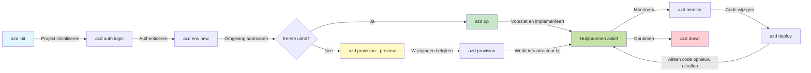
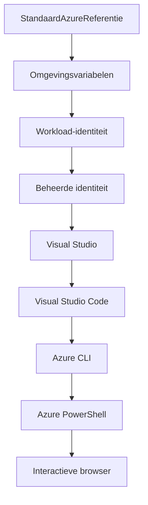

# AZD Basics - Inzicht in Azure Developer CLI

# AZD Basics - Kernconcepten en Basisprincipes

**Chapter Navigation:**
- **📚 Course Home**: [AZD Voor Beginners](../../README.md)
- **📖 Current Chapter**: Hoofdstuk 1 - Basis & Snelstart
- **⬅️ Previous**: [Cursusoverzicht](../../README.md#-chapter-1-foundation--quick-start)
- **➡️ Next**: [Installatie & Configuratie](installation.md)
- **🚀 Next Chapter**: [Hoofdstuk 2: AI-First ontwikkeling](../chapter-02-ai-development/microsoft-foundry-integration.md)

## Inleiding

Deze les introduceert je in Azure Developer CLI (azd), een krachtig commandoregelhulpmiddel dat je reis van lokale ontwikkeling naar Azure-implementatie versnelt. Je leert de fundamentele concepten, kernfuncties en begrijpt hoe azd het implementeren van cloud-native applicaties vereenvoudigt.

## Leerdoelen

Aan het einde van deze les zul je:
- Begrijpen wat Azure Developer CLI is en wat het primaire doel is
- De kernconcepten van sjablonen, omgevingen en services leren
- Belangrijke functies verkennen, waaronder sjabloongestuurde ontwikkeling en Infrastructure as Code
- De azd-projectstructuur en workflow begrijpen
- Klaar zijn om azd te installeren en configureren voor je ontwikkelomgeving

## Leerresultaten

Na het voltooien van deze les kun je:
- De rol van azd in moderne cloudontwikkelworkflows uitleggen
- De componenten van een azd-projectstructuur identificeren
- Beschrijven hoe sjablonen, omgevingen en services samenwerken
- De voordelen van Infrastructure as Code met azd begrijpen
- Verschillende azd-commando's herkennen en hun doelen benoemen

## Wat is Azure Developer CLI (azd)?

Azure Developer CLI (azd) is een commandoregelhulpmiddel ontworpen om je reis van lokale ontwikkeling naar Azure-implementatie te versnellen. Het vereenvoudigt het proces van het bouwen, implementeren en beheren van cloud-native applicaties op Azure.

### Wat kun je implementeren met azd?

azd ondersteunt een breed scala aan workloads — en de lijst groeit voortdurend. Vandaag kun je azd gebruiken om te implementeren:

| Workload Type | Examples | Same Workflow? |
|---------------|----------|----------------|
| **Traditional applications** | Web apps, REST APIs, static sites | ✅ `azd up` |
| **Services and microservices** | Container Apps, Function Apps, multi-service backends | ✅ `azd up` |
| **AI-powered applications** | Chat apps with Microsoft Foundry Models, RAG solutions with AI Search | ✅ `azd up` |
| **Intelligent agents** | Foundry-hosted agents, multi-agent orchestrations | ✅ `azd up` |

De belangrijkste inzicht is dat **de azd-levenscyclus hetzelfde blijft, ongeacht wat je implementeert**. Je initialiseert een project, provisiont infrastructuur, implementeert je code, monitort je app en ruimt op — of het nu een eenvoudige website is of een geavanceerde AI-agent.

Deze continuïteit is opzettelijk. azd behandelt AI-mogelijkheden als een ander soort service die je applicatie kan gebruiken, niet als iets fundamenteel anders. Een chat-endpoint dat wordt aangedreven door Microsoft Foundry-modellen is, vanuit het perspectief van azd, gewoon een andere service om te configureren en te implementeren.

### 🎯 Waarom AZD gebruiken? Een vergelijking uit de praktijk

Laten we het implementeren van een eenvoudige webapp met database vergelijken:

#### ❌ ZONDER AZD: Handmatige Azure-implementatie (30+ minuten)

```bash
# Stap 1: Maak een resourcegroep
az group create --name myapp-rg --location eastus

# Stap 2: Maak een App Service-plan
az appservice plan create --name myapp-plan \
  --resource-group myapp-rg \
  --sku B1 --is-linux

# Stap 3: Maak een web-app
az webapp create --name myapp-web-unique123 \
  --resource-group myapp-rg \
  --plan myapp-plan \
  --runtime "NODE:18-lts"

# Stap 4: Maak een Cosmos DB-account (10-15 minuten)
az cosmosdb create --name myapp-cosmos-unique123 \
  --resource-group myapp-rg \
  --kind MongoDB

# Stap 5: Maak een database
az cosmosdb mongodb database create \
  --account-name myapp-cosmos-unique123 \
  --resource-group myapp-rg \
  --name tododb

# Stap 6: Maak een collectie
az cosmosdb mongodb collection create \
  --account-name myapp-cosmos-unique123 \
  --resource-group myapp-rg \
  --database-name tododb \
  --name todos

# Stap 7: Haal de verbindingsreeks op
CONN_STR=$(az cosmosdb keys list \
  --name myapp-cosmos-unique123 \
  --resource-group myapp-rg \
  --type connection-strings \
  --query "connectionStrings[0].connectionString" -o tsv)

# Stap 8: Configureer de app-instellingen
az webapp config appsettings set \
  --name myapp-web-unique123 \
  --resource-group myapp-rg \
  --settings MONGODB_URI="$CONN_STR"

# Stap 9: Schakel logging in
az webapp log config --name myapp-web-unique123 \
  --resource-group myapp-rg \
  --application-logging filesystem \
  --detailed-error-messages true

# Stap 10: Stel Application Insights in
az monitor app-insights component create \
  --app myapp-insights \
  --location eastus \
  --resource-group myapp-rg

# Stap 11: Koppel Application Insights aan de Web App
INSTRUMENTATION_KEY=$(az monitor app-insights component show \
  --app myapp-insights \
  --resource-group myapp-rg \
  --query "instrumentationKey" -o tsv)

az webapp config appsettings set \
  --name myapp-web-unique123 \
  --resource-group myapp-rg \
  --settings APPINSIGHTS_INSTRUMENTATIONKEY="$INSTRUMENTATION_KEY"

# Stap 12: Bouw de applicatie lokaal
npm install
npm run build

# Stap 13: Maak een implementatiepakket
zip -r app.zip . -x "*.git*" "node_modules/*"

# Stap 14: Implementeer de applicatie
az webapp deployment source config-zip \
  --resource-group myapp-rg \
  --name myapp-web-unique123 \
  --src app.zip

# Stap 15: Wacht en bid dat het werkt 🙏
# (Geen geautomatiseerde validatie, handmatige tests vereist)
```

**Problemen:**
- ❌ 15+ commando's om te onthouden en in de juiste volgorde uit te voeren
- ❌ 30-45 minuten handwerk
- ❌ Gemakkelijk fouten te maken (typos, verkeerde parameters)
- ❌ Connection strings zichtbaar in terminalgeschiedenis
- ❌ Geen automatische rollback als er iets misgaat
- ❌ Moeilijk te repliceren voor teamleden
- ❌ Verschillend elke keer (niet reproduceerbaar)

#### ✅ MET AZD: Geautomatiseerde implementatie (5 commando's, 10-15 minuten)

```bash
# Stap 1: Initialiseer vanaf sjabloon
azd init --template todo-nodejs-mongo

# Stap 2: Authenticeren
azd auth login

# Stap 3: Maak de omgeving aan
azd env new dev

# Stap 4: Bekijk de wijzigingen (optioneel maar aanbevolen)
azd provision --preview

# Stap 5: Rol alles uit
azd up

# ✨ Klaar! Alles is uitgerold, geconfigureerd en bewaakt
```

**Voordelen:**
- ✅ **5 commando's** versus 15+ handmatige stappen
- ✅ **10-15 minuten** totale tijd (meestal wachtend op Azure)
- ✅ **Minder handmatige fouten** - consistente, sjabloongestuurde workflow
- ✅ **Veilige geheugengegevensafhandeling** - veel sjablonen gebruiken Azure-beheerde geheugensopslag
- ✅ **Herhaalbare implementaties** - elke keer dezelfde workflow
- ✅ **Volledig reproduceerbaar** - elke keer hetzelfde resultaat
- ✅ **Teamklaar** - iedereen kan met dezelfde commando's implementeren
- ✅ **Infrastructure as Code** - versiebeheer voor Bicep-sjablonen
- ✅ **Ingebouwde monitoring** - Application Insights automatisch geconfigureerd

### 📊 Tijd- & foutreductie

| Metric | Handmatige implementatie | AZD-implementatie | Verbetering |
|:-------|:------------------|:---------------|:------------|
| **Commando's** | 15+ | 5 | 67% minder |
| **Tijd** | 30-45 min | 10-15 min | 60% sneller |
| **Foutpercentage** | ~40% | <5% | 88% reductie |
| **Consistentie** | Laag (handmatig) | 100% (geautomatiseerd) | Perfect |
| **Team Onboarding** | 2-4 uur | 30 minuten | 75% sneller |
| **Rollback-tijd** | 30+ min (handmatig) | 2 min (geautomatiseerd) | 93% sneller |

## Kernconcepten

### Sjablonen
Sjablonen vormen de basis van azd. Ze bevatten:
- **Applicatiecode** - Je broncode en afhankelijkheden
- **Infrastructuurdefinities** - Azure-resources gedefinieerd in Bicep of Terraform
- **Configuratiebestanden** - Instellingen en omgevingsvariabelen
- **Deployment-scripts** - Geautomatiseerde deployment-workflows

### Omgevingen
Omgevingen vertegenwoordigen verschillende implementatiedoelwitten:
- **Development** - Voor testen en ontwikkeling
- **Staging** - Pre-productieomgeving
- **Production** - Live productieomgeving

Elke omgeving onderhoudt zijn eigen:
- Azure resource group
- Configuratie-instellingen
- Implementatiestatus

### Services
Services zijn de bouwstenen van je applicatie:
- **Frontend** - Webapplicaties, SPA's
- **Backend** - API's, microservices
- **Database** - Dataopslagoplossingen
- **Storage** - Bestands- en blobopslag

## Belangrijkste functies

### 1. Template-gedreven ontwikkeling
```bash
# Bladeren door beschikbare sjablonen
azd template list

# Initialiseer vanuit een sjabloon
azd init --template <template-name>
```

### 2. Infrastructuur als Code
- **Bicep** - Azures domeinspecifieke taal
- **Terraform** - Multi-cloud infrastructuurtool
- **ARM Templates** - Azure Resource Manager-sjablonen

### 3. Geïntegreerde workflows
```bash
# Volledige implementatieworkflow
azd up            # Provision + Deploy dit is zonder handmatige tussenkomst voor de eerste installatie

# 🧪 NIEUW: Voorvertoning van infrastructuurwijzigingen vóór uitrol (VEILIG)
azd provision --preview    # Simuleer de uitrol van infrastructuur zonder wijzigingen aan te brengen

azd provision     # Maak Azure-resources aan; gebruik dit als je de infrastructuur bijwerkt
azd deploy        # Implementeer applicatiecode of herimplementeer de code na een update
azd down          # Ruim resources op
```

#### 🛡️ Veilige infrastructuurplanning met preview
Het commando `azd provision --preview` is een game-changer voor veilige implementaties:
- **Dry-runanalyse** - Geeft weer wat wordt aangemaakt, gewijzigd of verwijderd
- **Geen risico** - Er worden geen daadwerkelijke wijzigingen doorgevoerd in je Azure-omgeving
- **Teamsamenwerking** - Deel previewresultaten vóór implementatie
- **Kostenraming** - Begrijp de resourcekosten voordat je je eraan verbindt

```bash
# Voorbeeld van een preview-workflow
azd provision --preview           # Bekijk wat er zal veranderen
# Beoordeel de output, bespreek met het team
azd provision                     # Voer de wijzigingen met vertrouwen door
```

### 📊 Visueel: AZD-ontwikkelworkflow



**Workflow-uitleg:**
1. **Init** - Begin met een sjabloon of nieuw project
2. **Auth** - Authenticeer bij Azure
3. **Omgeving** - Maak een geïsoleerde implementatieomgeving
4. **Preview** - 🆕 Bekijk altijd eerst de infrastructuurwijzigingen (veilige praktijk)
5. **Provision** - Maak/bewerk Azure-resources
6. **Deploy** - Implementeer je applicatiecode
7. **Monitor** - Bewaak de prestaties van de applicatie
8. **Iterate** - Breng wijzigingen aan en implementeer de code opnieuw
9. **Cleanup** - Verwijder resources wanneer klaar

### 4. Omgevingsbeheer
```bash
# Omgevingen maken en beheren
azd env new <environment-name>
azd env select <environment-name>
azd env list
```

### 5. Extensies en AI-commando's

azd gebruikt een extensiesysteem om mogelijkheden toe te voegen buiten de kern-CLI. Dit is vooral nuttig voor AI-workloads:

```bash
# Toon beschikbare extensies
azd extension list

# Installeer de Foundry agents-extensie
azd extension install azure.ai.agents

# Initialiseer een AI-agentproject op basis van een manifest
azd ai agent init -m agent-manifest.yaml

# Test een geïmplementeerde agent (toont latentie en tijd tot eerste byte)
azd ai agent invoke

# Start de MCP-server voor AI-ondersteunde ontwikkeling (Alpha)
azd mcp start
```

**De levenscyclus van de agent, end-to-end.** Nadat je `azure.ai.agents` hebt geïnstalleerd, brengt een enkele workflow je van idee naar een draaiende, bewaakte agent. Je hebt niet meteen al deze stappen op dag één nodig—weet gewoon dat ze bestaan:

| Stage | Command | What it does |
|-------|---------|--------------|
| **Scaffold** | `azd ai agent init -m <manifest>` | Genereer een agentproject vanuit een manifest |
| **Test** | `azd ai agent invoke` | Roep de agent aan en bekijk responstijden |
| **Measure** | `azd ai agent eval generate` | Maak een evaluatiedataset voor de agent |
| **Improve** | `azd ai agent optimize` | Optimaliseer agentinstructies op basis van je gegevens |
| **Inspect** | `azd ai agent endpoint show` | Bekijk de configuratie van het live-eindpunt |
| **Clean up** | `azd ai agent delete` | Verwijder een gehoste agent en al zijn versies |

> Extensies worden uitvoerig behandeld in [Hoofdstuk 2: AI-First Development](../chapter-02-ai-development/agents.md) en de referentie [AZD AI CLI Commands](../chapter-08-production/production-ai-practices.md#azd-ai-cli-commands-and-extensions).

## 📁 Projectstructuur

Een typische azd-projectstructuur:
```
my-app/
├── .azd/                    # azd configuration
│   └── config.json
├── .azure/                  # Azure deployment artifacts
├── .devcontainer/          # Development container config
├── .github/workflows/      # GitHub Actions
├── .vscode/               # VS Code settings
├── infra/                 # Infrastructure code
│   ├── main.bicep        # Main infrastructure template
│   ├── main.parameters.json
│   └── modules/          # Reusable modules
├── src/                  # Application source code
│   ├── api/             # Backend services
│   └── web/             # Frontend application
├── azure.yaml           # azd project configuration
└── README.md
```

## 🔧 Configuratiebestanden

### azure.yaml
Het hoofdconfiguratiebestand van het project:
```yaml
name: my-awesome-app
metadata:
  template: my-template@1.0.0

services:
  web:
    project: ./src/web
    language: js
    host: appservice
  api:
    project: ./src/api
    language: js
    host: appservice

hooks:
  preprovision:
    shell: pwsh
    run: echo "Preparing to provision..."
```

### .azure/config.json
Omgevingsspecifieke configuratie:
```json
{
  "version": 1,
  "defaultEnvironment": "dev",
  "environments": {
    "dev": {
      "subscriptionId": "your-subscription-id",
      "location": "eastus"
    }
  }
}
```

## 🎪 Veelvoorkomende workflows met praktische oefeningen

> **💡 Leertip:** Volg deze oefeningen op volgorde om je AZD-vaardigheden geleidelijk op te bouwen.

### 🎯 Oefening 1: Initialiseer je eerste project

**Doel:** Maak een AZD-project en verken de structuur ervan

**Stappen:**
```bash
# Gebruik een beproefd sjabloon
azd init --template todo-nodejs-mongo

# Verken de gegenereerde bestanden
ls -la  # Bekijk alle bestanden, inclusief verborgen bestanden

# Belangrijke aangemaakte bestanden:
# - azure.yaml (hoofdconfiguratie)
# - infra/ (infrastructuurcode)
# - src/ (applicatiecode)
```

**✅ Succes:** Je hebt azure.yaml, infra/ en src/ mappen

---

### 🎯 Oefening 2: Implementeer naar Azure

**Doel:** Volledige end-to-end implementatie

**Stappen:**
```bash
# 1. Inloggen
az login && azd auth login

# 2. Omgeving aanmaken
azd env new dev
azd env set AZURE_LOCATION eastus

# 3. Wijzigingen bekijken (AANBEVOLEN)
azd provision --preview

# 4. Alles uitrollen
azd up

# 5. Controleer de uitrol
azd show    # Bekijk de URL van je app
```

**Geschatte tijd:** 10-15 minuten  
**✅ Succes:** De applicatie-URL opent in de browser

---

### 🎯 Oefening 3: Meerdere omgevingen

**Doel:** Implementeer naar dev en staging

**Stappen:**
```bash
# Heb al een dev-omgeving, maak een staging-omgeving aan
azd env new staging
azd env set AZURE_LOCATION westus2
azd up

# Schakel tussen beide
azd env list
azd env select dev
```

**✅ Succes:** Twee afzonderlijke resourcegroepen in de Azure Portal

---

### 🛡️ Schone start: `azd down --force --purge`

Wanneer je volledig moet resetten:

```bash
azd down --force --purge
```

**Wat het doet:**
- `--force`: Geen bevestigingsprompt
- `--purge`: Verwijdert alle lokale status en Azure-resources

**Gebruik wanneer:**
- Implementatie is halverwege mislukt
- Projecten wisselen
- Nodig voor een schone start

---

## 🎪 Originele workflowreferentie

### Een nieuw project starten
```bash
# Methode 1: Gebruik een bestaand sjabloon
azd init --template todo-nodejs-mongo

# Methode 2: Begin helemaal opnieuw
azd init

# Methode 3: Gebruik de huidige map
azd init .
```

### Ontwikkelingscyclus
```bash
# Zet de ontwikkelomgeving op
azd auth login
azd env new dev
azd env select dev

# Implementeer alles
azd up

# Breng wijzigingen aan en implementeer opnieuw
azd deploy

# Ruim op als je klaar bent
azd down --force --purge # Een commando in de Azure Developer CLI is een **harde reset** voor je omgeving—bijzonder nuttig wanneer je problemen bij mislukte implementaties oplost, achtergebleven resources opruimt of je voorbereidt op een schone heruitrol.
```

## Begrijpen van `azd down --force --purge`
Het commando `azd down --force --purge` is een krachtig middel om je azd-omgeving en alle bijbehorende resources volledig af te breken. Hier volgt een overzicht van wat elke vlag doet:
```
--force
```
- Slaat bevestigingsprompts over.
- Handig voor automatisering of scripting wanneer handmatige input niet mogelijk is.
- Zorgt ervoor dat de afbraak zonder onderbreking doorgaat, zelfs als de CLI inconsistenties detecteert.

```
--purge
```
Verwijdert **alle bijbehorende metadata**, inclusief:
Omgevingsstatus
Lokale `.azure` map
Gecachte implementatiegegevens
Voorkomt dat azd eerdere implementaties "onthoudt", wat problemen kan veroorzaken zoals mismatches in resourcegroepen of verouderde registry-verwijzingen.


### Waarom beide gebruiken?
Wanneer je vastloopt met `azd up` door achterblijvende status of gedeeltelijke implementaties, zorgt deze combinatie voor een **schone start**.

Het is vooral nuttig na handmatige resourceverwijderingen in de Azure-portal of bij het wisselen van sjablonen, omgevingen of naamgevingsconventies voor resourcegroepen.


### Meerdere omgevingen beheren
```bash
# Maak een staging-omgeving
azd env new staging
azd env select staging
azd up

# Schakel terug naar dev
azd env select dev

# Vergelijk omgevingen
azd env list
```

## 🔐 Authenticatie en referenties

Het begrijpen van authenticatie is cruciaal voor succesvolle azd-implementaties. Azure gebruikt meerdere authenticatiemethoden, en azd maakt gebruik van dezelfde credential-keten die door andere Azure-tools wordt gebruikt.

### Azure CLI-authenticatie (`az login`)

Voordat je azd gebruikt, moet je authenticeren bij Azure. De meest gebruikelijke methode is het gebruik van de Azure CLI:

```bash
# Interactieve aanmelding (opent de browser)
az login

# Aanmelden met specifieke tenant
az login --tenant <tenant-id>

# Aanmelden met service-principal
az login --service-principal -u <app-id> -p <password> --tenant <tenant-id>

# Huidige aanmeldstatus controleren
az account show

# Beschikbare abonnementen weergeven
az account list --output table

# Standaardabonnement instellen
az account set --subscription <subscription-id>
```

### Authenticatiestroom
1. **Interactieve login**: Opent je standaardbrowser voor authenticatie
2. **Device Code Flow**: Voor omgevingen zonder browsertoegang
3. **Service Principal**: Voor automatisering en CI/CD-scenario's
4. **Managed Identity**: Voor in Azure gehoste applicaties

### DefaultAzureCredential-keten

`DefaultAzureCredential` is een type credential dat een vereenvoudigde authenticatie-ervaring biedt door automatisch meerdere credential-bronnen in een specifieke volgorde te proberen:

#### Volgorde van de credential-keten


#### 1. Omgevingsvariabelen
```bash
# Stel omgevingsvariabelen in voor de service-principal
export AZURE_CLIENT_ID="<app-id>"
export AZURE_CLIENT_SECRET="<password>"
export AZURE_TENANT_ID="<tenant-id>"
```

#### 2. Workload Identity (Kubernetes/GitHub Actions)
Wordt automatisch gebruikt in:
- Azure Kubernetes Service (AKS) met Workload Identity
- GitHub Actions met OIDC-federatie
- Andere scenario's met gefedereerde identiteit

#### 3. Managed Identity
Voor Azure-resources zoals:
- Virtuele Machines
- App Service
- Azure Functions
- Container Instances

```bash
# Controleren of het op een Azure-resource met een beheerde identiteit wordt uitgevoerd
az account show --query "user.type" --output tsv
# Geeft "servicePrincipal" terug als er een beheerde identiteit wordt gebruikt
```

#### 4. Integratie met ontwikkeltools
- **Visual Studio**: Gebruikt automatisch het aangemelde account
- **VS Code**: Gebruikt de referenties van de Azure Account-extensie
- **Azure CLI**: Gebruikt `az login`-referenties (meest gebruikelijk voor lokale ontwikkeling)

### AZD-authenticatieconfiguratie

```bash
# Methode 1: Gebruik Azure CLI (Aanbevolen voor ontwikkeling)
az login
azd auth login  # Gebruikt bestaande Azure CLI-referenties

# Methode 2: Directe azd-authenticatie
azd auth login --use-device-code  # Voor headless-omgevingen

# Methode 3: Controleer de authenticatiestatus
azd auth login --check-status

# Methode 4: Uitloggen en opnieuw authenticeren
azd auth logout
azd auth login
```

### Beste praktijken voor authenticatie

#### Voor lokale ontwikkeling
```bash
# 1. Log in met de Azure CLI
az login

# 2. Controleer of het abonnement correct is
az account show
az account set --subscription "Your Subscription Name"

# 3. Gebruik azd met bestaande referenties
azd auth login
```

#### Voor CI/CD-pijplijnen
```yaml
# GitHub Actions example
- name: Azure Login
  uses: azure/login@v1
  with:
    creds: ${{ secrets.AZURE_CREDENTIALS }}

- name: Deploy with azd
  run: |
    azd auth login --client-id ${{ secrets.AZURE_CLIENT_ID }} \
                    --client-secret ${{ secrets.AZURE_CLIENT_SECRET }} \
                    --tenant-id ${{ secrets.AZURE_TENANT_ID }}
    azd up --no-prompt
```

#### Voor productieomgevingen
- Gebruik **Managed Identity** wanneer u op Azure-resources draait
- Gebruik **Service Principal** voor automatiseringsscenario's
- Vermijd het opslaan van referenties in code of configuratiebestanden
- Gebruik **Azure Key Vault** voor gevoelige configuratie

### Veelvoorkomende authenticatieproblemen en oplossingen

#### Probleem: "Geen abonnement gevonden"
```bash
# Oplossing: Stel het standaardabonnement in
az account list --output table
az account set --subscription "<subscription-id>"
azd env set AZURE_SUBSCRIPTION_ID "<subscription-id>"
```

#### Probleem: "Onvoldoende machtigingen"
```bash
# Oplossing: Controleer en wijs de vereiste rollen toe
az role assignment list --assignee $(az account show --query user.name --output tsv)

# Veelvoorkomende vereiste rollen:
# - Contributor (voor resourcebeheer)
# - User Access Administrator (voor roltoewijzingen)
```

#### Probleem: "Token verlopen"
```bash
# Oplossing: opnieuw authenticeren
az logout
az login
azd auth logout
azd auth login
```

### Authenticatie in verschillende scenario's

#### Lokale ontwikkeling
```bash
# Persoonlijke ontwikkelingsrekening
az login
azd auth login
```

#### Teamontwikkeling
```bash
# Gebruik een specifieke tenant voor de organisatie
az login --tenant contoso.onmicrosoft.com
azd auth login
```

#### Multi-tenantscenario's
```bash
# Wissel tussen tenants
az login --tenant tenant1.onmicrosoft.com
# Uitrollen naar tenant 1
azd up

az login --tenant tenant2.onmicrosoft.com  
# Uitrollen naar tenant 2
azd up
```

### Beveiligingsoverwegingen

1. **Opslag van referenties**: Sla nooit referenties op in broncode
2. **Beperking van machtigingen**: Gebruik het minst-privilegeprincipe voor service principals
3. **Tokenrotatie**: Roteer regelmatig de geheimen van service principals
4. **Audit-trail**: Bewaak authenticatie- en implementatieactiviteiten
5. **Netwerkbeveiliging**: Gebruik waar mogelijk private endpoints

### Probleemoplossing authenticatie

```bash
# Authenticatieproblemen debuggen
azd auth login --check-status
az account show
az account get-access-token

# Veelvoorkomende diagnostische opdrachten
whoami                          # Huidige gebruikerscontext
az ad signed-in-user show      # Microsoft Entra ID-gebruikersgegevens
az group list                  # Toegang tot resource testen
```

## Begrijpen van `azd down --force --purge`

### Ontdekking
```bash
azd template list              # Sjablonen bekijken
azd template show <template>   # Sjabloondetails
azd init --help               # Initialisatieopties
```

### Projectbeheer
```bash
azd show                     # Projectoverzicht
azd env list                # Beschikbare omgevingen en geselecteerde standaard
azd config show            # Configuratie-instellingen
```

### Monitoring
```bash
azd monitor                  # Open de monitoring in het Azure-portal
azd monitor --logs           # Bekijk applicatielogs
azd monitor --live           # Bekijk realtime statistieken
azd pipeline config          # Stel CI/CD in
```

## Beste werkwijzen

### 1. Gebruik betekenisvolle namen
```bash
# Goed
azd env new production-east
azd init --template web-app-secure

# Vermijd
azd env new env1
azd init --template template1
```

### 2. Maak gebruik van sjablonen
- Begin met bestaande sjablonen
- Pas aan op uw behoeften
- Maak herbruikbare sjablonen voor uw organisatie

### 3. Omgevingsisolatie
- Gebruik gescheiden omgevingen voor dev/staging/prod
- Implementeer nooit rechtstreeks naar productie vanaf een lokale machine
- Gebruik CI/CD-pijplijnen voor productie-implementaties

### 4. Configuratiebeheer
- Gebruik omgevingsvariabelen voor gevoelige gegevens
- Bewaar configuratie in versiebeheer
- Documenteer omgevingsspecifieke instellingen

## Leertraject

### Beginner (Week 1-2)
1. Installeer azd en authenticeer
2. Implementeer een eenvoudig sjabloon
3. Begrijp de projectstructuur
4. Leer basiscommando's (up, down, deploy)

### Gevorderd (Week 3-4)
1. Pas sjablonen aan
2. Beheer meerdere omgevingen
3. Begrijp infrastructuurcode
4. Stel CI/CD-pijplijnen in

### Geavanceerd (Week 5+)
1. Maak aangepaste sjablonen
2. Geavanceerde infrastructuurpatronen
3. Implementaties in meerdere regio's
4. Enterprise-grade configuraties

## Volgende stappen

**📖 Ga verder met Hoofdstuk 1:**
- [Installatie & Setup](installation.md) - Installeer en configureer azd
- [Je eerste project](first-project.md) - Voltooi de praktische tutorial
- [Configuratiehandleiding](configuration.md) - Geavanceerde configuratieopties

**🎯 Klaar voor het volgende hoofdstuk?**
- [Hoofdstuk 2: AI-First ontwikkeling](../chapter-02-ai-development/microsoft-foundry-integration.md) - Begin met het bouwen van AI-toepassingen

## Aanvullende bronnen

- [Azure Developer CLI-overzicht](https://learn.microsoft.com/en-us/azure/developer/azure-developer-cli/)
- [Sjabloongalerij](https://azure.github.io/awesome-azd/)
- [Communityvoorbeelden](https://github.com/Azure-Samples)

---

## 🙋 Veelgestelde vragen

### Algemene vragen

**Q: Wat is het verschil tussen AZD en Azure CLI?**

A: Azure CLI (`az`) is voor het beheren van individuele Azure-resources. AZD (`azd`) is voor het beheren van volledige applicaties:

```bash
# Azure CLI - laag-niveau resourcebeheer
az webapp create --name myapp --resource-group rg
az sql server create --name myserver --resource-group rg
# ...veel meer commando's nodig

# AZD - beheer op applicatieniveau
azd up  # Implementeert de hele app met alle resources
```

**Denk er zo over:**
- `az` = Werken met individuele Lego-steentjes
- `azd` = Werken met complete Lego-sets

---

**Q: Moet ik Bicep of Terraform kennen om AZD te gebruiken?**

A: Nee! Begin met sjablonen:
```bash
# Gebruik bestaand sjabloon - geen kennis van IaC nodig
azd init --template todo-nodejs-mongo
azd up
```

U kunt Bicep later leren om infrastructuur aan te passen. Sjablonen bieden werkende voorbeelden om van te leren.

---

**Q: Wat kost het om AZD-sjablonen uit te voeren?**

A: Kosten variëren per sjabloon. De meeste ontwikkelingssjablonen kosten $50-150/maand:

```bash
# Bekijk de kosten voordat u uitrolt
azd provision --preview

# Ruim altijd op wanneer het niet gebruikt wordt
azd down --force --purge  # Verwijdert alle bronnen
```

**Pro tip:** Gebruik gratis niveaus waar beschikbaar:
- App Service: F1 (Gratis) niveau
- Microsoft Foundry Models: Azure OpenAI 50.000 tokens/maand gratis
- Cosmos DB: 1000 RU/s gratis niveau

---

**Q: Kan ik AZD gebruiken met bestaande Azure-resources?**

A: Ja, maar het is gemakkelijker om fris te beginnen. AZD werkt het beste wanneer het de volledige levenscyclus beheert. Voor bestaande resources:

```bash
# Optie 1: Importeer bestaande resources (gevorderd)
azd init
# Wijzig vervolgens infra/ om naar bestaande resources te verwijzen

# Optie 2: Begin opnieuw (aanbevolen)
azd init --template matching-your-stack
azd up  # Maakt een nieuwe omgeving aan
```

---

**Q: Hoe deel ik mijn project met teamleden?**

A: Commit het AZD-project naar Git (maar NIET de .azure-map):

```bash
# Staat standaard al in .gitignore
.azure/        # Bevat geheimen en omgevingsgegevens
*.env          # Omgevingsvariabelen

# Teamleden toen:
git clone <your-repo>
azd auth login
azd env new <their-name>-dev
azd up
```

Iedereen krijgt identieke infrastructuur van dezelfde sjablonen.

---

### Vragen over probleemoplossing

**Q: "azd up" is halverwege mislukt. Wat moet ik doen?**

A: Controleer de fout, los deze op en probeer opnieuw:

```bash
# Bekijk gedetailleerde logs
azd show

# Veelvoorkomende oplossingen:

# 1. Als de quota zijn overschreden:
azd env set AZURE_LOCATION "westus2"  # Probeer een andere regio

# 2. Als er een conflict is met de resource-naam:
azd down --force --purge  # Schone lei
azd up  # Opnieuw proberen

# 3. Als de authenticatie is verlopen:
az login
azd auth login
azd up
```

**Meest voorkomende probleem:** Verkeerd Azure-abonnement geselecteerd
```bash
az account list --output table
az account set --subscription "<correct-subscription>"
```

---

**Q: Hoe zet ik alleen codewijzigingen uit zonder opnieuw te provisioneren?**

A: Gebruik `azd deploy` in plaats van `azd up`:

```bash
azd up          # Eerste keer: provisioneren + uitrollen (traag)

# Breng codewijzigingen aan...

azd deploy      # Volgende keren: alleen uitrollen (snel)
```

Snelheidsvergelijking:
- `azd up`: 10-15 minuten (richt infrastructuur in)
- `azd deploy`: 2-5 minuten (alleen code)

---

**Q: Kan ik de infrastructuursjablonen aanpassen?**

A: Ja! Bewerk de Bicep-bestanden in `infra/`:

```bash
# Na azd init
cd infra/
code main.bicep  # Bewerk in VS Code

# Wijzigingen bekijken
azd provision --preview

# Wijzigingen toepassen
azd provision
```

**Tip:** Begin klein - wijzig eerst SKUs:
```bicep
// infra/main.bicep
sku: {
  name: 'B1'  // Change to 'P1V2' for production
}
```

---

**Q: Hoe verwijder ik alles wat AZD heeft aangemaakt?**

A: Eén commando verwijdert alle resources:

```bash
azd down --force --purge

# Dit verwijdert:
# - Alle Azure-resources
# - Resourcegroep
# - Lokale omgevingsstatus
# - Gecachte implementatiegegevens
```

**Voer dit altijd uit wanneer:**
- Klaar met het testen van een sjabloon
- Overschakelen naar een ander project
- Wilt u opnieuw beginnen

**Kostenbesparing:** Het verwijderen van ongebruikte resources = $0 kosten

---

**Q: Wat als ik per ongeluk resources in de Azure-portal heb verwijderd?**

A: De AZD-status kan uit sync raken. Schone lei-aanpak:

```bash
# 1. Verwijder lokale toestand
azd down --force --purge

# 2. Begin opnieuw
azd up

# Alternatief: Laat AZD detecteren en verhelpen
azd provision  # Zal ontbrekende resources aanmaken
```

---

### Geavanceerde vragen

**Q: Kan ik AZD gebruiken in CI/CD-pijplijnen?**

A: Ja! Voorbeeld voor GitHub Actions:

```yaml
# .github/workflows/deploy.yml
name: Deploy with AZD

on:
  push:
    branches: [main]

jobs:
  deploy:
    runs-on: ubuntu-latest
    steps:
      - uses: actions/checkout@v2
      
      - name: Install azd
        run: curl -fsSL https://aka.ms/install-azd.sh | bash
      
      - name: Azure Login
        run: |
          azd auth login \
            --client-id ${{ secrets.AZURE_CLIENT_ID }} \
            --client-secret ${{ secrets.AZURE_CLIENT_SECRET }} \
            --tenant-id ${{ secrets.AZURE_TENANT_ID }}
      
      - name: Deploy
        run: azd up --no-prompt
```

---

**Q: Hoe ga ik om met secrets en gevoelige gegevens?**

A: AZD integreert automatisch met Azure Key Vault:

```bash
# Geheimen worden opgeslagen in Key Vault, niet in de code
azd env set DATABASE_PASSWORD "$(openssl rand -base64 32)"

# AZD doet dit automatisch:
# 1. Maakt Key Vault aan
# 2. Slaat het geheim op
# 3. Geeft app toegang via Managed Identity
# 4. Injecteert tijdens runtime
```

**Nooit committen:**
- `.azure/` map (bevat omgevingsgegevens)
- `.env` bestanden (lokale geheimen)
- Connection-strings

---

**Q: Kan ik naar meerdere regio's implementeren?**

A: Ja, maak per regio een omgeving aan:

```bash
# Oostelijke VS-omgeving
azd env new prod-eastus
azd env set AZURE_LOCATION eastus
azd up

# West-Europese omgeving
azd env new prod-westeurope
azd env set AZURE_LOCATION westeurope
azd up

# Elke omgeving is onafhankelijk
azd env list
```

Voor echte multi-region-apps past u de Bicep-sjablonen aan om gelijktijdig naar meerdere regio's te implementeren.

---

**Q: Waar kan ik hulp krijgen als ik vastzit?**

1. **AZD-documentatie:** https://learn.microsoft.com/azure/developer/azure-developer-cli/
2. **GitHub Issues:** https://github.com/Azure/azure-dev/issues
3. **Discord:** [Azure Discord](https://discord.gg/microsoft-azure) - kanaal #azure-developer-cli
4. **Stack Overflow:** Tag `azure-developer-cli`
5. **Deze cursus:** [Probleemoplossingsgids](../chapter-07-troubleshooting/common-issues.md)

**Pro tip:** Voordat u het vraagt, voer uit:
```bash
azd show       # Toont de huidige status
azd version    # Toont jouw versie
```
Voeg deze informatie toe aan uw vraag voor snellere hulp.

---

## 🎓 Wat nu?

U begrijpt nu de AZD-grondbeginselen. Kies uw pad:

### 🎯 Voor beginners:
1. **Volgend:** [Installatie & Setup](installation.md) - Installeer AZD op uw machine
2. **Vervolgens:** [Uw eerste project](first-project.md) - Implementeer uw eerste app
3. **Oefen:** Voltooi alle 3 oefeningen in deze les

### 🚀 Voor AI-ontwikkelaars:
1. **Ga naar:** [Hoofdstuk 2: AI-First ontwikkeling](../chapter-02-ai-development/microsoft-foundry-integration.md)
2. **Implementeer:** Begin met `azd init --template get-started-with-ai-chat`
3. **Leer:** Bouw terwijl u implementeert

### 🏗️ Voor ervaren ontwikkelaars:
1. **Beoordeel:** [Configuratiehandleiding](configuration.md) - Geavanceerde instellingen
2. **Verken:** [Infrastructure as Code](../chapter-04-infrastructure/provisioning.md) - grondige Bicep-uitleg
3. **Bouw:** Maak aangepaste sjablonen voor uw stack

---

**Hoofdstuknavigatie:**
- **📚 Cursus Home**: [AZD Voor Beginners](../../README.md)
- **📖 Huidig hoofdstuk**: Hoofdstuk 1 - Basis & Snelstart  
- **⬅️ Vorige**: [Cursusoverzicht](../../README.md#-chapter-1-foundation--quick-start)
- **➡️ Volgende**: [Installatie & Setup](installation.md)
- **🚀 Volgend hoofdstuk**: [Hoofdstuk 2: AI-First ontwikkeling](../chapter-02-ai-development/microsoft-foundry-integration.md)

---

<!-- CO-OP TRANSLATOR DISCLAIMER START -->
**Disclaimer**:
Dit document is vertaald met behulp van de AI vertaaldienst [Co-op Translator](https://github.com/Azure/co-op-translator). Hoewel we streven naar nauwkeurigheid, dient u er rekening mee te houden dat geautomatiseerde vertalingen fouten of onnauwkeurigheden kunnen bevatten. Het originele document in de oorspronkelijke taal moet worden beschouwd als de gezaghebbende bron. Voor kritieke informatie wordt professionele menselijke vertaling aanbevolen. Wij zijn niet aansprakelijk voor eventuele misverstanden of verkeerde interpretaties die voortvloeien uit het gebruik van deze vertaling.
<!-- CO-OP TRANSLATOR DISCLAIMER END -->