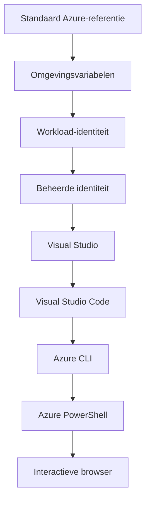

# AZD Basics - Inzicht in Azure Developer CLI

# AZD Basics - Kernconcepten en basisprincipes

**Chapter Navigation:**
- **📚 Course Home**: [AZD Voor Beginners](../../README.md)
- **📖 Current Chapter**: Hoofdstuk 1 - Fundament & Snelstart
- **⬅️ Previous**: [Cursusoverzicht](../../README.md#-chapter-1-foundation--quick-start)
- **➡️ Next**: [Installatie & Configuratie](installation.md)
- **🚀 Next Chapter**: [Hoofdstuk 2: AI-first ontwikkeling](../chapter-02-ai-development/microsoft-foundry-integration.md)

## Introductie

Deze les introduceert je in Azure Developer CLI (azd), een krachtig commandoregelhulpmiddel dat je reis van lokale ontwikkeling naar Azure-implementatie versnelt. Je leert de fundamentele concepten, kernfuncties en begrijpt hoe azd het uitrollen van cloud-native applicaties vereenvoudigt.

## Leerdoelen

Aan het eind van deze les zul je:
- Begrijpen wat Azure Developer CLI is en wat het primaire doel is
- De kernconcepten van templates, omgevingen en services leren
- Belangrijke functies verkennen, waaronder template-gestuurde ontwikkeling en Infrastructuur als Code
- De azd-projectstructuur en workflow begrijpen
- Klaar zijn om azd te installeren en te configureren voor je ontwikkelomgeving

## Leerresultaten

Na het voltooien van deze les kun je:
- De rol van azd in moderne cloudontwikkelworkflows uitleggen
- De componenten van een azd-projectstructuur identificeren
- Beschrijven hoe templates, omgevingen en services samenwerken
- De voordelen van Infrastructuur als Code met azd begrijpen
- Verschillende azd-commando's en hun doeleinden herkennen

## Wat is Azure Developer CLI (azd)?

Azure Developer CLI (azd) is een commandoregelhulpmiddel dat is ontworpen om je reis van lokale ontwikkeling naar Azure-implementatie te versnellen. Het vereenvoudigt het proces van bouwen, uitrollen en beheren van cloud-native applicaties op Azure.

### 🎯 Waarom AZD gebruiken? Een vergelijking uit de praktijk

Laten we het uitrollen van een eenvoudige webapp met database vergelijken:

#### ❌ ZONDER AZD: Handmatige Azure-implementatie (30+ minuten)

```bash
# Stap 1: Maak een resourcegroep
az group create --name myapp-rg --location eastus

# Stap 2: Maak een App Service-plan
az appservice plan create --name myapp-plan \
  --resource-group myapp-rg \
  --sku B1 --is-linux

# Stap 3: Maak een Web-app
az webapp create --name myapp-web-unique123 \
  --resource-group myapp-rg \
  --plan myapp-plan \
  --runtime "NODE:18-lts"

# Stap 4: Maak een Cosmos DB-account (10-15 minuten)
az cosmosdb create --name myapp-cosmos-unique123 \
  --resource-group myapp-rg \
  --kind MongoDB

# Stap 5: Maak een database
az cosmosdb mongodb database create \
  --account-name myapp-cosmos-unique123 \
  --resource-group myapp-rg \
  --name tododb

# Stap 6: Maak een collectie
az cosmosdb mongodb collection create \
  --account-name myapp-cosmos-unique123 \
  --resource-group myapp-rg \
  --database-name tododb \
  --name todos

# Stap 7: Haal verbindingsreeks op
CONN_STR=$(az cosmosdb keys list \
  --name myapp-cosmos-unique123 \
  --resource-group myapp-rg \
  --type connection-strings \
  --query "connectionStrings[0].connectionString" -o tsv)

# Stap 8: Configureer app-instellingen
az webapp config appsettings set \
  --name myapp-web-unique123 \
  --resource-group myapp-rg \
  --settings MONGODB_URI="$CONN_STR"

# Stap 9: Schakel logging in
az webapp log config --name myapp-web-unique123 \
  --resource-group myapp-rg \
  --application-logging filesystem \
  --detailed-error-messages true

# Stap 10: Stel Application Insights in
az monitor app-insights component create \
  --app myapp-insights \
  --location eastus \
  --resource-group myapp-rg

# Stap 11: Koppel App Insights aan de Web-app
INSTRUMENTATION_KEY=$(az monitor app-insights component show \
  --app myapp-insights \
  --resource-group myapp-rg \
  --query "instrumentationKey" -o tsv)

az webapp config appsettings set \
  --name myapp-web-unique123 \
  --resource-group myapp-rg \
  --settings APPINSIGHTS_INSTRUMENTATIONKEY="$INSTRUMENTATION_KEY"

# Stap 12: Bouw de applicatie lokaal
npm install
npm run build

# Stap 13: Maak een implementatiepakket
zip -r app.zip . -x "*.git*" "node_modules/*"

# Stap 14: Implementeer de applicatie
az webapp deployment source config-zip \
  --resource-group myapp-rg \
  --name myapp-web-unique123 \
  --src app.zip

# Stap 15: Wacht en bid dat het werkt 🙏
# (Geen geautomatiseerde validatie, handmatige tests vereist)
```

**Problemen:**
- ❌ 15+ commando's om te onthouden en in volgorde uit te voeren
- ❌ 30-45 minuten handmatig werk
- ❌ Gemakkelijk fouten te maken (typfouten, verkeerde parameters)
- ❌ Connection strings zichtbaar in terminalgeschiedenis
- ❌ Geen automatische rollback als er iets misgaat
- ❌ Moeilijk te reproduceren voor teamleden
- ❌ Elke keer anders (niet reproduceerbaar)

#### ✅ MET AZD: Geautomatiseerde implementatie (5 commando's, 10-15 minuten)

```bash
# Stap 1: Initialiseren vanaf sjabloon
azd init --template todo-nodejs-mongo

# Stap 2: Authenticeren
azd auth login

# Stap 3: Omgeving aanmaken
azd env new dev

# Stap 4: Wijzigingen bekijken (optioneel maar aanbevolen)
azd provision --preview

# Stap 5: Alles uitrollen
azd up

# ✨ Klaar! Alles is uitgerold, geconfigureerd en gemonitord
```

**Voordelen:**
- ✅ **5 commando's** vs. 15+ handmatige stappen
- ✅ **10-15 minuten** totale tijd (meestal wachten op Azure)
- ✅ **Geen fouten** - geautomatiseerd en getest
- ✅ **Geheimen veilig beheerd** via Key Vault
- ✅ **Automatisch terugdraaien** bij fouten
- ✅ **Volledig reproduceerbaar** - hetzelfde resultaat elke keer
- ✅ **Klaar voor teams** - iedereen kan met dezelfde commando's deployen
- ✅ **Infrastructuur als Code** - versiebeheerde Bicep-templates
- ✅ **Ingebouwde monitoring** - Application Insights automatisch geconfigureerd

### 📊 Tijd- en foutenreductie

| Metric | Manual Deployment | AZD Deployment | Improvement |
|:-------|:------------------|:---------------|:------------|
| **Commando's** | 15+ | 5 | 67% minder |
| **Tijd** | 30-45 min | 10-15 min | 60% sneller |
| **Foutenpercentage** | ~40% | <5% | 88% reductie |
| **Consistentie** | Laag (handmatig) | 100% (geautomatiseerd) | Perfect |
| **Teamintroductie** | 2-4 uur | 30 minuten | 75% sneller |
| **Rollback-tijd** | 30+ min (handmatig) | 2 min (geautomatiseerd) | 93% sneller |

## Kernconcepten

### Templates
Templates zijn de basis van azd. Ze bevatten:
- **Applicatiecode** - Je broncode en afhankelijkheden
- **Infrastructuurdefinities** - Azure-resources gedefinieerd in Bicep of Terraform
- **Configuratiebestanden** - Instellingen en omgevingsvariabelen
- **Deploymentscripts** - Geautomatiseerde deploymentworkflows

### Omgevingen
Omgevingen vertegenwoordigen verschillende implementatiedoelen:
- **Ontwikkeling** - Voor testen en ontwikkeling
- **Staging** - Pre-productieomgeving
- **Productie** - Live productieomgeving

Elke omgeving onderhoudt zijn eigen:
- Azure-resourcegroep
- Configuratie-instellingen
- Implementatiestatus

### Services
Services zijn de bouwstenen van je applicatie:
- **Frontend** - Webapplicaties, SPAs
- **Backend** - API's, microservices
- **Database** - Dataopslagoplossingen
- **Opslag** - Bestands- en blobopslag

## Belangrijkste kenmerken

### 1. Template-gestuurde ontwikkeling
```bash
# Blader door beschikbare sjablonen
azd template list

# Initialiseer vanaf een sjabloon
azd init --template <template-name>
```

### 2. Infrastructuur als Code
- **Bicep** - Domeinspecifieke taal van Azure
- **Terraform** - Multi-cloud infrastructuurtool
- **ARM Templates** - Azure Resource Manager-templates

### 3. Geïntegreerde workflows
```bash
# Volledige implementatieworkflow
azd up            # Provision + Deploy: dit is volledig geautomatiseerd voor de eerste configuratie

# 🧪 NIEUW: Bekijk infrastructuurwijzigingen vóór implementatie (VEILIG)
azd provision --preview    # Simuleer infrastructuurimplementatie zonder wijzigingen aan te brengen

azd provision     # Maak Azure-resources aan; gebruik dit als je de infrastructuur bijwerkt
azd deploy        # Implementeer applicatiecode of herimplementeer de applicatiecode na een update
azd down          # Ruim resources op
```

#### 🛡️ Veilige infrastructuurplanning met preview
Het `azd provision --preview`-commando is een belangrijke verbetering voor veilige implementaties:
- **Dry-run-analyse** - Toont wat wordt gemaakt, gewijzigd of verwijderd
- **Geen risico** - Er worden geen daadwerkelijke wijzigingen in je Azure-omgeving aangebracht
- **Teamsamenwerking** - Deel previewresultaten vóór implementatie
- **Kostenraming** - Begrijp resourcekosten voordat je je vastlegt

```bash
# Voorbeeld van een voorvertoning-workflow
azd provision --preview           # Bekijk wat er zal veranderen
# Beoordeel de uitvoer, bespreek met het team
azd provision                     # Pas wijzigingen met vertrouwen toe
```

### 📊 Visualisatie: AZD-ontwikkelworkflow


**Workflowuitleg:**
1. **Init** - Begin met een template of nieuw project
2. **Auth** - Meld je aan bij Azure
3. **Environment** - Maak een geïsoleerde implementatieomgeving
4. **Preview** - 🆕 Bekijk altijd eerst de infrastructuurwijzigingen (veilige werkwijze)
5. **Provision** - Maak bij of werk Azure-resources bij
6. **Deploy** - Push je applicatiecode
7. **Monitor** - Observeer de applicatieprestaties
8. **Iterate** - Breng wijzigingen aan en deploy de code opnieuw
9. **Cleanup** - Verwijder resources wanneer klaar

### 4. Omgevingsbeheer
```bash
# Maak en beheer omgevingen
azd env new <environment-name>
azd env select <environment-name>
azd env list
```

## 📁 Projectstructuur

Een typische azd-projectstructuur:
```
my-app/
├── .azd/                    # azd configuration
│   └── config.json
├── .azure/                  # Azure deployment artifacts
├── .devcontainer/          # Development container config
├── .github/workflows/      # GitHub Actions
├── .vscode/               # VS Code settings
├── infra/                 # Infrastructure code
│   ├── main.bicep        # Main infrastructure template
│   ├── main.parameters.json
│   └── modules/          # Reusable modules
├── src/                  # Application source code
│   ├── api/             # Backend services
│   └── web/             # Frontend application
├── azure.yaml           # azd project configuration
└── README.md
```

## 🔧 Configuratiebestanden

### azure.yaml
Het belangrijkste projectconfiguratiebestand:
```yaml
name: my-awesome-app
metadata:
  template: my-template@1.0.0

services:
  web:
    project: ./src/web
    language: js
    host: appservice
  api:
    project: ./src/api
    language: js
    host: appservice

hooks:
  preprovision:
    shell: pwsh
    run: echo "Preparing to provision..."
```

### .azure/config.json
Omgevingsspecifieke configuratie:
```json
{
  "version": 1,
  "defaultEnvironment": "dev",
  "environments": {
    "dev": {
      "subscriptionId": "your-subscription-id",
      "location": "eastus"
    }
  }
}
```

## 🎪 Veelvoorkomende workflows met praktische oefeningen

> **💡 Leertip:** Volg deze oefeningen in volgorde om je AZD-vaardigheden geleidelijk op te bouwen.

### 🎯 Oefening 1: Initialiseer je eerste project

**Doel:** Maak een AZD-project en verken de structuur ervan

**Stappen:**
```bash
# Gebruik een beproefd sjabloon
azd init --template todo-nodejs-mongo

# Verken de gegenereerde bestanden
ls -la  # Bekijk alle bestanden, inclusief verborgen bestanden

# Belangrijke aangemaakte bestanden:
# - azure.yaml (hoofdconfiguratie)
# - infra/ (infrastructuurcode)
# - src/ (applicatiecode)
```

**✅ Succes:** Je hebt azure.yaml, infra/ en src/ mappen

---

### 🎯 Oefening 2: Implementeren naar Azure

**Doel:** Volledige end-to-end-implementatie voltooien

**Stappen:**
```bash
# 1. Authenticeren
az login && azd auth login

# 2. Maak een omgeving
azd env new dev
azd env set AZURE_LOCATION eastus

# 3. Wijzigingen bekijken (AANBEVOLEN)
azd provision --preview

# 4. Alles implementeren
azd up

# 5. Controleer implementatie
azd show    # Bekijk de URL van je app
```

**Verwachte tijd:** 10-15 minuten  
**✅ Succes:** Applicatie-URL opent in browser

---

### 🎯 Oefening 3: Meerdere omgevingen

**Doel:** Deploy naar dev en staging

**Stappen:**
```bash
# Als je al een dev-omgeving hebt, maak dan een staging-omgeving aan
azd env new staging
azd env set AZURE_LOCATION westus2
azd up

# Wissel tussen beide
azd env list
azd env select dev
```

**✅ Succes:** Twee aparte resourcegroepen in de Azure Portal

---

### 🛡️ Schone lei: `azd down --force --purge`

Wanneer je volledig moet resetten:

```bash
azd down --force --purge
```

**Wat het doet:**
- `--force`: Geen bevestigingsprompts
- `--purge`: Verwijdert alle lokale status en Azure-resources

**Gebruik wanneer:**
- Implementatie is halverwege mislukt
- Van project wisselen
- Je hebt een frisse start nodig

---

## 🎪 Originele workflowreferentie

### Een nieuw project starten
```bash
# Methode 1: Gebruik bestaand sjabloon
azd init --template todo-nodejs-mongo

# Methode 2: Begin vanaf nul
azd init

# Methode 3: Gebruik huidige map
azd init .
```

### Ontwikkelingscyclus
```bash
# Stel de ontwikkelomgeving in
azd auth login
azd env new dev
azd env select dev

# Rol alles uit
azd up

# Breng wijzigingen aan en rol opnieuw uit
azd deploy

# Ruim op als je klaar bent
azd down --force --purge # Een commando in de Azure Developer CLI is een **volledige reset** voor je omgeving—vooral handig wanneer je problemen oplost met mislukte implementaties, verweesde resources opruimt of je voorbereidt op een nieuwe uitrol.
```

## Begrijpen van `azd down --force --purge`
Het `azd down --force --purge`-commando is een krachtige manier om je azd-omgeving en alle bijbehorende resources volledig af te breken. Hier is een overzicht van wat elke vlag doet:
```
--force
```
- Slaat bevestigingsprompts over.
- Handig voor automatisering of scripten waar handmatige input niet mogelijk is.
- Zorgt ervoor dat het verwijderen doorgaat zonder onderbreking, zelfs als de CLI inconsistenties detecteert.

```
--purge
```
Verwijdert **alle bijbehorende metadata**, inclusief:
Omgevingstoestand
Lokale `.azure` map
Gecachte deploymentinformatie
Voorkomt dat azd eerdere implementaties "onthoudt", wat problemen kan veroorzaken zoals niet-overeenkomende resourcegroepen of verouderde registry-referenties.


### Waarom beide gebruiken?
Wanneer je vastloopt met `azd up` door achtergebleven status of gedeeltelijke implementaties, zorgt deze combinatie voor een **schone lei**.

Het is vooral handig na handmatige verwijderingen van resources in de Azure-portal of bij het wisselen van templates, omgevingen of naamgevingsconventies voor resourcegroepen.


### Meerdere omgevingen beheren
```bash
# Maak een stagingomgeving
azd env new staging
azd env select staging
azd up

# Schakel terug naar dev
azd env select dev

# Vergelijk omgevingen
azd env list
```

## 🔐 Authenticatie en referenties

Het begrijpen van authenticatie is cruciaal voor succesvolle azd-implementaties. Azure gebruikt meerdere authenticatiemethoden, en azd maakt gebruik van dezelfde credentialketen die door andere Azure-tools wordt gebruikt.

### Azure CLI-authenticatie (`az login`)

Voordat je azd gebruikt, moet je authenticeren bij Azure. De meest voorkomende methode is via Azure CLI:

```bash
# Interactieve aanmelding (opent browser)
az login

# Inloggen met specifieke tenant
az login --tenant <tenant-id>

# Inloggen met service-principal
az login --service-principal -u <app-id> -p <password> --tenant <tenant-id>

# Controleer huidige aanmeldingsstatus
az account show

# Beschikbare abonnementen weergeven
az account list --output table

# Stel standaardabonnement in
az account set --subscription <subscription-id>
```

### Authenticatiestroom
1. **Interactieve aanmelding**: Opent je standaardbrowser voor authenticatie
2. **Device Code Flow**: Voor omgevingen zonder browsertoegang
3. **Service Principal**: Voor automatisering en CI/CD-scenario's
4. **Managed Identity**: Voor op Azure gehoste applicaties

### DefaultAzureCredential-keten

`DefaultAzureCredential` is een credentialtype dat een vereenvoudigde authenticatie-ervaring biedt door automatisch meerdere credentialbronnen in een specifieke volgorde te proberen:

#### Volgorde van de credential-keten

#### 1. Omgevingsvariabelen
```bash
# Stel omgevingsvariabelen in voor de service-principal
export AZURE_CLIENT_ID="<app-id>"
export AZURE_CLIENT_SECRET="<password>"
export AZURE_TENANT_ID="<tenant-id>"
```

#### 2. Workload Identity (Kubernetes/GitHub Actions)
Wordt automatisch gebruikt in:
- Azure Kubernetes Service (AKS) met Workload Identity
- GitHub Actions met OIDC-federatie
- Andere scenario's met gefedereerde identiteit

#### 3. Managed Identity
Voor Azure-resources zoals:
- Virtual Machines
- App Service
- Azure Functions
- Container Instances

```bash
# Controleren of het op een Azure-resource met een managed identity draait
az account show --query "user.type" --output tsv
# Retourneert: "servicePrincipal" als er een managed identity wordt gebruikt
```

#### 4. Integratie met ontwikkeltools
- **Visual Studio**: Gebruikt automatisch het aangemelde account
- **VS Code**: Gebruikt de Azure Account-extensiereferenties
- **Azure CLI**: Gebruikt `az login`-referenties (meest gebruikelijk voor lokale ontwikkeling)

### AZD-authenticatieconfiguratie

```bash
# Methode 1: Gebruik Azure CLI (Aanbevolen voor ontwikkeling)
az login
azd auth login  # Gebruikt bestaande Azure CLI-referenties

# Methode 2: Directe azd-authenticatie
azd auth login --use-device-code  # Voor headless-omgevingen

# Methode 3: Controleer de authenticatiestatus
azd auth login --check-status

# Methode 4: Afmelden en opnieuw authenticeren
azd auth logout
azd auth login
```

### Beste praktijken voor authenticatie

#### Voor lokale ontwikkeling
```bash
# 1. Aanmelden met Azure CLI
az login

# 2. Controleer het juiste abonnement
az account show
az account set --subscription "Your Subscription Name"

# 3. Gebruik azd met bestaande inloggegevens
azd auth login
```

#### Voor CI/CD-pijplijnen
```yaml
# GitHub Actions example
- name: Azure Login
  uses: azure/login@v1
  with:
    creds: ${{ secrets.AZURE_CREDENTIALS }}

- name: Deploy with azd
  run: |
    azd auth login --client-id ${{ secrets.AZURE_CLIENT_ID }} \
                    --client-secret ${{ secrets.AZURE_CLIENT_SECRET }} \
                    --tenant-id ${{ secrets.AZURE_TENANT_ID }}
    azd up --no-prompt
```

#### Voor productieomgevingen
- Gebruik **Managed Identity** bij uitvoering op Azure-resources
- Gebruik **Service Principal** voor automatiseringsscenario's
- Vermijd het opslaan van referenties in code of configuratiebestanden
- Gebruik **Azure Key Vault** voor gevoelige configuratie

### Veelvoorkomende authenticatieproblemen en oplossingen

#### Probleem: "No subscription found"
```bash
# Oplossing: Stel het standaardabonnement in
az account list --output table
az account set --subscription "<subscription-id>"
azd env set AZURE_SUBSCRIPTION_ID "<subscription-id>"
```

#### Probleem: "Insufficient permissions"
```bash
# Oplossing: Controleer en wijs vereiste rollen toe
az role assignment list --assignee $(az account show --query user.name --output tsv)

# Veelvoorkomende vereiste rollen:
# - Contributor (voor resourcebeheer)
# - User Access Administrator (voor roltoewijzingen)
```

#### Probleem: "Token expired"
```bash
# Oplossing: opnieuw authenticeren
az logout
az login
azd auth logout
azd auth login
```

### Authenticatie in verschillende scenario's

#### Lokale ontwikkeling
```bash
# Account voor persoonlijke ontwikkeling
az login
azd auth login
```

#### Teamontwikkeling
```bash
# Gebruik een specifieke tenant voor de organisatie
az login --tenant contoso.onmicrosoft.com
azd auth login
```

#### Multi-tenantscenario's
```bash
# Schakel tussen tenants
az login --tenant tenant1.onmicrosoft.com
# Uitrollen naar tenant 1
azd up

az login --tenant tenant2.onmicrosoft.com  
# Uitrollen naar tenant 2
azd up
```

### Beveiligingsoverwegingen

1. **Opslag van referenties**: Sla nooit referenties op in de broncode
2. **Beperk de scope**: Gebruik het least-privilege-principe voor service principals
3. **Tokenrotatie**: Roteer regelmatig service principal-secrets
4. **Audittrail**: Monitor authenticatie- en deploymentactiviteiten
5. **Netwerkbeveiliging**: Gebruik waar mogelijk private endpoints

### Problemen oplossen bij authenticatie

```bash
# Authenticatieproblemen debuggen
azd auth login --check-status
az account show
az account get-access-token

# Veelvoorkomende diagnostische opdrachten
whoami                          # Huidige gebruikerscontext
az ad signed-in-user show      # Azure AD-gebruikersgegevens
az group list                  # Toegang tot resources testen
```

## Begrijpen van `azd down --force --purge`

### Ontdekking
```bash
azd template list              # Door sjablonen bladeren
azd template show <template>   # Sjabloondetails
azd init --help               # Initialisatieopties
```

### Projectbeheer
```bash
azd show                     # Projectoverzicht
azd env show                 # Huidige omgeving
azd config list             # Configuratie-instellingen
```

### Monitoring
```bash
azd monitor                  # Open de monitoring in het Azure-portal
azd monitor --logs           # Bekijk applicatielogboeken
azd monitor --live           # Bekijk realtime statistieken
azd pipeline config          # Stel CI/CD in
```

## Beste praktijken

### 1. Gebruik betekenisvolle namen
```bash
# Goed
azd env new production-east
azd init --template web-app-secure

# Vermijd
azd env new env1
azd init --template template1
```

### 2. Gebruik templates
- Begin met bestaande templates
- Pas aan naar jouw behoeften
- Maak herbruikbare templates voor je organisatie

### 3. Omgevingsisolatie
- Gebruik aparte omgevingen voor dev/staging/prod
- Zet nooit rechtstreeks naar productie vanuit een lokale machine
- Gebruik CI/CD-pijplijnen voor productie-implementaties

### 4. Configuratiemanagement
- Gebruik omgevingsvariabelen voor gevoelige gegevens
- Bewaar configuratie in versiebeheer
- Documenteer omgeving-specifieke instellingen

## Leertraject

### Beginner (Week 1-2)
1. Installeer azd en authenticeer
2. Implementeer een eenvoudige template
3. Begrijp de projectstructuur
4. Leer basiscommando's (up, down, deploy)

### Gevorderd (Week 3-4)
1. Pas templates aan
2. Beheer meerdere omgevingen
3. Begrijp infrastructuurcode
4. Stel CI/CD-pijplijnen in

### Geavanceerd (Week 5+)
1. Maak aangepaste templates
2. Geavanceerde infrastructuurpatronen
3. Implementaties in meerdere regio's
4. Enterprise-grade configuraties

## Volgende stappen

**📖 Ga verder met Hoofdstuk 1:**
- [Installatie & Configuratie](installation.md) - Installeer en configureer azd
- [Je Eerste Project](first-project.md) - Volledige praktische tutorial
- [Configuratiegids](configuration.md) - Geavanceerde configuratie-opties

**🎯 Klaar voor het volgende hoofdstuk?**
- [Hoofdstuk 2: AI-first ontwikkeling](../chapter-02-ai-development/microsoft-foundry-integration.md) - Begin met het bouwen van AI-toepassingen

## Aanvullende bronnen

- [Overzicht Azure Developer CLI](https://learn.microsoft.com/en-us/azure/developer/azure-developer-cli/)
- [Template Gallery](https://azure.github.io/awesome-azd/)
- [Communityvoorbeelden](https://github.com/Azure-Samples)

---

## 🙋 Veelgestelde vragen

### Algemene vragen

**Q: Wat is het verschil tussen AZD en Azure CLI?**

A: Azure CLI (`az`) is voor het beheren van individuele Azure-resources. AZD (`azd`) is voor het beheren van gehele applicaties:

```bash
# Azure CLI - resourcebeheer op laag niveau
az webapp create --name myapp --resource-group rg
az sql server create --name myserver --resource-group rg
# ...veel meer opdrachten nodig

# AZD - Beheer op applicatieniveau
azd up  # Implementeert de volledige app met alle resources
```

**Denk er zo over:**
- `az` = Werken met individuele Lego-steentjes
- `azd` = Werken met complete Lego-sets

---

**Q: Moet ik Bicep of Terraform kennen om AZD te gebruiken?**

A: Nee! Begin met sjablonen:
```bash
# Gebruik bestaand sjabloon - geen IaC-kennis nodig
azd init --template todo-nodejs-mongo
azd up
```

Je kunt Bicep later leren om de infrastructuur aan te passen. Sjablonen bieden werkende voorbeelden om van te leren.

---

**Q: Hoeveel kost het om AZD-sjablonen uit te voeren?**

A: Kosten variëren per sjabloon. De meeste ontwikkelingssjablonen kosten $50-150/maand:

```bash
# Bekijk de kosten voordat u implementeert
azd provision --preview

# Ruim altijd op wanneer u het niet gebruikt
azd down --force --purge  # Verwijdert alle bronnen
```

**Pro tip:** Gebruik gratis tiers waar beschikbaar:
- App Service: F1 (Free) tier
- Azure OpenAI: 50,000 tokens/maand gratis
- Cosmos DB: 1000 RU/s gratis tier

---

**Q: Kan ik AZD gebruiken met bestaande Azure-resources?**

A: Ja, maar het is makkelijker om vanaf nul te beginnen. AZD werkt het beste wanneer het de volledige levenscyclus beheert. Voor bestaande resources:

```bash
# Optie 1: Bestaande resources importeren (geavanceerd)
azd init
# Wijzig vervolgens infra/ om naar bestaande resources te verwijzen

# Optie 2: Begin opnieuw (aanbevolen)
azd init --template matching-your-stack
azd up  # Maakt een nieuwe omgeving aan
```

---

**Q: Hoe deel ik mijn project met teamgenoten?**

A: Commit het AZD-project naar Git (maar NIET de .azure-map):

```bash
# Al standaard in .gitignore opgenomen
.azure/        # Bevat geheimen en omgevingsgegevens
*.env          # Omgevingsvariabelen

# Teamleden toen:
git clone <your-repo>
azd auth login
azd env new <their-name>-dev
azd up
```

Iedereen krijgt identieke infrastructuur vanuit dezelfde sjablonen.

---

### Problemen oplossen

**Q: "azd up" is halverwege mislukt. Wat moet ik doen?**

A: Controleer de fout, los deze op en probeer het opnieuw:

```bash
# Bekijk gedetailleerde logs
azd show

# Veelvoorkomende oplossingen:

# 1. Als de quota is overschreden:
azd env set AZURE_LOCATION "westus2"  # Probeer een andere regio

# 2. Als er een naamconflict is voor de resource:
azd down --force --purge  # Maak een schone lei
azd up  # Opnieuw proberen

# 3. Als de authenticatie is verlopen:
az login
azd auth login
azd up
```

**Meest voorkomende probleem:** Verkeerd Azure-abonnement geselecteerd
```bash
az account list --output table
az account set --subscription "<correct-subscription>"
```

---

**Q: Hoe zet ik alleen codewijzigingen uit zonder opnieuw te provisioneren?**

A: Gebruik `azd deploy` in plaats van `azd up`:

```bash
azd up          # Eerste keer: inrichten + uitrollen (traag)

# Breng codewijzigingen aan...

azd deploy      # Volgende keren: alleen uitrollen (snel)
```

Snelheidsvergelijking:
- `azd up`: 10-15 minuten (richt infrastructuur in)
- `azd deploy`: 2-5 minuten (alleen code)

---

**Q: Kan ik de infrastructuursjablonen aanpassen?**

A: Ja! Bewerk de Bicep-bestanden in `infra/`:

```bash
# Na azd init
cd infra/
code main.bicep  # Bewerk in VS Code

# Bekijk wijzigingen
azd provision --preview

# Wijzigingen toepassen
azd provision
```

**Tip:** Begin klein - verander eerst SKUs:
```bicep
// infra/main.bicep
sku: {
  name: 'B1'  // Change to 'P1V2' for production
}
```

---

**Q: Hoe verwijder ik alles wat AZD heeft aangemaakt?**

A: Eén commando verwijdert alle resources:

```bash
azd down --force --purge

# Dit verwijdert:
# - Alle Azure-resources
# - Resourcegroep
# - Lokale omgevingsstatus
# - Gecachte implementatiegegevens
```

**Voer dit altijd uit wanneer:**
- Klaar met het testen van een sjabloon
- Overschakelen naar een ander project
- Wil opnieuw beginnen

**Kostenbesparing:** Het verwijderen van ongebruikte resources = $0 kosten

---

**Q: Wat als ik per ongeluk resources in de Azure-portal heb verwijderd?**

A: De AZD-status kan uit sync raken. Schoon begin:
```bash
# 1. Verwijder lokale toestand
azd down --force --purge

# 2. Begin opnieuw
azd up

# Alternatief: Laat AZD detecteren en oplossen
azd provision  # Zal ontbrekende resources aanmaken
```

---

### Gevorderde vragen

**Q: Kan ik AZD gebruiken in CI/CD-pijplijnen?**

A: Ja! Voorbeeld met GitHub Actions:

```yaml
# .github/workflows/deploy.yml
name: Deploy with AZD

on:
  push:
    branches: [main]

jobs:
  deploy:
    runs-on: ubuntu-latest
    steps:
      - uses: actions/checkout@v2
      
      - name: Install azd
        run: curl -fsSL https://aka.ms/install-azd.sh | bash
      
      - name: Azure Login
        run: |
          azd auth login \
            --client-id ${{ secrets.AZURE_CLIENT_ID }} \
            --client-secret ${{ secrets.AZURE_CLIENT_SECRET }} \
            --tenant-id ${{ secrets.AZURE_TENANT_ID }}
      
      - name: Deploy
        run: azd up --no-prompt
```

---

**Q: Hoe ga ik om met secrets en gevoelige gegevens?**

A: AZD integreert automatisch met Azure Key Vault:

```bash
# Geheimen worden opgeslagen in Key Vault, niet in code
azd env set DATABASE_PASSWORD "$(openssl rand -base64 32)"

# AZD doet dit automatisch:
# 1. Maakt een Key Vault aan
# 2. Slaat het geheim op
# 3. Geeft de app toegang via een beheerde identiteit
# 4. Injecteert tijdens runtime
```

**Commit nooit:**
- `.azure/` map (bevat omgevingsgegevens)
- `.env` bestanden (lokale geheimen)
- Connection strings

---

**Q: Kan ik naar meerdere regio's deployen?**

A: Ja, maak per regio een omgeving aan:

```bash
# Oostelijke VS-omgeving
azd env new prod-eastus
azd env set AZURE_LOCATION eastus
azd up

# West-Europese omgeving
azd env new prod-westeurope
azd env set AZURE_LOCATION westeurope
azd up

# Elke omgeving is onafhankelijk
azd env list
```

Voor echte multi-regio-apps, pas de Bicep-sjablonen aan om gelijktijdig naar meerdere regio's uit te rollen.

---

**Q: Waar kan ik hulp krijgen als ik vastzit?**

1. **AZD-documentatie:** https://learn.microsoft.com/azure/developer/azure-developer-cli/
2. **GitHub Issues:** https://github.com/Azure/azure-dev/issues
3. **Discord:** [Azure Discord](https://discord.gg/microsoft-azure) - #azure-developer-cli kanaal
4. **Stack Overflow:** Tag `azure-developer-cli`
5. **Deze cursus:** [Probleemoplossingsgids](../chapter-07-troubleshooting/common-issues.md)

**Pro tip:** Voordat je hulp vraagt, voer het volgende uit:
```bash
azd show       # Toont huidige status
azd version    # Toont je versie
```
Voeg deze informatie toe aan je vraag voor snellere hulp.

---

## 🎓 Wat is de volgende stap?

Je begrijpt nu de basisprincipes van AZD. Kies je pad:

### 🎯 Voor beginners:
1. **Volgende:** [Installatie & Configuratie](installation.md) - Installeer AZD op je machine
2. **Vervolgens:** [Je Eerste Project](first-project.md) - Implementeer je eerste app
3. **Oefen:** Voltooi alle 3 oefeningen in deze les

### 🚀 Voor AI-ontwikkelaars:
1. **Sla over naar:** [Hoofdstuk 2: AI-first ontwikkeling](../chapter-02-ai-development/microsoft-foundry-integration.md)
2. **Deploy:** Begin met `azd init --template get-started-with-ai-chat`
3. **Leer:** Bouw terwijl je implementeert

### 🏗️ Voor ervaren ontwikkelaars:
1. **Bekijk:** [Configuratiegids](configuration.md) - Geavanceerde instellingen
2. **Verken:** [Infrastructure as Code](../chapter-04-infrastructure/provisioning.md) - Diepgaande Bicep-uitleg
3. **Bouw:** Maak aangepaste sjablonen voor je stack

---

**Hoofdstuknavigatie:**
- **📚 Cursusstart**: [AZD voor beginners](../../README.md)
- **📖 Huidig hoofdstuk**: Hoofdstuk 1 - Basis & Quick Start  
- **⬅️ Vorige**: [Cursusoverzicht](../../README.md#-chapter-1-foundation--quick-start)
- **➡️ Volgende**: [Installatie & Configuratie](installation.md)
- **🚀 Volgend hoofdstuk**: [Hoofdstuk 2: AI-first ontwikkeling](../chapter-02-ai-development/microsoft-foundry-integration.md)

---

<!-- CO-OP TRANSLATOR DISCLAIMER START -->
**Disclaimer**:
Dit document is vertaald met behulp van de AI-vertalingsservice [Co-op Translator](https://github.com/Azure/co-op-translator). Hoewel we streven naar nauwkeurigheid, dient u er rekening mee te houden dat geautomatiseerde vertalingen fouten of onnauwkeurigheden kunnen bevatten. De originele versie van het document in de oorspronkelijke taal dient als de gezaghebbende bron te worden beschouwd. Voor cruciale informatie wordt professionele menselijke vertaling aanbevolen. Wij zijn niet aansprakelijk voor eventuele misverstanden of verkeerde interpretaties die voortvloeien uit het gebruik van deze vertaling.
<!-- CO-OP TRANSLATOR DISCLAIMER END -->