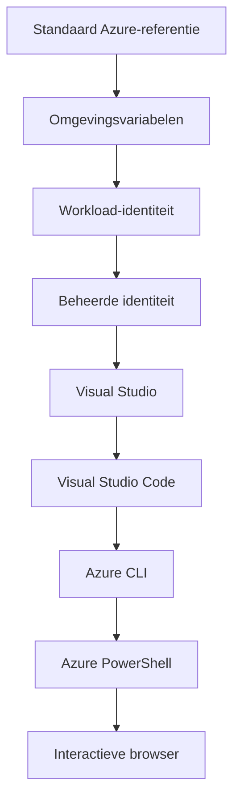

# AZD Basics - Begrip van Azure Developer CLI

# AZD Basics - Kernconcepten en Fundamenten

**Chapter Navigation:**
- **📚 Course Home**: [AZD For Beginners](../../README.md)
- **📖 Current Chapter**: Hoofdstuk 1 - Fundament & Quick Start
- **⬅️ Previous**: [Course Overview](../../README.md#-chapter-1-foundation--quick-start)
- **➡️ Next**: [Installation & Setup](installation.md)
- **🚀 Next Chapter**: [Chapter 2: AI-First Development](../chapter-02-ai-development/microsoft-foundry-integration.md)

## Inleiding

Deze les introduceert je in Azure Developer CLI (azd), een krachtig commandoregelhulpmiddel dat je traject van lokale ontwikkeling naar Azure-implementatie versnelt. Je leert de fundamentele concepten, kernfuncties en begrijpt hoe azd het uitrollen van cloud-native applicaties vereenvoudigt.

## Leerdoelen

Aan het einde van deze les kun je:
- Begrijpen wat Azure Developer CLI is en wat het primaire doel is
- De kernconcepten van templates, omgevingen en services uitleggen
- Belangrijke functies verkennen, waaronder templategestuurde ontwikkeling en Infrastructure as Code
- De azd-projectstructuur en workflow begrijpen
- Voorbereid zijn om azd te installeren en te configureren voor je ontwikkelomgeving

## Leerresultaten

Na het voltooien van deze les kun je:
- De rol van azd in moderne cloudontwikkelworkflows uitleggen
- De componenten van een azd-projectstructuur identificeren
- Beschrijven hoe templates, omgevingen en services samenwerken
- De voordelen van Infrastructure as Code met azd begrijpen
- Verschillende azd-commando's en hun doeleinden herkennen

## Wat is Azure Developer CLI (azd)?

Azure Developer CLI (azd) is een commandoregelhulpmiddel dat is ontworpen om je traject van lokale ontwikkeling naar Azure-implementatie te versnellen. Het vereenvoudigt het proces van bouwen, implementeren en beheren van cloud-native applicaties op Azure.

### Wat kun je met azd implementeren?

azd ondersteunt een breed scala aan workloads — en de lijst groeit door. Vandaag kun je met azd het volgende implementeren:

| Workload Type | Examples | Same Workflow? |
|---------------|----------|----------------|
| **Traditional applications** | Web apps, REST APIs, static sites | ✅ `azd up` |
| **Services and microservices** | Container Apps, Function Apps, multi-service backends | ✅ `azd up` |
| **AI-powered applications** | Chat apps with Microsoft Foundry Models, RAG solutions with AI Search | ✅ `azd up` |
| **Intelligent agents** | Foundry-hosted agents, multi-agent orchestrations | ✅ `azd up` |

De belangrijkste conclusie is dat **de azd-lifecycle hetzelfde blijft, ongeacht wat je implementeert**. Je initialiseert een project, voorziet infrastructuur, implementeert je code, monitort je app en ruimt op — of het nu een eenvoudige website of een geavanceerde AI-agent is.

Deze continuïteit is opzettelijk. azd behandelt AI-mogelijkheden als een andere soort service die je applicatie kan gebruiken, niet als iets fundamenteel anders. Een chat-endpoint dat wordt aangedreven door Microsoft Foundry Models is, vanuit het perspectief van azd, gewoon een andere service om te configureren en te implementeren.

### 🎯 Waarom AZD gebruiken? Een vergelijking uit de praktijk

Laten we het implementeren van een eenvoudige webapp met database vergelijken:

#### ❌ ZONDER AZD: Handmatige Azure-implementatie (30+ minuten)

```bash
# Stap 1: Maak resourcegroep
az group create --name myapp-rg --location eastus

# Stap 2: Maak App Service-plan
az appservice plan create --name myapp-plan \
  --resource-group myapp-rg \
  --sku B1 --is-linux

# Stap 3: Maak webapp
az webapp create --name myapp-web-unique123 \
  --resource-group myapp-rg \
  --plan myapp-plan \
  --runtime "NODE:18-lts"

# Stap 4: Maak Cosmos DB-account (10-15 minuten)
az cosmosdb create --name myapp-cosmos-unique123 \
  --resource-group myapp-rg \
  --kind MongoDB

# Stap 5: Maak database
az cosmosdb mongodb database create \
  --account-name myapp-cosmos-unique123 \
  --resource-group myapp-rg \
  --name tododb

# Stap 6: Maak collectie
az cosmosdb mongodb collection create \
  --account-name myapp-cosmos-unique123 \
  --resource-group myapp-rg \
  --database-name tododb \
  --name todos

# Stap 7: Haal verbindingsreeks op
CONN_STR=$(az cosmosdb keys list \
  --name myapp-cosmos-unique123 \
  --resource-group myapp-rg \
  --type connection-strings \
  --query "connectionStrings[0].connectionString" -o tsv)

# Stap 8: Configureer app-instellingen
az webapp config appsettings set \
  --name myapp-web-unique123 \
  --resource-group myapp-rg \
  --settings MONGODB_URI="$CONN_STR"

# Stap 9: Schakel logging in
az webapp log config --name myapp-web-unique123 \
  --resource-group myapp-rg \
  --application-logging filesystem \
  --detailed-error-messages true

# Stap 10: Stel Application Insights in
az monitor app-insights component create \
  --app myapp-insights \
  --location eastus \
  --resource-group myapp-rg

# Stap 11: Koppel App Insights aan webapp
INSTRUMENTATION_KEY=$(az monitor app-insights component show \
  --app myapp-insights \
  --resource-group myapp-rg \
  --query "instrumentationKey" -o tsv)

az webapp config appsettings set \
  --name myapp-web-unique123 \
  --resource-group myapp-rg \
  --settings APPINSIGHTS_INSTRUMENTATIONKEY="$INSTRUMENTATION_KEY"

# Stap 12: Bouw applicatie lokaal
npm install
npm run build

# Stap 13: Maak implementatiepakket
zip -r app.zip . -x "*.git*" "node_modules/*"

# Stap 14: Implementeer applicatie
az webapp deployment source config-zip \
  --resource-group myapp-rg \
  --name myapp-web-unique123 \
  --src app.zip

# Stap 15: Wacht en bid dat het werkt 🙏
# (Geen geautomatiseerde validatie, handmatig testen vereist)
```

**Problemen:**
- ❌ 15+ commando's om te onthouden en in de juiste volgorde uit te voeren
- ❌ 30-45 minuten handmatig werk
- ❌ Makkelijk om fouten te maken (typfouten, verkeerde parameters)
- ❌ Connectiestrings zichtbaar in terminalgeschiedenis
- ❌ Geen geautomatiseerde rollback als er iets misgaat
- ❌ Moeilijk te reproduceren voor teamleden
- ❌ Elke keer anders (niet reproduceerbaar)

#### ✅ MET AZD: Geautomatiseerde implementatie (5 commando's, 10-15 minuten)

```bash
# Stap 1: Initialiseren vanuit sjabloon
azd init --template todo-nodejs-mongo

# Stap 2: Authenticeren
azd auth login

# Stap 3: Omgeving aanmaken
azd env new dev

# Stap 4: Wijzigingen bekijken (optioneel maar aanbevolen)
azd provision --preview

# Stap 5: Alles implementeren
azd up

# ✨ Klaar! Alles is geïmplementeerd, geconfigureerd en bewaakt
```

**Voordelen:**
- ✅ **5 commando's** versus 15+ handmatige stappen
- ✅ **10-15 minuten** totale tijd (grotendeels wachten op Azure)
- ✅ **Minder handmatige fouten** - consistente, templategestuurde workflow
- ✅ **Veilige omgang met geheimen** - veel templates gebruiken door Azure beheerde geheimopslag
- ✅ **Herhaalbare implementaties** - dezelfde workflow elke keer
- ✅ **Volledig reproduceerbaar** - hetzelfde resultaat elke keer
- ✅ **Teamklaar** - iedereen kan met dezelfde commando's implementeren
- ✅ **Infrastructure as Code** - versiebeheer voor Bicep-templates
- ✅ **Ingebouwde monitoring** - Application Insights automatisch geconfigureerd

### 📊 Tijd- en foutreductie

| Metric | Manual Deployment | AZD Deployment | Improvement |
|:-------|:------------------|:---------------|:------------|
| **Commands** | 15+ | 5 | 67% fewer |
| **Time** | 30-45 min | 10-15 min | 60% faster |
| **Error Rate** | ~40% | <5% | 88% reduction |
| **Consistency** | Low (manual) | 100% (automated) | Perfect |
| **Team Onboarding** | 2-4 hours | 30 minutes | 75% faster |
| **Rollback Time** | 30+ min (manual) | 2 min (automated) | 93% faster |

## Kernconcepten

### Sjablonen
Sjablonen zijn de basis van azd. Ze bevatten:
- **Applicatiecode** - Je broncode en afhankelijkheden
- **Infrastructuurdefinities** - Azure-resources gedefinieerd in Bicep of Terraform
- **Configuratiebestanden** - Instellingen en omgevingsvariabelen
- **Implementatiescripts** - Geautomatiseerde implementatieworkflows

### Omgevingen
Omgevingen vertegenwoordigen verschillende implementatiedoelen:
- **Development** - Voor testen en ontwikkeling
- **Staging** - Pre-productieomgeving
- **Productie** - Live productieomgeving

Elke omgeving heeft zijn eigen:
- Azure-resourcegroep
- Configuratie-instellingen
- Implementatiestatus

### Diensten
Diensten zijn de bouwstenen van je applicatie:
- **Frontend** - Webapplicaties, SPA's
- **Backend** - API's, microservices
- **Database** - Dataopslagoplossingen
- **Storage** - Bestands- en blobopslag

## Belangrijkste functies

### 1. Templategestuurde ontwikkeling
```bash
# Beschikbare sjablonen bekijken
azd template list

# Initialiseren vanuit een sjabloon
azd init --template <template-name>
```

### 2. Infrastructuur als Code
- **Bicep** - Azure's domeinspecifieke taal
- **Terraform** - Multicloud infrastructuurtool
- **ARM Templates** - Azure Resource Manager-templates

### 3. Geïntegreerde workflows
```bash
# Volledige implementatieworkflow
azd up            # Provision + Deploy dit is volledig geautomatiseerd voor de eerste installatie

# 🧪 NIEUW: Bekijk infrastructuurwijzigingen vóór implementatie (VEILIG)
azd provision --preview    # Simuleer het implementeren van infrastructuur zonder wijzigingen door te voeren

azd provision     # Maak Azure-resources aan. Gebruik dit als je de infrastructuur bijwerkt
azd deploy        # Implementeer applicatiecode of implementeer opnieuw na een update
azd down          # Ruim resources op
```

#### 🛡️ Veilige infrastructuurplanning met preview
Het `azd provision --preview`-commando is een game-changer voor veilige implementaties:
- **Dry-run-analyse** - Toont wat gemaakt, gewijzigd of verwijderd zal worden
- **Nul risico** - Er worden geen daadwerkelijke wijzigingen aangebracht in je Azure-omgeving
- **Team samenwerking** - Deel previewresultaten vóór implementatie
- **Kostenraming** - Begrijp resourcekosten vóór inzet

```bash
# Voorbeeld preview-workflow
azd provision --preview           # Bekijk wat er zal veranderen
# Beoordeel de output, bespreek met het team
azd provision                     # Pas wijzigingen met vertrouwen toe
```

### 📊 Visueel: AZD-ontwikkelworkflow


**Workflowuitleg:**
1. **Init** - Begin met een template of nieuw project
2. **Auth** - Authenticeer bij Azure
3. **Environment** - Maak een geïsoleerde implementatieomgeving
4. **Preview** - 🆕 Bekijk infrastructuurwijzigingen altijd eerst met preview (veilige praktijk)
5. **Provision** - Maak/werk Azure-resources bij
6. **Deploy** - Push je applicatiecode
7. **Monitor** - Observeer applicatieprestaties
8. **Iterate** - Breng wijzigingen aan en implementeer de code opnieuw
9. **Cleanup** - Verwijder resources wanneer je klaar bent

### 4. Omgevingsbeheer
```bash
# Maak en beheer omgevingen
azd env new <environment-name>
azd env select <environment-name>
azd env list
```

### 5. Extensies en AI-commando's

azd gebruikt een extensiesysteem om mogelijkheden toe te voegen buiten de kern-CLI. Dit is vooral nuttig voor AI-workloads:

```bash
# Toon beschikbare extensies
azd extension list

# Installeer de Foundry agents-extensie
azd extension install azure.ai.agents

# Initialiseer een AI-agentproject op basis van een manifest
azd ai agent init -m agent-manifest.yaml

# Start de MCP-server voor AI-ondersteunde ontwikkeling (Alpha)
azd mcp start
```

> Extensies worden uitgebreid behandeld in [Hoofdstuk 2: AI-First Development](../chapter-02-ai-development/agents.md) en de referentie [AZD AI CLI Commands](../chapter-08-production/production-ai-practices.md#azd-ai-cli-commands-and-extensions).

## 📁 Projectstructuur

Een typische azd-projectstructuur:
```
my-app/
├── .azd/                    # azd configuration
│   └── config.json
├── .azure/                  # Azure deployment artifacts
├── .devcontainer/          # Development container config
├── .github/workflows/      # GitHub Actions
├── .vscode/               # VS Code settings
├── infra/                 # Infrastructure code
│   ├── main.bicep        # Main infrastructure template
│   ├── main.parameters.json
│   └── modules/          # Reusable modules
├── src/                  # Application source code
│   ├── api/             # Backend services
│   └── web/             # Frontend application
├── azure.yaml           # azd project configuration
└── README.md
```

## 🔧 Configuratiebestanden

### azure.yaml
Het belangrijkste projectconfiguratiebestand:
```yaml
name: my-awesome-app
metadata:
  template: my-template@1.0.0

services:
  web:
    project: ./src/web
    language: js
    host: appservice
  api:
    project: ./src/api
    language: js
    host: appservice

hooks:
  preprovision:
    shell: pwsh
    run: echo "Preparing to provision..."
```

### .azure/config.json
Omgeving-specifieke configuratie:
```json
{
  "version": 1,
  "defaultEnvironment": "dev",
  "environments": {
    "dev": {
      "subscriptionId": "your-subscription-id",
      "location": "eastus"
    }
  }
}
```

## 🎪 Veelvoorkomende workflows met praktijkoefeningen

> **💡 Leertip:** Volg deze oefeningen op volgorde om je AZD-vaardigheden geleidelijk op te bouwen.

### 🎯 Oefening 1: Initialiseer je eerste project

**Doel:** Maak een AZD-project en verken de structuur

**Stappen:**
```bash
# Gebruik een bewezen sjabloon
azd init --template todo-nodejs-mongo

# Verken de gegenereerde bestanden
ls -la  # Bekijk alle bestanden, inclusief verborgen bestanden

# Belangrijke aangemaakte bestanden:
# - azure.yaml (hoofdconfiguratie)
# - infra/ (infrastructuurcode)
# - src/ (applicatiecode)
```

**✅ Succes:** Je hebt azure.yaml, infra/, en src/ mappen

---

### 🎯 Oefening 2: Implementeer naar Azure

**Doel:** Voltooi end-to-end implementatie

**Stappen:**
```bash
# 1. Meld je aan
az login && azd auth login

# 2. Maak een omgeving aan
azd env new dev
azd env set AZURE_LOCATION eastus

# 3. Bekijk wijzigingen (AANBEVOLEN)
azd provision --preview

# 4. Rol alles uit
azd up

# 5. Controleer de uitrol
azd show    # Bekijk de URL van je app
```

**Verwachte tijd:** 10-15 minuten  
**✅ Succes:** Applicatie-URL opent in de browser

---

### 🎯 Oefening 3: Meerdere omgevingen

**Doel:** Implementeer naar dev en staging

**Stappen:**
```bash
# Als je al dev hebt, maak staging aan
azd env new staging
azd env set AZURE_LOCATION westus2
azd up

# Wissel tussen beide
azd env list
azd env select dev
```

**✅ Succes:** Twee afzonderlijke resourcegroepen in de Azure Portal

---

### 🛡️ Schoon begin: `azd down --force --purge`

Wanneer je volledig opnieuw wilt beginnen:

```bash
azd down --force --purge
```

**Wat het doet:**
- `--force`: Geen bevestigingsprompt
- `--purge`: Verwijdert alle lokale status en Azure-resources

**Gebruik wanneer:**
- Implementatie halverwege is mislukt
- Overstappen tussen projecten
- Je een frisse start nodig hebt

---

## 🎪 Originele workflowreferentie

### Starten van een nieuw project
```bash
# Methode 1: Gebruik bestaande sjabloon
azd init --template todo-nodejs-mongo

# Methode 2: Begin vanaf nul
azd init

# Methode 3: Gebruik huidige map
azd init .
```

### Ontwikkelcyclus
```bash
# Stel de ontwikkelomgeving in
azd auth login
azd env new dev
azd env select dev

# Implementeer alles
azd up

# Breng wijzigingen aan en implementeer opnieuw
azd deploy

# Ruim op wanneer je klaar bent
azd down --force --purge # Het commando in de Azure Developer CLI is een **harde reset** voor je omgeving—uiterst nuttig wanneer je mislukte implementaties oplost, verweesde resources opruimt, of je voorbereidt op een schone herimplementatie.
```

## Inzicht in `azd down --force --purge`
Het `azd down --force --purge`-commando is een krachtige manier om je azd-omgeving en alle bijbehorende resources volledig af te breken. Hieronder een uitsplitsing van wat elke vlag doet:
```
--force
```
- Slaat bevestigingsprompts over.
- Nuttig voor automatisering of scripting waar handmatige invoer niet mogelijk is.
- Zorgt ervoor dat de afbraak zonder onderbreking doorgaat, zelfs als de CLI inconsistenties detecteert.

```
--purge
```
Verwijdert **alle bijbehorende metadata**, inclusief:
Environment state
Local `.azure` folder
Cached deployment info
Voorkomt dat azd eerdere implementaties "onthoudt", wat problemen kan veroorzaken zoals niet-overeenkomende resourcegroepen of verouderde registrereferenties.


### Waarom beide gebruiken?
Wanneer je vastloopt met `azd up` door achtergebleven status of gedeeltelijke implementaties, zorgt deze combinatie voor een **schoon begin**.

Het is vooral handig na handmatige resourceverwijderingen in de Azure-portal of bij het wisselen van templates, omgevingen of naamgevingsconventies voor resourcegroepen.


### Beheren van meerdere omgevingen
```bash
# Maak stagingomgeving
azd env new staging
azd env select staging
azd up

# Schakel terug naar dev
azd env select dev

# Vergelijk omgevingen
azd env list
```

## 🔐 Authenticatie en referenties

Begrijpen van authenticatie is cruciaal voor succesvolle azd-implementaties. Azure gebruikt meerdere authenticatiemethoden, en azd maakt gebruik van dezelfde credentialketen als andere Azure-hulpmiddelen.

### Azure CLI-authenticatie (`az login`)

Voordat je azd gebruikt, moet je authenticeren bij Azure. De meest voorkomende methode is met de Azure CLI:

```bash
# Interactieve aanmelding (opent de browser)
az login

# Aanmelden met specifieke tenant
az login --tenant <tenant-id>

# Aanmelden met service-principal
az login --service-principal -u <app-id> -p <password> --tenant <tenant-id>

# Huidige aanmeldingsstatus controleren
az account show

# Beschikbare abonnementen weergeven
az account list --output table

# Stel standaardabonnement in
az account set --subscription <subscription-id>
```

### Authenticatiestroom
1. **Interactieve login**: Opent je standaardbrowser voor authenticatie
2. **Device Code Flow**: Voor omgevingen zonder browsertoegang
3. **Service Principal**: Voor automatisering en CI/CD-scenario's
4. **Managed Identity**: Voor op Azure gehoste applicaties

### DefaultAzureCredential-keten

`DefaultAzureCredential` is een type credential dat een vereenvoudigde authenticatie-ervaring biedt door automatisch meerdere credentialbronnen in een specifieke volgorde te proberen:

#### Volgorde van de credential-keten

#### 1. Omgevingsvariabelen
```bash
# Stel omgevingsvariabelen in voor de service-principal
export AZURE_CLIENT_ID="<app-id>"
export AZURE_CLIENT_SECRET="<password>"
export AZURE_TENANT_ID="<tenant-id>"
```

#### 2. Workload Identity (Kubernetes/GitHub Actions)
Wordt automatisch gebruikt in:
- Azure Kubernetes Service (AKS) met Workload Identity
- GitHub Actions met OIDC-federatie
- Andere gefedereerde identiteitscenario's

#### 3. Managed Identity
Voor Azure-resources zoals:
- Virtual Machines
- App Service
- Azure Functions
- Container Instances

```bash
# Controleren of het op een Azure-resource met een beheerde identiteit draait
az account show --query "user.type" --output tsv
# Geeft terug: "servicePrincipal" als er een beheerde identiteit wordt gebruikt
```

#### 4. Integratie met ontwikkeltools
- **Visual Studio**: Gebruikt automatisch het ingelogde account
- **VS Code**: Gebruikt de Azure Account-extensie-credentials
- **Azure CLI**: Gebruikt `az login`-credentials (meest gebruikt voor lokale ontwikkeling)

### AZD-authenticatieconfiguratie

```bash
# Methode 1: Gebruik Azure CLI (Aanbevolen voor ontwikkeling)
az login
azd auth login  # Gebruikt bestaande Azure CLI-referenties

# Methode 2: Directe azd-authenticatie
azd auth login --use-device-code  # Voor headless omgevingen

# Methode 3: Controleer de authenticatiestatus
azd auth login --check-status

# Methode 4: Uitloggen en opnieuw authenticeren
azd auth logout
azd auth login
```

### Beste praktijken voor authenticatie

#### Voor lokale ontwikkeling
```bash
# 1. Inloggen met Azure CLI
az login

# 2. Controleer of het juiste abonnement geselecteerd is
az account show
az account set --subscription "Your Subscription Name"

# 3. Gebruik azd met bestaande referenties
azd auth login
```

#### Voor CI/CD-pijplijnen
```yaml
# GitHub Actions example
- name: Azure Login
  uses: azure/login@v1
  with:
    creds: ${{ secrets.AZURE_CREDENTIALS }}

- name: Deploy with azd
  run: |
    azd auth login --client-id ${{ secrets.AZURE_CLIENT_ID }} \
                    --client-secret ${{ secrets.AZURE_CLIENT_SECRET }} \
                    --tenant-id ${{ secrets.AZURE_TENANT_ID }}
    azd up --no-prompt
```

#### Voor productieomgevingen
- Gebruik **Managed Identity** wanneer je op Azure-resources draait
- Gebruik **Service Principal** voor automatiseringsscenario's
- Vermijd het opslaan van referenties in code of configuratiebestanden
- Gebruik **Azure Key Vault** voor gevoelige configuratie

### Veelvoorkomende authenticatieproblemen en oplossingen

#### Probleem: "No subscription found"
```bash
# Oplossing: Stel het standaardabonnement in
az account list --output table
az account set --subscription "<subscription-id>"
azd env set AZURE_SUBSCRIPTION_ID "<subscription-id>"
```

#### Probleem: "Insufficient permissions"
```bash
# Oplossing: Controleer en wijs vereiste rollen toe
az role assignment list --assignee $(az account show --query user.name --output tsv)

# Veelvoorkomende vereiste rollen:
# - Contributor (voor resourcebeheer)
# - User Access Administrator (voor roltoewijzingen)
```

#### Probleem: "Token expired"
```bash
# Oplossing: Opnieuw authenticeren
az logout
az login
azd auth logout
azd auth login
```

### Authenticatie in verschillende scenario's

#### Lokale ontwikkeling
```bash
# Account voor persoonlijke ontwikkeling
az login
azd auth login
```

#### Teamontwikkeling
```bash
# Gebruik een specifieke tenant voor de organisatie
az login --tenant contoso.onmicrosoft.com
azd auth login
```

#### Multi-tenant-scenario's
```bash
# Wisselen tussen tenants
az login --tenant tenant1.onmicrosoft.com
# Uitrollen naar tenant 1
azd up

az login --tenant tenant2.onmicrosoft.com  
# Uitrollen naar tenant 2
azd up
```

### Beveiligingsoverwegingen
1. **Opslag van inloggegevens**: Bewaar nooit inloggegevens in broncode
2. **Beperking van scope**: Gebruik het principe van minste rechten voor service principals
3. **Tokenrotatie**: Roteer regelmatig de geheimen van service principals
4. **Auditlog**: Houd authenticatie- en implementatieactiviteiten bij
5. **Netwerkbeveiliging**: Gebruik waar mogelijk private endpoints

### Problemen met authenticatie oplossen

```bash
# Authenticatieproblemen debuggen
azd auth login --check-status
az account show
az account get-access-token

# Veelgebruikte diagnostische opdrachten
whoami                          # Huidige gebruikerscontext
az ad signed-in-user show      # Azure AD-gebruikersgegevens
az group list                  # Toegang tot resource testen
```

## Begrijpen van `azd down --force --purge`

### Ontdekking
```bash
azd template list              # Bladeren door sjablonen
azd template show <template>   # Sjabloondetails
azd init --help               # Initialisatie-opties
```

### Projectbeheer
```bash
azd show                     # Projectoverzicht
azd env list                # Beschikbare omgevingen en gekozen standaard
azd config show            # Configuratie-instellingen
```

### Monitoring
```bash
azd monitor                  # Open de monitoring in het Azure-portal
azd monitor --logs           # Bekijk applicatielogs
azd monitor --live           # Bekijk realtime statistieken
azd pipeline config          # Stel CI/CD in
```

## Beste praktijken

### 1. Gebruik betekenisvolle namen
```bash
# Goed
azd env new production-east
azd init --template web-app-secure

# Vermijd
azd env new env1
azd init --template template1
```

### 2. Maak gebruik van sjablonen
- Begin met bestaande sjablonen
- Pas aan naar uw behoeften
- Maak herbruikbare sjablonen voor uw organisatie

### 3. Isolatie van omgevingen
- Gebruik aparte omgevingen voor dev/staging/prod
- Implementeer nooit rechtstreeks naar productie vanaf een lokale machine
- Gebruik CI/CD-pijplijnen voor productie-implementaties

### 4. Configuratiebeheer
- Gebruik omgevingsvariabelen voor gevoelige gegevens
- Bewaar configuratie in versiebeheer
- Documenteer omgeving-specifieke instellingen

## Leertraject

### Beginner (Week 1-2)
1. Installeer azd en authenticeer
2. Implementeer een eenvoudig sjabloon
3. Begrijp de projectstructuur
4. Leer basiscommando's (up, down, deploy)

### Gevorderd (Week 3-4)
1. Pas sjablonen aan
2. Beheer meerdere omgevingen
3. Begrijp infrastructuurcode
4. Richt CI/CD-pijplijnen in

### Geavanceerd (Week 5+)
1. Maak aangepaste sjablonen
2. Geavanceerde infrastructuurpatronen
3. Implementaties naar meerdere regio's
4. Enterprise-grade configuraties

## Volgende stappen

**📖 Ga verder met Hoofdstuk 1:**
- [Installatie & Setup](installation.md) - Installeer azd en configureer het
- [Je Eerste Project](first-project.md) - Voltooi de hands-on tutorial
- [Configuratiegids](configuration.md) - Geavanceerde configuratie-opties

**🎯 Klaar voor het volgende hoofdstuk?**
- [Hoofdstuk 2: AI-First Development](../chapter-02-ai-development/microsoft-foundry-integration.md) - Begin met het bouwen van AI-toepassingen

## Aanvullende bronnen

- [Overzicht Azure Developer CLI](https://learn.microsoft.com/en-us/azure/developer/azure-developer-cli/)
- [Sjabloongalerij](https://azure.github.io/awesome-azd/)
- [Communityvoorbeelden](https://github.com/Azure-Samples)

---

## 🙋 Veelgestelde vragen

### Algemene vragen

**Vraag: Wat is het verschil tussen AZD en Azure CLI?**

A: Azure CLI (`az`) is voor het beheren van individuele Azure-resources. AZD (`azd`) is voor het beheren van volledige applicaties:

```bash
# Azure CLI - Laag-niveau resourcebeheer
az webapp create --name myapp --resource-group rg
az sql server create --name myserver --resource-group rg
# ...veel meer commando's nodig

# AZD - Beheer op applicatieniveau
azd up  # Implementeert de volledige app met alle resources
```

**Denk er zo over:**
- `az` = Werken met individuele Lego-blokjes
- `azd` = Werken met complete Lego-sets

---

**Vraag: Moet ik Bicep of Terraform kennen om AZD te gebruiken?**

A: Nee! Begin met sjablonen:
```bash
# Gebruik bestaand sjabloon - geen IaC-kennis nodig
azd init --template todo-nodejs-mongo
azd up
```

Je kunt later Bicep leren om de infrastructuur aan te passen. Sjablonen bieden werkende voorbeelden om van te leren.

---

**Vraag: Hoeveel kost het om AZD-sjablonen uit te voeren?**

A: Kosten verschillen per sjabloon. De meeste ontwikkelsjablonen kosten $50-150/maand:

```bash
# Bekijk de kosten voordat u uitrolt
azd provision --preview

# Ruim altijd op wanneer u het niet gebruikt
azd down --force --purge  # Verwijdert alle resources
```

**Pro tip:** Gebruik gratis tiers waar beschikbaar:
- App Service: F1 (gratis) tier
- Microsoft Foundry-modellen: Azure OpenAI 50.000 tokens/maand gratis
- Cosmos DB: 1000 RU/s gratis tier

---

**Vraag: Kan ik AZD gebruiken met bestaande Azure-resources?**

A: Ja, maar het is makkelijker om opnieuw te beginnen. AZD werkt het beste wanneer het de volledige levenscyclus beheert. Voor bestaande resources:

```bash
# Optie 1: Importeer bestaande resources (gevorderd)
azd init
# Wijzig vervolgens infra/ zodat het naar bestaande resources verwijst

# Optie 2: Begin opnieuw (aanbevolen)
azd init --template matching-your-stack
azd up  # Maakt een nieuwe omgeving aan
```

---

**Vraag: Hoe deel ik mijn project met teamgenoten?**

A: Commit het AZD-project naar Git (maar NIET de .azure-map):

```bash
# Staat al standaard in .gitignore
.azure/        # Bevat geheimen en omgevingsgegevens
*.env          # Omgevingsvariabelen

# Teamleden toen:
git clone <your-repo>
azd auth login
azd env new <their-name>-dev
azd up
```

Iedereen krijgt identieke infrastructuur vanuit dezelfde sjablonen.

---

### Vragen bij problemen

**Vraag: "azd up" is halverwege mislukt. Wat moet ik doen?**

A: Controleer de fout, los deze op en probeer het opnieuw:

```bash
# Bekijk gedetailleerde logs
azd show

# Veelvoorkomende oplossingen:

# 1. Als de quota is overschreden:
azd env set AZURE_LOCATION "westus2"  # Probeer een andere regio

# 2. Als er een naamconflict voor de resource is:
azd down --force --purge  # Schone lei
azd up  # Opnieuw proberen

# 3. Als de authenticatie is verlopen:
az login
azd auth login
azd up
```

**Meest voorkomende probleem:** Verkeerd Azure-abonnement geselecteerd
```bash
az account list --output table
az account set --subscription "<correct-subscription>"
```

---

**Vraag: Hoe implementeer ik alleen codewijzigingen zonder opnieuw te provisioneren?**

A: Gebruik `azd deploy` in plaats van `azd up`:

```bash
azd up          # Eerste keer: inrichten + uitrollen (traag)

# Breng codewijzigingen aan...

azd deploy      # Volgende keren: alleen uitrollen (snel)
```

Snelheidsvergelijking:
- `azd up`: 10-15 minuten (zet infrastructuur op)
- `azd deploy`: 2-5 minuten (alleen code)

---

**Vraag: Kan ik de infrastructuursjablonen aanpassen?**

A: Ja! Bewerk de Bicep-bestanden in `infra/`:

```bash
# Na azd init
cd infra/
code main.bicep  # Bewerk in VS Code

# Wijzigingen bekijken
azd provision --preview

# Wijzigingen toepassen
azd provision
```

**Tip:** Begin klein - verander eerst SKUs:
```bicep
// infra/main.bicep
sku: {
  name: 'B1'  // Change to 'P1V2' for production
}
```

---

**Vraag: Hoe verwijder ik alles dat AZD heeft aangemaakt?**

A: Eén commando verwijdert alle resources:

```bash
azd down --force --purge

# Dit verwijdert:
# - Alle Azure-resources
# - Resourcegroep
# - Lokale omgevingsstatus
# - Gecachte implementatiegegevens
```

**Voer dit altijd uit wanneer:**
- Klaar met het testen van een sjabloon
- Overschakelen naar een ander project
- Wil opnieuw beginnen

**Kostenbesparing:** Verwijderen van ongebruikte resources = $0 kosten

---

**Vraag: Wat als ik per ongeluk resources heb verwijderd in de Azure Portal?**

A: De AZD-status kan uit sync raken. Benader het met een schone start:
```bash
# 1. Verwijder lokale toestand
azd down --force --purge

# 2. Begin opnieuw
azd up

# Alternatief: Laat AZD detecteren en verhelpen
azd provision  # Zal ontbrekende resources aanmaken
```

---

### Geavanceerde vragen

**Vraag: Kan ik AZD gebruiken in CI/CD-pijplijnen?**

A: Ja! GitHub Actions-voorbeeld:
```yaml
# .github/workflows/deploy.yml
name: Deploy with AZD

on:
  push:
    branches: [main]

jobs:
  deploy:
    runs-on: ubuntu-latest
    steps:
      - uses: actions/checkout@v2
      
      - name: Install azd
        run: curl -fsSL https://aka.ms/install-azd.sh | bash
      
      - name: Azure Login
        run: |
          azd auth login \
            --client-id ${{ secrets.AZURE_CLIENT_ID }} \
            --client-secret ${{ secrets.AZURE_CLIENT_SECRET }} \
            --tenant-id ${{ secrets.AZURE_TENANT_ID }}
      
      - name: Deploy
        run: azd up --no-prompt
```

---

**Vraag: Hoe ga ik om met secrets en gevoelige gegevens?**

A: AZD integreert automatisch met Azure Key Vault:
```bash
# Geheimen worden opgeslagen in Key Vault, niet in de code
azd env set DATABASE_PASSWORD "$(openssl rand -base64 32)"

# AZD automatisch:
# 1. Maakt een Key Vault aan
# 2. Slaat het geheim op
# 3. Geeft de app toegang via Beheerde identiteit
# 4. Injecteert tijdens runtime
```

**Nooit committen:**
- `.azure/` map (bevat omgevingsgegevens)
- `.env` bestanden (lokale geheimen)
- Verbindingsreeksen

---

**Vraag: Kan ik naar meerdere regio's implementeren?**

A: Ja, maak per regio een omgeving aan:
```bash
# Oost-VS-omgeving
azd env new prod-eastus
azd env set AZURE_LOCATION eastus
azd up

# West-Europese omgeving
azd env new prod-westeurope
azd env set AZURE_LOCATION westeurope
azd up

# Elke omgeving is onafhankelijk
azd env list
```

Voor echte multi-regio-apps, pas de Bicep-sjablonen aan om gelijktijdig naar meerdere regio's te implementeren.

---

**Vraag: Waar kan ik hulp krijgen als ik vastloop?**

1. **AZD-documentatie:** https://learn.microsoft.com/azure/developer/azure-developer-cli/
2. **GitHub Issues:** https://github.com/Azure/azure-dev/issues
3. **Discord:** [Azure Discord](https://discord.gg/microsoft-azure) - #azure-developer-cli kanaal
4. **Stack Overflow:** Tag `azure-developer-cli`
5. **Deze cursus:** [Probleemoplossingsgids](../chapter-07-troubleshooting/common-issues.md)

**Pro tip:** Voordat je vraagt, voer uit:
```bash
azd show       # Toont de huidige status
azd version    # Toont jouw versie
```
Voeg deze informatie toe aan je vraag voor snellere hulp.

---

## 🎓 Wat nu?

Je begrijpt nu de AZD-principes. Kies je pad:

### 🎯 Voor beginners:
1. **Volgende:** [Installatie & Setup](installation.md) - Installeer AZD op je machine
2. **Vervolgens:** [Je Eerste Project](first-project.md) - Implementeer je eerste app
3. **Oefen:** Voltooi alle 3 oefeningen in deze les

### 🚀 Voor AI-ontwikkelaars:
1. **Sla over naar:** [Hoofdstuk 2: AI-First Development](../chapter-02-ai-development/microsoft-foundry-integration.md)
2. **Implementeer:** Begin met `azd init --template get-started-with-ai-chat`
3. **Leer:** Bouw terwijl je implementeert

### 🏗️ Voor ervaren ontwikkelaars:
1. **Bekijk:** [Configuratiegids](configuration.md) - Geavanceerde instellingen
2. **Verken:** [Infrastructure as Code](../chapter-04-infrastructure/provisioning.md) - Diepgaande Bicep-uitleg
3. **Bouw:** Maak aangepaste sjablonen voor je stack

---

**Hoofdstuknavigatie:**
- **📚 Cursus Startpagina**: [AZD voor beginners](../../README.md)
- **📖 Huidig hoofdstuk**: Hoofdstuk 1 - Fundament & Snelle start  
- **⬅️ Vorige**: [Cursusoverzicht](../../README.md#-chapter-1-foundation--quick-start)
- **➡️ Volgende**: [Installatie & Setup](installation.md)
- **🚀 Volgend hoofdstuk**: [Hoofdstuk 2: AI-First Development](../chapter-02-ai-development/microsoft-foundry-integration.md)

---

<!-- CO-OP TRANSLATOR DISCLAIMER START -->
**Disclaimer**:
Dit document is vertaald met behulp van de AI-vertalingsdienst [Co-op Translator](https://github.com/Azure/co-op-translator). Hoewel we streven naar nauwkeurigheid, houd er rekening mee dat automatische vertalingen fouten of onnauwkeurigheden kunnen bevatten. Het originele document in de oorspronkelijke taal moet als gezaghebbende bron worden beschouwd. Voor kritieke informatie wordt een professionele menselijke vertaling aanbevolen. Wij zijn niet aansprakelijk voor eventuele misverstanden of verkeerde interpretaties die voortvloeien uit het gebruik van deze vertaling.
<!-- CO-OP TRANSLATOR DISCLAIMER END -->