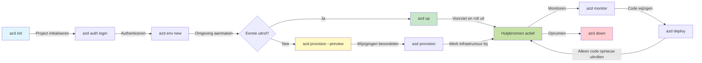
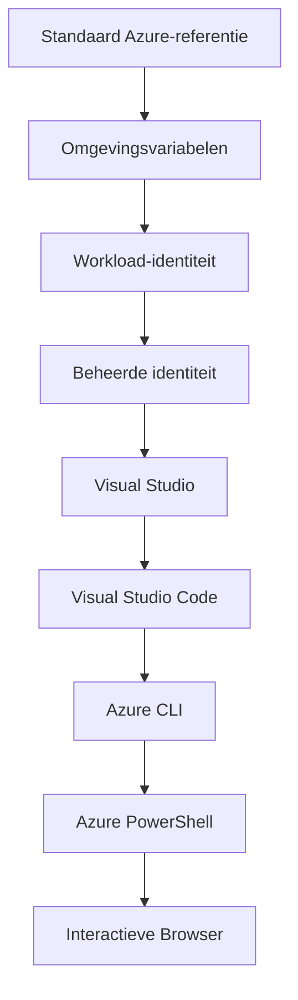

# AZD Basics - Azure Developer CLI begrijpen

# AZD Basics - Kernconcepten en Basisprincipes

**Hoofdstuknavigatie:**
- **📚 Cursus Startpagina**: [AZD voor Beginners](../../README.md)
- **📖 Huidig hoofdstuk**: Hoofdstuk 1 - Basis & Snelle start
- **⬅️ Vorige**: [Cursusoverzicht](../../README.md#-chapter-1-foundation--quick-start)
- **➡️ Volgende**: [Installatie & Configuratie](installation.md)
- **🚀 Volgend Hoofdstuk**: [Hoofdstuk 2: AI-First ontwikkeling](../chapter-02-ai-development/microsoft-foundry-integration.md)

## Introductie

Deze les introduceert je in Azure Developer CLI (azd), een krachtig commandoregelhulpmiddel dat je traject van lokale ontwikkeling naar Azure-implementatie versnelt. Je leert de fundamentele concepten, kernfuncties en begrijpt hoe azd het deployen van cloud-native applicaties vereenvoudigt.

## Leerdoelen

Aan het einde van deze les zul je:
- Begrijpen wat Azure Developer CLI is en wat het hoofddoel is
- De kernconcepten van templates, omgevingen en services leren
- Belangrijke functies verkennen waaronder template-gedreven ontwikkeling en Infrastructure as Code
- Het azd-projectstructuur en de workflow begrijpen
- Klaar zijn om azd te installeren en configureren voor je ontwikkelomgeving

## Leerresultaten

Na het voltooien van deze les kun je:
- De rol van azd in moderne cloudontwikkelingsworkflows uitleggen
- De componenten van een azd-projectstructuur identificeren
- Beschrijven hoe templates, omgevingen en services samenwerken
- De voordelen van Infrastructure as Code met azd begrijpen
- Verschillende azd-commando's herkennen en hun doelen

## Wat is Azure Developer CLI (azd)?

Azure Developer CLI (azd) is een commandoregelhulpmiddel dat is ontworpen om je traject van lokale ontwikkeling naar Azure-implementatie te versnellen. Het vereenvoudigt het proces van het bouwen, implementeren en beheren van cloud-native applicaties op Azure.

### Wat kun je met azd implementeren?

azd ondersteunt een breed scala aan workloads — en de lijst groeit nog steeds. Vandaag kun je azd gebruiken om te implementeren:

| Workloadtype | Voorbeelden | Zelfde workflow? |
|---------------|----------|----------------|
| **Traditionele applicaties** | Web-apps, REST-API's, statische sites | ✅ `azd up` |
| **Services en microservices** | Container Apps, Function Apps, backends met meerdere services | ✅ `azd up` |
| **AI-aangedreven applicaties** | Chat-apps met Microsoft Foundry-modellen, RAG-oplossingen met AI Search | ✅ `azd up` |
| **Intelligente agents** | In Foundry gehoste agents, multi-agent orkestraties | ✅ `azd up` |

De kerninzichten is dat **de azd-levenscyclus hetzelfde blijft, ongeacht wat je implementeert**. Je initialiseert een project, voorziet infrastructuur, implementeert je code, monitort je app en ruimt op — of het nu een eenvoudige website of een geavanceerde AI-agent is.

Deze continuïteit is opzettelijk. azd behandelt AI-mogelijkheden als een andere soort service die je applicatie kan gebruiken, niet als iets fundamenteel anders. Een chatendpoint ondersteund door Microsoft Foundry-modellen is, vanuit azd's perspectief, gewoon een andere service om te configureren en te implementeren.

### 🎯 Waarom AZD gebruiken? Een praktijkvergelijking

Laten we het implementeren van een eenvoudige webapp met database vergelijken:

#### ❌ ZONDER AZD: Handmatige Azure-implementatie (30+ minuten)

```bash
# Stap 1: Maak resourcegroep
az group create --name myapp-rg --location eastus

# Stap 2: Maak App Service-plan
az appservice plan create --name myapp-plan \
  --resource-group myapp-rg \
  --sku B1 --is-linux

# Stap 3: Maak Web App
az webapp create --name myapp-web-unique123 \
  --resource-group myapp-rg \
  --plan myapp-plan \
  --runtime "NODE:18-lts"

# Stap 4: Maak Cosmos DB-account (10-15 minuten)
az cosmosdb create --name myapp-cosmos-unique123 \
  --resource-group myapp-rg \
  --kind MongoDB

# Stap 5: Maak database
az cosmosdb mongodb database create \
  --account-name myapp-cosmos-unique123 \
  --resource-group myapp-rg \
  --name tododb

# Stap 6: Maak collectie
az cosmosdb mongodb collection create \
  --account-name myapp-cosmos-unique123 \
  --resource-group myapp-rg \
  --database-name tododb \
  --name todos

# Stap 7: Haal verbindingsreeks op
CONN_STR=$(az cosmosdb keys list \
  --name myapp-cosmos-unique123 \
  --resource-group myapp-rg \
  --type connection-strings \
  --query "connectionStrings[0].connectionString" -o tsv)

# Stap 8: Configureer app-instellingen
az webapp config appsettings set \
  --name myapp-web-unique123 \
  --resource-group myapp-rg \
  --settings MONGODB_URI="$CONN_STR"

# Stap 9: Schakel logging in
az webapp log config --name myapp-web-unique123 \
  --resource-group myapp-rg \
  --application-logging filesystem \
  --detailed-error-messages true

# Stap 10: Stel Application Insights in
az monitor app-insights component create \
  --app myapp-insights \
  --location eastus \
  --resource-group myapp-rg

# Stap 11: Koppel App Insights aan Web App
INSTRUMENTATION_KEY=$(az monitor app-insights component show \
  --app myapp-insights \
  --resource-group myapp-rg \
  --query "instrumentationKey" -o tsv)

az webapp config appsettings set \
  --name myapp-web-unique123 \
  --resource-group myapp-rg \
  --settings APPINSIGHTS_INSTRUMENTATIONKEY="$INSTRUMENTATION_KEY"

# Stap 12: Bouw applicatie lokaal
npm install
npm run build

# Stap 13: Maak implementatiepakket
zip -r app.zip . -x "*.git*" "node_modules/*"

# Stap 14: Implementeer applicatie
az webapp deployment source config-zip \
  --resource-group myapp-rg \
  --name myapp-web-unique123 \
  --src app.zip

# Stap 15: Wacht en bid dat het werkt 🙏
# (Geen geautomatiseerde validatie, handmatige tests vereist)
```

**Problemen:**
- ❌ 15+ commando's om te onthouden en in de juiste volgorde uit te voeren
- ❌ 30-45 minuten handmatig werk
- ❌ Makkelijk fouten te maken (typefouten, verkeerde parameters)
- ❌ Verbindingsstrings zichtbaar in terminalgeschiedenis
- ❌ Geen automatische rollback als er iets misgaat
- ❌ Moeilijk te reproduceren voor teamleden
- ❌ Elke keer anders (niet reproduceerbaar)

#### ✅ MET AZD: Geautomatiseerde implementatie (5 commando's, 10-15 minuten)

```bash
# Stap 1: Initialiseren vanaf sjabloon
azd init --template todo-nodejs-mongo

# Stap 2: Authenticeren
azd auth login

# Stap 3: Omgeving aanmaken
azd env new dev

# Stap 4: Wijzigingen bekijken (optioneel maar aanbevolen)
azd provision --preview

# Stap 5: Alles uitrollen
azd up

# ✨ Klaar! Alles is uitgerold, geconfigureerd en bewaakt
```

**Voordelen:**
- ✅ **5 commando's** vs. 15+ handmatige stappen
- ✅ **10-15 minuten** totale tijd (voornamelijk wachten op Azure)
- ✅ **Geen fouten** - geautomatiseerd en getest
- ✅ **Geheimen veilig beheerd** via Key Vault
- ✅ **Automatische rollback** bij fouten
- ✅ **Volledig reproduceerbaar** - elke keer hetzelfde resultaat
- ✅ **Klaar voor teams** - iedereen kan deployen met dezelfde commando's
- ✅ **Infrastructure as Code** - versiebeheerde Bicep-templates
- ✅ **Ingebouwde monitoring** - Application Insights automatisch geconfigureerd

### 📊 Tijds- en foutreductie

| Meting | Handmatige implementatie | AZD-implementatie | Verbetering |
|:-------|:------------------|:---------------|:------------|
| **Commando's** | 15+ | 5 | 67% minder |
| **Tijd** | 30-45 min | 10-15 min | 60% sneller |
| **Foutpercentage** | ~40% | <5% | 88% vermindering |
| **Consistentie** | Laag (handmatig) | 100% (geautomatiseerd) | Perfect |
| **Team Onboarding** | 2-4 uur | 30 minuten | 75% sneller |
| **Rollback-tijd** | 30+ min (handmatig) | 2 min (geautomatiseerd) | 93% sneller |

## Kernconcepten

### Sjablonen
Sjablonen vormen de basis van azd. Ze bevatten:
- **Applicatiecode** - Je broncode en afhankelijkheden
- **Infrastructuurdefinities** - Azure-resources gedefinieerd in Bicep of Terraform
- **Configuratiebestanden** - Instellingen en omgevingsvariabelen
- **Implementatiescripts** - Geautomatiseerde implementatieworkflows

### Omgevingen
Omgevingen vertegenwoordigen verschillende implementatiedoelomgevingen:
- **Ontwikkeling** - Voor testen en ontwikkeling
- **Staging** - Pre-productieomgeving
- **Productie** - Live productieomgeving

Elke omgeving onderhoudt zijn eigen:
- Azure-resourcegroep
- Configuratie-instellingen
- Implementatiestatus

### Services
Services zijn de bouwstenen van je applicatie:
- **Frontend** - Webapplicaties, SPAs
- **Backend** - API's, microservices
- **Database** - Oplossingen voor gegevensopslag
- **Opslag** - Bestand- en blobopslag

## Belangrijkste functies

### 1. Template-gedreven ontwikkeling
```bash
# Blader door beschikbare sjablonen
azd template list

# Initialiseren vanuit een sjabloon
azd init --template <template-name>
```

### 2. Infrastructuur als Code
- **Bicep** - Azure's domeinspecifieke taal
- **Terraform** - Multi-cloud infrastructuurtool
- **ARM-templates** - Azure Resource Manager-templates

### 3. Geïntegreerde workflows
```bash
# Volledige deployment-workflow
azd up            # Provision + Deploy dit is zonder handmatige tussenkomst voor de eerste configuratie

# 🧪 NIEUW: Bekijk infrastructuurwijzigingen vóór implementatie (VEILIG)
azd provision --preview    # Simuleer infrastructuurimplementatie zonder wijzigingen aan te brengen

azd provision     # Maak Azure-resources aan. Gebruik dit als je de infrastructuur bijwerkt
azd deploy        # Implementeer applicatiecode of implementeer de applicatiecode opnieuw nadat je een update hebt uitgevoerd
azd down          # Ruim resources op
```

#### 🛡️ Veilige infrastructuurplanning met Preview
Het `azd provision --preview`-commando is een game-changer voor veilige implementaties:
- **Dry-run-analyse** - Geeft weer wat aangemaakt, gewijzigd of verwijderd zal worden
- **Geen risico** - Er worden geen daadwerkelijke wijzigingen in je Azure-omgeving aangebracht
- **Team samenwerking** - Deel previewresultaten vóór implementatie
- **Kostenschatting** - Begrijp resourcekosten vóór toewijzing

```bash
# Voorbeeld van een voorvertoning-workflow
azd provision --preview           # Bekijk wat er zal veranderen
# Beoordeel de uitvoer, bespreek met het team
azd provision                     # Voer wijzigingen met vertrouwen door
```

### 📊 Visueel: AZD-ontwikkelworkflow


**Workflow Uitleg:**
1. **Init** - Begin met een sjabloon of nieuw project
2. **Auth** - Authenticeer bij Azure
3. **Environment** - Maak een geïsoleerde implementatieomgeving
4. **Preview** - 🆕 Bekijk altijd eerst de infrastructuurwijzigingen (veilige werkwijze)
5. **Provision** - Maak/werk Azure-resources bij
6. **Deploy** - Push je applicatiecode
7. **Monitor** - Observeer applicatieprestaties
8. **Iterate** - Breng wijzigingen aan en deploy de code opnieuw
9. **Cleanup** - Verwijder resources wanneer klaar

### 4. Omgevingsbeheer
```bash
# Maak en beheer omgevingen
azd env new <environment-name>
azd env select <environment-name>
azd env list
```

### 5. Extensies en AI-commando's

azd gebruikt een extensiesysteem om mogelijkheden toe te voegen buiten de kern-CLI. Dit is vooral nuttig voor AI-workloads:

```bash
# Beschikbare extensies weergeven
azd extension list

# Installeer de Foundry-agents-extensie
azd extension install azure.ai.agents

# Initialiseer een AI-agentproject vanuit een manifest
azd ai agent init -m agent-manifest.yaml

# Start de MCP-server voor AI-ondersteunde ontwikkeling (Alpha)
azd mcp start
```

> Extensies worden in detail behandeld in [Hoofdstuk 2: AI-First ontwikkeling](../chapter-02-ai-development/agents.md) en de referentie [AZD AI CLI-commando's](../chapter-08-production/production-ai-practices.md#azd-ai-cli-commands-and-extensions).

## 📁 Projectstructuur

Een typische azd-projectstructuur:
```
my-app/
├── .azd/                    # azd configuration
│   └── config.json
├── .azure/                  # Azure deployment artifacts
├── .devcontainer/          # Development container config
├── .github/workflows/      # GitHub Actions
├── .vscode/               # VS Code settings
├── infra/                 # Infrastructure code
│   ├── main.bicep        # Main infrastructure template
│   ├── main.parameters.json
│   └── modules/          # Reusable modules
├── src/                  # Application source code
│   ├── api/             # Backend services
│   └── web/             # Frontend application
├── azure.yaml           # azd project configuration
└── README.md
```

## 🔧 Configuratiebestanden

### azure.yaml
Het belangrijkste projectconfiguratiebestand:
```yaml
name: my-awesome-app
metadata:
  template: my-template@1.0.0

services:
  web:
    project: ./src/web
    language: js
    host: appservice
  api:
    project: ./src/api
    language: js
    host: appservice

hooks:
  preprovision:
    shell: pwsh
    run: echo "Preparing to provision..."
```

### .azure/config.json
Omgevingsspecifieke configuratie:
```json
{
  "version": 1,
  "defaultEnvironment": "dev",
  "environments": {
    "dev": {
      "subscriptionId": "your-subscription-id",
      "location": "eastus"
    }
  }
}
```

## 🎪 Veelvoorkomende workflows met praktijkoefeningen

> **💡 Leertip:** Volg deze oefeningen op volgorde om je AZD-vaardigheden geleidelijk op te bouwen.

### 🎯 Oefening 1: Initialiseer je eerste project

**Doel:** Maak een AZD-project en verken de structuur

**Stappen:**
```bash
# Gebruik een bewezen sjabloon
azd init --template todo-nodejs-mongo

# Verken de gegenereerde bestanden
ls -la  # Bekijk alle bestanden, inclusief verborgen bestanden

# Belangrijke aangemaakte bestanden:
# - azure.yaml (hoofdconfiguratie)
# - infra/ (infrastructuurcode)
# - src/ (applicatiecode)
```

**✅ Succes:** Je hebt azure.yaml, infra/, en src/ mappen

---

### 🎯 Oefening 2: Deployen naar Azure

**Doel:** Volledige end-to-end implementatie

**Stappen:**
```bash
# 1. Meld je aan
az login && azd auth login

# 2. Maak een omgeving aan
azd env new dev
azd env set AZURE_LOCATION eastus

# 3. Wijzigingen bekijken (AANBEVOLEN)
azd provision --preview

# 4. Rol alles uit
azd up

# 5. Controleer de uitrol
azd show    # Bekijk de URL van je app
```

**Verwachte tijd:** 10-15 minuten  
**✅ Succes:** Applicatie-URL opent in browser

---

### 🎯 Oefening 3: Meerdere omgevingen

**Doel:** Deployen naar dev en staging

**Stappen:**
```bash
# Heb al dev, maak staging aan
azd env new staging
azd env set AZURE_LOCATION westus2
azd up

# Schakel tussen beide
azd env list
azd env select dev
```

**✅ Succes:** Twee aparte resourcegroepen in de Azure Portal

---

### 🛡️ Schone lei: `azd down --force --purge`

Wanneer je volledig wilt resetten:

```bash
azd down --force --purge
```

**Wat het doet:**
- `--force`: Geen bevestigingsprompts
- `--purge`: Verwijdert alle lokale staat en Azure-resources

**Gebruik wanneer:**
- Implementatie halverwege mislukt
- Wisselen van projecten
- Nodig voor een nieuwe start

---

## 🎪 Originele workflowreferentie

### Een nieuw project starten
```bash
# Methode 1: Gebruik bestaand sjabloon
azd init --template todo-nodejs-mongo

# Methode 2: Begin vanaf nul
azd init

# Methode 3: Gebruik huidige map
azd init .
```

### Ontwikkelcyclus
```bash
# Ontwikkelomgeving opzetten
azd auth login
azd env new dev
azd env select dev

# Alles implementeren
azd up

# Breng wijzigingen aan en implementeer opnieuw
azd deploy

# Opruimen wanneer klaar
azd down --force --purge # commando in de Azure Developer CLI is een **harde reset** voor je omgeving—uiterst handig wanneer je mislukte implementaties oplost, verweesde resources opruimt of je voorbereidt op een schone heruitrol.
```

## Begrijpen van `azd down --force --purge`
Het `azd down --force --purge`-commando is een krachtig middel om je azd-omgeving en alle bijbehorende resources volledig af te breken. Hier is een overzicht van wat elke vlag doet:
```
--force
```
- Slaat bevestigingsprompts over.
- Handig voor automatisering of scripting waar handmatige input niet mogelijk is.
- Zorgt dat de teardown zonder onderbreking doorgaat, zelfs als de CLI inconsistenties detecteert.

```
--purge
```
Verwijdert **alle bijbehorende metadata**, inclusief:
Omgevingsstatus
Lokale `.azure` map
Gecachte implementatiegegevens
Voorkomt dat azd eerdere implementaties "onthoudt", wat problemen kan veroorzaken zoals niet-overeenkomende resourcegroepen of verouderde registry-verwijzingen.


### Waarom beide gebruiken?
Wanneer je vastloopt met `azd up` door achtergebleven staat of gedeeltelijke implementaties, zorgt deze combinatie voor een **schone lei**.

Het is vooral nuttig na handmatige verwijderingen van resources in de Azure-portal of bij het wisselen van templates, omgevingen of naamgevingsconventies van resourcegroepen.


### Meerdere omgevingen beheren
```bash
# Maak een staging-omgeving
azd env new staging
azd env select staging
azd up

# Schakel terug naar ontwikkelomgeving
azd env select dev

# Vergelijk omgevingen
azd env list
```

## 🔐 Authenticatie en referenties

Begrijpen van authenticatie is cruciaal voor succesvolle azd-implementaties. Azure gebruikt meerdere authenticatiemethoden, en azd maakt gebruik van dezelfde credential-keten die door andere Azure-tools wordt gebruikt.

### Azure CLI-authenticatie (`az login`)

Voordat je azd gebruikt, moet je authenticeren bij Azure. De meest voorkomende methode is het gebruik van Azure CLI:

```bash
# Interactieve aanmelding (opent browser)
az login

# Inloggen met specifieke tenant
az login --tenant <tenant-id>

# Inloggen met service-principal
az login --service-principal -u <app-id> -p <password> --tenant <tenant-id>

# Controleer huidige aanmeldingsstatus
az account show

# Toon beschikbare abonnementen
az account list --output table

# Stel standaardabonnement in
az account set --subscription <subscription-id>
```

### Authenticatiestroom
1. **Interactive Login**: Opent je standaardbrowser voor authenticatie
2. **Device Code Flow**: Voor omgevingen zonder browsertoegang
3. **Service Principal**: Voor automatiserings- en CI/CD-scenario's
4. **Managed Identity**: Voor op Azure gehoste applicaties

### DefaultAzureCredential-keten

`DefaultAzureCredential` is een credentialtype dat een vereenvoudigde authenticatie-ervaring biedt door automatisch meerdere credential-bronnen in een specifieke volgorde te proberen:

#### Volgorde van de credential-keten

#### 1. Omgevingsvariabelen
```bash
# Stel omgevingsvariabelen in voor de service-principal
export AZURE_CLIENT_ID="<app-id>"
export AZURE_CLIENT_SECRET="<password>"
export AZURE_TENANT_ID="<tenant-id>"
```

#### 2. Workload Identity (Kubernetes/GitHub Actions)
Gebruikt automatisch in:
- Azure Kubernetes Service (AKS) met Workload Identity
- GitHub Actions met OIDC-federatie
- Andere gefedereerde identity-scenario's

#### 3. Managed Identity
Voor Azure-resources zoals:
- Virtuele Machines
- App Service
- Azure Functions
- Container Instances

```bash
# Controleer of het draait op een Azure-resource met een beheerde identiteit
az account show --query "user.type" --output tsv
# Geeft "servicePrincipal" terug als er een beheerde identiteit wordt gebruikt
```

#### 4. Integratie met ontwikkeltools
- **Visual Studio**: Gebruikt automatisch het aangemelde account
- **VS Code**: Gebruikt de referenties van de Azure Account-extensie
- **Azure CLI**: Gebruikt `az login`-referenties (meest gebruikelijk voor lokale ontwikkeling)

### AZD-authenticatie-instellingen

```bash
# Methode 1: Gebruik Azure CLI (Aanbevolen voor ontwikkeling)
az login
azd auth login  # Gebruikt bestaande Azure CLI-referenties

# Methode 2: Directe azd-authenticatie
azd auth login --use-device-code  # Voor headless-omgevingen

# Methode 3: Controleer de authenticatiestatus
azd auth login --check-status

# Methode 4: Uitloggen en opnieuw authenticeren
azd auth logout
azd auth login
```

### Beste praktijken voor authenticatie

#### Voor lokale ontwikkeling
```bash
# 1. Inloggen met Azure CLI
az login

# 2. Controleer het juiste abonnement
az account show
az account set --subscription "Your Subscription Name"

# 3. Gebruik azd met bestaande inloggegevens
azd auth login
```

#### Voor CI/CD-pijplijnen
```yaml
# GitHub Actions example
- name: Azure Login
  uses: azure/login@v1
  with:
    creds: ${{ secrets.AZURE_CREDENTIALS }}

- name: Deploy with azd
  run: |
    azd auth login --client-id ${{ secrets.AZURE_CLIENT_ID }} \
                    --client-secret ${{ secrets.AZURE_CLIENT_SECRET }} \
                    --tenant-id ${{ secrets.AZURE_TENANT_ID }}
    azd up --no-prompt
```

#### Voor productieomgevingen
- Gebruik **Managed Identity** bij uitvoering op Azure-resources
- Gebruik **Service Principal** voor automatiseringsscenario's
- Vermijd het opslaan van referenties in code of configuratiebestanden
- Gebruik **Azure Key Vault** voor gevoelige configuratie

### Veelvoorkomende authenticatieproblemen en oplossingen

#### Probleem: "Geen abonnement gevonden"
```bash
# Oplossing: Standaardabonnement instellen
az account list --output table
az account set --subscription "<subscription-id>"
azd env set AZURE_SUBSCRIPTION_ID "<subscription-id>"
```

#### Probleem: "Onvoldoende machtigingen"
```bash
# Oplossing: Controleer en wijs de vereiste rollen toe
az role assignment list --assignee $(az account show --query user.name --output tsv)

# Veelvoorkomende vereiste rollen:
# - Contributor (voor resourcebeheer)
# - User Access Administrator (voor het toewijzen van rollen)
```

#### Probleem: "Token verlopen"
```bash
# Oplossing: Opnieuw authenticeren
az logout
az login
azd auth logout
azd auth login
```

### Authenticatie in verschillende scenario's

#### Lokale ontwikkeling
```bash
# Account voor persoonlijke ontwikkeling
az login
azd auth login
```

#### Teamontwikkeling
```bash
# Gebruik een specifieke tenant voor de organisatie
az login --tenant contoso.onmicrosoft.com
azd auth login
```

#### Multi-tenant scenario's
```bash
# Schakel tussen tenants
az login --tenant tenant1.onmicrosoft.com
# Deploy naar tenant 1
azd up

az login --tenant tenant2.onmicrosoft.com  
# Deploy naar tenant 2
azd up
```

### Beveiligingsoverwegingen
1. **Credential Storage**: Sla nooit referenties in broncode op
2. **Scope Limitation**: Gebruik het principe van minste privileges voor service principals
3. **Token Rotation**: Draai regelmatig de geheimen van service principals
4. **Audit Trail**: Controleer authenticatie- en implementatieactiviteiten
5. **Network Security**: Gebruik waar mogelijk privé-eindpunten

### Probleemoplossing bij authenticatie

```bash
# Authenticatieproblemen debuggen
azd auth login --check-status
az account show
az account get-access-token

# Veelvoorkomende diagnostische opdrachten
whoami                          # Huidige gebruikerscontext
az ad signed-in-user show      # Azure AD-gebruikersgegevens
az group list                  # Toegang tot resource testen
```

## Begrijpen van `azd down --force --purge`

### Ontdekking
```bash
azd template list              # Bladeren door sjablonen
azd template show <template>   # Sjabloondetails
azd init --help               # Initialisatieopties
```

### Projectbeheer
```bash
azd show                     # Projectoverzicht
azd env show                 # Huidige omgeving
azd config list             # Configuratie-instellingen
```

### Monitoring
```bash
azd monitor                  # Open monitoring in het Azure-portal
azd monitor --logs           # Bekijk applicatielogs
azd monitor --live           # Bekijk realtime-statistieken
azd pipeline config          # Stel CI/CD in
```

## Beste praktijken

### 1. Gebruik betekenisvolle namen
```bash
# Goed
azd env new production-east
azd init --template web-app-secure

# Vermijd
azd env new env1
azd init --template template1
```

### 2. Maak gebruik van sjablonen
- Begin met bestaande sjablonen
- Pas aan voor jouw behoeften
- Maak herbruikbare sjablonen voor je organisatie

### 3. Omgevingsisolatie
- Gebruik gescheiden omgevingen voor ontwikkeling/acceptatie/productie
- Nooit rechtstreeks naar productie implementeren vanaf je lokale machine
- Gebruik CI/CD-pijplijnen voor productie-implementaties

### 4. Configuratiebeheer
- Gebruik omgevingsvariabelen voor gevoelige gegevens
- Houd configuratie in versiebeheer
- Documenteer omgevingsspecifieke instellingen

## Leertraject

### Beginner (Week 1-2)
1. Installeer azd en authenticeer
2. Implementeer een eenvoudig sjabloon
3. Begrijp de projectstructuur
4. Leer basiscommando's (up, down, deploy)

### Gevorderd (Week 3-4)
1. Pas sjablonen aan
2. Beheer meerdere omgevingen
3. Begrijp infrastructuurcode
4. Zet CI/CD-pijplijnen op

### Geavanceerd (Week 5+)
1. Maak aangepaste sjablonen
2. Geavanceerde infrastructuurpatronen
3. Multi-regio-implementaties
4. Enterprise-grade configuraties

## Volgende stappen

**📖 Ga door met hoofdstuk 1:**
- [Installatie & Configuratie](installation.md) - Installeer en configureer azd
- [Je Eerste Project](first-project.md) - Voltooi de praktische tutorial
- [Configuratiehandleiding](configuration.md) - Geavanceerde configuratie-opties

**🎯 Klaar voor het volgende hoofdstuk?**
- [Hoofdstuk 2: AI-First Development](../chapter-02-ai-development/microsoft-foundry-integration.md) - Begin met het bouwen van AI-toepassingen

## Aanvullende bronnen

- [Overzicht van Azure Developer CLI](https://learn.microsoft.com/en-us/azure/developer/azure-developer-cli/)
- [Sjabloongalerij](https://azure.github.io/awesome-azd/)
- [Communityvoorbeelden](https://github.com/Azure-Samples)

---

## 🙋 Veelgestelde vragen

### Algemene vragen

**Q: Wat is het verschil tussen AZD en Azure CLI?**

A: Azure CLI (`az`) is voor het beheren van individuele Azure-resources. AZD (`azd`) is voor het beheren van volledige applicaties:

```bash
# Azure CLI - beheer van resources op laag niveau
az webapp create --name myapp --resource-group rg
az sql server create --name myserver --resource-group rg
# ...nog veel meer commando's nodig

# AZD - beheer op applicatieniveau
azd up  # Implementeert de gehele applicatie met alle resources
```

**Denk er zo over:**
- `az` = Werken met individuele Lego-steentjes
- `azd` = Werken met complete Lego-sets

---

**Q: Heb ik Bicep of Terraform nodig om AZD te gebruiken?**

A: Nee! Begin met sjablonen:
```bash
# Gebruik bestaand sjabloon - geen IaC-kennis nodig
azd init --template todo-nodejs-mongo
azd up
```

Je kunt Bicep later leren om de infrastructuur aan te passen. Sjablonen bieden werkende voorbeelden om van te leren.

---

**Q: Hoeveel kost het om AZD-sjablonen te draaien?**

A: Kosten variëren per sjabloon. De meeste ontwikkelingssjablonen kosten $50-150/maand:

```bash
# Bekijk de kosten voordat u implementeert
azd provision --preview

# Ruim altijd op wanneer u het niet gebruikt
azd down --force --purge  # Verwijdert alle bronnen
```

**Handige tip:** Gebruik waar mogelijk gratis niveaus:
- App Service: F1 (gratis) tier
- Microsoft Foundry Models: Azure OpenAI 50.000 tokens/maand gratis
- Cosmos DB: 1000 RU/s gratis tier

---

**Q: Kan ik AZD gebruiken met bestaande Azure-resources?**

A: Ja, maar het is gemakkelijker om vanaf nul te beginnen. AZD werkt het beste wanneer het de volledige levenscyclus beheert. Voor bestaande resources:

```bash
# Optie 1: Bestaande resources importeren (gevorderd)
azd init
# Wijzig vervolgens infra/ om naar bestaande resources te verwijzen

# Optie 2: Vanaf nul beginnen (aanbevolen)
azd init --template matching-your-stack
azd up  # Maakt een nieuwe omgeving aan
```

---

**Q: Hoe deel ik mijn project met teamgenoten?**

A: Commit het AZD-project naar Git (maar NIET de .azure-map):

```bash
# Staat standaard al in .gitignore
.azure/        # Bevat geheimen en omgevingsgegevens
*.env          # Omgevingsvariabelen

# Teamleden toen:
git clone <your-repo>
azd auth login
azd env new <their-name>-dev
azd up
```

Iedereen krijgt identieke infrastructuur uit dezelfde sjablonen.

---

### Probleemoplossingsvragen

**Q: "azd up" is halverwege mislukt. Wat moet ik doen?**

A: Controleer de fout, los deze op en probeer het opnieuw:

```bash
# Bekijk gedetailleerde logs
azd show

# Veelvoorkomende oplossingen:

# 1. Als de quota zijn overschreden:
azd env set AZURE_LOCATION "westus2"  # Probeer een andere regio

# 2. Als er een conflict is met de resource-naam:
azd down --force --purge  # Begin opnieuw
azd up  # Opnieuw proberen

# 3. Als de authenticatie is verlopen:
az login
azd auth login
azd up
```

**Meest voorkomende probleem:** Verkeerd Azure-abonnement geselecteerd
```bash
az account list --output table
az account set --subscription "<correct-subscription>"
```

---

**Q: Hoe implementeer ik alleen codewijzigingen zonder herprovisioning?**

A: Gebruik `azd deploy` in plaats van `azd up`:

```bash
azd up          # Eerste keer: inrichten en uitrollen (traag)

# Breng codewijzigingen aan...

azd deploy      # Volgende keren: alleen uitrollen (snel)
```

Snelheidsvergelijking:
- `azd up`: 10-15 minutes (richt infrastructuur in)
- `azd deploy`: 2-5 minutes (alleen code)

---

**Q: Kan ik de infrastructuursjablonen aanpassen?**

A: Ja! Bewerk de Bicep-bestanden in `infra/`:

```bash
# Na azd init
cd infra/
code main.bicep  # Bewerken in VS Code

# Wijzigingen bekijken
azd provision --preview

# Wijzigingen toepassen
azd provision
```

**Tip:** Begin klein - wijzig eerst SKUs:
```bicep
// infra/main.bicep
sku: {
  name: 'B1'  // Change to 'P1V2' for production
}
```

---

**Q: Hoe verwijder ik alles wat AZD heeft aangemaakt?**

A: Met één commando verwijder je alle resources:

```bash
azd down --force --purge

# Dit verwijdert:
# - Alle Azure-resources
# - Resourcegroep
# - Lokale omgevingsstatus
# - Gecachte implementatiegegevens
```

**Voer dit altijd uit wanneer:**
- Klaar met het testen van een sjabloon
- Je overschakelt naar een ander project
- Je vanaf nul opnieuw wilt beginnen

**Kostensbesparing:** Het verwijderen van ongebruikte resources = $0 kosten

---

**Q: Wat als ik per ongeluk resources heb verwijderd in de Azure Portal?**

A: De AZD-status kan uit sync raken. Schone lei-benadering:

```bash
# 1. Verwijder lokale status
azd down --force --purge

# 2. Begin opnieuw
azd up

# Alternatief: Laat AZD het detecteren en herstellen
azd provision  # Zal ontbrekende resources aanmaken
```

---

### Gevorderde vragen

**Q: Kan ik AZD in CI/CD-pijplijnen gebruiken?**

A: Ja! Voorbeeld voor GitHub Actions:

```yaml
# .github/workflows/deploy.yml
name: Deploy with AZD

on:
  push:
    branches: [main]

jobs:
  deploy:
    runs-on: ubuntu-latest
    steps:
      - uses: actions/checkout@v2
      
      - name: Install azd
        run: curl -fsSL https://aka.ms/install-azd.sh | bash
      
      - name: Azure Login
        run: |
          azd auth login \
            --client-id ${{ secrets.AZURE_CLIENT_ID }} \
            --client-secret ${{ secrets.AZURE_CLIENT_SECRET }} \
            --tenant-id ${{ secrets.AZURE_TENANT_ID }}
      
      - name: Deploy
        run: azd up --no-prompt
```

---

**Q: Hoe ga ik om met secrets en gevoelige gegevens?**

A: AZD integreert automatisch met Azure Key Vault:

```bash
# Geheimen worden opgeslagen in Key Vault, niet in de code
azd env set DATABASE_PASSWORD "$(openssl rand -base64 32)"

# AZD doet dit automatisch:
# 1. Maakt Key Vault aan
# 2. Slaat het geheim op
# 3. Geeft de app toegang via een beheerde identiteit
# 4. Injecteert tijdens runtime
```

**Nooit committen:**
- `.azure/` map (bevat omgevingsgegevens)
- `.env` bestanden (lokale geheimen)
- Connectiestrings

---

**Q: Kan ik naar meerdere regio's deployen?**

A: Ja, maak per regio een omgeving aan:

```bash
# Oostelijke VS-omgeving
azd env new prod-eastus
azd env set AZURE_LOCATION eastus
azd up

# West-Europese omgeving
azd env new prod-westeurope
azd env set AZURE_LOCATION westeurope
azd up

# Elke omgeving is onafhankelijk
azd env list
```

Voor echte multi-regio-apps, pas de Bicep-sjablonen aan om tegelijkertijd naar meerdere regio's te implementeren.

---

**Q: Waar kan ik hulp krijgen als ik vastloop?**

1. **AZD-documentatie:** https://learn.microsoft.com/azure/developer/azure-developer-cli/
2. **GitHub Issues:** https://github.com/Azure/azure-dev/issues
3. **Discord:** [Azure Discord](https://discord.gg/microsoft-azure) - #azure-developer-cli kanaal
4. **Stack Overflow:** Tag `azure-developer-cli`
5. **Deze cursus:** [Probleemoplossingsgids](../chapter-07-troubleshooting/common-issues.md)

**Handige tip:** Voordat je vraagt, voer het volgende uit:
```bash
azd show       # Toont huidige status
azd version    # Toont jouw versie
```
Voeg deze info toe aan je vraag voor snellere hulp.

---

## 🎓 Wat nu?

Je begrijpt nu de basisprincipes van AZD. Kies je pad:

### 🎯 Voor beginners:
1. **Volgend:** [Installatie & Configuratie](installation.md) - Installeer AZD op je machine
2. **Vervolgens:** [Je Eerste Project](first-project.md) - Implementeer je eerste app
3. **Oefen:** Voltooi alle 3 oefeningen in deze les

### 🚀 Voor AI-ontwikkelaars:
1. **Ga naar:** [Hoofdstuk 2: AI-First Development](../chapter-02-ai-development/microsoft-foundry-integration.md)
2. **Implementeer:** Begin met `azd init --template get-started-with-ai-chat`
3. **Leer:** Bouw terwijl je implementeert

### 🏗️ Voor ervaren ontwikkelaars:
1. **Bekijk:** [Configuratiehandleiding](configuration.md) - Geavanceerde instellingen
2. **Verken:** [Infrastructuur als code](../chapter-04-infrastructure/provisioning.md) - Diepgaande Bicep-verkenning
3. **Bouw:** Maak aangepaste sjablonen voor jouw stack

---

**Navigatie door hoofdstukken:**
- **📚 Cursus startpagina**: [AZD voor beginners](../../README.md)
- **📖 Huidig hoofdstuk**: Hoofdstuk 1 - Basis & Quick Start  
- **⬅️ Vorige**: [Cursusoverzicht](../../README.md#-chapter-1-foundation--quick-start)
- **➡️ Volgende**: [Installatie & Configuratie](installation.md)
- **🚀 Volgend hoofdstuk**: [Hoofdstuk 2: AI-First Development](../chapter-02-ai-development/microsoft-foundry-integration.md)

---

<!-- CO-OP TRANSLATOR DISCLAIMER START -->
**Disclaimer**:
Dit document is vertaald met behulp van de AI-vertalingsdienst [Co-op Translator](https://github.com/Azure/co-op-translator). Hoewel we naar nauwkeurigheid streven, dient u er rekening mee te houden dat geautomatiseerde vertalingen fouten of onnauwkeurigheden kunnen bevatten. Het oorspronkelijke document in de oorspronkelijke taal moet worden beschouwd als de gezaghebbende bron. Voor cruciale informatie wordt een professionele menselijke vertaling aanbevolen. Wij zijn niet aansprakelijk voor enige misverstanden of verkeerde interpretaties die voortvloeien uit het gebruik van deze vertaling.
<!-- CO-OP TRANSLATOR DISCLAIMER END -->