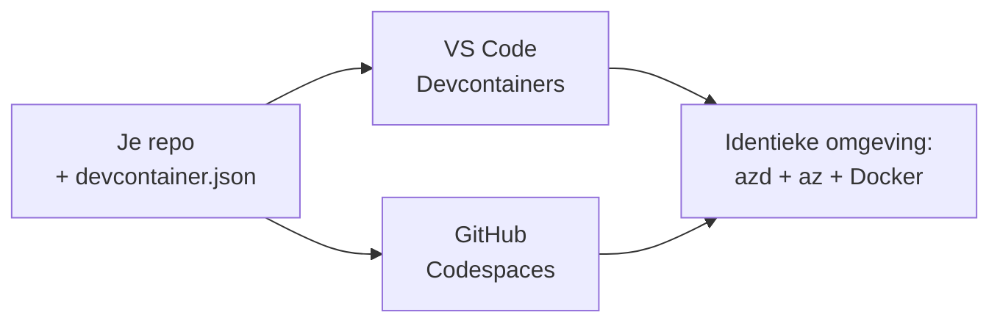

# Dev Containers & GitHub Codespaces voor azd

**Chapter Navigation:**
- **📚 Cursus Home**: [AZD voor Beginners](../../README.md)
- **📖 Huidig Hoofdstuk**: Hoofdstuk 1 - Basis & Snelstart
- **⬅️ Vorige**: [Breng Je Eigen App](bring-your-own-app.md)
- **🚀 Volgend Hoofdstuk**: [Hoofdstuk 2: AI-First Ontwikkeling](../chapter-02-ai-development/README.md)

> Gevalideerd met `azd 1.25.6` in juni 2026.

## Introductie

Het installeren van azd, de juiste taal-runtime, Docker en de Azure CLI op elke machine is een karwei—en het is de belangrijkste reden waarom een handleiding die "werkt op mijn machine" bij iemand anders faalt. Een **dev container** lost dit op door je gehele toolchain in één bestand te beschrijven. Iedereen die het project in VS Code of GitHub Codespaces opent, krijgt exact dezelfde omgeving, met azd al geïnstalleerd. Deze les laat je zien hoe je er één toevoegt.

## Leerdoelen

Aan het einde van deze les zul je:
- Begrijpen wat een dev container is en waarom het helpt bij azd
- Een minimaal `.devcontainer/devcontainer.json` toevoegen aan een project
- azd, de Azure CLI en Docker opnemen via Dev Container *features*
- Het project openen in GitHub Codespaces of VS Code

## Leerresultaten

Na het voltooien van deze les kun je:
- Een `devcontainer.json` schrijven voor een azd-project
- azd en Azure-hulpmiddelen toevoegen zonder handmatige installatie
- `azd up` uitvoeren vanuit een container of Codespace

---

## Wat is een dev container?

Een dev container is een op Docker gebaseerde ontwikkelomgeving die wordt gedefinieerd door een `.devcontainer/devcontainer.json`-bestand in je repository. Wanneer je het project opent:

- **VS Code** (met de Dev Containers-extensie) bouwt de container en koppelt eraan.
- **GitHub Codespaces** bouwt dezelfde container in de cloud en geeft je een browsergebaseerde editor.

In beide gevallen krijgt elke bijdrager identieke tools—geen "heb je azd geïnstalleerd?"-problemen.



---

## Stap 1: Maak het devcontainer-bestand aan

Maak `.devcontainer/devcontainer.json` aan in de root van je project:

```json
{
  "name": "azd-project",
  "image": "mcr.microsoft.com/devcontainers/base:bookworm",
  "features": {
    "ghcr.io/devcontainers/features/azure-cli:1": {},
    "ghcr.io/azure/azure-dev/azd:latest": {},
    "ghcr.io/devcontainers/features/docker-in-docker:2": {},
    "ghcr.io/devcontainers/features/node:1": {}
  },
  "customizations": {
    "vscode": {
      "extensions": [
        "ms-azuretools.azure-dev",
        "ms-azuretools.vscode-bicep"
      ]
    }
  },
  "forwardPorts": [3000],
  "postCreateCommand": "azd version"
}
```

Wat elk deel doet:

| Key | Purpose |
|-----|---------|
| `image` | Het basis-OS voor de container |
| `features` | Vooraf gebouwde installateurs—hier: Azure CLI, **azd**, Docker en Node.js |
| `customizations.vscode.extensions` | Installeert automatisch de azd- en Bicep-extensies voor VS Code |
| `forwardPorts` | Maakt de poort van je app beschikbaar in je browser |
| `postCreateCommand` | Wordt één keer uitgevoerd nadat de container is gebouwd (hier een sanity-check) |

> De `ghcr.io/azure/azure-dev/azd:latest` feature is de officiële manier om azd in een container te krijgen. Pin een specifieke versie (bijvoorbeeld `azd:1.25.6`) als je reproduceerbaarheid nodig hebt.

---

## Stap 2: Stem de feature af op de taal van je app

Vervang de `node`-feature door wat jouw app gebruikt:

```jsonc
// Python project
"ghcr.io/devcontainers/features/python:1": {},

// .NET project
"ghcr.io/devcontainers/features/dotnet:2": {},

// Java project
"ghcr.io/devcontainers/features/java:1": {},

// Go project
"ghcr.io/devcontainers/features/go:1": {}
```

Houd `docker-in-docker` aan als je `host` `containerapp`, `aks`, of iets anders is dat een containerimage bouwt—azd heeft Docker nodig om images te bouwen en te pushen.

---

## Stap 3: Openen

**In VS Code:**
1. Installeer de **Dev Containers**-extensie.
2. Open de projectmap.
3. Klik **Reopen in Container** wanneer daarom wordt gevraagd (of voer *Dev Containers: Reopen in Container* uit).

**In GitHub Codespaces:**
1. Push de repo naar GitHub.
2. Klik **Code → Codespaces → Create codespace on main**.
3. Wacht tot de container is gebouwd—azd is beschikbaar in de terminal.

---

## Stap 4: Implementeren vanuit de container

De container heeft azd vooraf geïnstalleerd, dus de normale workflow werkt gewoon:

```bash
azd auth login --use-device-code   # devicecode is handig binnen Codespaces
azd up
```

> **Waarom `--use-device-code`?** In een remote container of Codespace is er geen lokale browser om naar te redirecten, dus device-code aanmelding is de betrouwbare methode. Je plakt een code in een browsertab om de aanmelding te voltooien.

---

## Veelvoorkomende valkuilen

| Valkuil | Oplossing |
|---------|-----------|
| `azd up` can't build an image | Voeg de `docker-in-docker`-feature toe |
| Browser login hangs in Codespaces | Gebruik `azd auth login --use-device-code` |
| Tools differ between teammates | Pin featureversies (bijv. `azd:1.25.6`) |
| App not reachable in browser | Voeg de poort toe aan `forwardPorts` |

---

## Samenvatting

- Een dev container maakt je azd-toolchain reproduceerbaar voor iedereen.
- Voeg azd, de Azure CLI en Docker toe via Dev Container *features*.
- Stem de taal-feature af op je app en behoud `docker-in-docker` voor containerhosts.
- Gebruik device-code login bij gebruik in Codespaces.

---

## 🔗 Navigatie

| Richting | Bron |
|-----------|----------|
| **Vorige** | [Breng Je Eigen App](bring-your-own-app.md) |
| **Hoofdstuk Start** | [Hoofdstuk 1: Basis & Snelstart](README.md) |
| **Volgend Hoofdstuk** | [Hoofdstuk 2: AI-First Ontwikkeling](../chapter-02-ai-development/README.md) |

## 📖 Gerelateerde bronnen

- [Installatie & Setup](installation.md)
- [Cheatsheet met commando's](../../resources/cheat-sheet.md)
- [Officiële Dev Containers-specificatie](https://containers.dev/)
- [azd Dev Container-feature](https://github.com/Azure/azure-dev/tree/main/ext/devcontainer)

---

<!-- CO-OP TRANSLATOR DISCLAIMER START -->
**Disclaimer**:
Dit document is vertaald met behulp van de AI vertaaldienst [Co-op Translator](https://github.com/Azure/co-op-translator). Hoewel we streven naar nauwkeurigheid, dient u er rekening mee te houden dat geautomatiseerde vertalingen fouten of onnauwkeurigheden kunnen bevatten. Het originele document in de oorspronkelijke taal moet worden beschouwd als de gezaghebbende bron. Voor kritieke informatie wordt professionele menselijke vertaling aanbevolen. Wij zijn niet aansprakelijk voor eventuele misverstanden of verkeerde interpretaties die voortvloeien uit het gebruik van deze vertaling.
<!-- CO-OP TRANSLATOR DISCLAIMER END -->