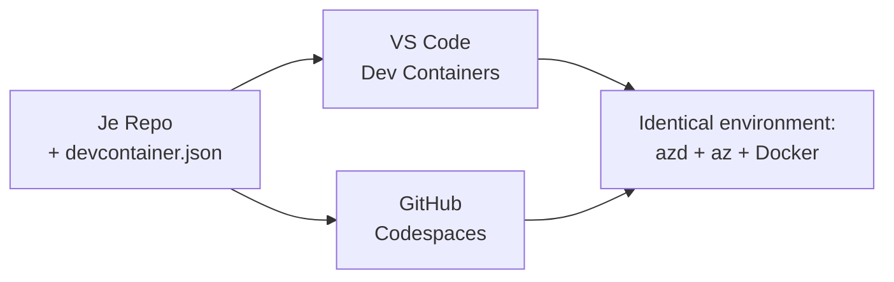

# Dev Containers & GitHub Codespaces voor azd

**Hoofdstuk Navigatie:**
- **📚 Cursus Startpagina**: [AZD Voor Beginners](../../README.md)
- **📖 Huidig Hoofdstuk**: Hoofdstuk 1 - Basis & Snel Starten
- **⬅️ Vorige**: [Breng Je Eigen App Mee](bring-your-own-app.md)
- **🚀 Volgend Hoofdstuk**: [Hoofdstuk 2: AI-First Ontwikkeling](../chapter-02-ai-development/README.md)

> Gevalideerd met `azd 1.27.1` in juli 2026.

## Introductie

Het installeren van azd, de juiste taal runtime, Docker en de Azure CLI op elke machine is een klus—en het is de belangrijkste reden waarom een tutorial die "werkt op mijn machine" faalt bij iemand anders. Een **dev container** lost dit op door jouw hele toolchain te beschrijven in een bestand. Iedereen die het project opent in VS Code of GitHub Codespaces krijgt precies dezelfde omgeving, met azd al geïnstalleerd. Deze les laat je zien hoe je er een toevoegt.

## Leerdoelen

Aan het einde van deze les zul je:
- Begrijpen wat een dev container is en waarom het helpt met azd
- Een minimale `.devcontainer/devcontainer.json` aan een project toevoegen
- azd, de Azure CLI en Docker via Dev Container *features* opnemen
- Het project openen in GitHub Codespaces of VS Code

## Leerresultaten

Na het voltooien van deze les ben je in staat om:
- Een `devcontainer.json` te schrijven voor een azd-project
- azd en Azure tools toe te voegen zonder handmatige installs
- `azd up` uit te voeren vanuit een container of Codespace

---

## Wat is een Dev Container?

Een dev container is een Docker-gebaseerde ontwikkelomgeving die wordt gedefinieerd door een `.devcontainer/devcontainer.json` bestand in je repository. Wanneer je het project opent:

- **VS Code** (met de Dev Containers extensie) bouwt de container en verbindt ermee.
- **GitHub Codespaces** bouwt dezelfde container in de cloud en geeft je een browsergebaseerde editor.

Hoe dan ook, elke bijdrager krijgt identieke tools—geen "heb je azd geïnstalleerd?" troubleshooting.



---

## Stap 1: Maak het devcontainer Bestand

Maak `.devcontainer/devcontainer.json` aan in de root van je project:

```json
{
  "name": "azd-project",
  "image": "mcr.microsoft.com/devcontainers/base:bookworm",
  "features": {
    "ghcr.io/devcontainers/features/azure-cli:1": {},
    "ghcr.io/azure/azure-dev/azd:latest": {},
    "ghcr.io/devcontainers/features/docker-in-docker:2": {},
    "ghcr.io/devcontainers/features/node:1": {}
  },
  "customizations": {
    "vscode": {
      "extensions": [
        "ms-azuretools.azure-dev",
        "ms-azuretools.vscode-bicep"
      ]
    }
  },
  "forwardPorts": [3000],
  "postCreateCommand": "azd version"
}
```

Wat elk onderdeel doet:

| Sleutel | Doel |
|-----|---------|
| `image` | Het basis besturingssysteem voor de container |
| `features` | Vooraf gebouwde installateurs—hier: Azure CLI, **azd**, Docker, en Node.js |
| `customizations.vscode.extensions` | Installeert automatisch de azd en Bicep VS Code extensies |
| `forwardPorts` | Maakt de poort van je app beschikbaar in je browser |
| `postCreateCommand` | Voert één keer uit nadat de container is gebouwd (hier, een sanity check) |

> De `ghcr.io/azure/azure-dev/azd:latest` feature is de officiële manier om azd in een container te krijgen. Specificeer een specifieke versie (bijvoorbeeld `azd:1.27.1`) als je reproduceerbaarheid nodig hebt.

---

## Stap 2: Pas de Feature aan op de Taal van je App

Vervang de `node` feature door wat jouw app gebruikt:

```jsonc
// Python project
"ghcr.io/devcontainers/features/python:1": {},

// .NET project
"ghcr.io/devcontainers/features/dotnet:2": {},

// Java project
"ghcr.io/devcontainers/features/java:1": {},

// Go project
"ghcr.io/devcontainers/features/go:1": {}
```

Houd `docker-in-docker` als je `host` `containerapp`, `aks` is, of iets dat een container image bouwt—azd heeft Docker nodig om images te bouwen en pushen.

---

## Stap 3: Open Het

**In VS Code:**
1. Installeer de **Dev Containers** extensie.
2. Open de projectmap.
3. Klik op **Heropen in Container** wanneer gevraagd (of voer *Dev Containers: Reopen in Container* uit).

**In GitHub Codespaces:**
1. Push de repo naar GitHub.
2. Klik op **Code → Codespaces → Maak codespace aan op main**.
3. Wacht tot de container is gebouwd—azd staat klaar in de terminal.

---

## Stap 4: Deploy vanuit de Container

De container heeft azd vooraf geïnstalleerd, dus de normale workflow werkt gewoon:

```bash
azd auth login --use-device-code   # apparaatcode is handig binnen Codespaces
azd up
```

> **Waarom `--use-device-code`?** In een remote container of Codespace is er geen lokale browser om naar te redirecten, dus device-code login is de betrouwbare manier. Je plakt een code in een browsertab om in te loggen.

---

## Veelvoorkomende Valkuilen

| Valkuil | Oplossing |
|---------|-----|
| `azd up` kan geen image bouwen | Voeg de `docker-in-docker` feature toe |
| Browser login hangt in Codespaces | Gebruik `azd auth login --use-device-code` |
| Tools verschillen tussen teamgenoten | Pin feature versies (bijv. `azd:1.27.1`) |
| App is niet bereikbaar in browser | Voeg de poort toe aan `forwardPorts` |

---

## Samenvatting

- Een dev container maakt je azd toolchain reproduceerbaar voor iedereen.
- Voeg azd, de Azure CLI en Docker toe via Dev Container *features*.
- Pas de taal feature aan op je app en houd `docker-in-docker` voor container hosts.
- Gebruik device-code login bij uitvoering binnen Codespaces.

---

## 🔗 Navigatie

| Richting | Bron |
|-----------|----------|
| **Vorige** | [Breng Je Eigen App Mee](bring-your-own-app.md) |
| **Hoofdstuk Start** | [Hoofdstuk 1: Basis & Snel Starten](README.md) |
| **Volgend Hoofdstuk** | [Hoofdstuk 2: AI-First Ontwikkeling](../chapter-02-ai-development/README.md) |

## 📖 Gerelateerde Bronnen

- [Installatie & Setup](installation.md)
- [Command Cheat Sheet](../../resources/cheat-sheet.md)
- [Officiële Dev Containers specificatie](https://containers.dev/)
- [azd Dev Container feature](https://github.com/Azure/azure-dev/tree/main/ext/devcontainer)

---

<!-- CO-OP TRANSLATOR DISCLAIMER START -->
**Disclaimer**:
Dit document is vertaald met behulp van de AI vertaaldienst [Co-op Translator](https://github.com/Azure/co-op-translator). Hoewel we streven naar nauwkeurigheid, dient u er rekening mee te houden dat geautomatiseerde vertalingen fouten of onnauwkeurigheden kunnen bevatten. Het originele document in de oorspronkelijke taal moet worden beschouwd als de gezaghebbende bron. Voor kritieke informatie wordt professionele menselijke vertaling aanbevolen. Wij zijn niet aansprakelijk voor eventuele misverstanden of verkeerde interpretaties die voortvloeien uit het gebruik van deze vertaling.
<!-- CO-OP TRANSLATOR DISCLAIMER END -->