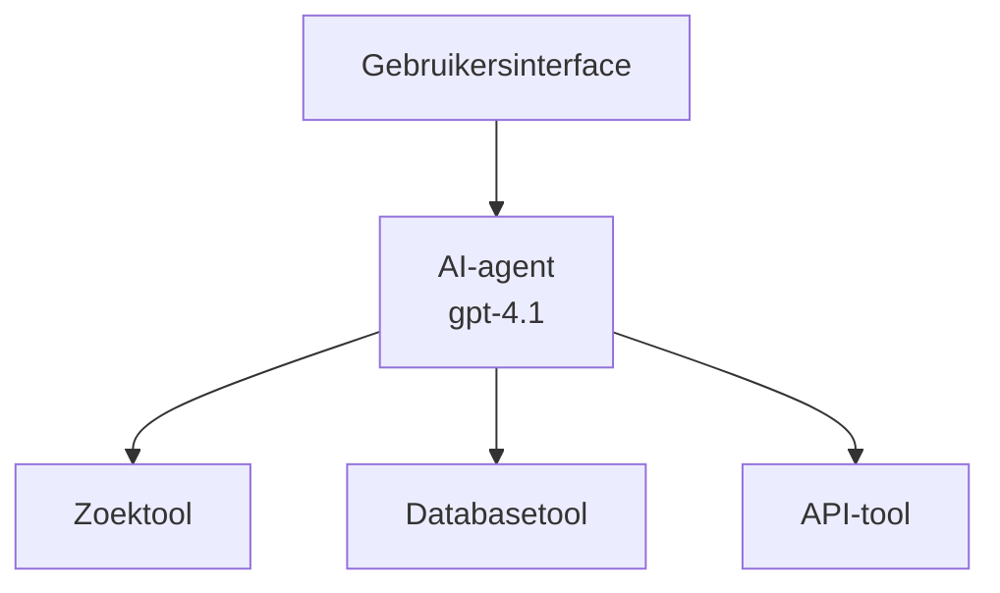
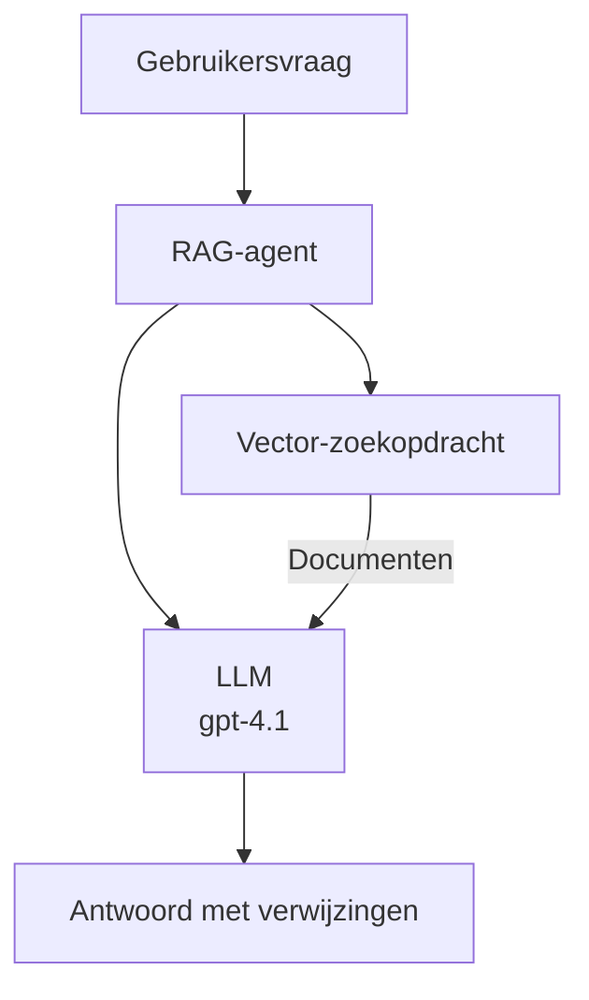
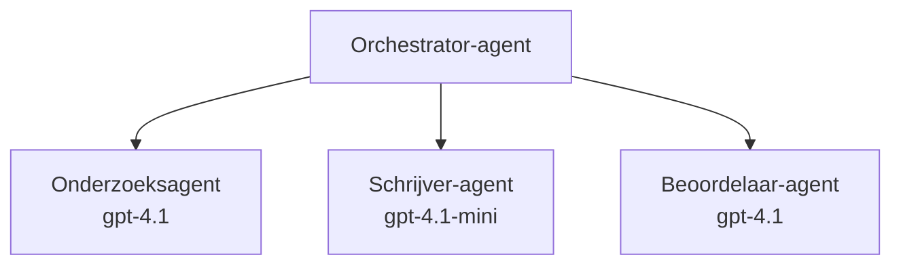

# AI-agents met Azure Developer CLI

**Hoofdstuknavigatie:**
- **📚 Cursus Startpagina**: [AZD For Beginners](../../README.md)
- **📖 Huidig hoofdstuk**: Chapter 2 - AI-First Development
- **⬅️ Vorige**: [Microsoft Foundry Integration](microsoft-foundry-integration.md)
- **➡️ Volgende**: [AI Model Deployment](ai-model-deployment.md)
- **🚀 Geavanceerd**: [Multi-Agent Solutions](../../examples/retail-scenario.md)

---

## Introductie

AI-agents zijn autonome programma's die hun omgeving kunnen waarnemen, beslissingen kunnen nemen en acties kunnen uitvoeren om specifieke doelen te bereiken. In tegenstelling tot eenvoudige chatbots die op prompts reageren, kunnen agents:

- **Tools gebruiken** - API's aanroepen, databases doorzoeken, code uitvoeren
- **Plannen en redeneren** - Complexe taken in stappen opsplitsen
- **Leren van context** - Geheugen behouden en gedrag aanpassen
- **Samenwerken** - Samenwerken met andere agents (multi-agent systemen)

Deze gids laat zien hoe je AI-agents naar Azure kunt uitrollen met Azure Developer CLI (azd).

## Leerdoelen

Door deze gids te voltooien, zul je:
- Begrijpen wat AI-agents zijn en hoe ze verschillen van chatbots
- Vooraf gebouwde AI-agent-sjablonen implementeren met AZD
- Foundry Agents configureren voor aangepaste agents
- Basisagentpatronen implementeren (toolgebruik, RAG, multi-agent)
- Geïmplementeerde agents monitoren en debuggen

## Leerresultaten

Na voltooiing kun je:
- AI-agenttoepassingen naar Azure uitrollen met één commando
- Agenttools en -mogelijkheden configureren
- Retrieval-augmented generation (RAG) implementeren met agents
- Multi-agent architecturen ontwerpen voor complexe workflows
- Veelvoorkomende problemen bij agentimplementatie oplossen

---

## 🤖 Wat maakt een agent anders dan een chatbot?

| Kenmerk | Chatbot | AI-agent |
|---------|---------|----------|
| **Gedrag** | Reageert op prompts | Neemt autonome acties |
| **Tools** | Geen | Kan API's aanroepen, zoeken, code uitvoeren |
| **Geheugen** | Alleen sessiegebonden | Persistent geheugen tussen sessies |
| **Planning** | Enkele reactie | Meerstapsredenering |
| **Samenwerking** | Enkelvoudige entiteit | Kan samenwerken met andere agents |

### Eenvoudige analogie

- **Chatbot** = Een behulpzaam persoon die vragen beantwoordt bij een informatiebalie
- **AI-agent** = Een persoonlijke assistent die telefoontjes kan plegen, afspraken kan boeken en taken voor je kan uitvoeren

---

## 🚀 Snelstart: Implementeer je eerste agent

### Optie 1: Foundry Agents-sjabloon (Aanbevolen)

```bash
# Initialiseer de sjabloon voor AI-agenten
azd init --template get-started-with-ai-agents

# Uitrollen naar Azure
azd up
```

**Wat wordt uitgerold:**
- ✅ Foundry Agents
- ✅ Microsoft Foundry Models (gpt-4.1)
- ✅ Azure AI Search (voor RAG)
- ✅ Azure Container Apps (webinterface)
- ✅ Application Insights (monitoring)

**Tijd:** ~15-20 minuten
**Kosten:** ~$100-150/maand (ontwikkeling)

### Optie 2: OpenAI-agent met Prompty

```bash
# Initialiseer de op Prompty gebaseerde agentsjabloon
azd init --template agent-openai-python-prompty

# Naar Azure implementeren
azd up
```

**Wat wordt uitgerold:**
- ✅ Azure Functions (serverloze agentuitvoering)
- ✅ Microsoft Foundry Models
- ✅ Prompty-configuratiebestanden
- ✅ Voorbeeldimplementatie van agent

**Tijd:** ~10-15 minuten
**Kosten:** ~$50-100/maand (ontwikkeling)

### Optie 3: RAG Chat Agent

```bash
# Initialiseer RAG-chat-sjabloon
azd init --template azure-search-openai-demo

# Uitrollen naar Azure
azd up
```

**Wat wordt uitgerold:**
- ✅ Microsoft Foundry Models
- ✅ Azure AI Search met voorbeeldgegevens
- ✅ Documentverwerkingspipeline
- ✅ Chatinterface met citaties

**Tijd:** ~15-25 minuten
**Kosten:** ~$80-150/maand (ontwikkeling)

### Optie 4: AZD AI Agent Init (op manifest gebaseerd)

Als je een agent-manifestbestand hebt, kun je de `azd ai`-opdracht gebruiken om direct een Foundry Agent Service-project te scaffolden:

```bash
# Installeer de AI-agents-extensie
azd extension install azure.ai.agents

# Initialiseer vanuit een agentmanifest
azd ai agent init -m agent-manifest.yaml

# Implementeer naar Azure
azd up
```

**Wanneer `azd ai agent init` gebruiken vs `azd init --template`:**

| Aanpak | Beste voor | Hoe het werkt |
|----------|----------|------|
| `azd init --template` | Beginnen met een werkende voorbeeld-app | Klonen van een volledige sjabloon-repo met code + infra |
| `azd ai agent init -m` | Bouwen op basis van je eigen agent-manifest | Genereert projectstructuur op basis van je agentdefinitie |

> **Tip:** Gebruik `azd init --template` bij het leren (Opties 1-3 hierboven). Gebruik `azd ai agent init` bij het bouwen van productieagents met je eigen manifests. Zie [AZD AI CLI-commando's](../chapter-08-production/production-ai-practices.md#azd-ai-cli-commands-and-extensions) voor volledige referentie.

---

## 🏗️ Agent architectuurpatronen

### Patroon 1: Enkele agent met tools

Het eenvoudigste agentpatroon - één agent die meerdere tools kan gebruiken.


**Geschikt voor:**
- Klantenservice-bots
- Onderzoeksassistenten
- Data-analyseagents

**AZD-sjabloon:** `azure-search-openai-demo`

### Patroon 2: RAG-agent (Retrieval-Augmented Generation)

Een agent die relevante documenten ophaalt voordat hij antwoorden genereert.


**Geschikt voor:**
- Bedrijfskennisbanken
- Document Q&A-systemen
- Compliance en juridisch onderzoek

**AZD-sjabloon:** `azure-search-openai-demo`

### Patroon 3: Multi-agent systeem

Meerdere gespecialiseerde agents die samenwerken aan complexe taken.


**Geschikt voor:**
- Complexe contentgeneratie
- Meerstapsworkflows
- Taken die verschillende expertise vereisen

**Meer informatie:** [Multi-Agent Coordination Patterns](../chapter-06-pre-deployment/coordination-patterns.md)

---

## ⚙️ Agenttools configureren

Agents worden krachtig wanneer ze tools kunnen gebruiken. Hier leest u hoe u veelvoorkomende tools configureert:

### Toolconfiguratie in Foundry Agents

```python
# agent_config.py
from azure.ai.projects import AIProjectClient
from azure.ai.projects.models import FunctionTool, CodeInterpreterTool

# Definieer aangepaste hulpmiddelen
search_tool = FunctionTool(
    name="search_knowledge_base",
    description="Search the company knowledge base for relevant documents",
    parameters={
        "type": "object",
        "properties": {
            "query": {
                "type": "string",
                "description": "The search query"
            }
        },
        "required": ["query"]
    }
)

# Maak een agent met hulpmiddelen
agent = project_client.agents.create_agent(
    model="gpt-4.1",
    name="Support Agent",
    instructions="You are a helpful support agent. Use the search tool to find relevant information.",
    tools=[search_tool, CodeInterpreterTool()]
)
```

### Omgevingsconfiguratie

```bash
# Stel agentspecifieke omgevingsvariabelen in
azd env set AZURE_OPENAI_MODEL "gpt-4.1"
azd env set AGENT_INSTRUCTIONS "You are a helpful assistant..."
azd env set ENABLE_CODE_INTERPRETER "true"
azd env set ENABLE_FILE_SEARCH "true"

# Implementeer met bijgewerkte configuratie
azd deploy
```

---

## 📊 Agents monitoren

### Integratie met Application Insights

Alle AZD-agent-sjablonen bevatten Application Insights voor monitoring:

```bash
# Open het monitoringdashboard
azd monitor --overview

# Bekijk live logs
azd monitor --logs

# Bekijk live metrics
azd monitor --live
```

### Belangrijke statistieken om bij te houden

| Metriek | Beschrijving | Doel |
|--------|-------------|--------|
| Responstijd | Tijd om antwoord te genereren | < 5 seconden |
| Tokengebruik | Tokens per verzoek | Monitoren voor kosten |
| Succespercentage van tool-aanroepen | % succesvolle tooluitvoeringen | > 95% |
| Foutpercentage | Mislukte agentverzoeken | < 1% |
| Gebruikerstevredenheid | Feedbackscores | > 4.0/5.0 |

### Aangepaste logging voor agents

```python
import os
from azure.monitor.opentelemetry import configure_azure_monitor
from opentelemetry import trace

# Configureer Azure Monitor met OpenTelemetry
configure_azure_monitor(
    connection_string=os.environ["APPLICATIONINSIGHTS_CONNECTION_STRING"]
)

tracer = trace.get_tracer(__name__)

def log_agent_interaction(user_query, agent_response, tools_used, latency_ms):
    with tracer.start_as_current_span("agent_interaction") as span:
        span.set_attributes({
            "user_query": user_query,
            "response_length": len(agent_response),
            "tools_used": tools_used,
            "latency_ms": latency_ms
        })
```

> **Opmerking:** Installeer de vereiste pakketten: `pip install azure-monitor-opentelemetry opentelemetry`

---

## 💰 Kostenoverwegingen

### Geschatte maandelijkse kosten per patroon

| Patroon | Ontwikkelomgeving | Productie |
|---------|-----------------|------------|
| Enkele agent | $50-100 | $200-500 |
| RAG-agent | $80-150 | $300-800 |
| Multi-agent (2-3 agents) | $150-300 | $500-1,500 |
| Enterprise multi-agent | $300-500 | $1,500-5,000+ |

### Tips voor kostenoptimalisatie

1. **Gebruik gpt-4.1-mini voor eenvoudige taken**
   ```bash
   azd env set AZURE_OPENAI_MODEL "gpt-4.1-mini"
   ```

2. **Implementeer caching voor herhaalde queries**
   ```python
   from functools import lru_cache
   
   @lru_cache(maxsize=1000)
   def get_cached_response(query_hash):
       return agent.run(query_hash)
   ```

3. **Stel tokenlimieten per run in**
   ```python
   # Stel max_completion_tokens in bij het uitvoeren van de agent, niet tijdens het aanmaken
   run = project_client.agents.create_run(
       thread_id=thread.id,
       agent_id=agent.id,
       max_completion_tokens=1000  # Beperk de lengte van het antwoord
   )
   ```

4. **Schaal terug naar nul wanneer niet in gebruik**
   ```bash
   # Container-apps schalen automatisch naar nul
   azd env set MIN_REPLICAS "0"
   ```

---

## 🔧 Probleemoplossing voor agents

### Veelvoorkomende problemen en oplossingen

<details>
<summary><strong>❌ Agent reageert niet op tool-aanroepen</strong></summary>

```bash
# Controleer of tools correct zijn geregistreerd
azd show

# Controleer OpenAI-implementatie
az cognitiveservices account deployment list \
  --name $AZURE_OPENAI_NAME \
  --resource-group $RG_NAME

# Controleer agentlogboeken
azd monitor --logs
```

**Veelvoorkomende oorzaken:**
- Mismatch in tool-functiesignatuur
- Ontbrekende vereiste machtigingen
- API-endpoint niet bereikbaar
</details>

<details>
<summary><strong>❌ Hoge latentie in agentreacties</strong></summary>

```bash
# Controleer Application Insights op knelpunten
azd monitor --live

# Overweeg het gebruik van een sneller model
azd env set AZURE_OPENAI_MODEL "gpt-4.1-mini"
azd deploy
```

**Optimalisatietips:**
- Gebruik streaming-antwoorden
- Implementeer antwoordcaching
- Verminder de contextvenstergrootte
</details>

<details>
<summary><strong>❌ Agent geeft onjuiste of gefantaseerde informatie terug</strong></summary>

```python
# Verbeter met betere systeemprompts
instructions = """
You are a helpful assistant. IMPORTANT:
- Only answer based on provided context
- If you don't know, say "I don't know"
- Always cite your sources
- Never make up information
"""

# Voeg retrieval toe voor onderbouwing
agent = project_client.agents.create_agent(
    model="gpt-4.1",
    instructions=instructions,
    tools=[FileSearchTool()]  # Onderbouw antwoorden met documenten
)
```
</details>

<details>
<summary><strong>❌ Fouten: tokenlimiet overschreden</strong></summary>

```python
# Implementeer beheer van het contextvenster
def truncate_context(messages, max_tokens=8000, model="gpt-4.1"):
    """Keep only recent messages within token limit."""
    import tiktoken
    encoding = tiktoken.encoding_for_model(model)
    total_tokens = 0
    truncated = []
    
    for msg in reversed(messages):
        msg_tokens = len(encoding.encode(msg.content))
        if total_tokens + msg_tokens > max_tokens:
            break
        truncated.insert(0, msg)
        total_tokens += msg_tokens
    
    return truncated
```
</details>

---

## 🎓 Praktische oefeningen

### Oefening 1: Implementeer een basisagent (20 minuten)

**Doel:** Implementeer je eerste AI-agent met AZD

```bash
# Stap 1: Sjabloon initialiseren
azd init --template get-started-with-ai-agents

# Stap 2: Inloggen bij Azure
azd auth login

# Stap 3: Uitrollen
azd up

# Stap 4: Test de agent
# Verwachte uitvoer na implementatie:
#   Implementatie voltooid!
#   Eindpunt: https://<app-name>.<region>.azurecontainerapps.io
# Open de URL die in de uitvoer wordt weergegeven en probeer een vraag te stellen

# Stap 5: Bekijk monitoring
azd monitor --overview

# Stap 6: Opruimen
azd down --force --purge
```

**Succescriteria:**
- [ ] Agent reageert op vragen
- [ ] Kan toegang krijgen tot monitoringdashboard via `azd monitor`
- [ ] Resources succesvol opgeruimd

### Oefening 2: Voeg een aangepaste tool toe (30 minuten)

**Doel:** Breid een agent uit met een aangepaste tool

1. Implementeer het agent-sjabloon:
   ```bash
   azd init --template get-started-with-ai-agents
   azd up
   ```
2. Maak een nieuwe toolfunctie in je agentcode:
   ```python
   def get_weather(location: str) -> str:
       """Get current weather for a location."""
       # API-aanroep naar de weerservice
       return f"Weather in {location}: Sunny, 72°F"
   ```
3. Registreer de tool bij de agent:
   ```python
   from azure.ai.projects.models import FunctionTool

   weather_tool = FunctionTool(
       name="get_weather",
       description="Get current weather for a location",
       parameters={
           "type": "object",
           "properties": {
               "location": {"type": "string", "description": "City name"}
           },
           "required": ["location"]
       }
   )

   agent = project_client.agents.create_agent(
       model="gpt-4.1",
       name="Weather Agent",
       tools=[weather_tool]
   )
   ```
4. Opnieuw implementeren en testen:
   ```bash
   azd deploy
   # Vraag: "Wat is het weer in Seattle?"
   # Verwacht: Agent roept get_weather("Seattle") aan en geeft weerinformatie terug
   ```

**Succescriteria:**
- [ ] Agent herkent vragen over het weer
- [ ] Tool wordt correct aangeroepen
- [ ] Antwoord bevat weersinformatie

### Oefening 3: Bouw een RAG-agent (45 minuten)

**Doel:** Maak een agent die vragen beantwoordt op basis van je documenten

```bash
# Stap 1: Implementeer RAG-sjabloon
azd init --template azure-search-openai-demo
azd up

# Stap 2: Upload uw documenten
# Plaats PDF/TXT-bestanden in de map data/ en voer vervolgens uit:
python scripts/prepdocs.py

# Stap 3: Test met domeinspecifieke vragen
# Open de webapp-URL uit de uitvoer van azd up
# Stel vragen over uw geüploade documenten
# Antwoorden moeten citatieverwijzingen bevatten zoals [doc.pdf]
```

**Succescriteria:**
- [ ] Agent beantwoordt vragen uit geüploade documenten
- [ ] Antwoorden bevatten citaties
- [ ] Geen hallucinaties bij vragen buiten het bereik

---

## 📚 Volgende stappen

Nu je AI-agents begrijpt, verken deze geavanceerde onderwerpen:

| Onderwerp | Beschrijving | Link |
|-------|-------------|------|
| **Multi-Agent Systemen** | Bouw systemen met meerdere samenwerkende agents | [Retail Multi-Agent Example](../../examples/retail-scenario.md) |
| **Coördinatiepatronen** | Leer orkestratie- en communicatiepatronen | [Coordination Patterns](../chapter-06-pre-deployment/coordination-patterns.md) |
| **Productie-implementatie** | Enterprise-klare agentimplementatie | [Production AI Practices](../chapter-08-production/production-ai-practices.md) |
| **Agentevaluatie** | Test en evalueer agentprestaties | [AI Troubleshooting](../chapter-07-troubleshooting/ai-troubleshooting.md) |
| **AI Workshop Lab** | Hands-on: Maak je AI-oplossing AZD-klaar | [AI Workshop Lab](ai-workshop-lab.md) |

---

## 📖 Aanvullende bronnen

### Officiële documentatie
- [Azure AI Agent Service](https://learn.microsoft.com/azure/ai-services/agents/)
- [Azure AI Foundry Agent Service Quickstart](https://learn.microsoft.com/azure/ai-services/agents/quickstart)
- [Semantic Kernel Agent Framework](https://learn.microsoft.com/semantic-kernel/)

### AZD-sjablonen voor agents
- [Get Started with AI Agents](https://github.com/Azure-Samples/get-started-with-ai-agents)
- [Agent OpenAI Python Prompty](https://github.com/Azure-Samples/agent-openai-python-prompty)
- [Azure Search OpenAI Demo](https://github.com/Azure-Samples/azure-search-openai-demo)

### Communitybronnen
- [Awesome AZD - Agent Templates](https://azure.github.io/awesome-azd/?tags=ai-agents)
- [Azure AI Discord](https://discord.gg/microsoft-azure)
- [Microsoft Foundry Discord](https://discord.gg/nTYy5BXMWG)

### Agentvaardigheden voor je editor
- [**Microsoft Azure Agent Skills**](https://skills.sh/microsoft/github-copilot-for-azure) - Installeer herbruikbare AI-agentvaardigheden voor Azure-ontwikkeling in GitHub Copilot, Cursor of elke ondersteunde agent. Bevat vaardigheden voor [Azure AI](https://skills.sh/microsoft/github-copilot-for-azure/azure-ai), [Microsoft Foundry](https://skills.sh/microsoft/github-copilot-for-azure/microsoft-foundry), [deployment](https://skills.sh/microsoft/github-copilot-for-azure/azure-deploy), and [diagnostics](https://skills.sh/microsoft/github-copilot-for-azure/azure-diagnostics):
  ```bash
  npx skills add microsoft/github-copilot-for-azure
  ```

---

**Navigatie**
- **Vorige les**: [Microsoft Foundry Integration](microsoft-foundry-integration.md)
- **Volgende les**: [AI Model Deployment](ai-model-deployment.md)

---

<!-- CO-OP TRANSLATOR DISCLAIMER START -->
**Disclaimer**:
Dit document is vertaald met behulp van de AI-vertalingsdienst [Co-op Translator](https://github.com/Azure/co-op-translator). Hoewel we streven naar nauwkeurigheid, houd er rekening mee dat geautomatiseerde vertalingen fouten of onnauwkeurigheden kunnen bevatten. Het oorspronkelijke document in de oorspronkelijke taal moet als de gezaghebbende bron worden beschouwd. Voor kritieke informatie wordt professionele menselijke vertaling aanbevolen. Wij zijn niet aansprakelijk voor enige misverstanden of verkeerde interpretaties die voortvloeien uit het gebruik van deze vertaling.
<!-- CO-OP TRANSLATOR DISCLAIMER END -->