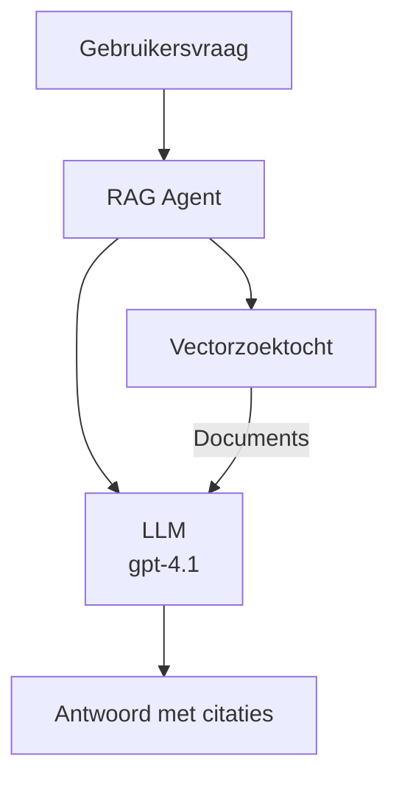

# AI Agents met Azure Developer CLI

**Hoofdstuk Navigatie:**
- **📚 Cursus Startpagina**: [AZD Voor Beginners](../../README.md)
- **📖 Huidig Hoofdstuk**: Hoofdstuk 2 - AI-First Ontwikkeling
- **⬅️ Vorige**: [Microsoft Foundry Integratie](microsoft-foundry-integration.md)
- **➡️ Volgende**: [AI Model Deployment](ai-model-deployment.md)
- **🚀 Geavanceerd**: [Multi-Agent Oplossingen](../../examples/retail-scenario.md)

---

## Inleiding

AI-agents zijn autonome programma's die hun omgeving kunnen waarnemen, beslissingen kunnen nemen en acties kunnen uitvoeren om specifieke doelen te bereiken. In tegenstelling tot eenvoudige chatbots die reageren op prompts, kunnen agents:

- **Tools gebruiken** - APIs aanroepen, databases doorzoeken, code uitvoeren
- **Plannen en redeneren** - Complexe taken opsplitsen in stappen
- **Leren van context** - Geheugen onderhouden en gedrag aanpassen
- **Samenwerken** - Werken met andere agents (multi-agent systemen)

Deze gids laat je zien hoe je AI-agents naar Azure kunt deployen met behulp van Azure Developer CLI (azd).

> **Validatienota (2026-07-13):** Deze gids is beoordeeld met `azd` `1.27.1` en `azure.ai.agents` `1.0.0-beta.5`. De `azd ai`-ervaring is nog steeds preview-gestuurd, controleer de extensiehulp als je geïnstalleerde flags verschillen.

## Leerdoelen

Na het voltooien van deze gids zul je:
- Begrijpen wat AI-agents zijn en hoe ze verschillen van chatbots
- Vooraf gebouwde AI-agent templates deployen met AZD
- Foundry Agents configureren voor aangepaste agents
- Basis agentpatronen implementeren (toolgebruik, RAG, multi-agent)
- Geïmplementeerde agents monitoren en debuggen

## Leerresultaten

Na voltooiing kun je:
- AI-agent applicaties deployen naar Azure met één commando
- Agent tools en mogelijkheden configureren
- Retrieval-augmented generation (RAG) met agents implementeren
- Multi-agent architecturen ontwerpen voor complexe workflows
- Veelvoorkomende problemen bij agent deployement oplossen

---

## 🤖 Wat Maakt een Agent Anders dan een Chatbot?

| Kenmerk | Chatbot | AI Agent |
|---------|---------|----------|
| **Gedrag** | Reageert op prompts | Neemt autonome acties |
| **Tools** | Geen | Kan APIs aanroepen, zoeken, code uitvoeren |
| **Geheugen** | Alleen sessie-gebaseerd | Persistent geheugen over sessies heen |
| **Planning** | Enkele respons | Redeneren in meerdere stappen |
| **Samenwerking** | Enkelvoudige entiteit | Kan samenwerken met andere agents |

### Eenvoudige Analogie

- **Chatbot** = Een behulpzaam persoon die vragen beantwoordt bij een informatiedesk
- **AI Agent** = Een persoonlijke assistent die kan bellen, afspraken maken en taken voor je afhandelen

---

## 🚀 Snel Starten: Deploy Je Eerste Agent

### Optie 1: Foundry Agents Template (Aanbevolen)

```bash
# Initialiseer de AI-agenten template
azd init --template get-started-with-ai-agents

# Uitrollen naar Azure
azd up
```

**Wat wordt gedeployed:**
- ✅ Foundry Agents
- ✅ Microsoft Foundry Models (gpt-4.1)
- ✅ Azure AI Search (voor RAG)
- ✅ Azure Container Apps (webinterface)
- ✅ Application Insights (monitoring)

**Tijd:** ~15-20 minuten
**Kosten:** ~$100-150/maand (ontwikkeling)

### Optie 2: OpenAI Agent met Prompty

```bash
# Initialiseer de Prompty-gebaseerde agent sjabloon
azd init --template agent-openai-python-prompty

# Implementeren naar Azure
azd up
```

**Wat wordt gedeployed:**
- ✅ Azure Functions (serverloze agent uitvoering)
- ✅ Microsoft Foundry Models
- ✅ Prompty configuratiebestanden
- ✅ Voorbeeld agent-implementatie

**Tijd:** ~10-15 minuten
**Kosten:** ~$50-100/maand (ontwikkeling)

### Optie 3: RAG Chat Agent

```bash
# Initialiseer RAG chat-sjabloon
azd init --template azure-search-openai-demo

# Uitrollen naar Azure
azd up
```

**Wat wordt gedeployed:**
- ✅ Microsoft Foundry Models
- ✅ Azure AI Search met voorbeelddata
- ✅ Documentverwerkingspipeline
- ✅ Chatinterface met citaties

**Tijd:** ~15-25 minuten
**Kosten:** ~$80-150/maand (ontwikkeling)

### Optie 4: AZD AI Agent Init (Manifest- of Template-Based Preview)

Als je een agent manifestbestand hebt, kun je met het `azd ai`-commando direct een Foundry Agent Service project genereren. Recente preview-releases hebben ook template-gebaseerde initialisatie toegevoegd, dus de exacte promptflow kan iets verschillen afhankelijk van je geïnstalleerde extensieversie.

```bash
# Installeer de AI-agenten extensie
azd extension install azure.ai.agents

# Optioneel: controleer de geïnstalleerde preview-versie
azd extension show azure.ai.agents

# Initialiseren vanuit een agentmanifest
azd ai agent init -m agent-manifest.yaml

# Uitrollen naar Azure
azd up

# Test de uitgerolde agent (toont latentie + tijd tot eerste byte)
azd ai agent invoke
```

**Wanneer gebruik je `azd ai agent init` vs `azd init --template`:**

| Aanpak | Beste voor | Hoe het werkt |
|----------|----------|------|
| `azd init --template` | Starten met een werkende sample-app | Kloont een volledige template repo met code + infra |
| `azd ai agent init -m` | Bouwen met je eigen agent manifest | Genereert projectstructuur vanuit je agentdefinitie |

> **Tip:** Gebruik `azd init --template` bij het leren (Opties 1-3 hierboven). Gebruik `azd ai agent init` bij het bouwen van productieve agents met je eigen manifests.

Na `azd up` begeleidt dezelfde extensie je door de rest van de agentcyclus: `azd ai agent invoke` om te testen, `azd ai agent eval generate` en `azd ai agent optimize` om kwaliteit te meten en verbeteren, en `azd ai agent delete` om op te ruimen. Zie [AZD AI CLI Commands](../chapter-08-production/production-ai-practices.md#azd-ai-cli-commands-and-extensions) voor de volledige referentie.

---

## 🏗️ Agent Architectuur Patronen

### Patroon 1: Enkelvoudige Agent met Tools

Het eenvoudigste agentpatroon - één agent die meerdere tools kan gebruiken.


**Geschikt voor:**
- Klantenservice bots
- Onderzoeksassistenten
- Data-analyse agents

**AZD Template:** `azure-search-openai-demo`

### Patroon 2: RAG Agent (Retrieval-Augmented Generation)

Een agent die relevante documenten ophaalt voordat hij antwoorden genereert.



**Geschikt voor:**
- Enterprise kennisbanken
- Document Q&A systemen
- Compliance en juridisch onderzoek

**AZD Template:** `azure-search-openai-demo`

### Patroon 3: Multi-Agent Systeem

Meerdere gespecialiseerde agents die samenwerken aan complexe taken.


**Geschikt voor:**
- Complexe contentgeneratie
- Workflows met meerdere stappen
- Taken die verschillende expertise vereisen

**Leer Meer:** [Multi-Agent Coördinatie Patronen](../chapter-06-pre-deployment/coordination-patterns.md)

---

## ⚙️ Tools voor Agents Configureren

Agents worden krachtig wanneer ze tools kunnen gebruiken. Hier lees je hoe je veelgebruikte tools configureert:

### Tool Configuratie in Foundry Agents

```python
# agent_config.py
from azure.ai.projects import AIProjectClient
from azure.ai.projects.models import FunctionTool, CodeInterpreterTool

# Definieer aangepaste tools
search_tool = FunctionTool(
    name="search_knowledge_base",
    description="Search the company knowledge base for relevant documents",
    parameters={
        "type": "object",
        "properties": {
            "query": {
                "type": "string",
                "description": "The search query"
            }
        },
        "required": ["query"]
    }
)

# Maak agent met tools
agent = project_client.agents.create_agent(
    model="gpt-4.1",
    name="Support Agent",
    instructions="You are a helpful support agent. Use the search tool to find relevant information.",
    tools=[search_tool, CodeInterpreterTool()]
)
```

### Omgevingsconfiguratie

```bash
# Stel agent-specifieke omgevingsvariabelen in
azd env set AZURE_OPENAI_MODEL "gpt-4.1"
azd env set AGENT_INSTRUCTIONS "You are a helpful assistant..."
azd env set ENABLE_CODE_INTERPRETER "true"
azd env set ENABLE_FILE_SEARCH "true"

# Implementeer met bijgewerkte configuratie
azd deploy
```

---

## 📊 Agents Monitoren

### Integratie met Application Insights

Alle AZD agent templates bevatten Application Insights voor monitoring:

```bash
# Open bewakingsdashboard
azd monitor --overview

# Bekijk live logs
azd monitor --logs

# Bekijk live statistieken
azd monitor --live
```

### Belangrijke Statistieken om te Volgen

| Statistiek | Beschrijving | Doel |
|--------|-------------|--------|
| Responslatentie | Tijd om antwoord te genereren | < 5 seconden |
| Token Gebruik | Tokens per verzoek | Monitoren voor kosten |
| Succespercentage Tool Aanroepen | % succesvolle tooluitvoeringen | > 95% |
| Foutpercentage | Mislukte agent verzoeken | < 1% |
| Gebruikerstevredenheid | Feedbackscores | > 4.0/5.0 |

### Aangepaste Logging voor Agents

```python
import os
from azure.monitor.opentelemetry import configure_azure_monitor
from opentelemetry import trace

# Configureer Azure Monitor met OpenTelemetry
configure_azure_monitor(
    connection_string=os.environ["APPLICATIONINSIGHTS_CONNECTION_STRING"]
)

tracer = trace.get_tracer(__name__)

def log_agent_interaction(user_query, agent_response, tools_used, latency_ms):
    with tracer.start_as_current_span("agent_interaction") as span:
        span.set_attributes({
            "user_query": user_query,
            "response_length": len(agent_response),
            "tools_used": tools_used,
            "latency_ms": latency_ms
        })
```

> **Opmerking:** Installeer de benodigde pakketten: `pip install azure-monitor-opentelemetry opentelemetry`

---

## 💰 Kosten Overwegingen

### Geschatte Maandelijkse Kosten per Patroon

| Patroon | Ontwikkelomgeving | Productie |
|---------|-----------------|------------|
| Enkelvoudige Agent | $50-100 | $200-500 |
| RAG Agent | $80-150 | $300-800 |
| Multi-Agent (2-3 agents) | $150-300 | $500-1.500 |
| Enterprise Multi-Agent | $300-500 | $1.500-5.000+ |

### Tips voor Kostoptimalisatie

1. **Gebruik gpt-4.1-mini voor eenvoudige taken**
   ```bash
   azd env set AZURE_OPENAI_MODEL "gpt-4.1-mini"
   ```

2. **Implementeer caching voor herhaalde queries**
   ```python
   from functools import lru_cache
   
   @lru_cache(maxsize=1000)
   def get_cached_response(query_hash):
       return agent.run(query_hash)
   ```

3. **Stel tokenlimieten per run in**
   ```python
   # Stel max_completion_tokens in bij het uitvoeren van de agent, niet tijdens het aanmaken
   run = project_client.agents.create_run(
       thread_id=thread.id,
       agent_id=agent.id,
       max_completion_tokens=1000  # Beperk de antwoordlengte
   )
   ```

4. **Schaal naar nul wanneer niet in gebruik**
   ```bash
   # Container Apps schalen automatisch naar nul
   azd env set MIN_REPLICAS "0"
   ```

---

## 🔧 Problemen oplossen bij Agents

### Veelvoorkomende Problemen en Oplossingen

<details>
<summary><strong>❌ Agent reageert niet op tool-aanroepen</strong></summary>

```bash
# Controleer of tools correct zijn geregistreerd
azd show

# Verifieer OpenAI-implementatie
az cognitiveservices account deployment list \
  --name $AZURE_OPENAI_NAME \
  --resource-group $RG_NAME

# Controleer agentlogboeken
azd monitor --logs
```

**Veelvoorkomende oorzaken:**
- Tool functie handtekening klopt niet
- Ontbrekende vereiste permissies
- API endpoint niet toegankelijk
</details>

<details>
<summary><strong>❌ Hoge latentie in agentrespons</strong></summary>

```bash
# Controleer Application Insights op knelpunten
azd monitor --live

# Overweeg het gebruik van een sneller model
azd env set AZURE_OPENAI_MODEL "gpt-4.1-mini"
azd deploy
```

**Optimalisatietips:**
- Gebruik streaming responses
- Implementeer response caching
- Verminder context window grootte
</details>

<details>
<summary><strong>❌ Agent geeft onjuiste of gefantaseerde informatie terug</strong></summary>

```python
# Verbeter met betere systeem prompts
instructions = """
You are a helpful assistant. IMPORTANT:
- Only answer based on provided context
- If you don't know, say "I don't know"
- Always cite your sources
- Never make up information
"""

# Voeg ophalen toe voor onderbouwing
agent = project_client.agents.create_agent(
    model="gpt-4.1",
    instructions=instructions,
    tools=[FileSearchTool()]  # Onderbouw antwoorden met documenten
)
```
</details>

<details>
<summary><strong>❌ Tokenlimiet overschreden fouten</strong></summary>

```python
# Implementeer het beheer van de contextvenster
def truncate_context(messages, max_tokens=8000, model="gpt-4.1"):
    """Keep only recent messages within token limit."""
    import tiktoken
    encoding = tiktoken.encoding_for_model(model)
    total_tokens = 0
    truncated = []
    
    for msg in reversed(messages):
        msg_tokens = len(encoding.encode(msg.content))
        if total_tokens + msg_tokens > max_tokens:
            break
        truncated.insert(0, msg)
        total_tokens += msg_tokens
    
    return truncated
```
</details>

---

## 🎓 Praktische Oefeningen

### Oefening 1: Deploy een Basis Agent (20 minuten)

**Doel:** Deploy je eerste AI-agent met AZD

```bash
# Stap 1: Initialiseer sjabloon
azd init --template get-started-with-ai-agents

# Stap 2: Log in bij Azure
azd auth login
# Als je over tenants werkt, voeg dan --tenant-id <tenant-id> toe

# Stap 3: Implementeer
azd up

# Stap 4: Test de agent
# Verwachte uitvoer na implementatie:
#   Implementatie voltooid!
#   Eindpunt: https://<app-naam>.<regio>.azurecontainerapps.io
# Open de URL die in de uitvoer wordt weergegeven en probeer een vraag te stellen

# Stap 5: Bekijk monitoring
azd monitor --overview

# Stap 6: Opruimen
azd down --force --purge
```

**Succescriteria:**
- [ ] Agent reageert op vragen
- [ ] Heeft toegang tot monitoring dashboard via `azd monitor`
- [ ] Middelen succesvol opgeruimd

### Oefening 2: Voeg een Aangepaste Tool toe (30 minuten)

**Doel:** Breid een agent uit met een aangepaste tool

1. Deploy de agent template:
   ```bash
   azd init --template get-started-with-ai-agents
   azd up
   ```
2. Maak een nieuwe toolfunctie in je agentcode:
   ```python
   def get_weather(location: str) -> str:
       """Get current weather for a location."""
       # API-aanroep naar weerservice
       return f"Weather in {location}: Sunny, 72°F"
   ```
3. Registreer de tool bij de agent:
   ```python
   from azure.ai.projects.models import FunctionTool

   weather_tool = FunctionTool(
       name="get_weather",
       description="Get current weather for a location",
       parameters={
           "type": "object",
           "properties": {
               "location": {"type": "string", "description": "City name"}
           },
           "required": ["location"]
       }
   )

   agent = project_client.agents.create_agent(
       model="gpt-4.1",
       name="Weather Agent",
       tools=[weather_tool]
   )
   ```
4. Redeploy en test:
   ```bash
   azd deploy
   # Vraag: "Wat is het weer in Seattle?"
   # Verwacht: Agent roept get_weather("Seattle") aan en geeft weerinformatie terug
   ```

**Succescriteria:**
- [ ] Agent herkent weergerelateerde vragen
- [ ] Tool wordt correct aangeroepen
- [ ] Antwoord bevat weerinformatie

### Oefening 3: Bouw een RAG Agent (45 minuten)

**Doel:** Maak een agent die vragen beantwoordt aan de hand van jouw documenten

```bash
# Stap 1: RAG-sjabloon implementeren
azd init --template azure-search-openai-demo
azd up

# Stap 2: Upload uw documenten
# Plaats PDF-/TXT-bestanden in de map data/, voer vervolgens uit:
python scripts/prepdocs.py

# Stap 3: Test met domeinspecifieke vragen
# Open de URL van de webapp uit de azd up-output
# Stel vragen over uw geüploade documenten
# Antwoorden moeten citatieverwijzingen bevatten zoals [doc.pdf]
```

**Succescriteria:**
- [ ] Agent antwoordt vanuit geüploade documenten
- [ ] Antwoorden bevatten citaties
- [ ] Geen hallucinaties bij vragen buiten scope

---

## 📚 Volgende Stappen

Nu je AI-agents begrijpt, verken je deze geavanceerde onderwerpen:

| Onderwerp | Beschrijving | Link |
|-------|-------------|------|
| **Multi-Agent Systemen** | Bouw systemen met meerdere samenwerkende agents | [Retail Multi-Agent Voorbeeld](../../examples/retail-scenario.md) |
| **Coördinatiepatronen** | Leer orkestratie- en communicatiepatronen | [Coördinatiepatronen](../chapter-06-pre-deployment/coordination-patterns.md) |
| **Productie Deployment** | Enterprise-ready agent deployment | [Productie AI Praktijken](../chapter-08-production/production-ai-practices.md) |
| **Agent Evaluatie** | Test en evalueer agent prestaties | [AI Problemen oplossen](../chapter-07-troubleshooting/ai-troubleshooting.md) |
| **AI Workshop Lab** | Hands-on: Maak je AI-oplossing AZD-klaar | [AI Workshop Lab](ai-workshop-lab.md) |

---

## 📖 Aanvullende Bronnen

### Officiële Documentatie
- [Microsoft Foundry Agent Service](https://learn.microsoft.com/azure/ai-services/agents/)
- [Microsoft Foundry Agent Service Quickstart](https://learn.microsoft.com/azure/ai-services/agents/quickstart)
- [Semantic Kernel Agent Framework](https://learn.microsoft.com/semantic-kernel/)

### AZD Templates voor Agents
- [Aan de Slag met AI Agents](https://github.com/Azure-Samples/get-started-with-ai-agents)
- [Agent OpenAI Python Prompty](https://github.com/Azure-Samples/agent-openai-python-prompty)
- [Azure Search OpenAI Demo](https://github.com/Azure-Samples/azure-search-openai-demo)

### Community Bronnen
- [Awesome AZD - Agent Templates](https://azure.github.io/awesome-azd/?tags=ai-agents)
- [Azure AI Discord](https://discord.gg/microsoft-azure)
- [Microsoft Foundry Discord](https://discord.gg/nTYy5BXMWG)

### Agent Skills voor Je Editor
- [**Microsoft Azure Agent Skills**](https://skills.sh/microsoft/github-copilot-for-azure) - Installeer herbruikbare AI agent skills voor Azure-ontwikkeling in GitHub Copilot, Cursor of elke ondersteunde agent. Bevat skills voor [Azure AI](https://skills.sh/microsoft/github-copilot-for-azure/azure-ai), [Microsoft Foundry](https://skills.sh/microsoft/github-copilot-for-azure/microsoft-foundry), [deployment](https://skills.sh/microsoft/github-copilot-for-azure/azure-deploy), en [diagnostiek](https://skills.sh/microsoft/github-copilot-for-azure/azure-diagnostics):
  ```bash
  npx skills add microsoft/github-copilot-for-azure
  ```

---

**Navigatie**
- **Vorige Les**: [Microsoft Foundry Integratie](microsoft-foundry-integration.md)
- **Volgende Les**: [AI Model Deployment](ai-model-deployment.md)

---

<!-- CO-OP TRANSLATOR DISCLAIMER START -->
**Disclaimer**:
Dit document is vertaald met behulp van de AI vertaaldienst [Co-op Translator](https://github.com/Azure/co-op-translator). Hoewel we streven naar nauwkeurigheid, dient u er rekening mee te houden dat geautomatiseerde vertalingen fouten of onnauwkeurigheden kunnen bevatten. Het originele document in de oorspronkelijke taal moet worden beschouwd als de gezaghebbende bron. Voor kritieke informatie wordt professionele menselijke vertaling aanbevolen. Wij zijn niet aansprakelijk voor eventuele misverstanden of verkeerde interpretaties die voortvloeien uit het gebruik van deze vertaling.
<!-- CO-OP TRANSLATOR DISCLAIMER END -->