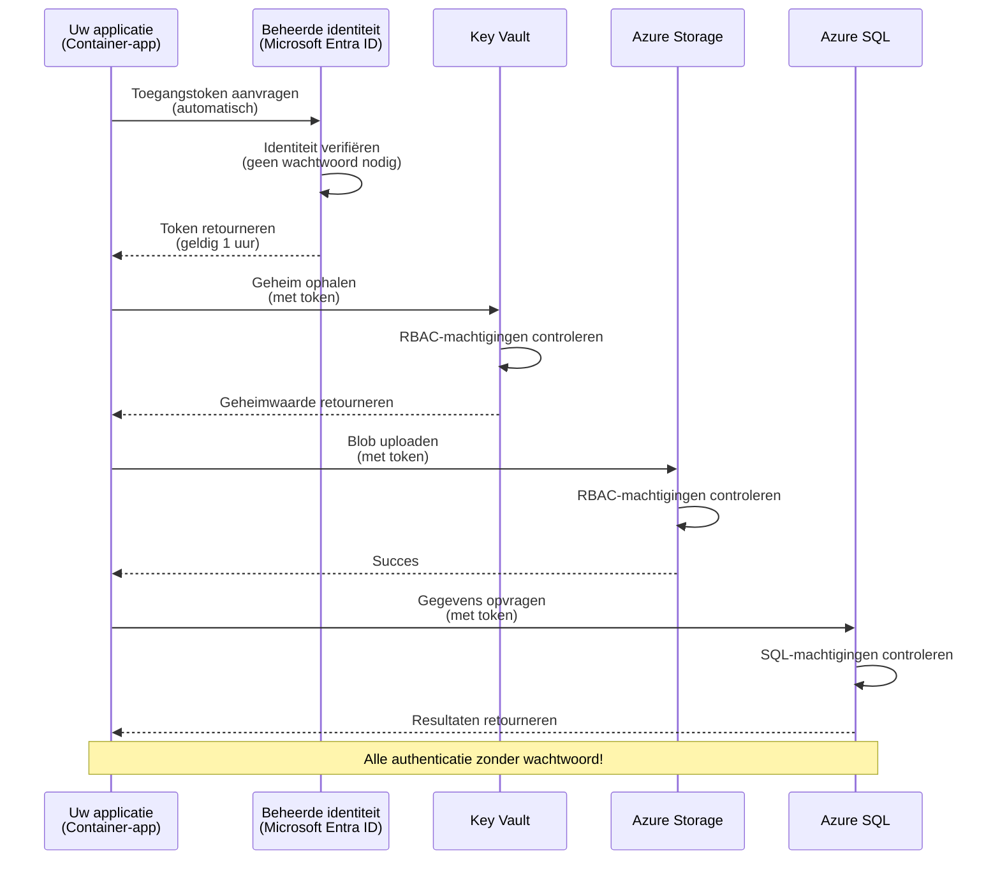
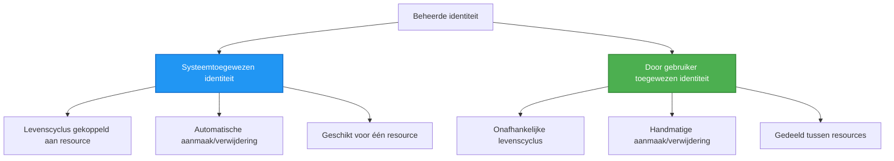

# Authenticatiepatronen en Beheerde identiteit

⏱️ **Geschatte tijd**: 45-60 minuten | 💰 **Kostenimpact**: Gratis (geen extra kosten) | ⭐ **Complexiteit**: Gemiddeld

**📚 Leerpad:**
- ← Vorige: [Configuratiebeheer](configuration.md) - Omgevingsvariabelen en geheimen beheren
- 🎯 **Je bent hier**: Authenticatie & Beveiliging (Beheerde identiteit, Key Vault, veilige patronen)
- → Volgende: [Eerste project](first-project.md) - Bouw je eerste AZD-applicatie
- 🏠 [Cursusstartpagina](../../README.md)

---

## Wat je zult leren

Door deze les te voltooien, zul je:
- Begrijpen van Azure-authenticatiepatronen (sleutels, connection strings, beheerde identiteit)
- Implementeer Beheerde identiteit voor wachtwoordloze authenticatie
- Beveilig geheimen met Azure Key Vault-integratie
- Configureer rolgebaseerde toegangscontrole (RBAC) voor AZD-implementaties
- Pas beveiligingsbest practices toe in Container Apps en Azure-services
- Migreer van sleutelgebaseerde naar identiteit-gebaseerde authenticatie

## Waarom Beheerde identiteit belangrijk is

### Het probleem: Traditionele authenticatie

**Voor Beheerde identiteit:**
```javascript
// ❌ BEVEILIGINGSRISICO: Hardgecodeerde geheimen in de code
const connectionString = "Server=mydb.database.windows.net;User=admin;Password=P@ssw0rd123";
const storageKey = "xK7mN9pQ2wR5tY8uI0oP3aS6dF1gH4jK...";
const cosmosKey = "C2x7B9n4M1p8Q5w3E6r0T2y5U8i1O4p7...";
```

**Problemen:**
- 🔴 **Blootgestelde geheimen** in code, configbestanden, omgevingsvariabelen
- 🔴 **Rotatie van referenties** vereist code-aanpassingen en opnieuw implementeren
- 🔴 **Audit-nachtmerries** - wie heeft wat, wanneer?
- 🔴 **Verspreiding** - geheimen verspreid over meerdere systemen
- 🔴 **Compliancerisico's** - faalt beveiligingsaudits

### De oplossing: Beheerde identiteit

**Na Beheerde identiteit:**
```javascript
// ✅ VEILIG: Geen geheimen in de code
const credential = new DefaultAzureCredential();
const client = new BlobServiceClient(
  "https://mystorageaccount.blob.core.windows.net",
  credential  // Azure handelt authenticatie automatisch af
);
```

**Voordelen:**
- ✅ **Geen geheimen** in code of configuratie
- ✅ **Automatische rotatie** - Azure regelt dit
- ✅ **Volledige audittrail** in Microsoft Entra ID-logs
- ✅ **Gecentraliseerde beveiliging** - beheer in het Azure-portal
- ✅ **Compliance-klaar** - voldoet aan beveiligingsstandaarden

**Analogie**: Traditionele authenticatie is alsof je meerdere fysieke sleutels voor verschillende deuren bij je draagt. Beheerde identiteit is alsof je een beveiligingsbadge hebt die automatisch toegang verleent op basis van wie je bent—geen sleutels om te verliezen, te kopiëren of te roteren.

---

## Architectuuroverzicht

### Authenticatiestroom met Beheerde identiteit



### Typen beheerde identiteiten



| Feature | System-Assigned | User-Assigned |
|---------|----------------|---------------|
| **Lifecycle** | Gebonden aan resource | Onafhankelijk |
| **Creation** | Automatisch met resource | Handmatige aanmaak |
| **Deletion** | Verwijderd met resource | Blijft bestaan na verwijderen van resource |
| **Sharing** | Eén resource alleen | Meerdere resources |
| **Use Case** | Eenvoudige scenario's | Complexe multi-resource scenario's |
| **AZD Default** | ✅ Aanbevolen | Optioneel |

---

## Vereisten

### Vereiste tools

Je zou deze al geïnstalleerd moeten hebben vanuit eerdere lessen:

```bash
# Controleer Azure Developer CLI
azd version
# ✅ Verwacht: azd versie 1.0.0 of hoger

# Controleer Azure CLI
az --version
# ✅ Verwacht: azure-cli 2.50.0 of hoger
```

### Azure-vereisten

- Actief Azure-abonnement
- Rechten om:
  - Beheerde identiteiten maken
  - RBAC-rollen toewijzen
  - Key Vault-resources maken
  - Container Apps implementeren

### Vereiste voorkennis

Je zou voltooid moeten hebben:
- [Installatiegids](installation.md) - AZD-installatie
- [AZD Basics](azd-basics.md) - Kernconcepten
- [Configuratiebeheer](configuration.md) - Omgevingsvariabelen

---

## Les 1: Begrijpen van authenticatiepatronen

### Patroon 1: Connection strings (Verouderd - vermijden)

**Hoe het werkt:**
```bash
# Verbindingsreeks bevat referenties
STORAGE_CONNECTION_STRING="DefaultEndpointsProtocol=https;AccountName=myaccount;AccountKey=xK7mN9pQ2wR5..."
COSMOS_CONNECTION_STRING="AccountEndpoint=https://myaccount.documents.azure.com:443/;AccountKey=C2x7..."
SQL_CONNECTION_STRING="Server=myserver.database.windows.net;User=admin;Password=P@ssw0rd..."
```

**Problemen:**
- ❌ Geheimen zichtbaar in omgevingsvariabelen
- ❌ Gelogd in implementatiesystemen
- ❌ Moeilijk te roteren
- ❌ Geen audittrail van toegang

**Wanneer te gebruiken:** Alleen voor lokale ontwikkeling, nooit in productie.

---

### Patroon 2: Key Vault-referenties (Beter)

**Hoe het werkt:**
```bicep
// Store secret in Key Vault
resource keyVault 'Microsoft.KeyVault/vaults@2023-02-01' = {
  name: 'mykv'
  properties: {
    enableRbacAuthorization: true
  }
}

// Reference in Container App
env: [
  {
    name: 'STORAGE_KEY'
    secretRef: 'storage-key'  // References Key Vault
  }
]
```

**Voordelen:**
- ✅ Geheimen veilig opgeslagen in Key Vault
- ✅ Gecentraliseerd geheimbeheer
- ✅ Rotatie zonder codewijzigingen

**Beperkingen:**
- ⚠️ Nog steeds gebruik van sleutels/wachtwoorden
- ⚠️ Moet toegang tot Key Vault beheren

**Wanneer te gebruiken:** Overstapstap van connection strings naar beheerde identiteit.

---

### Patroon 3: Beheerde identiteit (Beste praktijk)

**Hoe het werkt:**
```bicep
// Enable managed identity
resource containerApp 'Microsoft.App/containerApps@2023-05-01' = {
  name: 'myapp'
  identity: {
    type: 'SystemAssigned'  // Automatically creates identity
  }
}

// Grant permissions
resource roleAssignment 'Microsoft.Authorization/roleAssignments@2022-04-01' = {
  scope: storageAccount
  properties: {
    roleDefinitionId: storageBlobDataContributorRole
    principalId: containerApp.identity.principalId
  }
}
```

**Applicatiecode:**
```javascript
// Geen geheimen nodig!
const { DefaultAzureCredential } = require('@azure/identity');
const { BlobServiceClient } = require('@azure/storage-blob');

const credential = new DefaultAzureCredential();
const blobServiceClient = new BlobServiceClient(
  'https://mystorageaccount.blob.core.windows.net',
  credential
);
```

**Voordelen:**
- ✅ Geen geheimen in code/config
- ✅ Automatische rotatie van referenties
- ✅ Volledige audittrail
- ✅ Machtigingen op basis van RBAC
- ✅ Compliance-klaar

**Wanneer te gebruiken:** Altijd, voor productieapplicaties.

---

### Patroon 4: Service Principals (CI/CD & Automatisering)

Beheerde identiteit is de gouden standaard *voor resources die binnen Azure draaien*. Maar wat te doen met zaken die **buiten** Azure draaien — zoals een CI/CD-pijplijn op een build-agent, of een script op je laptop dat je interactieve login niet kan gebruiken? Daar komt een **service principal** om de hoek kijken: een niet-menselijke identiteit met eigen referenties waarmee een geautomatiseerd proces kan inloggen.

**Hoe het werkt:**

Maak een service principal die is gescopeerd naar een resourcegroep (met minimaal noodzakelijke rechten):

```bash
az ad sp create-for-rbac \
  --name "myapp-cicd" \
  --role contributor \
  --scopes /subscriptions/<sub-id>/resourceGroups/<rg-name>
```

Dit print een client-ID, client-secret en tenant-ID. azd kan hier niet-interactief mee inloggen:

```bash
azd auth login \
  --client-id "<appId>" \
  --client-secret "<password>" \
  --tenant-id "<tenant>"
```

**Geef de voorkeur aan federated credentials (OIDC) boven secrets.** In plaats van een langlevend client-secret, configureer een federated credential zodat de pijplijn een kortlevend token uitwisselt—geen secret dat kan lekken of geroteerd moet worden:

```bash
azd auth login \
  --client-id "<appId>" \
  --federated-credential-provider "github" \
  --tenant-id "<tenant>"
```

> `azd pipeline config` richt dit automatisch voor je in. Zie de CI/CD-walkthroughs in [Hoofdstuk 8](../chapter-08-production/production-ai-practices.md).

**Voordelen:**
- ✅ Werkt buiten Azure (build agents, on-premises, andere clouds)
- ✅ Kan worden gescopeerd naar een enkele resourcegroep met één rol
- ✅ De federated (OIDC)-variant gebruikt geen opgeslagen secret

**Afwegingen:**
- ⚠️ Variant op basis van secrets vereist zorgvuldige opslag en rotatie
- ⚠️ Een gelekt secret verleent alle mogelijkheden die de SP heeft—houd de scopes klein

**Wanneer te gebruiken:** CI/CD-pijplijnen en automatisering die geen gebruik kunnen maken van beheerde identiteit. Geef altijd de voorkeur aan de **federated/OIDC**-variant boven een client-secret, en geef de voorkeur aan beheerde identiteit wanneer de workload binnen Azure draait.

**Veilig opslaan van referenties:**
- Nooit secrets committen—gebruik de geheime opslag van je pijplijn (GitHub Actions secrets, Azure DevOps variable groups / Key Vault).
- Beperk de scope van de SP tot de kleinste rol en resourcegroep die het nodig heeft.
- Stel een vervaldatum in en roteer, of elimineer het secret helemaal met OIDC.

---

## Les 2: Implementatie van Beheerde identiteit met AZD

### Stap-voor-stap implementatie

Laten we een veilige Container App bouwen die een beheerde identiteit gebruikt om toegang te krijgen tot Azure Storage en Key Vault.

### Projectstructuur

```
secure-app/
├── azure.yaml                 # AZD configuration
├── infra/
│   ├── main.bicep            # Main infrastructure
│   ├── core/
│   │   ├── identity.bicep    # Managed identity setup
│   │   ├── keyvault.bicep    # Key Vault configuration
│   │   └── storage.bicep     # Storage with RBAC
│   └── app/
│       └── container-app.bicep
└── src/
    ├── app.js                # Application code
    ├── package.json
    └── Dockerfile
```

### 1. Configureer AZD (azure.yaml)

```yaml
name: secure-app
metadata:
  template: secure-app@1.0.0

services:
  api:
    project: ./src
    language: js
    host: containerapp

# Enable managed identity (AZD handles this automatically)
```

### 2. Infrastructuur: Beheerde identiteit inschakelen

**Bestand: `infra/main.bicep`**

```bicep
targetScope = 'subscription'

param environmentName string
param location string = 'eastus'

var tags = { 'azd-env-name': environmentName }

// Resource group
resource rg 'Microsoft.Resources/resourceGroups@2021-04-01' = {
  name: 'rg-${environmentName}'
  location: location
  tags: tags
}

// Storage Account
module storage './core/storage.bicep' = {
  name: 'storage'
  scope: rg
  params: {
    name: 'st${uniqueString(rg.id)}'
    location: location
    tags: tags
  }
}

// Key Vault
module keyVault './core/keyvault.bicep' = {
  name: 'keyvault'
  scope: rg
  params: {
    name: 'kv-${uniqueString(rg.id)}'
    location: location
    tags: tags
  }
}

// Container App with Managed Identity
module containerApp './app/container-app.bicep' = {
  name: 'container-app'
  scope: rg
  params: {
    name: 'ca-${environmentName}'
    location: location
    tags: tags
    storageAccountName: storage.outputs.name
    keyVaultName: keyVault.outputs.name
  }
}

// Grant Container App access to Storage
module storageRoleAssignment './core/role-assignment.bicep' = {
  name: 'storage-role'
  scope: rg
  params: {
    principalId: containerApp.outputs.identityPrincipalId
    roleDefinitionId: 'ba92f5b4-2d11-453d-a403-e96b0029c9fe'  // Storage Blob Data Contributor
    targetResourceId: storage.outputs.id
  }
}

// Grant Container App access to Key Vault
module kvRoleAssignment './core/role-assignment.bicep' = {
  name: 'kv-role'
  scope: rg
  params: {
    principalId: containerApp.outputs.identityPrincipalId
    roleDefinitionId: '4633458b-17de-408a-b874-0445c86b69e6'  // Key Vault Secrets User
    targetResourceId: keyVault.outputs.id
  }
}

// Outputs
output AZURE_STORAGE_ACCOUNT_NAME string = storage.outputs.name
output AZURE_KEY_VAULT_NAME string = keyVault.outputs.name
output APP_URL string = containerApp.outputs.url
```

### 3. Container App met systeem-toegewezen identiteit

**Bestand: `infra/app/container-app.bicep`**

```bicep
param name string
param location string
param tags object = {}
param storageAccountName string
param keyVaultName string

resource containerApp 'Microsoft.App/containerApps@2023-05-01' = {
  name: name
  location: location
  tags: tags
  identity: {
    type: 'SystemAssigned'  // 🔑 Enable managed identity
  }
  properties: {
    configuration: {
      ingress: {
        external: true
        targetPort: 3000
      }
    }
    template: {
      containers: [
        {
          name: 'api'
          image: 'myregistry.azurecr.io/api:latest'
          resources: {
            cpu: json('0.5')
            memory: '1Gi'
          }
          env: [
            {
              name: 'AZURE_STORAGE_ACCOUNT_NAME'
              value: storageAccountName
            }
            {
              name: 'AZURE_KEY_VAULT_NAME'
              value: keyVaultName
            }
            // 🔑 No secrets - managed identity handles authentication!
          ]
        }
      ]
    }
  }
}

// Output the identity for RBAC assignments
output identityPrincipalId string = containerApp.identity.principalId
output id string = containerApp.id
output url string = 'https://${containerApp.properties.configuration.ingress.fqdn}'
```

### 4. RBAC-roltoewijzingsmodule

**Bestand: `infra/core/role-assignment.bicep`**

```bicep
param principalId string
param roleDefinitionId string  // Azure built-in role ID
param targetResourceId string

resource roleAssignment 'Microsoft.Authorization/roleAssignments@2022-04-01' = {
  name: guid(principalId, roleDefinitionId, targetResourceId)
  scope: resourceId('Microsoft.Resources/resourceGroups', resourceGroup().name)
  properties: {
    roleDefinitionId: subscriptionResourceId('Microsoft.Authorization/roleDefinitions', roleDefinitionId)
    principalId: principalId
    principalType: 'ServicePrincipal'
  }
}

output id string = roleAssignment.id
```

### 5. Applicatiecode met Beheerde identiteit

**Bestand: `src/app.js`**

```javascript
const express = require('express');
const { DefaultAzureCredential } = require('@azure/identity');
const { BlobServiceClient } = require('@azure/storage-blob');
const { SecretClient } = require('@azure/keyvault-secrets');

const app = express();
const PORT = process.env.PORT || 3000;

// 🔑 Initialiseer referentie (werkt automatisch met beheerde identiteit)
const credential = new DefaultAzureCredential();

// Azure Storage-configuratie
const storageAccountName = process.env.AZURE_STORAGE_ACCOUNT_NAME;
const blobServiceClient = new BlobServiceClient(
  `https://${storageAccountName}.blob.core.windows.net`,
  credential  // Geen sleutels nodig!
);

// Key Vault-configuratie
const keyVaultName = process.env.AZURE_KEY_VAULT_NAME;
const secretClient = new SecretClient(
  `https://${keyVaultName}.vault.azure.net`,
  credential  // Geen sleutels nodig!
);

// Gezondheidscontrole
app.get('/health', (req, res) => {
  res.json({ status: 'healthy', authentication: 'managed-identity' });
});

// Bestand uploaden naar blobopslag
app.post('/upload', async (req, res) => {
  try {
    const containerClient = blobServiceClient.getContainerClient('uploads');
    await containerClient.createIfNotExists();
    
    const blobName = `file-${Date.now()}.txt`;
    const blockBlobClient = containerClient.getBlockBlobClient(blobName);
    
    await blockBlobClient.upload('Hello from managed identity!', 30);
    
    res.json({
      success: true,
      blobName: blobName,
      message: 'File uploaded using managed identity!'
    });
  } catch (error) {
    console.error('Upload error:', error);
    res.status(500).json({ error: error.message });
  }
});

// Haal geheim op uit Key Vault
app.get('/secret/:name', async (req, res) => {
  try {
    const secretName = req.params.name;
    const secret = await secretClient.getSecret(secretName);
    
    res.json({
      name: secretName,
      value: secret.value,
      message: 'Secret retrieved using managed identity!'
    });
  } catch (error) {
    console.error('Secret error:', error);
    res.status(500).json({ error: error.message });
  }
});

// Lijst blobcontainers (demonstreert leesrechten)
app.get('/containers', async (req, res) => {
  try {
    const containers = [];
    for await (const container of blobServiceClient.listContainers()) {
      containers.push(container.name);
    }
    
    res.json({
      containers: containers,
      count: containers.length,
      message: 'Containers listed using managed identity!'
    });
  } catch (error) {
    console.error('List error:', error);
    res.status(500).json({ error: error.message });
  }
});

app.listen(PORT, () => {
  console.log(`Secure API listening on port ${PORT}`);
  console.log('Authentication: Managed Identity (passwordless)');
});
```

**Bestand: `src/package.json`**

```json
{
  "name": "secure-app",
  "version": "1.0.0",
  "dependencies": {
    "express": "^4.18.2",
    "@azure/identity": "^4.0.0",
    "@azure/storage-blob": "^12.17.0",
    "@azure/keyvault-secrets": "^4.7.0"
  },
  "scripts": {
    "start": "node app.js"
  }
}
```

### 6. Implementeren en testen

```bash
# Initialiseer AZD-omgeving
azd init

# Implementeer infrastructuur en applicatie
azd up

# Haal de app-URL op
APP_URL=$(azd env get-values | grep APP_URL | cut -d '=' -f2 | tr -d '"')

# Test de healthcheck
curl $APP_URL/health
```

**✅ Verwachte output:**
```json
{
  "status": "healthy",
  "authentication": "managed-identity"
}
```

**Test blob-upload:**
```bash
curl -X POST $APP_URL/upload
```

**✅ Verwachte output:**
```json
{
  "success": true,
  "blobName": "file-1700404800000.txt",
  "message": "File uploaded using managed identity!"
}
```

**Test containerlijst:**
```bash
curl $APP_URL/containers
```

**✅ Verwachte output:**
```json
{
  "containers": ["uploads"],
  "count": 1,
  "message": "Containers listed using managed identity!"
}
```

---

## Veelvoorkomende Azure RBAC-rollen

### Ingebouwde rol-ID's voor beheerde identiteit

| Service | Rolnaam | Rol-ID | Machtigingen |
|---------|-----------|---------|-------------|
| **Storage** | Storage Blob Data Reader | `2a2b9908-6b94-4a3d-8e5a-a7d8f8cc8a12` | Blobs en containers lezen |
| **Storage** | Storage Blob Data Contributor | `ba92f5b4-2d11-453d-a403-e96b0029c9fe` | Blobs lezen, schrijven, verwijderen |
| **Storage** | Storage Queue Data Contributor | `974c5e8b-45b9-4653-ba55-5f855dd0fb88` | Wachtrijberichten lezen, schrijven, verwijderen |
| **Key Vault** | Key Vault Secrets User | `4633458b-17de-408a-b874-0445c86b69e6` | Geheimen lezen |
| **Key Vault** | Key Vault Secrets Officer | `b86a8fe4-44ce-4948-aee5-eccb2c155cd7` | Geheimen lezen, schrijven, verwijderen |
| **Cosmos DB** | Cosmos DB Built-in Data Reader | `00000000-0000-0000-0000-000000000001` | Cosmos DB-gegevens lezen |
| **Cosmos DB** | Cosmos DB Built-in Data Contributor | `00000000-0000-0000-0000-000000000002` | Cosmos DB-gegevens lezen en schrijven |
| **SQL Database** | SQL DB Contributor | `9b7fa17d-e63e-47b0-bb0a-15c516ac86ec` | SQL-databases beheren |
| **Service Bus** | Azure Service Bus Data Owner | `090c5cfd-751d-490a-894a-3ce6f1109419` | Berichten verzenden, ontvangen en beheren |

### Hoe rol-ID's te vinden

```bash
# Toon alle ingebouwde rollen
az role definition list --query "[].{Name:roleName, ID:name}" --output table

# Zoek naar een specifieke rol
az role definition list --query "[?contains(roleName, 'Storage Blob')].{Name:roleName, ID:name}" --output table

# Rolgegevens ophalen
az role definition list --name "Storage Blob Data Contributor"
```

---

## Praktische oefeningen

### Oefening 1: Beheerde identiteit inschakelen voor bestaande app ⭐⭐ (Gemiddeld)

**Doel**: Voeg een beheerde identiteit toe aan een bestaande Container App-implementatie

**Scenario**: Je hebt een Container App die connection strings gebruikt. Converteer deze naar beheerde identiteit.

**Beginsituatie**: Container App met deze configuratie:

```bicep
// ❌ Current: Using connection string
env: [
  {
    name: 'STORAGE_CONNECTION_STRING'
    secretRef: 'storage-connection'
  }
]
```

**Stappen**:

1. **Schakel beheerde identiteit in in Bicep:**

```bicep
resource containerApp 'Microsoft.App/containerApps@2023-05-01' = {
  name: 'myapp'
  identity: {
    type: 'SystemAssigned'  // Add this
  }
  // ... rest of configuration
}
```

2. **Verleen Storage-toegang:**

```bicep
// Get storage account reference
resource storageAccount 'Microsoft.Storage/storageAccounts@2023-01-01' existing = {
  name: storageAccountName
}

// Assign role
resource roleAssignment 'Microsoft.Authorization/roleAssignments@2022-04-01' = {
  name: guid(containerApp.id, 'ba92f5b4-2d11-453d-a403-e96b0029c9fe', storageAccount.id)
  scope: storageAccount
  properties: {
    roleDefinitionId: subscriptionResourceId('Microsoft.Authorization/roleDefinitions', 'ba92f5b4-2d11-453d-a403-e96b0029c9fe')
    principalId: containerApp.identity.principalId
    principalType: 'ServicePrincipal'
  }
}
```

3. **Werk applicatiecode bij:**

**Voorheen (connection string):**
```javascript
const { BlobServiceClient } = require('@azure/storage-blob');

const blobServiceClient = BlobServiceClient.fromConnectionString(
  process.env.STORAGE_CONNECTION_STRING
);
```

**Na (beheerde identiteit):**
```javascript
const { DefaultAzureCredential } = require('@azure/identity');
const { BlobServiceClient } = require('@azure/storage-blob');

const credential = new DefaultAzureCredential();
const blobServiceClient = new BlobServiceClient(
  `https://${process.env.STORAGE_ACCOUNT_NAME}.blob.core.windows.net`,
  credential
);
```

4. **Werk omgevingsvariabelen bij:**

```bicep
env: [
  {
    name: 'STORAGE_ACCOUNT_NAME'
    value: storageAccountName  // Just the name, no secrets!
  }
  // Remove STORAGE_CONNECTION_STRING
]
```

5. **Implementeer en test:**

```bash
# Opnieuw uitrollen
azd up

# Controleer of het nog steeds werkt
curl https://myapp.azurecontainerapps.io/upload
```

**✅ Succescriteria:**
- ✅ Applicatie implementeert zonder fouten
- ✅ Storage-bewerkingen werken (upload, lijst, download)
- ✅ Geen connection strings in omgevingsvariabelen
- ✅ Identiteit zichtbaar in Azure Portal onder het "Identity" blade

**Verificatie:**

```bash
# Controleer of de beheerde identiteit is ingeschakeld
az containerapp show \
  --name myapp \
  --resource-group rg-myapp \
  --query "identity.type"
# ✅ Verwacht: "SystemAssigned"

# Controleer roltoewijzing
az role assignment list \
  --assignee $(az containerapp show --name myapp --resource-group rg-myapp --query "identity.principalId" -o tsv) \
  --scope /subscriptions/{sub-id}/resourceGroups/rg-myapp/providers/Microsoft.Storage/storageAccounts/mystorageaccount
# ✅ Verwacht: Toont de rol "Storage Blob Data Contributor"
```

**Tijd**: 20-30 minuten

---

### Oefening 2: Multi-service toegang met door gebruiker toegewezen identiteit ⭐⭐⭐ (Geavanceerd)

**Doel**: Maak een door gebruiker toegewezen identiteit die gedeeld wordt door meerdere Container Apps

**Scenario**: Je hebt 3 microservices die allemaal toegang nodig hebben tot hetzelfde Storage-account en Key Vault.

**Stappen**:

1. **Maak door gebruiker toegewezen identiteit:**

**Bestand: `infra/core/identity.bicep`**

```bicep
param name string
param location string
param tags object = {}

resource userAssignedIdentity 'Microsoft.ManagedIdentity/userAssignedIdentities@2023-01-31' = {
  name: name
  location: location
  tags: tags
}

output id string = userAssignedIdentity.id
output principalId string = userAssignedIdentity.properties.principalId
output clientId string = userAssignedIdentity.properties.clientId
```

2. **Wijs rollen toe aan door gebruiker toegewezen identiteit:**

```bicep
// In main.bicep
module userIdentity './core/identity.bicep' = {
  name: 'user-identity'
  scope: rg
  params: {
    name: 'id-${environmentName}'
    location: location
    tags: tags
  }
}

// Grant Storage access
resource storageRoleAssignment 'Microsoft.Authorization/roleAssignments@2022-04-01' = {
  name: guid(userIdentity.outputs.principalId, 'storage-contributor')
  scope: storageAccount
  properties: {
    roleDefinitionId: subscriptionResourceId('Microsoft.Authorization/roleDefinitions', 'ba92f5b4-2d11-453d-a403-e96b0029c9fe')
    principalId: userIdentity.outputs.principalId
    principalType: 'ServicePrincipal'
  }
}

// Grant Key Vault access
resource kvRoleAssignment 'Microsoft.Authorization/roleAssignments@2022-04-01' = {
  name: guid(userIdentity.outputs.principalId, 'kv-secrets-user')
  scope: keyVault
  properties: {
    roleDefinitionId: subscriptionResourceId('Microsoft.Authorization/roleDefinitions', '4633458b-17de-408a-b874-0445c86b69e6')
    principalId: userIdentity.outputs.principalId
    principalType: 'ServicePrincipal'
  }
}
```

3. **Wijs identiteit toe aan meerdere Container Apps:**

```bicep
resource apiGateway 'Microsoft.App/containerApps@2023-05-01' = {
  name: 'api-gateway'
  identity: {
    type: 'UserAssigned'
    userAssignedIdentities: {
      '${userIdentity.outputs.id}': {}
    }
  }
  // ... rest of config
}

resource productService 'Microsoft.App/containerApps@2023-05-01' = {
  name: 'product-service'
  identity: {
    type: 'UserAssigned'
    userAssignedIdentities: {
      '${userIdentity.outputs.id}': {}
    }
  }
  // ... rest of config
}

resource orderService 'Microsoft.App/containerApps@2023-05-01' = {
  name: 'order-service'
  identity: {
    type: 'UserAssigned'
    userAssignedIdentities: {
      '${userIdentity.outputs.id}': {}
    }
  }
  // ... rest of config
}
```

4. **Applicatiecode (alle services gebruiken hetzelfde patroon):**

```javascript
const { DefaultAzureCredential, ManagedIdentityCredential } = require('@azure/identity');

// Voor een door de gebruiker toegewezen identiteit, geef de client-ID op
const credential = new ManagedIdentityCredential(
  process.env.AZURE_CLIENT_ID  // Client-ID van de door de gebruiker toegewezen identiteit
);

// Of gebruik DefaultAzureCredential (detecteert automatisch)
const credential = new DefaultAzureCredential();

const blobServiceClient = new BlobServiceClient(
  `https://${process.env.STORAGE_ACCOUNT_NAME}.blob.core.windows.net`,
  credential
);
```

5. **Implementeer en verifieer:**

```bash
azd up

# Test of alle services toegang hebben tot opslag
curl https://api-gateway.azurecontainerapps.io/upload
curl https://product-service.azurecontainerapps.io/upload
curl https://order-service.azurecontainerapps.io/upload
```

**✅ Succescriteria:**
- ✅ Eén identiteit gedeeld door 3 services
- ✅ Alle services kunnen Storage en Key Vault benaderen
- ✅ Identiteit blijft bestaan als je één service verwijdert
- ✅ Gecentraliseerd permissiebeheer

**Voordelen van door gebruiker toegewezen identiteit:**
- Één identiteit om te beheren
- Consistente machtigingen over services heen
- Overleeft het verwijderen van een service
- Beter voor complexe architecturen

**Tijd**: 30-40 minuten

---

### Oefening 3: Implementeren van Key Vault-secretrotatie ⭐⭐⭐ (Geavanceerd)

**Doel**: Sla API-sleutels van derden op in Key Vault en geef er toegang toe met een beheerde identiteit

**Scenario**: Je app moet een externe API aanroepen (OpenAI, Stripe, SendGrid) die API-sleutels vereist.

**Stappen**:

1. **Maak Key Vault met RBAC:**

**Bestand: `infra/core/keyvault.bicep`**

```bicep
param name string
param location string
param tags object = {}

resource keyVault 'Microsoft.KeyVault/vaults@2023-02-01' = {
  name: name
  location: location
  tags: tags
  properties: {
    enableRbacAuthorization: true  // Use RBAC instead of access policies
    sku: {
      family: 'A'
      name: 'standard'
    }
    tenantId: subscription().tenantId
    enableSoftDelete: true
    softDeleteRetentionInDays: 90
  }
}

// Allow Container App to read secrets
output id string = keyVault.id
output name string = keyVault.name
output uri string = keyVault.properties.vaultUri
```

2. **Sla geheimen op in Key Vault:**

```bash
# Haal Key Vault-naam op
KV_NAME=$(azd env get-values | grep AZURE_KEY_VAULT_NAME | cut -d '=' -f2 | tr -d '"')

# Sla API-sleutels van derden op
az keyvault secret set \
  --vault-name $KV_NAME \
  --name "OpenAI-ApiKey" \
  --value "sk-proj-xxxxxxxxxxxxx"

az keyvault secret set \
  --vault-name $KV_NAME \
  --name "Stripe-ApiKey" \
  --value "sk_live_xxxxxxxxxxxxx"

az keyvault secret set \
  --vault-name $KV_NAME \
  --name "SendGrid-ApiKey" \
  --value "SG.xxxxxxxxxxxxx"
```

3. **Applicatiecode om geheimen op te halen:**

**Bestand: `src/config.js`**

```javascript
const { DefaultAzureCredential } = require('@azure/identity');
const { SecretClient } = require('@azure/keyvault-secrets');

class Config {
  constructor() {
    this.credential = new DefaultAzureCredential();
    this.secretClient = new SecretClient(
      `https://${process.env.AZURE_KEY_VAULT_NAME}.vault.azure.net`,
      this.credential
    );
    this.cache = {};
  }

  async getSecret(secretName) {
    // Controleer eerst de cache
    if (this.cache[secretName]) {
      return this.cache[secretName];
    }

    try {
      const secret = await this.secretClient.getSecret(secretName);
      this.cache[secretName] = secret.value;
      console.log(`✅ Retrieved secret: ${secretName}`);
      return secret.value;
    } catch (error) {
      console.error(`❌ Failed to get secret ${secretName}:`, error.message);
      throw error;
    }
  }

  async getOpenAIKey() {
    return this.getSecret('OpenAI-ApiKey');
  }

  async getStripeKey() {
    return this.getSecret('Stripe-ApiKey');
  }

  async getSendGridKey() {
    return this.getSecret('SendGrid-ApiKey');
  }
}

module.exports = new Config();
```

4. **Gebruik geheimen in de applicatie:**

**Bestand: `src/app.js`**

```javascript
const express = require('express');
const config = require('./config');
const { OpenAI } = require('openai');

const app = express();

// Initialiseer OpenAI met de sleutel uit Key Vault
let openaiClient;

async function initializeServices() {
  const openaiKey = await config.getOpenAIKey();
  openaiClient = new OpenAI({ apiKey: openaiKey });
  console.log('✅ Services initialized with secrets from Key Vault');
}

// Aanroepen bij opstarten
initializeServices().catch(console.error);

app.post('/chat', async (req, res) => {
  try {
    const completion = await openaiClient.chat.completions.create({
      model: 'gpt-4.1',
      messages: [{ role: 'user', content: 'Hello!' }]
    });
    
    res.json({
      response: completion.choices[0].message.content,
      authentication: 'Key from Key Vault via Managed Identity'
    });
  } catch (error) {
    res.status(500).json({ error: error.message });
  }
});

app.listen(3000, () => {
  console.log('Secure API with Key Vault integration running');
});
```

5. **Implementeer en test:**

```bash
azd up

# Testen of API-sleutels werken
curl -X POST https://myapp.azurecontainerapps.io/chat \
  -H "Content-Type: application/json" \
  -d '{"message":"Hello AI"}'
```

**✅ Succescriteria:**
- ✅ Geen API-sleutels in code of omgevingsvariabelen
- ✅ Applicatie haalt sleutels op uit Key Vault
- ✅ API's van derden functioneren correct
- ✅ Sleutels kunnen worden geroteerd zonder codewijzigingen

**Draai een geheim:**

```bash
# Werk het geheim bij in Key Vault
az keyvault secret set \
  --vault-name $KV_NAME \
  --name "OpenAI-ApiKey" \
  --value "sk-proj-NEW_KEY_HERE"

# Start de app opnieuw om de nieuwe sleutel te gebruiken
az containerapp revision restart \
  --name myapp \
  --resource-group rg-myapp
```

**Tijd**: 25-35 minuten

---

## Kennischeckpoint

### 1. Authenticatiepatronen ✓

Test je begrip:

- [ ] **Q1**: Wat zijn de drie belangrijkste authenticatiepatronen? 
  - **A**: Verbindingsreeksen (legacy), Key Vault-verwijzingen (transitie), Managed Identity (beste)

- [ ] **Q2**: Waarom is Managed Identity beter dan connection strings?
  - **A**: Geen geheimen in code, automatische rotatie, volledige audittrail, RBAC-permissies

- [ ] **Q3**: Wanneer zou je een user-assigned identity gebruiken in plaats van een system-assigned identity?
  - **A**: Wanneer je identiteit deelt over meerdere resources of wanneer de levenscyclus van de identiteit onafhankelijk is van de levenscyclus van de resource

**Praktische verificatie:**
```bash
# Controleer welk type identiteit uw app gebruikt
az containerapp show \
  --name myapp \
  --resource-group rg-myapp \
  --query "identity.type"

# Toon alle roltoewijzingen voor de identiteit
az role assignment list \
  --assignee $(az containerapp show --name myapp --resource-group rg-myapp --query "identity.principalId" -o tsv)
```

---

### 2. RBAC en machtigingen ✓

Test je begrip:

- [ ] **Q1**: Wat is de role ID voor "Storage Blob Data Contributor"?
  - **A**: `ba92f5b4-2d11-453d-a403-e96b0029c9fe`

- [ ] **Q2**: Welke permissies biedt "Key Vault Secrets User"?
  - **A**: Alleen-lezen toegang tot geheimen (kan niet aanmaken, bijwerken of verwijderen)

- [ ] **Q3**: Hoe geef je een Container App toegang tot Azure SQL?
  - **A**: Ken de rol "SQL DB Contributor" toe of configureer Microsoft Entra ID-authenticatie voor SQL

**Praktische verificatie:**
```bash
# Vind een specifieke rol
az role definition list --name "Storage Blob Data Contributor"

# Controleer welke rollen aan je identiteit zijn toegewezen
PRINCIPAL_ID=$(az containerapp show --name myapp --resource-group rg-myapp --query "identity.principalId" -o tsv)
az role assignment list --assignee $PRINCIPAL_ID --output table
```

---

### 3. Key Vault-integratie ✓

Test je begrip:

- [ ] **Q1**: Hoe schakel je RBAC in voor Key Vault in plaats van toegangsbeleidsregels?
  - **A**: Zet `enableRbacAuthorization: true` in Bicep

- [ ] **Q2**: Welke Azure SDK-bibliotheek behandelt managed identity-authenticatie?
  - **A**: `@azure/identity` met de `DefaultAzureCredential`-klasse

- [ ] **Q3**: Hoelang blijven Key Vault-secrets in de cache?
  - **A**: Afhankelijk van de applicatie; implementeer je eigen cachingstrategie

**Praktische verificatie:**
```bash
# Toegang tot Key Vault testen
az keyvault secret show \
  --vault-name $KV_NAME \
  --name "OpenAI-ApiKey" \
  --query "value"

# Controleer of RBAC is ingeschakeld
az keyvault show \
  --name $KV_NAME \
  --query "properties.enableRbacAuthorization"
# ✅ Verwacht: true
```

---

## Beste beveiligingspraktijken

### ✅ AANBEVOLEN:

1. **Gebruik altijd Managed Identity in productie**
   ```bicep
   identity: {
     type: 'SystemAssigned'
   }
   ```

2. **Gebruik RBAC-rollen met minimaal noodzakelijke rechten**
   - Gebruik waar mogelijk de "Reader"-rol
   - Vermijd "Owner" of "Contributor" tenzij nodig

3. **Sla sleutels van derden op in Key Vault**
   ```javascript
   const apiKey = await secretClient.getSecret('ThirdPartyApiKey');
   ```

4. **Schakel audit logging in**
   ```bicep
   diagnosticSettings: {
     logs: [{ category: 'AuditEvent', enabled: true }]
   }
   ```

5. **Gebruik verschillende identiteiten voor dev/staging/prod**
   ```bash
   azd env new dev
   azd env new staging
   azd env new prod
   ```

6. **Roteer secrets regelmatig**
   - Stel vervaldatums in voor Key Vault-secrets
   - Automatiseer rotatie met Azure Functions

### ❌ NIET DOEN:

1. **Hardcode nooit secrets**
   ```javascript
   // ❌ SLECHT
   const apiKey = "sk-proj-xxxxxxxxxxxxx";
   ```

2. **Gebruik geen connection strings in productie**
   ```javascript
   // ❌ SLECHT
   BlobServiceClient.fromConnectionString(process.env.STORAGE_CONNECTION_STRING)
   ```

3. **Ken geen overmatige permissies toe**
   ```bicep
   // ❌ BAD - too much access
   roleDefinitionId: 'Owner'
   
   // ✅ GOOD - least privilege
   roleDefinitionId: 'Storage Blob Data Reader'
   ```

4. **Log geen secrets**
   ```javascript
   // ❌ SLECHT
   console.log('API Key:', apiKey);
   
   // ✅ GOED
   console.log('API Key retrieved successfully');
   ```

5. **Deel geen productie-identiteiten tussen omgevingen**
   ```bicep
   // ❌ BAD - same identity for dev and prod
   // ✅ GOOD - separate identities per environment
   ```

---

## Probleemoplossingsgids

### Probleem: "Unauthorized" bij toegang tot Azure Storage

**Symptomen:**
```
Error: Unauthorized (403)
AuthorizationPermissionMismatch: This request is not authorized to perform this operation
```

**Diagnose:**

```bash
# Controleer of de beheerde identiteit is ingeschakeld
az containerapp show \
  --name myapp \
  --resource-group rg-myapp \
  --query "identity.type"
# ✅ Verwacht: "SystemAssigned" of "UserAssigned"

# Controleer roltoewijzingen
PRINCIPAL_ID=$(az containerapp show --name myapp --resource-group rg-myapp --query "identity.principalId" -o tsv)
az role assignment list --assignee $PRINCIPAL_ID

# Verwacht: U zou "Storage Blob Data Contributor" of een vergelijkbare rol moeten zien
```

**Oplossingen:**

1. **Ken de juiste RBAC-rol toe:**
```bash
STORAGE_ID=$(az storage account show --name mystorageaccount --resource-group rg-myapp --query "id" -o tsv)
az role assignment create \
  --assignee $PRINCIPAL_ID \
  --role "Storage Blob Data Contributor" \
  --scope $STORAGE_ID
```

2. **Wacht op propagatie (kan 5-10 minuten duren):**
```bash
# Controleer de status van de roltoewijzing
az role assignment list --assignee $PRINCIPAL_ID --scope $STORAGE_ID
```

3. **Controleer of de applicatiecode de juiste credentials gebruikt:**
```javascript
// Zorg ervoor dat je DefaultAzureCredential gebruikt
const credential = new DefaultAzureCredential();
```

---

### Probleem: Toegang tot Key Vault geweigerd

**Symptomen:**
```
Error: Forbidden (403)
The user, group or application does not have secrets get permission
```

**Diagnose:**

```bash
# Controleer of Key Vault RBAC is ingeschakeld
az keyvault show \
  --name $KV_NAME \
  --query "properties.enableRbacAuthorization"
# ✅ Verwacht: true

# Controleer roltoewijzingen
az role assignment list \
  --assignee $PRINCIPAL_ID \
  --scope /subscriptions/{sub-id}/resourceGroups/rg-myapp/providers/Microsoft.KeyVault/vaults/$KV_NAME
```

**Oplossingen:**

1. **Schakel RBAC in op Key Vault:**
```bash
az keyvault update \
  --name $KV_NAME \
  --enable-rbac-authorization true
```

2. **Ken de rol Key Vault Secrets User toe:**
```bash
KV_ID=$(az keyvault show --name $KV_NAME --query "id" -o tsv)
az role assignment create \
  --assignee $PRINCIPAL_ID \
  --role "Key Vault Secrets User" \
  --scope $KV_ID
```

---

### Probleem: DefaultAzureCredential faalt lokaal

**Symptomen:**
```
Error: DefaultAzureCredential failed to retrieve a token
CredentialUnavailableError: No credential available
```

**Diagnose:**

```bash
# Controleer of je bent ingelogd
az account show

# Controleer de authenticatie van de Azure CLI
az ad signed-in-user show
```

**Oplossingen:**

1. **Log in bij Azure CLI:**
```bash
az login
```

2. **Stel de Azure-subscriptie in:**
```bash
az account set --subscription "Your Subscription Name"
```

3. **Voor lokale ontwikkeling: gebruik omgevingsvariabelen:**
```bash
export AZURE_TENANT_ID="your-tenant-id"
export AZURE_CLIENT_ID="your-client-id"
export AZURE_CLIENT_SECRET="your-client-secret"
```

4. **Of gebruik lokaal een andere credential:**
```javascript
const { DefaultAzureCredential, AzureCliCredential } = require('@azure/identity');

// Gebruik AzureCliCredential voor lokale ontwikkeling
const credential = process.env.NODE_ENV === 'production' 
  ? new DefaultAzureCredential()
  : new AzureCliCredential();
```

---

### Probleem: Toewijzing van rollen doet er te lang over om te propageren

**Symptomen:**
- Rol succesvol toegewezen
- Krijgt nog steeds 403-fouten
- Intermitterende toegang (soms werkt het, soms niet)

**Uitleg:**
Wijzigingen in Azure RBAC kunnen 5-10 minuten duren voordat ze wereldwijd zijn doorgevoerd.

**Oplossing:**

```bash
# Wacht en probeer het opnieuw
echo "Waiting for RBAC propagation..."
sleep 300  # Wacht 5 minuten

# Test toegang
curl https://myapp.azurecontainerapps.io/upload

# Als het nog steeds niet werkt, start de app opnieuw
az containerapp revision restart \
  --name myapp \
  --resource-group rg-myapp
```

---

## Kostenoverwegingen

### Kosten van Managed Identity

| Bron | Kosten |
|----------|------|
| **Managed Identity** | 🆓 **GRATIS** - Geen kosten |
| **RBAC-roltoewijzingen** | 🆓 **GRATIS** - Geen kosten |
| **Microsoft Entra ID-tokenaanvragen** | 🆓 **GRATIS** - Inbegrepen |
| **Key Vault-operaties** | $0.03 per 10,000 operations |
| **Key Vault-opslag** | $0.024 per secret per month |

**Managed Identity bespaart geld door:**
- ✅ Het elimineren van Key Vault-bewerkingen voor service-tot-service-authenticatie
- ✅ Het verminderen van beveiligingsincidenten (geen gelekte inloggegevens)
- ✅ Vermindering van operationele overhead (geen handmatige rotatie)

**Voorbeeld kostenvergelijking (maandelijks):**

| Scenario | Connection strings | Managed Identity | Besparing |
|----------|-------------------|-----------------|---------|
| Small app (1M requests) | ~$50 (Key Vault + bewerkingen) | ~$0 | $50/maand |
| Medium app (10M requests) | ~$200 | ~$0 | $200/maand |
| Large app (100M requests) | ~$1,500 | ~$0 | $1,500/maand |

---

## Meer informatie

### Officiële documentatie
- [Azure Managed Identity](https://learn.microsoft.com/entra/identity/managed-identities-azure-resources/overview)
- [Azure RBAC](https://learn.microsoft.com/azure/role-based-access-control/overview)
- [Azure Key Vault](https://learn.microsoft.com/azure/key-vault/general/overview)
- [DefaultAzureCredential](https://learn.microsoft.com/dotnet/api/azure.identity.defaultazurecredential)

### SDK-documentatie
- [@azure/identity (Node.js)](https://www.npmjs.com/package/@azure/identity)
- [Azure.Identity (C#)](https://www.nuget.org/packages/Azure.Identity/)
- [azure-identity (Python)](https://pypi.org/project/azure-identity/)

### Volgende stappen in deze cursus
- ← Vorige: [Configuratiebeheer](configuration.md)
- → Volgende: [Eerste project](first-project.md)
- 🏠 [Cursus startpagina](../../README.md)

### Gerelateerde voorbeelden
- [Microsoft Foundry Models Chat-voorbeeld](../../../../examples/azure-openai-chat) - Gebruikt managed identity voor Microsoft Foundry Models
- [Microservices-voorbeeld](../../../../examples/microservices) - Authenticatiepatronen voor meerdere services

---

## Samenvatting

**Je hebt geleerd:**
- ✅ Drie authenticatiepatronen (connection strings, Key Vault, Managed Identity)
- ✅ Hoe Managed Identity in AZD te activeren en configureren
- ✅ RBAC-roltoewijzingen voor Azure-services
- ✅ Key Vault-integratie voor secrets van derden
- ✅ User-assigned versus system-assigned identities
- ✅ Beveiligingsbest practices en probleemoplossing

**Belangrijkste punten:**
1. **Gebruik altijd Managed Identity in productie** - Geen geheimen, automatische rotatie
2. **Gebruik RBAC-rollen met minimaal noodzakelijke rechten** - Ken alleen de benodigde permissies toe
3. **Bewaar sleutels van derden in Key Vault** - Gecentraliseerd geheimbeheer
4. **Scheiding van identiteiten per omgeving** - Isolatie tussen dev, staging, prod
5. **Schakel audit logging in** - Houd bij wie wat heeft geraadpleegd

**Volgende stappen:**
1. Voltooi bovenstaande praktische oefeningen
2. Migreer een bestaande app van connection strings naar Managed Identity
3. Bouw je eerste AZD-project met beveiliging vanaf dag één: [Eerste project](first-project.md)

---

<!-- CO-OP TRANSLATOR DISCLAIMER START -->
**Disclaimer**:
Dit document is vertaald met behulp van de AI vertaaldienst [Co-op Translator](https://github.com/Azure/co-op-translator). Hoewel we streven naar nauwkeurigheid, dient u er rekening mee te houden dat geautomatiseerde vertalingen fouten of onnauwkeurigheden kunnen bevatten. Het originele document in de oorspronkelijke taal moet worden beschouwd als de gezaghebbende bron. Voor kritieke informatie wordt professionele menselijke vertaling aanbevolen. Wij zijn niet aansprakelijk voor eventuele misverstanden of verkeerde interpretaties die voortvloeien uit het gebruik van deze vertaling.
<!-- CO-OP TRANSLATOR DISCLAIMER END -->