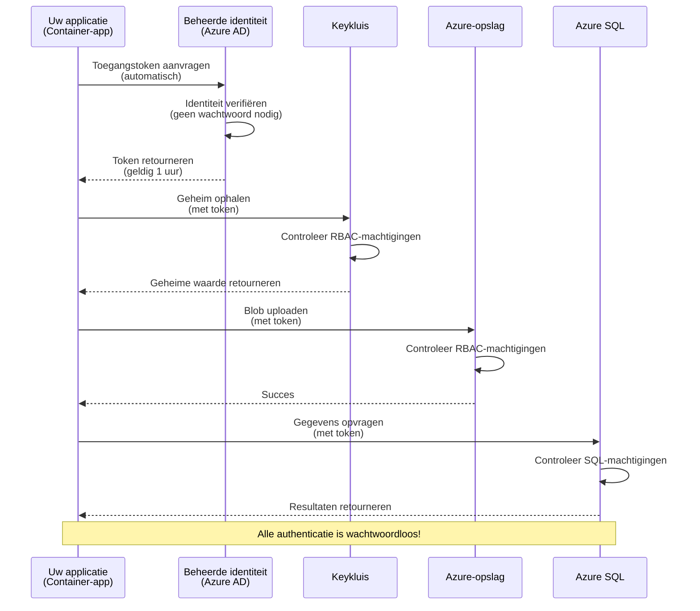
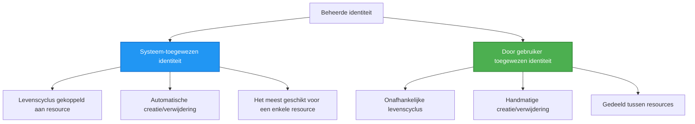

# Authenticatiepatronen en Beheerde identiteit

⏱️ **Geschatte tijd**: 45-60 minuten | 💰 **Kostenimpact**: Gratis (geen extra kosten) | ⭐ **Complexiteit**: Midden

**📚 Leerlijn:**
- ← Vorige: [Configuratiebeheer](configuration.md) - Omgevingsvariabelen en geheimen beheren
- 🎯 **Je bevindt je hier**: Authenticatie & Beveiliging (Beheerde identiteit, Key Vault, beveiligde patronen)
- → Volgende: [Eerste project](first-project.md) - Bouw je eerste AZD-applicatie
- 🏠 [Cursusstart](../../README.md)

---

## Wat je zult leren

Door deze les te voltooien, leer je:
- Begrijp Azure-authenticatiepatronen (sleutels, connectiestrings, beheerde identiteit)
- Implementeer **Beheerde identiteit** voor wachtwoordloze authenticatie
- Beveilig geheimen met **Azure Key Vault**-integratie
- Configureer **role-based access control (RBAC)** voor AZD-implementaties
- Pas beveiligingsbest practices toe in Container Apps en Azure-services
- Migreer van sleutelgebaseerde naar identiteitsgebaseerde authenticatie

## Waarom beheerde identiteit belangrijk is

### Het probleem: Traditionele authenticatie

**Voor beheerde identiteit:**
```javascript
// ❌ BEVEILIGINGSRISICO: Hardgecodeerde geheimen in de code
const connectionString = "Server=mydb.database.windows.net;User=admin;Password=P@ssw0rd123";
const storageKey = "xK7mN9pQ2wR5tY8uI0oP3aS6dF1gH4jK...";
const cosmosKey = "C2x7B9n4M1p8Q5w3E6r0T2y5U8i1O4p7...";
```

**Problemen:**
- 🔴 **Blootgestelde geheimen** in code, configuratiebestanden, omgevingsvariabelen
- 🔴 **Rotatie van referenties** vereist codewijzigingen en herimplementatie
- 🔴 **Audit nachtmerries** - wie had wanneer toegang tot wat?
- 🔴 **Verspreiding** - geheimen verspreid over meerdere systemen
- 🔴 **Compliance-risico's** - faalt beveiligingsaudits

### De oplossing: Beheerde identiteit

**Na beheerde identiteit:**
```javascript
// ✅ VEILIG: Geen geheimen in de code
const credential = new DefaultAzureCredential();
const client = new BlobServiceClient(
  "https://mystorageaccount.blob.core.windows.net",
  credential  // Azure handelt authenticatie automatisch af
);
```

**Voordelen:**
- ✅ **Geen geheimen** in code of configuratie
- ✅ **Automatische rotatie** - Azure regelt dit
- ✅ **Volledige audittrail** in Azure AD-logboeken
- ✅ **Gecentraliseerde beveiliging** - beheer in de Azure Portal
- ✅ **Compliance-klaar** - voldoet aan beveiligingsnormen

**Analogie**: Traditionele authenticatie is als het dragen van meerdere fysieke sleutels voor verschillende deuren. Beheerde identiteit is als een beveiligingsbadge die automatisch toegang verleent op basis van wie je bent—geen sleutels om te verliezen, kopiëren of te roteren.

---

## Architectuuroverzicht

### Authenticatiestroom met beheerde identiteit


### Typen beheerde identiteiten


| Kenmerk | Systeemtoegewezen | Gebruiker-toegewezen |
|---------|----------------|---------------|
| **Levenscyclus** | Gekoppeld aan resource | Onafhankelijk |
| **Aanmaken** | Automatisch met resource | Handmatige aanmaak |
| **Verwijderen** | Verwijderd met resource | Blijft bestaan na verwijderen van resource |
| **Delen** | Alleen één resource | Meerdere resources |
| **Gebruiksscenario** | Eenvoudige scenario's | Complexe scenario's met meerdere resources |
| **AZD-standaard** | ✅ Aanbevolen | Optioneel |

---

## Vereisten

### Vereiste tools

Je zou deze al geïnstalleerd moeten hebben vanuit vorige lessen:

```bash
# Controleer Azure Developer CLI
azd version
# ✅ Verwacht: azd versie 1.0.0 of hoger

# Controleer Azure CLI
az --version
# ✅ Verwacht: azure-cli 2.50.0 of hoger
```

### Azure-vereisten

- Actief Azure-abonnement
- Machtigingen om:
  - Beheerde identiteiten maken
  - RBAC-rollen toewijzen
  - Key Vault-resources maken
  - Container Apps implementeren

### Vereiste voorkennis

Je zou het volgende afgerond moeten hebben:
- [Installatiehandleiding](installation.md) - AZD-installatie
- [AZD Basis](azd-basics.md) - Kernconcepten
- [Configuratiebeheer](configuration.md) - Omgevingsvariabelen

---

## Les 1: Authenticatiepatronen begrijpen

### Patroon 1: Connectiestrings (Verouderd - Vermijden)

**Hoe het werkt:**
```bash
# Verbindingsreeks bevat inloggegevens
STORAGE_CONNECTION_STRING="DefaultEndpointsProtocol=https;AccountName=myaccount;AccountKey=xK7mN9pQ2wR5..."
COSMOS_CONNECTION_STRING="AccountEndpoint=https://myaccount.documents.azure.com:443/;AccountKey=C2x7..."
SQL_CONNECTION_STRING="Server=myserver.database.windows.net;User=admin;Password=P@ssw0rd..."
```

**Problemen:**
- ❌ Geheimen zichtbaar in omgevingsvariabelen
- ❌ Gelogd in implementatiesystemen
- ❌ Moeilijk te roteren
- ❌ Geen audittrail van toegang

**Wanneer te gebruiken:** Alleen voor lokale ontwikkeling, nooit in productie.

---

### Patroon 2: Key Vault-referenties (Beter)

**Hoe het werkt:**
```bicep
// Store secret in Key Vault
resource keyVault 'Microsoft.KeyVault/vaults@2023-02-01' = {
  name: 'mykv'
  properties: {
    enableRbacAuthorization: true
  }
}

// Reference in Container App
env: [
  {
    name: 'STORAGE_KEY'
    secretRef: 'storage-key'  // References Key Vault
  }
]
```

**Voordelen:**
- ✅ Geheimen veilig opgeslagen in Key Vault
- ✅ Gecentraliseerd beheer van geheimen
- ✅ Rotatie zonder codewijzigingen

**Beperkingen:**
- ⚠️ Gebruikt nog steeds sleutels/wachtwoorden
- ⚠️ Toegang tot Key Vault moet beheerd worden

**Wanneer te gebruiken:** Overstapstap van connectiestrings naar beheerde identiteit.

---

### Patroon 3: Beheerde identiteit (Beste praktijk)

**Hoe het werkt:**
```bicep
// Enable managed identity
resource containerApp 'Microsoft.App/containerApps@2023-05-01' = {
  name: 'myapp'
  identity: {
    type: 'SystemAssigned'  // Automatically creates identity
  }
}

// Grant permissions
resource roleAssignment 'Microsoft.Authorization/roleAssignments@2022-04-01' = {
  scope: storageAccount
  properties: {
    roleDefinitionId: storageBlobDataContributorRole
    principalId: containerApp.identity.principalId
  }
}
```

**Applicatiecode:**
```javascript
// Geen geheimen nodig!
const { DefaultAzureCredential } = require('@azure/identity');
const { BlobServiceClient } = require('@azure/storage-blob');

const credential = new DefaultAzureCredential();
const blobServiceClient = new BlobServiceClient(
  'https://mystorageaccount.blob.core.windows.net',
  credential
);
```

**Voordelen:**
- ✅ Geen geheimen in code/config
- ✅ Automatische referentierotatie
- ✅ Volledige audittrail
- ✅ RBAC-gebaseerde machtigingen
- ✅ Compliance-klaar

**Wanneer te gebruiken:** Altijd, voor productieapplicaties.

---

## Les 2: Beheerde identiteit implementeren met AZD

### Stapsgewijze implementatie

Laten we een veilige Container App bouwen die een beheerde identiteit gebruikt om toegang te krijgen tot Azure Storage en Key Vault.

### Projectstructuur

```
secure-app/
├── azure.yaml                 # AZD configuration
├── infra/
│   ├── main.bicep            # Main infrastructure
│   ├── core/
│   │   ├── identity.bicep    # Managed identity setup
│   │   ├── keyvault.bicep    # Key Vault configuration
│   │   └── storage.bicep     # Storage with RBAC
│   └── app/
│       └── container-app.bicep
└── src/
    ├── app.js                # Application code
    ├── package.json
    └── Dockerfile
```

### 1. AZD configureren (azure.yaml)

```yaml
name: secure-app
metadata:
  template: secure-app@1.0.0

services:
  api:
    project: ./src
    language: js
    host: containerapp

# Enable managed identity (AZD handles this automatically)
```

### 2. Infrastructuur: Beheerde identiteit inschakelen

**Bestand: `infra/main.bicep`**

```bicep
targetScope = 'subscription'

param environmentName string
param location string = 'eastus'

var tags = { 'azd-env-name': environmentName }

// Resource group
resource rg 'Microsoft.Resources/resourceGroups@2021-04-01' = {
  name: 'rg-${environmentName}'
  location: location
  tags: tags
}

// Storage Account
module storage './core/storage.bicep' = {
  name: 'storage'
  scope: rg
  params: {
    name: 'st${uniqueString(rg.id)}'
    location: location
    tags: tags
  }
}

// Key Vault
module keyVault './core/keyvault.bicep' = {
  name: 'keyvault'
  scope: rg
  params: {
    name: 'kv-${uniqueString(rg.id)}'
    location: location
    tags: tags
  }
}

// Container App with Managed Identity
module containerApp './app/container-app.bicep' = {
  name: 'container-app'
  scope: rg
  params: {
    name: 'ca-${environmentName}'
    location: location
    tags: tags
    storageAccountName: storage.outputs.name
    keyVaultName: keyVault.outputs.name
  }
}

// Grant Container App access to Storage
module storageRoleAssignment './core/role-assignment.bicep' = {
  name: 'storage-role'
  scope: rg
  params: {
    principalId: containerApp.outputs.identityPrincipalId
    roleDefinitionId: 'ba92f5b4-2d11-453d-a403-e96b0029c9fe'  // Storage Blob Data Contributor
    targetResourceId: storage.outputs.id
  }
}

// Grant Container App access to Key Vault
module kvRoleAssignment './core/role-assignment.bicep' = {
  name: 'kv-role'
  scope: rg
  params: {
    principalId: containerApp.outputs.identityPrincipalId
    roleDefinitionId: '4633458b-17de-408a-b874-0445c86b69e6'  // Key Vault Secrets User
    targetResourceId: keyVault.outputs.id
  }
}

// Outputs
output AZURE_STORAGE_ACCOUNT_NAME string = storage.outputs.name
output AZURE_KEY_VAULT_NAME string = keyVault.outputs.name
output APP_URL string = containerApp.outputs.url
```

### 3. Container App met systeemtoegewezen identiteit

**Bestand: `infra/app/container-app.bicep`**

```bicep
param name string
param location string
param tags object = {}
param storageAccountName string
param keyVaultName string

resource containerApp 'Microsoft.App/containerApps@2023-05-01' = {
  name: name
  location: location
  tags: tags
  identity: {
    type: 'SystemAssigned'  // 🔑 Enable managed identity
  }
  properties: {
    configuration: {
      ingress: {
        external: true
        targetPort: 3000
      }
    }
    template: {
      containers: [
        {
          name: 'api'
          image: 'myregistry.azurecr.io/api:latest'
          resources: {
            cpu: json('0.5')
            memory: '1Gi'
          }
          env: [
            {
              name: 'AZURE_STORAGE_ACCOUNT_NAME'
              value: storageAccountName
            }
            {
              name: 'AZURE_KEY_VAULT_NAME'
              value: keyVaultName
            }
            // 🔑 No secrets - managed identity handles authentication!
          ]
        }
      ]
    }
  }
}

// Output the identity for RBAC assignments
output identityPrincipalId string = containerApp.identity.principalId
output id string = containerApp.id
output url string = 'https://${containerApp.properties.configuration.ingress.fqdn}'
```

### 4. RBAC-roltoewijzingsmodule

**Bestand: `infra/core/role-assignment.bicep`**

```bicep
param principalId string
param roleDefinitionId string  // Azure built-in role ID
param targetResourceId string

resource roleAssignment 'Microsoft.Authorization/roleAssignments@2022-04-01' = {
  name: guid(principalId, roleDefinitionId, targetResourceId)
  scope: resourceId('Microsoft.Resources/resourceGroups', resourceGroup().name)
  properties: {
    roleDefinitionId: subscriptionResourceId('Microsoft.Authorization/roleDefinitions', roleDefinitionId)
    principalId: principalId
    principalType: 'ServicePrincipal'
  }
}

output id string = roleAssignment.id
```

### 5. Applicatiecode met beheerde identiteit

**Bestand: `src/app.js`**

```javascript
const express = require('express');
const { DefaultAzureCredential } = require('@azure/identity');
const { BlobServiceClient } = require('@azure/storage-blob');
const { SecretClient } = require('@azure/keyvault-secrets');

const app = express();
const PORT = process.env.PORT || 3000;

// 🔑 Initialiseer referentie (werkt automatisch met beheerde identiteit)
const credential = new DefaultAzureCredential();

// Azure Storage-configuratie
const storageAccountName = process.env.AZURE_STORAGE_ACCOUNT_NAME;
const blobServiceClient = new BlobServiceClient(
  `https://${storageAccountName}.blob.core.windows.net`,
  credential  // Geen sleutels nodig!
);

// Key Vault-configuratie
const keyVaultName = process.env.AZURE_KEY_VAULT_NAME;
const secretClient = new SecretClient(
  `https://${keyVaultName}.vault.azure.net`,
  credential  // Geen sleutels nodig!
);

// Gezondheidscontrole
app.get('/health', (req, res) => {
  res.json({ status: 'healthy', authentication: 'managed-identity' });
});

// Bestand uploaden naar blobopslag
app.post('/upload', async (req, res) => {
  try {
    const containerClient = blobServiceClient.getContainerClient('uploads');
    await containerClient.createIfNotExists();
    
    const blobName = `file-${Date.now()}.txt`;
    const blockBlobClient = containerClient.getBlockBlobClient(blobName);
    
    await blockBlobClient.upload('Hello from managed identity!', 30);
    
    res.json({
      success: true,
      blobName: blobName,
      message: 'File uploaded using managed identity!'
    });
  } catch (error) {
    console.error('Upload error:', error);
    res.status(500).json({ error: error.message });
  }
});

// Geheim ophalen uit Key Vault
app.get('/secret/:name', async (req, res) => {
  try {
    const secretName = req.params.name;
    const secret = await secretClient.getSecret(secretName);
    
    res.json({
      name: secretName,
      value: secret.value,
      message: 'Secret retrieved using managed identity!'
    });
  } catch (error) {
    console.error('Secret error:', error);
    res.status(500).json({ error: error.message });
  }
});

// Blobcontainers weergeven (toont leesrechten)
app.get('/containers', async (req, res) => {
  try {
    const containers = [];
    for await (const container of blobServiceClient.listContainers()) {
      containers.push(container.name);
    }
    
    res.json({
      containers: containers,
      count: containers.length,
      message: 'Containers listed using managed identity!'
    });
  } catch (error) {
    console.error('List error:', error);
    res.status(500).json({ error: error.message });
  }
});

app.listen(PORT, () => {
  console.log(`Secure API listening on port ${PORT}`);
  console.log('Authentication: Managed Identity (passwordless)');
});
```

**Bestand: `src/package.json`**

```json
{
  "name": "secure-app",
  "version": "1.0.0",
  "dependencies": {
    "express": "^4.18.2",
    "@azure/identity": "^4.0.0",
    "@azure/storage-blob": "^12.17.0",
    "@azure/keyvault-secrets": "^4.7.0"
  },
  "scripts": {
    "start": "node app.js"
  }
}
```

### 6. Implementeren en testen

```bash
# Initialiseer de AZD-omgeving
azd init

# Implementeer infrastructuur en applicatie
azd up

# Haal de app-URL op
APP_URL=$(azd env get-values | grep APP_URL | cut -d '=' -f2 | tr -d '"')

# Test de healthcheck
curl $APP_URL/health
```

**✅ Verwachte uitvoer:**
```json
{
  "status": "healthy",
  "authentication": "managed-identity"
}
```

**Test blob-upload:**
```bash
curl -X POST $APP_URL/upload
```

**✅ Verwachte uitvoer:**
```json
{
  "success": true,
  "blobName": "file-1700404800000.txt",
  "message": "File uploaded using managed identity!"
}
```

**Test containerlijst:**
```bash
curl $APP_URL/containers
```

**✅ Verwachte uitvoer:**
```json
{
  "containers": ["uploads"],
  "count": 1,
  "message": "Containers listed using managed identity!"
}
```

---

## Veelvoorkomende Azure RBAC-rollen

### Ingebouwde rol-ID's voor beheerde identiteit

| Service | Rolnaam | Rol-ID | Machtigingen |
|---------|-----------|---------|-------------|
| **Storage** | Storage Blob Data Reader | `2a2b9908-6b94-4a3d-8e5a-a7d8f8cc8a12` | Blobs en containers lezen |
| **Storage** | Storage Blob Data Contributor | `ba92f5b4-2d11-453d-a403-e96b0029c9fe` | Lezen, schrijven, verwijderen van blobs |
| **Storage** | Storage Queue Data Contributor | `974c5e8b-45b9-4653-ba55-5f855dd0fb88` | Lezen, schrijven, verwijderen van wachtrijberichten |
| **Key Vault** | Key Vault Secrets User | `4633458b-17de-408a-b874-0445c86b69e6` | Geheimen lezen |
| **Key Vault** | Key Vault Secrets Officer | `b86a8fe4-44ce-4948-aee5-eccb2c155cd7` | Lezen, schrijven, verwijderen van geheimen |
| **Cosmos DB** | Cosmos DB Built-in Data Reader | `00000000-0000-0000-0000-000000000001` | Cosmos DB-gegevens lezen |
| **Cosmos DB** | Cosmos DB Built-in Data Contributor | `00000000-0000-0000-0000-000000000002` | Cosmos DB-gegevens lezen en schrijven |
| **SQL Database** | SQL DB Contributor | `9b7fa17d-e63e-47b0-bb0a-15c516ac86ec` | Beheer SQL-databases |
| **Service Bus** | Azure Service Bus Data Owner | `090c5cfd-751d-490a-894a-3ce6f1109419` | Berichten verzenden, ontvangen en beheren |

### Hoe rol-ID's te vinden

```bash
# Lijst alle ingebouwde rollen
az role definition list --query "[].{Name:roleName, ID:name}" --output table

# Zoek naar een specifieke rol
az role definition list --query "[?contains(roleName, 'Storage Blob')].{Name:roleName, ID:name}" --output table

# Haal roldetails op
az role definition list --name "Storage Blob Data Contributor"
```

---

## Praktische oefeningen

### Oefening 1: Schakel beheerde identiteit in voor bestaande app ⭐⭐ (Middel)

**Doel**: Voeg een beheerde identiteit toe aan een bestaande Container App-implementatie

**Scenario**: Je hebt een Container App die connectiestrings gebruikt. Converteer deze naar beheerde identiteit.

**Startpunt**: Container App met deze configuratie:

```bicep
// ❌ Current: Using connection string
env: [
  {
    name: 'STORAGE_CONNECTION_STRING'
    secretRef: 'storage-connection'
  }
]
```

**Stappen**:

1. **Schakel beheerde identiteit in in Bicep:**

```bicep
resource containerApp 'Microsoft.App/containerApps@2023-05-01' = {
  name: 'myapp'
  identity: {
    type: 'SystemAssigned'  // Add this
  }
  // ... rest of configuration
}
```

2. **Verleen Storage-toegang:**

```bicep
// Get storage account reference
resource storageAccount 'Microsoft.Storage/storageAccounts@2023-01-01' existing = {
  name: storageAccountName
}

// Assign role
resource roleAssignment 'Microsoft.Authorization/roleAssignments@2022-04-01' = {
  name: guid(containerApp.id, 'ba92f5b4-2d11-453d-a403-e96b0029c9fe', storageAccount.id)
  scope: storageAccount
  properties: {
    roleDefinitionId: subscriptionResourceId('Microsoft.Authorization/roleDefinitions', 'ba92f5b4-2d11-453d-a403-e96b0029c9fe')
    principalId: containerApp.identity.principalId
    principalType: 'ServicePrincipal'
  }
}
```

3. **Werk applicatiecode bij:**

**Voor (connectiestring):**
```javascript
const { BlobServiceClient } = require('@azure/storage-blob');

const blobServiceClient = BlobServiceClient.fromConnectionString(
  process.env.STORAGE_CONNECTION_STRING
);
```

**Na (beheerde identiteit):**
```javascript
const { DefaultAzureCredential } = require('@azure/identity');
const { BlobServiceClient } = require('@azure/storage-blob');

const credential = new DefaultAzureCredential();
const blobServiceClient = new BlobServiceClient(
  `https://${process.env.STORAGE_ACCOUNT_NAME}.blob.core.windows.net`,
  credential
);
```

4. **Werk omgevingsvariabelen bij:**

```bicep
env: [
  {
    name: 'STORAGE_ACCOUNT_NAME'
    value: storageAccountName  // Just the name, no secrets!
  }
  // Remove STORAGE_CONNECTION_STRING
]
```

5. **Implementeer en test:**

```bash
# Opnieuw uitrollen
azd up

# Test of het nog steeds werkt
curl https://myapp.azurecontainerapps.io/upload
```

**✅ Succescriteria:**
- ✅ Applicatie wordt zonder fouten geïmplementeerd
- ✅ Storage-bewerkingen werken (upload, lijst, download)
- ✅ Geen connectiestrings in omgevingsvariabelen
- ✅ Identiteit zichtbaar in Azure Portal onder "Identity" blade

**Verificatie:**

```bash
# Controleer of de beheerde identiteit is ingeschakeld
az containerapp show \
  --name myapp \
  --resource-group rg-myapp \
  --query "identity.type"
# ✅ Verwacht: "SystemAssigned"

# Controleer de roltoewijzing
az role assignment list \
  --assignee $(az containerapp show --name myapp --resource-group rg-myapp --query "identity.principalId" -o tsv) \
  --scope /subscriptions/{sub-id}/resourceGroups/rg-myapp/providers/Microsoft.Storage/storageAccounts/mystorageaccount
# ✅ Verwacht: Toont de rol "Storage Blob Data Contributor"
```

**Tijd**: 20-30 minuten

---

### Oefening 2: Multi-service toegang met gebruiker-toegewezen identiteit ⭐⭐⭐ (Geavanceerd)

**Doel**: Maak een gebruiker-toegewezen identiteit die gedeeld wordt tussen meerdere Container Apps

**Scenario**: Je hebt 3 microservices die allemaal toegang nodig hebben tot hetzelfde Storage-account en Key Vault.

**Stappen**:

1. **Maak gebruiker-toegewezen identiteit aan:**

**Bestand: `infra/core/identity.bicep`**

```bicep
param name string
param location string
param tags object = {}

resource userAssignedIdentity 'Microsoft.ManagedIdentity/userAssignedIdentities@2023-01-31' = {
  name: name
  location: location
  tags: tags
}

output id string = userAssignedIdentity.id
output principalId string = userAssignedIdentity.properties.principalId
output clientId string = userAssignedIdentity.properties.clientId
```

2. **Wijs rollen toe aan de gebruiker-toegewezen identiteit:**

```bicep
// In main.bicep
module userIdentity './core/identity.bicep' = {
  name: 'user-identity'
  scope: rg
  params: {
    name: 'id-${environmentName}'
    location: location
    tags: tags
  }
}

// Grant Storage access
resource storageRoleAssignment 'Microsoft.Authorization/roleAssignments@2022-04-01' = {
  name: guid(userIdentity.outputs.principalId, 'storage-contributor')
  scope: storageAccount
  properties: {
    roleDefinitionId: subscriptionResourceId('Microsoft.Authorization/roleDefinitions', 'ba92f5b4-2d11-453d-a403-e96b0029c9fe')
    principalId: userIdentity.outputs.principalId
    principalType: 'ServicePrincipal'
  }
}

// Grant Key Vault access
resource kvRoleAssignment 'Microsoft.Authorization/roleAssignments@2022-04-01' = {
  name: guid(userIdentity.outputs.principalId, 'kv-secrets-user')
  scope: keyVault
  properties: {
    roleDefinitionId: subscriptionResourceId('Microsoft.Authorization/roleDefinitions', '4633458b-17de-408a-b874-0445c86b69e6')
    principalId: userIdentity.outputs.principalId
    principalType: 'ServicePrincipal'
  }
}
```

3. **Wijs identiteit toe aan meerdere Container Apps:**

```bicep
resource apiGateway 'Microsoft.App/containerApps@2023-05-01' = {
  name: 'api-gateway'
  identity: {
    type: 'UserAssigned'
    userAssignedIdentities: {
      '${userIdentity.outputs.id}': {}
    }
  }
  // ... rest of config
}

resource productService 'Microsoft.App/containerApps@2023-05-01' = {
  name: 'product-service'
  identity: {
    type: 'UserAssigned'
    userAssignedIdentities: {
      '${userIdentity.outputs.id}': {}
    }
  }
  // ... rest of config
}

resource orderService 'Microsoft.App/containerApps@2023-05-01' = {
  name: 'order-service'
  identity: {
    type: 'UserAssigned'
    userAssignedIdentities: {
      '${userIdentity.outputs.id}': {}
    }
  }
  // ... rest of config
}
```

4. **Applicatiecode (alle services gebruiken hetzelfde patroon):**

```javascript
const { DefaultAzureCredential, ManagedIdentityCredential } = require('@azure/identity');

// Voor een door de gebruiker toegewezen identiteit, geef de client-id op
const credential = new ManagedIdentityCredential(
  process.env.AZURE_CLIENT_ID  // Client-id van door de gebruiker toegewezen identiteit
);

// Of gebruik DefaultAzureCredential (detecteert automatisch)
const credential = new DefaultAzureCredential();

const blobServiceClient = new BlobServiceClient(
  `https://${process.env.STORAGE_ACCOUNT_NAME}.blob.core.windows.net`,
  credential
);
```

5. **Implementeer en verifieer:**

```bash
azd up

# Test of alle services toegang tot opslag hebben
curl https://api-gateway.azurecontainerapps.io/upload
curl https://product-service.azurecontainerapps.io/upload
curl https://order-service.azurecontainerapps.io/upload
```

**✅ Succescriteria:**
- ✅ Eén identiteit gedeeld door 3 services
- ✅ Alle services kunnen Storage en Key Vault bereiken
- ✅ Identiteit blijft bestaan als je één service verwijdert
- ✅ Gecentraliseerd permissiebeheer

**Voordelen van gebruiker-toegewezen identiteit:**
- Eén identiteit om te beheren
- Consistente machtigingen over services heen
- Overleeft het verwijderen van een service
- Beter voor complexe architecturen

**Tijd**: 30-40 minuten

---

### Oefening 3: Implementeer Key Vault-secretrotatie ⭐⭐⭐ (Geavanceerd)

**Doel**: Sla API-sleutels van derden op in Key Vault en krijg er toegang toe met een beheerde identiteit

**Scenario**: Je app moet een externe API aanroepen (OpenAI, Stripe, SendGrid) die API-sleutels vereist.

**Stappen**:

1. **Maak Key Vault met RBAC aan:**

**Bestand: `infra/core/keyvault.bicep`**

```bicep
param name string
param location string
param tags object = {}

resource keyVault 'Microsoft.KeyVault/vaults@2023-02-01' = {
  name: name
  location: location
  tags: tags
  properties: {
    enableRbacAuthorization: true  // Use RBAC instead of access policies
    sku: {
      family: 'A'
      name: 'standard'
    }
    tenantId: subscription().tenantId
    enableSoftDelete: true
    softDeleteRetentionInDays: 90
  }
}

// Allow Container App to read secrets
output id string = keyVault.id
output name string = keyVault.name
output uri string = keyVault.properties.vaultUri
```

2. **Sla geheimen op in Key Vault:**

```bash
# Haal Key Vault-naam op
KV_NAME=$(azd env get-values | grep AZURE_KEY_VAULT_NAME | cut -d '=' -f2 | tr -d '"')

# Sla API-sleutels van derden op
az keyvault secret set \
  --vault-name $KV_NAME \
  --name "OpenAI-ApiKey" \
  --value "sk-proj-xxxxxxxxxxxxx"

az keyvault secret set \
  --vault-name $KV_NAME \
  --name "Stripe-ApiKey" \
  --value "sk_live_xxxxxxxxxxxxx"

az keyvault secret set \
  --vault-name $KV_NAME \
  --name "SendGrid-ApiKey" \
  --value "SG.xxxxxxxxxxxxx"
```

3. **Applicatiecode om geheimen op te halen:**

**Bestand: `src/config.js`**

```javascript
const { DefaultAzureCredential } = require('@azure/identity');
const { SecretClient } = require('@azure/keyvault-secrets');

class Config {
  constructor() {
    this.credential = new DefaultAzureCredential();
    this.secretClient = new SecretClient(
      `https://${process.env.AZURE_KEY_VAULT_NAME}.vault.azure.net`,
      this.credential
    );
    this.cache = {};
  }

  async getSecret(secretName) {
    // Controleer eerst de cache
    if (this.cache[secretName]) {
      return this.cache[secretName];
    }

    try {
      const secret = await this.secretClient.getSecret(secretName);
      this.cache[secretName] = secret.value;
      console.log(`✅ Retrieved secret: ${secretName}`);
      return secret.value;
    } catch (error) {
      console.error(`❌ Failed to get secret ${secretName}:`, error.message);
      throw error;
    }
  }

  async getOpenAIKey() {
    return this.getSecret('OpenAI-ApiKey');
  }

  async getStripeKey() {
    return this.getSecret('Stripe-ApiKey');
  }

  async getSendGridKey() {
    return this.getSecret('SendGrid-ApiKey');
  }
}

module.exports = new Config();
```

4. **Gebruik geheimen in de applicatie:**

**Bestand: `src/app.js`**

```javascript
const express = require('express');
const config = require('./config');
const { OpenAI } = require('openai');

const app = express();

// Initialiseer OpenAI met sleutel uit Key Vault
let openaiClient;

async function initializeServices() {
  const openaiKey = await config.getOpenAIKey();
  openaiClient = new OpenAI({ apiKey: openaiKey });
  console.log('✅ Services initialized with secrets from Key Vault');
}

// Aanroepen bij opstarten
initializeServices().catch(console.error);

app.post('/chat', async (req, res) => {
  try {
    const completion = await openaiClient.chat.completions.create({
      model: 'gpt-4',
      messages: [{ role: 'user', content: 'Hello!' }]
    });
    
    res.json({
      response: completion.choices[0].message.content,
      authentication: 'Key from Key Vault via Managed Identity'
    });
  } catch (error) {
    res.status(500).json({ error: error.message });
  }
});

app.listen(3000, () => {
  console.log('Secure API with Key Vault integration running');
});
```

5. **Implementeer en test:**

```bash
azd up

# Testen of API-sleutels werken
curl -X POST https://myapp.azurecontainerapps.io/chat \
  -H "Content-Type: application/json" \
  -d '{"message":"Hello AI"}'
```

**✅ Succescriteria:**
- ✅ Geen API-sleutels in code of omgevingsvariabelen
- ✅ Applicatie haalt sleutels op uit Key Vault
- ✅ Derden-API's werken correct
- ✅ Sleutels kunnen geroteerd worden zonder codewijzigingen

**Geheim roteren:**

```bash
# Werk het geheim in Key Vault bij
az keyvault secret set \
  --vault-name $KV_NAME \
  --name "OpenAI-ApiKey" \
  --value "sk-proj-NEW_KEY_HERE"

# Herstart de app om de nieuwe sleutel te gebruiken
az containerapp revision restart \
  --name myapp \
  --resource-group rg-myapp
```

**Tijd**: 25-35 minuten

---

## Kennischeckpoint

### 1. Authenticatiepatronen ✓

Test je begrip:

- [ ] **Q1**: Wat zijn de drie belangrijkste authenticatiepatronen? 
  - **A**: Connectiestrings (verouderd), Key Vault-referenties (overgang), Beheerde identiteit (beste)

- [ ] **Q2**: Waarom is beheerde identiteit beter dan connectiestrings?
  - **A**: Geen geheimen in code, automatische rotatie, volledige audittrail, RBAC-machtigingen

- [ ] **Q3**: Wanneer zou je gebruiker-toegewezen identiteit gebruiken in plaats van systeemtoegewezen?
  - **A**: Wanneer je identiteit deelt tussen meerdere resources of wanneer de levenscyclus van de identiteit onafhankelijk is van de levenscyclus van de resource

**Hands-On verificatie:**
```bash
# Controleer welk type identiteit uw app gebruikt
az containerapp show \
  --name myapp \
  --resource-group rg-myapp \
  --query "identity.type"

# Toon alle roltoewijzingen voor de identiteit
az role assignment list \
  --assignee $(az containerapp show --name myapp --resource-group rg-myapp --query "identity.principalId" -o tsv)
```

---

### 2. RBAC en machtigingen ✓

Test je begrip:

- [ ] **Q1**: Wat is de rol-ID voor "Storage Blob Data Contributor"?
  - **A**: `ba92f5b4-2d11-453d-a403-e96b0029c9fe`

- [ ] **Q2**: Welke machtigingen geeft "Key Vault Secrets User"?
  - **A**: Alleen-lezen toegang tot geheimen (kan niet creëren, bijwerken of verwijderen)

- [ ] **Q3**: Hoe verleen je een Container App toegang tot Azure SQL?
  - **A**: Wijs de rol "SQL DB Contributor" toe of configureer Azure AD-authenticatie voor SQL

**Hands-On verificatie:**
```bash
# Zoek specifieke rol
az role definition list --name "Storage Blob Data Contributor"

# Controleer welke rollen aan jouw identiteit zijn toegewezen
PRINCIPAL_ID=$(az containerapp show --name myapp --resource-group rg-myapp --query "identity.principalId" -o tsv)
az role assignment list --assignee $PRINCIPAL_ID --output table
```

---

### 3. Key Vault-integratie ✓

Test je begrip:
- [ ] **Q1**: Hoe schakel je RBAC in voor Key Vault in plaats van toegangsbeleid?
  - **A**: Stel `enableRbacAuthorization: true` in Bicep in

- [ ] **Q2**: Welke Azure SDK-bibliotheek verzorgt authenticatie voor managed identity?
  - **A**: `@azure/identity` met de `DefaultAzureCredential`-klasse

- [ ] **Q3**: Hoe lang blijven Key Vault-geheimen in de cache?
  - **A**: Afhankelijk van de applicatie; implementeer je eigen cachingstrategie

**Hands-On Verification:**
```bash
# Test Key Vault-toegang
az keyvault secret show \
  --vault-name $KV_NAME \
  --name "OpenAI-ApiKey" \
  --query "value"

# Controleer of RBAC is ingeschakeld
az keyvault show \
  --name $KV_NAME \
  --query "properties.enableRbacAuthorization"
# ✅ Verwacht: true
```

---

## Beste beveiligingspraktijken

### ✅ TE DOEN:

1. **Gebruik altijd managed identity in productie**
   ```bicep
   identity: {
     type: 'SystemAssigned'
   }
   ```

2. **Gebruik RBAC-rollen met minimaal benodigde rechten**
   - Gebruik waar mogelijk de "Reader"-rol
   - Vermijd "Owner" of "Contributor" tenzij nodig

3. **Bewaar sleutels van derden in Key Vault**
   ```javascript
   const apiKey = await secretClient.getSecret('ThirdPartyApiKey');
   ```

4. **Schakel auditlogging in**
   ```bicep
   diagnosticSettings: {
     logs: [{ category: 'AuditEvent', enabled: true }]
   }
   ```

5. **Gebruik verschillende identiteiten voor dev/staging/prod**
   ```bash
   azd env new dev
   azd env new staging
   azd env new prod
   ```

6. **Draai geheimen regelmatig**
   - Stel vervaldatums in voor Key Vault-geheimen
   - Automatiseer rotatie met Azure Functions

### ❌ NIET DOEN:

1. **Nooit geheimen hardcoderen**
   ```javascript
   // ❌ SLECHT
   const apiKey = "sk-proj-xxxxxxxxxxxxx";
   ```

2. **Gebruik geen connection strings in productie**
   ```javascript
   // ❌ SLECHT
   BlobServiceClient.fromConnectionString(process.env.STORAGE_CONNECTION_STRING)
   ```

3. **Ken geen overmatige machtigingen toe**
   ```bicep
   // ❌ BAD - too much access
   roleDefinitionId: 'Owner'
   
   // ✅ GOOD - least privilege
   roleDefinitionId: 'Storage Blob Data Reader'
   ```

4. **Log geen geheimen**
   ```javascript
   // ❌ SLECHT
   console.log('API Key:', apiKey);
   
   // ✅ GOED
   console.log('API Key retrieved successfully');
   ```

5. **Deel productie-identiteiten niet tussen omgevingen**
   ```bicep
   // ❌ BAD - same identity for dev and prod
   // ✅ GOOD - separate identities per environment
   ```

---

## Gids voor probleemoplossing

### Probleem: "Unauthorized" bij toegang tot Azure Storage

**Symptomen:**
```
Error: Unauthorized (403)
AuthorizationPermissionMismatch: This request is not authorized to perform this operation
```

**Diagnose:**

```bash
# Controleer of de beheerde identiteit is ingeschakeld
az containerapp show \
  --name myapp \
  --resource-group rg-myapp \
  --query "identity.type"
# ✅ Verwacht: "SystemAssigned" of "UserAssigned"

# Controleer roltoewijzingen
PRINCIPAL_ID=$(az containerapp show --name myapp --resource-group rg-myapp --query "identity.principalId" -o tsv)
az role assignment list --assignee $PRINCIPAL_ID

# Verwacht: Moet "Storage Blob Data Contributor" of een vergelijkbare rol zien
```

**Oplossingen:**

1. **Ken de juiste RBAC-rol toe:**
```bash
STORAGE_ID=$(az storage account show --name mystorageaccount --resource-group rg-myapp --query "id" -o tsv)
az role assignment create \
  --assignee $PRINCIPAL_ID \
  --role "Storage Blob Data Contributor" \
  --scope $STORAGE_ID
```

2. **Wacht op propagatie (kan 5-10 minuten duren):**
```bash
# Controleer de status van de roltoewijzing
az role assignment list --assignee $PRINCIPAL_ID --scope $STORAGE_ID
```

3. **Controleer of de applicatiecode de juiste referenties gebruikt:**
```javascript
// Zorg ervoor dat u DefaultAzureCredential gebruikt
const credential = new DefaultAzureCredential();
```

---

### Probleem: Toegang tot Key Vault geweigerd

**Symptomen:**
```
Error: Forbidden (403)
The user, group or application does not have secrets get permission
```

**Diagnose:**

```bash
# Controleer of Key Vault RBAC is ingeschakeld
az keyvault show \
  --name $KV_NAME \
  --query "properties.enableRbacAuthorization"
# ✅ Verwacht: true

# Controleer roltoewijzingen
az role assignment list \
  --assignee $PRINCIPAL_ID \
  --scope /subscriptions/{sub-id}/resourceGroups/rg-myapp/providers/Microsoft.KeyVault/vaults/$KV_NAME
```

**Oplossingen:**

1. **Schakel RBAC in op Key Vault:**
```bash
az keyvault update \
  --name $KV_NAME \
  --enable-rbac-authorization true
```

2. **Ken de rol 'Key Vault Secrets User' toe:**
```bash
KV_ID=$(az keyvault show --name $KV_NAME --query "id" -o tsv)
az role assignment create \
  --assignee $PRINCIPAL_ID \
  --role "Key Vault Secrets User" \
  --scope $KV_ID
```

---

### Probleem: DefaultAzureCredential faalt lokaal

**Symptomen:**
```
Error: DefaultAzureCredential failed to retrieve a token
CredentialUnavailableError: No credential available
```

**Diagnose:**

```bash
# Controleer of je bent ingelogd
az account show

# Controleer de authenticatie van de Azure CLI
az ad signed-in-user show
```

**Oplossingen:**

1. **Log in bij Azure CLI:**
```bash
az login
```

2. **Stel het Azure-abonnement in:**
```bash
az account set --subscription "Your Subscription Name"
```

3. **Voor lokale ontwikkeling, gebruik omgevingsvariabelen:**
```bash
export AZURE_TENANT_ID="your-tenant-id"
export AZURE_CLIENT_ID="your-client-id"
export AZURE_CLIENT_SECRET="your-client-secret"
```

4. **Of gebruik lokaal een andere referentie:**
```javascript
const { DefaultAzureCredential, AzureCliCredential } = require('@azure/identity');

// Gebruik AzureCliCredential voor lokale ontwikkeling
const credential = process.env.NODE_ENV === 'production' 
  ? new DefaultAzureCredential()
  : new AzureCliCredential();
```

---

### Probleem: Roltoewijzing doet er te lang over om door te voeren

**Symptomen:**
- Rol succesvol toegewezen
- Ontvang nog steeds 403-fouten
- Intermitterende toegang (soms werkt het, soms niet)

**Uitleg:**
Azure RBAC-wijzigingen kunnen 5-10 minuten duren om wereldwijd door te voeren.

**Oplossing:**

```bash
# Wacht en probeer opnieuw
echo "Waiting for RBAC propagation..."
sleep 300  # Wacht 5 minuten

# Toegang testen
curl https://myapp.azurecontainerapps.io/upload

# Als het nog steeds niet werkt, herstart de app
az containerapp revision restart \
  --name myapp \
  --resource-group rg-myapp
```

---

## Kostenoverwegingen

### Kosten van Managed Identity

| Resource | Kosten |
|----------|------|
| **Managed Identity** | 🆓 **GRATIS** - Geen kosten |
| **RBAC-roltoewijzingen** | 🆓 **GRATIS** - Geen kosten |
| **Azure AD-tokenaanvragen** | 🆓 **GRATIS** - Inbegrepen |
| **Key Vault-bewerkingen** | $0.03 per 10.000 bewerkingen |
| **Key Vault-opslag** | $0.024 per geheim per maand |

**Managed identity bespaart geld door:**
- ✅ Het elimineren van Key Vault-bewerkingen voor service-to-service authenticatie
- ✅ Het verminderen van beveiligingsincidenten (geen gelekte referenties)
- ✅ Het verminderen van operationele overhead (geen handmatige rotatie)

**Voorbeeld kostenvergelijking (maandelijks):**

| Scenario | Connection Strings | Managed Identity | Besparing |
|----------|-------------------|-----------------|---------|
| Kleine app (1M requests) | ~$50 (Key Vault + operaties) | ~$0 | $50/maand |
| Medium app (10M requests) | ~$200 | ~$0 | $200/maand |
| Large app (100M requests) | ~$1,500 | ~$0 | $1,500/maand |

---

## Meer informatie

### Officiële documentatie
- [Azure Managed Identity](https://learn.microsoft.com/entra/identity/managed-identities-azure-resources/overview)
- [Azure RBAC](https://learn.microsoft.com/azure/role-based-access-control/overview)
- [Azure Key Vault](https://learn.microsoft.com/azure/key-vault/general/overview)
- [DefaultAzureCredential](https://learn.microsoft.com/dotnet/api/azure.identity.defaultazurecredential)

### SDK-documentatie
- [@azure/identity (Node.js)](https://www.npmjs.com/package/@azure/identity)
- [Azure.Identity (C#)](https://www.nuget.org/packages/Azure.Identity/)
- [azure-identity (Python)](https://pypi.org/project/azure-identity/)

### Volgende stappen in deze cursus
- ← Vorige: [Configuration Management](configuration.md)
- → Volgende: [First Project](first-project.md)
- 🏠 [Cursus startpagina](../../README.md)

### Gerelateerde voorbeelden
- [Azure OpenAI Chat Example](../../../../examples/azure-openai-chat) - Gebruikt managed identity voor Azure OpenAI
- [Microservices Example](../../../../examples/microservices) - Authenticatiepatronen voor meerdere services

---

## Samenvatting

**Je hebt geleerd:**
- ✅ Drie authenticatiepatronen (connection strings, Key Vault, managed identity)
- ✅ Hoe je managed identity in AZD kunt inschakelen en configureren
- ✅ RBAC-roltoewijzingen voor Azure-services
- ✅ Key Vault-integratie voor geheimen van derden
- ✅ Door gebruiker toegewezen versus door systeem toegewezen identiteiten
- ✅ Beveiligingsbest practices en probleemoplossing

**Belangrijkste punten:**
1. **Gebruik altijd managed identity in productie** - Geen geheimen, automatische rotatie
2. **Gebruik RBAC-rollen met minimaal benodigde rechten** - Ken alleen noodzakelijke machtigingen toe
3. **Bewaar sleutels van derden in Key Vault** - Gecentraliseerd geheimbeheer
4. **Scheid identiteiten per omgeving** - Isolatie voor dev, staging, prod
5. **Schakel auditlogging in** - Volg wie toegang heeft gehad tot wat

**Volgende stappen:**
1. Voltooi de praktische oefeningen hierboven
2. Migreer een bestaande app van connection strings naar managed identity
3. Bouw je eerste AZD-project met beveiliging vanaf dag één: [First Project](first-project.md)

---

<!-- CO-OP TRANSLATOR DISCLAIMER START -->
**Disclaimer**:
Dit document is vertaald met behulp van de AI-vertalingsdienst [Co-op Translator](https://github.com/Azure/co-op-translator). Hoewel we naar nauwkeurigheid streven, dient u zich ervan bewust te zijn dat geautomatiseerde vertalingen fouten of onnauwkeurigheden kunnen bevatten. Het originele document in de oorspronkelijke taal moet als de gezaghebbende bron worden beschouwd. Voor cruciale informatie wordt professionele menselijke vertaling aanbevolen. Wij zijn niet aansprakelijk voor enige misverstanden of verkeerde interpretaties die voortvloeien uit het gebruik van deze vertaling.
<!-- CO-OP TRANSLATOR DISCLAIMER END -->