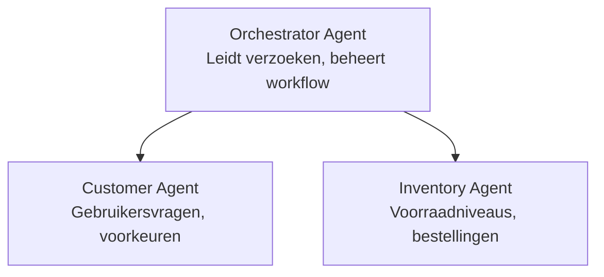

# Hoofdstuk 5: Multi-Agent AI-oplossingen

**📚 Course**: [AZD Voor Beginners](../../README.md) | **⏱️ Duration**: 2-3 uur | **⭐ Complexity**: Gevorderd

---

## Overzicht

Dit hoofdstuk behandelt geavanceerde multi-agent architectuurpatronen, agentorkestratie en productieklare AI-implementaties voor complexe scenario's.

> Gevalideerd tegen `azd 1.25.6` in juni 2026.

## Leerdoelen

Door dit hoofdstuk te voltooien, zul je:
- Multi-agent architectuurpatronen begrijpen
- Gecoördineerde AI-agentensystemen implementeren
- Agent-naar-agent communicatie implementeren
- Productieklare multi-agent oplossingen bouwen

---

## 📚 Lessen

| # | Les | Beschrijving | Tijd |
|---|--------|-------------|------|
| 1 | [Multi-Agent Basisprincipes](multi-agent-basics.md) | Hands-on: implementeer een werkende multi-agent app met `azd up` | 45 min |
| 2 | [Coördinatiepatronen](../chapter-06-pre-deployment/coordination-patterns.md) | Agent-orkestratiestrategieën (gaat verder in Hoofdstuk 6) | 30 min |
| 3 | [ARM-sjabloonimplementatie](../../examples/retail-multiagent-arm-template/README.md) | Voorbeeld van een één-klik-implementatie | 30 min |

> **Begin met Les 1.** Het is de enige volledig hands-on, implementeerbare les in dit hoofdstuk. Les 2 staat in Hoofdstuk 6 (het wordt gedeeld met planning voor pre-deployment), en de [Retail Multi-Agent Oplossing](../../examples/retail-scenario.md) is een architectuursjabloon — een ontwerpgids, geen één-commando sjabloon.

---

## 🚀 Snel Aan de Slag

```bash
# Optie 1: Implementeren vanuit een sjabloon
azd init --template agent-openai-python-prompty
azd up

# Optie 2: Implementeren vanuit een agentmanifest (vereist de azure.ai.agents-extensie)
azd extension install azure.ai.agents
azd ai agent init -m agent-manifest.yaml
azd up
```

> **Welke aanpak?** Gebruik `azd init --template` om te beginnen met een werkend voorbeeld. Gebruik `azd ai agent init` wanneer je je eigen agentmanifest hebt. Zie de [AZD AI CLI-referentie](../chapter-08-production/production-ai-practices.md#azd-ai-cli-commands-and-extensions) voor volledige details.

---

## 🤖 Multi-Agent Architectuur



---

## 🎯 Uitgelichte Oplossing: Retail Multi-Agent

De [Retail Multi-Agent Oplossing](../../examples/retail-scenario.md) demonstreert:

- **Klantagent**: Behandelt gebruikersinteracties en voorkeuren
- **Voorraadagent**: Beheert voorraad en orderverwerking
- **Orkestrator**: Coördineert tussen agenten
- **Gedeeld Geheugen**: Contextbeheer tussen agenten

### Gebruikte services

| Service | Doel |
|---------|---------|
| Microsoft Foundry Models | Taalbegrip |
| Azure AI Search | Productcatalogus |
| Cosmos DB | Agentstatus en geheugen |
| Container Apps | Hosten van agenten |
| Application Insights | Monitoring |

---

## 🔗 Navigatie

| Richting | Hoofdstuk |
|-----------|---------|
| **Vorige** | [Hoofdstuk 4: Infrastructuur](../chapter-04-infrastructure/README.md) |
| **Volgende** | [Hoofdstuk 6: Pre-Deployment](../chapter-06-pre-deployment/README.md) |

---

## 📖 Gerelateerde bronnen

- [Gids voor AI-agenten](../chapter-02-ai-development/agents.md)
- [AI-praktijken voor productie](../chapter-08-production/production-ai-practices.md)
- [AI-probleemoplossing](../chapter-07-troubleshooting/ai-troubleshooting.md)

---

<!-- CO-OP TRANSLATOR DISCLAIMER START -->
**Disclaimer**:
Dit document is vertaald met behulp van de AI vertaaldienst [Co-op Translator](https://github.com/Azure/co-op-translator). Hoewel we streven naar nauwkeurigheid, dient u er rekening mee te houden dat geautomatiseerde vertalingen fouten of onnauwkeurigheden kunnen bevatten. Het originele document in de oorspronkelijke taal moet worden beschouwd als de gezaghebbende bron. Voor kritieke informatie wordt professionele menselijke vertaling aanbevolen. Wij zijn niet aansprakelijk voor eventuele misverstanden of verkeerde interpretaties die voortvloeien uit het gebruik van deze vertaling.
<!-- CO-OP TRANSLATOR DISCLAIMER END -->