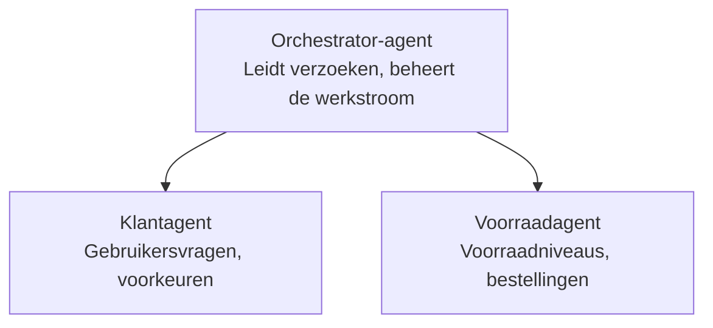

# Hoofdstuk 5: Multi-Agent AI-oplossingen

**📚 Cursus**: [AZD voor beginners](../../README.md) | **⏱️ Duur**: 2-3 uur | **⭐ Complexiteit**: Gevorderd

---

## Overzicht

Dit hoofdstuk behandelt geavanceerde multi-agent architectuurpatronen, agentorchestratie en productieklare AI-implementaties voor complexe scenario's.

> Gevalideerd tegen `azd 1.23.12` in maart 2026.

## Leerdoelen

Na het voltooien van dit hoofdstuk, zul je:
- Begrijpen van multi-agent architectuurpatronen
- Gecoördineerde AI-agentensystemen uitrollen
- Agent-naar-agentcommunicatie implementeren
- Productieklaar multi-agentoplossingen bouwen

---

## 📚 Lessen

| # | Les | Beschrijving | Tijd |
|---|--------|-------------|------|
| 1 | [Retail Multi-Agent-oplossing](../../examples/retail-scenario.md) | Volledige implementatiedoorloop | 90 min |
| 2 | [Coördinatiepatronen](../chapter-06-pre-deployment/coordination-patterns.md) | Strategieën voor agentorchestratie | 30 min |
| 3 | [ARM-sjabloonuitrol](../../examples/retail-multiagent-arm-template/README.md) | Uitrol met één klik | 30 min |

---

## 🚀 Snelle start

```bash
# Optie 1: Implementeren vanuit een sjabloon
azd init --template agent-openai-python-prompty
azd up

# Optie 2: Implementeren vanuit een agentmanifest (vereist de azure.ai.agents-extensie)
azd extension install azure.ai.agents
azd ai agent init -m agent-manifest.yaml
azd up
```

> **Welke aanpak?** Gebruik `azd init --template` om te beginnen vanaf een werkend voorbeeld. Gebruik `azd ai agent init` wanneer je je eigen agentmanifest hebt. Zie de [AZD AI CLI-referentie](../chapter-08-production/production-ai-practices.md#azd-ai-cli-commands-and-extensions) voor volledige details.

---

## 🤖 Multi-Agent Architectuur


---

## 🎯 Uitgelichte oplossing: Retail Multi-Agent

De [Retail Multi-Agent-oplossing](../../examples/retail-scenario.md) toont:

- **Klantagent**: Behandelt gebruikersinteracties en voorkeuren
- **Voorraadagent**: Beheert voorraad en orderverwerking
- **Orchestrator**: Coördineert tussen agenten
- **Gedeeld geheugen**: Beheer van context tussen agenten

### Gebruikte services

| Service | Doel |
|---------|---------|
| Microsoft Foundry Models | Taalbegrip |
| Azure AI Search | Productcatalogus |
| Cosmos DB | Agentstatus en geheugen |
| Container Apps | Hosten van agenten |
| Application Insights | Monitoring |

---

## 🔗 Navigatie

| Richting | Hoofdstuk |
|-----------|---------|
| **Vorige** | [Hoofdstuk 4: Infrastructuur](../chapter-04-infrastructure/README.md) |
| **Volgende** | [Hoofdstuk 6: Pre-deployment](../chapter-06-pre-deployment/README.md) |

---

## 📖 Gerelateerde bronnen

- [AI-agentengids](../chapter-02-ai-development/agents.md)
- [Productie-AI-praktijken](../chapter-08-production/production-ai-practices.md)
- [AI-probleemoplossing](../chapter-07-troubleshooting/ai-troubleshooting.md)

---

<!-- CO-OP TRANSLATOR DISCLAIMER START -->
**Disclaimer**:
Dit document is vertaald met behulp van de AI-vertalingsdienst [Co-op Translator](https://github.com/Azure/co-op-translator). Hoewel we streven naar nauwkeurigheid, dient u zich ervan bewust te zijn dat geautomatiseerde vertalingen fouten of onnauwkeurigheden kunnen bevatten. Het oorspronkelijke document in de originele taal moet als de gezaghebbende bron worden beschouwd. Voor cruciale informatie wordt een professionele menselijke vertaling aanbevolen. Wij zijn niet aansprakelijk voor enige misverstanden of foutieve interpretaties die voortvloeien uit het gebruik van deze vertaling.
<!-- CO-OP TRANSLATOR DISCLAIMER END -->