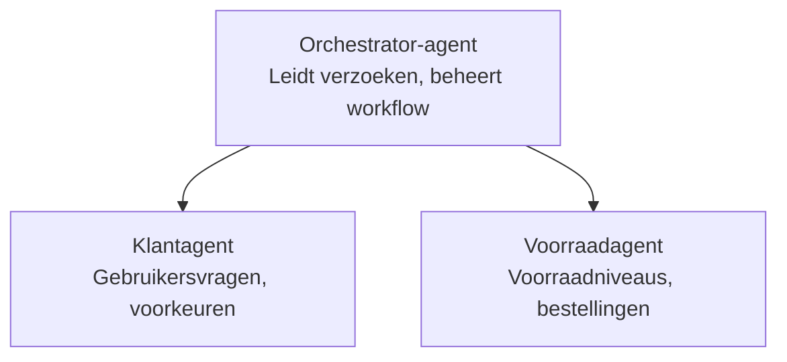

# Hoofdstuk 5: Multi-agent AI-oplossingen

**📚 Cursus**: [AZD Voor Beginners](../../README.md) | **⏱️ Duur**: 2-3 uur | **⭐ Complexiteit**: Gevorderd

---

## Overzicht

Dit hoofdstuk behandelt geavanceerde multi-agent architectuurpatronen, agentorkestratie en productieklare AI-implementaties voor complexe scenario's.

## Leerdoelen

Door dit hoofdstuk te voltooien, zul je:
- Multi-agent architectuurpatronen begrijpen
- Gecoördineerde AI-agentensystemen implementeren
- Agent-naar-agent communicatie implementeren
- Productieklare multi-agent oplossingen bouwen

---

## 📚 Lessen

| # | Lesson | Description | Time |
|---|--------|-------------|------|
| 1 | [Retail Multi-Agent Oplossing](../../examples/retail-scenario.md) | Volledige implementatiedoorloop | 90 min |
| 2 | [Coördinatiepatronen](../chapter-06-pre-deployment/coordination-patterns.md) | Strategieën voor agentorkestratie | 30 min |
| 3 | [ARM-sjabloonimplementatie](../../examples/retail-multiagent-arm-template/README.md) | Implementatie met één klik | 30 min |

---

## 🚀 Snelle start

```bash
# Optie 1: Uitrollen vanaf een sjabloon
azd init --template agent-openai-python-prompty
azd up

# Optie 2: Uitrollen vanuit een agentmanifest (vereist de extensie azure.ai.agents)
azd extension install azure.ai.agents
azd ai agent init -m agent-manifest.yaml
azd up
```

> **Welke aanpak?** Gebruik `azd init --template` om te beginnen met een werkend voorbeeld. Gebruik `azd ai agent init` wanneer je je eigen agentmanifest hebt. Zie de [AZD AI CLI-referentie](../chapter-08-production/production-ai-practices.md#azd-ai-cli-commands-and-extensions) voor volledige details.

---

## 🤖 Multi-agentarchitectuur


---

## 🎯 Uitgelichte oplossing: Retail Multi-Agent

De [Retail Multi-Agent Oplossing](../../examples/retail-scenario.md) laat zien:

- **Klantagent**: Behandelt gebruikersinteracties en voorkeuren
- **Voorraadagent**: Beheert voorraad en orderverwerking
- **Orkestrator**: Coördineert tussen agenten
- **Gedeeld geheugen**: Beheer van context tussen agenten

### Gebruikte services

| Service | Doel |
|---------|------|
| Microsoft Foundry Models | Taalbegrip |
| Azure AI Search | Productcatalogus |
| Cosmos DB | Agentstatus en geheugen |
| Container Apps | Hosten van agenten |
| Application Insights | Monitoring |

---

## 🔗 Navigatie

| Direction | Chapter |
|-----------|---------|
| **Previous** | [Hoofdstuk 4: Infrastructuur](../chapter-04-infrastructure/README.md) |
| **Next** | [Hoofdstuk 6: Pre-Deployment](../chapter-06-pre-deployment/README.md) |

---

## 📖 Gerelateerde bronnen

- [Gids voor AI-agents](../chapter-02-ai-development/agents.md)
- [Productie AI-praktijken](../chapter-08-production/production-ai-practices.md)
- [AI-probleemoplossing](../chapter-07-troubleshooting/ai-troubleshooting.md)

---

<!-- CO-OP TRANSLATOR DISCLAIMER START -->
**Disclaimer**:
Dit document is vertaald met behulp van de AI-vertalingsdienst [Co-op Translator](https://github.com/Azure/co-op-translator). Hoewel wij streven naar nauwkeurigheid, houd er rekening mee dat geautomatiseerde vertalingen fouten of onjuistheden kunnen bevatten. Het oorspronkelijke document in de originele taal moet als de gezaghebbende bron worden beschouwd. Voor kritieke informatie wordt een professionele menselijke vertaling aanbevolen. Wij zijn niet aansprakelijk voor misverstanden of verkeerde interpretaties die voortvloeien uit het gebruik van deze vertaling.
<!-- CO-OP TRANSLATOR DISCLAIMER END -->