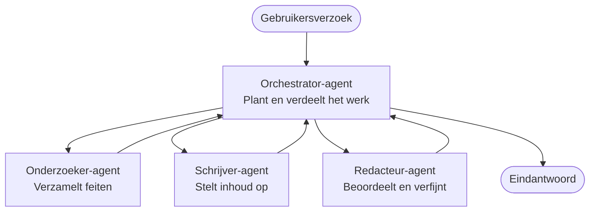

# Multi-agent basis - Implementeer uw eerste gecoördineerde AI-systeem

**Chapter Navigation:**
- **📚 Course Home**: [AZD For Beginners](../../README.md)
- **📖 Current Chapter**: Chapter 5 - Multi-Agent AI Solutions
- **⬅️ Previous**: [Chapter 4: Infrastructure](../chapter-04-infrastructure/README.md)
- **➡️ Next**: [Coordination Patterns](../chapter-06-pre-deployment/coordination-patterns.md)

> Gevalideerd tegen `azd 1.25.6` in juni 2026.

## Inleiding

In de eerdere hoofdstukken hebt u een enkele applicatie uitgerold—en in Hoofdstuk 2 hebt u een enkele AI-agent uitgerold. Deze les zet de volgende stap: het implementeren van een **multi-agent systeem**, waarbij meerdere gespecialiseerde agents samenwerken om een probleem op te lossen dat geen enkele agent goed alleen aankan.

Het goede nieuws voor beginners: **u hebt geen nieuwe commando's nodig.** Een multi-agent oplossing is nog steeds een azd-project. U doet `azd init`, `azd up`, test en `azd down`—exact dezelfde workflow die u al kent. Wat verandert is de *vorm* van de app binnenin.

## Leerdoelen

Aan het einde van deze les zult u:
- Begrijpen wat "multi-agent" betekent en wanneer de extra complexiteit de moeite waard is
- De veelvoorkomende rollen in een multi-agent systeem herkennen (orchestrator + specialisten)
- Een echte, werkende multi-agent template uitrollen met `azd up`
- Begrijpen welke Azure-resources een multi-agent app ondersteunen
- Weten hoe u de oplossing kunt verifiëren, aanpassen en veilig kunt afbreken

## Leerresultaten

Na voltooiing van deze les kunt u:
- Het verschil uitleggen tussen een enkele agent en een multi-agent systeem
- Kiezen tussen een enkele agent met tools en een echt multi-agent ontwerp
- Een multi-agent template end-to-end uitrollen en testen met azd
- Identificeren waar elke agent draait en hoe ze communiceren
- Alle resources opruimen om doorlopende kosten te voorkomen

---

## Wat is een Multi-Agent Systeem?

Een enkele AI-agent is één model met een set instructies en (optioneel) wat tools. Dat werkt goed voor gerichte taken. Maar naarmate een taak groeit—onderzoek, dan schrijven, dan redigeren, dan feiten controleren—maakt het proppen van alles in één prompt de agent trager, minder betrouwbaar en moeilijker te debuggen.

Een **multi-agent systeem** verdeelt het werk in specialisten die elk één taak goed doen, gecoördineerd door een orchestrator:



### De twee rollen die u altijd zult zien

| Role | Job | Example |
|------|-----|---------|
| **Orchestrator** | Beslist *wat hierna gebeurt* en verdeelt werk tussen agents | "Eerst onderzoek, dan schrijven, dan redigeren" |
| **Specialist** | Doet één gerichte taak en levert een resultaat op | Een "onderzoeker" die alleen feiten verzamelt |

### Heeft u werkelijk meerdere agents nodig?

Begin simpel. Kies voor multi-agent **alleen** wanneer een van deze waar is:

- ✅ De taak heeft **onderscheidbare fases** die baat hebben bij verschillende instructies (onderzoek versus schrijven versus review)
- ✅ U wilt dat specialisten **parallel** draaien om tijd te besparen
- ✅ Verschillende stappen hebben **verschillende tools of databronnen** nodig
- ✅ U moet elke stap **onafhankelijk testbaar en debugbaar** maken

Als uw taak een enkele vraag-en-antwoord is of een eenvoudige toolaanroep, is een **enkele agent met tools** (Hoofdstuk 2) eenvoudiger, goedkoper en gemakkelijker te beheren.

> **Tip voor beginners:** "Meer agents" is niet "beter." Elke agent voegt latentie, kosten en een nieuw te monitoren onderdeel toe. Voeg agents alleen toe wanneer het probleem duidelijk in delen valt.

---

## Twee manieren om Multi-Agent op Azure te bouwen

| Approach | What it is | Best for |
|----------|-----------|----------|
| **Single agent + tools** | One Foundry agent that calls functions/tools | Simple workflows, getting started |
| **Multiple coordinated agents** | Several agents with an orchestrator | Distinct stages, parallel work, specialization |

Deze les richt zich op de tweede aanpak met een **kant-en-klare template**, zodat u een echt multi-agent systeem kunt zien draaien voordat u uw eigen bouwt.

---

## Praktijk: Implementeer een werkende Multi-Agent App

We gaan **Contoso Creative Writer** uitrollen, een officiële Azure-sample die meerdere agents gebruikt (onderzoeker, schrijver, redacteur) die gecoördineerd samenwerken om een artikel te produceren. Het is een geweldige eerste multi-agent app omdat de rollen eenvoudig te begrijpen zijn.

### Stap 1: Initialiseer de template

```bash
# Maak een werkmap aan
mkdir creative-writer && cd creative-writer

# Initialiseer vanuit de officiële multi-agent-sjabloon
azd init --template contoso-creative-writer
```

> Blader op elk moment door meer multi-agent-templates in de [Awesome AZD AI gallery](https://azure.github.io/awesome-azd/?tags=ai). Andere beginner-vriendelijke opties zijn `get-started-with-ai-agents` en `azure-ai-travel-agents`.

### Stap 2: Authenticatie

```bash
# Vereist voor azd-workflows
azd auth login
```

### Stap 3: Maak een omgeving

```bash
azd env new dev
```

### Stap 4: Voorbeeld bekijken, daarna implementeren

```bash
# Bekijk wat er wordt aangemaakt voordat u iets uitgeeft (aanbevolen)
azd provision --preview

# Voorzie de infrastructuur en rol alle agenten in één stap uit
azd up
```

`azd up` vraagt om een subscription en regio, provisioneert vervolgens de Azure-resources en implementeert de applicatie. AI-implementaties kunnen langer duren dan een eenvoudige webapp—als u grotere modellen uitrolt, kunt u de deploy-timeout verlengen:

```bash
azd deploy --timeout 1800
```

> **Let op kosten en capaciteit:** Multi-agent apps zetten AI-modellen in die quota gebruiken en kosten veroorzaken. Als `azd up` faalt vanwege modelquota, zie [AI Troubleshooting](../chapter-07-troubleshooting/ai-troubleshooting.md) voor regio- en quota-oplossingen, en Hoofdstuk 6 [Capacity Planning](../chapter-06-pre-deployment/capacity-planning.md).

---

## Begrijpen wat u hebt uitgerold

Een typische multi-agent app zoals deze provisioneert een set Azure-resources die direct corresponderen met de verantwoordelijkheden in het diagram hierboven:

| Resource | Why it's there |
|----------|----------------|
| **Microsoft Foundry / Models** | Host de taalmodellen die elke agent gebruikt |
| **Azure AI Search** | Geeft de onderzoeker-agent gegronde data om te doorzoeken |
| **Container Apps** (or App Service) | Host de orchestrator en agent-code |
| **Cosmos DB** (in some samples) | Slaat gedeelde status/geheugen op die tussen agents wordt uitgewisseld |
| **Application Insights** | Traceert verzoeken *over* agents heen zodat u de flow kunt debuggen |

### Hoe de agents met elkaar praten

In de meeste azd multi-agent samples draait de **orchestrator in uw applicatiecode** (bijvoorbeeld met een framework zoals Semantic Kernel of het Microsoft Agent Framework). De orchestrator roept elke specialist-agent achtereenvolgens aan, geeft de resultaten door en stelt het eindantwoord samen. De agents delen context via:

- **Function/tool calls** — de orchestrator roept een specialist aan en ontvangt een resultaat terug
- **Shared memory** — een database (vaak Cosmos DB) houdt status bij die beide agents kunnen lezen
- **Messages/events** — voor lossere koppeling communiceren agents via een queue of Service Bus

> **Waarom dit belangrijk is voor debugging:** omdat elke stap apart is, toont Application Insights *welke* agent traag was of faalde. Dat is een belangrijke reden om werk over agents te verdelen.

---

## Verifieer de implementatie

Bevestig dat het systeem daadwerkelijk werkt voordat u verdergaat:

```bash
# Toon de uitgerolde eindpunten
azd show

# Open het monitoringdashboard van de app
azd monitor

# Volg de logs als er iets niet in orde lijkt
azd monitor --logs
```

Open vervolgens de app-URL van `azd show` en probeer een verzoek dat alle agents gebruikt (voor Creative Writer: vraag het een kort artikel over een onderwerp te schrijven). In de Application Insights **transactiezoekfunctie**, zou u moeten zien dat het verzoek zich verspreidt over de onderzoeker-, schrijver- en redactiestappen.

**Succescriteria:**
- ✅ `azd show` toont een bereikbaar endpoint
- ✅ Een verzoek levert een resultaat op dat duidelijk door meerdere fases is gegaan
- ✅ Application Insights toont traces voor meer dan één agentstap

---

## Aanpassen: Voeg een agent toe of wijzig er één

Omdat elke agent slechts instructies en tools is, is aanpassen goed te doen:

1. **Vind de agentdefinities** in de template (vaak een `prompts/`, `agents/`, of `*.prompty` set bestanden).
2. **Stem de instructies van een agent af** — vertel bijvoorbeeld de redacteur-agent om een specifieke toon of woordenaantal af te dwingen.
3. **Redeploy alleen de code** (de infrastructuur blijft ongewijzigd):

   ```bash
   azd deploy
   ```

Om verder te gaan en agents te bouwen vanuit uw *eigen* manifest, gebruikt u de agent-extensie en de volledige lifecycle:

```bash
azd extension install azure.ai.agents
azd ai agent init -m agent-manifest.yaml
azd up
azd ai agent invoke      # test, met responstijdmeting
```

Zie [Chapter 2: Agents](../chapter-02-ai-development/agents.md) en de [AZD AI CLI reference](../chapter-08-production/production-ai-practices.md#azd-ai-cli-commands-and-extensions) voor de volledige agent lifecycle (`invoke`, `eval generate`, `optimize`, `delete`).

---

## Opruimen

Multi-agent apps draaien meerdere factureerbare services. Maak alles af als u klaar bent:

```bash
azd down --force --purge
```

De `--purge` vlag verwijdert ook soft-deleted AI-resources (zoals Foundry/Azure AI Services-accounts), zodat ze een toekomstige herimplementatie niet blokkeren of kosten blijven veroorzaken.

---

## Een opmerking over productie Multi-Agent Systemen

De [Retail Multi-Agent Solution](../../examples/retail-scenario.md) in deze repo is een **architectuurrichtlijn**, geen one-command template—het documenteert hoe een productie-retail-systeem *zou* worden opgebouwd (en geeft expliciet aan dat een volledige bouw een substantiële inspanning is). Gebruik het als ontwerpreferentie *nadat* u hier een werkende sample hebt uitgerold. Voor productieaangelegenheden (resilience, kosten, monitoring, governance) gaat u verder naar [Chapter 8: Production AI Practices](../chapter-08-production/production-ai-practices.md).

---

## Samenvatting

- Een multi-agent systeem verdeelt werk over specialisten die gecoördineerd worden door een orchestrator.
- Gebruik het alleen wanneer de taak onderscheidbare fases heeft, parallelisme nodig is of verschillende tools per stap vereist zijn—anders heeft u meestal genoeg aan een enkele agent.
- De azd-workflow verandert niet: `azd init` → `azd up` → test → `azd down`.
- Een echte template zoals `contoso-creative-writer` stelt u in staat vandaag een werkende multi-agent app te zien en aan te passen.
- Application Insights-tracing over agents heen is een van de grootste praktische voordelen van het multi-agent ontwerp.

---

## 🔗 Navigatie

| Direction | Lesson |
|-----------|--------|
| **Previous** | [Chapter 4: Infrastructure](../chapter-04-infrastructure/README.md) |
| **Next** | [Coordination Patterns](../chapter-06-pre-deployment/coordination-patterns.md) |

## 📖 Gerelateerde bronnen

- [AI Agents Guide](../chapter-02-ai-development/agents.md)
- [Coordination Patterns](../chapter-06-pre-deployment/coordination-patterns.md)
- [Production AI Practices](../chapter-08-production/production-ai-practices.md)
- [AI Troubleshooting](../chapter-07-troubleshooting/ai-troubleshooting.md)

---

<!-- CO-OP TRANSLATOR DISCLAIMER START -->
**Disclaimer**:
Dit document is vertaald met behulp van de AI vertaaldienst [Co-op Translator](https://github.com/Azure/co-op-translator). Hoewel we streven naar nauwkeurigheid, dient u er rekening mee te houden dat geautomatiseerde vertalingen fouten of onnauwkeurigheden kunnen bevatten. Het originele document in de oorspronkelijke taal moet worden beschouwd als de gezaghebbende bron. Voor kritieke informatie wordt professionele menselijke vertaling aanbevolen. Wij zijn niet aansprakelijk voor eventuele misverstanden of verkeerde interpretaties die voortvloeien uit het gebruik van deze vertaling.
<!-- CO-OP TRANSLATOR DISCLAIMER END -->