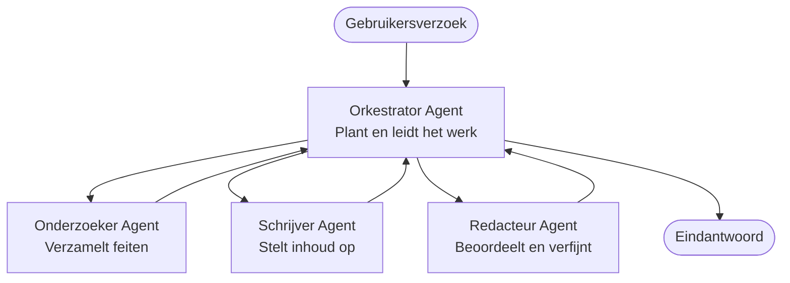

# Multi-Agent Basics - Deploy je eerste gecoördineerde AI-systeem

**Hoofdstuknavigatie:**
- **📚 Cursus Home**: [AZD Voor Beginners](../../README.md)
- **📖 Huidig Hoofdstuk**: Hoofdstuk 5 - Multi-Agent AI-oplossingen
- **⬅️ Vorige**: [Hoofdstuk 4: Infrastructuur](../chapter-04-infrastructure/README.md)
- **➡️ Volgende**: [Coördinatiepatronen](../chapter-06-pre-deployment/coordination-patterns.md)

> Gevalideerd met `azd 1.27.1` in juli 2026.

## Introductie

In de eerdere hoofdstukken heb je een enkele applicatie geïmplementeerd—en in Hoofdstuk 2 heb je een enkele AI-agent uitgerold. Deze les neemt de volgende stap: het uitrollen van een **multi-agent systeem**, waarin meerdere gespecialiseerde agenten samenwerken om een probleem op te lossen dat geen enkele agent alleen goed aankan.

Het goede nieuws voor beginners: **je hebt geen nieuwe commando's nodig.** Een multi-agent oplossing is nog steeds een azd-project. Je doet `azd init`, `azd up`, test en `azd down`—exact dezelfde workflow die je al kent. Wat verandert is de *vorm* van de app vanbinnen.

## Leerdoelen

Aan het einde van deze les zul je:
- Begrijpen wat "multi-agent" betekent en wanneer het de extra complexiteit waard is
- De algemene rollen in een multi-agent systeem herkennen (orchestrator + specialisten)
- Een echte, werkende multi-agent template uitrollen met `azd up`
- Begrijpen welke Azure-middelen een multi-agent app ondersteunen
- Weten hoe je de oplossing veilig kunt verifiëren, aanpassen en afbreken

## Leerresultaten

Na het voltooien van deze les zul je in staat zijn om:
- Het verschil uit te leggen tussen een enkele agent en een multi-agent systeem
- Te kiezen tussen een enkele agent met tools en een echt multi-agent ontwerp
- Een multi-agent template end-to-end te implementeren en testen met azd
- Te identificeren waar elke agent draait en hoe ze communiceren
- Alle resources op te ruimen om voortdurende kosten te vermijden

---

## Wat is een Multi-Agent Systeem?

Een enkele AI-agent is één model met een set instructies en (optioneel) enkele tools. Dat werkt goed voor gerichte taken. Maar naarmate een taak groeit—onderzoek, dan schrijven, dan redigeren, dan feiten controleren—maakt het samenvoegen van alles in één prompt de agent trager, minder betrouwbaar en moeilijker te debuggen.

Een **multi-agent systeem** verdeelt het werk over specialisten die elk één taak goed doen, gecoördineerd door een orchestrator:



### De twee rollen die je altijd zult zien

| Rol | Taak | Voorbeeld |
|------|-----|---------|
| **Orchestrator** | Bepaalt *wat er daarna gebeurt* en verdeelt werk tussen agenten | "Eerst onderzoek, dan schrijven, dan redigeren" |
| **Specialist** | Voert één gerichte taak uit en levert een resultaat | Een "onderzoeker" die alleen feiten verzamelt |

### Heb je echt meerdere agenten nodig?

Begin simpel. Pak multi-agent **alleen** als een van deze waar is:

- ✅ De taak heeft **duidelijke fasen** die baat hebben bij verschillende instructies (onderzoek vs. schrijven vs. beoordelen)
- ✅ Je wilt specialisten die **gelijktijdig** werken om tijd te besparen
- ✅ Verschillende stappen hebben **verschillende tools of gegevensbronnen** nodig
- ✅ Je moet elke stap **onafhankelijk kunnen testen en debuggen**

Als je taak een enkele vraag-en-antwoord of eenvoudige tool-aanroep is, is een **enkele agent met tools** (Hoofdstuk 2) eenvoudiger, goedkoper en makkelijker in gebruik.

> **Beginnertip:** "Meer agenten" is niet "beter." Elke agent voegt latentie, kosten en een nieuw monitorpunt toe. Voeg agenten alleen toe als het probleem duidelijk in delen splitst.

---

## Twee Manieren om Multi-Agent te Bouwen op Azure

| Benadering | Wat het is | Best voor |
|----------|-----------|----------|
| **Enkele agent + tools** | Eén Foundry-agent die functies/tools aanroept | Eenvoudige workflows, beginnen met AI |
| **Meerdere gecoördineerde agenten** | Meerdere agenten met een orchestrator | Duidelijke fasen, parallel werk, specialisatie |

Deze les richt zich op de tweede aanpak met een **kant-en-klare template**, zodat je een echt multi-agent systeem aan het werk kunt zien voordat je je eigen bouwt.

---

## Praktijk: Rol een Werkende Multi-Agent App uit

We rollen **Contoso Creative Writer** uit, een officiële Azure voorbeeldapp die meerdere agenten gebruikt (onderzoeker, schrijver, redacteur) gecoördineerd om een artikel te produceren. Het is een geweldige eerste multi-agent app omdat de rollen makkelijk te begrijpen zijn.

### Stap 1: Initialiseer de template

```bash
# Maak een werkmap aan
mkdir creative-writer && cd creative-writer

# Initialiseren vanuit de officiële multi-agent sjabloon
azd init --template contoso-creative-writer
```

> Blader op elk moment door meer multi-agent templates in de [Awesome AZD AI galerij](https://azure.github.io/awesome-azd/?tags=ai). Andere beginnersvriendelijke opties zijn `get-started-with-ai-agents` en `azure-ai-travel-agents`.

### Stap 2: Authenticeer

```bash
# Vereist voor azd-workflows
azd auth login
```

### Stap 3: Maak een omgeving

```bash
azd env new dev
```

### Stap 4: Bekijk een voorbeeld, en rol dan uit

```bash
# Bekijk wat er zal worden gemaakt voordat u iets uitgeeft (aanbevolen)
azd provision --preview

# Voorzie infrastructuur en implementeer alle agents in één stap
azd up
```

`azd up` vraagt om een abonnement en regio, provisioneert dan de Azure-middelen en rolt de applicatie uit. AI-implementaties kunnen langer duren dan een simpele webapp—als je grotere modellen implementeert, kun je de uitrol-timeout verlengen:

```bash
azd deploy --timeout 1800
```

> **Let op kosten en capaciteit:** Multi-agent apps rollen AI-modellen uit die quota verbruiken en kosten veroorzaken. Als `azd up` faalt vanwege modelquota, zie [AI Troubleshooting](../chapter-07-troubleshooting/ai-troubleshooting.md) voor regio- en quotaoplossingen, en Hoofdstuk 6 [Capaciteitsplanning](../chapter-06-pre-deployment/capacity-planning.md).

---

## Begrijpen wat je hebt uitgerold

Een typische multi-agent app zoals deze provisioneert een set Azure-middelen die direct aansluiten op de verantwoordelijkheden in het diagram hierboven:

| Resource | Waarom het er is |
|----------|----------------|
| **Microsoft Foundry / Modellen** | Host de taalmodellen die elke agent gebruikt |
| **Azure AI Search** | Geeft de onderzoeker agent gefundeerde data om te doorzoeken |
| **Container Apps** (of App Service) | Host de orchestrator en agent-code |
| **Cosmos DB** (in sommige voorbeelden) | Slaat gedeelde status/geheugen op die tussen agenten wordt doorgegeven |
| **Application Insights** | Traceert verzoeken *over* agenten zodat je de flow kunt debuggen |

### Hoe de agenten met elkaar communiceren

In de meeste azd multi-agent voorbeelden draait de **orchestrator in je applicatiecode** (bijvoorbeeld met een framework als Semantic Kernel of het Microsoft Agent Framework). De orchestrator roept elke specialist agent om beurt op, geeft resultaten door en stelt het eindantwoord samen. De agenten delen context via:

- **Functie/tool-aanroepen** — de orchestrator roept een specialist aan en krijgt een resultaat terug
- **Gedeeld geheugen** — een database (vaak Cosmos DB) bewaart status die beide agenten kunnen lezen
- **Berichten/evenementen** — voor lossere koppeling communiceren agenten via een wachtrij of Service Bus

> **Waarom dit belangrijk is voor debuggen:** omdat elke stap apart is, toont Application Insights *welke* agent traag was of faalde. Dat is een belangrijke reden om werk te verdelen over agenten.

---

## Verifieer de implementatie

Controleer of het systeem daadwerkelijk werkt voordat je verder gaat:

```bash
# Toon de gedeployde eindpunten
azd show

# Open het monitoringdashboard van de app
azd monitor

# Volg de logs als er iets niet klopt
azd monitor --logs
```

Open dan de app-URL van `azd show` en probeer een verzoek dat alle agenten benut (voor Creative Writer, vraag om een kort artikel over een onderwerp te schrijven). In de Application Insights **transactie-zoekopdracht** zou je moeten zien dat het verzoek zich verspreidt over de onderzoeker, schrijver en redacteur stappen.

**Succescriteria:**
- ✅ `azd show` toont een bereikbare endpoint
- ✅ Een verzoek levert een resultaat op dat duidelijk door meerdere stappen ging
- ✅ Application Insights toont traceringen voor meer dan één agent-stap

---

## Aanpassen: Een Agent Toevoegen of Wijzigen

Omdat elke agent slechts instructies plus tools is, is aanpassen goed te doen:

1. **Vind de agentdefinities** in de template (vaak een `prompts/`, `agents/` of `*.prompty` set bestanden).
2. **Stel de instructies van een agent af** — bijvoorbeeld, vertel de redacteur-agent een specifieke toon of woordenaantal af te dwingen.
3. **Rol alleen de code opnieuw uit** (infrastructuur blijft ongewijzigd):

   ```bash
   azd deploy
   ```

Wil je verder gaan en agenten bouwen vanuit je *eigen* manifest, gebruik dan de agent-extensie en zijn volledige lifecycle:

```bash
azd extension install azure.ai.agents
azd ai agent init -m agent-manifest.yaml
azd up
azd ai agent invoke      # test, met responstijd
```

Zie [Hoofdstuk 2: Agenten](../chapter-02-ai-development/agents.md) en de [AZD AI CLI referentie](../chapter-08-production/production-ai-practices.md#azd-ai-cli-commands-and-extensions) voor de volledige agent lifecycle (`invoke`, `eval generate`, `optimize`, `delete`).

---

## Opruimen

Multi-agent apps draaien meerdere factureerbare services. Breek alles af als je klaar bent:

```bash
azd down --force --purge
```

De `--purge` vlag verwijdert ook soft-verwijderde AI resources (zoals Foundry/Azure AI Services accounts) zodat deze geen toekomstige implementaties blokkeren of kosten blijven veroorzaken.

---

## Een Opmerking over Productie Multi-Agent Systemen

De [Retail Multi-Agent Oplossing](../../examples/retail-scenario.md) in deze repo is een **architectuur blauwdruk**, geen template met één commando—het documenteert hoe een productie retail systeem *zou* worden gebouwd (en geeft expliciet aan dat een volledige bouw een substantiële inspanning is). Gebruik het als ontwerpgids *nadat* je hier een werkend voorbeeld hebt uitgerold. Voor productie-aandachtspunten (veerkracht, kosten, monitoring, governance), ga verder naar [Hoofdstuk 8: Productie AI Praktijken](../chapter-08-production/production-ai-practices.md).

---

## Samenvatting

- Een multi-agent systeem verdeelt werk over specialisten gecoördineerd door een orchestrator.
- Gebruik het alleen als de taak duidelijke fasen, parallelisme of verschillende tools per stap heeft—anders heeft een enkele agent de voorkeur.
- De azd-workflow blijft hetzelfde: `azd init` → `azd up` → testen → `azd down`.
- Een echte template zoals `contoso-creative-writer` laat je vandaag een werkende multi-agent app zien en aanpassen.
- Application Insights tracing over agenten is een van de grootste praktische voordelen van het multi-agent ontwerp.

---

## 🔗 Navigatie

| Richting | Les |
|-----------|--------|
| **Vorige** | [Hoofdstuk 4: Infrastructuur](../chapter-04-infrastructure/README.md) |
| **Volgende** | [Coördinatiepatronen](../chapter-06-pre-deployment/coordination-patterns.md) |

## 📖 Gerelateerde Bronnen

- [AI Agents Gids](../chapter-02-ai-development/agents.md)
- [Coördinatiepatronen](../chapter-06-pre-deployment/coordination-patterns.md)
- [Productie AI Praktijken](../chapter-08-production/production-ai-practices.md)
- [AI Troubleshooting](../chapter-07-troubleshooting/ai-troubleshooting.md)

---

<!-- CO-OP TRANSLATOR DISCLAIMER START -->
**Disclaimer**:
Dit document is vertaald met behulp van de AI vertaaldienst [Co-op Translator](https://github.com/Azure/co-op-translator). Hoewel we streven naar nauwkeurigheid, dient u er rekening mee te houden dat geautomatiseerde vertalingen fouten of onnauwkeurigheden kunnen bevatten. Het originele document in de oorspronkelijke taal moet worden beschouwd als de gezaghebbende bron. Voor kritieke informatie wordt professionele menselijke vertaling aanbevolen. Wij zijn niet aansprakelijk voor eventuele misverstanden of verkeerde interpretaties die voortvloeien uit het gebruik van deze vertaling.
<!-- CO-OP TRANSLATOR DISCLAIMER END -->