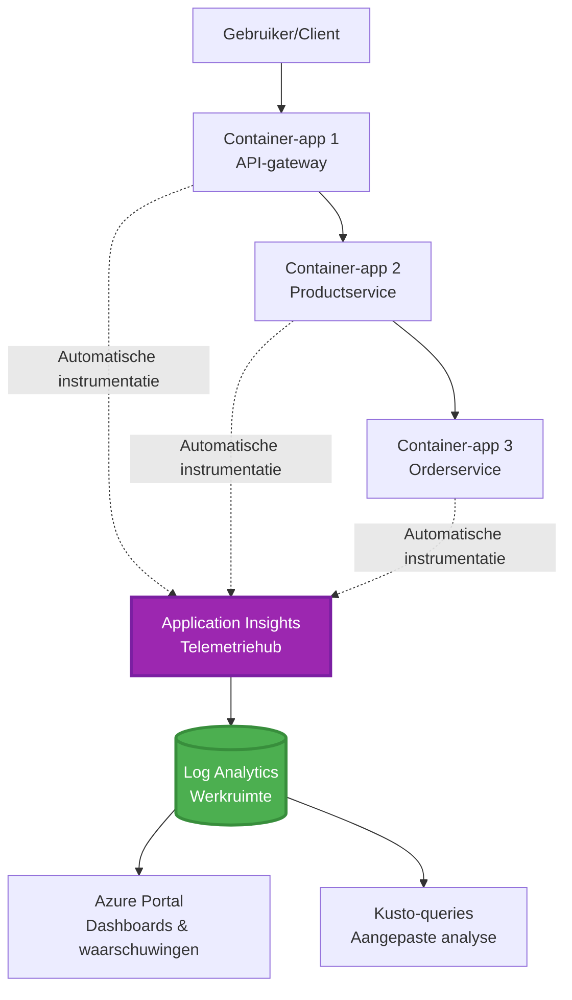
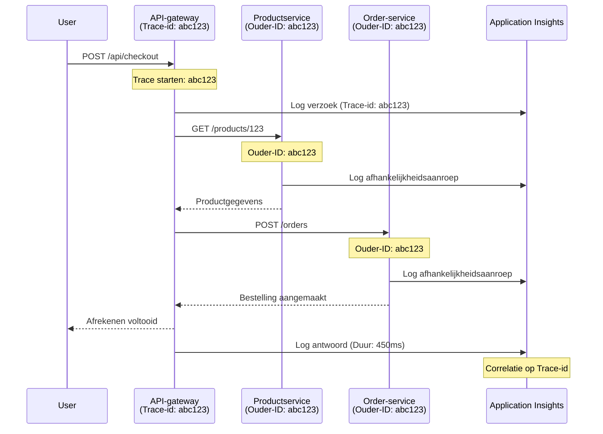

# Application Insights-integratie met AZD

⏱️ **Geschatte tijd**: 40-50 minuten | 💰 **Kosteneffect**: ~$5-15/maand | ⭐ **Complexiteit**: Gemiddeld

**📚 Leerpad:**
- ← Vorige: [Preflight-controles](preflight-checks.md) - Voorafgaande validatie
- 🎯 **Je bevindt je hier**: Application Insights-integratie (monitoring, telemetrie, foutopsporing)
- → Volgende: [Implementatiegids](../chapter-04-infrastructure/deployment-guide.md) - Implementeren naar Azure
- 🏠 [Cursusstartpagina](../../README.md)

---

## Wat je zult leren

Door deze les te voltooien, zul je:
- Integreer **Application Insights** automatisch in AZD-projecten
- Configureer **gedistribueerde tracing** voor microservices
- Implementeer **aangepaste telemetrie** (metingen, gebeurtenissen, afhankelijkheden)
- Stel **live metrics** in voor realtime bewaking
- Maak **waarschuwingen en dashboards** vanuit AZD-implementaties
- Los productieproblemen op met **telemetriequeries**
- Optimaliseer **kosten- en sampling**strategieën
- Monitor **AI/LLM-toepassingen** (tokens, latentie, kosten)

## Waarom Application Insights met AZD belangrijk is

### De uitdaging: zichtbaarheid in productie

**Zonder Application Insights:**
```
❌ No visibility into production behavior
❌ Manual log aggregation across services
❌ Reactive debugging (wait for customer complaints)
❌ No performance metrics
❌ Cannot trace requests across services
❌ Unknown failure rates and bottlenecks
```

**Met Application Insights + AZD:**
```
✅ Automatic telemetry collection
✅ Centralized logs from all services
✅ Proactive issue detection
✅ End-to-end request tracing
✅ Performance metrics and insights
✅ Real-time dashboards
✅ AZD provisions everything automatically
```

**Analogie**: Application Insights is als het hebben van een "black box" vluchtrecorder + het instrumentenpaneel van de cockpit voor je applicatie. Je ziet alles wat er in realtime gebeurt en kunt elk incident opnieuw afspelen.

---

## Architectuuroverzicht

### Application Insights in AZD-architectuur


### Wat wordt automatisch gemonitord

| Type telemetrie | Wat het vastlegt | Gebruikssituatie |
|----------------|------------------|------------------|
| **Verzoeken** | HTTP-verzoeken, statuscodes, duur | API-prestatiemonitoring |
| **Afhankelijkheden** | Externe oproepen (DB, API's, opslag) | Identificeer knelpunten |
| **Excepties** | Onbehandelde fouten met stacktraces | Fouten debuggen |
| **Aangepaste gebeurtenissen** | Bedrijfsevenementen (aanmelding, aankoop) | Analyse en trechters |
| **Metrics** | Prestatie-counters, aangepaste metrics | Capaciteitsplanning |
| **Traces** | Logberichten met ernstniveau | Debugging en auditing |
| **Beschikbaarheid** | Uptime en responstijdtests | SLA-monitoring |

---

## Vereisten

### Benodigde tools

```bash
# Controleer Azure Developer CLI
azd version
# ✅ Verwacht: azd-versie 1.0.0 of hoger

# Controleer Azure CLI
az --version
# ✅ Verwacht: azure-cli 2.50.0 of hoger
```

### Azure-vereisten

- Actief Azure-abonnement
- Machtigingen om aan te maken:
  - Application Insights-resources
  - Log Analytics-workspaces
  - Container Apps
  - Resourcegroepen

### Vereiste voorkennis

Je zou het volgende moeten hebben voltooid:
- [AZD Basics](../chapter-01-foundation/azd-basics.md) - Kernconcepten van AZD
- [Configuration](../chapter-03-configuration/configuration.md) - Omgevingsconfiguratie
- [First Project](../chapter-01-foundation/first-project.md) - Basisimplementatie

---

## Les 1: Automatische Application Insights met AZD

### Hoe AZD Application Insights aanmaakt

AZD maakt en configureert Application Insights automatisch wanneer je implementeert. Laten we kijken hoe het werkt.

### Projectstructuur

```
monitored-app/
├── azure.yaml                     # AZD configuration
├── infra/
│   ├── main.bicep                # Main infrastructure
│   ├── core/
│   │   └── monitoring.bicep      # Application Insights + Log Analytics
│   └── app/
│       └── api.bicep             # Container App with monitoring
└── src/
    ├── app.py                    # Application with telemetry
    ├── requirements.txt
    └── Dockerfile
```

---

### Stap 1: Configureer AZD (azure.yaml)

**Bestand: `azure.yaml`**

```yaml
name: monitored-app
metadata:
  template: monitored-app@1.0.0

services:
  api:
    project: ./src
    language: python
    host: containerapp

# AZD automatically provisions monitoring!
```

**Dat is alles!** AZD maakt Application Insights standaard aan. Geen extra configuratie nodig voor basisbewaking.

---

### Stap 2: Monitoringinfrastructuur (Bicep)

**Bestand: `infra/core/monitoring.bicep`**

```bicep
param logAnalyticsName string
param applicationInsightsName string
param location string = resourceGroup().location
param tags object = {}

// Log Analytics Workspace (required for Application Insights)
resource logAnalytics 'Microsoft.OperationalInsights/workspaces@2022-10-01' = {
  name: logAnalyticsName
  location: location
  tags: tags
  properties: {
    sku: {
      name: 'PerGB2018'  // Pay-as-you-go pricing
    }
    retentionInDays: 30  // Keep logs for 30 days
    features: {
      enableLogAccessUsingOnlyResourcePermissions: true
    }
  }
}

// Application Insights
resource applicationInsights 'Microsoft.Insights/components@2020-02-02' = {
  name: applicationInsightsName
  location: location
  tags: tags
  kind: 'web'
  properties: {
    Application_Type: 'web'
    WorkspaceResourceId: logAnalytics.id
    IngestionMode: 'LogAnalytics'
    publicNetworkAccessForIngestion: 'Enabled'
    publicNetworkAccessForQuery: 'Enabled'
  }
}

// Outputs for Container Apps
output logAnalyticsWorkspaceId string = logAnalytics.id
output logAnalyticsWorkspaceName string = logAnalytics.name
output applicationInsightsConnectionString string = applicationInsights.properties.ConnectionString
output applicationInsightsInstrumentationKey string = applicationInsights.properties.InstrumentationKey
output applicationInsightsName string = applicationInsights.name
```

---

### Stap 3: Verbind Container App met Application Insights

**Bestand: `infra/app/api.bicep`**

```bicep
param name string
param location string
param tags object = {}
param containerAppsEnvironmentName string
param applicationInsightsConnectionString string

resource containerApp 'Microsoft.App/containerApps@2023-05-01' = {
  name: name
  location: location
  tags: tags
  properties: {
    configuration: {
      ingress: {
        external: true
        targetPort: 8000
      }
      secrets: [
        {
          name: 'appinsights-connection-string'
          value: applicationInsightsConnectionString
        }
      ]
    }
    template: {
      containers: [
        {
          name: 'api'
          image: 'myregistry.azurecr.io/api:latest'
          resources: {
            cpu: json('0.5')
            memory: '1Gi'
          }
          env: [
            {
              name: 'APPLICATIONINSIGHTS_CONNECTION_STRING'
              secretRef: 'appinsights-connection-string'
            }
            {
              name: 'APPLICATIONINSIGHTS_ENABLED'
              value: 'true'
            }
          ]
        }
      ]
    }
  }
}

output uri string = 'https://${containerApp.properties.configuration.ingress.fqdn}'
```

---

### Stap 4: Applicatiecode met telemetrie

**Bestand: `src/app.py`**

```python
from flask import Flask, request, jsonify
from opencensus.ext.azure.log_exporter import AzureLogHandler
from opencensus.ext.azure.trace_exporter import AzureExporter
from opencensus.ext.flask.flask_middleware import FlaskMiddleware
from opencensus.trace.samplers import ProbabilitySampler
import logging
import os

app = Flask(__name__)

# Haal Application Insights-verbindingstring op
connection_string = os.environ.get('APPLICATIONINSIGHTS_CONNECTION_STRING')

if connection_string:
    # Configureer gedistribueerde tracing
    middleware = FlaskMiddleware(
        app,
        exporter=AzureExporter(connection_string=connection_string),
        sampler=ProbabilitySampler(rate=1.0)  # 100% sampling voor ontwikkeling
    )
    
    # Configureer logging
    logger = logging.getLogger(__name__)
    logger.addHandler(AzureLogHandler(connection_string=connection_string))
    logger.setLevel(logging.INFO)
    
    print("✅ Application Insights enabled")
else:
    logger = logging.getLogger(__name__)
    logger.setLevel(logging.INFO)
    print("⚠️ Application Insights not configured")

@app.route('/health')
def health():
    logger.info('Health check endpoint called')
    return jsonify({'status': 'healthy', 'monitoring': 'enabled'})

@app.route('/api/products')
def get_products():
    logger.info('Fetching products')
    
    # Simuleer database-aanroep (automatisch geregistreerd als afhankelijkheid)
    products = [
        {'id': 1, 'name': 'Laptop', 'price': 999.99},
        {'id': 2, 'name': 'Mouse', 'price': 29.99},
        {'id': 3, 'name': 'Keyboard', 'price': 79.99}
    ]
    
    logger.info(f'Returned {len(products)} products')
    return jsonify(products)

@app.route('/api/error-test')
def error_test():
    """Test error tracking"""
    logger.error('Testing error tracking')
    try:
        raise ValueError('This is a test exception')
    except Exception as e:
        logger.exception('Exception occurred in error-test endpoint')
        return jsonify({'error': str(e)}), 500

@app.route('/api/slow')
def slow_endpoint():
    """Test performance tracking"""
    import time
    logger.info('Slow endpoint called')
    time.sleep(3)  # Simuleer trage bewerking
    logger.warning('Endpoint took 3 seconds to respond')
    return jsonify({'message': 'Slow operation completed'})

if __name__ == '__main__':
    app.run(host='0.0.0.0', port=8000)
```

**Bestand: `src/requirements.txt`**

```txt
Flask==3.0.0
opencensus-ext-azure==1.1.13
opencensus-ext-flask==0.8.1
gunicorn==21.2.0
```

---

### Stap 5: Implementeren en verifiëren

```bash
# AZD initialiseren
azd init

# Implementeren (voorziet automatisch Application Insights)
azd up

# Haal app-URL op
APP_URL=$(azd env get-values | grep API_URL | cut -d '=' -f2 | tr -d '"')

# Genereer telemetrie
curl $APP_URL/health
curl $APP_URL/api/products
curl $APP_URL/api/error-test
curl $APP_URL/api/slow
```

**✅ Verwachte uitvoer:**
```json
{
  "status": "healthy",
  "monitoring": "enabled"
}
```

---

### Stap 6: Bekijk telemetrie in de Azure Portal

```bash
# Details van Application Insights ophalen
azd env get-values | grep APPLICATIONINSIGHTS

# Openen in de Azure-portal
az monitor app-insights component show \
  --app $(azd env get-values | grep APPLICATIONINSIGHTS_NAME | cut -d '=' -f2 | tr -d '"') \
  --resource-group $(azd env get-values | grep AZURE_RESOURCE_GROUP | cut -d '=' -f2 | tr -d '"') \
  --query "appId" -o tsv
```

**Navigeer naar Azure Portal → Application Insights → Transaction Search**

Je zou het volgende moeten zien:
- ✅ HTTP-verzoeken met statuscodes
- ✅ Requestduur (3+ seconden voor `/api/slow`)
- ✅ Exceptiedetails van `/api/error-test`
- ✅ Aangepaste logberichten

---

## Les 2: Aangepaste telemetrie en gebeurtenissen

### Volg bedrijfsevenementen

Laten we aangepaste telemetrie toevoegen voor bedrijfskritieke gebeurtenissen.

**Bestand: `src/telemetry.py`**

```python
from opencensus.ext.azure import metrics_exporter
from opencensus.stats import aggregation as aggregation_module
from opencensus.stats import measure as measure_module
from opencensus.stats import stats as stats_module
from opencensus.stats import view as view_module
from opencensus.tags import tag_map as tag_map_module
from opencensus.ext.azure.log_exporter import AzureLogHandler
from opencensus.ext.azure.trace_exporter import AzureExporter
from opencensus.trace import tracer as tracer_module
import logging
import os

class TelemetryClient:
    """Custom telemetry client for Application Insights"""
    
    def __init__(self, connection_string=None):
        self.connection_string = connection_string or os.environ.get('APPLICATIONINSIGHTS_CONNECTION_STRING')
        
        if not self.connection_string:
            print("⚠️ Application Insights connection string not found")
            return
        
        # Logger instellen
        self.logger = logging.getLogger(__name__)
        self.logger.addHandler(AzureLogHandler(connection_string=self.connection_string))
        self.logger.setLevel(logging.INFO)
        
        # Metrics-exporter instellen
        self.stats = stats_module.stats
        self.view_manager = self.stats.view_manager
        self.stats_recorder = self.stats.stats_recorder
        
        exporter = metrics_exporter.new_metrics_exporter(
            connection_string=self.connection_string
        )
        self.view_manager.register_exporter(exporter)
        
        # Tracer instellen
        self.tracer = tracer_module.Tracer(
            exporter=AzureExporter(connection_string=self.connection_string)
        )
        
        print("✅ Custom telemetry client initialized")
    
    def track_event(self, event_name: str, properties: dict = None):
        """Track custom business event"""
        properties = properties or {}
        self.logger.info(
            f"CustomEvent: {event_name}",
            extra={
                'custom_dimensions': {
                    'event_name': event_name,
                    **properties
                }
            }
        )
    
    def track_metric(self, metric_name: str, value: float, properties: dict = None):
        """Track custom metric"""
        properties = properties or {}
        self.logger.info(
            f"CustomMetric: {metric_name} = {value}",
            extra={
                'custom_dimensions': {
                    'metric_name': metric_name,
                    'value': value,
                    **properties
                }
            }
        )
    
    def track_dependency(self, name: str, dependency_type: str, duration: float, success: bool):
        """Track external dependency call"""
        with self.tracer.span(name=name) as span:
            span.add_attribute('dependency.type', dependency_type)
            span.add_attribute('duration', duration)
            span.add_attribute('success', success)

# Globale telemetrieclient
telemetry = TelemetryClient()
```

### Werk applicatie bij met aangepaste gebeurtenissen

**Bestand: `src/app.py` (uitgebreid)**

```python
from flask import Flask, request, jsonify
from telemetry import telemetry
import time
import random

app = Flask(__name__)

@app.route('/api/purchase', methods=['POST'])
def purchase():
    """Track purchase event with custom telemetry"""
    data = request.json
    product_id = data.get('product_id')
    quantity = data.get('quantity', 1)
    price = data.get('price', 0)
    
    # Volg zakelijke gebeurtenis
    telemetry.track_event('Purchase', {
        'product_id': product_id,
        'quantity': quantity,
        'total_amount': price * quantity,
        'user_id': request.headers.get('X-User-Id', 'anonymous')
    })
    
    # Volg omzetmetriek
    telemetry.track_metric('Revenue', price * quantity, {
        'product_id': product_id,
        'currency': 'USD'
    })
    
    return jsonify({
        'order_id': f'ORD-{random.randint(1000, 9999)}',
        'status': 'confirmed',
        'total': price * quantity
    })

@app.route('/api/search')
def search():
    """Track search queries"""
    query = request.args.get('q', '')
    
    start_time = time.time()
    
    # Simuleer zoekopdracht (zou een echte databasequery zijn)
    results = [{'id': 1, 'name': f'Result for {query}'}]
    
    duration = (time.time() - start_time) * 1000  # Omzetten naar ms
    
    # Volg zoekgebeurtenis
    telemetry.track_event('Search', {
        'query': query,
        'results_count': len(results),
        'duration_ms': duration
    })
    
    # Volg zoekprestatiemetriek
    telemetry.track_metric('SearchDuration', duration, {
        'query_length': len(query)
    })
    
    return jsonify({'results': results, 'count': len(results)})

@app.route('/api/external-call')
def external_call():
    """Track external API dependency"""
    import requests
    
    start_time = time.time()
    success = True
    
    try:
        # Simuleer externe API-aanroep
        response = requests.get('https://api.example.com/data', timeout=5)
        result = response.json()
    except Exception as e:
        success = False
        result = {'error': str(e)}
    
    duration = (time.time() - start_time) * 1000
    
    # Volg afhankelijkheid
    telemetry.track_dependency(
        name='ExternalAPI',
        dependency_type='HTTP',
        duration=duration,
        success=success
    )
    
    return jsonify(result)

if __name__ == '__main__':
    app.run(host='0.0.0.0', port=8000)
```

### Test aangepaste telemetrie

```bash
# Volg aankoopgebeurtenis
curl -X POST $APP_URL/api/purchase \
  -H "Content-Type: application/json" \
  -H "X-User-Id: user123" \
  -d '{"product_id": 1, "quantity": 2, "price": 29.99}'

# Volg zoekgebeurtenis
curl "$APP_URL/api/search?q=laptop"

# Volg externe afhankelijkheid
curl $APP_URL/api/external-call
```

**Bekijk in Azure Portal:**

Ga naar Application Insights → Logs en voer dan uit:

```kusto
// View purchase events
traces
| where customDimensions.event_name == "Purchase"
| project 
    timestamp,
    product_id = tostring(customDimensions.product_id),
    total_amount = todouble(customDimensions.total_amount),
    user_id = tostring(customDimensions.user_id)
| order by timestamp desc

// View revenue metrics
traces
| where customDimensions.metric_name == "Revenue"
| summarize TotalRevenue = sum(todouble(customDimensions.value)) by bin(timestamp, 1h)
| render timechart

// View search performance
traces
| where customDimensions.event_name == "Search"
| summarize 
    AvgDuration = avg(todouble(customDimensions.duration_ms)),
    SearchCount = count()
  by bin(timestamp, 5m)
| render timechart
```

---

## Les 3: Gedistribueerde tracing voor microservices

### Schakel cross-service tracing in

Voor microservices correleert Application Insights automatisch verzoeken tussen services.

**Bestand: `infra/main.bicep`**

```bicep
targetScope = 'subscription'

param environmentName string
param location string = 'eastus'

var tags = { 'azd-env-name': environmentName }

resource rg 'Microsoft.Resources/resourceGroups@2021-04-01' = {
  name: 'rg-${environmentName}'
  location: location
  tags: tags
}

// Monitoring (shared by all services)
module monitoring './core/monitoring.bicep' = {
  name: 'monitoring'
  scope: rg
  params: {
    logAnalyticsName: 'log-${environmentName}'
    applicationInsightsName: 'appi-${environmentName}'
    location: location
    tags: tags
  }
}

// API Gateway
module apiGateway './app/api-gateway.bicep' = {
  name: 'api-gateway'
  scope: rg
  params: {
    name: 'ca-gateway-${environmentName}'
    location: location
    tags: union(tags, { 'azd-service-name': 'gateway' })
    applicationInsightsConnectionString: monitoring.outputs.applicationInsightsConnectionString
  }
}

// Product Service
module productService './app/product-service.bicep' = {
  name: 'product-service'
  scope: rg
  params: {
    name: 'ca-products-${environmentName}'
    location: location
    tags: union(tags, { 'azd-service-name': 'products' })
    applicationInsightsConnectionString: monitoring.outputs.applicationInsightsConnectionString
  }
}

// Order Service
module orderService './app/order-service.bicep' = {
  name: 'order-service'
  scope: rg
  params: {
    name: 'ca-orders-${environmentName}'
    location: location
    tags: union(tags, { 'azd-service-name': 'orders' })
    applicationInsightsConnectionString: monitoring.outputs.applicationInsightsConnectionString
  }
}

output APPLICATIONINSIGHTS_CONNECTION_STRING string = monitoring.outputs.applicationInsightsConnectionString
output GATEWAY_URL string = apiGateway.outputs.uri
```

### Bekijk end-to-end transactie


**Voer query uit voor end-to-end trace:**

```kusto
// Find complete request flow
let traceId = "abc123...";  // Get from response header
dependencies
| union requests
| where operation_Id == traceId
| project 
    timestamp,
    type = itemType,
    name,
    duration,
    success,
    cloud_RoleName
| order by timestamp asc
```

---

## Les 4: Live Metrics en realtime monitoring

### Schakel Live Metrics-stream in

Live Metrics levert realtime telemetrie met <1 seconde latentie.

**Toegang tot Live Metrics:**

```bash
# Haal Application Insights-resource op
APPI_NAME=$(azd env get-values | grep APPLICATIONINSIGHTS_NAME | cut -d '=' -f2 | tr -d '"')

# Haal resourcegroep op
RG_NAME=$(azd env get-values | grep AZURE_RESOURCE_GROUP | cut -d '=' -f2 | tr -d '"')

echo "Navigate to: Azure Portal → Resource Groups → $RG_NAME → $APPI_NAME → Live Metrics"
```

**Wat je in realtime ziet:**
- ✅ Binnenkomende verzoeksnelheid (verzoeken/sec)
- ✅ Uitgaande afhankelijkheidsoproepen
- ✅ Aantal exceptions
- ✅ CPU- en geheugengebruik
- ✅ Aantal actieve servers
- ✅ Gemonsterde telemetrie

### Genereer belasting voor testen

```bash
# Genereer belasting om live statistieken te zien
for i in {1..100}; do
  curl $APP_URL/api/products &
  curl $APP_URL/api/search?q=test$i &
done

# Bekijk live statistieken in de Azure-portal
# U zou een piek in het aantal aanvragen moeten zien
```

---

## Praktische oefeningen

### Oefening 1: Stel waarschuwingen in ⭐⭐ (Gemiddeld)

**Doel**: Maak waarschuwingen voor hoge foutpercentages en trage reacties.

**Stappen:**

1. **Maak waarschuwing voor foutpercentage:**

```bash
# Haal Application Insights-resource-ID op
APPI_ID=$(az monitor app-insights component show \
  --app $APPI_NAME \
  --resource-group $RG_NAME \
  --query "id" -o tsv)

# Maak een metrische waarschuwing voor mislukte verzoeken
az monitor metrics alert create \
  --name "High-Error-Rate" \
  --resource-group $RG_NAME \
  --scopes $APPI_ID \
  --condition "count requests/failed > 10" \
  --window-size 5m \
  --evaluation-frequency 1m \
  --description "Alert when error rate exceeds 10 per 5 minutes"
```

2. **Maak waarschuwing voor trage reacties:**

```bash
az monitor metrics alert create \
  --name "Slow-Responses" \
  --resource-group $RG_NAME \
  --scopes $APPI_ID \
  --condition "avg requests/duration > 3000" \
  --window-size 5m \
  --evaluation-frequency 1m \
  --description "Alert when average response time exceeds 3 seconds"
```

3. **Maak waarschuwing via Bicep (voorkeur voor AZD):**

**Bestand: `infra/core/alerts.bicep`**

```bicep
param applicationInsightsId string
param actionGroupId string = ''
param location string = resourceGroup().location

// High error rate alert
resource errorRateAlert 'Microsoft.Insights/metricAlerts@2018-03-01' = {
  name: 'high-error-rate'
  location: 'global'
  properties: {
    description: 'Alert when error rate exceeds threshold'
    severity: 2
    enabled: true
    scopes: [
      applicationInsightsId
    ]
    evaluationFrequency: 'PT1M'
    windowSize: 'PT5M'
    criteria: {
      'odata.type': 'Microsoft.Azure.Monitor.SingleResourceMultipleMetricCriteria'
      allOf: [
        {
          name: 'Error rate'
          metricName: 'requests/failed'
          operator: 'GreaterThan'
          threshold: 10
          timeAggregation: 'Count'
        }
      ]
    }
    actions: actionGroupId != '' ? [
      {
        actionGroupId: actionGroupId
      }
    ] : []
  }
}

// Slow response alert
resource slowResponseAlert 'Microsoft.Insights/metricAlerts@2018-03-01' = {
  name: 'slow-responses'
  location: 'global'
  properties: {
    description: 'Alert when response time is too high'
    severity: 3
    enabled: true
    scopes: [
      applicationInsightsId
    ]
    evaluationFrequency: 'PT1M'
    windowSize: 'PT5M'
    criteria: {
      'odata.type': 'Microsoft.Azure.Monitor.SingleResourceMultipleMetricCriteria'
      allOf: [
        {
          name: 'Response duration'
          metricName: 'requests/duration'
          operator: 'GreaterThan'
          threshold: 3000
          timeAggregation: 'Average'
        }
      ]
    }
  }
}

output errorAlertId string = errorRateAlert.id
output slowResponseAlertId string = slowResponseAlert.id
```

4. **Test waarschuwingen:**

```bash
# Genereer fouten
for i in {1..20}; do
  curl $APP_URL/api/error-test
done

# Genereer trage reacties
for i in {1..10}; do
  curl $APP_URL/api/slow
done

# Controleer waarschuwingsstatus (wacht 5-10 minuten)
az monitor metrics alert list \
  --resource-group $RG_NAME \
  --query "[].{Name:name, Enabled:enabled, State:properties.enabled}" \
  --output table
```

**✅ Succescriteria:**
- ✅ Waarschuwingen succesvol aangemaakt
- ✅ Waarschuwingen worden geactiveerd bij overschrijding van drempels
- ✅ Je kunt waarschuwingsgeschiedenis in de Azure Portal bekijken
- ✅ Geïntegreerd met AZD-implementatie

**Tijd**: 20-25 minuten

---

### Oefening 2: Maak een aangepast dashboard ⭐⭐ (Gemiddeld)

**Doel**: Bouw een dashboard dat belangrijke applicatiestatistieken toont.

**Stappen:**

1. **Maak dashboard via Azure Portal:**

Ga naar: Azure Portal → Dashboards → New Dashboard

2. **Voeg tegels toe voor belangrijke statistieken:**

- Aantal verzoeken (laatste 24 uur)
- Gemiddelde reactietijd
- Foutpercentage
- Top 5 traagste bewerkingen
- Geografische verdeling van gebruikers

3. **Maak dashboard via Bicep:**

**Bestand: `infra/core/dashboard.bicep`**

```bicep
param dashboardName string
param applicationInsightsId string
param location string = resourceGroup().location

resource dashboard 'Microsoft.Portal/dashboards@2020-09-01-preview' = {
  name: dashboardName
  location: location
  properties: {
    lenses: [
      {
        order: 0
        parts: [
          // Request count
          {
            position: { x: 0, y: 0, rowSpan: 4, colSpan: 6 }
            metadata: {
              type: 'Extension/Microsoft_OperationsManagementSuite_Workspace/PartType/LogsDashboardPart'
              inputs: [
                {
                  name: 'resourceId'
                  value: applicationInsightsId
                }
                {
                  name: 'query'
                  value: '''
                    requests
                    | summarize RequestCount = count() by bin(timestamp, 1h)
                    | render timechart
                  '''
                }
              ]
            }
          }
          // Error rate
          {
            position: { x: 6, y: 0, rowSpan: 4, colSpan: 6 }
            metadata: {
              type: 'Extension/Microsoft_OperationsManagementSuite_Workspace/PartType/LogsDashboardPart'
              inputs: [
                {
                  name: 'resourceId'
                  value: applicationInsightsId
                }
                {
                  name: 'query'
                  value: '''
                    requests
                    | summarize 
                        Total = count(),
                        Failed = countif(success == false)
                    | extend ErrorRate = (Failed * 100.0) / Total
                    | project ErrorRate
                  '''
                }
              ]
            }
          }
        ]
      }
    ]
  }
}

output dashboardId string = dashboard.id
```

4. **Implementeer dashboard:**

```bash
# Voeg toe aan main.bicep
module dashboard './core/dashboard.bicep' = {
  name: 'dashboard'
  scope: rg
  params: {
    dashboardName: 'dashboard-${environmentName}'
    applicationInsightsId: monitoring.outputs.applicationInsightsId
    location: location
  }
}

# Implementeer
azd up
```

**✅ Succescriteria:**
- ✅ Dashboard toont belangrijke statistieken
- ✅ Kan vastgezet worden op de startpagina van Azure Portal
- ✅ Werk in realtime bij
- ✅ Implementeerbaar via AZD

**Tijd**: 25-30 minuten

---

### Oefening 3: Monitor AI/LLM-toepassing ⭐⭐⭐ (Geavanceerd)

**Doel**: Volg het gebruik van Microsoft Foundry Models (tokens, kosten, latentie).

**Stappen:**

1. **Maak AI-monitoring-wrapper:**

**Bestand: `src/ai_telemetry.py`**

```python
from telemetry import telemetry
from openai import AzureOpenAI
import time

class MonitoredAzureOpenAI:
    """Microsoft Foundry Models client with automatic telemetry"""
    
    def __init__(self, api_key, endpoint, api_version="2024-02-01"):
        self.client = AzureOpenAI(
            api_key=api_key,
            api_version=api_version,
            azure_endpoint=endpoint
        )
    
    def chat_completion(self, model: str, messages: list, **kwargs):
        """Track chat completion with telemetry"""
        start_time = time.time()
        
        try:
            # Microsoft Foundry-modellen aanroepen
            response = self.client.chat.completions.create(
                model=model,
                messages=messages,
                **kwargs
            )
            
            duration = (time.time() - start_time) * 1000  # ms
            
            # Gebruiksgegevens extraheren
            usage = response.usage
            prompt_tokens = usage.prompt_tokens
            completion_tokens = usage.completion_tokens
            total_tokens = usage.total_tokens
            
            # Kosten berekenen (gpt-4.1-prijzen)
            prompt_cost = (prompt_tokens / 1000) * 0.03  # $0.03 per 1K tokens
            completion_cost = (completion_tokens / 1000) * 0.06  # $0.06 per 1K tokens
            total_cost = prompt_cost + completion_cost
            
            # Aangepast evenement bijhouden
            telemetry.track_event('OpenAI_Request', {
                'model': model,
                'prompt_tokens': prompt_tokens,
                'completion_tokens': completion_tokens,
                'total_tokens': total_tokens,
                'duration_ms': duration,
                'cost_usd': total_cost,
                'success': True
            })
            
            # Metrieken bijhouden
            telemetry.track_metric('OpenAI_Tokens', total_tokens, {
                'model': model,
                'type': 'total'
            })
            
            telemetry.track_metric('OpenAI_Cost', total_cost, {
                'model': model,
                'currency': 'USD'
            })
            
            telemetry.track_metric('OpenAI_Duration', duration, {
                'model': model
            })
            
            return response
            
        except Exception as e:
            duration = (time.time() - start_time) * 1000
            
            telemetry.track_event('OpenAI_Request', {
                'model': model,
                'duration_ms': duration,
                'success': False,
                'error': str(e)
            })
            
            raise
```

2. **Gebruik gemonitorde client:**

```python
from flask import Flask, request, jsonify
from ai_telemetry import MonitoredAzureOpenAI
import os

app = Flask(__name__)

# Initialiseer de gemonitorde OpenAI-client
openai_client = MonitoredAzureOpenAI(
    api_key=os.environ['AZURE_OPENAI_API_KEY'],
    endpoint=os.environ['AZURE_OPENAI_ENDPOINT']
)

@app.route('/api/chat', methods=['POST'])
def chat():
    data = request.json
    user_message = data.get('message')
    
    # Aanroepen met automatische monitoring
    response = openai_client.chat_completion(
        model='gpt-4.1',
        messages=[
            {'role': 'user', 'content': user_message}
        ]
    )
    
    return jsonify({
        'response': response.choices[0].message.content,
        'tokens': response.usage.total_tokens
    })
```

3. **Query AI-metrics:**

```kusto
// Total AI spend over time
traces
| where customDimensions.event_name == "OpenAI_Request"
| where customDimensions.success == "True"
| summarize TotalCost = sum(todouble(customDimensions.cost_usd)) by bin(timestamp, 1h)
| render timechart

// Token usage by model
traces
| where customDimensions.event_name == "OpenAI_Request"
| summarize 
    TotalTokens = sum(toint(customDimensions.total_tokens)),
    RequestCount = count()
  by Model = tostring(customDimensions.model)

// Average latency
traces
| where customDimensions.event_name == "OpenAI_Request"
| summarize AvgDuration = avg(todouble(customDimensions.duration_ms))
| project AvgDurationSeconds = AvgDuration / 1000

// Cost per request
traces
| where customDimensions.event_name == "OpenAI_Request"
| extend Cost = todouble(customDimensions.cost_usd)
| summarize 
    TotalCost = sum(Cost),
    RequestCount = count(),
    AvgCostPerRequest = avg(Cost)
```

**✅ Succescriteria:**
- ✅ Elke OpenAI-aanroep wordt automatisch gevolgd
- ✅ Tokengebruik en kosten zichtbaar
- ✅ Latentie gemonitord
- ✅ Budgetwaarschuwingen instelbaar

**Tijd**: 35-45 minuten

---

## Kostenoptimalisatie

### Sampling-strategieën

Beperk kosten door telemetrie te samplen:

```python
from opencensus.trace.samplers import ProbabilitySampler

# Ontwikkeling: 100% bemonstering
sampler = ProbabilitySampler(rate=1.0)

# Productie: 10% bemonstering (verlaagt de kosten met 90%)
sampler = ProbabilitySampler(rate=0.1)

# Adaptieve bemonstering (past zich automatisch aan)
from opencensus.trace.samplers import AdaptiveSampler
sampler = AdaptiveSampler()
```

**In Bicep:**

```bicep
resource applicationInsights 'Microsoft.Insights/components@2020-02-02' = {
  name: applicationInsightsName
  properties: {
    SamplingPercentage: 10  // 10% sampling
  }
}
```

### Gegevensbewaring

```bicep
resource logAnalytics 'Microsoft.OperationalInsights/workspaces@2022-10-01' = {
  name: logAnalyticsName
  properties: {
    retentionInDays: 30  // Minimum (cheapest)
    // Options: 30, 31, 60, 90, 120, 180, 270, 365, 550, 730
  }
}
```

### Maandelijkse kostenschattingen

| Gegevensvolume | Bewaring | Maandelijkse kosten |
|-------------|-----------|--------------|
| 1 GB/maand | 30 dagen | ~$2-5 |
| 5 GB/maand | 30 dagen | ~$10-15 |
| 10 GB/maand | 90 dagen | ~$25-40 |
| 50 GB/maand | 90 dagen | ~$100-150 |

**Gratis tier**: 5 GB/maand inbegrepen

---

## Kenniscontrole

### 1. Basisintegratie ✓

Test je begrip:

- [ ] **Q1**: Hoe voorziet AZD Application Insights?
  - **A**: Automatisch via Bicep-templates in `infra/core/monitoring.bicep`

- [ ] **Q2**: Welke omgevingsvariabele schakelt Application Insights in?
  - **A**: `APPLICATIONINSIGHTS_CONNECTION_STRING`

- [ ] **Q3**: Wat zijn de drie belangrijkste telemetrietypen?
  - **A**: Verzoeken (HTTP-aanroepen), Afhankelijkheden (externe oproepen), Excepties (fouten)

**Hands-on verificatie:**
```bash
# Controleer of Application Insights is geconfigureerd
azd env get-values | grep APPLICATIONINSIGHTS

# Controleer of telemetrie wordt verzonden
az monitor app-insights metrics show \
  --app $APPI_NAME \
  --resource-group $RG_NAME \
  --metric "requests/count"
```

---

### 2. Aangepaste telemetrie ✓

Test je begrip:

- [ ] **Q1**: Hoe volg je aangepaste bedrijfsevenementen?
  - **A**: Gebruik een logger met `custom_dimensions` of `TelemetryClient.track_event()`

- [ ] **Q2**: Wat is het verschil tussen events en metrics?
  - **A**: Events zijn discrete gebeurtenissen, metrics zijn numerieke metingen

- [ ] **Q3**: Hoe correleer je telemetrie tussen services?
  - **A**: Application Insights gebruikt automatisch `operation_Id` voor correlatie

**Hands-on verificatie:**
```kusto
// Verify custom events
traces
| where customDimensions.event_name != ""
| summarize count() by tostring(customDimensions.event_name)
```

---

### 3. Productiebewaking ✓

Test je begrip:

- [ ] **Q1**: Wat is sampling en waarom gebruiken?
  - **A**: Sampling vermindert de datavolume (en kosten) door slechts een percentage van de telemetrie vast te leggen

- [ ] **Q2**: Hoe stel je waarschuwingen in?
  - **A**: Gebruik metrische waarschuwingen in Bicep of Azure Portal op basis van Application Insights-metrics

- [ ] **Q3**: Wat is het verschil tussen Log Analytics en Application Insights?
  - **A**: Application Insights slaat gegevens op in een Log Analytics-workspace; App Insights biedt applicatiespecifieke weergaven

**Hands-on verificatie:**
```bash
# Controleer de bemonsteringsconfiguratie
az monitor app-insights component show \
  --app $APPI_NAME \
  --resource-group $RG_NAME \
  --query "properties.SamplingPercentage"
```

---

## Beste praktijken

### ✅ DO:

1. **Gebruik correlatie-ID's**
   ```python
   logger.info('Processing order', extra={
       'custom_dimensions': {
           'order_id': order_id,
           'user_id': user_id
       }
   })
   ```

2. **Stel waarschuwingen in voor kritieke metrics**
   ```bicep
   // Error rate, slow responses, availability
   ```

3. **Gebruik gestructureerde logging**
   ```python
   # ✅ GOED: Gestructureerd
   logger.info('User signup', extra={'custom_dimensions': {'user_id': 123}})
   
   # ❌ SLECHT: Ongestructureerd
   logger.info(f'User 123 signed up')
   ```

4. **Monitor afhankelijkheden**
   ```python
   # Automatisch database-oproepen, HTTP-aanvragen, enz.
   ```

5. **Gebruik Live Metrics tijdens implementaties**

### ❌ DON'T:

1. **Log geen gevoelige gegevens**
   ```python
   # ❌ SLECHT
   logger.info(f'Login: {username}:{password}')
   
   # ✅ GOED
   logger.info('Login attempt', extra={'custom_dimensions': {'username': username}})
   ```

2. **Gebruik geen 100% sampling in productie**
   ```python
   # ❌ Duur
   sampler = ProbabilitySampler(rate=1.0)
   
   # ✅ Kosteneffectief
   sampler = ProbabilitySampler(rate=0.1)
   ```

3. **Negeer geen dead letter queues**

4. **Vergeet niet gegevensbewaringslimieten in te stellen**

---

## Probleemoplossing

### Probleem: Geen telemetrie zichtbaar

**Diagnose:**
```bash
# Controleer of de verbindingsreeks is ingesteld
azd env get-values | grep APPLICATIONINSIGHTS

# Controleer de applicatielogs via Azure Monitor
azd monitor --logs

# Of gebruik de Azure CLI voor Container Apps:
az containerapp logs show --name $APP_NAME --resource-group $RG_NAME --tail 50
```

**Oplossing:**
```bash
# Controleer de verbindingsreeks in de Container-app
az containerapp show \
  --name $APP_NAME \
  --resource-group $RG_NAME \
  --query "properties.template.containers[0].env" \
  | grep -i applicationinsights
```

---

### Probleem: Hoge kosten

**Diagnose:**
```bash
# Controleer gegevensinvoer
az monitor app-insights metrics show \
  --app $APPI_NAME \
  --resource-group $RG_NAME \
  --metric "availabilityResults/count"
```

**Oplossing:**
- Verminder het samplingpercentage
- Verlaag de bewaartermijn
- Verwijder uitgebreide logging

---

## Meer informatie

### Officiële documentatie
- [Overzicht van Application Insights](https://learn.microsoft.com/azure/azure-monitor/app/app-insights-overview)
- [Application Insights voor Python](https://learn.microsoft.com/azure/azure-monitor/app/opencensus-python)
- [Kusto Query Language](https://learn.microsoft.com/azure/data-explorer/kusto/query/)
- [AZD-monitoring](https://learn.microsoft.com/azure/developer/azure-developer-cli/monitor-your-app)

### Volgende stappen in deze cursus
- ← Vorige: [Preflight-controles](preflight-checks.md)
- → Volgende: [Implementatiegids](../chapter-04-infrastructure/deployment-guide.md)
- 🏠 [Cursusstartpagina](../../README.md)

### Gerelateerde voorbeelden
- [Microsoft Foundry Models Example](../../../../examples/azure-openai-chat) - AI telemetrie
- [Microservices Example](../../../../examples/microservices) - Gedistribueerde tracing

---

## Samenvatting

**Je hebt geleerd:**
- ✅ Automatische provisioning van Application Insights met AZD
- ✅ Aangepaste telemetrie (gebeurtenissen, metrics, afhankelijkheden)
- ✅ Gedistribueerde tracing over microservices
- ✅ Live metrics en realtime monitoring
- ✅ Waarschuwingen en dashboards
- ✅ Monitoring van AI/LLM-toepassingen
- ✅ Strategieën voor kostenoptimalisatie

**Belangrijkste conclusies:**
1. **AZD zorgt automatisch voor monitoring** - Geen handmatige configuratie
2. **Gebruik gestructureerde logging** - Maakt query's eenvoudiger
3. **Volg bedrijfsgebeurtenissen** - Niet alleen technische statistieken
4. **Houd AI-kosten in de gaten** - Houd tokens en uitgaven bij
5. **Stel waarschuwingen in** - Wees proactief, niet reactief
6. **Optimaliseer kosten** - Gebruik sampling en retentiegrenzen

**Volgende stappen:**
1. Voltooi de praktische oefeningen
2. Voeg Application Insights toe aan je AZD-projecten
3. Maak aangepaste dashboards voor je team
4. Lees de [Implementatiegids](../chapter-04-infrastructure/deployment-guide.md)

---

<!-- CO-OP TRANSLATOR DISCLAIMER START -->
**Disclaimer**:
Dit document is vertaald met behulp van de AI-vertalingsservice [Co-op Translator](https://github.com/Azure/co-op-translator). Hoewel we naar nauwkeurigheid streven, houd er rekening mee dat automatische vertalingen fouten of onnauwkeurigheden kunnen bevatten. Het oorspronkelijke document in de oorspronkelijke taal moet als de gezaghebbende bron worden beschouwd. Voor cruciale informatie wordt een professionele menselijke vertaling aanbevolen. We zijn niet aansprakelijk voor eventuele misverstanden of verkeerde interpretaties die voortvloeien uit het gebruik van deze vertaling.
<!-- CO-OP TRANSLATOR DISCLAIMER END -->