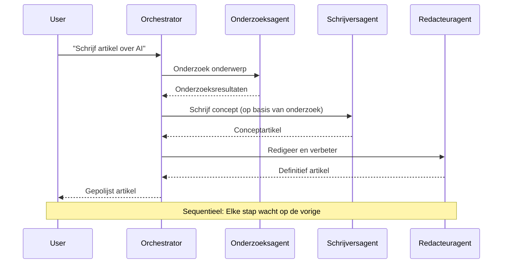
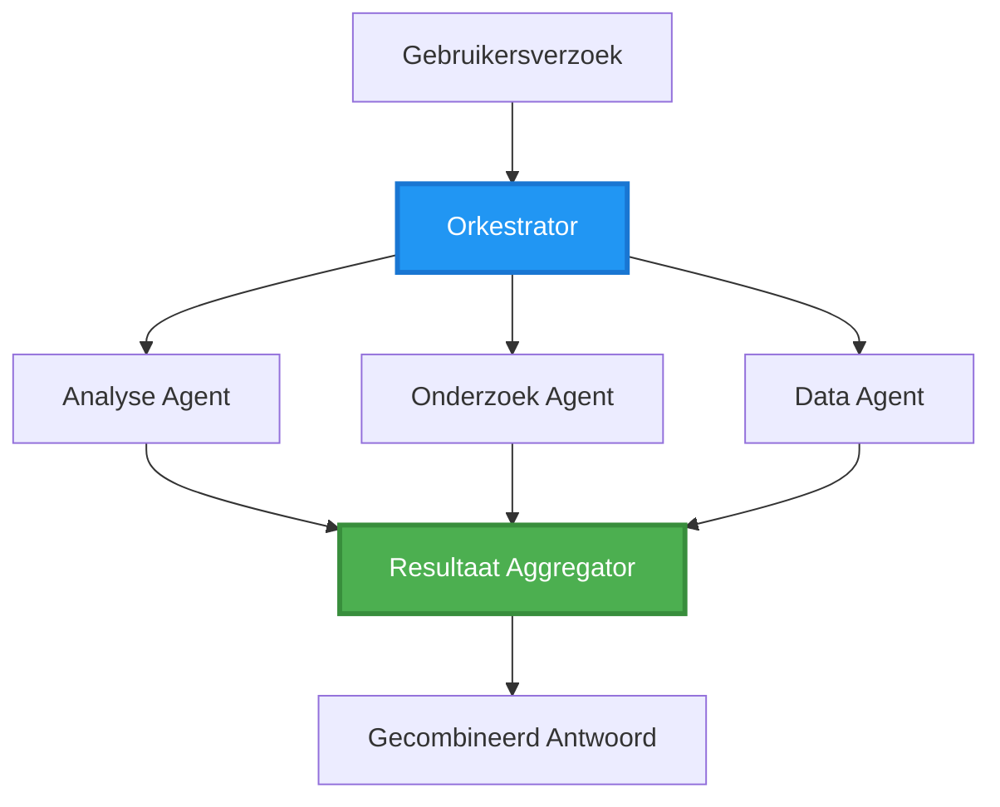
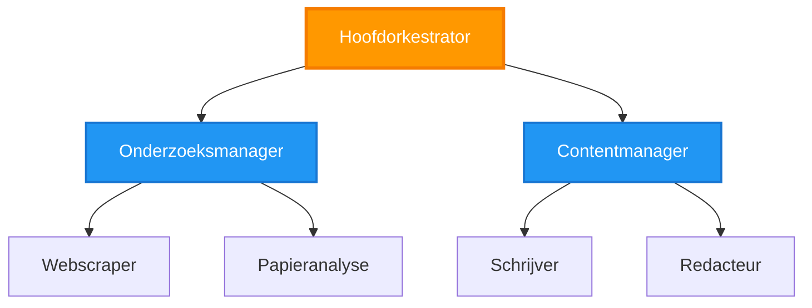
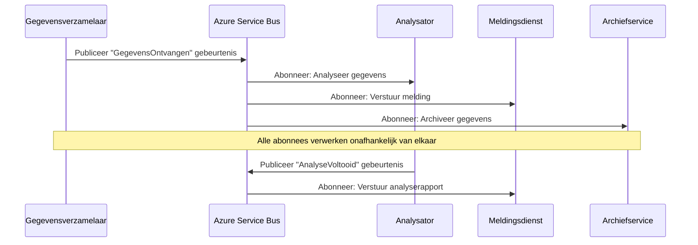
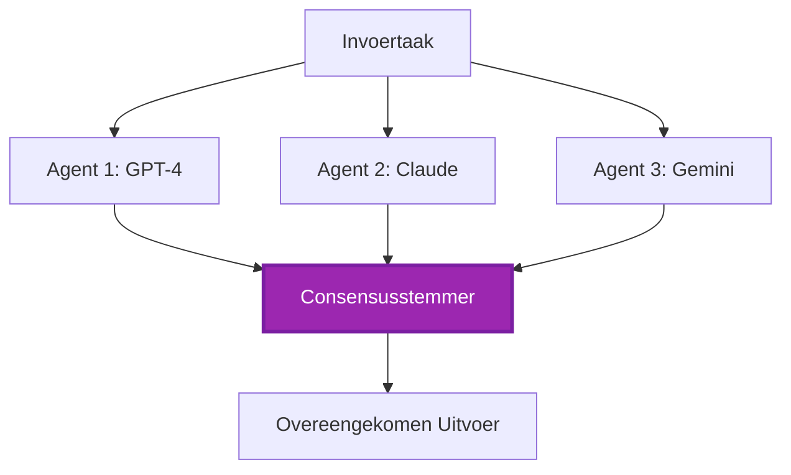
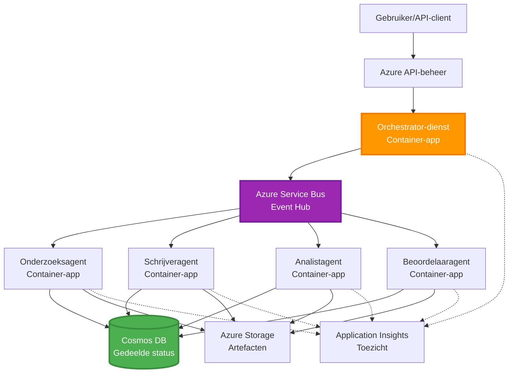

# Multi-agent coördinatiepatronen

⏱️ **Geschatte tijd**: 60-75 minuten | 💰 **Geschatte kosten**: ~$100-300/maand | ⭐ **Complexiteit**: Geavanceerd

**📚 Leerlijn:**
- ← Vorige: [Capaciteitsplanning](capacity-planning.md) - Middelenbepaling en schaalstrategieën
- 🎯 **Je bent hier**: Multi-agent coördinatiepatronen (orkestratie, communicatie, toestandbeheer)
- → Volgende: [SKU-selectie](sku-selection.md) - Het kiezen van de juiste Azure-services
- 🏠 [Cursus Startpagina](../../README.md)

---

## Wat je zult leren

Door deze les te voltooien, zul je:
- Begrijp **multi-agent architectuurpatronen** en wanneer je ze moet gebruiken
- Implementeer **orkestratiepatronen** (gecentraliseerd, gedecentraliseerd, hiërarchisch)
- Ontwerp **agent-communicatiestrategieën** (synchroon, asynchroon, gebeurtenisgestuurd)
- Beheer **gedeelde toestand** over gedistribueerde agenten
- Implementeer **multi-agent-systemen** op Azure met AZD
- Pas **coördinatiepatronen** toe op praktische AI-scenario's
- Monitor en debug gedistribueerde agentsystemen

## Waarom multi-agent coördinatie belangrijk is

### De evolutie: van enkele agent naar multi-agent

**Enkele agent (Eenvoudig):**
```
User → Agent → Response
```
- ✅ Gemakkelijk te begrijpen en te implementeren
- ✅ Snel voor eenvoudige taken
- ❌ Beperkt door de mogelijkheden van één model
- ❌ Kan complexe taken niet parallel uitvoeren
- ❌ Geen specialisatie

**Multi-agent systeem (Geavanceerd):**
```
           ┌─────────────┐
           │ Orchestrator│
           └──────┬──────┘
        ┌─────────┼─────────┐
        │         │         │
    ┌───▼──┐  ┌──▼───┐  ┌──▼────┐
    │Agent1│  │Agent2│  │Agent3 │
    │(Plan)│  │(Code)│  │(Review)│
    └──────┘  └──────┘  └───────┘
```
- ✅ Gespecialiseerde agenten voor specifieke taken
- ✅ Parallelle uitvoering voor snelheid
- ✅ Modulair en onderhoudbaar
- ✅ Beter bij complexe workflows
- ⚠️ Vereist coördinatielogica

**Analogie**: Een enkele agent is als één persoon die alle taken doet. Een multi-agent is als een team waarbij elk lid gespecialiseerde vaardigheden heeft (onderzoeker, programmeur, beoordelaar, schrijver) die samenwerken.

---

## Kern coördinatiepatronen

### Patroon 1: Sequentiële coördinatie (Chain of Responsibility)

**Wanneer te gebruiken**: Taken moeten in een specifieke volgorde worden voltooid, elke agent bouwt voort op de output van de vorige.


**Voordelen:**
- ✅ Duidelijke datastroom
- ✅ Gemakkelijk te debuggen
- ✅ Voorspelbare uitvoeringsvolgorde

**Beperkingen:**
- ❌ Trager (geen parallelisme)
- ❌ Één fout blokkeert de hele keten
- ❌ Kan geen onderling afhankelijke taken afhandelen

**Voorbeelden van gebruik:**
- Contentcreatie-pijplijn (onderzoek → schrijven → redigeren → publiceren)
- Codegeneratie (plan → implementeren → testen → implementeren)
- Rapportgeneratie (gegevensverzameling → analyse → visualisatie → samenvatting)

---

### Patroon 2: Parallelle coördinatie (Fan-Out/Fan-In)

**Wanneer te gebruiken**: Onafhankelijke taken kunnen gelijktijdig worden uitgevoerd, resultaten worden aan het einde gecombineerd.


**Voordelen:**
- ✅ Snel (parallelle uitvoering)
- ✅ Fouttolerant (gedeeltelijke resultaten zijn acceptabel)
- ✅ Schaal horizontaal

**Beperkingen:**
- ⚠️ Resultaten kunnen buiten volgorde aankomen
- ⚠️ Aggregatielogica nodig
- ⚠️ Complex toestandbeheer

**Voorbeelden van gebruik:**
- Multi-bron gegevensverzameling (API's + databases + webscraping)
- Competitieve analyse (meerdere modellen genereren oplossingen, beste wordt geselecteerd)
- Vertaalservices (tegelijkertijd naar meerdere talen vertalen)

---

### Patroon 3: Hiërarchische coördinatie (Manager-Worker)

**Wanneer te gebruiken**: Complexe workflows met subtaken, delegatie is nodig.


**Voordelen:**
- ✅ Hanteert complexe workflows
- ✅ Modulair en onderhoudbaar
- ✅ Duidelijke verantwoordelijkheidsgrenzen

**Beperkingen:**
- ⚠️ Complexere architectuur
- ⚠️ Hogere latentie (meerdere coördinatielagen)
- ⚠️ Vereist geavanceerde orkestratie

**Voorbeelden van gebruik:**
- Enterprise documentverwerking (classificeer → routeer → verwerk → archiveer)
- Meervoudige data-pijplijnen (ingest → schoonmaken → transformeren → analyseren → rapporteren)
- Complexe automatiseringsworkflows (planning → resourceallocatie → uitvoering → monitoring)

---

### Patroon 4: Gebeurtenisgestuurde coördinatie (Publish-Subscribe)

**Wanneer te gebruiken**: Agenten moeten reageren op gebeurtenissen, losse koppeling gewenst.


**Voordelen:**
- ✅ Losse koppeling tussen agenten
- ✅ Gemakkelijk nieuwe agenten toe te voegen (gewoon abonneren)
- ✅ Asynchrone verwerking
- ✅ Veerkrachtig (berichtenpersistentie)

**Beperkingen:**
- ⚠️ Uiteindelijk consistent
- ⚠️ Complexe debugging
- ⚠️ Uitdagingen met berichtvolgorde

**Voorbeelden van gebruik:**
- Real-time monitoringsystemen (alerts, dashboards, logs)
- Multi-kanaal notificaties (email, SMS, push, Slack)
- Dataverwerkingpijplijnen (meerdere consumenten van dezelfde data)

---

### Patroon 5: Consensus-gebaseerde coördinatie (Voting/Quorum)

**Wanneer te gebruiken**: Er is overeenstemming nodig van meerdere agenten voordat er wordt doorgegaan.


**Voordelen:**
- ✅ Hogere nauwkeurigheid (meerdere meningen)
- ✅ Fouttolerant (minderheidsfouten acceptabel)
- ✅ Kwaliteitsborging ingebouwd

**Beperkingen:**
- ❌ Duur (meerdere modelaanroepen)
- ❌ Trager (wachten op alle agenten)
- ⚠️ Conflictresolutie nodig

**Voorbeelden van gebruik:**
- Contentmoderatie (meerdere modellen beoordelen content)
- Codereview (meerdere linters/analyzers)
- Medische diagnose (meerdere AI-modellen, expertvalidatie)

---

## Architectuuroverzicht

### Volledig multi-agent systeem op Azure


**Belangrijke componenten:**

| Component | Doel | Azure-service |
|-----------|---------|---------------|
| **API Gateway** | Toegangspunt, rate limiting, authenticatie | API Management |
| **Orchestrator** | Coördineert agent-workflows | Container Apps |
| **Message Queue** | Asynchrone communicatie | Service Bus / Event Hubs |
| **Agents** | Gespecialiseerde AI-werkers | Container Apps / Functions |
| **State Store** | Gedeelde toestand, taaktracking | Cosmos DB |
| **Artifact Storage** | Documenten, resultaten, logs | Blob Storage |
| **Monitoring** | Gedistribueerde tracing, logs | Application Insights |

---

## Vereisten

### Vereiste tools

```bash
# Controleer Azure Developer CLI
azd version
# ✅ Verwacht: azd versie 1.0.0 of hoger

# Controleer Azure CLI
az --version
# ✅ Verwacht: azure-cli 2.50.0 of hoger

# Controleer Docker (voor lokaal testen)
docker --version
# ✅ Verwacht: Docker versie 20.10 of hoger
```

### Azure-vereisten

- Actief Azure-abonnement
- Machtigingen om te maken:
  - Container Apps
  - Service Bus namespaces
  - Cosmos DB accounts
  - Storage accounts
  - Application Insights

### Kennisvereisten

Je zou het volgende moeten hebben voltooid:
- [Configuratiebeheer](../chapter-03-configuration/configuration.md)
- [Authenticatie & Beveiliging](../chapter-03-configuration/authsecurity.md)
- [Microservices-voorbeeld](../../../../examples/microservices)

---

## Implementatiegids

### Projectstructuur

```
multi-agent-system/
├── azure.yaml                    # AZD configuration
├── infra/
│   ├── main.bicep               # Main infrastructure
│   ├── core/
│   │   ├── servicebus.bicep     # Message queue
│   │   ├── cosmos.bicep         # State store
│   │   ├── storage.bicep        # Artifact storage
│   │   └── monitoring.bicep     # Application Insights
│   └── app/
│       ├── orchestrator.bicep   # Orchestrator service
│       └── agent.bicep          # Agent template
└── src/
    ├── orchestrator/            # Orchestration logic
    │   ├── app.py
    │   ├── workflows.py
    │   └── Dockerfile
    ├── agents/
    │   ├── research/            # Research agent
    │   ├── writer/              # Writer agent
    │   ├── analyst/             # Analyst agent
    │   └── reviewer/            # Reviewer agent
    └── shared/
        ├── state_manager.py     # Shared state logic
        └── message_handler.py   # Message handling
```

---

## Les 1: Sequentieel coördinatiepatroon

### Implementatie: Pipeline voor contentcreatie

Laten we een sequentiële pijplijn bouwen: Onderzoek → Schrijven → Redigeren → Publiceren

### 1. AZD-configuratie

**Bestand: `azure.yaml`**

```yaml
name: content-pipeline
metadata:
  template: multi-agent-sequential@1.0.0

services:
  orchestrator:
    project: ./src/orchestrator
    language: python
    host: containerapp
  
  research-agent:
    project: ./src/agents/research
    language: python
    host: containerapp
  
  writer-agent:
    project: ./src/agents/writer
    language: python
    host: containerapp
  
  editor-agent:
    project: ./src/agents/editor
    language: python
    host: containerapp
```

### 2. Infrastructuur: Service Bus voor coördinatie

**Bestand: `infra/core/servicebus.bicep`**

```bicep
param name string
param location string
param tags object = {}

resource serviceBusNamespace 'Microsoft.ServiceBus/namespaces@2022-10-01-preview' = {
  name: name
  location: location
  tags: tags
  sku: {
    name: 'Standard'
    tier: 'Standard'
  }
  properties: {
    minimumTlsVersion: '1.2'
  }
}

// Queue for orchestrator → research agent
resource researchQueue 'Microsoft.ServiceBus/namespaces/queues@2022-10-01-preview' = {
  parent: serviceBusNamespace
  name: 'research-tasks'
  properties: {
    maxDeliveryCount: 3
    lockDuration: 'PT5M'
    deadLetteringOnMessageExpiration: true
  }
}

// Queue for research agent → writer agent
resource writerQueue 'Microsoft.ServiceBus/namespaces/queues@2022-10-01-preview' = {
  parent: serviceBusNamespace
  name: 'writer-tasks'
  properties: {
    maxDeliveryCount: 3
    lockDuration: 'PT5M'
  }
}

// Queue for writer agent → editor agent
resource editorQueue 'Microsoft.ServiceBus/namespaces/queues@2022-10-01-preview' = {
  parent: serviceBusNamespace
  name: 'editor-tasks'
  properties: {
    maxDeliveryCount: 3
    lockDuration: 'PT5M'
  }
}

output namespace string = serviceBusNamespace.name
output connectionString string = listKeys('${serviceBusNamespace.id}/AuthorizationRules/RootManageSharedAccessKey', serviceBusNamespace.apiVersion).primaryConnectionString
```

### 3. Shared State Manager

**Bestand: `src/shared/state_manager.py`**

```python
from azure.cosmos import CosmosClient, PartitionKey
from datetime import datetime
import os

class StateManager:
    """Manages shared state across agents using Cosmos DB"""
    
    def __init__(self):
        endpoint = os.environ['COSMOS_ENDPOINT']
        key = os.environ['COSMOS_KEY']
        
        self.client = CosmosClient(endpoint, key)
        self.database = self.client.get_database_client('agent-state')
        self.container = self.database.get_container_client('tasks')
    
    def create_task(self, task_id: str, task_type: str, input_data: dict):
        """Create a new task"""
        task = {
            'id': task_id,
            'type': task_type,
            'status': 'pending',
            'input': input_data,
            'created_at': datetime.utcnow().isoformat(),
            'steps': []
        }
        self.container.create_item(task)
        return task
    
    def update_task_step(self, task_id: str, step_name: str, result: dict):
        """Update task with completed step"""
        task = self.container.read_item(task_id, partition_key=task_id)
        
        task['steps'].append({
            'name': step_name,
            'completed_at': datetime.utcnow().isoformat(),
            'result': result
        })
        
        self.container.replace_item(task_id, task)
        return task
    
    def complete_task(self, task_id: str, final_result: dict):
        """Mark task as complete"""
        task = self.container.read_item(task_id, partition_key=task_id)
        task['status'] = 'completed'
        task['result'] = final_result
        task['completed_at'] = datetime.utcnow().isoformat()
        self.container.replace_item(task_id, task)
        return task
    
    def get_task(self, task_id: str):
        """Retrieve task state"""
        return self.container.read_item(task_id, partition_key=task_id)
```

### 4. Orchestrator Service

**Bestand: `src/orchestrator/app.py`**

```python
from flask import Flask, request, jsonify
from azure.servicebus import ServiceBusClient, ServiceBusMessage
import json
import uuid
import os
from shared.state_manager import StateManager

app = Flask(__name__)
state_manager = StateManager()

# Service Bus-verbinding
servicebus_connection_str = os.environ['SERVICEBUS_CONNECTION_STRING']
servicebus_client = ServiceBusClient.from_connection_string(servicebus_connection_str)

@app.route('/health', methods=['GET'])
def health():
    return jsonify({'status': 'healthy', 'service': 'orchestrator'})

@app.route('/create-content', methods=['POST'])
def create_content():
    """
    Sequential workflow: Research → Write → Edit → Publish
    """
    data = request.json
    topic = data.get('topic')
    
    if not topic:
        return jsonify({'error': 'Topic required'}), 400
    
    # Maak taak aan in statusopslag
    task_id = str(uuid.uuid4())
    task = state_manager.create_task(
        task_id=task_id,
        task_type='content_creation',
        input_data={'topic': topic}
    )
    
    # Stuur bericht naar onderzoeksagent (eerste stap)
    sender = servicebus_client.get_queue_sender('research-tasks')
    message = ServiceBusMessage(
        body=json.dumps({
            'task_id': task_id,
            'topic': topic,
            'next_queue': 'writer-tasks'  # Waar resultaten naartoe sturen
        }),
        content_type='application/json'
    )
    
    with sender:
        sender.send_messages(message)
    
    return jsonify({
        'task_id': task_id,
        'status': 'started',
        'workflow': 'sequential',
        'steps': ['research', 'write', 'edit', 'publish'],
        'message': 'Content creation pipeline initiated'
    }), 202

@app.route('/task/<task_id>', methods=['GET'])
def get_task_status(task_id):
    """Check task status"""
    try:
        task = state_manager.get_task(task_id)
        return jsonify(task)
    except Exception as e:
        return jsonify({'error': str(e)}), 404

if __name__ == '__main__':
    app.run(host='0.0.0.0', port=8080)
```

### 5. Research Agent

**Bestand: `src/agents/research/app.py`**

```python
from azure.servicebus import ServiceBusClient, ServiceBusMessage
from openai import AzureOpenAI
import json
import os
import time
from shared.state_manager import StateManager

# Initialiseer clients
state_manager = StateManager()
servicebus_client = ServiceBusClient.from_connection_string(
    os.environ['SERVICEBUS_CONNECTION_STRING']
)

openai_client = AzureOpenAI(
    api_key=os.environ['AZURE_OPENAI_API_KEY'],
    api_version="2024-02-01",
    azure_endpoint=os.environ['AZURE_OPENAI_ENDPOINT']
)

def process_research_task(message_data):
    """Process research request and pass to writer"""
    task_id = message_data['task_id']
    topic = message_data['topic']
    next_queue = message_data['next_queue']
    
    print(f"🔬 Researching: {topic}")
    
    # Roep Azure OpenAI aan voor onderzoek
    response = openai_client.chat.completions.create(
        model="gpt-4",
        messages=[
            {"role": "system", "content": "You are a research assistant. Provide comprehensive research on the given topic."},
            {"role": "user", "content": f"Research this topic thoroughly: {topic}"}
        ],
        max_tokens=1500
    )
    
    research_results = response.choices[0].message.content
    
    # Werk de status bij
    state_manager.update_task_step(
        task_id=task_id,
        step_name='research',
        result={'research': research_results}
    )
    
    # Stuur naar de volgende agent (schrijver)
    sender = servicebus_client.get_queue_sender(next_queue)
    message = ServiceBusMessage(
        body=json.dumps({
            'task_id': task_id,
            'topic': topic,
            'research': research_results,
            'next_queue': 'editor-tasks'
        }),
        content_type='application/json'
    )
    
    with sender:
        sender.send_messages(message)
    
    print(f"✅ Research complete for task {task_id}")

def main():
    """Listen to research queue"""
    receiver = servicebus_client.get_queue_receiver('research-tasks')
    
    print("🔬 Research Agent started, listening for tasks...")
    
    with receiver:
        while True:
            messages = receiver.receive_messages(max_wait_time=5)
            for message in messages:
                try:
                    message_data = json.loads(str(message))
                    process_research_task(message_data)
                    receiver.complete_message(message)
                except Exception as e:
                    print(f"❌ Error processing message: {e}")
                    receiver.abandon_message(message)

if __name__ == '__main__':
    main()
```

### 6. Writer Agent

**Bestand: `src/agents/writer/app.py`**

```python
from azure.servicebus import ServiceBusClient, ServiceBusMessage
from openai import AzureOpenAI
import json
import os
from shared.state_manager import StateManager

state_manager = StateManager()
servicebus_client = ServiceBusClient.from_connection_string(
    os.environ['SERVICEBUS_CONNECTION_STRING']
)

openai_client = AzureOpenAI(
    api_key=os.environ['AZURE_OPENAI_API_KEY'],
    api_version="2024-02-01",
    azure_endpoint=os.environ['AZURE_OPENAI_ENDPOINT']
)

def process_writing_task(message_data):
    """Write article based on research"""
    task_id = message_data['task_id']
    topic = message_data['topic']
    research = message_data['research']
    next_queue = message_data['next_queue']
    
    print(f"✍️ Writing article: {topic}")
    
    # Roep Azure OpenAI aan om een artikel te schrijven
    response = openai_client.chat.completions.create(
        model="gpt-4",
        messages=[
            {"role": "system", "content": "You are a professional writer. Write engaging, well-structured articles."},
            {"role": "user", "content": f"Based on this research:\n\n{research}\n\nWrite a comprehensive article about: {topic}"}
        ],
        max_tokens=2000
    )
    
    article_draft = response.choices[0].message.content
    
    # Werk de status bij
    state_manager.update_task_step(
        task_id=task_id,
        step_name='writing',
        result={'draft': article_draft}
    )
    
    # Stuur naar de redacteur
    sender = servicebus_client.get_queue_sender(next_queue)
    message = ServiceBusMessage(
        body=json.dumps({
            'task_id': task_id,
            'topic': topic,
            'draft': article_draft
        }),
        content_type='application/json'
    )
    
    with sender:
        sender.send_messages(message)
    
    print(f"✅ Article draft complete for task {task_id}")

def main():
    """Listen to writer queue"""
    receiver = servicebus_client.get_queue_receiver('writer-tasks')
    
    print("✍️ Writer Agent started, listening for tasks...")
    
    with receiver:
        while True:
            messages = receiver.receive_messages(max_wait_time=5)
            for message in messages:
                try:
                    message_data = json.loads(str(message))
                    process_writing_task(message_data)
                    receiver.complete_message(message)
                except Exception as e:
                    print(f"❌ Error: {e}")
                    receiver.abandon_message(message)

if __name__ == '__main__':
    main()
```

### 7. Editor Agent

**Bestand: `src/agents/editor/app.py`**

```python
from azure.servicebus import ServiceBusClient
from openai import AzureOpenAI
import json
import os
from shared.state_manager import StateManager

state_manager = StateManager()
servicebus_client = ServiceBusClient.from_connection_string(
    os.environ['SERVICEBUS_CONNECTION_STRING']
)

openai_client = AzureOpenAI(
    api_key=os.environ['AZURE_OPENAI_API_KEY'],
    api_version="2024-02-01",
    azure_endpoint=os.environ['AZURE_OPENAI_ENDPOINT']
)

def process_editing_task(message_data):
    """Edit and finalize article"""
    task_id = message_data['task_id']
    topic = message_data['topic']
    draft = message_data['draft']
    
    print(f"📝 Editing article: {topic}")
    
    # Roep Azure OpenAI aan om te bewerken
    response = openai_client.chat.completions.create(
        model="gpt-4",
        messages=[
            {"role": "system", "content": "You are an expert editor. Improve grammar, clarity, and structure."},
            {"role": "user", "content": f"Edit and improve this article:\n\n{draft}"}
        ],
        max_tokens=2000
    )
    
    final_article = response.choices[0].message.content
    
    # Markeer taak als voltooid
    state_manager.complete_task(
        task_id=task_id,
        final_result={
            'topic': topic,
            'final_article': final_article,
            'word_count': len(final_article.split())
        }
    )
    
    print(f"✅ Article finalized for task {task_id}")

def main():
    """Listen to editor queue"""
    receiver = servicebus_client.get_queue_receiver('editor-tasks')
    
    print("📝 Editor Agent started, listening for tasks...")
    
    with receiver:
        while True:
            messages = receiver.receive_messages(max_wait_time=5)
            for message in messages:
                try:
                    message_data = json.loads(str(message))
                    process_editing_task(message_data)
                    receiver.complete_message(message)
                except Exception as e:
                    print(f"❌ Error: {e}")
                    receiver.abandon_message(message)

if __name__ == '__main__':
    main()
```

### 8. Implementeren en testen

```bash
# Initialiseren en uitrollen
azd init
azd up

# Orchestrator-URL ophalen
ORCHESTRATOR_URL=$(azd env get-values | grep ORCHESTRATOR_URL | cut -d '=' -f2 | tr -d '"')

# Inhoud aanmaken
curl -X POST $ORCHESTRATOR_URL/create-content \
  -H "Content-Type: application/json" \
  -d '{"topic": "The Future of AI in Healthcare"}'
```

**✅ Verwachte uitvoer:**
```json
{
  "task_id": "a1b2c3d4-e5f6-7890-abcd-ef1234567890",
  "status": "started",
  "workflow": "sequential",
  "steps": ["research", "write", "edit", "publish"],
  "message": "Content creation pipeline initiated"
}
```

**Controleer taakvoortgang:**
```bash
TASK_ID="a1b2c3d4-e5f6-7890-abcd-ef1234567890"
curl $ORCHESTRATOR_URL/task/$TASK_ID
```

**✅ Verwachte uitvoer (voltooid):**
```json
{
  "id": "a1b2c3d4-e5f6-7890-abcd-ef1234567890",
  "type": "content_creation",
  "status": "completed",
  "steps": [
    {
      "name": "research",
      "completed_at": "2025-11-19T10:30:00Z",
      "result": {"research": "..."}
    },
    {
      "name": "writing",
      "completed_at": "2025-11-19T10:32:00Z",
      "result": {"draft": "..."}
    }
  ],
  "result": {
    "topic": "The Future of AI in Healthcare",
    "final_article": "...",
    "word_count": 1500
  }
}
```

---

## Les 2: Parallelle coördinatiepatroon

### Implementatie: Onderzoeksaggregator met meerdere bronnen

Laten we een parallel systeem bouwen dat tegelijkertijd informatie uit meerdere bronnen verzamelt.

### Parallelle orkestrator

**Bestand: `src/orchestrator/parallel_workflow.py`**

```python
from flask import Flask, request, jsonify
from azure.servicebus import ServiceBusClient, ServiceBusMessage
import json
import uuid
import os
from shared.state_manager import StateManager

app = Flask(__name__)
state_manager = StateManager()

servicebus_client = ServiceBusClient.from_connection_string(
    os.environ['SERVICEBUS_CONNECTION_STRING']
)

@app.route('/research-parallel', methods=['POST'])
def research_parallel():
    """
    Parallel workflow: Multiple agents work simultaneously
    """
    data = request.json
    query = data.get('query')
    
    task_id = str(uuid.uuid4())
    task = state_manager.create_task(
        task_id=task_id,
        task_type='parallel_research',
        input_data={
            'query': query,
            'agents': ['web', 'academic', 'news', 'social']
        }
    )
    
    # Fan-out: Stuur gelijktijdig naar alle agenten
    agents = [
        ('web-research-queue', 'web'),
        ('academic-research-queue', 'academic'),
        ('news-research-queue', 'news'),
        ('social-research-queue', 'social')
    ]
    
    for queue_name, agent_type in agents:
        sender = servicebus_client.get_queue_sender(queue_name)
        message = ServiceBusMessage(
            body=json.dumps({
                'task_id': task_id,
                'query': query,
                'agent_type': agent_type,
                'result_queue': 'aggregation-queue'
            }),
            content_type='application/json'
        )
        
        with sender:
            sender.send_messages(message)
    
    return jsonify({
        'task_id': task_id,
        'status': 'started',
        'workflow': 'parallel',
        'agents_dispatched': 4,
        'message': 'Parallel research initiated'
    }), 202

if __name__ == '__main__':
    app.run(host='0.0.0.0', port=8080)
```

### Aggregatielogica

**Bestand: `src/agents/aggregator/app.py`**

```python
from azure.servicebus import ServiceBusClient
import json
import os
from collections import defaultdict
from shared.state_manager import StateManager

state_manager = StateManager()
servicebus_client = ServiceBusClient.from_connection_string(
    os.environ['SERVICEBUS_CONNECTION_STRING']
)

# Resultaten per taak bijhouden
task_results = defaultdict(list)
expected_agents = 4  # web, academisch, nieuws, sociaal

def process_result(message_data):
    """Aggregate results from parallel agents"""
    task_id = message_data['task_id']
    agent_type = message_data['agent_type']
    result = message_data['result']
    
    # Resultaat opslaan
    task_results[task_id].append({
        'agent': agent_type,
        'data': result
    })
    
    print(f"📊 Received result from {agent_type} agent ({len(task_results[task_id])}/{expected_agents})")
    
    # Controleer of alle agenten voltooid zijn (fan-in)
    if len(task_results[task_id]) == expected_agents:
        print(f"✅ All agents completed for task {task_id}. Aggregating...")
        
        # Resultaten combineren
        aggregated = {
            'query': message_data['query'],
            'sources': task_results[task_id],
            'summary': generate_summary(task_results[task_id])
        }
        
        # Markeer als voltooid
        state_manager.complete_task(task_id, aggregated)
        
        # Opruimen
        del task_results[task_id]
        
        print(f"✅ Aggregation complete for task {task_id}")

def generate_summary(results):
    """Generate summary from all sources"""
    summaries = [r['data'].get('summary', '') for r in results]
    return '\n\n'.join(summaries)

def main():
    """Listen to aggregation queue"""
    receiver = servicebus_client.get_queue_receiver('aggregation-queue')
    
    print("📊 Aggregator started, listening for results...")
    
    with receiver:
        while True:
            messages = receiver.receive_messages(max_wait_time=5)
            for message in messages:
                try:
                    message_data = json.loads(str(message))
                    process_result(message_data)
                    receiver.complete_message(message)
                except Exception as e:
                    print(f"❌ Error: {e}")
                    receiver.abandon_message(message)

if __name__ == '__main__':
    main()
```

**Voordelen van het parallelle patroon:**
- ⚡ **4x sneller** (agenten draaien gelijktijdig)
- 🔄 **Fouttolerant** (gedeeltelijke resultaten zijn acceptabel)
- 📈 **Schaalbaar** (voeg eenvoudig meer agenten toe)

---

## Praktische oefeningen

### Oefening 1: Voeg time-outafhandeling toe ⭐⭐ (Gemiddeld)

**Doel**: Implementeer time-outlogica zodat de aggregator niet eeuwig wacht op trage agenten.

**Stappen**:

1. **Voeg time-outtracking toe aan de aggregator:**

```python
from datetime import datetime, timedelta

task_timeouts = {}  # task_id -> vervaltijd

def process_result(message_data):
    task_id = message_data['task_id']
    
    # Stel time-out in voor het eerste resultaat
    if task_id not in task_timeouts:
        task_timeouts[task_id] = datetime.utcnow() + timedelta(seconds=30)
    
    task_results[task_id].append({
        'agent': message_data['agent_type'],
        'data': message_data['result']
    })
    
    # Controleer of voltooid OF time-out opgetreden is
    if len(task_results[task_id]) == expected_agents or \
       datetime.utcnow() > task_timeouts[task_id]:
        
        print(f"📊 Aggregating with {len(task_results[task_id])}/{expected_agents} results")
        
        aggregated = {
            'query': message_data['query'],
            'sources': task_results[task_id],
            'completed_agents': len(task_results[task_id]),
            'timed_out': len(task_results[task_id]) < expected_agents
        }
        
        state_manager.complete_task(task_id, aggregated)
        
        # Opruimen
        del task_results[task_id]
        del task_timeouts[task_id]
```

2. **Test met kunstmatige vertragingen:**

```python
# Voeg bij één agent vertraging toe om trage verwerking te simuleren
import time
time.sleep(35)  # Overschrijdt de 30-seconden time-out
```

3. **Implementeer en verifieer:**

```bash
azd deploy aggregator

# Taak indienen
curl -X POST $ORCHESTRATOR_URL/research-parallel \
  -H "Content-Type: application/json" \
  -d '{"query": "AI safety research"}'

# Controleer resultaten na 30 seconden
curl $ORCHESTRATOR_URL/task/$TASK_ID
```

**✅ Succescriteria:**
- ✅ Taak voltooit na 30 seconden, zelfs als agenten niet klaar zijn
- ✅ Response geeft gedeeltelijke resultaten aan (`"timed_out": true`)
- ✅ Beschikbare resultaten worden geretourneerd (3 van de 4 agenten)

**Tijd**: 20-25 minuten

---

### Oefening 2: Implementeer retry-logica ⭐⭐⭐ (Geavanceerd)

**Doel**: Laat mislukte agenttaken automatisch opnieuw proberen voordat er wordt opgegeven.

**Stappen**:

1. **Voeg retry-tracking toe aan de orchestrator:**

```python
from dataclasses import dataclass
from typing import Dict

@dataclass
class RetryConfig:
    max_retries: int = 3
    backoff_seconds: int = 5

retry_counts: Dict[str, int] = {}  # bericht_id -> aantal_pogingen

def send_with_retry(queue_name: str, message_data: dict, retry_config: RetryConfig):
    """Send message with retry metadata"""
    message_id = message_data.get('message_id', str(uuid.uuid4()))
    message_data['message_id'] = message_id
    message_data['retry_count'] = retry_counts.get(message_id, 0)
    message_data['max_retries'] = retry_config.max_retries
    
    sender = servicebus_client.get_queue_sender(queue_name)
    message = ServiceBusMessage(
        body=json.dumps(message_data),
        content_type='application/json',
        message_id=message_id
    )
    
    with sender:
        sender.send_messages(message)
```

2. **Voeg retry-handler toe aan agenten:**

```python
def process_with_retry(message, receiver, process_func):
    """Process message with automatic retry on failure"""
    try:
        message_data = json.loads(str(message))
        
        # Verwerk het bericht
        process_func(message_data)
        
        # Succes - voltooid
        receiver.complete_message(message)
        
    except Exception as e:
        message_id = message.message_id
        retry_count = message_data.get('retry_count', 0)
        max_retries = message_data.get('max_retries', 3)
        
        if retry_count < max_retries:
            # Opnieuw proberen: afbreken en opnieuw in de wachtrij plaatsen met verhoogd aantal
            print(f"⚠️ Retry {retry_count + 1}/{max_retries} for message {message_id}")
            
            message_data['retry_count'] = retry_count + 1
            
            # Terugsturen naar dezelfde wachtrij met vertraging
            time.sleep(5 * (retry_count + 1))  # Exponentiële back-off
            send_with_retry(queue_name, message_data, RetryConfig())
            
            receiver.complete_message(message)  # Origineel verwijderen
        else:
            # Maximale pogingen overschreden - verplaats naar dead-letter queue
            print(f"❌ Max retries exceeded for message {message_id}")
            receiver.dead_letter_message(
                message,
                reason="MaxRetriesExceeded",
                error_description=str(e)
            )
```

3. **Monitor dead letter queue:**

```python
def monitor_dead_letters():
    """Check dead letter queue for failed messages"""
    receiver = servicebus_client.get_queue_receiver(
        'research-queue',
        sub_queue='deadletter'
    )
    
    with receiver:
        messages = receiver.receive_messages(max_wait_time=5)
        for message in messages:
            print(f"☠️ Dead letter: {message.message_id}")
            print(f"Reason: {message.dead_letter_reason}")
            print(f"Description: {message.dead_letter_error_description}")
```

**✅ Succescriteria:**
- ✅ Mislukte taken worden automatisch opnieuw geprobeerd (tot 3 keer)
- ✅ Exponentiële backoff tussen pogingen (5s, 10s, 15s)
- ✅ Na maximale pogingen gaan berichten naar de dead letter queue
- ✅ Dead letter queue kan worden gemonitord en opnieuw worden afgespeeld

**Tijd**: 30-40 minuten

---

### Oefening 3: Implementeer circuit breaker ⭐⭐⭐ (Geavanceerd)

**Doel**: Voorkom kettingfouten door verzoeken naar falende agenten te stoppen.

**Stappen**:

1. **Maak circuit breaker-klasse:**

```python
from enum import Enum
from datetime import datetime, timedelta

class CircuitState(Enum):
    CLOSED = "closed"      # Normale werking
    OPEN = "open"          # Faalt, verzoeken weigeren
    HALF_OPEN = "half_open"  # Testen of hersteld

class CircuitBreaker:
    def __init__(self, failure_threshold=5, timeout_seconds=60):
        self.failure_threshold = failure_threshold
        self.timeout_seconds = timeout_seconds
        self.failure_count = 0
        self.last_failure_time = None
        self.state = CircuitState.CLOSED
    
    def call(self, func):
        """Execute function with circuit breaker protection"""
        if self.state == CircuitState.OPEN:
            # Controleren of time-out is verlopen
            if datetime.utcnow() - self.last_failure_time > timedelta(seconds=self.timeout_seconds):
                self.state = CircuitState.HALF_OPEN
                print("🔄 Circuit breaker: HALF_OPEN (testing)")
            else:
                raise Exception(f"Circuit breaker OPEN for agent. Try again in {self.timeout_seconds}s")
        
        try:
            result = func()
            
            # Succes
            if self.state == CircuitState.HALF_OPEN:
                self.state = CircuitState.CLOSED
                self.failure_count = 0
                print("✅ Circuit breaker: CLOSED (recovered)")
            
            return result
            
        except Exception as e:
            self.failure_count += 1
            self.last_failure_time = datetime.utcnow()
            
            if self.failure_count >= self.failure_threshold:
                self.state = CircuitState.OPEN
                print(f"🔴 Circuit breaker: OPEN (too many failures)")
            
            raise e
```

2. **Pas toe op agentaanroepen:**

```python
# In de orkestrator
agent_circuits = {
    'web': CircuitBreaker(failure_threshold=5, timeout_seconds=60),
    'academic': CircuitBreaker(failure_threshold=5, timeout_seconds=60),
    'news': CircuitBreaker(failure_threshold=5, timeout_seconds=60),
    'social': CircuitBreaker(failure_threshold=5, timeout_seconds=60)
}

def send_to_agent(agent_type, message_data):
    """Send with circuit breaker protection"""
    circuit = agent_circuits[agent_type]
    
    try:
        circuit.call(lambda: send_message(agent_type, message_data))
    except Exception as e:
        print(f"⚠️ Skipping {agent_type} agent: {e}")
        # Ga door met andere agenten
```

3. **Test circuit breaker:**

```bash
# Simuleer herhaalde fouten (stop één agent)
az containerapp stop --name web-research-agent --resource-group rg-agents

# Verstuur meerdere verzoeken
for i in {1..10}; do
  curl -X POST $ORCHESTRATOR_URL/research-parallel \
    -H "Content-Type: application/json" \
    -d '{"query": "test query '$i'"}'
  sleep 2
done

# Controleer de logs - je zou 'circuit open' moeten zien na 5 fouten
# Gebruik de Azure CLI voor Container App-logs:
az containerapp logs show --name orchestrator --resource-group $RG_NAME --tail 50
```

**✅ Succescriteria:**
- ✅ Na 5 fouten gaat het circuit open (verwerpt verzoeken)
- ✅ Na 60 seconden gaat het circuit half-open (test herstel)
- ✅ Andere agenten blijven normaal werken
- ✅ Het circuit sluit automatisch wanneer de agent herstelt

**Tijd**: 40-50 minuten

---

## Monitoring en debugging

### Gedistribueerde tracing met Application Insights

**Bestand: `src/shared/tracing.py`**

```python
from opencensus.ext.azure.log_exporter import AzureLogHandler
from opencensus.ext.azure.trace_exporter import AzureExporter
from opencensus.trace import config_integration
from opencensus.trace.tracer import Tracer
from opencensus.trace.samplers import AlwaysOnSampler
import logging
import os

# Tracing configureren
config_integration.trace_integrations(['requests', 'logging'])

connection_string = os.environ.get('APPLICATIONINSIGHTS_CONNECTION_STRING')

# Maak tracer aan
tracer = Tracer(
    exporter=AzureExporter(connection_string=connection_string),
    sampler=AlwaysOnSampler()
)

# Logging configureren
logger = logging.getLogger(__name__)
logger.addHandler(AzureLogHandler(connection_string=connection_string))
logger.setLevel(logging.INFO)

def trace_agent_call(agent_name, task_id, operation):
    """Trace agent operations"""
    with tracer.span(name=f'{agent_name}.{operation}') as span:
        span.add_attribute('agent', agent_name)
        span.add_attribute('task_id', task_id)
        span.add_attribute('operation', operation)
        
        try:
            result = operation()
            span.add_attribute('status', 'success')
            return result
        except Exception as e:
            span.add_attribute('status', 'error')
            span.add_attribute('error', str(e))
            raise
```

### Application Insights-queries

**Volg multi-agent-workflows:**

```kusto
// Trace complete workflow for a task
traces
| where customDimensions.task_id == "a1b2c3d4-..."
| project timestamp, message, customDimensions.agent, customDimensions.operation
| order by timestamp asc
```

**Vergelijking van agentprestaties:**

```kusto
// Compare agent execution times
dependencies
| where name contains "agent"
| summarize 
    avg_duration = avg(duration),
    p95_duration = percentile(duration, 95),
    count = count()
  by agent = tostring(customDimensions.agent)
| order by avg_duration desc
```

**Foutanalyse:**

```kusto
// Find which agents fail most
exceptions
| where customDimensions.agent != ""
| summarize 
    failure_count = count(),
    unique_errors = dcount(outerMessage)
  by agent = tostring(customDimensions.agent)
| order by failure_count desc
```

---

## Kostenanalyse

### Kosten van multi-agent-systeem (maandelijkse schattingen)

| Component | Configuratie | Kosten |
|-----------|--------------|------|
| **Orchestrator** | 1 Container App (1 vCPU, 2GB) | $30-50 |
| **4 Agents** | 4 Container Apps (0.5 vCPU, 1GB each) | $60-120 |
| **Service Bus** | Standard tier, 10M messages | $10-20 |
| **Cosmos DB** | Serverless, 5GB storage, 1M RUs | $25-50 |
| **Blob Storage** | 10GB storage, 100K operations | $5-10 |
| **Application Insights** | 5GB ingestion | $10-15 |
| **Azure OpenAI** | GPT-4, 10M tokens | $100-300 |
| **Total** | | **$240-565/maand** |

### Kostenoptimalisatiestrategieën

1. **Gebruik serverless waar mogelijk:**
   ```bicep
   // Cosmos DB serverless (no minimum cost)
   properties: {
     databaseAccountOfferType: 'Standard'
     capabilities: [{ name: 'EnableServerless' }]
   }
   ```

2. **Schaal agenten naar nul wanneer inactief:**
   ```bicep
   scale: {
     minReplicas: 0  // Scale to zero when no messages
     maxReplicas: 10
   }
   ```

3. **Gebruik batching voor Service Bus:**
   ```python
   # Verstuur berichten in batches (goedkoper)
   sender.send_messages([message1, message2, message3])
   ```

4. **Cache veelgebruikte resultaten:**
   ```python
   # Gebruik Azure Cache voor Redis
   if cache.exists(query_hash):
       return cache.get(query_hash)
   ```

---

## Beste praktijken

### ✅ DOEN:

1. **Gebruik idempotente bewerkingen**
   ```python
   # Agent kan hetzelfde bericht meerdere keren veilig verwerken
   def process_task(task_id):
       if state_manager.task_exists(task_id):
           print(f"Task {task_id} already processed, skipping")
           return
       # Taak verwerken...
   ```

2. **Implementeer uitgebreide logging**
   ```python
   logger.info(f"Agent: {agent_name}, Task: {task_id}, Action: {action}")
   ```

3. **Gebruik correlatie-ID's**
   ```python
   # Geef task_id door in de gehele workflow
   message_data = {
       'task_id': task_id,  # Correlatie-ID
       'timestamp': datetime.utcnow().isoformat()
   }
   ```

4. **Stel message TTL (time-to-live) in**
   ```bicep
   properties: {
     defaultMessageTimeToLive: 'PT1H'  // 1 hour max
   }
   ```

5. **Monitor dead letter queues**
   ```python
   # Regelmatige monitoring van mislukte berichten
   monitor_dead_letters()
   ```

### ❌ NIET DOEN:

1. **Maak geen circulaire afhankelijkheden**
   ```python
   # ❌ SLECHT: Agent A → Agent B → Agent A (oneindige lus)
   # ✅ GOED: Definieer een duidelijke gerichte acyclische graaf (DAG)
   ```

2. **Blokkeer geen agent-threads**
   ```python
   # ❌ SLECHT: Synchrone wachttijd
   while not task_complete:
       time.sleep(1)
   
   # ✅ GOED: Gebruik callbacks van de berichtwachtrij
   ```

3. **Negeer geen gedeeltelijke fouten**
   ```python
   # ❌ SLECHT: Laat de hele workflow falen als één agent faalt
   # ✅ GOED: Geef gedeeltelijke resultaten terug met foutindicatoren
   ```

4. **Gebruik geen oneindige herhalingen**
   ```python
   # ❌ SLECHT: onbeperkt opnieuw proberen
   # ✅ GOED: max_retries = 3, daarna naar dead letter
   ```

---
## Probleemoplossingsgids

### Probleem: Berichten blijven in wachtrij hangen

**Symptomen:**
- Berichten stapelen zich op in de wachtrij
- Agenten verwerken geen taken
- Taakstatus blijft op "pending" hangen

**Diagnose:**
```bash
# Controleer wachtrijdiepte
az servicebus queue show \
  --namespace-name mybus \
  --name research-tasks \
  --query "countDetails"

# Controleer agentlogs met Azure CLI
az containerapp logs show --name research-agent --resource-group $RG_NAME --tail 50
```

**Oplossingen:**

1. **Vergroot het aantal agent-replicas:**
   ```bash
   az containerapp update \
     --name research-agent \
     --min-replicas 3 \
     --max-replicas 10
   ```

2. **Controleer de dead letter queue:**
   ```bash
   az servicebus queue show \
     --namespace-name mybus \
     --name research-tasks \
     --query "countDetails.deadLetterMessageCount"
   ```

---

### Probleem: Taak time-out/voltooit nooit

**Symptomen:**
- Taakstatus blijft op "in_progress"
- Sommige agenten voltooien, andere niet
- Geen foutmeldingen

**Diagnose:**
```bash
# Controleer taakstatus
curl $ORCHESTRATOR_URL/task/$TASK_ID

# Controleer Application Insights
# Voer query uit: traces | where customDimensions.task_id == "..."
```

**Oplossingen:**

1. **Implementeer time-out in de aggregator (Oefening 1)**

2. **Controleer op agentstoringen met Azure Monitor:**
   ```bash
   # Bekijk logs via azd monitor
   azd monitor --logs
   
   # Of gebruik de Azure CLI om de logs van een specifieke container-app te bekijken
   az containerapp logs show --name <agent-name> --resource-group $RG_NAME --follow | grep "ERROR\|FAIL"
   ```

3. **Controleer of alle agenten actief zijn:**
   ```bash
   az containerapp list \
     --resource-group rg-agents \
     --query "[].{name:name, status:properties.runningStatus}"
   ```

---

## Meer informatie

### Officiële documentatie
- [Azure Service Bus](https://learn.microsoft.com/azure/service-bus-messaging/service-bus-messaging-overview)
- [Cosmos DB](https://learn.microsoft.com/azure/cosmos-db/introduction)
- [Container Apps DAPR](https://learn.microsoft.com/azure/container-apps/dapr-overview)
- [Multi-Agent Design Patterns](https://learn.microsoft.com/azure/architecture/guide/ai/multi-agent-systems)

### Volgende stappen in deze cursus
- ← Vorige: [Capacity Planning](capacity-planning.md)
- → Volgende: [SKU Selection](sku-selection.md)
- 🏠 [Cursus Startpagina](../../README.md)

### Gerelateerde voorbeelden
- [Microservices Example](../../../../examples/microservices) - Patronen voor servicecommunicatie
- [Azure OpenAI Example](../../../../examples/azure-openai-chat) - AI-integratie

---

## Samenvatting

**Je hebt geleerd:**
- ✅ Vijf coördinatiepatronen (sequentieel, parallel, hiërarchisch, gebeurtenisgestuurd, consensus)
- ✅ Multi-agentarchitectuur op Azure (Service Bus, Cosmos DB, Container Apps)
- ✅ Toestandsbeheer over gedistribueerde agenten
- ✅ Afhandeling van time-outs, opnieuw proberen en circuitbreakers
- ✅ Monitoring en debuggen van gedistribueerde systemen
- ✅ Strategieën voor kostenoptimalisatie

**Belangrijkste leerpunten:**
1. **Kies het juiste patroon** - Sequentieel voor geordende workflows, parallel voor snelheid, gebeurtenisgestuurd voor flexibiliteit
2. **Beheer de toestand zorgvuldig** - Gebruik Cosmos DB of iets dergelijks voor gedeelde toestand
3. **Ga op nette wijze om met fouten** - Time-outs, opnieuw proberen, circuitbreakers, dead letter queues
4. **Monitor alles** - Gedistribueerde tracing is essentieel voor debuggen
5. **Optimaliseer kosten** - Schaal naar nul, gebruik serverless, implementeer caching

**Volgende stappen:**
1. Voltooi de praktische oefeningen
2. Bouw een multi-agent-systeem voor jouw use case
3. Bestudeer [SKU Selection](sku-selection.md) om prestaties en kosten te optimaliseren

---

<!-- CO-OP TRANSLATOR DISCLAIMER START -->
Disclaimer:
Dit document is vertaald met behulp van de AI-vertalingsdienst [Co-op Translator](https://github.com/Azure/co-op-translator). Hoewel wij streven naar nauwkeurigheid, dient u er rekening mee te houden dat geautomatiseerde vertalingen fouten of onnauwkeurigheden kunnen bevatten. Het oorspronkelijke document in de oorspronkelijke taal moet als de gezaghebbende bron worden beschouwd. Voor kritieke informatie wordt een professionele menselijke vertaling aanbevolen. Wij zijn niet aansprakelijk voor eventuele misverstanden of verkeerde interpretaties die voortvloeien uit het gebruik van deze vertaling.
<!-- CO-OP TRANSLATOR DISCLAIMER END -->