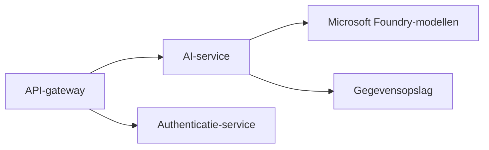

# Chapter 8: Productie- & Enterprise-patronen

**📚 Cursus**: [AZD voor Beginners](../../README.md) | **⏱️ Duur**: 2-3 uur | **⭐ Complexiteit**: Geavanceerd

---

## Overzicht

Dit hoofdstuk behandelt enterprise-klare uitrolpatronen, beveiligingsversterking, monitoring en kostenoptimalisatie voor productie-AI-workloads.

## Leerdoelen

Door dit hoofdstuk te voltooien, zul je:
- Multi-regio implementaties uitrollen voor veerkracht
- Enterprise-beveiligingspatronen implementeren
- Uitgebreide monitoring configureren
- Kosten op schaal optimaliseren
- CI/CD-pijplijnen opzetten met AZD

---

## 📚 Lessen

| # | Les | Beschrijving | Tijd |
|---|--------|-------------|------|
| 1 | [Productie AI Praktijken](production-ai-practices.md) | Enterprise-implementatiepatronen | 90 min |

---

## 🚀 Productie-checklist

- [ ] Multi-regio-implementatie voor veerkracht
- [ ] Beheerde identiteit voor authenticatie (geen sleutels)
- [ ] Application Insights voor monitoring
- [ ] Kostenbudgetten en waarschuwingen geconfigureerd
- [ ] Beveiligingsscans ingeschakeld
- [ ] CI/CD-pijplijnintegratie
- [ ] Noodherstelplan

---

## 🏗️ Architectuurpatronen

### Patroon 1: Microservices AI


### Patroon 2: Event-Driven AI


---

## 🔐 Beste beveiligingspraktijken

```bicep
// Use managed identity
identity: {
  type: 'SystemAssigned'
}

// Private endpoints for AI services
properties: {
  publicNetworkAccess: 'Disabled'
  networkAcls: {
    defaultAction: 'Deny'
  }
}
```

---

## 💰 Kostenoptimalisatie

| Strategie | Besparingen |
|----------|---------|
| Schaal naar nul (Container Apps) | 60-80% |
| Gebruik consumption-tiers voor ontwikkeling | 50-70% |
| Geplande schaalvergroting | 30-50% |
| Gereserveerde capaciteit | 20-40% |

```bash
# Stel budgetwaarschuwingen in
az consumption budget create \
  --budget-name "AI-Budget" \
  --amount 500 \
  --category Cost \
  --time-grain Monthly
```

---

## 📊 Monitoringconfiguratie

```bash
# Logs streamen
azd monitor --logs

# Controleer Application Insights
azd monitor

# Bekijk statistieken
az monitor metrics list --resource <resource-id>
```

---

## 🔗 Navigatie

| Richting | Hoofdstuk |
|-----------|---------|
| **Vorige** | [Hoofdstuk 7: Problemen oplossen](../chapter-07-troubleshooting/README.md) |
| **Cursus voltooid** | [Cursusoverzicht](../../README.md) |

---

## 📖 Gerelateerde bronnen

- [Gids voor AI-agenten](../chapter-02-ai-development/agents.md)
- [Application Insights](../chapter-06-pre-deployment/application-insights.md)
- [Multi-Agent-oplossingen](../chapter-05-multi-agent/README.md)
- [Microservices-voorbeeld](../../examples/microservices/README.md)

---

<!-- CO-OP TRANSLATOR DISCLAIMER START -->
**Disclaimer**:
Dit document is vertaald met behulp van de AI-vertalingsdienst [Co-op Translator](https://github.com/Azure/co-op-translator). Hoewel we streven naar nauwkeurigheid, houd er rekening mee dat geautomatiseerde vertalingen fouten of onjuistheden kunnen bevatten. Het originele document in de oorspronkelijke taal moet als het gezaghebbende document worden beschouwd. Voor cruciale informatie wordt professionele menselijke vertaling aanbevolen. Wij zijn niet aansprakelijk voor eventuele misverstanden of verkeerde interpretaties die voortvloeien uit het gebruik van deze vertaling.
<!-- CO-OP TRANSLATOR DISCLAIMER END -->