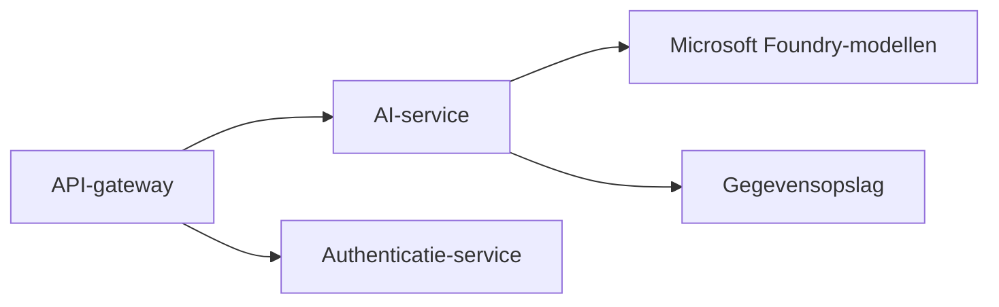
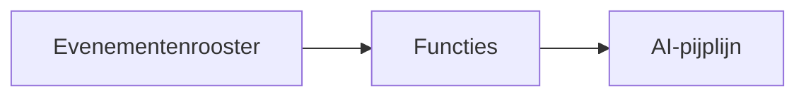

# Hoofdstuk 8: Productie- & Enterprise-patronen

**📚 Cursus**: [AZD Voor Beginners](../../README.md) | **⏱️ Duur**: 2-3 hours | **⭐ Complexiteit**: Geavanceerd

---

## Overzicht

Dit hoofdstuk behandelt enterprise-klare implementatiepatronen, beveiligingsversteviging, monitoring en kostenoptimalisatie voor productie-AI-workloads.

> Gevalideerd tegen `azd 1.25.6` in juni 2026.

## Leerdoelen

Door dit hoofdstuk te voltooien, zul je:
- Implementeren van veerkrachtige applicaties in meerdere regio's
- Implementeren van enterprise-beveiligingspatronen
- Configureren van uitgebreide monitoring
- Optimaliseren van kosten op schaal
- Opzetten van CI/CD-pijplijnen met AZD

---

## 📚 Lessen

| # | Les | Beschrijving | Tijd |
|---|--------|-------------|------|
| 1 | [Production AI Practices](production-ai-practices.md) | Implementatiepatronen voor enterprise | 90 min |

---

## 🚀 Productie-checklist

- [ ] Implementatie in meerdere regio's voor veerkracht
- [ ] Beheerde identiteit voor authenticatie (geen sleutels)
- [ ] Application Insights voor monitoring
- [ ] Kostenbudgetten en waarschuwingen geconfigureerd
- [ ] Beveiligingsscans ingeschakeld
- [ ] CI/CD-pijplijnintegratie
- [ ] Noodherstelplan

---

## 🏗️ Architectuurpatronen

### Patroon 1: Microservices AI



### Patroon 2: Event-Driven AI



---

## 🔐 Beste beveiligingspraktijken

```bicep
// Use managed identity
identity: {
  type: 'SystemAssigned'
}

// Private endpoints for AI services
properties: {
  publicNetworkAccess: 'Disabled'
  networkAcls: {
    defaultAction: 'Deny'
  }
}
```

---

## 💰 Kostenoptimalisatie

| Strategie | Besparing |
|----------|---------|
| Schaal naar nul (Container Apps) | 60-80% |
| Gebruik consumption-tiers voor ontwikkeling | 50-70% |
| Gepland schalen | 30-50% |
| Gereserveerde capaciteit | 20-40% |

```bash
# Stel budgetwaarschuwingen in
az consumption budget create \
  --budget-name "AI-Budget" \
  --amount 500 \
  --category Cost \
  --time-grain Monthly
```

---

## 📊 Monitoringconfiguratie

```bash
# Logs streamen
azd monitor --logs

# Controleer Application Insights
azd monitor --overview

# Bekijk statistieken
az monitor metrics list --resource <resource-id>
```

---

## 🔗 Navigatie

| Richting | Hoofdstuk |
|-----------|---------|
| **Vorige** | [Hoofdstuk 7: Problemen oplossen](../chapter-07-troubleshooting/README.md) |
| **Cursus voltooid** | [Cursus startpagina](../../README.md) |

---

## 📖 Gerelateerde bronnen

- [AI Agents Guide](../chapter-02-ai-development/agents.md)
- [Application Insights](../chapter-06-pre-deployment/application-insights.md)
- [Multi-Agent Solutions](../chapter-05-multi-agent/README.md)
- [Microservices Example](../../examples/microservices/README.md)

---

<!-- CO-OP TRANSLATOR DISCLAIMER START -->
**Disclaimer**:
Dit document is vertaald met behulp van de AI vertaaldienst [Co-op Translator](https://github.com/Azure/co-op-translator). Hoewel we streven naar nauwkeurigheid, dient u er rekening mee te houden dat geautomatiseerde vertalingen fouten of onnauwkeurigheden kunnen bevatten. Het originele document in de oorspronkelijke taal moet worden beschouwd als de gezaghebbende bron. Voor kritieke informatie wordt professionele menselijke vertaling aanbevolen. Wij zijn niet aansprakelijk voor eventuele misverstanden of verkeerde interpretaties die voortvloeien uit het gebruik van deze vertaling.
<!-- CO-OP TRANSLATOR DISCLAIMER END -->