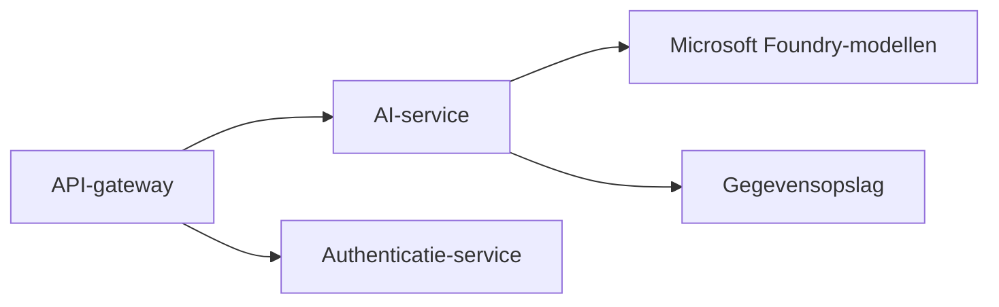
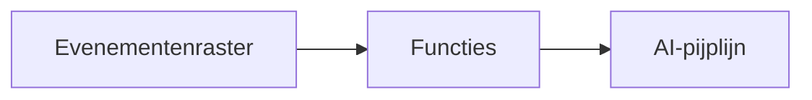

# Hoofdstuk 8: Productie & Enterprise-patronen

**📚 Cursus**: [AZD Voor Beginners](../../README.md) | **⏱️ Duur**: 2-3 hours | **⭐ Complexiteit**: Gevorderd

---

## Overzicht

This chapter covers enterprise-ready deployment patterns, security hardening, monitoring, and cost optimization for production AI workloads.

> Gevalideerd tegen `azd 1.23.12` in March 2026.

## Leerdoelen

Na het voltooien van dit hoofdstuk zul je:
- Multiregionale veerkrachtige applicaties uitrollen
- Enterprise-beveiligingspatronen implementeren
- Uitgebreide monitoring configureren
- Kosten optimaliseren op schaal
- CI/CD-pijplijnen opzetten met AZD

---

## 📚 Lessen

| # | Les | Beschrijving | Tijd |
|---|--------|-------------|------|
| 1 | [Productie AI-praktijken](production-ai-practices.md) | Enterprise-implementatiepatronen | 90 min |

---

## 🚀 Productie-checklist

- [ ] Multiregionale uitrol voor veerkracht
- [ ] Beheerde identiteit voor authenticatie (geen sleutels)
- [ ] Application Insights voor monitoring
- [ ] Kostenbudgetten en waarschuwingen geconfigureerd
- [ ] Beveiligingsscans ingeschakeld
- [ ] Integratie van CI/CD-pijplijn
- [ ] Herstelplan bij rampen

---

## 🏗️ Architectuurpatronen

### Patroon 1: Microservices AI


### Patroon 2: Gebeurtenisgestuurde AI


---

## 🔐 Beste beveiligingspraktijken

```bicep
// Use managed identity
identity: {
  type: 'SystemAssigned'
}

// Private endpoints for AI services
properties: {
  publicNetworkAccess: 'Disabled'
  networkAcls: {
    defaultAction: 'Deny'
  }
}
```

---

## 💰 Kostenoptimalisatie

| Strategie | Besparingen |
|----------|---------|
| Schaal tot nul (Container Apps) | 60-80% |
| Gebruik consumption-tiers voor ontwikkeling | 50-70% |
| Geplande schaalvergroting | 30-50% |
| Gereserveerde capaciteit | 20-40% |

```bash
# Stel budgetwaarschuwingen in
az consumption budget create \
  --budget-name "AI-Budget" \
  --amount 500 \
  --category Cost \
  --time-grain Monthly
```

---

## 📊 Monitoringconfiguratie

```bash
# Logbestanden streamen
azd monitor --logs

# Controleer Application Insights
azd monitor --overview

# Bekijk statistieken
az monitor metrics list --resource <resource-id>
```

---

## 🔗 Navigatie

| Richting | Hoofdstuk |
|-----------|---------|
| **Vorige** | [Hoofdstuk 7: Probleemoplossing](../chapter-07-troubleshooting/README.md) |
| **Cursus voltooid** | [Cursusstartpagina](../../README.md) |

---

## 📖 Gerelateerde bronnen

- [Gids voor AI-agents](../chapter-02-ai-development/agents.md)
- [Application Insights](../chapter-06-pre-deployment/application-insights.md)
- [Multi-agentoplossingen](../chapter-05-multi-agent/README.md)
- [Microservices-voorbeeld](../../examples/microservices/README.md)

---

<!-- CO-OP TRANSLATOR DISCLAIMER START -->
**Disclaimer**:
Dit document is vertaald met behulp van de AI-vertalingsservice [Co-op Translator](https://github.com/Azure/co-op-translator). Hoewel we streven naar nauwkeurigheid, houd er rekening mee dat geautomatiseerde vertalingen fouten of onnauwkeurigheden kunnen bevatten. Het oorspronkelijke document in de oorspronkelijke taal dient als de gezaghebbende bron te worden beschouwd. Voor kritieke informatie wordt professionele menselijke vertaling aanbevolen. Wij zijn niet aansprakelijk voor misverstanden of verkeerde interpretaties die voortvloeien uit het gebruik van deze vertaling.
<!-- CO-OP TRANSLATOR DISCLAIMER END -->