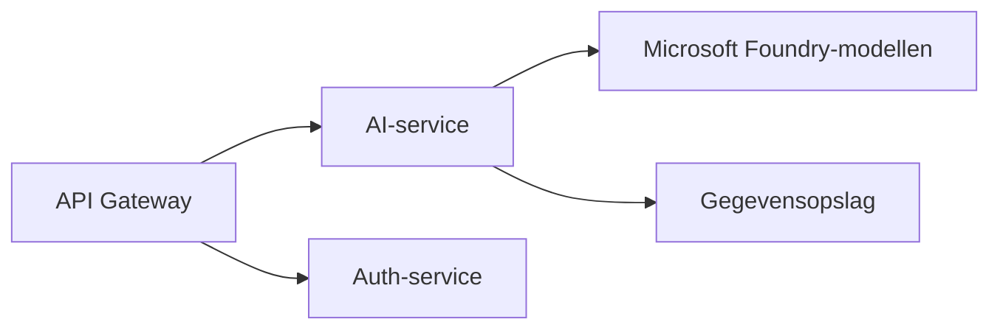
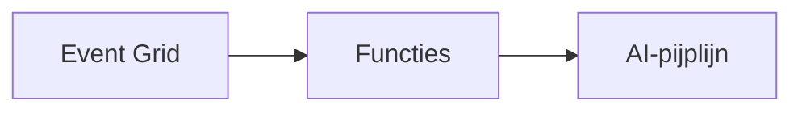

# Hoofdstuk 8: Productie- & Enterprisepatronen

**📚 Cursus**: [AZD Voor Beginners](../../README.md) | **⏱️ Duur**: 2-3 uur | **⭐ Complexiteit**: Geavanceerd

---

## Overzicht

Dit hoofdstuk behandelt enterprise-klare implementatiepatronen, beveiligingsversteviging, monitoring en kostenoptimalisatie voor productie-AI workloads.

> Gevalideerd tegen `azd 1.27.1` in juli 2026.

## Leerdoelen

Door dit hoofdstuk te voltooien, zult u:
- Multi-region veerkrachtige applicaties implementeren
- Enterprise beveiligingspatronen toepassen
- Uitgebreide monitoring configureren
- Kosten op schaal optimaliseren
- CI/CD pipelines opzetten met AZD

---

## 📚 Lessen

| # | Les | Beschrijving | Tijd |
|---|--------|-------------|------|
| 1 | [Productie AI Praktijken](production-ai-practices.md) | Enterprise implementatiepatronen | 90 min |

---

## 🚀 Productie Checklist

- [ ] Multi-region implementatie voor veerkracht
- [ ] Beheerde identiteit voor authenticatie (geen sleutels)
- [ ] Application Insights voor monitoring
- [ ] Kostenbudgetten en waarschuwingen geconfigureerd
- [ ] Beveiligingsscanning ingeschakeld
- [ ] CI/CD pipeline-integratie
- [ ] Disaster recovery plan

---

## 🏗️ Architectuurpatronen

### Patroon 1: Microservices AI



### Patroon 2: Event-Driven AI



---

## 🔐 Beste Beveiligingspraktijken

```bicep
// Use managed identity
identity: {
  type: 'SystemAssigned'
}

// Private endpoints for AI services
properties: {
  publicNetworkAccess: 'Disabled'
  networkAcls: {
    defaultAction: 'Deny'
  }
}
```

---

## 💰 Kostenoptimalisatie

| Strategie | Besparing |
|----------|---------|
| Opschalen naar nul (Container Apps) | 60-80% |
| Gebruik consumptietarieven voor dev | 50-70% |
| Geplande opschaling | 30-50% |
| Gereserveerde capaciteit | 20-40% |

```bash
# Stel budgetwaarschuwingen in
az consumption budget create \
  --budget-name "AI-Budget" \
  --amount 500 \
  --category Cost \
  --time-grain Monthly
```

---

## 📊 Monitoring Setup

```bash
# Logboeken streamen
azd monitor --logs

# Controleer Application Insights
azd monitor --overview

# Bekijk statistieken
az monitor metrics list --resource <resource-id>
```

---

## 🔗 Navigatie

| Richting | Hoofdstuk |
|-----------|---------|
| **Vorige** | [Hoofdstuk 7: Problemen oplossen](../chapter-07-troubleshooting/README.md) |
| **Cursus Voltooid** | [Startpagina Cursus](../../README.md) |

---

## 📖 Gerelateerde Bronnen

- [AI Agents Gids](../chapter-02-ai-development/agents.md)
- [Application Insights](../chapter-06-pre-deployment/application-insights.md)
- [Multi-Agent Oplossingen](../chapter-05-multi-agent/README.md)
- [Microservices Voorbeeld](../../examples/microservices/README.md)

---

<!-- CO-OP TRANSLATOR DISCLAIMER START -->
**Disclaimer**:
Dit document is vertaald met behulp van de AI vertaaldienst [Co-op Translator](https://github.com/Azure/co-op-translator). Hoewel we streven naar nauwkeurigheid, dient u er rekening mee te houden dat geautomatiseerde vertalingen fouten of onnauwkeurigheden kunnen bevatten. Het originele document in de oorspronkelijke taal moet worden beschouwd als de gezaghebbende bron. Voor kritieke informatie wordt professionele menselijke vertaling aanbevolen. Wij zijn niet aansprakelijk voor eventuele misverstanden of verkeerde interpretaties die voortvloeien uit het gebruik van deze vertaling.
<!-- CO-OP TRANSLATOR DISCLAIMER END -->