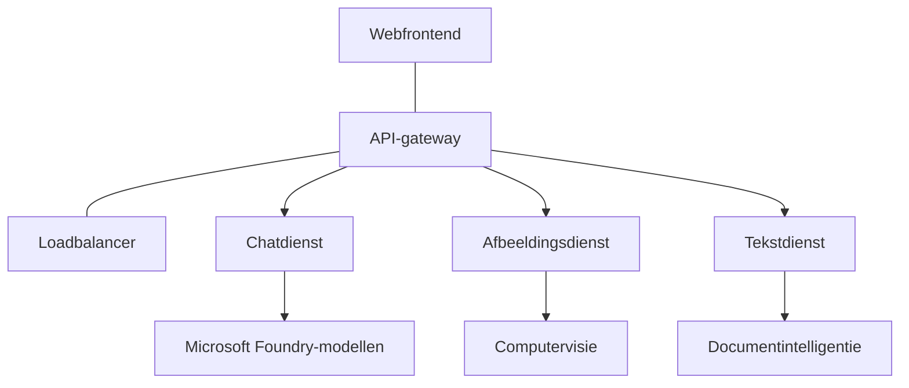

# Beste praktijken voor AI-productieworkloads met AZD

**Hoofdstuknavigatie:**
- **📚 Cursus Startpagina**: [AZD Voor Beginners](../../README.md)
- **📖 Huidig Hoofdstuk**: Hoofdstuk 8 - Productie- & Enterprise-patronen
- **⬅️ Vorig Hoofdstuk**: [Hoofdstuk 7: Probleemoplossing](../chapter-07-troubleshooting/debugging.md)
- **⬅️ Ook Gerelateerd**: [AI Workshop Lab](ai-workshop-lab.md)
- **🎯 Cursus Voltooid**: [AZD Voor Beginners](../../README.md)

## Overzicht

Deze gids biedt uitgebreide best practices voor het implementeren van productieklare AI-workloads met behulp van Azure Developer CLI (AZD). Op basis van feedback uit de Microsoft Foundry Discord-community en praktijkimplementaties bij klanten, behandelen deze praktijken de meest voorkomende uitdagingen in productie-AI-systemen.

## Belangrijkste Uitdagingen Aangepakt

Op basis van onze community-enquête zijn dit de grootste uitdagingen waar ontwikkelaars tegenaan lopen:

- **45%** heeft moeite met multi-service AI-implementaties
- **38%** heeft problemen met credential- en secretbeheer  
- **35%** vindt productie-klaarheid en schalen moeilijk
- **32%** heeft betere kostenoptimalisatiestrategieën nodig
- **29%** heeft verbeterde monitoring en troubleshooting nodig

## Architectuurpatronen voor Productie-AI

### Patroon 1: Microservices AI-architectuur

**Wanneer te gebruiken**: Complexe AI-toepassingen met meerdere mogelijkheden


**AZD-implementatie**:

```yaml
# azure.yaml
name: enterprise-ai-platform
services:
  web:
    project: ./web
    host: staticwebapp
  api-gateway:
    project: ./api-gateway
    host: containerapp
  chat-service:
    project: ./services/chat
    host: containerapp
  vision-service:
    project: ./services/vision
    host: containerapp
  text-service:
    project: ./services/text
    host: containerapp
```

### Patroon 2: Event-Driven AI-verwerking

**Wanneer te gebruiken**: Batchverwerking, documentanalyse, asynchrone workflows

```bicep
// Event Hub for AI processing pipeline
resource eventHub 'Microsoft.EventHub/namespaces@2023-01-01-preview' = {
  name: eventHubNamespaceName
  location: location
  sku: {
    name: 'Standard'
    tier: 'Standard'
    capacity: 1
  }
}

// Service Bus for reliable message processing
resource serviceBus 'Microsoft.ServiceBus/namespaces@2022-10-01-preview' = {
  name: serviceBusNamespaceName
  location: location
  sku: {
    name: 'Premium'
    tier: 'Premium'
    capacity: 1
  }
}

// Function App for processing
resource functionApp 'Microsoft.Web/sites@2023-01-01' = {
  name: functionAppName
  location: location
  kind: 'functionapp,linux'
  properties: {
    siteConfig: {
      appSettings: [
        {
          name: 'FUNCTIONS_EXTENSION_VERSION'
          value: '~4'
        }
        {
          name: 'AZURE_OPENAI_ENDPOINT'
          value: '@Microsoft.KeyVault(VaultName=${keyVault.name};SecretName=openai-endpoint)'
        }
      ]
    }
  }
}
```

## Nadenken over de Gezondheid van AI-agents

Wanneer een traditionele webapplicatie crasht, zijn de symptomen vertrouwd: een pagina laadt niet, een API geeft een fout terug, of een deployment mislukt. AI-gedreven applicaties kunnen op al diezelfde manieren falen—maar ze kunnen ook subtieler slecht gedrag vertonen dat geen duidelijke foutmeldingen geeft.

Deze sectie helpt je een mentaal model op te bouwen voor het monitoren van AI-workloads zodat je weet waar je moet zoeken wanneer iets niet goed lijkt te gaan.

### Hoe Agent-gezondheid verschilt van traditionele App-gezondheid

Een traditionele app werkt of werkt niet. Een AI-agent kan lijken te werken maar slechte resultaten opleveren. Zie agent-gezondheid als twee lagen:

| Laag | Waar op te letten | Waar te kijken |
|-------|--------------|---------------|
| **Infrastructuurgezondheid** | Draait de service? Zijn resources geprovisioned? Zijn endpoints bereikbaar? | `azd monitor`, Azure Portal resource health, container/app logs |
| **Gedragsgezondheid** | Reageert de agent accuraat? Zijn responses tijdig? Wordt het model correct aangeroepen? | Application Insights traces, model call latency metrics, response quality logs |

Infrastructuurgezondheid is bekend—het is hetzelfde voor elke azd-app. Gedragsgezondheid is de nieuwe laag die AI-workloads introduceren.

### Waar te kijken als AI-apps zich niet gedragen zoals verwacht

Als je AI-toepassing niet de verwachte resultaten oplevert, volgt hier een conceptuele checklist:

1. **Begin bij de basis.** Draait de app? Kan het zijn afhankelijkheden bereiken? Controleer `azd monitor` en resource health zoals je bij elke app zou doen.
2. **Controleer de modelverbinding.** Roept je applicatie het AI-model succesvol aan? Mislukte of getimede modelaanroepen zijn de meest voorkomende oorzaak van AI-app problemen en zullen in je applicatielogs verschijnen.
3. **Kijk naar wat het model ontving.** AI-responses hangen af van de input (de prompt en eventuele opgehaalde context). Als de output fout is, is de input meestal fout. Controleer of je applicatie de juiste gegevens naar het model stuurt.
4. **Bekijk responstijd.** AI-modelaanroepen zijn trager dan typische API-aanroepen. Als je app traag aanvoelt, controleer of de modelresponstijden zijn gestegen—dit kan wijzen op throttling, capaciteitslimieten of congestie op regiobasis.
5. **Let op kostensignalen.** Onverwachte pieken in tokengebruik of API-aanroepen kunnen wijzen op een lus, een verkeerd geconfigureerde prompt of te veel retries.

Je hoeft niet meteen een expert in observability-tools te worden. De belangrijkste conclusie is dat AI-applicaties een extra gedragslaag hebben om te monitoren, en azd's ingebouwde monitoring (`azd monitor`) geeft je een startpunt om beide lagen te onderzoeken.

---

## Beveiligingsbest practices

### 1. Zero-Trust beveiligingsmodel

**Implementatiestrategie**:
- Geen service-to-service communicatie zonder authenticatie
- Alle API-aanroepen gebruiken managed identities
- Netwerkisolatie met private endpoints
- Least privilege toegangscontroles

```bicep
// Managed Identity for each service
resource chatServiceIdentity 'Microsoft.ManagedIdentity/userAssignedIdentities@2023-01-31' = {
  name: 'chat-service-identity'
  location: location
}

// Role assignments with minimal permissions
resource openAIUserRole 'Microsoft.Authorization/roleAssignments@2022-04-01' = {
  scope: openAIAccount
  name: guid(openAIAccount.id, chatServiceIdentity.id, openAIUserRoleDefinitionId)
  properties: {
    roleDefinitionId: subscriptionResourceId('Microsoft.Authorization/roleDefinitions', '5e0bd9bd-7b93-4f28-af87-19fc36ad61bd')
    principalId: chatServiceIdentity.properties.principalId
    principalType: 'ServicePrincipal'
  }
}
```

### 2. Beveiligd Secret Management

**Key Vault integratiepatroon**:

```bicep
// Key Vault with proper access policies
resource keyVault 'Microsoft.KeyVault/vaults@2023-02-01' = {
  name: keyVaultName
  location: location
  properties: {
    tenantId: tenant().tenantId
    sku: {
      family: 'A'
      name: 'premium'  // Use premium for production
    }
    enableRbacAuthorization: true  // Use RBAC instead of access policies
    enablePurgeProtection: true    // Prevent accidental deletion
    enableSoftDelete: true
    softDeleteRetentionInDays: 90
  }
}

// Store all AI service credentials
resource openAIKeySecret 'Microsoft.KeyVault/vaults/secrets@2023-02-01' = {
  parent: keyVault
  name: 'openai-api-key'
  properties: {
    value: openAIAccount.listKeys().key1
    attributes: {
      enabled: true
    }
  }
}
```

### 3. Netwerkbeveiliging

**Private Endpoint configuratie**:

```bicep
// Virtual Network for AI services
resource virtualNetwork 'Microsoft.Network/virtualNetworks@2023-04-01' = {
  name: vnetName
  location: location
  properties: {
    addressSpace: {
      addressPrefixes: ['10.0.0.0/16']
    }
    subnets: [
      {
        name: 'ai-services-subnet'
        properties: {
          addressPrefix: '10.0.1.0/24'
          privateEndpointNetworkPolicies: 'Disabled'
        }
      }
      {
        name: 'app-services-subnet'
        properties: {
          addressPrefix: '10.0.2.0/24'
          delegations: [
            {
              name: 'Microsoft.Web/serverFarms'
              properties: {
                serviceName: 'Microsoft.Web/serverFarms'
              }
            }
          ]
        }
      }
    ]
  }
}

// Private endpoints for all AI services
resource openAIPrivateEndpoint 'Microsoft.Network/privateEndpoints@2023-04-01' = {
  name: '${openAIAccountName}-pe'
  location: location
  properties: {
    subnet: {
      id: virtualNetwork.properties.subnets[0].id
    }
    privateLinkServiceConnections: [
      {
        name: 'openai-connection'
        properties: {
          privateLinkServiceId: openAIAccount.id
          groupIds: ['account']
        }
      }
    ]
  }
}
```

## Prestatie en Schalen

### 1. Auto-scaling strategieën

**Container Apps Auto-scaling**:

```bicep
resource containerApp 'Microsoft.App/containerApps@2023-05-01' = {
  name: containerAppName
  location: location
  properties: {
    configuration: {
      ingress: {
        external: true
        targetPort: 8000
        transport: 'http'
      }
    }
    template: {
      scale: {
        minReplicas: 2  // Always have 2 instances minimum
        maxReplicas: 50 // Scale up to 50 for high load
        rules: [
          {
            name: 'http-scaling'
            http: {
              metadata: {
                concurrentRequests: '20'  // Scale when >20 concurrent requests
              }
            }
          }
          {
            name: 'cpu-scaling'
            custom: {
              type: 'cpu'
              metadata: {
                type: 'Utilization'
                value: '70'  // Scale when CPU >70%
              }
            }
          }
        ]
      }
    }
  }
}
```

### 2. Caching-strategieën

**Redis Cache voor AI-responses**:

```bicep
// Redis Premium for production workloads
resource redisCache 'Microsoft.Cache/redis@2023-04-01' = {
  name: redisCacheName
  location: location
  properties: {
    sku: {
      name: 'Premium'
      family: 'P'
      capacity: 1
    }
    enableNonSslPort: false
    minimumTlsVersion: '1.2'
    redisConfiguration: {
      'maxmemory-policy': 'allkeys-lru'
    }
    // Enable clustering for high availability
    redisVersion: '6.0'
    shardCount: 2
  }
}

// Cache configuration in application
var cacheConnectionString = '${redisCache.properties.hostName}:6380,password=${redisCache.listKeys().primaryKey},ssl=True,abortConnect=False'
```

### 3. Load Balancing en Verkeersmanagement

**Application Gateway met WAF**:

```bicep
// Application Gateway with Web Application Firewall
resource applicationGateway 'Microsoft.Network/applicationGateways@2023-04-01' = {
  name: appGatewayName
  location: location
  properties: {
    sku: {
      name: 'WAF_v2'
      tier: 'WAF_v2'
      capacity: 2
    }
    webApplicationFirewallConfiguration: {
      enabled: true
      firewallMode: 'Prevention'
      ruleSetType: 'OWASP'
      ruleSetVersion: '3.2'
    }
    // Backend pools for AI services
    backendAddressPools: [
      {
        name: 'ai-services-pool'
        properties: {
          backendAddresses: [
            {
              fqdn: '${containerApp.properties.configuration.ingress.fqdn}'
            }
          ]
        }
      }
    ]
  }
}
```

## 💰 Kostenoptimalisatie

### 1. Right-Sizing van Resources

**Omgevingsspecifieke configuraties**:

```bash
# Ontwikkelomgeving
azd env new development
azd env set AZURE_OPENAI_SKU "S0"
azd env set AZURE_OPENAI_CAPACITY 10
azd env set AZURE_SEARCH_SKU "basic"
azd env set CONTAINER_CPU 0.5
azd env set CONTAINER_MEMORY 1.0

# Productieomgeving
azd env new production
azd env set AZURE_OPENAI_SKU "S0"
azd env set AZURE_OPENAI_CAPACITY 100
azd env set AZURE_SEARCH_SKU "standard"
azd env set CONTAINER_CPU 2.0
azd env set CONTAINER_MEMORY 4.0
```

### 2. Kostenbewaking en Budgetten

```bicep
// Cost management and budgets
resource budget 'Microsoft.Consumption/budgets@2023-05-01' = {
  name: 'ai-workload-budget'
  properties: {
    timePeriod: {
      startDate: '2024-01-01'
      endDate: '2024-12-31'
    }
    timeGrain: 'Monthly'
    amount: 2000  // $2000 monthly budget
    category: 'Cost'
    notifications: {
      warning: {
        enabled: true
        operator: 'GreaterThan'
        threshold: 80
        contactEmails: [
          'finance@company.com'
          'engineering@company.com'
        ]
        contactRoles: [
          'Owner'
          'Contributor'
        ]
      }
      critical: {
        enabled: true
        operator: 'GreaterThan'
        threshold: 95
        contactEmails: [
          'cto@company.com'
        ]
      }
    }
  }
}
```

### 3. Tokengebruiksoptimalisatie

**OpenAI-kostenbeheer**:

```typescript
// Tokenoptimalisatie op applicatieniveau
class TokenOptimizer {
  private readonly maxTokens = 4000;
  private readonly reserveTokens = 500;
  
  optimizePrompt(userInput: string, context: string): string {
    const availableTokens = this.maxTokens - this.reserveTokens;
    const estimatedTokens = this.estimateTokens(userInput + context);
    
    if (estimatedTokens > availableTokens) {
      // Verkort de context, niet de gebruikersinvoer
      context = this.truncateContext(context, availableTokens - this.estimateTokens(userInput));
    }
    
    return `${context}\n\nUser: ${userInput}`;
  }
  
  private estimateTokens(text: string): number {
    // Ruwe schatting: 1 token ≈ 4 tekens
    return Math.ceil(text.length / 4);
  }
}
```

## Monitoring en Observeerbaarheid

### 1. Uitgebreide Application Insights

```bicep
// Application Insights with advanced features
resource applicationInsights 'Microsoft.Insights/components@2020-02-02' = {
  name: applicationInsightsName
  location: location
  kind: 'web'
  properties: {
    Application_Type: 'web'
    WorkspaceResourceId: logAnalyticsWorkspace.id
    SamplingPercentage: 100  // Full sampling for AI apps
    DisableIpMasking: false  // Enable for security
  }
}

// Custom metrics for AI operations
resource aiMetricAlerts 'Microsoft.Insights/metricAlerts@2018-03-01' = {
  name: 'ai-high-error-rate'
  location: 'global'
  properties: {
    description: 'Alert when AI service error rate is high'
    severity: 2
    enabled: true
    scopes: [
      applicationInsights.id
    ]
    evaluationFrequency: 'PT1M'
    windowSize: 'PT5M'
    criteria: {
      'odata.type': 'Microsoft.Azure.Monitor.SingleResourceMultipleMetricCriteria'
      allOf: [
        {
          name: 'high-error-rate'
          metricName: 'requests/failed'
          operator: 'GreaterThan'
          threshold: 10
          timeAggregation: 'Count'
        }
      ]
    }
  }
}
```

### 2. AI-specifieke Monitoring

**Aangepaste dashboards voor AI-metrics**:

```json
// Dashboard configuration for AI workloads
{
  "dashboard": {
    "name": "AI Application Monitoring",
    "tiles": [
      {
        "name": "OpenAI Request Volume",
        "query": "requests | where name contains 'openai' | summarize count() by bin(timestamp, 5m)"
      },
      {
        "name": "AI Response Latency",
        "query": "requests | where name contains 'openai' | summarize avg(duration) by bin(timestamp, 5m)"
      },
      {
        "name": "Token Usage",
        "query": "customMetrics | where name == 'openai_tokens_used' | summarize sum(value) by bin(timestamp, 1h)"
      },
      {
        "name": "Cost per Hour",
        "query": "customMetrics | where name == 'openai_cost' | summarize sum(value) by bin(timestamp, 1h)"
      }
    ]
  }
}
```

### 3. Health Checks en Uptime-monitoring

```bicep
// Application Insights availability tests
resource availabilityTest 'Microsoft.Insights/webtests@2022-06-15' = {
  name: 'ai-app-availability-test'
  location: location
  tags: {
    'hidden-link:${applicationInsights.id}': 'Resource'
  }
  properties: {
    SyntheticMonitorId: 'ai-app-availability-test'
    Name: 'AI Application Availability Test'
    Description: 'Tests AI application endpoints'
    Enabled: true
    Frequency: 300  // 5 minutes
    Timeout: 120    // 2 minutes
    Kind: 'ping'
    Locations: [
      {
        Id: 'us-east-2-azr'
      }
      {
        Id: 'us-west-2-azr'
      }
    ]
    Configuration: {
      WebTest: '''
        <WebTest Name="AI Health Check" 
                 Id="8d2de8d2-a2b0-4c2e-9a0d-8f9c9a0b8c8d" 
                 Enabled="True" 
                 CssProjectStructure="" 
                 CssIteration="" 
                 Timeout="120" 
                 WorkItemIds="" 
                 xmlns="http://microsoft.com/schemas/VisualStudio/TeamTest/2010" 
                 Description="" 
                 CredentialUserName="" 
                 CredentialPassword="" 
                 PreAuthenticate="True" 
                 Proxy="default" 
                 StopOnError="False" 
                 RecordedResultFile="" 
                 ResultsLocale="">
          <Items>
            <Request Method="GET" 
                     Guid="a5f10126-e4cd-570d-961c-cea43999a200" 
                     Version="1.1" 
                     Url="${webApp.properties.defaultHostName}/health" 
                     ThinkTime="0" 
                     Timeout="120" 
                     ParseDependentRequests="True" 
                     FollowRedirects="True" 
                     RecordResult="True" 
                     Cache="False" 
                     ResponseTimeGoal="0" 
                     Encoding="utf-8" 
                     ExpectedHttpStatusCode="200" 
                     ExpectedResponseUrl="" 
                     ReportingName="" 
                     IgnoreHttpStatusCode="False" />
          </Items>
        </WebTest>
      '''
    }
  }
}
```

## Disaster Recovery en Hoge Beschikbaarheid

### 1. Multi-region Deployments

```yaml
# azure.yaml - Multi-region configuration
name: ai-app-multiregion
services:
  api-primary:
    project: ./api
    host: containerapp
    env:
      - AZURE_REGION=eastus
  api-secondary:
    project: ./api
    host: containerapp
    env:
      - AZURE_REGION=westus2
```

```bicep
// Traffic Manager for global load balancing
resource trafficManager 'Microsoft.Network/trafficManagerProfiles@2022-04-01' = {
  name: trafficManagerProfileName
  location: 'global'
  properties: {
    profileStatus: 'Enabled'
    trafficRoutingMethod: 'Priority'
    dnsConfig: {
      relativeName: trafficManagerProfileName
      ttl: 30
    }
    monitorConfig: {
      protocol: 'HTTPS'
      port: 443
      path: '/health'
      intervalInSeconds: 30
      toleratedNumberOfFailures: 3
      timeoutInSeconds: 10
    }
    endpoints: [
      {
        name: 'primary-endpoint'
        type: 'Microsoft.Network/trafficManagerProfiles/azureEndpoints'
        properties: {
          targetResourceId: primaryAppService.id
          endpointStatus: 'Enabled'
          priority: 1
        }
      }
      {
        name: 'secondary-endpoint'
        type: 'Microsoft.Network/trafficManagerProfiles/azureEndpoints'
        properties: {
          targetResourceId: secondaryAppService.id
          endpointStatus: 'Enabled'
          priority: 2
        }
      }
    ]
  }
}
```

### 2. Data Backup en Herstel

```bicep
// Backup configuration for critical data
resource backupVault 'Microsoft.DataProtection/backupVaults@2023-05-01' = {
  name: backupVaultName
  location: location
  identity: {
    type: 'SystemAssigned'
  }
  properties: {
    storageSettings: [
      {
        datastoreType: 'VaultStore'
        type: 'LocallyRedundant'
      }
    ]
  }
}

// Backup policy for AI models and data
resource backupPolicy 'Microsoft.DataProtection/backupVaults/backupPolicies@2023-05-01' = {
  parent: backupVault
  name: 'ai-data-backup-policy'
  properties: {
    policyRules: [
      {
        backupParameters: {
          backupType: 'Full'
          objectType: 'AzureBackupParams'
        }
        trigger: {
          schedule: {
            repeatingTimeIntervals: [
              'R/2024-01-01T02:00:00+00:00/P1D'  // Daily at 2 AM
            ]
          }
          objectType: 'ScheduleBasedTriggerContext'
        }
        dataStore: {
          datastoreType: 'VaultStore'
          objectType: 'DataStoreInfoBase'
        }
        name: 'BackupDaily'
        objectType: 'AzureBackupRule'
      }
    ]
  }
}
```

## DevOps en CI/CD-integratie

### 1. GitHub Actions Workflow

```yaml
# .github/workflows/deploy-ai-app.yml
name: Deploy AI Application

on:
  push:
    branches: [main]
  pull_request:
    branches: [main]

jobs:
  test:
    runs-on: ubuntu-latest
    steps:
      - uses: actions/checkout@v4
      
      - name: Setup Python
        uses: actions/setup-python@v4
        with:
          python-version: '3.11'
          
      - name: Install dependencies
        run: |
          pip install -r requirements.txt
          pip install pytest
          
      - name: Run tests
        run: pytest tests/
        
      - name: AI Safety Tests
        run: |
          python scripts/test_ai_safety.py
          python scripts/validate_prompts.py

  deploy-staging:
    needs: test
    if: github.event_name == 'pull_request'
    runs-on: ubuntu-latest
    steps:
      - uses: actions/checkout@v4
      
      - name: Setup AZD
        uses: Azure/setup-azd@v2
        
      - name: Login to Azure
        uses: azure/login@v1
        with:
          creds: ${{ secrets.AZURE_CREDENTIALS }}
          
      - name: Deploy to Staging
        run: |
          azd env select staging
          azd deploy

  deploy-production:
    needs: test
    if: github.ref == 'refs/heads/main'
    runs-on: ubuntu-latest
    steps:
      - uses: actions/checkout@v4
      
      - name: Setup AZD
        uses: Azure/setup-azd@v2
        
      - name: Login to Azure
        uses: azure/login@v1
        with:
          creds: ${{ secrets.AZURE_CREDENTIALS }}
          
      - name: Deploy to Production
        run: |
          azd env select production
          azd deploy
          
      - name: Run Production Health Checks
        run: |
          python scripts/health_check.py --env production
```

### 2. Infrastructuurvalidatie

```bash
# scripts/validate_infrastructure.sh
#!/bin/bash

echo "Validating AI infrastructure deployment..."

# Controleren of alle vereiste services draaien
services=("openai" "search" "storage" "keyvault")
for service in "${services[@]}"; do
    echo "Checking $service..."
    if ! az resource list --resource-type "Microsoft.CognitiveServices/accounts" --query "[?contains(name, '$service')]" -o tsv; then
        echo "ERROR: $service not found"
        exit 1
    fi
done

# Valideer OpenAI-modelimplementaties
echo "Validating OpenAI model deployments..."
models=$(az cognitiveservices account deployment list --name $AZURE_OPENAI_NAME --resource-group $AZURE_RESOURCE_GROUP --query "[].name" -o tsv)
if [[ ! $models == *"gpt-4.1-mini"* ]]; then
  echo "ERROR: Required model gpt-4.1-mini not deployed"
    exit 1
fi

# Test de connectiviteit van de AI-service
echo "Testing AI service connectivity..."
python scripts/test_connectivity.py

echo "Infrastructure validation completed successfully!"
```

## Productieklaarheidschecklist

### Beveiliging ✅
- [ ] Alle services gebruiken managed identities
- [ ] Geheimen opgeslagen in Key Vault
- [ ] Private endpoints geconfigureerd
- [ ] Network security groups geïmplementeerd
- [ ] RBAC met least privilege
- [ ] WAF ingeschakeld op publieke endpoints

### Prestatie ✅
- [ ] Auto-scaling geconfigureerd
- [ ] Caching geïmplementeerd
- [ ] Load balancing ingesteld
- [ ] CDN voor statische inhoud
- [ ] Database connection pooling
- [ ] Tokengebruiksoptimalisatie

### Monitoring ✅
- [ ] Application Insights geconfigureerd
- [ ] Aangepaste metrics gedefinieerd
- [ ] Alertregels ingesteld
- [ ] Dashboard gemaakt
- [ ] Health checks geïmplementeerd
- [ ] Logretentiebeleid

### Betrouwbaarheid ✅
- [ ] Multi-region deployment
- [ ] Backup- en herstelplan
- [ ] Circuit breakers geïmplementeerd
- [ ] Retry-beleid geconfigureerd
- [ ] Graceful degradation
- [ ] Health check endpoints

### Kostenbeheer ✅
- [ ] Budgetwaarschuwingen geconfigureerd
- [ ] Resources juist geschaald
- [ ] Dev/test-kortingen toegepast
- [ ] Reserved instances aangeschaft
- [ ] Kostenmonitoring-dashboard
- [ ] Regelmatige kostenreviews

### Compliance ✅
- [ ] Data residency-vereisten nageleefd
- [ ] Auditlogging ingeschakeld
- [ ] Compliancebeleid toegepast
- [ ] Security baselines geïmplementeerd
- [ ] Regelmatige security-assessments
- [ ] Incidentresponsplan

## Prestatiebenchmarks

### Typische productiemetrics

| Metriek | Doel | Monitoring |
|--------|--------|------------|
| **Responstijd** | < 2 seconden | Application Insights |
| **Beschikbaarheid** | 99,9% | Uptime-monitoring |
| **Foutrate** | < 0,1% | Applicatielogs |
| **Tokengebruik** | < $500/maand | Cost management |
| **Gelijktijdige gebruikers** | 1000+ | Load testing |
| **Hersteltijd** | < 1 uur | Disaster recovery tests |

### Load Testing

```bash
# Script voor loadtesten van AI-toepassingen
python scripts/load_test.py \
  --endpoint https://your-ai-app.azurewebsites.net \
  --concurrent-users 100 \
  --duration 300 \
  --ramp-up 60
```

## 🤝 Community Best Practices

Op basis van feedback uit de Microsoft Foundry Discord-community:

### Topaanbevelingen uit de community:

1. **Begin klein, schaal geleidelijk**: Start met basis-SKU's en schaal op op basis van daadwerkelijk gebruik
2. **Monitor alles**: Zet vanaf dag één uitgebreide monitoring op
3. **Automatiseer beveiliging**: Gebruik infrastructure as code voor consistente beveiliging
4. **Test grondig**: Neem AI-specifieke tests op in je pipeline
5. **Plan voor kosten**: Monitor tokengebruik en stel vroeg budgetwaarschuwingen in

### Veelgemaakte valkuilen om te vermijden:

- ❌ API-sleutels hardcoden in code
- ❌ Geen juiste monitoring opzetten
- ❌ Kostenoptimalisatie negeren
- ❌ Niet testen van faalscenario's
- ❌ Deployen zonder health checks

## AZD AI CLI-commando's en Extensies

AZD bevat een groeiende set AI-specifieke commando's en extensies die productie-AI-workflows stroomlijnen. Deze tools overbruggen de kloof tussen lokale ontwikkeling en productie-implementatie voor AI-workloads.

### AZD-extensies voor AI

AZD gebruikt een extensiesysteem om AI-specifieke mogelijkheden toe te voegen. Installeer en beheer extensies met:

```bash
# Toon alle beschikbare extensies (inclusief AI)
azd extension list

# Bekijk details van geïnstalleerde extensies
azd extension show azure.ai.agents

# Installeer de Foundry agents-extensie
azd extension install azure.ai.agents

# Installeer de fine-tuning-extensie
azd extension install azure.ai.finetune

# Installeer de extensie voor aangepaste modellen
azd extension install azure.ai.models

# Werk alle geïnstalleerde extensies bij
azd extension upgrade --all
```

**Beschikbare AI-extensies:**

| Extensie | Doel | Status |
|-----------|---------|--------|
| `azure.ai.agents` | Foundry Agent Service-beheer | Preview |
| `azure.ai.finetune` | Foundry model fine-tuning | Preview |
| `azure.ai.models` | Foundry custom models | Preview |
| `azure.coding-agent` | Coding agent configuratie | Available |

### Agentprojecten initialiseren met `azd ai agent init`

Het `azd ai agent init`-commando scaffoldt een productie-klaar AI-agentproject geïntegreerd met Microsoft Foundry Agent Service:

```bash
# Initialiseer een nieuw agentproject vanuit een agentmanifest
azd ai agent init -m <manifest-path-or-uri>

# Initialiseer en stel een specifiek Foundry-project als doel in
azd ai agent init -m agent-manifest.yaml --project-id <foundry-project-id>

# Initialiseer met een aangepaste bronmap
azd ai agent init -m agent-manifest.yaml --src ./agents/my-agent

# Stel Container Apps als host in
azd ai agent init -m agent-manifest.yaml --host containerapp
```

**Belangrijke flags:**

| Flag | Beschrijving |
|------|-------------|
| `-m, --manifest` | Pad of URI naar een agentmanifest om aan je project toe te voegen |
| `-p, --project-id` | Bestaande Microsoft Foundry Project ID voor je azd-omgeving |
| `-s, --src` | Directory om de agentdefinitie naartoe te downloaden (standaard `src/<agent-id>`) |
| `--host` | Overschrijf de standaard host (bijv. `containerapp`) |
| `-e, --environment` | De azd-omgeving die gebruikt moet worden |

**Productietip**: Gebruik `--project-id` om direct verbinding te maken met een bestaand Foundry-project, zodat je agentcode en cloudresources vanaf het begin gekoppeld zijn.

### Model Context Protocol (MCP) met `azd mcp`

AZD bevat ingebouwde MCP-serverondersteuning (Alpha), waarmee AI-agents en tools met je Azure-resources kunnen communiceren via een gestandaardiseerd protocol:

```bash
# Start de MCP-server voor je project
azd mcp start

# Controleer de huidige Copilot-toestemmingsregels voor tooluitvoering
azd copilot consent list
```

De MCP-server maakt je azd-projectcontext—omgevingen, services en Azure-resources—beschikbaar voor AI-gedreven ontwikkeltools. Dit maakt mogelijk:

- **AI-geassisteerde deployment**: Laat coding agents je projectstatus opvragen en deployments triggeren
- **Resource discovery**: AI-tools kunnen ontdekken welke Azure-resources je project gebruikt
- **Omgevingsbeheer**: Agents kunnen schakelen tussen dev/staging/production omgevingen

### Infrastructuurgeneratie met `azd infra generate`

Voor productie-AI-workloads kun je Infrastructure as Code genereren en aanpassen in plaats van te vertrouwen op automatische provisioning:

```bash
# Genereer Bicep/Terraform-bestanden op basis van je projectdefinitie
azd infra generate
```

Dit schrijft IaC naar schijf zodat je kunt:
- Infrastructuur beoordelen en auditen voordat je deployed
- Aangepaste beveiligingsbeleid toevoegen (netwerkregels, private endpoints)
- Integreren met bestaande IaC-reviewprocessen
- Infrastructuurwijzigingen versiebeheer geven los van applicatiecode

### Productielevenscyclus Hooks

AZD-hooks laten je aangepaste logica injecteren in elke fase van de deployment-levenscyclus—kritiek voor productie-AI-workflows:

```yaml
# azure.yaml - Production hooks example
name: ai-production-app
hooks:
  preprovision:
    shell: sh
    run: scripts/validate-quotas.sh    # Check AI model quota before provisioning
  postprovision:
    shell: sh
    run: scripts/configure-networking.sh  # Set up private endpoints
  predeploy:
    shell: sh
    run: scripts/run-ai-safety-tests.sh  # Run prompt safety checks
  postdeploy:
    shell: sh
    run: scripts/smoke-test.sh           # Verify agent responses post-deploy
services:
  agent-api:
    project: ./src/agent
    host: containerapp
    hooks:
      predeploy:
        shell: sh
        run: scripts/validate-model-access.sh  # Per-service hook
```

```bash
# Voer een specifieke hook handmatig uit tijdens de ontwikkeling
azd hooks run predeploy
```

**Aanbevolen productiehooks voor AI-workloads:**

| Hook | Gebruiksscenario |
|------|----------|
| `preprovision` | Valideer subscription-quotas voor AI-modelcapaciteit |
| `postprovision` | Configureer private endpoints, deploy modelweights |
| `predeploy` | Voer AI-veiligheidstests uit, valideer prompttemplates |
| `postdeploy` | Smoke test agentresponses, verifieer modelconnectiviteit |

### CI/CD-pipelineconfiguratie

Gebruik `azd pipeline config` om je project te koppelen aan GitHub Actions of Azure Pipelines met veilige Azure-authenticatie:

```bash
# Configureer CI/CD-pijplijn (interactief)
azd pipeline config

# Configureer met een specifieke provider
azd pipeline config --provider github
```

Dit commando:
- Maakt een service principal met least-privilege toegang
- Configureert federated credentials (geen opgeslagen secrets)
- Genereert of werkt je pipeline-definitiebestand bij
- Zet vereiste omgevingsvariabelen in je CI/CD-systeem

**Productieworkflow met pipeline-config:**

```bash
# 1. Stel de productieomgeving in
azd env new production
azd env set AZURE_OPENAI_CAPACITY 100

# 2. Configureer de pipeline
azd pipeline config --provider github

# 3. De pipeline voert azd deploy uit bij elke push naar main
```

### Componenten toevoegen met `azd add`

Voeg incrementeel Azure-services toe aan een bestaand project:

```bash
# Voeg interactief een nieuwe servicecomponent toe
azd add
```

Dit is bijzonder nuttig voor het uitbreiden van productie-AI-applicaties—bijvoorbeeld het toevoegen van een vector search-service, een nieuw agent-endpoint of een monitoringcomponent aan een bestaande deployment.

## Aanvullende bronnen
- **Azure Well-Architected Framework**: [Richtlijnen voor AI-werklasten](https://learn.microsoft.com/azure/well-architected/ai/)
- **Microsoft Foundry Documentation**: [Officiële documentatie](https://learn.microsoft.com/azure/ai-studio/)
- **Community Templates**: [Azure Samples](https://github.com/Azure-Samples)
- **Discord Community**: [#Azure-kanaal](https://discord.gg/microsoft-azure)
- **Agent Skills for Azure**: [microsoft/github-copilot-for-azure on skills.sh](https://skills.sh/microsoft/github-copilot-for-azure) - 37 open agentvaardigheden voor Azure AI, Foundry, deployment, kostenoptimalisatie en diagnostiek. Installeer in je editor:
  ```bash
  npx skills add microsoft/github-copilot-for-azure
  ```

---

**Hoofdstuknavigatie:**
- **📚 Cursusstartpagina**: [AZD For Beginners](../../README.md)
- **📖 Huidig hoofdstuk**: Hoofdstuk 8 - Productie- en bedrijfs-patronen
- **⬅️ Vorig hoofdstuk**: [Hoofdstuk 7: Probleemoplossing](../chapter-07-troubleshooting/debugging.md)
- **⬅️ Ook gerelateerd**: [AI Workshop-lab](ai-workshop-lab.md)
- **� Cursus voltooid**: [AZD For Beginners](../../README.md)

**Onthoud**: Productie-AI-werklasten vereisen zorgvuldige planning, monitoring en voortdurende optimalisatie. Begin met deze patronen en pas ze aan je specifieke vereisten aan.

---

<!-- CO-OP TRANSLATOR DISCLAIMER START -->
**Disclaimer**:
Dit document is vertaald met behulp van de AI-vertalingsdienst [Co-op Translator](https://github.com/Azure/co-op-translator). Hoewel we naar nauwkeurigheid streven, houd er rekening mee dat geautomatiseerde vertalingen fouten of onjuistheden kunnen bevatten. Het originele document in de oorspronkelijke taal moet als de gezaghebbende bron worden beschouwd. Voor kritieke informatie wordt professionele menselijke vertaling aanbevolen. Wij zijn niet aansprakelijk voor eventuele misverstanden of verkeerde interpretaties die voortvloeien uit het gebruik van deze vertaling.
<!-- CO-OP TRANSLATOR DISCLAIMER END -->