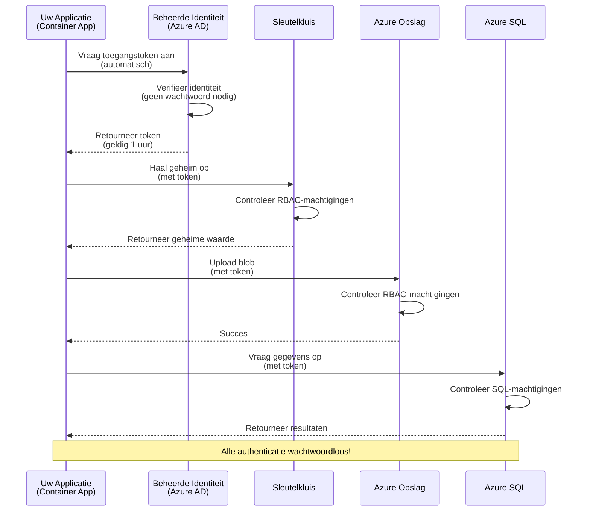
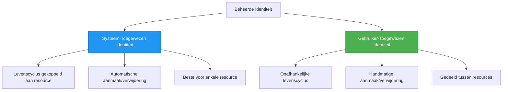

# Authenticatiepatronen en Managed Identity

⏱️ **Geschatte tijd**: 45-60 minuten | 💰 **Kostenimpact**: Gratis (geen extra kosten) | ⭐ **Complexiteit**: Gemiddeld

**📚 Leerpad:**
- ← Vorige: [Configuratiebeheer](configuration.md) - Beheer van omgevingsvariabelen en geheimen
- 🎯 **Je bent hier**: Authenticatie & Beveiliging (Managed Identity, Key Vault, veilige patronen)
- → Volgende: [Eerste project](first-project.md) - Bouw je eerste AZD-applicatie
- 🏠 [Cursusoverzicht](../../README.md)

---

## Wat je zult leren

Na het voltooien van deze les zul je:
- Azure-authenticatiepatronen begrijpen (sleutels, verbindingsreeksen, managed identity)
- **Managed Identity** implementeren voor wachtwoordloze authenticatie
- Geheimen beveiligen met **Azure Key Vault**-integratie
- **Rolgebaseerde toegangscontrole (RBAC)** configureren voor AZD-implementaties
- Beveiligingsbest practices toepassen in Container Apps en Azure-services
- Migreren van sleutelgebaseerde naar identiteitsgebaseerde authenticatie

## Waarom Managed Identity belangrijk is

### Het probleem: Traditionele authenticatie

**Voor Managed Identity:**
```javascript
// ❌ BEVEILIGINGSRISICO: Hardcoded geheimen in code
const connectionString = "Server=mydb.database.windows.net;User=admin;Password=P@ssw0rd123";
const storageKey = "xK7mN9pQ2wR5tY8uI0oP3aS6dF1gH4jK...";
const cosmosKey = "C2x7B9n4M1p8Q5w3E6r0T2y5U8i1O4p7...";
```

**Problemen:**
- 🔴 **Geheimen blootgesteld** in code, configuratiebestanden, omgevingsvariabelen
- 🔴 **Wachtwoordrotatie** vereist codewijzigingen en herimplementatie
- 🔴 **Auditproblemen** - wie heeft wat, wanneer, geopend?
- 🔴 **Versnippering** - geheimen verspreid over meerdere systemen
- 🔴 **Compliance-risico's** - niet voldoen aan beveiligingsaudits

### De oplossing: Managed Identity

**Na Managed Identity:**
```javascript
// ✅ VEILIG: Geen geheimen in de code
const credential = new DefaultAzureCredential();
const client = new BlobServiceClient(
  "https://mystorageaccount.blob.core.windows.net",
  credential  // Azure behandelt authenticatie automatisch
);
```

**Voordelen:**
- ✅ **Geen geheimen** in code of configuratie
- ✅ **Automatische rotatie** - Azure regelt het
- ✅ **Volledig auditspoor** in Azure AD-logboeken
- ✅ **Gecentraliseerde beveiliging** - beheer in Azure Portal
- ✅ **Compliance-klaar** - voldoet aan beveiligingsnormen

**Analogie**: Traditionele authenticatie is als het dragen van meerdere fysieke sleutels voor verschillende deuren. Managed Identity is als een beveiligingspas die automatisch toegang verleent op basis van wie je bent—geen sleutels om te verliezen, kopiëren of roteren.

---

## Architectuuroverzicht

### Authenticatiestroom met Managed Identity


### Soorten Managed Identities


| Kenmerk | Systeemtoegewezen | Gebruikerstoegewezen |
|---------|--------------------|----------------------|
| **Levenscyclus** | Gebonden aan resource | Onafhankelijk |
| **Aanmaken** | Automatisch met resource | Handmatige creatie |
| **Verwijderen** | Verwijderd met resource | Blijft bestaan na verwijdering van resource |
| **Delen** | Slechts één resource | Meerdere resources |
| **Gebruiksscenario** | Eenvoudige scenario's | Complexe multi-resource scenario's |
| **AZD Standaard** | ✅ Aanbevolen | Optioneel |

---

## Vereisten

### Vereiste tools

Je zou deze al geïnstalleerd moeten hebben uit eerdere lessen:

```bash
# Verifieer Azure Developer CLI
azd version
# ✅ Verwacht: azd versie 1.0.0 of hoger

# Verifieer Azure CLI
az --version
# ✅ Verwacht: azure-cli 2.50.0 of hoger
```

### Azure-vereisten

- Actief Azure-abonnement
- Machtigingen om:
  - Managed identities te maken
  - RBAC-rollen toe te wijzen
  - Key Vault-resources te maken
  - Container Apps te implementeren

### Kennisvereisten

Je zou de volgende lessen voltooid moeten hebben:
- [Installatiehandleiding](installation.md) - AZD-installatie
- [AZD Basisprincipes](azd-basics.md) - Kernconcepten
- [Configuratiebeheer](configuration.md) - Omgevingsvariabelen

---

## Les 1: Begrijpen van authenticatiepatronen

### Patroon 1: Verbindingsreeksen (Legacy - Vermijden)

**Hoe het werkt:**
```bash
# Verbindingsreeks bevat inloggegevens
STORAGE_CONNECTION_STRING="DefaultEndpointsProtocol=https;AccountName=myaccount;AccountKey=xK7mN9pQ2wR5..."
COSMOS_CONNECTION_STRING="AccountEndpoint=https://myaccount.documents.azure.com:443/;AccountKey=C2x7..."
SQL_CONNECTION_STRING="Server=myserver.database.windows.net;User=admin;Password=P@ssw0rd..."
```

**Problemen:**
- ❌ Geheimen zichtbaar in omgevingsvariabelen
- ❌ Gelogd in implementatiesystemen
- ❌ Moeilijk te roteren
- ❌ Geen auditspoor van toegang

**Wanneer te gebruiken:** Alleen voor lokale ontwikkeling, nooit in productie.

---

### Patroon 2: Key Vault-referenties (Beter)

**Hoe het werkt:**
```bicep
// Store secret in Key Vault
resource keyVault 'Microsoft.KeyVault/vaults@2023-02-01' = {
  name: 'mykv'
  properties: {
    enableRbacAuthorization: true
  }
}

// Reference in Container App
env: [
  {
    name: 'STORAGE_KEY'
    secretRef: 'storage-key'  // References Key Vault
  }
]
```

**Voordelen:**
- ✅ Geheimen veilig opgeslagen in Key Vault
- ✅ Gecentraliseerd geheimbeheer
- ✅ Rotatie zonder codewijzigingen

**Beperkingen:**
- ⚠️ Nog steeds gebruik van sleutels/wachtwoorden
- ⚠️ Toegang tot Key Vault moet worden beheerd

**Wanneer te gebruiken:** Overgangsstap van verbindingsreeksen naar managed identity.

---

### Patroon 3: Managed Identity (Best Practice)

**Hoe het werkt:**
```bicep
// Enable managed identity
resource containerApp 'Microsoft.App/containerApps@2023-05-01' = {
  name: 'myapp'
  identity: {
    type: 'SystemAssigned'  // Automatically creates identity
  }
}

// Grant permissions
resource roleAssignment 'Microsoft.Authorization/roleAssignments@2022-04-01' = {
  scope: storageAccount
  properties: {
    roleDefinitionId: storageBlobDataContributorRole
    principalId: containerApp.identity.principalId
  }
}
```

**Applicatiecode:**
```javascript
// Geen geheimen nodig!
const { DefaultAzureCredential } = require('@azure/identity');
const { BlobServiceClient } = require('@azure/storage-blob');

const credential = new DefaultAzureCredential();
const blobServiceClient = new BlobServiceClient(
  'https://mystorageaccount.blob.core.windows.net',
  credential
);
```

**Voordelen:**
- ✅ Geen geheimen in code/configuratie
- ✅ Automatische referentierotatie
- ✅ Volledig auditspoor
- ✅ RBAC-gebaseerde machtigingen
- ✅ Compliance-klaar

**Wanneer te gebruiken:** Altijd, voor productieapplicaties.

---

## Les 2: Managed Identity implementeren met AZD

### Stapsgewijze implementatie

Laten we een veilige Container App bouwen die managed identity gebruikt om toegang te krijgen tot Azure Storage en Key Vault.

### Projectstructuur

```
secure-app/
├── azure.yaml                 # AZD configuration
├── infra/
│   ├── main.bicep            # Main infrastructure
│   ├── core/
│   │   ├── identity.bicep    # Managed identity setup
│   │   ├── keyvault.bicep    # Key Vault configuration
│   │   └── storage.bicep     # Storage with RBAC
│   └── app/
│       └── container-app.bicep
└── src/
    ├── app.js                # Application code
    ├── package.json
    └── Dockerfile
```

### 1. AZD configureren (azure.yaml)

```yaml
name: secure-app
metadata:
  template: secure-app@1.0.0

services:
  api:
    project: ./src
    language: js
    host: containerapp

# Enable managed identity (AZD handles this automatically)
```

### 2. Infrastructuur: Managed Identity inschakelen

**Bestand: `infra/main.bicep`**

```bicep
targetScope = 'subscription'

param environmentName string
param location string = 'eastus'

var tags = { 'azd-env-name': environmentName }

// Resource group
resource rg 'Microsoft.Resources/resourceGroups@2021-04-01' = {
  name: 'rg-${environmentName}'
  location: location
  tags: tags
}

// Storage Account
module storage './core/storage.bicep' = {
  name: 'storage'
  scope: rg
  params: {
    name: 'st${uniqueString(rg.id)}'
    location: location
    tags: tags
  }
}

// Key Vault
module keyVault './core/keyvault.bicep' = {
  name: 'keyvault'
  scope: rg
  params: {
    name: 'kv-${uniqueString(rg.id)}'
    location: location
    tags: tags
  }
}

// Container App with Managed Identity
module containerApp './app/container-app.bicep' = {
  name: 'container-app'
  scope: rg
  params: {
    name: 'ca-${environmentName}'
    location: location
    tags: tags
    storageAccountName: storage.outputs.name
    keyVaultName: keyVault.outputs.name
  }
}

// Grant Container App access to Storage
module storageRoleAssignment './core/role-assignment.bicep' = {
  name: 'storage-role'
  scope: rg
  params: {
    principalId: containerApp.outputs.identityPrincipalId
    roleDefinitionId: 'ba92f5b4-2d11-453d-a403-e96b0029c9fe'  // Storage Blob Data Contributor
    targetResourceId: storage.outputs.id
  }
}

// Grant Container App access to Key Vault
module kvRoleAssignment './core/role-assignment.bicep' = {
  name: 'kv-role'
  scope: rg
  params: {
    principalId: containerApp.outputs.identityPrincipalId
    roleDefinitionId: '4633458b-17de-408a-b874-0445c86b69e6'  // Key Vault Secrets User
    targetResourceId: keyVault.outputs.id
  }
}

// Outputs
output AZURE_STORAGE_ACCOUNT_NAME string = storage.outputs.name
output AZURE_KEY_VAULT_NAME string = keyVault.outputs.name
output APP_URL string = containerApp.outputs.url
```

### 3. Container App met systeemtoegewezen identiteit

**Bestand: `infra/app/container-app.bicep`**

```bicep
param name string
param location string
param tags object = {}
param storageAccountName string
param keyVaultName string

resource containerApp 'Microsoft.App/containerApps@2023-05-01' = {
  name: name
  location: location
  tags: tags
  identity: {
    type: 'SystemAssigned'  // 🔑 Enable managed identity
  }
  properties: {
    configuration: {
      ingress: {
        external: true
        targetPort: 3000
      }
    }
    template: {
      containers: [
        {
          name: 'api'
          image: 'myregistry.azurecr.io/api:latest'
          resources: {
            cpu: json('0.5')
            memory: '1Gi'
          }
          env: [
            {
              name: 'AZURE_STORAGE_ACCOUNT_NAME'
              value: storageAccountName
            }
            {
              name: 'AZURE_KEY_VAULT_NAME'
              value: keyVaultName
            }
            // 🔑 No secrets - managed identity handles authentication!
          ]
        }
      ]
    }
  }
}

// Output the identity for RBAC assignments
output identityPrincipalId string = containerApp.identity.principalId
output id string = containerApp.id
output url string = 'https://${containerApp.properties.configuration.ingress.fqdn}'
```

### 4. RBAC-roltoewijzingsmodule

**Bestand: `infra/core/role-assignment.bicep`**

```bicep
param principalId string
param roleDefinitionId string  // Azure built-in role ID
param targetResourceId string

resource roleAssignment 'Microsoft.Authorization/roleAssignments@2022-04-01' = {
  name: guid(principalId, roleDefinitionId, targetResourceId)
  scope: resourceId('Microsoft.Resources/resourceGroups', resourceGroup().name)
  properties: {
    roleDefinitionId: subscriptionResourceId('Microsoft.Authorization/roleDefinitions', roleDefinitionId)
    principalId: principalId
    principalType: 'ServicePrincipal'
  }
}

output id string = roleAssignment.id
```

### 5. Applicatiecode met Managed Identity

**Bestand: `src/app.js`**

```javascript
const express = require('express');
const { DefaultAzureCredential } = require('@azure/identity');
const { BlobServiceClient } = require('@azure/storage-blob');
const { SecretClient } = require('@azure/keyvault-secrets');

const app = express();
const PORT = process.env.PORT || 3000;

// 🔑 Initialiseer referentie (werkt automatisch met beheerde identiteit)
const credential = new DefaultAzureCredential();

// Azure Storage configuratie
const storageAccountName = process.env.AZURE_STORAGE_ACCOUNT_NAME;
const blobServiceClient = new BlobServiceClient(
  `https://${storageAccountName}.blob.core.windows.net`,
  credential  // Geen sleutels nodig!
);

// Key Vault configuratie
const keyVaultName = process.env.AZURE_KEY_VAULT_NAME;
const secretClient = new SecretClient(
  `https://${keyVaultName}.vault.azure.net`,
  credential  // Geen sleutels nodig!
);

// Gezondheidscontrole
app.get('/health', (req, res) => {
  res.json({ status: 'healthy', authentication: 'managed-identity' });
});

// Upload bestand naar blobopslag
app.post('/upload', async (req, res) => {
  try {
    const containerClient = blobServiceClient.getContainerClient('uploads');
    await containerClient.createIfNotExists();
    
    const blobName = `file-${Date.now()}.txt`;
    const blockBlobClient = containerClient.getBlockBlobClient(blobName);
    
    await blockBlobClient.upload('Hello from managed identity!', 30);
    
    res.json({
      success: true,
      blobName: blobName,
      message: 'File uploaded using managed identity!'
    });
  } catch (error) {
    console.error('Upload error:', error);
    res.status(500).json({ error: error.message });
  }
});

// Haal geheim op uit Key Vault
app.get('/secret/:name', async (req, res) => {
  try {
    const secretName = req.params.name;
    const secret = await secretClient.getSecret(secretName);
    
    res.json({
      name: secretName,
      value: secret.value,
      message: 'Secret retrieved using managed identity!'
    });
  } catch (error) {
    console.error('Secret error:', error);
    res.status(500).json({ error: error.message });
  }
});

// Lijst blobcontainers (toont leesrechten)
app.get('/containers', async (req, res) => {
  try {
    const containers = [];
    for await (const container of blobServiceClient.listContainers()) {
      containers.push(container.name);
    }
    
    res.json({
      containers: containers,
      count: containers.length,
      message: 'Containers listed using managed identity!'
    });
  } catch (error) {
    console.error('List error:', error);
    res.status(500).json({ error: error.message });
  }
});

app.listen(PORT, () => {
  console.log(`Secure API listening on port ${PORT}`);
  console.log('Authentication: Managed Identity (passwordless)');
});
```

**Bestand: `src/package.json`**

```json
{
  "name": "secure-app",
  "version": "1.0.0",
  "dependencies": {
    "express": "^4.18.2",
    "@azure/identity": "^4.0.0",
    "@azure/storage-blob": "^12.17.0",
    "@azure/keyvault-secrets": "^4.7.0"
  },
  "scripts": {
    "start": "node app.js"
  }
}
```

### 6. Implementeren en testen

```bash
# Initialiseer AZD-omgeving
azd init

# Implementeer infrastructuur en applicatie
azd up

# Verkrijg de app-URL
APP_URL=$(azd env get-values | grep APP_URL | cut -d '=' -f2 | tr -d '"')

# Test gezondheidscontrole
curl $APP_URL/health
```

**✅ Verwachte output:**
```json
{
  "status": "healthy",
  "authentication": "managed-identity"
}
```

**Test blob-upload:**
```bash
curl -X POST $APP_URL/upload
```

**✅ Verwachte output:**
```json
{
  "success": true,
  "blobName": "file-1700404800000.txt",
  "message": "File uploaded using managed identity!"
}
```

**Test containerlijst:**
```bash
curl $APP_URL/containers
```

**✅ Verwachte output:**
```json
{
  "containers": ["uploads"],
  "count": 1,
  "message": "Containers listed using managed identity!"
}
```

---

## Veelvoorkomende Azure RBAC-rollen

### Ingebouwde rol-ID's voor Managed Identity

| Service | Rolnaam | Rol-ID | Machtigingen |
|---------|---------|--------|--------------|
| **Storage** | Storage Blob Data Reader | `2a2b9908-6b94-4a3d-8e5a-a7d8f8cc8a12` | Blobs en containers lezen |
| **Storage** | Storage Blob Data Contributor | `ba92f5b4-2d11-453d-a403-e96b0029c9fe` | Blobs lezen, schrijven, verwijderen |
| **Storage** | Storage Queue Data Contributor | `974c5e8b-45b9-4653-ba55-5f855dd0fb88` | Wachtrijberichten lezen, schrijven, verwijderen |
| **Key Vault** | Key Vault Secrets User | `4633458b-17de-408a-b874-0445c86b69e6` | Geheimen lezen |
| **Key Vault** | Key Vault Secrets Officer | `b86a8fe4-44ce-4948-aee5-eccb2c155cd7` | Geheimen lezen, schrijven, verwijderen |
| **Cosmos DB** | Cosmos DB Built-in Data Reader | `00000000-0000-0000-0000-000000000001` | Cosmos DB-gegevens lezen |
| **Cosmos DB** | Cosmos DB Built-in Data Contributor | `00000000-0000-0000-0000-000000000002` | Cosmos DB-gegevens lezen, schrijven |
| **SQL Database** | SQL DB Contributor | `9b7fa17d-e63e-47b0-bb0a-15c516ac86ec` | SQL-databases beheren |
| **Service Bus** | Azure Service Bus Data Owner | `090c5cfd-751d-490a-894a-3ce6f1109419` | Berichten verzenden, ontvangen, beheren |

### Hoe rol-ID's te vinden

```bash
# Lijst alle ingebouwde rollen
az role definition list --query "[].{Name:roleName, ID:name}" --output table

# Zoek naar specifieke rol
az role definition list --query "[?contains(roleName, 'Storage Blob')].{Name:roleName, ID:name}" --output table

# Verkrijg rolgegevens
az role definition list --name "Storage Blob Data Contributor"
```

---

## Praktische oefeningen

### Oefening 1: Managed Identity inschakelen voor bestaande app ⭐⭐ (Gemiddeld)

**Doel**: Voeg managed identity toe aan een bestaande Container App-implementatie

**Scenario**: Je hebt een Container App die verbindingsreeksen gebruikt. Converteer deze naar managed identity.

**Startpunt**: Container App met deze configuratie:

```bicep
// ❌ Current: Using connection string
env: [
  {
    name: 'STORAGE_CONNECTION_STRING'
    secretRef: 'storage-connection'
  }
]
```

**Stappen**:

1. **Managed identity inschakelen in Bicep:**

```bicep
resource containerApp 'Microsoft.App/containerApps@2023-05-01' = {
  name: 'myapp'
  identity: {
    type: 'SystemAssigned'  // Add this
  }
  // ... rest of configuration
}
```

2. **Toegang tot Storage verlenen:**

```bicep
// Get storage account reference
resource storageAccount 'Microsoft.Storage/storageAccounts@2023-01-01' existing = {
  name: storageAccountName
}

// Assign role
resource roleAssignment 'Microsoft.Authorization/roleAssignments@2022-04-01' = {
  name: guid(containerApp.id, 'ba92f5b4-2d11-453d-a403-e96b0029c9fe', storageAccount.id)
  scope: storageAccount
  properties: {
    roleDefinitionId: subscriptionResourceId('Microsoft.Authorization/roleDefinitions', 'ba92f5b4-2d11-453d-a403-e96b0029c9fe')
    principalId: containerApp.identity.principalId
    principalType: 'ServicePrincipal'
  }
}
```

3. **Applicatiecode bijwerken:**

**Voor (verbindingsreeks):**
```javascript
const { BlobServiceClient } = require('@azure/storage-blob');

const blobServiceClient = BlobServiceClient.fromConnectionString(
  process.env.STORAGE_CONNECTION_STRING
);
```

**Na (managed identity):**
```javascript
const { DefaultAzureCredential } = require('@azure/identity');
const { BlobServiceClient } = require('@azure/storage-blob');

const credential = new DefaultAzureCredential();
const blobServiceClient = new BlobServiceClient(
  `https://${process.env.STORAGE_ACCOUNT_NAME}.blob.core.windows.net`,
  credential
);
```

4. **Omgevingsvariabelen bijwerken:**

```bicep
env: [
  {
    name: 'STORAGE_ACCOUNT_NAME'
    value: storageAccountName  // Just the name, no secrets!
  }
  // Remove STORAGE_CONNECTION_STRING
]
```

5. **Implementeren en testen:**

```bash
# Opnieuw implementeren
azd up

# Test of het nog steeds werkt
curl https://myapp.azurecontainerapps.io/upload
```

**✅ Succescriteria:**
- ✅ Applicatie implementeert zonder fouten
- ✅ Storage-bewerkingen werken (uploaden, lijst, downloaden)
- ✅ Geen verbindingsreeksen in omgevingsvariabelen
- ✅ Identiteit zichtbaar in Azure Portal onder "Identiteit"-blad

**Verificatie:**

```bash
# Controleer of beheerde identiteit is ingeschakeld
az containerapp show \
  --name myapp \
  --resource-group rg-myapp \
  --query "identity.type"
# ✅ Verwacht: "SystemAssigned"

# Controleer roltoewijzing
az role assignment list \
  --assignee $(az containerapp show --name myapp --resource-group rg-myapp --query "identity.principalId" -o tsv) \
  --scope /subscriptions/{sub-id}/resourceGroups/rg-myapp/providers/Microsoft.Storage/storageAccounts/mystorageaccount
# ✅ Verwacht: Toont rol "Storage Blob Data Contributor"
```

**Tijd**: 20-30 minuten

---

### Oefening 2: Toegang tot meerdere services met gebruikerstoegewezen identiteit ⭐⭐⭐ (Geavanceerd)

**Doel**: Maak een gebruikerstoegewezen identiteit die wordt gedeeld door meerdere Container Apps

**Scenario**: Je hebt 3 microservices die allemaal toegang nodig hebben tot hetzelfde Storage-account en Key Vault.

**Stappen**:

1. **Gebruikerstoegewezen identiteit maken:**

**Bestand: `infra/core/identity.bicep`**

```bicep
param name string
param location string
param tags object = {}

resource userAssignedIdentity 'Microsoft.ManagedIdentity/userAssignedIdentities@2023-01-31' = {
  name: name
  location: location
  tags: tags
}

output id string = userAssignedIdentity.id
output principalId string = userAssignedIdentity.properties.principalId
output clientId string = userAssignedIdentity.properties.clientId
```

2. **Rollen toewijzen aan gebruikerstoegewezen identiteit:**

```bicep
// In main.bicep
module userIdentity './core/identity.bicep' = {
  name: 'user-identity'
  scope: rg
  params: {
    name: 'id-${environmentName}'
    location: location
    tags: tags
  }
}

// Grant Storage access
resource storageRoleAssignment 'Microsoft.Authorization/roleAssignments@2022-04-01' = {
  name: guid(userIdentity.outputs.principalId, 'storage-contributor')
  scope: storageAccount
  properties: {
    roleDefinitionId: subscriptionResourceId('Microsoft.Authorization/roleDefinitions', 'ba92f5b4-2d11-453d-a403-e96b0029c9fe')
    principalId: userIdentity.outputs.principalId
    principalType: 'ServicePrincipal'
  }
}

// Grant Key Vault access
resource kvRoleAssignment 'Microsoft.Authorization/roleAssignments@2022-04-01' = {
  name: guid(userIdentity.outputs.principalId, 'kv-secrets-user')
  scope: keyVault
  properties: {
    roleDefinitionId: subscriptionResourceId('Microsoft.Authorization/roleDefinitions', '4633458b-17de-408a-b874-0445c86b69e6')
    principalId: userIdentity.outputs.principalId
    principalType: 'ServicePrincipal'
  }
}
```

3. **Identiteit toewijzen aan meerdere Container Apps:**

```bicep
resource apiGateway 'Microsoft.App/containerApps@2023-05-01' = {
  name: 'api-gateway'
  identity: {
    type: 'UserAssigned'
    userAssignedIdentities: {
      '${userIdentity.outputs.id}': {}
    }
  }
  // ... rest of config
}

resource productService 'Microsoft.App/containerApps@2023-05-01' = {
  name: 'product-service'
  identity: {
    type: 'UserAssigned'
    userAssignedIdentities: {
      '${userIdentity.outputs.id}': {}
    }
  }
  // ... rest of config
}

resource orderService 'Microsoft.App/containerApps@2023-05-01' = {
  name: 'order-service'
  identity: {
    type: 'UserAssigned'
    userAssignedIdentities: {
      '${userIdentity.outputs.id}': {}
    }
  }
  // ... rest of config
}
```

4. **Applicatiecode (alle services gebruiken hetzelfde patroon):**

```javascript
const { DefaultAzureCredential, ManagedIdentityCredential } = require('@azure/identity');

// Voor door de gebruiker toegewezen identiteit, specificeer de client-ID
const credential = new ManagedIdentityCredential(
  process.env.AZURE_CLIENT_ID  // Door de gebruiker toegewezen identiteit client-ID
);

// Of gebruik DefaultAzureCredential (detecteert automatisch)
const credential = new DefaultAzureCredential();

const blobServiceClient = new BlobServiceClient(
  `https://${process.env.STORAGE_ACCOUNT_NAME}.blob.core.windows.net`,
  credential
);
```

5. **Implementeren en verifiëren:**

```bash
azd up

# Test alle services kunnen toegang krijgen tot opslag
curl https://api-gateway.azurecontainerapps.io/upload
curl https://product-service.azurecontainerapps.io/upload
curl https://order-service.azurecontainerapps.io/upload
```

**✅ Succescriteria:**
- ✅ Eén identiteit gedeeld door 3 services
- ✅ Alle services hebben toegang tot Storage en Key Vault
- ✅ Identiteit blijft bestaan als je een service verwijdert
- ✅ Gecentraliseerd machtigingenbeheer

**Voordelen van gebruikerstoegewezen identiteit:**
- Eén identiteit om te beheren
- Consistente machtigingen over services
- Blijft bestaan na verwijdering van een service
- Beter voor complexe architecturen

**Tijd**: 30-40 minuten

---

### Oefening 3: Key Vault-geheimrotatie implementeren ⭐⭐⭐ (Geavanceerd)

**Doel**: Sla API-sleutels van derden op in Key Vault en krijg er toegang toe met managed identity

**Scenario**: Je app moet een externe API (OpenAI, Stripe, SendGrid) aanroepen die API-sleutels vereist.

**Stappen**:

1. **Key Vault maken met RBAC:**

**Bestand: `infra/core/keyvault.bicep`**

```bicep
param name string
param location string
param tags object = {}

resource keyVault 'Microsoft.KeyVault/vaults@2023-02-01' = {
  name: name
  location: location
  tags: tags
  properties: {
    enableRbacAuthorization: true  // Use RBAC instead of access policies
    sku: {
      family: 'A'
      name: 'standard'
    }
    tenantId: subscription().tenantId
    enableSoftDelete: true
    softDeleteRetentionInDays: 90
  }
}

// Allow Container App to read secrets
output id string = keyVault.id
output name string = keyVault.name
output uri string = keyVault.properties.vaultUri
```

2. **Geheimen opslaan in Key Vault:**

```bash
# Haal de naam van Key Vault op
KV_NAME=$(azd env get-values | grep AZURE_KEY_VAULT_NAME | cut -d '=' -f2 | tr -d '"')

# Sla API-sleutels van derden op
az keyvault secret set \
  --vault-name $KV_NAME \
  --name "OpenAI-ApiKey" \
  --value "sk-proj-xxxxxxxxxxxxx"

az keyvault secret set \
  --vault-name $KV_NAME \
  --name "Stripe-ApiKey" \
  --value "sk_live_xxxxxxxxxxxxx"

az keyvault secret set \
  --vault-name $KV_NAME \
  --name "SendGrid-ApiKey" \
  --value "SG.xxxxxxxxxxxxx"
```

3. **Applicatiecode om geheimen op te halen:**

**Bestand: `src/config.js`**

```javascript
const { DefaultAzureCredential } = require('@azure/identity');
const { SecretClient } = require('@azure/keyvault-secrets');

class Config {
  constructor() {
    this.credential = new DefaultAzureCredential();
    this.secretClient = new SecretClient(
      `https://${process.env.AZURE_KEY_VAULT_NAME}.vault.azure.net`,
      this.credential
    );
    this.cache = {};
  }

  async getSecret(secretName) {
    // Controleer eerst de cache
    if (this.cache[secretName]) {
      return this.cache[secretName];
    }

    try {
      const secret = await this.secretClient.getSecret(secretName);
      this.cache[secretName] = secret.value;
      console.log(`✅ Retrieved secret: ${secretName}`);
      return secret.value;
    } catch (error) {
      console.error(`❌ Failed to get secret ${secretName}:`, error.message);
      throw error;
    }
  }

  async getOpenAIKey() {
    return this.getSecret('OpenAI-ApiKey');
  }

  async getStripeKey() {
    return this.getSecret('Stripe-ApiKey');
  }

  async getSendGridKey() {
    return this.getSecret('SendGrid-ApiKey');
  }
}

module.exports = new Config();
```

4. **Geheimen gebruiken in applicatie:**

**Bestand: `src/app.js`**

```javascript
const express = require('express');
const config = require('./config');
const { OpenAI } = require('openai');

const app = express();

// Initialiseer OpenAI met sleutel uit Key Vault
let openaiClient;

async function initializeServices() {
  const openaiKey = await config.getOpenAIKey();
  openaiClient = new OpenAI({ apiKey: openaiKey });
  console.log('✅ Services initialized with secrets from Key Vault');
}

// Roep bij opstarten aan
initializeServices().catch(console.error);

app.post('/chat', async (req, res) => {
  try {
    const completion = await openaiClient.chat.completions.create({
      model: 'gpt-4',
      messages: [{ role: 'user', content: 'Hello!' }]
    });
    
    res.json({
      response: completion.choices[0].message.content,
      authentication: 'Key from Key Vault via Managed Identity'
    });
  } catch (error) {
    res.status(500).json({ error: error.message });
  }
});

app.listen(3000, () => {
  console.log('Secure API with Key Vault integration running');
});
```

5. **Implementeren en testen:**

```bash
azd up

# Test dat API-sleutels werken
curl -X POST https://myapp.azurecontainerapps.io/chat \
  -H "Content-Type: application/json" \
  -d '{"message":"Hello AI"}'
```

**✅ Succescriteria:**
- ✅ Geen API-sleutels in code of omgevingsvariabelen
- ✅ Applicatie haalt sleutels op uit Key Vault
- ✅ Externe API's werken correct
- ✅ Sleutels kunnen worden geroteerd zonder codewijzigingen

**Een geheim roteren:**

```bash
# Geheim bijwerken in Key Vault
az keyvault secret set \
  --vault-name $KV_NAME \
  --name "OpenAI-ApiKey" \
  --value "sk-proj-NEW_KEY_HERE"

# App opnieuw starten om nieuwe sleutel op te pakken
az containerapp revision restart \
  --name myapp \
  --resource-group rg-myapp
```

**Tijd**: 25-35 minuten

---

## Kenniscontrole

### 1. Authenticatiepatronen ✓

Test je begrip:

- [ ] **Vraag 1**: Wat zijn de drie belangrijkste authenticatiepatronen? 
  - **Antwoord**: Verbindingsreeksen (legacy), Key Vault-referenties (overgang), Managed Identity (beste)

- [ ] **Vraag 2**: Waarom is managed identity beter dan verbindingsreeksen?
  - **Antwoord**: Geen geheimen in code, automatische rotatie, volledig auditspoor, RBAC-machtigingen

- [ ] **Vraag 3**: Wanneer zou je een gebruikerstoegewezen identiteit gebruiken in plaats van een systeemtoegewezen identiteit?
  - **Antwoord**: Wanneer je een identiteit wilt delen over meerdere resources of wanneer de levenscyclus van de identiteit onafhankelijk is van de resource

**Praktische verificatie:**
```bash
# Controleer welk type identiteit uw app gebruikt
az containerapp show \
  --name myapp \
  --resource-group rg-myapp \
  --query "identity.type"

# Lijst alle roltoewijzingen voor de identiteit
az role assignment list \
  --assignee $(az containerapp show --name myapp --resource-group rg-myapp --query "identity.principalId" -o tsv)
```

---

### 2. RBAC en machtigingen ✓

Test je begrip:

- [ ] **Vraag 1**: Wat is de rol-ID voor "Storage Blob Data Contributor"?
  - **Antwoord**: `ba92f5b4-2d11-453d-a403-e96b0029c9fe`

- [ ] **Vraag 2**: Welke machtigingen biedt "Key Vault Secrets User"?
  - **Antwoord**: Alleen-lezen toegang tot geheimen (kan geen geheimen maken, bijwerken of verwijderen)

- [ ] **Vraag 3**: Hoe geef je een Container App toegang tot Azure SQL?
  - **Antwoord**: Wijs de rol "SQL DB Contributor" toe of configureer Azure AD-authenticatie voor SQL

**Praktische verificatie:**
```bash
# Vind specifieke rol
az role definition list --name "Storage Blob Data Contributor"

# Controleer welke rollen aan jouw identiteit zijn toegewezen
PRINCIPAL_ID=$(az containerapp show --name myapp --resource-group rg-myapp --query "identity.principalId" -o tsv)
az role assignment list --assignee $PRINCIPAL_ID --output table
```

---

### 3. Key Vault-integratie ✓

Test je begrip:
- [ ] **Q1**: Hoe schakel je RBAC in voor Key Vault in plaats van toegangsbeleid?
  - **A**: Stel `enableRbacAuthorization: true` in Bicep in

- [ ] **Q2**: Welke Azure SDK-bibliotheek behandelt authenticatie met managed identity?
  - **A**: `@azure/identity` met de klasse `DefaultAzureCredential`

- [ ] **Q3**: Hoe lang blijven Key Vault secrets in de cache?
  - **A**: Afhankelijk van de applicatie; implementeer je eigen cachingstrategie

**Praktische verificatie:**
```bash
# Test toegang tot Key Vault
az keyvault secret show \
  --vault-name $KV_NAME \
  --name "OpenAI-ApiKey" \
  --query "value"

# Controleer of RBAC is ingeschakeld
az keyvault show \
  --name $KV_NAME \
  --query "properties.enableRbacAuthorization"
# ✅ Verwacht: waar
```

---

## Beste beveiligingspraktijken

### ✅ WEL DOEN:

1. **Gebruik altijd managed identity in productie**
   ```bicep
   identity: {
     type: 'SystemAssigned'
   }
   ```

2. **Gebruik RBAC-rollen met minimale rechten**
   - Gebruik "Reader"-rollen waar mogelijk
   - Vermijd "Owner" of "Contributor" tenzij noodzakelijk

3. **Sla sleutels van derden op in Key Vault**
   ```javascript
   const apiKey = await secretClient.getSecret('ThirdPartyApiKey');
   ```

4. **Schakel audit logging in**
   ```bicep
   diagnosticSettings: {
     logs: [{ category: 'AuditEvent', enabled: true }]
   }
   ```

5. **Gebruik verschillende identiteiten voor dev/staging/prod**
   ```bash
   azd env new dev
   azd env new staging
   azd env new prod
   ```

6. **Draai secrets regelmatig**
   - Stel vervaldatums in voor Key Vault secrets
   - Automatiseer rotatie met Azure Functions

### ❌ NIET DOEN:

1. **Nooit secrets hardcoderen**
   ```javascript
   // ❌ SLECHT
   const apiKey = "sk-proj-xxxxxxxxxxxxx";
   ```

2. **Gebruik geen connection strings in productie**
   ```javascript
   // ❌ SLECHT
   BlobServiceClient.fromConnectionString(process.env.STORAGE_CONNECTION_STRING)
   ```

3. **Geef geen overmatige rechten**
   ```bicep
   // ❌ BAD - too much access
   roleDefinitionId: 'Owner'
   
   // ✅ GOOD - least privilege
   roleDefinitionId: 'Storage Blob Data Reader'
   ```

4. **Log geen secrets**
   ```javascript
   // ❌ SLECHT
   console.log('API Key:', apiKey);
   
   // ✅ GOED
   console.log('API Key retrieved successfully');
   ```

5. **Deel geen productie-identiteiten tussen omgevingen**
   ```bicep
   // ❌ BAD - same identity for dev and prod
   // ✅ GOOD - separate identities per environment
   ```

---

## Probleemoplossingsgids

### Probleem: "Unauthorized" bij toegang tot Azure Storage

**Symptomen:**
```
Error: Unauthorized (403)
AuthorizationPermissionMismatch: This request is not authorized to perform this operation
```

**Diagnose:**

```bash
# Controleer of beheerde identiteit is ingeschakeld
az containerapp show \
  --name myapp \
  --resource-group rg-myapp \
  --query "identity.type"
# ✅ Verwacht: "SystemAssigned" of "UserAssigned"

# Controleer roltoewijzingen
PRINCIPAL_ID=$(az containerapp show --name myapp --resource-group rg-myapp --query "identity.principalId" -o tsv)
az role assignment list --assignee $PRINCIPAL_ID

# Verwacht: Zou "Storage Blob Data Contributor" of een vergelijkbare rol moeten zien
```

**Oplossingen:**

1. **Geef de juiste RBAC-rol:**
```bash
STORAGE_ID=$(az storage account show --name mystorageaccount --resource-group rg-myapp --query "id" -o tsv)
az role assignment create \
  --assignee $PRINCIPAL_ID \
  --role "Storage Blob Data Contributor" \
  --scope $STORAGE_ID
```

2. **Wacht op propagatie (kan 5-10 minuten duren):**
```bash
# Controleer de status van roltoewijzing
az role assignment list --assignee $PRINCIPAL_ID --scope $STORAGE_ID
```

3. **Controleer of de applicatiecode de juiste credentials gebruikt:**
```javascript
// Zorg ervoor dat u DefaultAzureCredential gebruikt
const credential = new DefaultAzureCredential();
```

---

### Probleem: Toegang tot Key Vault geweigerd

**Symptomen:**
```
Error: Forbidden (403)
The user, group or application does not have secrets get permission
```

**Diagnose:**

```bash
# Controleer of Key Vault RBAC is ingeschakeld
az keyvault show \
  --name $KV_NAME \
  --query "properties.enableRbacAuthorization"
# ✅ Verwacht: waar

# Controleer roltoewijzingen
az role assignment list \
  --assignee $PRINCIPAL_ID \
  --scope /subscriptions/{sub-id}/resourceGroups/rg-myapp/providers/Microsoft.KeyVault/vaults/$KV_NAME
```

**Oplossingen:**

1. **Schakel RBAC in op Key Vault:**
```bash
az keyvault update \
  --name $KV_NAME \
  --enable-rbac-authorization true
```

2. **Geef de Key Vault Secrets User-rol:**
```bash
KV_ID=$(az keyvault show --name $KV_NAME --query "id" -o tsv)
az role assignment create \
  --assignee $PRINCIPAL_ID \
  --role "Key Vault Secrets User" \
  --scope $KV_ID
```

---

### Probleem: DefaultAzureCredential werkt lokaal niet

**Symptomen:**
```
Error: DefaultAzureCredential failed to retrieve a token
CredentialUnavailableError: No credential available
```

**Diagnose:**

```bash
# Controleer of je bent ingelogd
az account show

# Controleer Azure CLI-authenticatie
az ad signed-in-user show
```

**Oplossingen:**

1. **Log in op Azure CLI:**
```bash
az login
```

2. **Stel Azure-abonnement in:**
```bash
az account set --subscription "Your Subscription Name"
```

3. **Gebruik voor lokale ontwikkeling omgevingsvariabelen:**
```bash
export AZURE_TENANT_ID="your-tenant-id"
export AZURE_CLIENT_ID="your-client-id"
export AZURE_CLIENT_SECRET="your-client-secret"
```

4. **Of gebruik lokaal een andere credential:**
```javascript
const { DefaultAzureCredential, AzureCliCredential } = require('@azure/identity');

// Gebruik AzureCliCredential voor lokale ontwikkeling
const credential = process.env.NODE_ENV === 'production' 
  ? new DefaultAzureCredential()
  : new AzureCliCredential();
```

---

### Probleem: Roltoewijzing duurt te lang om te propageren

**Symptomen:**
- Rol succesvol toegewezen
- Nog steeds 403-fouten
- Wisselende toegang (soms werkt het, soms niet)

**Uitleg:**
Azure RBAC-wijzigingen kunnen 5-10 minuten duren om wereldwijd te propageren.

**Oplossing:**

```bash
# Wacht en probeer opnieuw
echo "Waiting for RBAC propagation..."
sleep 300  # Wacht 5 minuten

# Test toegang
curl https://myapp.azurecontainerapps.io/upload

# Als het nog steeds mislukt, start de app opnieuw
az containerapp revision restart \
  --name myapp \
  --resource-group rg-myapp
```

---

## Kostenoverwegingen

### Kosten van Managed Identity

| Resource | Kosten |
|----------|--------|
| **Managed Identity** | 🆓 **GRATIS** - Geen kosten |
| **RBAC-roltoewijzingen** | 🆓 **GRATIS** - Geen kosten |
| **Azure AD-tokenaanvragen** | 🆓 **GRATIS** - Inbegrepen |
| **Key Vault-bewerkingen** | $0.03 per 10.000 bewerkingen |
| **Key Vault-opslag** | $0.024 per secret per maand |

**Managed identity bespaart geld door:**
- ✅ Elimineren van Key Vault-bewerkingen voor service-to-service authenticatie
- ✅ Verminderen van beveiligingsincidenten (geen gelekte credentials)
- ✅ Verlagen van operationele overhead (geen handmatige rotatie)

**Voorbeeld kostenvergelijking (maandelijks):**

| Scenario | Connection Strings | Managed Identity | Besparing |
|----------|--------------------|------------------|-----------|
| Kleine app (1M verzoeken) | ~$50 (Key Vault + bewerkingen) | ~$0 | $50/maand |
| Middelgrote app (10M verzoeken) | ~$200 | ~$0 | $200/maand |
| Grote app (100M verzoeken) | ~$1.500 | ~$0 | $1.500/maand |

---

## Meer leren

### Officiële documentatie
- [Azure Managed Identity](https://learn.microsoft.com/entra/identity/managed-identities-azure-resources/overview)
- [Azure RBAC](https://learn.microsoft.com/azure/role-based-access-control/overview)
- [Azure Key Vault](https://learn.microsoft.com/azure/key-vault/general/overview)
- [DefaultAzureCredential](https://learn.microsoft.com/dotnet/api/azure.identity.defaultazurecredential)

### SDK-documentatie
- [@azure/identity (Node.js)](https://www.npmjs.com/package/@azure/identity)
- [Azure.Identity (C#)](https://www.nuget.org/packages/Azure.Identity/)
- [azure-identity (Python)](https://pypi.org/project/azure-identity/)

### Volgende stappen in deze cursus
- ← Vorige: [Configuratiebeheer](configuration.md)
- → Volgende: [Eerste project](first-project.md)
- 🏠 [Cursus Home](../../README.md)

### Gerelateerde voorbeelden
- [Azure OpenAI Chat Voorbeeld](../../../../examples/azure-openai-chat) - Gebruikt managed identity voor Azure OpenAI
- [Microservices Voorbeeld](../../../../examples/microservices) - Authenticatiepatronen voor meerdere services

---

## Samenvatting

**Je hebt geleerd:**
- ✅ Drie authenticatiepatronen (connection strings, Key Vault, managed identity)
- ✅ Hoe je managed identity inschakelt en configureert in AZD
- ✅ RBAC-roltoewijzingen voor Azure-services
- ✅ Key Vault-integratie voor sleutels van derden
- ✅ Verschil tussen user-assigned en system-assigned identiteiten
- ✅ Beste beveiligingspraktijken en probleemoplossing

**Belangrijke punten:**
1. **Gebruik altijd managed identity in productie** - Geen secrets, automatische rotatie
2. **Gebruik RBAC-rollen met minimale rechten** - Alleen noodzakelijke permissies toekennen
3. **Sla sleutels van derden op in Key Vault** - Gecentraliseerd beheer van secrets
4. **Scheiding van identiteiten per omgeving** - Isolatie voor dev, staging, prod
5. **Schakel audit logging in** - Volg wie wat heeft geopend

**Volgende stappen:**
1. Voltooi de praktische oefeningen hierboven
2. Migreer een bestaande app van connection strings naar managed identity
3. Bouw je eerste AZD-project met beveiliging vanaf dag één: [Eerste project](first-project.md)

---

<!-- CO-OP TRANSLATOR DISCLAIMER START -->
**Disclaimer**:  
Dit document is vertaald met behulp van de AI-vertalingsservice [Co-op Translator](https://github.com/Azure/co-op-translator). Hoewel we streven naar nauwkeurigheid, dient u zich ervan bewust te zijn dat geautomatiseerde vertalingen fouten of onnauwkeurigheden kunnen bevatten. Het originele document in de oorspronkelijke taal moet worden beschouwd als de gezaghebbende bron. Voor kritieke informatie wordt professionele menselijke vertaling aanbevolen. Wij zijn niet aansprakelijk voor eventuele misverstanden of verkeerde interpretaties die voortvloeien uit het gebruik van deze vertaling.
<!-- CO-OP TRANSLATOR DISCLAIMER END -->