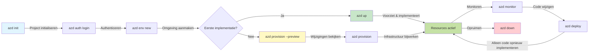
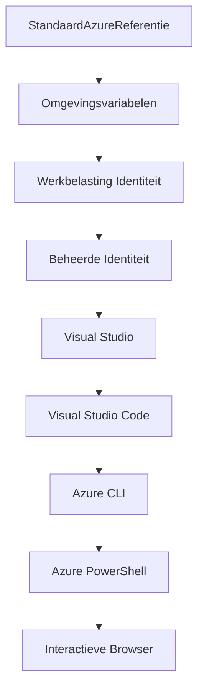

<!--
CO_OP_TRANSLATOR_METADATA:
{
  "original_hash": "e855e899d2705754fe85b04190edd0f0",
  "translation_date": "2025-11-21T16:46:59+00:00",
  "source_file": "docs/getting-started/azd-basics.md",
  "language_code": "nl"
}
-->
# AZD Basisprincipes - Begrijpen van Azure Developer CLI

# AZD Basisprincipes - Kernconcepten en Grondbeginselen

**Hoofdstuk Navigatie:**
- **📚 Cursus Home**: [AZD Voor Beginners](../../README.md)
- **📖 Huidig Hoofdstuk**: Hoofdstuk 1 - Basis & Snelle Start
- **⬅️ Vorige**: [Cursusoverzicht](../../README.md#-chapter-1-foundation--quick-start)
- **➡️ Volgende**: [Installatie & Configuratie](installation.md)
- **🚀 Volgend Hoofdstuk**: [Hoofdstuk 2: AI-First Ontwikkeling](../microsoft-foundry/microsoft-foundry-integration.md)

## Introductie

Deze les introduceert je in Azure Developer CLI (azd), een krachtige command-line tool die je helpt om sneller van lokale ontwikkeling naar Azure-implementatie te gaan. Je leert de fundamentele concepten, kernfuncties en hoe azd het implementeren van cloud-native applicaties vereenvoudigt.

## Leerdoelen

Aan het einde van deze les zul je:
- Begrijpen wat Azure Developer CLI is en het primaire doel ervan
- De kernconcepten van templates, omgevingen en services leren
- Belangrijke functies verkennen, zoals template-gedreven ontwikkeling en Infrastructure as Code
- Het azd-projectstructuur en workflow begrijpen
- Klaar zijn om azd te installeren en configureren voor jouw ontwikkelomgeving

## Leerresultaten

Na het voltooien van deze les kun je:
- De rol van azd in moderne cloudontwikkelingsworkflows uitleggen
- De componenten van een azd-projectstructuur identificeren
- Beschrijven hoe templates, omgevingen en services samenwerken
- De voordelen van Infrastructure as Code met azd begrijpen
- Verschillende azd-commando's en hun doeleinden herkennen

## Wat is Azure Developer CLI (azd)?

Azure Developer CLI (azd) is een command-line tool ontworpen om je sneller van lokale ontwikkeling naar Azure-implementatie te brengen. Het vereenvoudigt het proces van het bouwen, implementeren en beheren van cloud-native applicaties op Azure.

### 🎯 Waarom AZD gebruiken? Een praktijkvoorbeeld

Laten we het implementeren van een eenvoudige webapplicatie met database vergelijken:

#### ❌ ZONDER AZD: Handmatige Azure-implementatie (30+ minuten)

```bash
# Stap 1: Maak resourcegroep aan
az group create --name myapp-rg --location eastus

# Stap 2: Maak App Service Plan aan
az appservice plan create --name myapp-plan \
  --resource-group myapp-rg \
  --sku B1 --is-linux

# Stap 3: Maak Web App aan
az webapp create --name myapp-web-unique123 \
  --resource-group myapp-rg \
  --plan myapp-plan \
  --runtime "NODE:18-lts"

# Stap 4: Maak Cosmos DB-account aan (10-15 minuten)
az cosmosdb create --name myapp-cosmos-unique123 \
  --resource-group myapp-rg \
  --kind MongoDB

# Stap 5: Maak database aan
az cosmosdb mongodb database create \
  --account-name myapp-cosmos-unique123 \
  --resource-group myapp-rg \
  --name tododb

# Stap 6: Maak collectie aan
az cosmosdb mongodb collection create \
  --account-name myapp-cosmos-unique123 \
  --resource-group myapp-rg \
  --database-name tododb \
  --name todos

# Stap 7: Verkrijg verbindingsreeks
CONN_STR=$(az cosmosdb keys list \
  --name myapp-cosmos-unique123 \
  --resource-group myapp-rg \
  --type connection-strings \
  --query "connectionStrings[0].connectionString" -o tsv)

# Stap 8: Configureer app-instellingen
az webapp config appsettings set \
  --name myapp-web-unique123 \
  --resource-group myapp-rg \
  --settings MONGODB_URI="$CONN_STR"

# Stap 9: Schakel logging in
az webapp log config --name myapp-web-unique123 \
  --resource-group myapp-rg \
  --application-logging filesystem \
  --detailed-error-messages true

# Stap 10: Stel Application Insights in
az monitor app-insights component create \
  --app myapp-insights \
  --location eastus \
  --resource-group myapp-rg

# Stap 11: Koppel App Insights aan Web App
INSTRUMENTATION_KEY=$(az monitor app-insights component show \
  --app myapp-insights \
  --resource-group myapp-rg \
  --query "instrumentationKey" -o tsv)

az webapp config appsettings set \
  --name myapp-web-unique123 \
  --resource-group myapp-rg \
  --settings APPINSIGHTS_INSTRUMENTATIONKEY="$INSTRUMENTATION_KEY"

# Stap 12: Bouw applicatie lokaal
npm install
npm run build

# Stap 13: Maak implementatiepakket
zip -r app.zip . -x "*.git*" "node_modules/*"

# Stap 14: Implementeer applicatie
az webapp deployment source config-zip \
  --resource-group myapp-rg \
  --name myapp-web-unique123 \
  --src app.zip

# Stap 15: Wacht en bid dat het werkt 🙏
# (Geen geautomatiseerde validatie, handmatige tests vereist)
```

**Problemen:**
- ❌ Meer dan 15 commando's om te onthouden en uit te voeren
- ❌ 30-45 minuten handmatig werk
- ❌ Makkelijk om fouten te maken (typefouten, verkeerde parameters)
- ❌ Connectiestrings zichtbaar in terminalgeschiedenis
- ❌ Geen automatische rollback bij fouten
- ❌ Moeilijk te reproduceren voor teamleden
- ❌ Elke keer anders (niet reproduceerbaar)

#### ✅ MET AZD: Geautomatiseerde implementatie (5 commando's, 10-15 minuten)

```bash
# Stap 1: Initialiseer vanuit sjabloon
azd init --template todo-nodejs-mongo

# Stap 2: Verifiëren
azd auth login

# Stap 3: Maak omgeving aan
azd env new dev

# Stap 4: Voorvertoning van wijzigingen (optioneel maar aanbevolen)
azd provision --preview

# Stap 5: Alles implementeren
azd up

# ✨ Klaar! Alles is geïmplementeerd, geconfigureerd en gemonitord
```

**Voordelen:**
- ✅ **5 commando's** versus meer dan 15 handmatige stappen
- ✅ **10-15 minuten** totale tijd (voornamelijk wachten op Azure)
- ✅ **Geen fouten** - geautomatiseerd en getest
- ✅ **Geheimen veilig beheerd** via Key Vault
- ✅ **Automatische rollback** bij fouten
- ✅ **Volledig reproduceerbaar** - hetzelfde resultaat elke keer
- ✅ **Teamklaar** - iedereen kan implementeren met dezelfde commando's
- ✅ **Infrastructure as Code** - versiebeheer van Bicep-templates
- ✅ **Ingebouwde monitoring** - Application Insights automatisch geconfigureerd

### 📊 Tijd- en foutreductie

| Metriek | Handmatige Implementatie | AZD Implementatie | Verbetering |
|:-------|:--------------------------|:------------------|:------------|
| **Commando's** | Meer dan 15 | 5 | 67% minder |
| **Tijd** | 30-45 min | 10-15 min | 60% sneller |
| **Foutpercentage** | ~40% | <5% | 88% reductie |
| **Consistentie** | Laag (handmatig) | 100% (geautomatiseerd) | Perfect |
| **Team Onboarding** | 2-4 uur | 30 minuten | 75% sneller |
| **Rollback Tijd** | Meer dan 30 min (handmatig) | 2 min (geautomatiseerd) | 93% sneller |

## Kernconcepten

### Templates
Templates vormen de basis van azd. Ze bevatten:
- **Applicatiecode** - Jouw broncode en afhankelijkheden
- **Infrastructuurdefinities** - Azure-resources gedefinieerd in Bicep of Terraform
- **Configuratiebestanden** - Instellingen en omgevingsvariabelen
- **Implementatiescripts** - Geautomatiseerde implementatieworkflows

### Omgevingen
Omgevingen vertegenwoordigen verschillende implementatiedoelen:
- **Ontwikkeling** - Voor testen en ontwikkeling
- **Staging** - Pre-productieomgeving
- **Productie** - Live productieomgeving

Elke omgeving heeft zijn eigen:
- Azure resource group
- Configuratie-instellingen
- Implementatiestatus

### Services
Services zijn de bouwstenen van jouw applicatie:
- **Frontend** - Webapplicaties, SPAs
- **Backend** - API's, microservices
- **Database** - Datastorage-oplossingen
- **Opslag** - Bestands- en blobopslag

## Belangrijke functies

### 1. Template-gedreven Ontwikkeling
```bash
# Blader door beschikbare sjablonen
azd template list

# Initialiseer vanuit een sjabloon
azd init --template <template-name>
```

### 2. Infrastructure as Code
- **Bicep** - Azure's domeinspecifieke taal
- **Terraform** - Multi-cloud infrastructuurtool
- **ARM Templates** - Azure Resource Manager templates

### 3. Geïntegreerde Workflows
```bash
# Volledige implementatieworkflow
azd up            # Voorzien + Implementeren dit is hands-off voor de eerste installatie

# 🧪 NIEUW: Bekijk infrastructuurwijzigingen voorafgaand aan implementatie (VEILIG)
azd provision --preview    # Simuleer infrastructuurimplementatie zonder wijzigingen door te voeren

azd provision     # Maak Azure-resources aan als je de infrastructuur bijwerkt gebruik dit
azd deploy        # Implementeer applicatiecode of herimplementeer applicatiecode na een update
azd down          # Ruim resources op
```

#### 🛡️ Veilige Infrastructuurplanning met Preview
Het `azd provision --preview` commando is een gamechanger voor veilige implementaties:
- **Dry-run analyse** - Laat zien wat er wordt aangemaakt, gewijzigd of verwijderd
- **Geen risico** - Er worden geen daadwerkelijke wijzigingen aangebracht in jouw Azure-omgeving
- **Team samenwerking** - Deel previewresultaten vóór implementatie
- **Kostenraming** - Begrijp resourcekosten vóór commitment

```bash
# Voorbeeld preview workflow
azd provision --preview           # Zie wat er zal veranderen
# Bekijk de output, bespreek met het team
azd provision                     # Pas wijzigingen toe met vertrouwen
```

### 📊 Visueel: AZD Ontwikkelingsworkflow


**Workflow Uitleg:**
1. **Init** - Start met template of nieuw project
2. **Auth** - Authenticeren met Azure
3. **Omgeving** - Maak geïsoleerde implementatieomgeving
4. **Preview** - 🆕 Altijd infrastructuurwijzigingen eerst previewen (veilige praktijk)
5. **Provision** - Maak/update Azure-resources
6. **Deploy** - Push jouw applicatiecode
7. **Monitor** - Observeer applicatieprestaties
8. **Itereer** - Maak wijzigingen en implementeer code opnieuw
9. **Opruimen** - Verwijder resources wanneer klaar

### 4. Omgevingsbeheer
```bash
# Maak en beheer omgevingen
azd env new <environment-name>
azd env select <environment-name>
azd env list
```

## 📁 Projectstructuur

Een typische azd-projectstructuur:
```
my-app/
├── .azd/                    # azd configuration
│   └── config.json
├── .azure/                  # Azure deployment artifacts
├── .devcontainer/          # Development container config
├── .github/workflows/      # GitHub Actions
├── .vscode/               # VS Code settings
├── infra/                 # Infrastructure code
│   ├── main.bicep        # Main infrastructure template
│   ├── main.parameters.json
│   └── modules/          # Reusable modules
├── src/                  # Application source code
│   ├── api/             # Backend services
│   └── web/             # Frontend application
├── azure.yaml           # azd project configuration
└── README.md
```

## 🔧 Configuratiebestanden

### azure.yaml
Het belangrijkste projectconfiguratiebestand:
```yaml
name: my-awesome-app
metadata:
  template: my-template@1.0.0

services:
  web:
    project: ./src/web
    language: js
    host: appservice
  api:
    project: ./src/api
    language: js
    host: appservice

hooks:
  preprovision:
    shell: pwsh
    run: echo "Preparing to provision..."
```

### .azure/config.json
Omgevingsspecifieke configuratie:
```json
{
  "version": 1,
  "defaultEnvironment": "dev",
  "environments": {
    "dev": {
      "subscriptionId": "your-subscription-id",
      "location": "eastus"
    }
  }
}
```

## 🎪 Veelvoorkomende Workflows met Praktijkoefeningen

> **💡 Leertip:** Volg deze oefeningen in volgorde om jouw AZD-vaardigheden stapsgewijs op te bouwen.

### 🎯 Oefening 1: Initialiseer Jouw Eerste Project

**Doel:** Maak een AZD-project en verken de structuur

**Stappen:**
```bash
# Gebruik een bewezen sjabloon
azd init --template todo-nodejs-mongo

# Verken de gegenereerde bestanden
ls -la  # Bekijk alle bestanden, inclusief verborgen bestanden

# Belangrijke bestanden aangemaakt:
# - azure.yaml (hoofdconfiguratie)
# - infra/ (infrastructuurcode)
# - src/ (applicatiecode)
```

**✅ Succes:** Je hebt azure.yaml, infra/, en src/ mappen

---

### 🎯 Oefening 2: Implementeer naar Azure

**Doel:** Voltooi een end-to-end implementatie

**Stappen:**
```bash
# 1. Verifiëren
az login && azd auth login

# 2. Maak omgeving aan
azd env new dev
azd env set AZURE_LOCATION eastus

# 3. Voorvertoning van wijzigingen (AANBEVOLEN)
azd provision --preview

# 4. Alles implementeren
azd up

# 5. Verifieer implementatie
azd show    # Bekijk de URL van je app
```

**Verwachte Tijd:** 10-15 minuten  
**✅ Succes:** Applicatie-URL opent in browser

---

### 🎯 Oefening 3: Meerdere Omgevingen

**Doel:** Implementeer naar dev en staging

**Stappen:**
```bash
# Heb al dev, maak staging aan
azd env new staging
azd env set AZURE_LOCATION westus2
azd up

# Wissel tussen hen
azd env list
azd env select dev
```

**✅ Succes:** Twee aparte resource groups in Azure Portal

---

### 🛡️ Schone Start: `azd down --force --purge`

Wanneer je volledig opnieuw wilt beginnen:

```bash
azd down --force --purge
```

**Wat het doet:**
- `--force`: Geen bevestigingsprompts
- `--purge`: Verwijdert alle lokale status en Azure-resources

**Gebruik wanneer:**
- Implementatie halverwege is mislukt
- Wisselen van projecten
- Frisse start nodig

---

## 🎪 Originele Workflow Referentie

### Een Nieuw Project Starten
```bash
# Methode 1: Gebruik bestaande sjabloon
azd init --template todo-nodejs-mongo

# Methode 2: Begin vanaf nul
azd init

# Methode 3: Gebruik huidige map
azd init .
```

### Ontwikkelingscyclus
```bash
# Stel ontwikkelomgeving in
azd auth login
azd env new dev
azd env select dev

# Alles implementeren
azd up

# Wijzigingen aanbrengen en opnieuw implementeren
azd deploy

# Opruimen wanneer klaar
azd down --force --purge # opdracht in de Azure Developer CLI is een **harde reset** voor je omgeving—vooral handig bij het oplossen van mislukte implementaties, het opruimen van verweesde resources, of het voorbereiden op een nieuwe implementatie.
```

## Begrijpen van `azd down --force --purge`
Het `azd down --force --purge` commando is een krachtige manier om jouw azd-omgeving en alle bijbehorende resources volledig te verwijderen. Hier is een overzicht van wat elke vlag doet:
```
--force
```
- Slaat bevestigingsprompts over.
- Handig voor automatisering of scripting waar handmatige invoer niet mogelijk is.
- Zorgt ervoor dat de verwijdering doorgaat zonder onderbreking, zelfs als de CLI inconsistenties detecteert.

```
--purge
```
Verwijdert **alle bijbehorende metadata**, inclusief:
Omgevingsstatus
Lokale `.azure` map
Gecachte implementatie-informatie
Voorkomt dat azd "onthoudt" eerdere implementaties, wat problemen kan veroorzaken zoals niet-overeenkomende resource groups of verouderde registry-referenties.

### Waarom beide gebruiken?
Wanneer je vastloopt met `azd up` door resterende status of gedeeltelijke implementaties, zorgt deze combinatie voor een **schone start**.

Het is vooral handig na handmatige resourceverwijderingen in de Azure Portal of bij het wisselen van templates, omgevingen of resource group naamgevingsconventies.

### Beheer van Meerdere Omgevingen
```bash
# Maak stagingomgeving
azd env new staging
azd env select staging
azd up

# Schakel terug naar dev
azd env select dev

# Vergelijk omgevingen
azd env list
```

## 🔐 Authenticatie en Referenties

Het begrijpen van authenticatie is cruciaal voor succesvolle azd-implementaties. Azure gebruikt meerdere authenticatiemethoden, en azd maakt gebruik van dezelfde credential chain die door andere Azure-tools wordt gebruikt.

### Azure CLI Authenticatie (`az login`)

Voordat je azd gebruikt, moet je je authenticeren bij Azure. De meest voorkomende methode is via Azure CLI:

```bash
# Interactieve login (opent browser)
az login

# Inloggen met specifieke tenant
az login --tenant <tenant-id>

# Inloggen met service-principal
az login --service-principal -u <app-id> -p <password> --tenant <tenant-id>

# Controleer huidige loginstatus
az account show

# Lijst beschikbare abonnementen
az account list --output table

# Stel standaardabonnement in
az account set --subscription <subscription-id>
```

### Authenticatiestroom
1. **Interactieve Login**: Opent jouw standaardbrowser voor authenticatie
2. **Device Code Flow**: Voor omgevingen zonder browsertoegang
3. **Service Principal**: Voor automatisering en CI/CD-scenario's
4. **Managed Identity**: Voor Azure-gehoste applicaties

### DefaultAzureCredential Chain

`DefaultAzureCredential` is een credential type dat een vereenvoudigde authenticatie-ervaring biedt door automatisch meerdere credential bronnen in een specifieke volgorde te proberen:

#### Credential Chain Volgorde

#### 1. Omgevingsvariabelen
```bash
# Stel omgevingsvariabelen in voor service-principal
export AZURE_CLIENT_ID="<app-id>"
export AZURE_CLIENT_SECRET="<password>"
export AZURE_TENANT_ID="<tenant-id>"
```

#### 2. Workload Identity (Kubernetes/GitHub Actions)
Automatisch gebruikt in:
- Azure Kubernetes Service (AKS) met Workload Identity
- GitHub Actions met OIDC-federatie
- Andere federatieve identiteitsscenario's

#### 3. Managed Identity
Voor Azure-resources zoals:
- Virtuele Machines
- App Service
- Azure Functions
- Container Instances

```bash
# Controleer of er wordt uitgevoerd op een Azure-resource met beheerde identiteit
az account show --query "user.type" --output tsv
# Retourneert: "servicePrincipal" als er gebruik wordt gemaakt van beheerde identiteit
```

#### 4. Integratie met Ontwikkeltools
- **Visual Studio**: Gebruikt automatisch ingelogd account
- **VS Code**: Gebruikt Azure Account extensie referenties
- **Azure CLI**: Gebruikt `az login` referenties (meest gebruikelijk voor lokale ontwikkeling)

### AZD Authenticatie Instellen

```bash
# Methode 1: Gebruik Azure CLI (Aanbevolen voor ontwikkeling)
az login
azd auth login  # Gebruikt bestaande Azure CLI-referenties

# Methode 2: Directe azd-authenticatie
azd auth login --use-device-code  # Voor headless omgevingen

# Methode 3: Controleer de authenticatiestatus
azd auth login --check-status

# Methode 4: Uitloggen en opnieuw authenticeren
azd auth logout
azd auth login
```

### Authenticatie Best Practices

#### Voor Lokale Ontwikkeling
```bash
# 1. Inloggen met Azure CLI
az login

# 2. Verifieer de juiste abonnement
az account show
az account set --subscription "Your Subscription Name"

# 3. Gebruik azd met bestaande inloggegevens
azd auth login
```

#### Voor CI/CD Pipelines
```yaml
# GitHub Actions example
- name: Azure Login
  uses: azure/login@v1
  with:
    creds: ${{ secrets.AZURE_CREDENTIALS }}

- name: Deploy with azd
  run: |
    azd auth login --client-id ${{ secrets.AZURE_CLIENT_ID }} \
                    --client-secret ${{ secrets.AZURE_CLIENT_SECRET }} \
                    --tenant-id ${{ secrets.AZURE_TENANT_ID }}
    azd up --no-prompt
```

#### Voor Productieomgevingen
- Gebruik **Managed Identity** bij gebruik van Azure-resources
- Gebruik **Service Principal** voor automatiseringsscenario's
- Vermijd het opslaan van referenties in code of configuratiebestanden
- Gebruik **Azure Key Vault** voor gevoelige configuratie

### Veelvoorkomende Authenticatieproblemen en Oplossingen

#### Probleem: "Geen abonnement gevonden"
```bash
# Oplossing: Stel standaardabonnement in
az account list --output table
az account set --subscription "<subscription-id>"
azd env set AZURE_SUBSCRIPTION_ID "<subscription-id>"
```

#### Probleem: "Onvoldoende rechten"
```bash
# Oplossing: Controleer en wijs vereiste rollen toe
az role assignment list --assignee $(az account show --query user.name --output tsv)

# Algemene vereiste rollen:
# - Bijdrager (voor resourcebeheer)
# - Gebruikerstoegangbeheerder (voor roltoewijzingen)
```

#### Probleem: "Token verlopen"
```bash
# Oplossing: Opnieuw authenticeren
az logout
az login
azd auth logout
azd auth login
```

### Authenticatie in Verschillende Scenario's

#### Lokale Ontwikkeling
```bash
# Persoonlijke ontwikkelingsrekening
az login
azd auth login
```

#### Teamontwikkeling
```bash
# Gebruik specifieke huurder voor organisatie
az login --tenant contoso.onmicrosoft.com
azd auth login
```

#### Multi-tenant Scenario's
```bash
# Wissel tussen huurders
az login --tenant tenant1.onmicrosoft.com
# Implementeren naar huurder 1
azd up

az login --tenant tenant2.onmicrosoft.com  
# Implementeren naar huurder 2
azd up
```

### Veiligheidsoverwegingen

1. **Credential Opslag**: Sla nooit referenties op in broncode
2. **Scope Beperking**: Gebruik het principe van minimale rechten voor service principals
3. **Tokenrotatie**: Draai regelmatig service principal geheimen
4. **Audit Trail**: Monitor authenticatie- en implementatieactiviteiten
5. **Netwerkbeveiliging**: Gebruik waar mogelijk private endpoints

### Problemen met Authenticatie Oplossen

```bash
# Problemen met authenticatie debuggen
azd auth login --check-status
az account show
az account get-access-token

# Veelvoorkomende diagnostische commando's
whoami                          # Huidige gebruikerscontext
az ad signed-in-user show      # Azure AD gebruikersdetails
az group list                  # Toegang tot resources testen
```

## Begrijpen van `azd down --force --purge`

### Ontdekking
```bash
azd template list              # Blader door sjablonen
azd template show <template>   # Sjabloondetails
azd init --help               # Initialisatie-opties
```

### Projectbeheer
```bash
azd show                     # Projectoverzicht
azd env show                 # Huidige omgeving
azd config list             # Configuratie-instellingen
```

### Monitoring
```bash
azd monitor                  # Open Azure-portaal
azd pipeline config          # Stel CI/CD in
azd logs                     # Bekijk applicatielogs
```

## Best Practices

### 1. Gebruik Betekenisvolle Namen
```bash
# Goed
azd env new production-east
azd init --template web-app-secure

# Vermijd
azd env new env1
azd init --template template1
```

### 2. Maak Gebruik van Templates
- Begin met bestaande templates
- Pas aan voor jouw behoeften
- Maak herbruikbare templates voor jouw organisatie

### 3. Omgevingsisolatie
- Gebruik aparte omgevingen voor dev/staging/prod
- Implementeer nooit direct naar productie vanaf een lokale machine
- Gebruik CI/CD-pipelines voor productie-implementaties

### 4. Configuratiebeheer
- Gebruik omgevingsvariabelen voor gevoelige gegevens
- Houd configuratie in versiebeheer
- Documenteer omgevingsspecifieke instellingen

## Leerprogressie

### Beginner (Week 1-2)
1. Installeer azd en authenticeer
2. Implementeer een eenvoudig template
3. Begrijp projectstructuur
4. Leer basiscommando's (up, down, deploy)

### Intermediate (Week 3-4)
1. Pas templates aan
2. Beheer meerdere omgevingen
3. Begrijp infrastructuurcode
4. Stel CI/CD-pipelines in

### Gevorderd (Week 5+)
1. Maak aangepaste templates
2. Geavanceerde infrastructuurpatronen
3. Multi-regio implementaties
4. Configuraties van ondernemingsniveau

## Volgende Stappen

**📖 Ga verder met Hoofdstuk 1:**
- [Installatie & Setup](installation.md) - Installeer en configureer azd
- [Je Eerste Project](first-project.md) - Volledige praktische tutorial
- [Configuratiehandleiding](configuration.md) - Geavanceerde configuratieopties

**🎯 Klaar voor het volgende hoofdstuk?**
- [Hoofdstuk 2: AI-First Ontwikkeling](../microsoft-foundry/microsoft-foundry-integration.md) - Begin met het bouwen van AI-toepassingen

## Aanvullende Bronnen

- [Azure Developer CLI Overzicht](https://learn.microsoft.com/en-us/azure/developer/azure-developer-cli/)
- [Template Galerij](https://azure.github.io/awesome-azd/)
- [Community Voorbeelden](https://github.com/Azure-Samples)

---

## 🙋 Veelgestelde Vragen

### Algemene Vragen

**V: Wat is het verschil tussen AZD en Azure CLI?**

A: Azure CLI (`az`) is bedoeld voor het beheren van individuele Azure-resources. AZD (`azd`) is bedoeld voor het beheren van volledige applicaties:

```bash
# Azure CLI - Beheer van resources op laag niveau
az webapp create --name myapp --resource-group rg
az sql server create --name myserver --resource-group rg
# ...veel meer commando's nodig

# AZD - Beheer op applicatieniveau
azd up  # Zet volledige app in met alle resources
```

**Zie het zo:**
- `az` = Werken met individuele Lego-steentjes
- `azd` = Werken met complete Lego-sets

---

**V: Moet ik Bicep of Terraform kennen om AZD te gebruiken?**

A: Nee! Begin met templates:
```bash
# Gebruik bestaande sjabloon - geen IaC-kennis nodig
azd init --template todo-nodejs-mongo
azd up
```

Je kunt later Bicep leren om infrastructuur aan te passen. Templates bieden werkende voorbeelden om van te leren.

---

**V: Hoeveel kost het om AZD-templates te gebruiken?**

A: Kosten variëren per template. De meeste ontwikkeltemplates kosten $50-150/maand:

```bash
# Bekijk kosten voordat u implementeert
azd provision --preview

# Ruim altijd op wanneer niet in gebruik
azd down --force --purge  # Verwijdert alle resources
```

**Pro tip:** Gebruik gratis niveaus waar mogelijk:
- App Service: F1 (Gratis) niveau
- Azure OpenAI: 50.000 tokens/maand gratis
- Cosmos DB: 1000 RU/s gratis niveau

---

**V: Kan ik AZD gebruiken met bestaande Azure-resources?**

A: Ja, maar het is eenvoudiger om opnieuw te beginnen. AZD werkt het beste als het de volledige levenscyclus beheert. Voor bestaande resources:

```bash
# Optie 1: Importeer bestaande resources (geavanceerd)
azd init
# Wijzig vervolgens infra/ om naar bestaande resources te verwijzen

# Optie 2: Begin opnieuw (aanbevolen)
azd init --template matching-your-stack
azd up  # Creëert nieuwe omgeving
```

---

**V: Hoe deel ik mijn project met teamgenoten?**

A: Commit het AZD-project naar Git (maar NIET de .azure-map):

```bash
# Staat standaard al in .gitignore
.azure/        # Bevat geheimen en omgevingsgegevens
*.env          # Omgevingsvariabelen

# Teamleden toen:
git clone <your-repo>
azd auth login
azd env new <their-name>-dev
azd up
```

Iedereen krijgt identieke infrastructuur vanuit dezelfde templates.

---

### Problemen Oplossen

**V: "azd up" is halverwege mislukt. Wat moet ik doen?**

A: Controleer de fout, los het op en probeer opnieuw:

```bash
# Bekijk gedetailleerde logboeken
azd show

# Veelvoorkomende oplossingen:

# 1. Als quotum overschreden:
azd env set AZURE_LOCATION "westus2"  # Probeer een andere regio

# 2. Als er een conflict is met de resourcenaam:
azd down --force --purge  # Schone lei
azd up  # Opnieuw proberen

# 3. Als authenticatie verlopen is:
az login
azd auth login
azd up
```

**Meest voorkomende probleem:** Verkeerde Azure-abonnement geselecteerd
```bash
az account list --output table
az account set --subscription "<correct-subscription>"
```

---

**V: Hoe implementeer ik alleen codewijzigingen zonder opnieuw te voorzien?**

A: Gebruik `azd deploy` in plaats van `azd up`:

```bash
azd up          # Eerste keer: voorziening + implementatie (langzaam)

# Maak codewijzigingen...

azd deploy      # Volgende keren: alleen implementeren (snel)
```

Snelheidsvergelijking:
- `azd up`: 10-15 minuten (voorzien van infrastructuur)
- `azd deploy`: 2-5 minuten (alleen code)

---

**V: Kan ik de infrastructuurtemplates aanpassen?**

A: Ja! Bewerk de Bicep-bestanden in `infra/`:

```bash
# Na azd init
cd infra/
code main.bicep  # Bewerken in VS Code

# Wijzigingen bekijken
azd provision --preview

# Wijzigingen toepassen
azd provision
```

**Tip:** Begin klein - wijzig eerst SKUs:
```bicep
// infra/main.bicep
sku: {
  name: 'B1'  // Change to 'P1V2' for production
}
```

---

**V: Hoe verwijder ik alles wat AZD heeft aangemaakt?**

A: Eén opdracht verwijdert alle resources:

```bash
azd down --force --purge

# Dit verwijdert:
# - Alle Azure-resources
# - Resourcegroep
# - Lokale omgevingsstatus
# - Gecachte implementatiegegevens
```

**Altijd uitvoeren wanneer:**
- Testen van een template is voltooid
- Overstappen naar een ander project
- Opnieuw willen beginnen

**Kostenbesparing:** Het verwijderen van ongebruikte resources = $0 kosten

---

**V: Wat als ik per ongeluk resources in Azure Portal heb verwijderd?**

A: AZD-status kan niet meer synchroon zijn. Begin opnieuw:

```bash
# 1. Verwijder lokale status
azd down --force --purge

# 2. Begin opnieuw
azd up

# Alternatief: Laat AZD detecteren en oplossen
azd provision  # Zal ontbrekende resources creëren
```

---

### Geavanceerde Vragen

**V: Kan ik AZD gebruiken in CI/CD-pijplijnen?**

A: Ja! Voorbeeld met GitHub Actions:

```yaml
# .github/workflows/deploy.yml
name: Deploy with AZD

on:
  push:
    branches: [main]

jobs:
  deploy:
    runs-on: ubuntu-latest
    steps:
      - uses: actions/checkout@v2
      
      - name: Install azd
        run: curl -fsSL https://aka.ms/install-azd.sh | bash
      
      - name: Azure Login
        run: |
          azd auth login \
            --client-id ${{ secrets.AZURE_CLIENT_ID }} \
            --client-secret ${{ secrets.AZURE_CLIENT_SECRET }} \
            --tenant-id ${{ secrets.AZURE_TENANT_ID }}
      
      - name: Deploy
        run: azd up --no-prompt
```

---

**V: Hoe ga ik om met geheimen en gevoelige gegevens?**

A: AZD integreert automatisch met Azure Key Vault:

```bash
# Geheimen worden opgeslagen in Key Vault, niet in code
azd env set DATABASE_PASSWORD "$(openssl rand -base64 32)"

# AZD automatisch:
# 1. Maakt Key Vault aan
# 2. Slaat geheim op
# 3. Verleent app toegang via Managed Identity
# 4. Injecteert tijdens runtime
```

**Nooit committen:**
- `.azure/` map (bevat omgevingsgegevens)
- `.env` bestanden (lokale geheimen)
- Connectiestrings

---

**V: Kan ik implementeren naar meerdere regio's?**

A: Ja, maak een omgeving per regio:

```bash
# Oost VS omgeving
azd env new prod-eastus
azd env set AZURE_LOCATION eastus
azd up

# West Europa omgeving
azd env new prod-westeurope
azd env set AZURE_LOCATION westeurope
azd up

# Elke omgeving is onafhankelijk
azd env list
```

Voor echte multi-regio apps, pas Bicep-templates aan om tegelijkertijd naar meerdere regio's te implementeren.

---

**V: Waar kan ik hulp krijgen als ik vastloop?**

1. **AZD Documentatie:** https://learn.microsoft.com/azure/developer/azure-developer-cli/
2. **GitHub Issues:** https://github.com/Azure/azure-dev/issues
3. **Discord:** [Azure Discord](https://discord.gg/microsoft-azure) - #azure-developer-cli kanaal
4. **Stack Overflow:** Tag `azure-developer-cli`
5. **Deze Cursus:** [Probleemoplossingsgids](../troubleshooting/common-issues.md)

**Pro tip:** Voordat je een vraag stelt, voer uit:
```bash
azd show       # Toont huidige status
azd version    # Toont jouw versie
```
Voeg deze informatie toe aan je vraag voor snellere hulp.

---

## 🎓 Wat Nu?

Je begrijpt nu de basisprincipes van AZD. Kies je pad:

### 🎯 Voor Beginners:
1. **Volgende:** [Installatie & Setup](installation.md) - Installeer AZD op je machine
2. **Daarna:** [Je Eerste Project](first-project.md) - Implementeer je eerste app
3. **Oefen:** Voltooi alle 3 oefeningen in deze les

### 🚀 Voor AI-ontwikkelaars:
1. **Sla over naar:** [Hoofdstuk 2: AI-First Ontwikkeling](../microsoft-foundry/microsoft-foundry-integration.md)
2. **Implementeer:** Begin met `azd init --template get-started-with-ai-chat`
3. **Leer:** Bouw terwijl je implementeert

### 🏗️ Voor Ervaren Ontwikkelaars:
1. **Bekijk:** [Configuratiehandleiding](configuration.md) - Geavanceerde instellingen
2. **Verken:** [Infrastructuur als Code](../deployment/provisioning.md) - Diepgaande Bicep-handleiding
3. **Bouw:** Maak aangepaste templates voor jouw stack

---

**Hoofdstuk Navigatie:**
- **📚 Cursus Home**: [AZD Voor Beginners](../../README.md)
- **📖 Huidig Hoofdstuk**: Hoofdstuk 1 - Basis & Snelle Start  
- **⬅️ Vorige**: [Cursus Overzicht](../../README.md#-chapter-1-foundation--quick-start)
- **➡️ Volgende**: [Installatie & Setup](installation.md)
- **🚀 Volgend Hoofdstuk**: [Hoofdstuk 2: AI-First Ontwikkeling](../microsoft-foundry/microsoft-foundry-integration.md)

---

<!-- CO-OP TRANSLATOR DISCLAIMER START -->
**Disclaimer**:  
Dit document is vertaald met behulp van de AI-vertalingsservice [Co-op Translator](https://github.com/Azure/co-op-translator). Hoewel we streven naar nauwkeurigheid, dient u zich ervan bewust te zijn dat geautomatiseerde vertalingen fouten of onnauwkeurigheden kunnen bevatten. Het originele document in de oorspronkelijke taal moet worden beschouwd als de gezaghebbende bron. Voor kritieke informatie wordt professionele menselijke vertaling aanbevolen. Wij zijn niet aansprakelijk voor misverstanden of verkeerde interpretaties die voortvloeien uit het gebruik van deze vertaling.
<!-- CO-OP TRANSLATOR DISCLAIMER END -->